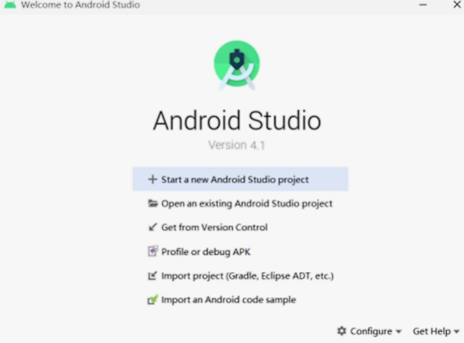

<h1 style="color: #ff90fa;text-align: center;font-size:3em">Android学习笔记</h1>


---


# Android的发展历程

安卓（Android）是一种基于Linux内核（不包含GNU组件）的自由及开放源代码的操作系统。主要使用 于移动设备，如智能手机和平板电脑，由美国Google公司和开放手机联盟领导及开发。Android操作系 统最初由Andy Rubin开发，主要支持手机。

* 2005年8月由Google收购注资。 
* 2007年11月，Google与84家硬件制造商、软件开发商及电信营运商组建开放手机联盟共同研发改 良Android系统，并发布了Android的源代码。 
* 第一部Android智能手机发布于2008年10月，由 HTC 公司制造。Android逐渐扩展到平板电脑及 其他领域上，如电视、数码相机、游戏机、智能手表、车载大屏、智能家居等，并逐渐成为了人们 日常生活中不可或缺的系统软件。 
* 2011年第一季度，Android在全球的市场份额首次超过塞班系统，跃居全球第一。 
* 2013年的第四季度，Android平台手机的全球市场份额已经达到78.1%。2013年09月24日谷歌开 发的操作系统Android在迎来了5岁生日，全世界采用这款系统的设备数量已经达到10亿台。 
* 2019年，谷歌官方宣布全世界有25亿活跃的Android设备，还不包含大多数中国设备。


Android几乎每年都要发布一个大版本，技术的更新迭代非常之快


| Android 版本号 | 对应 API | 发布时间 |
| :------------: | :------: | :------: |
|Android 13 |33 |2022年2月|
|Android 12 |31 |2021年10月|
|Android 11| 30| 2020年9月|
|Android 10| 29 |2019年8月|
|Android 9| 28 |2018年8月|
|Android 8 |26/27| 2017年8月|
|Android 7| 24/25| 2016年8月|
|Android 6| 23| 2015年9月|
|Android 5 |21/22| 2014年6月|
|Android 4.4| 19/20 |2013年9月|


虽然Android基于Linux内核，但是Android手机的应用App主要采用Java语言开发。为了吸引众多的Java 程序员，早期的App开发工具使用Eclipse，通过给Eclipse安装ADT插件，使之支持开发和调试App。然 而Eclipse毕竟不是专门的App开发环境，运行速度也偏慢，因此谷歌公司在2013年5月推出了全新的 Android开发环境—Android Studio。Android Studio基于IntelliJ IDEA演变而来，既保持了IDEA方便快 捷的特点，又增加了Android开发的环境支持。自2015年之后，谷歌公司便停止了ADT的版本更新，转 而重点打造自家的Android Studio，数年升级换代下来，Android Studio的功能愈加丰富，性能也愈高 效，使得它逐步成为主流的App开发环境


# Android Studio

## 开发机配置要求

* 内存要求至少8GB，越大越好。 
* CPU要求1.5GHz以上，越快越好。 
* 硬盘要求系统盘剩余空间10GB以上，越大越好。 
* 要求带无线网卡与USB插槽。
* 必须是64位系统，不能是32位系统
* Windows系统至少为Windows 7，推荐Windows 10，不支持Windows XP


## 下载

https://developer.android.google.cn/studio/index.html


## 安装

双击下载完成的Android Studio安装程序


一直点击下一步


单击对话框右下角的Finish按钮，完成安装配置工作，同时打开Android Studio欢迎界面





## 下载Android的SDK

在Android Studio主界面，依次选择菜单Tools→SDK Manager，或者在Android Studio右上角中单击图标


SDK下载完成，可以到“我的电脑”中打开Android SDK Location指定的SDK保存路径，发现下面还有十几个目录


```sh
PS C:\Users\mao\AppData\Local\Android> ls


    目录: C:\Users\mao\AppData\Local\Android


Mode                 LastWriteTime         Length Name
----                 -------------         ------ ----
d-----         2022/9/15     22:08                Sdk


PS C:\Users\mao\AppData\Local\Android> cd .\Sdk\
PS C:\Users\mao\AppData\Local\Android\Sdk> ls


    目录: C:\Users\mao\AppData\Local\Android\Sdk


Mode                 LastWriteTime         Length Name
----                 -------------         ------ ----
d-----         2022/9/15     22:02                .downloadIntermediates
d-----         2022/9/15     22:03                .temp
d-----         2022/9/15     21:54                build-tools
d-----         2022/9/15     21:04                emulator
d-----         2022/9/15     21:02                extras
d-----         2022/9/15     22:08                fonts
d-----         2022/9/15     21:02                licenses
d-----         2022/3/12     12:57                patcher
d-----         2022/9/15     21:02                platform-tools
d-----         2022/3/12     12:59                platforms
d-----         2022/9/15     22:26                skins
d-----         2022/9/15     21:57                system-images
d-----         2022/3/12     12:58                tools
-a----         2022/9/17     12:35             16 .knownPackages


PS C:\Users\mao\AppData\Local\Android\Sdk>
```


* build-tools目录，存放各版本Android的编译工具。 
* emulator目录，存放模拟器的管理工具。 
* platforms目录，存放各版本Android的资源文件与内核JAR包android.jar。 
* platform-tools目录，存放常用的开发辅助工具，包括客户端驱动程序adb.exe、数据库管理工具 sqlite3.exe，等等。 


## 创建项目


## 创建内置模拟器

所谓模拟器，指的是在电脑上构造一个演示窗口，模拟手机屏幕的App运行效果。App通过编译之后， 只说明代码没有语法错误，若想验证App能否正确运行，还得让它在Android设备上跑起来。这个设备可 以是真实手机，也可以是电脑里的模拟器。依次选择菜单Run→Run （也可按快捷键Shift+F10），或者 选择菜单Run→Run…，在弹出的小窗中选择待运行的模块名称，Android Studio会判断当前是否存在已 经连接的设备，如果已有连接上的设备就在该设备上安装测试App。

因为一开始没有任何已连上的设备，所以运行App会报错“Error running ：No target device found.”， 意思是未找到任何目标设备。此时要先创建一个模拟器，依次选择菜单Tools→AVD Manager，或者在 Android Studio右上角的按钮中单击图标


点击创建


单击许可授权对话框的Accept选项，表示接受上述条款，再单击Next按钮跳到下一页的镜像下载对话框


等待镜像下载完成，单击右下角的Finish按钮


## 运行App

模拟器创建完成后，回到Android Studio的主界面


点击运行按钮


# 运行日志

打开logcat

查看日志：

```sh
2022-09-17 12:52:22.443 6578-6578/? I/android_projec: Late-enabling -Xcheck:jni
2022-09-17 12:52:22.529 6578-6578/? E/android_projec: Unknown bits set in runtime_flags: 0x8000
2022-09-17 12:52:22.533 6578-6578/? W/android_projec: Unexpected CPU variant for X86 using defaults: x86
2022-09-17 12:52:22.939 6578-6646/com.example.my_first_android_project D/libEGL: Emulator has host GPU support, qemu.gles is set to 1.
2022-09-17 12:52:22.939 6578-6646/com.example.my_first_android_project W/libc: Unable to set property "qemu.gles" to "1": connection failed; errno=13 (Permission denied)
2022-09-17 12:52:22.955 6578-6646/com.example.my_first_android_project D/libEGL: loaded /vendor/lib/egl/libEGL_emulation.so
2022-09-17 12:52:22.957 6578-6646/com.example.my_first_android_project D/libEGL: loaded /vendor/lib/egl/libGLESv1_CM_emulation.so
2022-09-17 12:52:22.961 6578-6646/com.example.my_first_android_project D/libEGL: loaded /vendor/lib/egl/libGLESv2_emulation.so
2022-09-17 12:52:23.163 6578-6578/com.example.my_first_android_project W/android_projec: Accessing hidden method Landroid/view/View;->computeFitSystemWindows(Landroid/graphics/Rect;Landroid/graphics/Rect;)Z (greylist, reflection, allowed)
2022-09-17 12:52:23.163 6578-6578/com.example.my_first_android_project W/android_projec: Accessing hidden method Landroid/view/ViewGroup;->makeOptionalFitsSystemWindows()V (greylist, reflection, allowed)
2022-09-17 12:52:23.285 6578-6644/com.example.my_first_android_project D/HostConnection: HostConnection::get() New Host Connection established 0xdbd0eb40, tid 6644
2022-09-17 12:52:23.363 6578-6644/com.example.my_first_android_project D/HostConnection: HostComposition ext ANDROID_EMU_CHECKSUM_HELPER_v1 ANDROID_EMU_dma_v1 ANDROID_EMU_direct_mem ANDROID_EMU_host_composition_v1 ANDROID_EMU_host_composition_v2 ANDROID_EMU_vulkan ANDROID_EMU_deferred_vulkan_commands ANDROID_EMU_vulkan_null_optional_strings ANDROID_EMU_vulkan_create_resources_with_requirements ANDROID_EMU_YUV_Cache ANDROID_EMU_vulkan_ignored_handles ANDROID_EMU_vulkan_free_memory_sync ANDROID_EMU_vulkan_shader_float16_int8 ANDROID_EMU_vulkan_async_queue_submit ANDROID_EMU_sync_buffer_data GL_OES_vertex_array_object GL_KHR_texture_compression_astc_ldr ANDROID_EMU_host_side_tracing ANDROID_EMU_gles_max_version_2 
2022-09-17 12:52:23.375 6578-6644/com.example.my_first_android_project W/OpenGLRenderer: Failed to choose config with EGL_SWAP_BEHAVIOR_PRESERVED, retrying without...
2022-09-17 12:52:23.409 6578-6644/com.example.my_first_android_project D/EGL_emulation: eglCreateContext: 0xe7f01680: maj 2 min 0 rcv 2
2022-09-17 12:52:23.433 6578-6644/com.example.my_first_android_project D/EGL_emulation: eglMakeCurrent: 0xe7f01680: ver 2 0 (tinfo 0xdbd508b0)
2022-09-17 12:52:23.450 6578-6644/com.example.my_first_android_project W/Gralloc3: mapper 3.x is not supported
2022-09-17 12:52:23.451 6578-6644/com.example.my_first_android_project D/HostConnection: createUnique: call
2022-09-17 12:52:23.451 6578-6644/com.example.my_first_android_project D/HostConnection: HostConnection::get() New Host Connection established 0xdbd105d0, tid 6644
2022-09-17 12:52:23.503 6578-6644/com.example.my_first_android_project D/HostConnection: HostComposition ext ANDROID_EMU_CHECKSUM_HELPER_v1 ANDROID_EMU_dma_v1 ANDROID_EMU_direct_mem ANDROID_EMU_host_composition_v1 ANDROID_EMU_host_composition_v2 ANDROID_EMU_vulkan ANDROID_EMU_deferred_vulkan_commands ANDROID_EMU_vulkan_null_optional_strings ANDROID_EMU_vulkan_create_resources_with_requirements ANDROID_EMU_YUV_Cache ANDROID_EMU_vulkan_ignored_handles ANDROID_EMU_vulkan_free_memory_sync ANDROID_EMU_vulkan_shader_float16_int8 ANDROID_EMU_vulkan_async_queue_submit ANDROID_EMU_sync_buffer_data GL_OES_vertex_array_object GL_KHR_texture_compression_astc_ldr ANDROID_EMU_host_side_tracing ANDROID_EMU_gles_max_version_2 
2022-09-17 12:52:23.503 6578-6644/com.example.my_first_android_project D/eglCodecCommon: allocate: Ask for block of size 0x1000
2022-09-17 12:52:23.503 6578-6644/com.example.my_first_android_project D/eglCodecCommon: allocate: ioctl allocate returned offset 0x3ffff6000 size 0x2000
2022-09-17 12:52:23.515 6578-6644/com.example.my_first_android_project D/EGL_emulation: eglMakeCurrent: 0xe7f01680: ver 2 0 (tinfo 0xdbd508b0)
2022-09-17 12:52:31.588 6578-6644/com.example.my_first_android_project D/EGL_emulation: eglMakeCurrent: 0xe7f01680: ver 2 0 (tinfo 0xdbd508b0)
2022-09-17 12:52:35.990 6578-6578/com.example.my_first_android_project W/ActivityThread: handleWindowVisibility: no activity for token android.os.BinderProxy@d5feb6c
2022-09-17 12:52:36.051 6578-6644/com.example.my_first_android_project D/EGL_emulation: eglMakeCurrent: 0xe7f01680: ver 2 0 (tinfo 0xdbd508b0)
```


* Log.e：表示错误信息，比如可能导致程序崩溃的异常。 
* Log.w：表示警告信息。
* Log.i：表示一般消息。 
* Log.d：表示调试信息，可把程序运行时的变量值打印出来，方便跟踪调试。
* Log.v：表示冗余信息


一般而言，日常开发使用Log.d即可


虽然在模拟器上能够看到App的运行，却无法看到App的调试信息。以前写Java代码的时候，通过 System.out.println可以很方便地向IDEA的控制台输出日志，当然Android Studio也允许查看App的运 行日志，只是Android不使用System.out.println，而是采用Log工具打印日志


```java
package com.example.my_first_android_project;

import androidx.appcompat.app.AppCompatActivity;

import android.os.Bundle;
import android.util.Log;

public class MainActivity extends AppCompatActivity
{

    @Override
    protected void onCreate(Bundle savedInstanceState)
    {
        super.onCreate(savedInstanceState);
        setContentView(R.layout.activity_main);
        Log.d("MainActivity", "onCreate: 调试日志");
        Log.i("MainActivity", "onCreate: 日志");
        Log.w("MainActivity", "onCreate: 警告日志", new RuntimeException());
        Log.e("MainActivity", "onCreate: 错误日志", new RuntimeException());
    }

}
```


查看日志（debug级别）


```sh
2022-09-17 13:21:23.203 8137-8137/? I/android_projec: Late-enabling -Xcheck:jni
2022-09-17 13:21:23.222 8137-8137/? E/android_projec: Unknown bits set in runtime_flags: 0x8000
2022-09-17 13:21:23.224 8137-8137/? W/android_projec: Unexpected CPU variant for X86 using defaults: x86
2022-09-17 13:21:23.462 8137-8170/com.example.my_first_android_project D/libEGL: Emulator has host GPU support, qemu.gles is set to 1.
2022-09-17 13:21:23.468 8137-8170/com.example.my_first_android_project W/libc: Unable to set property "qemu.gles" to "1": connection failed; errno=13 (Permission denied)
2022-09-17 13:21:23.461 8137-8137/com.example.my_first_android_project W/RenderThread: type=1400 audit(0.0:49248): avc: denied { write } for name="property_service" dev="tmpfs" ino=8453 scontext=u:r:untrusted_app:s0:c146,c256,c512,c768 tcontext=u:object_r:property_socket:s0 tclass=sock_file permissive=0 app=com.example.my_first_android_project
2022-09-17 13:21:23.498 8137-8170/com.example.my_first_android_project D/libEGL: loaded /vendor/lib/egl/libEGL_emulation.so
2022-09-17 13:21:23.501 8137-8170/com.example.my_first_android_project D/libEGL: loaded /vendor/lib/egl/libGLESv1_CM_emulation.so
2022-09-17 13:21:23.507 8137-8170/com.example.my_first_android_project D/libEGL: loaded /vendor/lib/egl/libGLESv2_emulation.so
2022-09-17 13:21:23.671 8137-8137/com.example.my_first_android_project W/android_projec: Accessing hidden method Landroid/view/View;->computeFitSystemWindows(Landroid/graphics/Rect;Landroid/graphics/Rect;)Z (greylist, reflection, allowed)
2022-09-17 13:21:23.671 8137-8137/com.example.my_first_android_project W/android_projec: Accessing hidden method Landroid/view/ViewGroup;->makeOptionalFitsSystemWindows()V (greylist, reflection, allowed)
2022-09-17 13:21:23.747 8137-8137/com.example.my_first_android_project D/MainActivity: onCreate: 调试日志
2022-09-17 13:21:23.747 8137-8137/com.example.my_first_android_project I/MainActivity: onCreate: 日志
2022-09-17 13:21:23.749 8137-8137/com.example.my_first_android_project W/MainActivity: onCreate: 警告日志
    java.lang.RuntimeException
        at com.example.my_first_android_project.MainActivity.onCreate(MainActivity.java:19)
        at android.app.Activity.performCreate(Activity.java:7802)
        at android.app.Activity.performCreate(Activity.java:7791)
        at android.app.Instrumentation.callActivityOnCreate(Instrumentation.java:1299)
        at android.app.ActivityThread.performLaunchActivity(ActivityThread.java:3245)
        at android.app.ActivityThread.handleLaunchActivity(ActivityThread.java:3409)
        at android.app.servertransaction.LaunchActivityItem.execute(LaunchActivityItem.java:83)
        at android.app.servertransaction.TransactionExecutor.executeCallbacks(TransactionExecutor.java:135)
        at android.app.servertransaction.TransactionExecutor.execute(TransactionExecutor.java:95)
        at android.app.ActivityThread$H.handleMessage(ActivityThread.java:2016)
        at android.os.Handler.dispatchMessage(Handler.java:107)
        at android.os.Looper.loop(Looper.java:214)
        at android.app.ActivityThread.main(ActivityThread.java:7356)
        at java.lang.reflect.Method.invoke(Native Method)
        at com.android.internal.os.RuntimeInit$MethodAndArgsCaller.run(RuntimeInit.java:492)
        at com.android.internal.os.ZygoteInit.main(ZygoteInit.java:930)
2022-09-17 13:21:23.750 8137-8137/com.example.my_first_android_project E/MainActivity: onCreate: 错误日志
    java.lang.RuntimeException
        at com.example.my_first_android_project.MainActivity.onCreate(MainActivity.java:20)
        at android.app.Activity.performCreate(Activity.java:7802)
        at android.app.Activity.performCreate(Activity.java:7791)
        at android.app.Instrumentation.callActivityOnCreate(Instrumentation.java:1299)
        at android.app.ActivityThread.performLaunchActivity(ActivityThread.java:3245)
        at android.app.ActivityThread.handleLaunchActivity(ActivityThread.java:3409)
        at android.app.servertransaction.LaunchActivityItem.execute(LaunchActivityItem.java:83)
        at android.app.servertransaction.TransactionExecutor.executeCallbacks(TransactionExecutor.java:135)
        at android.app.servertransaction.TransactionExecutor.execute(TransactionExecutor.java:95)
        at android.app.ActivityThread$H.handleMessage(ActivityThread.java:2016)
        at android.os.Handler.dispatchMessage(Handler.java:107)
        at android.os.Looper.loop(Looper.java:214)
        at android.app.ActivityThread.main(ActivityThread.java:7356)
        at java.lang.reflect.Method.invoke(Native Method)
        at com.android.internal.os.RuntimeInit$MethodAndArgsCaller.run(RuntimeInit.java:492)
        at com.android.internal.os.ZygoteInit.main(ZygoteInit.java:930)
2022-09-17 13:21:23.817 8137-8168/com.example.my_first_android_project D/HostConnection: HostConnection::get() New Host Connection established 0xdbd0ec80, tid 8168
2022-09-17 13:21:23.833 8137-8168/com.example.my_first_android_project D/HostConnection: HostComposition ext ANDROID_EMU_CHECKSUM_HELPER_v1 ANDROID_EMU_dma_v1 ANDROID_EMU_direct_mem ANDROID_EMU_host_composition_v1 ANDROID_EMU_host_composition_v2 ANDROID_EMU_vulkan ANDROID_EMU_deferred_vulkan_commands ANDROID_EMU_vulkan_null_optional_strings ANDROID_EMU_vulkan_create_resources_with_requirements ANDROID_EMU_YUV_Cache ANDROID_EMU_vulkan_ignored_handles ANDROID_EMU_vulkan_free_memory_sync ANDROID_EMU_vulkan_shader_float16_int8 ANDROID_EMU_vulkan_async_queue_submit ANDROID_EMU_sync_buffer_data GL_OES_vertex_array_object GL_KHR_texture_compression_astc_ldr ANDROID_EMU_host_side_tracing ANDROID_EMU_gles_max_version_2 
2022-09-17 13:21:23.840 8137-8168/com.example.my_first_android_project W/OpenGLRenderer: Failed to choose config with EGL_SWAP_BEHAVIOR_PRESERVED, retrying without...
2022-09-17 13:21:23.875 8137-8168/com.example.my_first_android_project D/EGL_emulation: eglCreateContext: 0xe7f02280: maj 2 min 0 rcv 2
2022-09-17 13:21:23.914 8137-8168/com.example.my_first_android_project D/EGL_emulation: eglMakeCurrent: 0xe7f02280: ver 2 0 (tinfo 0xdbd1dee0)
2022-09-17 13:21:23.923 8137-8168/com.example.my_first_android_project W/Gralloc3: mapper 3.x is not supported
2022-09-17 13:21:23.929 8137-8168/com.example.my_first_android_project D/HostConnection: createUnique: call
2022-09-17 13:21:23.929 8137-8168/com.example.my_first_android_project D/HostConnection: HostConnection::get() New Host Connection established 0xdbd10710, tid 8168
2022-09-17 13:21:23.937 8137-8168/com.example.my_first_android_project D/HostConnection: HostComposition ext ANDROID_EMU_CHECKSUM_HELPER_v1 ANDROID_EMU_dma_v1 ANDROID_EMU_direct_mem ANDROID_EMU_host_composition_v1 ANDROID_EMU_host_composition_v2 ANDROID_EMU_vulkan ANDROID_EMU_deferred_vulkan_commands ANDROID_EMU_vulkan_null_optional_strings ANDROID_EMU_vulkan_create_resources_with_requirements ANDROID_EMU_YUV_Cache ANDROID_EMU_vulkan_ignored_handles ANDROID_EMU_vulkan_free_memory_sync ANDROID_EMU_vulkan_shader_float16_int8 ANDROID_EMU_vulkan_async_queue_submit ANDROID_EMU_sync_buffer_data GL_OES_vertex_array_object GL_KHR_texture_compression_astc_ldr ANDROID_EMU_host_side_tracing ANDROID_EMU_gles_max_version_2 
2022-09-17 13:21:23.937 8137-8168/com.example.my_first_android_project D/eglCodecCommon: allocate: Ask for block of size 0x1000
2022-09-17 13:21:23.937 8137-8168/com.example.my_first_android_project D/eglCodecCommon: allocate: ioctl allocate returned offset 0x3ffff6000 size 0x2000
2022-09-17 13:21:23.946 8137-8168/com.example.my_first_android_project D/EGL_emulation: eglMakeCurrent: 0xe7f02280: ver 2 0 (tinfo 0xdbd1dee0)
```


查看日志（warn级别）


```sh
2022-09-17 13:21:23.222 8137-8137/? E/android_projec: Unknown bits set in runtime_flags: 0x8000
2022-09-17 13:21:23.224 8137-8137/? W/android_projec: Unexpected CPU variant for X86 using defaults: x86
2022-09-17 13:21:23.468 8137-8170/com.example.my_first_android_project W/libc: Unable to set property "qemu.gles" to "1": connection failed; errno=13 (Permission denied)
2022-09-17 13:21:23.461 8137-8137/com.example.my_first_android_project W/RenderThread: type=1400 audit(0.0:49248): avc: denied { write } for name="property_service" dev="tmpfs" ino=8453 scontext=u:r:untrusted_app:s0:c146,c256,c512,c768 tcontext=u:object_r:property_socket:s0 tclass=sock_file permissive=0 app=com.example.my_first_android_project
2022-09-17 13:21:23.671 8137-8137/com.example.my_first_android_project W/android_projec: Accessing hidden method Landroid/view/View;->computeFitSystemWindows(Landroid/graphics/Rect;Landroid/graphics/Rect;)Z (greylist, reflection, allowed)
2022-09-17 13:21:23.671 8137-8137/com.example.my_first_android_project W/android_projec: Accessing hidden method Landroid/view/ViewGroup;->makeOptionalFitsSystemWindows()V (greylist, reflection, allowed)
2022-09-17 13:21:23.749 8137-8137/com.example.my_first_android_project W/MainActivity: onCreate: 警告日志
    java.lang.RuntimeException
        at com.example.my_first_android_project.MainActivity.onCreate(MainActivity.java:19)
        at android.app.Activity.performCreate(Activity.java:7802)
        at android.app.Activity.performCreate(Activity.java:7791)
        at android.app.Instrumentation.callActivityOnCreate(Instrumentation.java:1299)
        at android.app.ActivityThread.performLaunchActivity(ActivityThread.java:3245)
        at android.app.ActivityThread.handleLaunchActivity(ActivityThread.java:3409)
        at android.app.servertransaction.LaunchActivityItem.execute(LaunchActivityItem.java:83)
        at android.app.servertransaction.TransactionExecutor.executeCallbacks(TransactionExecutor.java:135)
        at android.app.servertransaction.TransactionExecutor.execute(TransactionExecutor.java:95)
        at android.app.ActivityThread$H.handleMessage(ActivityThread.java:2016)
        at android.os.Handler.dispatchMessage(Handler.java:107)
        at android.os.Looper.loop(Looper.java:214)
        at android.app.ActivityThread.main(ActivityThread.java:7356)
        at java.lang.reflect.Method.invoke(Native Method)
        at com.android.internal.os.RuntimeInit$MethodAndArgsCaller.run(RuntimeInit.java:492)
        at com.android.internal.os.ZygoteInit.main(ZygoteInit.java:930)
2022-09-17 13:21:23.750 8137-8137/com.example.my_first_android_project E/MainActivity: onCreate: 错误日志
    java.lang.RuntimeException
        at com.example.my_first_android_project.MainActivity.onCreate(MainActivity.java:20)
        at android.app.Activity.performCreate(Activity.java:7802)
        at android.app.Activity.performCreate(Activity.java:7791)
        at android.app.Instrumentation.callActivityOnCreate(Instrumentation.java:1299)
        at android.app.ActivityThread.performLaunchActivity(ActivityThread.java:3245)
        at android.app.ActivityThread.handleLaunchActivity(ActivityThread.java:3409)
        at android.app.servertransaction.LaunchActivityItem.execute(LaunchActivityItem.java:83)
        at android.app.servertransaction.TransactionExecutor.executeCallbacks(TransactionExecutor.java:135)
        at android.app.servertransaction.TransactionExecutor.execute(TransactionExecutor.java:95)
        at android.app.ActivityThread$H.handleMessage(ActivityThread.java:2016)
        at android.os.Handler.dispatchMessage(Handler.java:107)
        at android.os.Looper.loop(Looper.java:214)
        at android.app.ActivityThread.main(ActivityThread.java:7356)
        at java.lang.reflect.Method.invoke(Native Method)
        at com.android.internal.os.RuntimeInit$MethodAndArgsCaller.run(RuntimeInit.java:492)
        at com.android.internal.os.ZygoteInit.main(ZygoteInit.java:930)
2022-09-17 13:21:23.840 8137-8168/com.example.my_first_android_project W/OpenGLRenderer: Failed to choose config with EGL_SWAP_BEHAVIOR_PRESERVED, retrying without...
2022-09-17 13:21:23.923 8137-8168/com.example.my_first_android_project W/Gralloc3: mapper 3.x is not supported
```


# App开发基础

## App的运行环境

App是在手机上运行的一类应用软件，而应用软件依附于操作系统，无论电脑还是手机，刚开机都会显 示桌面，这个桌面便是操作系统的工作台。个人电脑的操作系统主要有微软的Windows和苹果的Mac OS，智能手机流行的操作系统也有两种，分别是安卓手机的Android和苹果手机的iOS。本书讲述的App 开发为Android上的应用开发，Android系统基于Linux内核，但不等于Linux系统，故App应用无法在 Linux系统上运行。


Android Studio是谷歌官方推出的App开发环境，它提供了三种操作系统的安装包，分别是Windows、 Mac和Linux。这就产生一个问题：开发者可以在电脑上安装Android Studio，并使用Android Studio开 发App项目，但是编译出来的App在电脑上跑不起来。这种情况真是令人匪夷所思的，通常学习C语言、 Java或者Python，都能在电脑的开发环境直接观看程序运行过程，就算是J2EE开发，也能在浏览器通过 网页观察程序的运行结果。可是安卓的App应用竟然没法在电脑上直接运行，那该怎样验证App的界面 展示及其业务逻辑是否正确呢？

* 为了提供App开发的功能测试环境，一种办法是利用Android Studio创建内置的模拟器，然后启动内置 模拟器，再在模拟器上运行App应用
* 另一种办法是使用真实手机测试App，该办法在实际开发中更为常见。由于模拟器本身跑在电脑上面， 占用电脑的CPU和内存，会拖累电脑的运行速度


利用真机调试要求具备以下**5个条件**：

1．**使用数据线把手机连到电脑上**

手机的电源线拔掉插头就是数据线。数据线长方形的一端接到电脑的USB接口，即可完成手机与电脑的 连接


2．**在电脑上安装手机的驱动程序**

一般电脑会把手机当作USB存储设备一样安装驱动，大多数情况会自动安装成功。如果遇到少数情况安 装失败，需要先安装手机助手，由助手软件下载并安装对应的手机驱动


3．**打开手机的开发者选项并启用USB调试**

手机出厂后默认关闭开发者选项，需要开启开发者选项才能调试App。打开手机的设置菜单，进入“系统” →“关于手机”→“版本信息”页面，这里有好几个版本项，每个版本项都使劲点击七、八下，总会有某个版 本点击后出现“你将开启开发者模式”的提示。继续点击该版本开启开发者模式，然后退出并重新进入设 置页面，此时就能在“系统”菜单下找到“开发者选项”或“开发人员选项”了。进入“开发者选项”页面，启用 “开发者选项”和“USB调试”两处开关，允许手机通过USB接口安装调试应用


4．**将连接的手机设为文件传输模式，并允许计算机进行USB调试**

手机通过USB数据线连接电脑后，请求选择某种USB连接方式。这里记得选中“传输文件”，因为充电模式不支持调试App。 选完之后手机桌面弹出确认窗口，提示开发者是否允许当前计算机进行USB调试。这里勾选“始终允许使用这台计算机进行调试”选项，再点击右下角的确定按钮，允许计算机在手机上调试App


5．手机要能正常使用

锁屏状态下，Android Studio向手机安装App的行为可能会被拦截，所以要保证手机处于解锁状态，才 能顺利通过电脑安装App到手机上。 有的手机还要求插入SIM卡才能调试App，还有的手机要求登录会员才能调试App，总之如果遇到无法安 装的问题，各种情况都尝试一遍才好。


## App的开发语言

基于安卓系统的App开发主要有两大技术路线，分别是**原生开发和混合开发**。原生开发指的是在移动平 台上利用官方提供的编程语言（例如Java、Kotlin等）、开发工具包（SDK）、开发环境（Android Studio）进行App开发；混合开发指的是结合原生与H5技术开发混合应用，也就是将部分App页面改成 内嵌的网页，这样无须升级App、只要覆盖服务器上的网页，即可动态更新App页面。


不管是原生开发还是混合开发，都要求掌握Android Studio的开发技能，因为混合开发本质上依赖于原生开发。单就原生开发而言，又涉及多种编程语 言，包括Java、Kotlin、C/C++、XML等


### Java

Java是Android开发的主要编程语言，在创建新项目时，弹出项目配置对话框，看见 Language栏默认选择了Java，表示该项目采用Java编码

虽然Android开发需要Java环境，但没要求电脑上必须事先安装JDK，因为Android Studio已经自带了 JRE

单击项目结构对话框左侧的SDK Location，对话框右边从上到下依次排列着“Android SDK location”、 “Android NDK location”、“JDK location”，其中下方的JDK location提示位于Android Studio安装路径的 JRE目录下，它正是Android Studio自带的Java运行环境


Android Studio自带的JRE使用的版本是11


```sh
PS C:\Program Files\Android Studio\jre\bin> ls


    目录: C:\Program Files\Android Studio\jre\bin


Mode                 LastWriteTime         Length Name
----                 -------------         ------ ----
d-----         2022/9/15     20:56                server
-a----         2022/7/11     15:34          30024 attach.dll
-a----         2022/7/11     15:33        1566536 awt.dll
-a----         2022/7/11     15:34          37192 dt_shmem.dll
-a----         2022/7/11     15:33          34632 dt_socket.dll
-a----         2022/7/11     15:34         670024 fontmanager.dll
-a----         2022/7/11     15:34         549192 freetype.dll
-a----         2022/7/11     15:33          51528 instrument.dll
-a----         2022/7/11     15:33          51528 j2gss.dll
-a----         2022/7/11     15:33          26952 j2pcsc.dll
-a----         2022/7/11     15:34          77640 j2pkcs11.dll
-a----         2022/7/11     15:33          29000 jaas.dll
-a----         2022/7/11     15:34          45896 jabswitch.exe
-a----         2022/7/11     15:34         111944 jaccessinspector.exe
-a----         2022/7/11     15:33          72008 jaccesswalker.exe
-a----         2022/7/11     15:34          25416 jaotc.exe
-a----         2022/7/11     15:33          23880 jar.exe
-a----         2022/7/11     15:33          23880 jarsigner.exe
-a----         2022/7/11     15:34         156488 java.dll
-a----         2022/7/11     15:33          33608 java.exe
-a----         2022/7/11     15:34         158024 javaaccessbridge.dll
-a----         2022/7/11     15:34          23880 javac.exe
-a----         2022/7/11     15:33          23880 javadoc.exe
-a----         2022/7/11     15:34         170824 javajpeg.dll
-a----         2022/7/11     15:34          23880 javap.exe
-a----         2022/7/11     15:34          33608 javaw.exe
-a----         2022/7/11     15:34          21832 jawt.dll
-a----         2022/7/11     15:33          23880 jdb.exe
-a----         2022/7/11     15:33          23880 jdeprscan.exe
-a----         2022/7/11     15:34          23880 jdeps.exe
-a----         2022/7/11     15:33         218440 jdwp.dll
-a----         2022/7/11     15:33          23880 jfr.exe
-a----         2022/7/11     15:33          23880 jhsdb.exe
-a----         2022/7/11     15:34          33608 jimage.dll
-a----         2022/7/11     15:33          23880 jimage.exe
-a----         2022/7/11     15:34          23880 jjs.exe
-a----         2022/7/11     15:34          87880 jli.dll
-a----         2022/7/11     15:33          23880 jlink.exe
-a----         2022/7/11     15:34          23880 jmod.exe
-a----         2022/7/11     15:33          23880 jrunscript.exe
-a----         2022/7/11     15:33          61768 jsound.dll
-a----         2022/7/11     15:34          23872 keytool.exe
-a----         2022/7/11     15:33          23880 kinit.exe
-a----         2022/7/11     15:33          23880 klist.exe
-a----         2022/7/11     15:34          23880 ktab.exe
-a----         2022/7/11     15:33         257864 lcms.dll
-a----         2022/7/11     15:34          36168 le.dll
-a----         2022/7/11     15:34          30024 management.dll
-a----         2022/7/11     15:33          24904 management_agent.dll
-a----         2022/7/11     15:33          36680 management_ext.dll
-a----         2022/7/11     15:34         515400 mlib_image.dll
-a----         2022/7/11     15:34         627528 msvcp140.dll
-a----         2022/7/11     15:33          96072 net.dll
-a----         2022/7/11     15:34          68424 nio.dll
-a----         2022/7/11     15:33          23880 pack200.exe
-a----         2022/7/11     15:34          25928 prefs.dll
-a----         2022/7/11     15:33          21320 rmi.dll
-a----         2022/7/11     15:34          23880 rmid.exe
-a----         2022/7/11     15:34          23880 rmiregistry.exe
-a----         2022/7/11     15:33          40776 saproc.dll
-a----         2022/7/11     15:34          23880 serialver.exe
-a----         2022/7/11     15:34         218440 splashscreen.dll
-a----         2022/7/11     15:33          44872 sspi_bridge.dll
-a----         2022/7/11     15:33         151880 sunec.dll
-a----         2022/7/11     15:33          89416 unpack.dll
-a----         2022/7/11     15:33         140616 unpack200.exe
-a----         2022/7/11     15:33          82248 vcruntime140.dll
-a----         2022/7/11     15:34          56648 verify.dll
-a----         2022/7/11     15:34          32072 w2k_lsa_auth.dll
-a----         2022/7/11     15:33         196936 windowsaccessbridge-64.dll
-a----         2022/7/11     15:33          86344 zip.dll


PS C:\Program Files\Android Studio\jre\bin> pwd

Path
----
C:\Program Files\Android Studio\jre\bin


PS C:\Program Files\Android Studio\jre\bin> ./java -version
openjdk version "11.0.12" 2021-07-20
OpenJDK Runtime Environment (build 11.0.12+7-b1504.28-7817840)
OpenJDK 64-Bit Server VM (build 11.0.12+7-b1504.28-7817840, mixed mode)
PS C:\Program Files\Android Studio\jre\bin>
```


### Kotlin

Kotlin是谷歌官方力推的又一种编程语言，它与Java同样基于JVM（Java Virtual Machine，即Java虚拟 机），且完全兼容Java语言。创建新项目时，在Language栏下拉可选择Kotlin

一旦在创建新项目时选定Kotlin，该项目就会自动加载Kotlin插件，并将Kotlin作为默认的编程语言


### C/C++

不管是Java还是Kotlin，它们都属于解释型语言，这类语言在运行之时才将程序翻译成机器语言，故而执 行效率偏低。虽然现在手机配置越来越高，大多数场景的App运行都很流畅，但是涉及图像与音视频处 理等复杂运算的场合，解释型语言的性能瓶颈便暴露出来


编译型语言在首次编译时就将代码编译为机器语言，后续运行无须重新编译，直接使用之前的编译文件 即可，因此执行效率比解释型语言高。C/C++正是编译型语言的代表，它能够有效弥补解释型语言的性 能缺憾，借助于JNI技术（Java Native Interface，即Java原生接口），Java代码允许调用C/C++编写的程 序。事实上，Android的SDK开发包内部定义了许多JNI接口，包括图像读写在内的底层代码均由 C/C++编写，再由外部通过封装好的Java方法调用


### XML

XML全称为Extensible Markup Language，即可扩展标记语言，严格地说，XML并非编程语言，只是一 种标记语言。它类似于HTML，利用各种标签表达页面元素，以及各元素之间的层级关系及其排列组 合。每个XML标签都是独立的控件对象，标签内部的属性以“android:”打头，表示这是标准的安卓属 性，各属性分别代表控件的某种规格。


```xml
<TextView
android:id="@+id/tv_hello"
android:layout_width="wrap_content"
android:layout_height="wrap_content"
android:text="Hello World!" />
```


上面的标签名称为TextView，翻译过来叫文本视图，该标签携带4个属性，说明如下：

* id：控件的编号
* layout_width：控件的布局宽度，wrap_content表示刚好包住该控件的内容
* layout_height：控件的布局高度，wrap_content表示刚好包住该控件的内容
* text：控件的文本，也就是文本视图要显示什么文字


综合起来，以上XML代码所表达的意思为：这是一个名为tv_hello的文本视图，显示的文字内容是“Hello World!”，它的宽度和高度都要刚好包住这些文字


## App连接的数据库

在学习Java编程的时候，基本会学到数据库操作，通过JDBC连接数据库进行记录的增删改查，这个数据 库可能是MySQL，也可能是Oracle，还可能是SQL Server。然而手机应用不能直接操作上述几种数据 库，因为数据库软件也得像应用软件那样安装到操作系统上，比如MySQL提供了Windows系统的安装 包，也提供了Linux系统的安装包，可是它没有提供Android系统的安装包呢，所以MySQL没法在 Android系统上安装，手机里面的App也就不能直连MySQL。


既然MySQL、Oracle这些企业数据库无法在手机安装，那么App怎样管理业务方面的数据记录呢？其实 Android早已内置了专门的数据库名为SQLite，它遵循关系数据库的设计理念，SQL语法类似于 MySQL。不同之处在于，SQLite无须单独安装，因为它内嵌到应用进程当中，所以App无须配置连接信 息，即可直接对其增删改查。由于SQLite嵌入到应用程序，省去了配置数据库服务器的开销，因此它又 被归类为嵌入式数据库。


可是SQLite的数据库文件保存在手机上，开发者拿不到用户的手机，又该如何获取App存储的业务数 据？比如用户的注册信息、用户的购物记录，等等。如果像Java Web那样，业务数据统一保存在后端的 数据库服务器，开发者只要登录数据库服务器，就能方便地查询导出需要的记录信息


手机端的App，连同程序代码及其内置的嵌入式数据库，其实是个又独立又完整的程序实体，它只负责 手机上的用户交互与信息处理，该实体被称作客户端。而后端的Java Web服务，包括Web代码和数据库 服务器，同样构成另一个单独运行的程序实体，它只负责后台的业务逻辑与数据库操作，该实体被称作 服务端。客户端与服务端之前通过HTTP接口通信，每当客户端觉得需要把信息发给服务端，或者需要从 服务端获取信息时，客户端便向服务端发起HTTP请求，服务端收到客户端的请求之后，根据规则完成数 据处理，并将处理结果返回给客户端。这样客户端经由HTTP接口并借服务端之手，方能间接读写后端的 数据库服务器（如MySQL）


由此看来，一个具备用户管理功能的App系统，实际上并不单单只是手机上的一个应用，还包括与其对 应的Java Web服务。手机里的客户端App，面向的是手机用户，App与用户之间通过手机屏幕交互；而 后端的服务程序，面向的是手机App，客户端与服务端之间通过HTTP接口交互。客


## App工程目录结构


App工程分为两个层次，第一个层次是项目，依次选择菜单File→New→New Project即可创建新项目。 另一个层次是模块，模块依附于项目，每个项目至少有一个模块，也能拥有多个模块，依次选择菜单 File→New→New Module即可在当前项目创建新模块。一般所言的“编译运行App”，指的是运行某个模 块，而非运行某个项目，因为模块才对应实际的App。


该项目下面有两个分类：一个是app（代表app模块）；另一个是Gradle Scripts。


其中，app下面又有3个子目录：

* manifests子目录，下面只有一个XML文件，即AndroidManifest.xml，它是App的运行配置文 件
* java子目录，下面有3个包，其中第一个包存放当前模块的Java源代码，后 面两个包存放测试用的Java代码
* res子目录，存放当前模块的资源文件。res下面又有4个子目录
  * drawable目录存放图形描述文件与图片文件
  * layout目录存放App页面的布局文件
  * mipmap目录存放App的启动图标
  * values目录存放一些常量定义文件，例如字符串常量strings.xml、像素常量dimens.xml、颜色常 量colors.xml、样式风格定义styles.xml等


Gradle Scripts下面主要是工程的编译配置文件，主要有：

* build.gradle，该文件分为项目级与模块级两种，用于描述App工程的编译规则
* proguard-rules.pro，该文件用于描述Java代码的混淆规则
* gradle.properties，该文件用于配置编译工程的命令行参数，一般无须改动
* settings.gradle，该文件配置了需要编译哪些模块。初始内容为include ':app'，表示只编译app模块
* local.properties，项目的本地配置文件，它在工程编译时自动生成，用于描述开发者电脑的环境 配置，包括SDK的本地路径、NDK的本地路径等


### 编译配置文件build.gradle

