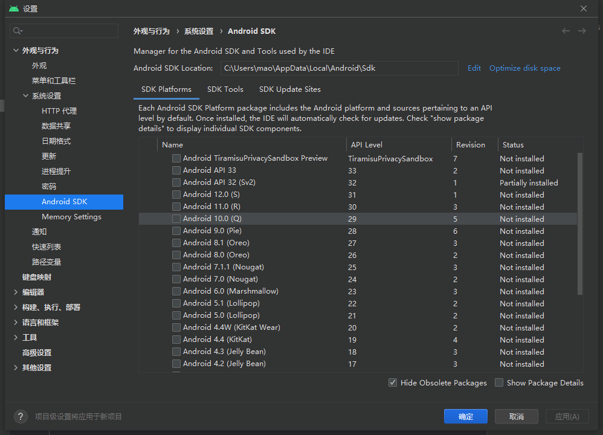

<h1 style="color: #ff90fa;text-align: center;font-size:3em">Android学习笔记</h1>


---


# Android的发展历程

安卓（Android）是一种基于Linux内核（不包含GNU组件）的自由及开放源代码的操作系统。主要使用 于移动设备，如智能手机和平板电脑，由美国Google公司和开放手机联盟领导及开发。Android操作系 统最初由Andy Rubin开发，主要支持手机。

* 2005年8月由Google收购注资。 
* 2007年11月，Google与84家硬件制造商、软件开发商及电信营运商组建开放手机联盟共同研发改 良Android系统，并发布了Android的源代码。 
* 第一部Android智能手机发布于2008年10月，由 HTC 公司制造。Android逐渐扩展到平板电脑及 其他领域上，如电视、数码相机、游戏机、智能手表、车载大屏、智能家居等，并逐渐成为了人们 日常生活中不可或缺的系统软件。 
* 2011年第一季度，Android在全球的市场份额首次超过塞班系统，跃居全球第一。 
* 2013年的第四季度，Android平台手机的全球市场份额已经达到78.1%。2013年09月24日谷歌开 发的操作系统Android在迎来了5岁生日，全世界采用这款系统的设备数量已经达到10亿台。 
* 2019年，谷歌官方宣布全世界有25亿活跃的Android设备，还不包含大多数中国设备。


Android几乎每年都要发布一个大版本，技术的更新迭代非常之快


| Android 版本号 | 对应 API | 发布时间 |
| :------------: | :------: | :------: |
|Android 13 |33 |2022年2月|
|Android 12 |31 |2021年10月|
|Android 11| 30| 2020年9月|
|Android 10| 29 |2019年8月|
|Android 9| 28 |2018年8月|
|Android 8 |26/27| 2017年8月|
|Android 7| 24/25| 2016年8月|
|Android 6| 23| 2015年9月|
|Android 5 |21/22| 2014年6月|
|Android 4.4| 19/20 |2013年9月|


虽然Android基于Linux内核，但是Android手机的应用App主要采用Java语言开发。为了吸引众多的Java 程序员，早期的App开发工具使用Eclipse，通过给Eclipse安装ADT插件，使之支持开发和调试App。然 而Eclipse毕竟不是专门的App开发环境，运行速度也偏慢，因此谷歌公司在2013年5月推出了全新的 Android开发环境—Android Studio。Android Studio基于IntelliJ IDEA演变而来，既保持了IDEA方便快 捷的特点，又增加了Android开发的环境支持。自2015年之后，谷歌公司便停止了ADT的版本更新，转 而重点打造自家的Android Studio，数年升级换代下来，Android Studio的功能愈加丰富，性能也愈高 效，使得它逐步成为主流的App开发环境


# Android Studio

## 开发机配置要求

* 内存要求至少8GB，越大越好。 
* CPU要求1.5GHz以上，越快越好。 
* 硬盘要求系统盘剩余空间10GB以上，越大越好。 
* 要求带无线网卡与USB插槽。
* 必须是64位系统，不能是32位系统
* Windows系统至少为Windows 7，推荐Windows 10，不支持Windows XP


## 下载

https://developer.android.google.cn/studio/index.html


## 安装

双击下载完成的Android Studio安装程序


一直点击下一步


单击对话框右下角的Finish按钮，完成安装配置工作，同时打开Android Studio欢迎界面


## 下载Android的SDK

在Android Studio主界面，依次选择菜单Tools→SDK Manager，或者在Android Studio右上角中单击图标





SDK下载完成，可以到“我的电脑”中打开Android SDK Location指定的SDK保存路径，发现下面还有十几个目录


```sh
PS C:\Users\mao\AppData\Local\Android> ls


    目录: C:\Users\mao\AppData\Local\Android


Mode                 LastWriteTime         Length Name
----                 -------------         ------ ----
d-----         2022/9/15     22:08                Sdk


PS C:\Users\mao\AppData\Local\Android> cd .\Sdk\
PS C:\Users\mao\AppData\Local\Android\Sdk> ls


    目录: C:\Users\mao\AppData\Local\Android\Sdk


Mode                 LastWriteTime         Length Name
----                 -------------         ------ ----
d-----         2022/9/15     22:02                .downloadIntermediates
d-----         2022/9/15     22:03                .temp
d-----         2022/9/15     21:54                build-tools
d-----         2022/9/15     21:04                emulator
d-----         2022/9/15     21:02                extras
d-----         2022/9/15     22:08                fonts
d-----         2022/9/15     21:02                licenses
d-----         2022/3/12     12:57                patcher
d-----         2022/9/15     21:02                platform-tools
d-----         2022/3/12     12:59                platforms
d-----         2022/9/15     22:26                skins
d-----         2022/9/15     21:57                system-images
d-----         2022/3/12     12:58                tools
-a----         2022/9/17     12:35             16 .knownPackages


PS C:\Users\mao\AppData\Local\Android\Sdk>
```


* build-tools目录，存放各版本Android的编译工具。 
* emulator目录，存放模拟器的管理工具。 
* platforms目录，存放各版本Android的资源文件与内核JAR包android.jar。 
* platform-tools目录，存放常用的开发辅助工具，包括客户端驱动程序adb.exe、数据库管理工具 sqlite3.exe，等等。 


## 创建项目


## 创建内置模拟器

所谓模拟器，指的是在电脑上构造一个演示窗口，模拟手机屏幕的App运行效果。App通过编译之后， 只说明代码没有语法错误，若想验证App能否正确运行，还得让它在Android设备上跑起来。这个设备可 以是真实手机，也可以是电脑里的模拟器。依次选择菜单Run→Run （也可按快捷键Shift+F10），或者 选择菜单Run→Run…，在弹出的小窗中选择待运行的模块名称，Android Studio会判断当前是否存在已 经连接的设备，如果已有连接上的设备就在该设备上安装测试App。

因为一开始没有任何已连上的设备，所以运行App会报错“Error running ：No target device found.”， 意思是未找到任何目标设备。此时要先创建一个模拟器，依次选择菜单Tools→AVD Manager，或者在 Android Studio右上角的按钮中单击图标


点击创建


单击许可授权对话框的Accept选项，表示接受上述条款，再单击Next按钮跳到下一页的镜像下载对话框


等待镜像下载完成，单击右下角的Finish按钮


## 运行App

模拟器创建完成后，回到Android Studio的主界面


点击运行按钮


# 运行日志
