<h1 style="color: #ff90fa;text-align: center;font-size:3em">Android学习笔记</h1>


---


# Android的发展历程

安卓（Android）是一种基于Linux内核（不包含GNU组件）的自由及开放源代码的操作系统。主要使用 于移动设备，如智能手机和平板电脑，由美国Google公司和开放手机联盟领导及开发。Android操作系 统最初由Andy Rubin开发，主要支持手机。

* 2005年8月由Google收购注资。 
* 2007年11月，Google与84家硬件制造商、软件开发商及电信营运商组建开放手机联盟共同研发改 良Android系统，并发布了Android的源代码。 
* 第一部Android智能手机发布于2008年10月，由 HTC 公司制造。Android逐渐扩展到平板电脑及 其他领域上，如电视、数码相机、游戏机、智能手表、车载大屏、智能家居等，并逐渐成为了人们 日常生活中不可或缺的系统软件。 
* 2011年第一季度，Android在全球的市场份额首次超过塞班系统，跃居全球第一。 
* 2013年的第四季度，Android平台手机的全球市场份额已经达到78.1%。2013年09月24日谷歌开 发的操作系统Android在迎来了5岁生日，全世界采用这款系统的设备数量已经达到10亿台。 
* 2019年，谷歌官方宣布全世界有25亿活跃的Android设备，还不包含大多数中国设备。


Android几乎每年都要发布一个大版本，技术的更新迭代非常之快


| Android 版本号 | 对应 API | 发布时间 |
| :------------: | :------: | :------: |
|Android 13 |33 |2022年2月|
|Android 12 |31 |2021年10月|
|Android 11| 30| 2020年9月|
|Android 10| 29 |2019年8月|
|Android 9| 28 |2018年8月|
|Android 8 |26/27| 2017年8月|
|Android 7| 24/25| 2016年8月|
|Android 6| 23| 2015年9月|
|Android 5 |21/22| 2014年6月|
|Android 4.4| 19/20 |2013年9月|


虽然Android基于Linux内核，但是Android手机的应用App主要采用Java语言开发。为了吸引众多的Java 程序员，早期的App开发工具使用Eclipse，通过给Eclipse安装ADT插件，使之支持开发和调试App。然 而Eclipse毕竟不是专门的App开发环境，运行速度也偏慢，因此谷歌公司在2013年5月推出了全新的 Android开发环境—Android Studio。Android Studio基于IntelliJ IDEA演变而来，既保持了IDEA方便快 捷的特点，又增加了Android开发的环境支持。自2015年之后，谷歌公司便停止了ADT的版本更新，转 而重点打造自家的Android Studio，数年升级换代下来，Android Studio的功能愈加丰富，性能也愈高 效，使得它逐步成为主流的App开发环境


# Android Studio

## 开发机配置要求

* 内存要求至少8GB，越大越好。 
* CPU要求1.5GHz以上，越快越好。 
* 硬盘要求系统盘剩余空间10GB以上，越大越好。 
* 要求带无线网卡与USB插槽。
* 必须是64位系统，不能是32位系统
* Windows系统至少为Windows 7，推荐Windows 10，不支持Windows XP


## 下载

https://developer.android.google.cn/studio/index.html


## 安装

双击下载完成的Android Studio安装程序


一直点击下一步


单击对话框右下角的Finish按钮，完成安装配置工作，同时打开Android Studio欢迎界面


## 下载Android的SDK

在Android Studio主界面，依次选择菜单Tools→SDK Manager，或者在Android Studio右上角中单击图标


SDK下载完成，可以到“我的电脑”中打开Android SDK Location指定的SDK保存路径，发现下面还有十几个目录


```sh
PS C:\Users\mao\AppData\Local\Android> ls


    目录: C:\Users\mao\AppData\Local\Android


Mode                 LastWriteTime         Length Name
----                 -------------         ------ ----
d-----         2022/9/15     22:08                Sdk


PS C:\Users\mao\AppData\Local\Android> cd .\Sdk\
PS C:\Users\mao\AppData\Local\Android\Sdk> ls


    目录: C:\Users\mao\AppData\Local\Android\Sdk


Mode                 LastWriteTime         Length Name
----                 -------------         ------ ----
d-----         2022/9/15     22:02                .downloadIntermediates
d-----         2022/9/15     22:03                .temp
d-----         2022/9/15     21:54                build-tools
d-----         2022/9/15     21:04                emulator
d-----         2022/9/15     21:02                extras
d-----         2022/9/15     22:08                fonts
d-----         2022/9/15     21:02                licenses
d-----         2022/3/12     12:57                patcher
d-----         2022/9/15     21:02                platform-tools
d-----         2022/3/12     12:59                platforms
d-----         2022/9/15     22:26                skins
d-----         2022/9/15     21:57                system-images
d-----         2022/3/12     12:58                tools
-a----         2022/9/17     12:35             16 .knownPackages


PS C:\Users\mao\AppData\Local\Android\Sdk>
```


* build-tools目录，存放各版本Android的编译工具。 
* emulator目录，存放模拟器的管理工具。 
* platforms目录，存放各版本Android的资源文件与内核JAR包android.jar。 
* platform-tools目录，存放常用的开发辅助工具，包括客户端驱动程序adb.exe、数据库管理工具 sqlite3.exe，等等。 


## 创建项目


## 创建内置模拟器

所谓模拟器，指的是在电脑上构造一个演示窗口，模拟手机屏幕的App运行效果。App通过编译之后， 只说明代码没有语法错误，若想验证App能否正确运行，还得让它在Android设备上跑起来。这个设备可 以是真实手机，也可以是电脑里的模拟器。依次选择菜单Run→Run （也可按快捷键Shift+F10），或者 选择菜单Run→Run…，在弹出的小窗中选择待运行的模块名称，Android Studio会判断当前是否存在已 经连接的设备，如果已有连接上的设备就在该设备上安装测试App。

因为一开始没有任何已连上的设备，所以运行App会报错“Error running ：No target device found.”， 意思是未找到任何目标设备。此时要先创建一个模拟器，依次选择菜单Tools→AVD Manager，或者在 Android Studio右上角的按钮中单击图标


点击创建


单击许可授权对话框的Accept选项，表示接受上述条款，再单击Next按钮跳到下一页的镜像下载对话框


等待镜像下载完成，单击右下角的Finish按钮


## 运行App

模拟器创建完成后，回到Android Studio的主界面


点击运行按钮


# 运行日志

打开logcat

查看日志：

```sh
2022-09-17 12:52:22.443 6578-6578/? I/android_projec: Late-enabling -Xcheck:jni
2022-09-17 12:52:22.529 6578-6578/? E/android_projec: Unknown bits set in runtime_flags: 0x8000
2022-09-17 12:52:22.533 6578-6578/? W/android_projec: Unexpected CPU variant for X86 using defaults: x86
2022-09-17 12:52:22.939 6578-6646/com.example.my_first_android_project D/libEGL: Emulator has host GPU support, qemu.gles is set to 1.
2022-09-17 12:52:22.939 6578-6646/com.example.my_first_android_project W/libc: Unable to set property "qemu.gles" to "1": connection failed; errno=13 (Permission denied)
2022-09-17 12:52:22.955 6578-6646/com.example.my_first_android_project D/libEGL: loaded /vendor/lib/egl/libEGL_emulation.so
2022-09-17 12:52:22.957 6578-6646/com.example.my_first_android_project D/libEGL: loaded /vendor/lib/egl/libGLESv1_CM_emulation.so
2022-09-17 12:52:22.961 6578-6646/com.example.my_first_android_project D/libEGL: loaded /vendor/lib/egl/libGLESv2_emulation.so
2022-09-17 12:52:23.163 6578-6578/com.example.my_first_android_project W/android_projec: Accessing hidden method Landroid/view/View;->computeFitSystemWindows(Landroid/graphics/Rect;Landroid/graphics/Rect;)Z (greylist, reflection, allowed)
2022-09-17 12:52:23.163 6578-6578/com.example.my_first_android_project W/android_projec: Accessing hidden method Landroid/view/ViewGroup;->makeOptionalFitsSystemWindows()V (greylist, reflection, allowed)
2022-09-17 12:52:23.285 6578-6644/com.example.my_first_android_project D/HostConnection: HostConnection::get() New Host Connection established 0xdbd0eb40, tid 6644
2022-09-17 12:52:23.363 6578-6644/com.example.my_first_android_project D/HostConnection: HostComposition ext ANDROID_EMU_CHECKSUM_HELPER_v1 ANDROID_EMU_dma_v1 ANDROID_EMU_direct_mem ANDROID_EMU_host_composition_v1 ANDROID_EMU_host_composition_v2 ANDROID_EMU_vulkan ANDROID_EMU_deferred_vulkan_commands ANDROID_EMU_vulkan_null_optional_strings ANDROID_EMU_vulkan_create_resources_with_requirements ANDROID_EMU_YUV_Cache ANDROID_EMU_vulkan_ignored_handles ANDROID_EMU_vulkan_free_memory_sync ANDROID_EMU_vulkan_shader_float16_int8 ANDROID_EMU_vulkan_async_queue_submit ANDROID_EMU_sync_buffer_data GL_OES_vertex_array_object GL_KHR_texture_compression_astc_ldr ANDROID_EMU_host_side_tracing ANDROID_EMU_gles_max_version_2 
2022-09-17 12:52:23.375 6578-6644/com.example.my_first_android_project W/OpenGLRenderer: Failed to choose config with EGL_SWAP_BEHAVIOR_PRESERVED, retrying without...
2022-09-17 12:52:23.409 6578-6644/com.example.my_first_android_project D/EGL_emulation: eglCreateContext: 0xe7f01680: maj 2 min 0 rcv 2
2022-09-17 12:52:23.433 6578-6644/com.example.my_first_android_project D/EGL_emulation: eglMakeCurrent: 0xe7f01680: ver 2 0 (tinfo 0xdbd508b0)
2022-09-17 12:52:23.450 6578-6644/com.example.my_first_android_project W/Gralloc3: mapper 3.x is not supported
2022-09-17 12:52:23.451 6578-6644/com.example.my_first_android_project D/HostConnection: createUnique: call
2022-09-17 12:52:23.451 6578-6644/com.example.my_first_android_project D/HostConnection: HostConnection::get() New Host Connection established 0xdbd105d0, tid 6644
2022-09-17 12:52:23.503 6578-6644/com.example.my_first_android_project D/HostConnection: HostComposition ext ANDROID_EMU_CHECKSUM_HELPER_v1 ANDROID_EMU_dma_v1 ANDROID_EMU_direct_mem ANDROID_EMU_host_composition_v1 ANDROID_EMU_host_composition_v2 ANDROID_EMU_vulkan ANDROID_EMU_deferred_vulkan_commands ANDROID_EMU_vulkan_null_optional_strings ANDROID_EMU_vulkan_create_resources_with_requirements ANDROID_EMU_YUV_Cache ANDROID_EMU_vulkan_ignored_handles ANDROID_EMU_vulkan_free_memory_sync ANDROID_EMU_vulkan_shader_float16_int8 ANDROID_EMU_vulkan_async_queue_submit ANDROID_EMU_sync_buffer_data GL_OES_vertex_array_object GL_KHR_texture_compression_astc_ldr ANDROID_EMU_host_side_tracing ANDROID_EMU_gles_max_version_2 
2022-09-17 12:52:23.503 6578-6644/com.example.my_first_android_project D/eglCodecCommon: allocate: Ask for block of size 0x1000
2022-09-17 12:52:23.503 6578-6644/com.example.my_first_android_project D/eglCodecCommon: allocate: ioctl allocate returned offset 0x3ffff6000 size 0x2000
2022-09-17 12:52:23.515 6578-6644/com.example.my_first_android_project D/EGL_emulation: eglMakeCurrent: 0xe7f01680: ver 2 0 (tinfo 0xdbd508b0)
2022-09-17 12:52:31.588 6578-6644/com.example.my_first_android_project D/EGL_emulation: eglMakeCurrent: 0xe7f01680: ver 2 0 (tinfo 0xdbd508b0)
2022-09-17 12:52:35.990 6578-6578/com.example.my_first_android_project W/ActivityThread: handleWindowVisibility: no activity for token android.os.BinderProxy@d5feb6c
2022-09-17 12:52:36.051 6578-6644/com.example.my_first_android_project D/EGL_emulation: eglMakeCurrent: 0xe7f01680: ver 2 0 (tinfo 0xdbd508b0)
```


* Log.e：表示错误信息，比如可能导致程序崩溃的异常。 
* Log.w：表示警告信息。
* Log.i：表示一般消息。 
* Log.d：表示调试信息，可把程序运行时的变量值打印出来，方便跟踪调试。
* Log.v：表示冗余信息


一般而言，日常开发使用Log.d即可


虽然在模拟器上能够看到App的运行，却无法看到App的调试信息。以前写Java代码的时候，通过 System.out.println可以很方便地向IDEA的控制台输出日志，当然Android Studio也允许查看App的运 行日志，只是Android不使用System.out.println，而是采用Log工具打印日志


```java
package com.example.my_first_android_project;

import androidx.appcompat.app.AppCompatActivity;

import android.os.Bundle;
import android.util.Log;

public class MainActivity extends AppCompatActivity
{

    @Override
    protected void onCreate(Bundle savedInstanceState)
    {
        super.onCreate(savedInstanceState);
        setContentView(R.layout.activity_main);
        Log.d("MainActivity", "onCreate: 调试日志");
        Log.i("MainActivity", "onCreate: 日志");
        Log.w("MainActivity", "onCreate: 警告日志", new RuntimeException());
        Log.e("MainActivity", "onCreate: 错误日志", new RuntimeException());
    }

}
```


查看日志（debug级别）


```sh
2022-09-17 13:21:23.203 8137-8137/? I/android_projec: Late-enabling -Xcheck:jni
2022-09-17 13:21:23.222 8137-8137/? E/android_projec: Unknown bits set in runtime_flags: 0x8000
2022-09-17 13:21:23.224 8137-8137/? W/android_projec: Unexpected CPU variant for X86 using defaults: x86
2022-09-17 13:21:23.462 8137-8170/com.example.my_first_android_project D/libEGL: Emulator has host GPU support, qemu.gles is set to 1.
2022-09-17 13:21:23.468 8137-8170/com.example.my_first_android_project W/libc: Unable to set property "qemu.gles" to "1": connection failed; errno=13 (Permission denied)
2022-09-17 13:21:23.461 8137-8137/com.example.my_first_android_project W/RenderThread: type=1400 audit(0.0:49248): avc: denied { write } for name="property_service" dev="tmpfs" ino=8453 scontext=u:r:untrusted_app:s0:c146,c256,c512,c768 tcontext=u:object_r:property_socket:s0 tclass=sock_file permissive=0 app=com.example.my_first_android_project
2022-09-17 13:21:23.498 8137-8170/com.example.my_first_android_project D/libEGL: loaded /vendor/lib/egl/libEGL_emulation.so
2022-09-17 13:21:23.501 8137-8170/com.example.my_first_android_project D/libEGL: loaded /vendor/lib/egl/libGLESv1_CM_emulation.so
2022-09-17 13:21:23.507 8137-8170/com.example.my_first_android_project D/libEGL: loaded /vendor/lib/egl/libGLESv2_emulation.so
2022-09-17 13:21:23.671 8137-8137/com.example.my_first_android_project W/android_projec: Accessing hidden method Landroid/view/View;->computeFitSystemWindows(Landroid/graphics/Rect;Landroid/graphics/Rect;)Z (greylist, reflection, allowed)
2022-09-17 13:21:23.671 8137-8137/com.example.my_first_android_project W/android_projec: Accessing hidden method Landroid/view/ViewGroup;->makeOptionalFitsSystemWindows()V (greylist, reflection, allowed)
2022-09-17 13:21:23.747 8137-8137/com.example.my_first_android_project D/MainActivity: onCreate: 调试日志
2022-09-17 13:21:23.747 8137-8137/com.example.my_first_android_project I/MainActivity: onCreate: 日志
2022-09-17 13:21:23.749 8137-8137/com.example.my_first_android_project W/MainActivity: onCreate: 警告日志
    java.lang.RuntimeException
        at com.example.my_first_android_project.MainActivity.onCreate(MainActivity.java:19)
        at android.app.Activity.performCreate(Activity.java:7802)
        at android.app.Activity.performCreate(Activity.java:7791)
        at android.app.Instrumentation.callActivityOnCreate(Instrumentation.java:1299)
        at android.app.ActivityThread.performLaunchActivity(ActivityThread.java:3245)
        at android.app.ActivityThread.handleLaunchActivity(ActivityThread.java:3409)
        at android.app.servertransaction.LaunchActivityItem.execute(LaunchActivityItem.java:83)
        at android.app.servertransaction.TransactionExecutor.executeCallbacks(TransactionExecutor.java:135)
        at android.app.servertransaction.TransactionExecutor.execute(TransactionExecutor.java:95)
        at android.app.ActivityThread$H.handleMessage(ActivityThread.java:2016)
        at android.os.Handler.dispatchMessage(Handler.java:107)
        at android.os.Looper.loop(Looper.java:214)
        at android.app.ActivityThread.main(ActivityThread.java:7356)
        at java.lang.reflect.Method.invoke(Native Method)
        at com.android.internal.os.RuntimeInit$MethodAndArgsCaller.run(RuntimeInit.java:492)
        at com.android.internal.os.ZygoteInit.main(ZygoteInit.java:930)
2022-09-17 13:21:23.750 8137-8137/com.example.my_first_android_project E/MainActivity: onCreate: 错误日志
    java.lang.RuntimeException
        at com.example.my_first_android_project.MainActivity.onCreate(MainActivity.java:20)
        at android.app.Activity.performCreate(Activity.java:7802)
        at android.app.Activity.performCreate(Activity.java:7791)
        at android.app.Instrumentation.callActivityOnCreate(Instrumentation.java:1299)
        at android.app.ActivityThread.performLaunchActivity(ActivityThread.java:3245)
        at android.app.ActivityThread.handleLaunchActivity(ActivityThread.java:3409)
        at android.app.servertransaction.LaunchActivityItem.execute(LaunchActivityItem.java:83)
        at android.app.servertransaction.TransactionExecutor.executeCallbacks(TransactionExecutor.java:135)
        at android.app.servertransaction.TransactionExecutor.execute(TransactionExecutor.java:95)
        at android.app.ActivityThread$H.handleMessage(ActivityThread.java:2016)
        at android.os.Handler.dispatchMessage(Handler.java:107)
        at android.os.Looper.loop(Looper.java:214)
        at android.app.ActivityThread.main(ActivityThread.java:7356)
        at java.lang.reflect.Method.invoke(Native Method)
        at com.android.internal.os.RuntimeInit$MethodAndArgsCaller.run(RuntimeInit.java:492)
        at com.android.internal.os.ZygoteInit.main(ZygoteInit.java:930)
2022-09-17 13:21:23.817 8137-8168/com.example.my_first_android_project D/HostConnection: HostConnection::get() New Host Connection established 0xdbd0ec80, tid 8168
2022-09-17 13:21:23.833 8137-8168/com.example.my_first_android_project D/HostConnection: HostComposition ext ANDROID_EMU_CHECKSUM_HELPER_v1 ANDROID_EMU_dma_v1 ANDROID_EMU_direct_mem ANDROID_EMU_host_composition_v1 ANDROID_EMU_host_composition_v2 ANDROID_EMU_vulkan ANDROID_EMU_deferred_vulkan_commands ANDROID_EMU_vulkan_null_optional_strings ANDROID_EMU_vulkan_create_resources_with_requirements ANDROID_EMU_YUV_Cache ANDROID_EMU_vulkan_ignored_handles ANDROID_EMU_vulkan_free_memory_sync ANDROID_EMU_vulkan_shader_float16_int8 ANDROID_EMU_vulkan_async_queue_submit ANDROID_EMU_sync_buffer_data GL_OES_vertex_array_object GL_KHR_texture_compression_astc_ldr ANDROID_EMU_host_side_tracing ANDROID_EMU_gles_max_version_2 
2022-09-17 13:21:23.840 8137-8168/com.example.my_first_android_project W/OpenGLRenderer: Failed to choose config with EGL_SWAP_BEHAVIOR_PRESERVED, retrying without...
2022-09-17 13:21:23.875 8137-8168/com.example.my_first_android_project D/EGL_emulation: eglCreateContext: 0xe7f02280: maj 2 min 0 rcv 2
2022-09-17 13:21:23.914 8137-8168/com.example.my_first_android_project D/EGL_emulation: eglMakeCurrent: 0xe7f02280: ver 2 0 (tinfo 0xdbd1dee0)
2022-09-17 13:21:23.923 8137-8168/com.example.my_first_android_project W/Gralloc3: mapper 3.x is not supported
2022-09-17 13:21:23.929 8137-8168/com.example.my_first_android_project D/HostConnection: createUnique: call
2022-09-17 13:21:23.929 8137-8168/com.example.my_first_android_project D/HostConnection: HostConnection::get() New Host Connection established 0xdbd10710, tid 8168
2022-09-17 13:21:23.937 8137-8168/com.example.my_first_android_project D/HostConnection: HostComposition ext ANDROID_EMU_CHECKSUM_HELPER_v1 ANDROID_EMU_dma_v1 ANDROID_EMU_direct_mem ANDROID_EMU_host_composition_v1 ANDROID_EMU_host_composition_v2 ANDROID_EMU_vulkan ANDROID_EMU_deferred_vulkan_commands ANDROID_EMU_vulkan_null_optional_strings ANDROID_EMU_vulkan_create_resources_with_requirements ANDROID_EMU_YUV_Cache ANDROID_EMU_vulkan_ignored_handles ANDROID_EMU_vulkan_free_memory_sync ANDROID_EMU_vulkan_shader_float16_int8 ANDROID_EMU_vulkan_async_queue_submit ANDROID_EMU_sync_buffer_data GL_OES_vertex_array_object GL_KHR_texture_compression_astc_ldr ANDROID_EMU_host_side_tracing ANDROID_EMU_gles_max_version_2 
2022-09-17 13:21:23.937 8137-8168/com.example.my_first_android_project D/eglCodecCommon: allocate: Ask for block of size 0x1000
2022-09-17 13:21:23.937 8137-8168/com.example.my_first_android_project D/eglCodecCommon: allocate: ioctl allocate returned offset 0x3ffff6000 size 0x2000
2022-09-17 13:21:23.946 8137-8168/com.example.my_first_android_project D/EGL_emulation: eglMakeCurrent: 0xe7f02280: ver 2 0 (tinfo 0xdbd1dee0)
```


查看日志（warn级别）


```sh
2022-09-17 13:21:23.222 8137-8137/? E/android_projec: Unknown bits set in runtime_flags: 0x8000
2022-09-17 13:21:23.224 8137-8137/? W/android_projec: Unexpected CPU variant for X86 using defaults: x86
2022-09-17 13:21:23.468 8137-8170/com.example.my_first_android_project W/libc: Unable to set property "qemu.gles" to "1": connection failed; errno=13 (Permission denied)
2022-09-17 13:21:23.461 8137-8137/com.example.my_first_android_project W/RenderThread: type=1400 audit(0.0:49248): avc: denied { write } for name="property_service" dev="tmpfs" ino=8453 scontext=u:r:untrusted_app:s0:c146,c256,c512,c768 tcontext=u:object_r:property_socket:s0 tclass=sock_file permissive=0 app=com.example.my_first_android_project
2022-09-17 13:21:23.671 8137-8137/com.example.my_first_android_project W/android_projec: Accessing hidden method Landroid/view/View;->computeFitSystemWindows(Landroid/graphics/Rect;Landroid/graphics/Rect;)Z (greylist, reflection, allowed)
2022-09-17 13:21:23.671 8137-8137/com.example.my_first_android_project W/android_projec: Accessing hidden method Landroid/view/ViewGroup;->makeOptionalFitsSystemWindows()V (greylist, reflection, allowed)
2022-09-17 13:21:23.749 8137-8137/com.example.my_first_android_project W/MainActivity: onCreate: 警告日志
    java.lang.RuntimeException
        at com.example.my_first_android_project.MainActivity.onCreate(MainActivity.java:19)
        at android.app.Activity.performCreate(Activity.java:7802)
        at android.app.Activity.performCreate(Activity.java:7791)
        at android.app.Instrumentation.callActivityOnCreate(Instrumentation.java:1299)
        at android.app.ActivityThread.performLaunchActivity(ActivityThread.java:3245)
        at android.app.ActivityThread.handleLaunchActivity(ActivityThread.java:3409)
        at android.app.servertransaction.LaunchActivityItem.execute(LaunchActivityItem.java:83)
        at android.app.servertransaction.TransactionExecutor.executeCallbacks(TransactionExecutor.java:135)
        at android.app.servertransaction.TransactionExecutor.execute(TransactionExecutor.java:95)
        at android.app.ActivityThread$H.handleMessage(ActivityThread.java:2016)
        at android.os.Handler.dispatchMessage(Handler.java:107)
        at android.os.Looper.loop(Looper.java:214)
        at android.app.ActivityThread.main(ActivityThread.java:7356)
        at java.lang.reflect.Method.invoke(Native Method)
        at com.android.internal.os.RuntimeInit$MethodAndArgsCaller.run(RuntimeInit.java:492)
        at com.android.internal.os.ZygoteInit.main(ZygoteInit.java:930)
2022-09-17 13:21:23.750 8137-8137/com.example.my_first_android_project E/MainActivity: onCreate: 错误日志
    java.lang.RuntimeException
        at com.example.my_first_android_project.MainActivity.onCreate(MainActivity.java:20)
        at android.app.Activity.performCreate(Activity.java:7802)
        at android.app.Activity.performCreate(Activity.java:7791)
        at android.app.Instrumentation.callActivityOnCreate(Instrumentation.java:1299)
        at android.app.ActivityThread.performLaunchActivity(ActivityThread.java:3245)
        at android.app.ActivityThread.handleLaunchActivity(ActivityThread.java:3409)
        at android.app.servertransaction.LaunchActivityItem.execute(LaunchActivityItem.java:83)
        at android.app.servertransaction.TransactionExecutor.executeCallbacks(TransactionExecutor.java:135)
        at android.app.servertransaction.TransactionExecutor.execute(TransactionExecutor.java:95)
        at android.app.ActivityThread$H.handleMessage(ActivityThread.java:2016)
        at android.os.Handler.dispatchMessage(Handler.java:107)
        at android.os.Looper.loop(Looper.java:214)
        at android.app.ActivityThread.main(ActivityThread.java:7356)
        at java.lang.reflect.Method.invoke(Native Method)
        at com.android.internal.os.RuntimeInit$MethodAndArgsCaller.run(RuntimeInit.java:492)
        at com.android.internal.os.ZygoteInit.main(ZygoteInit.java:930)
2022-09-17 13:21:23.840 8137-8168/com.example.my_first_android_project W/OpenGLRenderer: Failed to choose config with EGL_SWAP_BEHAVIOR_PRESERVED, retrying without...
2022-09-17 13:21:23.923 8137-8168/com.example.my_first_android_project W/Gralloc3: mapper 3.x is not supported
```


# App开发基础

## App的运行环境

App是在手机上运行的一类应用软件，而应用软件依附于操作系统，无论电脑还是手机，刚开机都会显 示桌面，这个桌面便是操作系统的工作台。个人电脑的操作系统主要有微软的Windows和苹果的Mac OS，智能手机流行的操作系统也有两种，分别是安卓手机的Android和苹果手机的iOS。本书讲述的App 开发为Android上的应用开发，Android系统基于Linux内核，但不等于Linux系统，故App应用无法在 Linux系统上运行。


Android Studio是谷歌官方推出的App开发环境，它提供了三种操作系统的安装包，分别是Windows、 Mac和Linux。这就产生一个问题：开发者可以在电脑上安装Android Studio，并使用Android Studio开 发App项目，但是编译出来的App在电脑上跑不起来。这种情况真是令人匪夷所思的，通常学习C语言、 Java或者Python，都能在电脑的开发环境直接观看程序运行过程，就算是J2EE开发，也能在浏览器通过 网页观察程序的运行结果。可是安卓的App应用竟然没法在电脑上直接运行，那该怎样验证App的界面 展示及其业务逻辑是否正确呢？

* 为了提供App开发的功能测试环境，一种办法是利用Android Studio创建内置的模拟器，然后启动内置 模拟器，再在模拟器上运行App应用
* 另一种办法是使用真实手机测试App，该办法在实际开发中更为常见。由于模拟器本身跑在电脑上面， 占用电脑的CPU和内存，会拖累电脑的运行速度


利用真机调试要求具备以下**5个条件**：

1．**使用数据线把手机连到电脑上**

手机的电源线拔掉插头就是数据线。数据线长方形的一端接到电脑的USB接口，即可完成手机与电脑的 连接


2．**在电脑上安装手机的驱动程序**

一般电脑会把手机当作USB存储设备一样安装驱动，大多数情况会自动安装成功。如果遇到少数情况安 装失败，需要先安装手机助手，由助手软件下载并安装对应的手机驱动


3．**打开手机的开发者选项并启用USB调试**

手机出厂后默认关闭开发者选项，需要开启开发者选项才能调试App。打开手机的设置菜单，进入“系统” →“关于手机”→“版本信息”页面，这里有好几个版本项，每个版本项都使劲点击七、八下，总会有某个版 本点击后出现“你将开启开发者模式”的提示。继续点击该版本开启开发者模式，然后退出并重新进入设 置页面，此时就能在“系统”菜单下找到“开发者选项”或“开发人员选项”了。进入“开发者选项”页面，启用 “开发者选项”和“USB调试”两处开关，允许手机通过USB接口安装调试应用


4．**将连接的手机设为文件传输模式，并允许计算机进行USB调试**

手机通过USB数据线连接电脑后，请求选择某种USB连接方式。这里记得选中“传输文件”，因为充电模式不支持调试App。 选完之后手机桌面弹出确认窗口，提示开发者是否允许当前计算机进行USB调试。这里勾选“始终允许使用这台计算机进行调试”选项，再点击右下角的确定按钮，允许计算机在手机上调试App


5．**手机要能正常使用**

锁屏状态下，Android Studio向手机安装App的行为可能会被拦截，所以要保证手机处于解锁状态，才 能顺利通过电脑安装App到手机上。 有的手机还要求插入SIM卡才能调试App，还有的手机要求登录会员才能调试App，总之如果遇到无法安 装的问题，各种情况都尝试一遍才好。


## App的开发语言

基于安卓系统的App开发主要有两大技术路线，分别是**原生开发和混合开发**。原生开发指的是在移动平 台上利用官方提供的编程语言（例如Java、Kotlin等）、开发工具包（SDK）、开发环境（Android Studio）进行App开发；混合开发指的是结合原生与H5技术开发混合应用，也就是将部分App页面改成 内嵌的网页，这样无须升级App、只要覆盖服务器上的网页，即可动态更新App页面。


不管是原生开发还是混合开发，都要求掌握Android Studio的开发技能，因为混合开发本质上依赖于原生开发。单就原生开发而言，又涉及多种编程语 言，包括Java、Kotlin、C/C++、XML等


### Java

Java是Android开发的主要编程语言，在创建新项目时，弹出项目配置对话框，看见 Language栏默认选择了Java，表示该项目采用Java编码

虽然Android开发需要Java环境，但没要求电脑上必须事先安装JDK，因为Android Studio已经自带了 JRE

单击项目结构对话框左侧的SDK Location，对话框右边从上到下依次排列着“Android SDK location”、 “Android NDK location”、“JDK location”，其中下方的JDK location提示位于Android Studio安装路径的 JRE目录下，它正是Android Studio自带的Java运行环境


Android Studio自带的JRE使用的版本是11


```sh
PS C:\Program Files\Android Studio\jre\bin> ls


    目录: C:\Program Files\Android Studio\jre\bin


Mode                 LastWriteTime         Length Name
----                 -------------         ------ ----
d-----         2022/9/15     20:56                server
-a----         2022/7/11     15:34          30024 attach.dll
-a----         2022/7/11     15:33        1566536 awt.dll
-a----         2022/7/11     15:34          37192 dt_shmem.dll
-a----         2022/7/11     15:33          34632 dt_socket.dll
-a----         2022/7/11     15:34         670024 fontmanager.dll
-a----         2022/7/11     15:34         549192 freetype.dll
-a----         2022/7/11     15:33          51528 instrument.dll
-a----         2022/7/11     15:33          51528 j2gss.dll
-a----         2022/7/11     15:33          26952 j2pcsc.dll
-a----         2022/7/11     15:34          77640 j2pkcs11.dll
-a----         2022/7/11     15:33          29000 jaas.dll
-a----         2022/7/11     15:34          45896 jabswitch.exe
-a----         2022/7/11     15:34         111944 jaccessinspector.exe
-a----         2022/7/11     15:33          72008 jaccesswalker.exe
-a----         2022/7/11     15:34          25416 jaotc.exe
-a----         2022/7/11     15:33          23880 jar.exe
-a----         2022/7/11     15:33          23880 jarsigner.exe
-a----         2022/7/11     15:34         156488 java.dll
-a----         2022/7/11     15:33          33608 java.exe
-a----         2022/7/11     15:34         158024 javaaccessbridge.dll
-a----         2022/7/11     15:34          23880 javac.exe
-a----         2022/7/11     15:33          23880 javadoc.exe
-a----         2022/7/11     15:34         170824 javajpeg.dll
-a----         2022/7/11     15:34          23880 javap.exe
-a----         2022/7/11     15:34          33608 javaw.exe
-a----         2022/7/11     15:34          21832 jawt.dll
-a----         2022/7/11     15:33          23880 jdb.exe
-a----         2022/7/11     15:33          23880 jdeprscan.exe
-a----         2022/7/11     15:34          23880 jdeps.exe
-a----         2022/7/11     15:33         218440 jdwp.dll
-a----         2022/7/11     15:33          23880 jfr.exe
-a----         2022/7/11     15:33          23880 jhsdb.exe
-a----         2022/7/11     15:34          33608 jimage.dll
-a----         2022/7/11     15:33          23880 jimage.exe
-a----         2022/7/11     15:34          23880 jjs.exe
-a----         2022/7/11     15:34          87880 jli.dll
-a----         2022/7/11     15:33          23880 jlink.exe
-a----         2022/7/11     15:34          23880 jmod.exe
-a----         2022/7/11     15:33          23880 jrunscript.exe
-a----         2022/7/11     15:33          61768 jsound.dll
-a----         2022/7/11     15:34          23872 keytool.exe
-a----         2022/7/11     15:33          23880 kinit.exe
-a----         2022/7/11     15:33          23880 klist.exe
-a----         2022/7/11     15:34          23880 ktab.exe
-a----         2022/7/11     15:33         257864 lcms.dll
-a----         2022/7/11     15:34          36168 le.dll
-a----         2022/7/11     15:34          30024 management.dll
-a----         2022/7/11     15:33          24904 management_agent.dll
-a----         2022/7/11     15:33          36680 management_ext.dll
-a----         2022/7/11     15:34         515400 mlib_image.dll
-a----         2022/7/11     15:34         627528 msvcp140.dll
-a----         2022/7/11     15:33          96072 net.dll
-a----         2022/7/11     15:34          68424 nio.dll
-a----         2022/7/11     15:33          23880 pack200.exe
-a----         2022/7/11     15:34          25928 prefs.dll
-a----         2022/7/11     15:33          21320 rmi.dll
-a----         2022/7/11     15:34          23880 rmid.exe
-a----         2022/7/11     15:34          23880 rmiregistry.exe
-a----         2022/7/11     15:33          40776 saproc.dll
-a----         2022/7/11     15:34          23880 serialver.exe
-a----         2022/7/11     15:34         218440 splashscreen.dll
-a----         2022/7/11     15:33          44872 sspi_bridge.dll
-a----         2022/7/11     15:33         151880 sunec.dll
-a----         2022/7/11     15:33          89416 unpack.dll
-a----         2022/7/11     15:33         140616 unpack200.exe
-a----         2022/7/11     15:33          82248 vcruntime140.dll
-a----         2022/7/11     15:34          56648 verify.dll
-a----         2022/7/11     15:34          32072 w2k_lsa_auth.dll
-a----         2022/7/11     15:33         196936 windowsaccessbridge-64.dll
-a----         2022/7/11     15:33          86344 zip.dll


PS C:\Program Files\Android Studio\jre\bin> pwd

Path
----
C:\Program Files\Android Studio\jre\bin


PS C:\Program Files\Android Studio\jre\bin> ./java -version
openjdk version "11.0.12" 2021-07-20
OpenJDK Runtime Environment (build 11.0.12+7-b1504.28-7817840)
OpenJDK 64-Bit Server VM (build 11.0.12+7-b1504.28-7817840, mixed mode)
PS C:\Program Files\Android Studio\jre\bin>
```


### Kotlin

Kotlin是谷歌官方力推的又一种编程语言，它与Java同样基于JVM（Java Virtual Machine，即Java虚拟 机），且完全兼容Java语言。创建新项目时，在Language栏下拉可选择Kotlin

一旦在创建新项目时选定Kotlin，该项目就会自动加载Kotlin插件，并将Kotlin作为默认的编程语言


### C/C++

不管是Java还是Kotlin，它们都属于解释型语言，这类语言在运行之时才将程序翻译成机器语言，故而执 行效率偏低。虽然现在手机配置越来越高，大多数场景的App运行都很流畅，但是涉及图像与音视频处 理等复杂运算的场合，解释型语言的性能瓶颈便暴露出来


编译型语言在首次编译时就将代码编译为机器语言，后续运行无须重新编译，直接使用之前的编译文件 即可，因此执行效率比解释型语言高。C/C++正是编译型语言的代表，它能够有效弥补解释型语言的性 能缺憾，借助于JNI技术（Java Native Interface，即Java原生接口），Java代码允许调用C/C++编写的程 序。事实上，Android的SDK开发包内部定义了许多JNI接口，包括图像读写在内的底层代码均由 C/C++编写，再由外部通过封装好的Java方法调用


### XML

XML全称为Extensible Markup Language，即可扩展标记语言，严格地说，XML并非编程语言，只是一 种标记语言。它类似于HTML，利用各种标签表达页面元素，以及各元素之间的层级关系及其排列组 合。每个XML标签都是独立的控件对象，标签内部的属性以“android:”打头，表示这是标准的安卓属 性，各属性分别代表控件的某种规格。


```xml
<TextView
android:id="@+id/tv_hello"
android:layout_width="wrap_content"
android:layout_height="wrap_content"
android:text="Hello World!" />
```


上面的标签名称为TextView，翻译过来叫文本视图，该标签携带4个属性，说明如下：

* id：控件的编号
* layout_width：控件的布局宽度，wrap_content表示刚好包住该控件的内容
* layout_height：控件的布局高度，wrap_content表示刚好包住该控件的内容
* text：控件的文本，也就是文本视图要显示什么文字


综合起来，以上XML代码所表达的意思为：这是一个名为tv_hello的文本视图，显示的文字内容是“Hello World!”，它的宽度和高度都要刚好包住这些文字


## App连接的数据库

在学习Java编程的时候，基本会学到数据库操作，通过JDBC连接数据库进行记录的增删改查，这个数据 库可能是MySQL，也可能是Oracle，还可能是SQL Server。然而手机应用不能直接操作上述几种数据 库，因为数据库软件也得像应用软件那样安装到操作系统上，比如MySQL提供了Windows系统的安装 包，也提供了Linux系统的安装包，可是它没有提供Android系统的安装包呢，所以MySQL没法在 Android系统上安装，手机里面的App也就不能直连MySQL。


既然MySQL、Oracle这些企业数据库无法在手机安装，那么App怎样管理业务方面的数据记录呢？其实 Android早已内置了专门的数据库名为SQLite，它遵循关系数据库的设计理念，SQL语法类似于 MySQL。不同之处在于，SQLite无须单独安装，因为它内嵌到应用进程当中，所以App无须配置连接信 息，即可直接对其增删改查。由于SQLite嵌入到应用程序，省去了配置数据库服务器的开销，因此它又 被归类为嵌入式数据库。


可是SQLite的数据库文件保存在手机上，开发者拿不到用户的手机，又该如何获取App存储的业务数 据？比如用户的注册信息、用户的购物记录，等等。如果像Java Web那样，业务数据统一保存在后端的 数据库服务器，开发者只要登录数据库服务器，就能方便地查询导出需要的记录信息


手机端的App，连同程序代码及其内置的嵌入式数据库，其实是个又独立又完整的程序实体，它只负责 手机上的用户交互与信息处理，该实体被称作客户端。而后端的Java Web服务，包括Web代码和数据库 服务器，同样构成另一个单独运行的程序实体，它只负责后台的业务逻辑与数据库操作，该实体被称作 服务端。客户端与服务端之前通过HTTP接口通信，每当客户端觉得需要把信息发给服务端，或者需要从 服务端获取信息时，客户端便向服务端发起HTTP请求，服务端收到客户端的请求之后，根据规则完成数 据处理，并将处理结果返回给客户端。这样客户端经由HTTP接口并借服务端之手，方能间接读写后端的 数据库服务器（如MySQL）


由此看来，一个具备用户管理功能的App系统，实际上并不单单只是手机上的一个应用，还包括与其对 应的Java Web服务。手机里的客户端App，面向的是手机用户，App与用户之间通过手机屏幕交互；而 后端的服务程序，面向的是手机App，客户端与服务端之间通过HTTP接口交互。客


## App工程目录结构


App工程分为两个层次，第一个层次是项目，依次选择菜单File→New→New Project即可创建新项目。 另一个层次是模块，模块依附于项目，每个项目至少有一个模块，也能拥有多个模块，依次选择菜单 File→New→New Module即可在当前项目创建新模块。一般所言的“编译运行App”，指的是运行某个模块，而非运行某个项目，因为模块才对应实际的App。


该项目下面有两个分类：一个是app（代表app模块）；另一个是Gradle Scripts。


其中，app下面又有3个子目录：

* manifests子目录，下面只有一个XML文件，即AndroidManifest.xml，它是App的运行配置文 件
* java子目录，下面有3个包，其中第一个包存放当前模块的Java源代码，后 面两个包存放测试用的Java代码
* res子目录，存放当前模块的资源文件。res下面又有4个子目录
  * drawable目录存放图形描述文件与图片文件
  * layout目录存放App页面的布局文件
  * mipmap目录存放App的启动图标
  * values目录存放一些常量定义文件，例如字符串常量strings.xml、像素常量dimens.xml、颜色常 量colors.xml、样式风格定义styles.xml等


Gradle Scripts下面主要是工程的编译配置文件，主要有：

* build.gradle，该文件分为项目级与模块级两种，用于描述App工程的编译规则
* proguard-rules.pro，该文件用于描述Java代码的混淆规则
* gradle.properties，该文件用于配置编译工程的命令行参数，一般无须改动
* settings.gradle，该文件配置了需要编译哪些模块。初始内容为include ':app'，表示只编译app模块
* local.properties，项目的本地配置文件，它在工程编译时自动生成，用于描述开发者电脑的环境 配置，包括SDK的本地路径、NDK的本地路径等


### 编译配置文件build.gradle

新创建的App项目默认有两个build.gradle，一个是Project项目级别的build.gradle；另一个是Module 模块级别的build.gradle


项目级别的build.gradle指定了当前项目的总体编译规则，打开该文件在buildscript下面找到 repositories和dependencies两个节点，其中repositories节点用于设置Android Studio插件的网络仓 库地址，而dependencies节点用于设置gradle插件的版本号。由于官方的谷歌仓库位于国外，下载速度 相对较慢，因此可在repositories节点添加阿里云的仓库地址，方便国内开发者下载相关插件。


```
// Top-level build file where you can add configuration options common to all sub-projects/modules.
plugins {
    //插件
    id 'com.android.application' version '7.2.2' apply false
    id 'com.android.library' version '7.2.2' apply false
}

//任务
task clean(type: Delete) {
    delete rootProject.buildDir
}
```


模块级别的build.gradle对应于具体模块，每个模块都有自己的build.gradle，它指定了当前模块的详细编译规则

```
//插件
plugins {
    id 'com.android.application'
}

android {
    // 指定编译用的SDK版本号
    compileSdk 32

    defaultConfig {
        // 指定该模块的应用编号，也就是App的包名
        applicationId "com.example.my_first_android_project"
        // 指定App适合运行的最小SDK版本号
        minSdk 25
        // 指定目标设备的SDK版本号。表示App最希望在哪个版本的Android上运行
        targetSdk 32
        // 指定App的应用版本号
        versionCode 1
        // 指定App的应用版本名称
        versionName "1.0"

        testInstrumentationRunner "androidx.test.runner.AndroidJUnitRunner"
    }

    buildTypes {
        release {
            minifyEnabled false
            proguardFiles getDefaultProguardFile('proguard-android-optimize.txt'), 'proguard-rules.pro'
        }
    }
    compileOptions {
        sourceCompatibility JavaVersion.VERSION_1_8
        targetCompatibility JavaVersion.VERSION_1_8
    }
}

// 指定App编译的依赖信息
dependencies {

    // 指定引用jar包的路径
    //implementation fileTree(dir: 'libs', include: ['*.jar'])
    // 指定编译Android的高版本支持库
    implementation 'androidx.appcompat:appcompat:1.3.0'
    implementation 'com.google.android.material:material:1.4.0'
    implementation 'androidx.constraintlayout:constraintlayout:2.0.4'
    // 指定单元测试编译用的junit版本号
    testImplementation 'junit:junit:4.13.2'
    androidTestImplementation 'androidx.test.ext:junit:1.1.3'
    androidTestImplementation 'androidx.test.espresso:espresso-core:3.4.0'
}
```


### AndroidManifest.xml

AndroidManifest.xml指定了App的运行配置信息，它是一个XML描述文件


```xml
<?xml version="1.0" encoding="utf-8"?>
<manifest xmlns:android="http://schemas.android.com/apk/res/android"
    xmlns:tools="http://schemas.android.com/tools"
    package="com.example.my_first_android_project">

    <application
        android:allowBackup="true"
        android:dataExtractionRules="@xml/data_extraction_rules"
        android:fullBackupContent="@xml/backup_rules"
        android:icon="@mipmap/ic_launcher"
        android:label="@string/app_name"
        android:roundIcon="@mipmap/ic_launcher_round"
        android:supportsRtl="true"
        android:theme="@style/Theme.My_first_android_project"
        tools:targetApi="31">

        <!-- activity节点指定了该App拥有的活动页面信息，其中拥有android.intent.action.MAIN的activity说明它是入口页面 -->
        <activity
            android:name=".MainActivity"
            android:exported="true">
            <intent-filter>
                <action android:name="android.intent.action.MAIN" />

                <category android:name="android.intent.category.LAUNCHER" />
            </intent-filter>
        </activity>
    </application>

</manifest>
```


AndroidManifest.xml的根节点为manifest，它的package属性指定了该App的包名。manifest下面有个application节点，它的各属性说明如下：

* android:allowBackup，是否允许应用备份。允许用户备份系统应用和第三方应用的apk安装包和应用数据，以便在刷机或者数据丢失后恢复应用，用户即可通过adb backup和adb restore来进行对应用数据的备份和恢复。为true表示允许，为false则表示不允许。
* android:icon，指定App在手机屏幕上显示的图标
* android:label，指定App在手机屏幕上显示的名称。
* android:roundIcon，指定App的圆角图标。
* android:supportsRtl，是否支持阿拉伯语／波斯语这种从右往左的文字排列顺序。为true表示支持，为false则表示不支持。
* android:theme，指定App的显示风格。


application下面还有个activity节点，它是活动页面的注册声明，只有在AndroidManifest.xml中 正确配置了activity节点，才能在运行时访问对应的活动页面。初始配置的MainActivity正是App的默认 主页，之所以说该页面是App主页，是因为它的activity节点内部还配置了以下的过滤信息：

```xml
 <intent-filter>
         <action android:name="android.intent.action.MAIN" />
         <category android:name="android.intent.category.LAUNCHER" />
</intent-filter>
```

其中action节点设置的android.intent.action.MAIN表示该页面是App的入口页面，启动App时会最先打 开该页面。

而category节点设置的android.intent.category.LAUNCHER决定了是否在手机屏幕上显示 App图标，如果同时有两个activity节点内部都设置了android.intent.category.LAUNCHER，那么桌面就 会显示两个App图标


## App的设计规范

App将看得见的界面设计与看不见的代码逻辑区分开，然后 利用XML标记描绘应用界面，同时使用Java代码书写程序逻辑，从而形成App前后端分离的设计规约， 有利于提高App集成的灵活性


### 界面设计与代码逻辑

手机的功能越来越强大，某种意义上相当于微型电脑，比如打开一个电商App，仿佛是在电脑上浏览网 站。网站分为用户看得到的网页，以及用户看不到的Web后台；App也分为用户看得到的界面，以及用 户看不到的App后台。虽然Android允许使用Java代码描绘界面，但不提倡这么做，推荐的做法是将界面 设计从Java代码剥离出来，通过单独的XML文件定义界面布局


把界面设计与代码逻辑分开，不仅参考了网站的Web前后端分离，还有下列几点好处：

* 使用XML文件描述App界面，可以很方便地在Android Studio上预览界面效果。比如新创建的App 项目，默认首页布局为activity_main.xml，单击界面右上角的Design按钮，即可看到预览界面。如果XML文件修改了Hello World的文字内容，立刻就能在预览区域观看最新界面。倘若使用Java代码描 绘界面，那么必须运行App才能看到App界面
* 一个界面布局可以被多处代码复用，比如看图界面，既能通过商城购物代码浏览商品图片，也能通过商品评价代码浏览买家晒单
* 反过来，一段Java代码也可能适配多个界面布局，比如手机有竖屏与横屏两种模式，默认情况App采用同一套布局，然而在竖屏时很紧凑的界面布局，切换到横屏往往变得松垮乃至变形。鉴于竖屏与横屏遵照一样的业务逻辑，仅仅是屏幕方向不同，若要调整的话，只需分别给出竖屏时候的 界面布局，以及横屏时候的界面布局。因为用户多数习惯竖屏浏览，所以res/layout目录下放置的XML 文件默认为竖屏规格，另外在res下面新建名为layout-land的目录，用来存放横屏规格的XML文件。 land是landscape的缩写，意思是横向，Android把layout-land作为横屏XML的专用布局目录。然后在 layout-land目录创建与原XML同名的XML文件，并重新编排界面控件的展示方位，调整后的横屏界面，从而有效适配了屏幕的水平方向


### 利用XML标记描绘应用界面

```xml
<TextView
android:id="@+id/tv_hello"
android:layout_width="wrap_content"
android:layout_height="wrap_content"
android:text="Hello World!" />
```


TextView标签以“<”开头，以“/>”结尾，为何尾巴多了个斜杆呢？要是没有斜杆，以左右尖括号包 裹标签名称，岂不更好？其实这是XML的标记规范，凡是XML标签都由标签头与标签尾组成，标签头以 左右尖括号包裹标签名称，形如“”；标签尾在左尖括号后面插入斜杆，以此同标签头区分开，形如“”。标 签头允许在标签名称后面添加各种属性取值，而标签尾不允许添加任何属性，因此上述TextView标签的 完整XML定义是下面这样的：

```xml
<TextView
android:id="@+id/tv_hello"
android:layout_width="wrap_content"
android:layout_height="wrap_content"
android:text="Hello World!">
</TextView>
```

考虑到TextView仅仅是个文本视图，其标签头和标签尾之间不会插入其他标记，所以合并它的标签头和 标签尾，也就是让TextView标签以“/>”结尾，表示该标签到此为止

然而不是所有情况都能采取简化写法，简写只适用于TextView控件这种末梢节点。好比一棵大树，大树 先有树干，树干分岔出树枝，一些大树枝又分出小树枝，树枝再长出末端的树叶。一个界面也是先有根 节点（相当于树干），根节点下面挂着若干布局节点（相当于树枝），布局节点下面再挂着控件节点 （相当于树叶）。因为树叶已经是末梢了，不会再包含其他节点，所以末梢节点允许采用“/>”这种简写方式。


* 每个界面只有一个根节点，却可能有多个布局节点，也可能没有中间的布局节点，此时所有控件节点都挂在根节点下面
* 根节点必须配备“xmlns:android="http://schemas.android.com/apk/res/android"”，表示指定 XML内部的命名空间，有了这个命名空间，Android Studio会自动检查各节点的属性名称是否合法，如 果不合法就提示报错。至于布局节点就不能再指定命名空间


### 使用Java代码书写程序逻辑

在XML文件中定义界面布局，已经明确是可行的了，然而这只是静态界面，倘若要求在App运行时修改 文字内容，该当如何是好？倘若是动态变更网页内容，还能在HTML文件中嵌入JavaScript代码，由js片 段操作Web控件。但Android的XML文件仅仅是布局标记，不能再嵌入其他语言的代码了，也就是说， 只靠XML文件自身无法动态刷新某个控件


XML固然表达不了复杂的业务逻辑，这副重担就得交给App后台的Java代码了。Android Studio每次创 建新项目，除了生成默认的首页布局activity_main.xml之外，还会生成与其对应的代码文件 MainActivity.java

```java
package com.example.my_first_android_project;

import androidx.appcompat.app.AppCompatActivity;

import android.os.Bundle;
import android.util.Log;

public class MainActivity extends AppCompatActivity
{

    @Override
    protected void onCreate(Bundle savedInstanceState)
    {
        super.onCreate(savedInstanceState);
        setContentView(R.layout.activity_main);
        Log.d("MainActivity", "onCreate: 调试日志");
        Log.i("MainActivity", "onCreate: 日志");
        Log.w("MainActivity", "onCreate: 警告日志", new RuntimeException());
        Log.e("MainActivity", "onCreate: 错误日志", new RuntimeException());
    }
}
```


可见MainActivity.java的代码内容很简单，只有一个MainActivity类，该类下面只有一个onCreate方 法。注意onCreate内部的setContentView方法直接引用了布局文件的名字activity_main，该方法的意 思是往当前活动界面填充activity_main.xml的布局内容。现在准备在这里改动，把文字内容改成中文。 首先打开activity_main.xml，在TextView节点下方补充一行android:id="@+id/tv_hello"，表示给它起 个名字编号；然后回到MainActivity.java，在setContentView方法下面补充几行代码

```xml
    <TextView
            android:id="@+id/tv_hello"
            android:layout_width="wrap_content"
            android:layout_height="wrap_content"
            android:text="Hello World!"
            app:layout_constraintBottom_toBottomOf="parent"
            app:layout_constraintEnd_toEndOf="parent"
            app:layout_constraintStart_toStartOf="parent"
            app:layout_constraintTop_toTopOf="parent"
            app:layout_constraintVertical_bias="0.55" />
```


```java
package com.example.my_first_android_project;

import androidx.appcompat.app.AppCompatActivity;

import android.os.Bundle;
import android.util.Log;
import android.view.View;
import android.widget.TextView;

public class MainActivity extends AppCompatActivity
{

    @Override
    protected void onCreate(Bundle savedInstanceState)
    {
        super.onCreate(savedInstanceState);
        setContentView(R.layout.activity_main);
        Log.d("MainActivity", "onCreate: 调试日志");
        Log.i("MainActivity", "onCreate: 日志");
        Log.w("MainActivity", "onCreate: 警告日志", new RuntimeException());
        Log.e("MainActivity", "onCreate: 错误日志", new RuntimeException());

        TextView TextView = this.findViewById(R.id.tv_hello);
        TextView.setText("你好，世界！");
    }
}
```


新增的两行代码主要做了这些事情：先调用findViewById方法，从布局文件中取出名为tv_hello的 TextView控件；再调用控件对象的setText方法，为其设置新的文字内容


## App的活动页面

### 创建新的App页面

#### **1．创建XML文件**

在Android Studio左上方找到项目结构图，右击res目录下面的layout，弹出右键菜单


```xml
<?xml version="1.0" encoding="utf-8"?>
<LinearLayout xmlns:android="http://schemas.android.com/apk/res/android"
        android:layout_width="match_parent"
        android:layout_height="match_parent">

</LinearLayout>
```


#### **2．创建Java代码**

同样在Android Studio左上方找到项目结构图，右击java目录下面的包名，弹出右键菜单


```java
package com.example.my_first_android_project;


import android.os.Bundle;


import androidx.annotation.Nullable;
import androidx.appcompat.app.AppCompatActivity;

/**
 * Project name(项目名称)：my_first_android_project
 * Package(包名): com.example.my_first_android_project
 * Class(类名): Main2
 * Author(作者）: mao
 * Author QQ：1296193245
 * GitHub：https://github.com/maomao124/
 * Date(创建日期)： 2022/9/17
 * Time(创建时间)： 19:39
 * Version(版本): 1.0
 * Description(描述)： 无
 */

public class Main2 extends AppCompatActivity
{
    @Override
    public void onCreate(@Nullable Bundle savedInstanceState)
    {
        super.onCreate(savedInstanceState);
        setContentView(R.layout.layout2);
    }
}
```


#### **3．注册页面配置**

创建好了页面的XML文件及其Java代码，还得在项目中注册该页面，打开AndroidManifest.xml，在 application节点内部补充如下一行配置：

```xml
<activity android:name=".Main2">

</activity>
```

添加了上面这行配置，表示给该页面注册身份，否则App运行时打开页面会提示错误“activity not found”。如果activity的标记头与标记尾中间没有其他内容


### 快速生成页面源码

经过创建XML文件、创建Java代码、注册页面配置3个步骤，就算创建好了一个新页面，没想到 区区一个页面也这么费事，怎样才能提高开发效率呢？其实Android Studio早已集成了快速创建页面的 功能，只要一个对话框就能完成所有操作


右键菜单中依次选择New→Activity→Empty Activity


回到Android Studio左上方的项目结构图，发现res的layout目录下多了个activity_main3.xml，同时 java目录下多了个MainActivity3，并且MainActivity3代码已经设定了加载activity_main3布局。接着打开AndroidManifest.xml，找到application节点发现多了下面这行配置：

```xml
<activity
android:name=".MainActivity3"
android:exported="false" />
```


### 跳到另一个页面

一旦创建好新页面，就得在合适的时候跳到该页面，假设出发页面为A，到达页面为B，那么跳转动作是 从A跳到B。由于启动App会自动打开默认主页MainActivity，因此跳跃的起点理所当然在MainActivity， 跳跃的终点则为目标页面的Activity。这种跳转动作翻译为Android代码，格式形如“startActivity(new Intent(源页面.this, 目标页面.class));”。如果目标页面名为MainActivity3，跳转代码便是下面这样的：

```java
// 活动页面跳转，从MainActivity跳到MainActivity3
startActivity(new Intent(MainActivity.this, MainActivity3.class));
```


因为跳转动作通常发生在当前页面，也就是从当前页面跳到其他页面，所以不产生歧义的话，可以使用 this指代当前页面


activity_main.xml

```xml
<?xml version="1.0" encoding="utf-8"?>
<LinearLayout xmlns:android="http://schemas.android.com/apk/res/android"
        xmlns:app="http://schemas.android.com/apk/res-auto"
        xmlns:tools="http://schemas.android.com/tools"
        android:layout_width="match_parent"
        android:layout_height="match_parent"
        tools:context=".MainActivity"
        android:orientation="vertical"
        android:gravity="center">

    <TextView
            android:id="@+id/tv_hello"
            android:layout_width="wrap_content"
            android:layout_height="wrap_content"
            android:text="Hello World!"
            app:layout_constraintBottom_toBottomOf="parent"
            app:layout_constraintEnd_toEndOf="parent"
            app:layout_constraintStart_toStartOf="parent"
            app:layout_constraintTop_toTopOf="parent"
            app:layout_constraintVertical_bias="0.55" />

    <Button
            android:id="@+id/button1"
            android:layout_width="match_parent"
            android:layout_height="wrap_content"
            android:text="点击跳转到第二个页面"
            tools:ignore="MissingConstraints" />

    <Button
            android:id="@+id/button2"
            android:layout_width="match_parent"
            android:layout_height="wrap_content"
            android:text="点击跳转到第三个页面"
            tools:ignore="MissingConstraints"
            tools:layout_editor_absoluteY="62dp"
            tools:layout_editor_absoluteX="0dp" />


</LinearLayout>
```


layout2.xml

```xml
<?xml version="1.0" encoding="utf-8"?>
<LinearLayout xmlns:android="http://schemas.android.com/apk/res/android"
        android:layout_width="match_parent"
        android:layout_height="match_parent"
        android:gravity="center"
        android:background="#cccccc">

    <TextView
            android:layout_width="wrap_content"
            android:layout_height="wrap_content"
            android:textColor="#ff00ff00"
            android:textSize="36sp"
            android:text="第二个页面"/>

</LinearLayout>
```


activity_main3.xml

```xml
<?xml version="1.0" encoding="utf-8"?>
<LinearLayout xmlns:android="http://schemas.android.com/apk/res/android"
        xmlns:tools="http://schemas.android.com/tools"
        android:layout_width="match_parent"
        android:layout_height="match_parent"
        tools:context=".MainActivity3"
        android:gravity="center"
        android:background="#222222">

    <TextView
            android:layout_width="wrap_content"
            android:layout_height="wrap_content"
            android:textColor="#ff00ff"
            android:textSize="36sp"
            android:text="第三个页面" />

</LinearLayout>
```


MainActivity

```java
package com.example.my_first_android_project;

import androidx.appcompat.app.AppCompatActivity;

import android.content.Intent;
import android.os.Bundle;
import android.util.Log;
import android.view.View;
import android.widget.Button;
import android.widget.TextView;

public class MainActivity extends AppCompatActivity
{

    @Override
    protected void onCreate(Bundle savedInstanceState)
    {
        super.onCreate(savedInstanceState);
        setContentView(R.layout.activity_main);
        Log.d("MainActivity", "onCreate: 调试日志");
        Log.i("MainActivity", "onCreate: 日志");
        Log.w("MainActivity", "onCreate: 警告日志", new RuntimeException());
        Log.e("MainActivity", "onCreate: 错误日志", new RuntimeException());

        TextView TextView = this.findViewById(R.id.tv_hello);
        TextView.setText("你好，世界！");

        Button button1 = findViewById(R.id.button1);
        Button button2 = findViewById(R.id.button2);
        button1.setOnClickListener(new View.OnClickListener()
        {
            @Override
            public void onClick(View view)
            {
                startActivity(new Intent(MainActivity.this, Main2.class));
            }
        });
        button2.setOnClickListener(new View.OnClickListener()
        {
            @Override
            public void onClick(View view)
            {
                startActivity(new Intent(MainActivity.this, MainActivity3.class));
            }
        });

    }


}
```


运行：


# 简单控件

## 文本显示

### 设置文本的内容

方式一：通过属性android:text设置文本


```xml
    <TextView
            android:layout_width="wrap_content"
            android:layout_height="wrap_content"
            android:text="通过属性android:text设置文本"
            app:layout_constraintBottom_toBottomOf="parent"
            app:layout_constraintStart_toStartOf="parent"
            app:layout_constraintEnd_toEndOf="parent"
            app:layout_constraintTop_toTopOf="parent"
            android:textSize="20sp" />
```


方式二：在Java代码中调用文本视图对象的setText方法设置文本


```xml
<?xml version="1.0" encoding="utf-8"?>
<LinearLayout xmlns:android="http://schemas.android.com/apk/res/android"
        xmlns:tools="http://schemas.android.com/tools"
        xmlns:app="http://schemas.android.com/apk/res-auto"
        android:layout_width="match_parent"
        android:layout_height="match_parent"
        tools:context=".MainActivity"
        android:orientation="vertical"
        android:gravity="center">

    <TextView
            android:layout_width="wrap_content"
            android:layout_height="wrap_content"
            android:text="通过属性android:text设置文本"
            app:layout_constraintBottom_toBottomOf="parent"
            app:layout_constraintStart_toStartOf="parent"
            app:layout_constraintEnd_toEndOf="parent"
            app:layout_constraintTop_toTopOf="parent"
            android:textSize="20sp" />

    <TextView
            android:id="@+id/test"
            android:layout_width="wrap_content"
            android:layout_height="wrap_content"
            android:textColor="#ff0000"
            app:layout_constraintBottom_toBottomOf="parent"
            app:layout_constraintStart_toStartOf="parent"
            app:layout_constraintEnd_toEndOf="parent"
            app:layout_constraintTop_toTopOf="parent"
            android:textSize="20sp" />

</LinearLayout>
```


```java
package mao.android_set_text_content;

import androidx.appcompat.app.AppCompatActivity;

import android.annotation.SuppressLint;
import android.os.Bundle;
import android.widget.TextView;

public class MainActivity extends AppCompatActivity
{

    @SuppressLint("SetTextI18n")
    @Override
    protected void onCreate(Bundle savedInstanceState)
    {
        super.onCreate(savedInstanceState);
        setContentView(R.layout.activity_main);
        TextView textView = findViewById(R.id.test);
        textView.setText("在Java代码中调用文本视图对象的setText方法设置文本");
    }
}
```


意思说这几个字是硬 编码的字符串，建议使用来自@string的资源。Android Studio不推荐在XML布局文件里直接写字符串，因为可能有好几个页面都显示“a”，若想把这句话换成“b”，就得一个一个XML 文件改过去，无疑费时费力。故而Android Studio推荐把字符串放到专门的地方管理，这个名为@string 的地方位于res/values目录下的strings.xml


```xml
<resources>
    <string name="app_name">android_set_text_content</string>
    <string name="text">来自strings.xml的文本</string>
</resources>
```


添加完新的字符串定义，回到XML布局文件，将android:text属性值改为“@string/字符串名”


```xml
<?xml version="1.0" encoding="utf-8"?>
<LinearLayout xmlns:android="http://schemas.android.com/apk/res/android"
        xmlns:tools="http://schemas.android.com/tools"
        xmlns:app="http://schemas.android.com/apk/res-auto"
        android:layout_width="match_parent"
        android:layout_height="match_parent"
        tools:context=".MainActivity"
        android:orientation="vertical"
        android:gravity="center">

    <TextView
            android:layout_width="wrap_content"
            android:layout_height="wrap_content"
            android:text="通过属性android:text设置文本"
            app:layout_constraintBottom_toBottomOf="parent"
            app:layout_constraintStart_toStartOf="parent"
            app:layout_constraintEnd_toEndOf="parent"
            app:layout_constraintTop_toTopOf="parent"
            android:textSize="20sp" />

    <TextView
            android:id="@+id/test"
            android:layout_width="wrap_content"
            android:layout_height="wrap_content"
            android:textColor="#ff0000"
            app:layout_constraintBottom_toBottomOf="parent"
            app:layout_constraintStart_toStartOf="parent"
            app:layout_constraintEnd_toEndOf="parent"
            app:layout_constraintTop_toTopOf="parent"
            android:textSize="20sp" />

    <TextView
            android:layout_width="wrap_content"
            android:layout_height="wrap_content"
            android:text="@string/text"
            android:textColor="#5fffff"
            app:layout_constraintBottom_toBottomOf="parent"
            app:layout_constraintStart_toStartOf="parent"
            app:layout_constraintEnd_toEndOf="parent"
            app:layout_constraintTop_toTopOf="parent"
            android:textSize="20sp" />
</LinearLayout>
```


若要在Java代码中引用字符串资源，则调用setText方法时填写形如“R.string.字符串名”的参数


```xml
<?xml version="1.0" encoding="utf-8"?>
<LinearLayout xmlns:android="http://schemas.android.com/apk/res/android"
        xmlns:tools="http://schemas.android.com/tools"
        xmlns:app="http://schemas.android.com/apk/res-auto"
        android:layout_width="match_parent"
        android:layout_height="match_parent"
        tools:context=".MainActivity"
        android:orientation="vertical"
        android:gravity="center">

    <TextView
            android:layout_width="wrap_content"
            android:layout_height="wrap_content"
            android:text="通过属性android:text设置文本"
            app:layout_constraintBottom_toBottomOf="parent"
            app:layout_constraintStart_toStartOf="parent"
            app:layout_constraintEnd_toEndOf="parent"
            app:layout_constraintTop_toTopOf="parent"
            android:textSize="20sp" />

    <TextView
            android:id="@+id/test"
            android:layout_width="wrap_content"
            android:layout_height="wrap_content"
            android:textColor="#ff0000"
            app:layout_constraintBottom_toBottomOf="parent"
            app:layout_constraintStart_toStartOf="parent"
            app:layout_constraintEnd_toEndOf="parent"
            app:layout_constraintTop_toTopOf="parent"
            android:textSize="20sp" />

    <TextView
            android:layout_width="wrap_content"
            android:layout_height="wrap_content"
            android:text="@string/text"
            android:textColor="#5fffff"
            app:layout_constraintBottom_toBottomOf="parent"
            app:layout_constraintStart_toStartOf="parent"
            app:layout_constraintEnd_toEndOf="parent"
            app:layout_constraintTop_toTopOf="parent"
            android:textSize="20sp" />

    <TextView
            android:id="@+id/text2"
            android:layout_width="wrap_content"
            android:layout_height="wrap_content"
            android:textColor="#5fccfc"
            app:layout_constraintBottom_toBottomOf="parent"
            app:layout_constraintStart_toStartOf="parent"
            app:layout_constraintEnd_toEndOf="parent"
            app:layout_constraintTop_toTopOf="parent"
            android:textSize="20sp" />
</LinearLayout>
```


```java
package mao.android_set_text_content;

import androidx.appcompat.app.AppCompatActivity;

import android.annotation.SuppressLint;
import android.os.Bundle;
import android.widget.TextView;

public class MainActivity extends AppCompatActivity
{

    @SuppressLint("SetTextI18n")
    @Override
    protected void onCreate(Bundle savedInstanceState)
    {
        super.onCreate(savedInstanceState);
        setContentView(R.layout.activity_main);
        TextView textView = findViewById(R.id.test);
        textView.setText("在Java代码中调用文本视图对象的setText方法设置文本");

        TextView textView2 = findViewById(R.id.text2);
        textView2.setText(R.string.text);
    }
}
```


运行：


### 设置文本的大小

TextView允许设置文本内容，也允许设置文本大小，在Java代码中调用setTextSize方法，即可指定文本大小

这里的大小数值越大，则看到的文本也越大；大小数值越小，则看到的文本也越小。在XML文件中则通 过属性android:textSize指定文本大小

文本大小存在不同的字号单位，XML文件要求在字号数字后面写明单位类型，常见的字号单位主要 有px、dp、sp 3种


#### px

px是手机屏幕的最小显示单位，它与设备的显示屏有关。一般来说，同样尺寸的屏幕（比如6英寸手 机），如果看起来越清晰，则表示像素密度越高，以px计量的分辨率也越大


#### dp

dp有时也写作dip，指的是与设备无关的显示单位，它只与屏幕的尺寸有关。一般来说，同样尺寸的屏 幕以dp计量的分辨率是相同的，比如同样是6英寸手机，无论它由哪个厂家生产，其分辨率换算成dp单位都是一个大小


#### sp

sp的原理跟dp差不多，但它专门用来设置字体大小。手机在系统设置里可以调整字体的大小（小、标 准、大、超大）。设置普通字体时，同数值dp和sp的文字看起来一样大；如果设置为大字体，用dp设置 的文字没有变化，用sp设置的文字就变大了。 字体大小采用不同单位的话，显示的文字大小各不相同。例如，30px、30dp、30sp这3个字号，在不同 手机上的显示大小有所差异。有的手机像素密度较低，一个dp相当于两个px，此时30px等同于15dp； 有的手机像素密度较高，一个dp相当于3个px，此时30px等同于10dp。假设某个App的内部文本使用字 号30px，则该App安装到前一部手机的字体大小为15dp，安装到后一部手机的字体大小为10dp，显然 后一部手机显示的文本会更小。


```xml
<?xml version="1.0" encoding="utf-8"?>
<LinearLayout xmlns:android="http://schemas.android.com/apk/res/android"
        xmlns:tools="http://schemas.android.com/tools"
        xmlns:app="http://schemas.android.com/apk/res-auto"
        android:layout_width="match_parent"
        android:layout_height="match_parent"
        tools:context=".MainActivity"
        android:gravity="center"
        android:padding="5dp"
        android:orientation="vertical">

    <TextView
            android:id="@+id/tv_px"
            android:layout_width="wrap_content"
            android:layout_height="wrap_content"
            android:text="你好，世界（px大小）"
            android:textSize="30px" />

    <TextView
            android:id="@+id/tv_dp"
            android:layout_width="wrap_content"
            android:layout_height="wrap_content"
            android:text="你好，世界（dp大小）"
            android:textSize="30dp" />

    <TextView
            android:id="@+id/tv_sp"
            android:layout_width="wrap_content"
            android:layout_height="wrap_content"
            android:text="你好，世界（sp大小）"
            android:textSize="30sp" />


</LinearLayout>
```


接着打开手机的设置菜单，依次选择“显示”→“字体与显示大小” 调整字体大小


发现字号单位30px和30dp的文字大小不变，而30sp的文字随着系统字体一起变大了


纯数字的setTextSize方法，内部默认字号单位为sp（COMPLEX_UNIT_SP）


| 名称 | 解释 |
| ---- | ---- |
|px（Pixel像素）|也称为图像元素，是作为图像构成的基本单元，单个像素的大小并不固定，跟随屏幕大小和素数量的关系变化，一个像素点为1px。|
|Resolution（分辨率）|是指屏幕的垂直和水平方向的像素数量，如果分辨率是 1920*1080 ，那是垂直方向有 1920 个像素，水平方向有 1080 个像素。|
|Dpi（像素密度） |是指屏幕上每英寸（1英寸 = 2.54 厘米）距离中有多少个像素点。|
|Density（密度） |是指屏幕上每平方英寸（2.54 ^ 2 平方厘米）中含有的像素点数量。|
|Dip / dp (设备独立像素)|也可以叫做dp，长度单位，同一个单位在不同的设备上有不同的显示效果，具体效果根据设备的密度有关，|


#### 计算规则

以一个 4.95 英寸 1920 * 1080 的 nexus5 手机设备为例

**Dpi :**

1. 计算直角边像素数量： 1920^2+1080^2=2202^2（勾股定理）。 

2. 计算 DPI：2202 / 4.95 = 445。 
3. 得到这个设备的 DPI 为 445 （每英寸的距离中有 445 个像素）。


**Density：**

上面得到每英寸中有 445 像素，那么 density 为每平方英寸中的像素数量，应该为： 445^2=198025


**Dip：**

所有显示到屏幕上的图像都是以 px 为单位，Dip 是我们开发中使用的长度单位，最后他也需要转换成 px，计算这个设备上 1dip 等于多少 px：

**px = dip x dpi /160**

320 x 480分辨率，3.6寸的手机：dpi为160，1dp=1px


* **对于相同分辨率的手机，屏幕越大，同DP的组件占用屏幕比例越小**
* **对于相同尺寸的手机，即使分辨率不同，同DP的组件占用屏幕比例也相同**


dp的UI效果只在相同尺寸的屏幕上相同，如果屏幕尺寸差异过大，则需要重做dp适配


```xml
<TextView
        android:id="@+id/tv_sp2"
        android:layout_width="wrap_content"
        android:layout_height="wrap_content"
        android:text="你好，世界（sp大小）"
        android:textSize="30sp" />
```

```java
package mao.android_set_text_size;

import androidx.appcompat.app.AppCompatActivity;

import android.os.Bundle;
import android.widget.TextView;

public class MainActivity extends AppCompatActivity
{

    @Override
    protected void onCreate(Bundle savedInstanceState)
    {
        super.onCreate(savedInstanceState);
        setContentView(R.layout.activity_main);
        TextView textView = findViewById(R.id.tv_sp2);
        textView.setTextSize(28);
    }
}
```


源码

```java
/**
 * Set the default text size to the given value, interpreted as "scaled
 * pixel" units.  This size is adjusted based on the current density and
 * user font size preference.
 *
 * <p>Note: if this TextView has the auto-size feature enabled than this function is no-op.
 *
 * @param size The scaled pixel size.
 *
 * @attr ref android.R.styleable#TextView_textSize
 */
@android.view.RemotableViewMethod
public void setTextSize(float size) {
    setTextSize(TypedValue.COMPLEX_UNIT_SP, size);
}
```


### 设置文本的颜色

除了设置文字大小，文字颜色也经常需要修改，毕竟Android默认的灰色文字不够醒目。在Java代码中调 用setTextColor方法即可设置文本颜色，具体在Color类中定义了12种颜色


```java
package mao.android_set_text_color;

import androidx.appcompat.app.AppCompatActivity;

import android.graphics.Color;
import android.os.Bundle;
import android.widget.TextView;

public class MainActivity extends AppCompatActivity
{

    @Override
    protected void onCreate(Bundle savedInstanceState)
    {
        super.onCreate(savedInstanceState);
        setContentView(R.layout.activity_main);
        TextView textView1 = findViewById(R.id.t1);
        textView1.setTextColor(Color.RED);
        textView1.setTextSize(30);
    }
}
```


可是XML文件无法引用Color类的颜色常量，为此Android制定了一套规范的编码标准，将色值交由透明 度alpha和RGB三原色（红色red、绿色green、蓝色blue）联合定义。该标准又有八位十六进制数与六 位十六进制数两种表达方式，例如八位编码FFEEDDCC中，FF表示透明度，EE表示红色的浓度，DD表示 绿色的浓度，CC表示蓝色的浓度。透明度为FF表示完全不透明，为00表示完全透明。RGB三色的数值越 大，表示颜色越浓，也就越暗；数值越小，表示颜色越淡，也就越亮。RGB亮到极致就是白色，暗到极 致就是黑色。


至于六位十六进制编码，则有两种情况，它在XML文件中默认不透明（等价于透明度为FF），而在代码 中默认透明（等价于透明度为00）。以下代码给两个文本视图分别设置六位色值与八位色值，注意添加 0x前缀表示十六进制数


```java
package mao.android_set_text_color;

import androidx.appcompat.app.AppCompatActivity;

import android.graphics.Color;
import android.os.Bundle;
import android.widget.TextView;

public class MainActivity extends AppCompatActivity
{

    @Override
    protected void onCreate(Bundle savedInstanceState)
    {
        super.onCreate(savedInstanceState);
        setContentView(R.layout.activity_main);
        TextView textView1 = findViewById(R.id.t1);
        textView1.setTextColor(Color.RED);
        textView1.setTextSize(30);
        TextView textView3 = findViewById(R.id.t3);
        textView3.setTextColor(0xffffff);
    }
}
```


运行测试App，发现控件的文本不见了，其实是变透明了


在XML文件中可通过属性android:textColor设置文字颜色，但要给色值添加井号前缀“#”，设定好文本颜色


```xml
<?xml version="1.0" encoding="utf-8"?>
<LinearLayout xmlns:android="http://schemas.android.com/apk/res/android"
        xmlns:tools="http://schemas.android.com/tools"
        xmlns:app="http://schemas.android.com/apk/res-auto"
        android:layout_width="match_parent"
        android:layout_height="match_parent"
        tools:context=".MainActivity"
        android:orientation="vertical"
        android:gravity="center"
        android:background="#cc00aa">

    <TextView
            android:id="@+id/t1"
            android:layout_width="wrap_content"
            android:layout_height="wrap_content"
            android:text="Hello World!"
            app:layout_constraintBottom_toBottomOf="parent"
            app:layout_constraintStart_toStartOf="parent"
            app:layout_constraintEnd_toEndOf="parent"
            app:layout_constraintTop_toTopOf="parent" />

    <TextView
            android:id="@+id/t2"
            android:layout_width="wrap_content"
            android:layout_height="wrap_content"
            android:text="Hello World2!"
            app:layout_constraintBottom_toBottomOf="parent"
            app:layout_constraintStart_toStartOf="parent"
            app:layout_constraintEnd_toEndOf="parent"
            app:layout_constraintTop_toTopOf="parent"
            android:textColor="#ffffff"/>

    <TextView
            android:id="@+id/t3"
            android:layout_width="wrap_content"
            android:layout_height="wrap_content"
            android:text="Hello World3!"
            app:layout_constraintBottom_toBottomOf="parent"
            app:layout_constraintStart_toStartOf="parent"
            app:layout_constraintEnd_toEndOf="parent"
            app:layout_constraintTop_toTopOf="parent" />


</LinearLayout>
```


就像字符串资源那样，Android把颜色也当作一种资源，打开res/values目录下的colors.xml


```xml
<?xml version="1.0" encoding="utf-8"?>
<resources>
    <color name="purple_200">#FFBB86FC</color>
    <color name="purple_500">#FF6200EE</color>
    <color name="purple_700">#FF3700B3</color>
    <color name="teal_200">#FF03DAC5</color>
    <color name="teal_700">#FF018786</color>
    <color name="black">#FF000000</color>
    <color name="white">#FFFFFFFF</color>
</resources>
```


然后回到XML布局文件，把android:textColor的属性值改为“@color/颜色名称”


```xml
<?xml version="1.0" encoding="utf-8"?>
<LinearLayout xmlns:android="http://schemas.android.com/apk/res/android"
        xmlns:tools="http://schemas.android.com/tools"
        xmlns:app="http://schemas.android.com/apk/res-auto"
        android:layout_width="match_parent"
        android:layout_height="match_parent"
        tools:context=".MainActivity"
        android:orientation="vertical"
        android:gravity="center"
        android:background="#cc00aa">

    <TextView
            android:id="@+id/t1"
            android:layout_width="wrap_content"
            android:layout_height="wrap_content"
            android:text="Hello World!"
            app:layout_constraintBottom_toBottomOf="parent"
            app:layout_constraintStart_toStartOf="parent"
            app:layout_constraintEnd_toEndOf="parent"
            app:layout_constraintTop_toTopOf="parent" />

    <TextView
            android:id="@+id/t2"
            android:layout_width="wrap_content"
            android:layout_height="wrap_content"
            android:text="Hello World2!"
            app:layout_constraintBottom_toBottomOf="parent"
            app:layout_constraintStart_toStartOf="parent"
            app:layout_constraintEnd_toEndOf="parent"
            app:layout_constraintTop_toTopOf="parent"
            android:textColor="#ffffff"/>

    <TextView
            android:id="@+id/t3"
            android:layout_width="wrap_content"
            android:layout_height="wrap_content"
            android:text="Hello World3!"
            app:layout_constraintBottom_toBottomOf="parent"
            app:layout_constraintStart_toStartOf="parent"
            app:layout_constraintEnd_toEndOf="parent"
            app:layout_constraintTop_toTopOf="parent" />

    <TextView
            android:id="@+id/t4"
            android:layout_width="wrap_content"
            android:layout_height="wrap_content"
            android:text="Hello World4!"
            android:textColor="@color/purple_200"
            android:textSize="24sp"
            app:layout_constraintBottom_toBottomOf="parent"
            app:layout_constraintStart_toStartOf="parent"
            app:layout_constraintEnd_toEndOf="parent"
            app:layout_constraintTop_toTopOf="parent" />

</LinearLayout>
```


不仅文字颜色，还有背景颜色也会用到上述的色值定义，在XML文件中通过属性android:background设 置控件的背景颜色。Java代码则有两种方式设置背景颜色，倘若色值来源于Color类或十六进制数，则调 用setBackgroundColor方法设置背景；倘若色值来源于colors.xml中的颜色资源，则调用 setBackgroundResource方法，以“R.color.颜色名称”的格式设置背景。


```java
package mao.android_set_text_color;

import androidx.appcompat.app.AppCompatActivity;

import android.annotation.SuppressLint;
import android.graphics.Color;
import android.os.Bundle;
import android.widget.TextView;

public class MainActivity extends AppCompatActivity
{

    @SuppressLint("ResourceAsColor")
    @Override
    protected void onCreate(Bundle savedInstanceState)
    {
        super.onCreate(savedInstanceState);
        setContentView(R.layout.activity_main);
        TextView textView1 = findViewById(R.id.t1);
        textView1.setTextColor(Color.RED);
        textView1.setTextSize(30);
        TextView textView3 = findViewById(R.id.t3);
        textView3.setTextColor(0xffffff);
        TextView textView5 = findViewById(R.id.t5);
        textView5.setTextColor(R.color.teal_200);
    }
}
```


注意属性android:background和setBackgroundResource方法，它俩用来设置控件的背景，不单单是 背景颜色，还包括背景图片。在设置背景图片之前，先将图片文件放到res/drawable***目录（以 drawable开头的目录，不仅仅是drawable目录），然后把android:background的属性值改为 “@drawable/不含扩展名的图片名称”，或者调用setBackgroundResource方法填入“R.drawable.不含扩 展名的图片名称”。


Color类还有很多方法


```java
package mao.android_set_text_color;

import androidx.appcompat.app.AppCompatActivity;

import android.annotation.SuppressLint;
import android.graphics.Color;
import android.os.Bundle;
import android.widget.TextView;

public class MainActivity extends AppCompatActivity
{

    @SuppressLint("ResourceAsColor")
    @Override
    protected void onCreate(Bundle savedInstanceState)
    {
        super.onCreate(savedInstanceState);
        setContentView(R.layout.activity_main);
        TextView textView1 = findViewById(R.id.t1);
        textView1.setTextColor(Color.RED);
        textView1.setTextSize(30);
        TextView textView3 = findViewById(R.id.t3);
        textView3.setTextColor(0xffffff);
        TextView textView5 = findViewById(R.id.t5);
        textView5.setTextColor(R.color.teal_200);
        TextView textView6 = findViewById(R.id.t6);
        //从红色、绿色、蓝色分量返回一个 color-int。
        // alpha 分量隐式为 255（完全不透明）。
        // 这些组件值应该是\([0..255]\)，但是没有执行范围检查，
        // 所以如果它们超出范围，则返回的颜色是未定义的
        textView6.setTextColor(Color.rgb(0,255,0));
    }
}
```


```xml
<?xml version="1.0" encoding="utf-8"?>
<LinearLayout xmlns:android="http://schemas.android.com/apk/res/android"
        xmlns:tools="http://schemas.android.com/tools"
        xmlns:app="http://schemas.android.com/apk/res-auto"
        android:layout_width="match_parent"
        android:layout_height="match_parent"
        tools:context=".MainActivity"
        android:orientation="vertical"
        android:gravity="center"
        android:background="#cc00aa">

    <TextView
            android:id="@+id/t1"
            android:layout_width="wrap_content"
            android:layout_height="wrap_content"
            android:text="Hello World!"
            app:layout_constraintBottom_toBottomOf="parent"
            app:layout_constraintStart_toStartOf="parent"
            app:layout_constraintEnd_toEndOf="parent"
            app:layout_constraintTop_toTopOf="parent" />

    <TextView
            android:id="@+id/t2"
            android:layout_width="wrap_content"
            android:layout_height="wrap_content"
            android:text="Hello World2!"
            app:layout_constraintBottom_toBottomOf="parent"
            app:layout_constraintStart_toStartOf="parent"
            app:layout_constraintEnd_toEndOf="parent"
            app:layout_constraintTop_toTopOf="parent"
            android:textColor="#ffffff"/>

    <TextView
            android:id="@+id/t3"
            android:layout_width="wrap_content"
            android:layout_height="wrap_content"
            android:text="Hello World3!"
            app:layout_constraintBottom_toBottomOf="parent"
            app:layout_constraintStart_toStartOf="parent"
            app:layout_constraintEnd_toEndOf="parent"
            app:layout_constraintTop_toTopOf="parent" />

    <TextView
            android:id="@+id/t4"
            android:layout_width="wrap_content"
            android:layout_height="wrap_content"
            android:text="Hello World4!"
            android:textColor="@color/purple_200"
            android:textSize="24sp"
            app:layout_constraintBottom_toBottomOf="parent"
            app:layout_constraintStart_toStartOf="parent"
            app:layout_constraintEnd_toEndOf="parent"
            app:layout_constraintTop_toTopOf="parent" />

    <TextView
            android:id="@+id/t5"
            android:layout_width="wrap_content"
            android:layout_height="wrap_content"
            android:text="Hello World5!"
            android:textSize="24sp"
            app:layout_constraintBottom_toBottomOf="parent"
            app:layout_constraintStart_toStartOf="parent"
            app:layout_constraintEnd_toEndOf="parent"
            app:layout_constraintTop_toTopOf="parent" />

    <TextView
            android:id="@+id/t6"
            android:layout_width="wrap_content"
            android:layout_height="wrap_content"
            android:text="Hello World6!"
            android:textSize="24sp"
            app:layout_constraintBottom_toBottomOf="parent"
            app:layout_constraintStart_toStartOf="parent"
            app:layout_constraintEnd_toEndOf="parent"
            app:layout_constraintTop_toTopOf="parent" />
</LinearLayout>
```


## 视图基础

### 设置视图的宽高

手机屏幕是块长方形区域，较短的那条边叫作宽，较长的那条边叫作高。App控件通常也是长方形状， 控件宽度通过属性android:layout_width表达，控件高度通过属性android:layout_height表达，宽高的 取值主要有下列3种：

* match_parent：表示与上级视图保持一致。上级视图的尺寸有多大，当前视图的尺寸就有多大。
* wrap_content：表示与内容自适应。对于文本视图来说，内部文字需要多大的显示空间，当前视 图就要占据多大的尺寸。但最宽不能超过上级视图的宽度，一旦超过就要换行；最高不能超过上级视图 的高度，一旦超过就会隐藏。

* 以dp为单位的具体尺寸，比如300dp，表示宽度或者高度就是这么大。


在XML文件中采用以上任一方式均可设置视图的宽高，但在Java代码中设置宽高就有点复杂了，首先确 保XML中的宽高属性值为wrap_content，这样才允许在代码中修改宽高。接着打开该页面对应的Java代 码，依序执行以下3个步骤：

* 步骤一，调用控件对象的getLayoutParams方法，获取该控件的布局参数，参数类型为 ViewGroup.LayoutParams
* 步骤二，布局参数的width属性表示宽度，height属性表示高度，修改这两个属性值，即可调整控件的宽高
* 步骤三，调用控件对象的setLayoutParams方法，填入修改后的布局参数使之生效

不过布局参数的width和height两个数值默认是px单位，需要将dp单位的数值转换为px单位的数值，然后才能赋值给width属性和height属性。


```java
package mao.android_set_width_and_height_of_the_view;

import androidx.appcompat.app.AppCompatActivity;

import android.content.Context;
import android.os.Bundle;
import android.view.ViewGroup;
import android.widget.TextView;

public class MainActivity extends AppCompatActivity
{

    @Override
    protected void onCreate(Bundle savedInstanceState)
    {
        super.onCreate(savedInstanceState);
        setContentView(R.layout.activity_main);
        TextView textView1 = findViewById(R.id.t1);
        ViewGroup.LayoutParams layoutParams = textView1.getLayoutParams();
        layoutParams.height = dip2px(this, 50);
        layoutParams.width = dip2px(this, 200);
        textView1.setLayoutParams(layoutParams);
    }

    /**
     * 根据手机的分辨率从 dp 的单位 转成为 px(像素)
     *
     * @param context 上下文
     * @param dpValue dp值
     * @return int
     */
    public static int dip2px(Context context, float dpValue)
    {
        // 获取当前手机的像素密度（1个dp对应几个px）
        float scale = context.getResources().getDisplayMetrics().density;
        return (int) (dpValue * scale + 0.5f); // 四舍五入取整
    }

}
```


```xml
<?xml version="1.0" encoding="utf-8"?>
<LinearLayout xmlns:android="http://schemas.android.com/apk/res/android"
        xmlns:tools="http://schemas.android.com/tools"
        xmlns:app="http://schemas.android.com/apk/res-auto"
        android:layout_width="match_parent"
        android:layout_height="match_parent"
        tools:context=".MainActivity"
        android:orientation="vertical"
        android:gravity="center"
        android:background="#333333">

    <TextView
            android:id="@+id/t1"
            android:background="@color/purple_200"
            android:layout_width="wrap_content"
            android:layout_height="wrap_content"
            android:text="Hello World!"
            app:layout_constraintBottom_toBottomOf="parent"
            app:layout_constraintStart_toStartOf="parent"
            app:layout_constraintEnd_toEndOf="parent"
            app:layout_constraintTop_toTopOf="parent" />


    <TextView
            android:layout_width="wrap_content"
            android:layout_height="wrap_content"
            android:layout_marginTop="5dp"
            android:background="#00ffff"
            android:text="视图宽度采用wrap_content定义"
            android:textColor="#000000"
            android:textSize="17sp" />

    <TextView
            android:layout_width="match_parent"
            android:layout_height="wrap_content"
            android:layout_marginTop="5dp"
            android:background="#00ffff"
            android:text="视图宽度采用match_parent定义"
            android:textColor="#000000"
            android:textSize="17sp" />

    <TextView
            android:layout_width="300dp"
            android:layout_height="wrap_content"
            android:layout_marginTop="5dp"
            android:background="#00ffff"
            android:text="视图宽度采用固定大小"
            android:textColor="#000000"
            android:textSize="17sp" />

</LinearLayout>
```


### 设置视图的间距

* android:layout_marginTop="5dp"，该属性的作用是让当前视图与上方间隔一段距离
* android:layout_marginLeft让当前视图与左边间隔一段距离
* android:layout_marginRight让当前视图与右边间隔一段距离
* android:layout_marginBottom让当前视图与下方间隔一段距离
* 如果上下左右 都间隔同样的距离，还能使用android:layout_margin一次性设置四周的间距


layout_margin不单单用于文本视图，还可用于所有视图，包括各类布局和各类控件。因为不管布局还 是控件，它们统统由视图基类View派生而来，而layout_margin正是View的一个通用属性，所以View的 子子孙孙都能使用layout_margin。在View的大家族中，视图组ViewGroup尤为特殊，它既是View的子 类，又是各类布局的基类。布局下面能容纳其他视图，而控件却不行，这正源自ViewGroup的组装特性。


除了layout_margin之外，padding也是View的一个通用属性，它用来设置视图的内部间距，并且 padding也提供了paddingTop、paddingBottom、paddingLeft、paddingRight四个方向的距离属性。 同样是设置间距，layout_margin指的是当前视图与外部视图（包括上级视图和平级视图）之间的距 离，而padding指的是当前视图与内部视图（包括下级视图和内部文本）之间的距离


```xml
<?xml version="1.0" encoding="utf-8"?>
<LinearLayout xmlns:android="http://schemas.android.com/apk/res/android"
        xmlns:tools="http://schemas.android.com/tools"
        xmlns:app="http://schemas.android.com/apk/res-auto"
        android:layout_width="match_parent"
        android:layout_height="300dp"
        android:background="@color/purple_200"
        tools:context=".MainActivity"
        android:orientation="vertical">

    <LinearLayout
            android:layout_width="match_parent"
            android:layout_height="match_parent"
            android:layout_margin="20dp"
            android:background="@color/design_default_color_secondary"
            android:padding="30dp">

        <View
                android:layout_width="match_parent"
                android:layout_height="match_parent"
                android:background="@color/design_default_color_error" />

    </LinearLayout>

</LinearLayout>
```


### 设置视图的对齐方式

App界面上的视图排列，默认靠左朝上对齐，这也符合日常的书写格式。然而页面的排版不是一成不变 的，有时出于美观或者其他原因，要将视图排列改为朝下或靠右对齐，为此需要另外指定视图的对齐方 式。在XML文件中通过属性android:layout_gravity可以指定当前视图的对齐方向，当属性值为top时表 示视图朝上对齐，为bottom时表示视图朝下对齐，为left时表示视图靠左对齐，为right时表示视图靠右 对齐。如果希望视图既朝上又靠左，则用竖线连接top与left，此时属性标记为 android:layout_gravity="top|left"；如果希望视图既朝下又靠右，则用竖线连接bottom与right，此时属性标记为android:layout_gravity="bottom|right"。


注意layout_gravity规定的对齐方式，指的是当前视图往上级视图的哪个方向对齐，并非当前视图的内部 对齐。若想设置内部视图的对齐方向，则需由当前视图的android:gravity指定，该属性一样拥有top、 bottom、left、right 4种取值及其组合。它与layout_gravity的不同之处在于：layout_gravity设定了当 前视图相对于上级视图的对齐方式，而gravity设定了下级视图相对于当前视图的对齐方式；前者决定了 当前视图的位置，而后者决定了下级视图的位置。


```xml
<?xml version="1.0" encoding="utf-8"?>
<LinearLayout xmlns:android="http://schemas.android.com/apk/res/android"
        xmlns:tools="http://schemas.android.com/tools"
        android:layout_width="match_parent"
        android:layout_height="match_parent"
        tools:context=".MainActivity"
        android:background="@color/cardview_dark_background"
        android:orientation="horizontal">


    <LinearLayout
            android:layout_width="0dp"
            android:layout_height="400dp"
            android:layout_weight="1"
            android:background="@color/purple_200"
            android:layout_margin="30dp"
            android:padding="10dp"
            android:layout_gravity="bottom"
            android:gravity="right">


        <View
                android:layout_width="80dp"
                android:layout_height="100dp"
                android:background="@color/design_default_color_error" />

    </LinearLayout>

    <LinearLayout
            android:layout_width="0dp"
            android:layout_height="400dp"
            android:layout_weight="1"
            android:background="@color/purple_200"
            android:layout_margin="30dp"
            android:padding="10dp"
            android:gravity="bottom|left">

        <View
                android:layout_width="80dp"
                android:layout_height="100dp"
                android:background="@color/design_default_color_error" />

    </LinearLayout>

</LinearLayout>
```


## 常用布局

### 线性布局LinearLayout

线性布局 像是用一根线把它的内部视图串起来，故而内部视图之间的排列顺序是固定的，要么从左到右排列，要 么从上到下排列。在XML文件中，LinearLayout通过属性android:orientation区分两种方向，其中从左 到右排列叫作水平方向，属性值为horizontal；从上到下排列叫作垂直方向，属性值为vertical。如果 LinearLayout标签不指定具体方向，则系统默认该布局为水平方向排列，也就是默认 android:orientation="horizontal"


```xml
<?xml version="1.0" encoding="utf-8"?>
<LinearLayout xmlns:android="http://schemas.android.com/apk/res/android"
        xmlns:tools="http://schemas.android.com/tools"
        xmlns:app="http://schemas.android.com/apk/res-auto"
        android:layout_width="match_parent"
        android:layout_height="match_parent"
        tools:context=".MainActivity"
        android:orientation="vertical">

    <LinearLayout
            android:layout_width="match_parent"
            android:layout_height="wrap_content"
            android:orientation="horizontal"
            android:layout_marginBottom="10dp"
            android:padding="10dp"
            android:background="@color/cardview_dark_background">

        <TextView
                android:layout_width="100dp"
                android:layout_height="30dp"
                android:background="@color/design_default_color_primary"
                android:gravity="center"
                android:textSize="24sp"
                android:textColor="@color/design_default_color_error"
                android:text="1" />

        <TextView
                android:layout_width="100dp"
                android:layout_height="30dp"
                android:background="@color/purple_200"
                android:gravity="center"
                android:textSize="24sp"
                android:textColor="@color/design_default_color_error"
                android:text="2" />

    </LinearLayout>

    <LinearLayout
            android:layout_width="match_parent"
            android:layout_height="wrap_content"
            android:orientation="vertical"
            android:layout_marginTop="10dp"
            android:padding="10dp"
            android:background="#223333">

        <TextView
                android:layout_width="100dp"
                android:layout_height="30dp"
                android:background="@color/design_default_color_primary"
                android:gravity="center"
                android:textSize="24sp"
                android:textColor="@color/design_default_color_error"
                android:text="3" />

        <TextView
                android:layout_width="100dp"
                android:layout_height="30dp"
                android:background="@color/purple_200"
                android:gravity="center"
                android:textSize="24sp"
                android:textColor="@color/design_default_color_error"
                android:text="4" />

    </LinearLayout>


</LinearLayout>
```


除了方向之外，线性布局还有一个权重概念，所谓权重，指的是线性布局的下级视图各自拥有多大比例 的宽高。比如一块蛋糕分给两个人吃，可能两人平均分，也可能甲分三分之一，乙分三分之二。两人平 均分的话，先把蛋糕切两半，然后甲分到一半，乙分到另一半，此时甲乙的权重比为1:1。甲分三分之 一、乙分三分之二的话，先把蛋糕平均切成三块，然后甲分到一块，乙分到两块，此时甲乙的权重比为 1:2。就线性布局而言，它自身的尺寸相当于一整块蛋糕，它的下级视图们一起来分这个尺寸蛋糕，有的 视图分得多，有的视图分得少。分多分少全凭每个视图分到了多大的权重，这个权重在XML文件中通过 属性android:layout_weight来表达

把线性布局看作蛋糕的话，分蛋糕的甲乙两人就相当于线性布局的下级视图。假设线性布局平均分为左 右两块，则甲视图和乙视图的权重比为1:1，意味着两个下级视图的layout_weight属性都是1。不过视图 有宽高两个方向，系统怎知layout_weight表示哪个方向的权重呢？所以这里有个规定，一旦设置了 layout_weight属性值，便要求layout_width填0dp或者layout_height填0dp。如果layout_width填 0dp，则layout_weight表示水平方向的权重，下级视图会从左往右分割线性布局；如果layout_height填 0dp，则layout_weight表示垂直方向的权重，下级视图会从上往下分割线性布局


```xml
<?xml version="1.0" encoding="utf-8"?>
<LinearLayout xmlns:android="http://schemas.android.com/apk/res/android"
        xmlns:tools="http://schemas.android.com/tools"
        xmlns:app="http://schemas.android.com/apk/res-auto"
        android:layout_width="match_parent"
        android:layout_height="match_parent"
        tools:context=".MainActivity"
        android:orientation="vertical">

    <LinearLayout
            android:layout_width="match_parent"
            android:layout_height="wrap_content"
            android:orientation="horizontal"
            android:layout_marginBottom="10dp"
            android:padding="10dp"
            android:background="@color/cardview_dark_background">

        <TextView
                android:layout_width="100dp"
                android:layout_height="30dp"
                android:background="@color/design_default_color_primary"
                android:gravity="center"
                android:textSize="24sp"
                android:textColor="@color/design_default_color_error"
                android:text="1" />

        <TextView
                android:layout_width="100dp"
                android:layout_height="30dp"
                android:background="@color/purple_200"
                android:gravity="center"
                android:textSize="24sp"
                android:textColor="@color/design_default_color_error"
                android:text="2" />

    </LinearLayout>

    <LinearLayout
            android:layout_width="match_parent"
            android:layout_height="wrap_content"
            android:orientation="vertical"
            android:layout_marginTop="10dp"
            android:padding="10dp"
            android:background="#223333">

        <TextView
                android:layout_width="100dp"
                android:layout_height="30dp"
                android:background="@color/design_default_color_primary"
                android:gravity="center"
                android:textSize="24sp"
                android:textColor="@color/design_default_color_error"
                android:text="3" />

        <TextView
                android:layout_width="100dp"
                android:layout_height="30dp"
                android:background="@color/purple_200"
                android:gravity="center"
                android:textSize="24sp"
                android:textColor="@color/design_default_color_error"
                android:text="4" />

    </LinearLayout>

    <LinearLayout
            android:layout_width="match_parent"
            android:layout_height="wrap_content"
            android:orientation="horizontal"
            android:layout_marginTop="10dp"
            android:layout_marginBottom="10dp"
            android:padding="10dp"
            android:background="@color/cardview_dark_background">

        <TextView
                android:layout_width="0dp"
                android:layout_weight="1"
                android:layout_height="30dp"
                android:background="@color/design_default_color_primary"
                android:gravity="center"
                android:textSize="24sp"
                android:textColor="@color/design_default_color_error"
                android:text="5" />

        <TextView
                android:layout_width="0dp"
                android:layout_height="30dp"
                android:layout_weight="1"
                android:background="@color/purple_200"
                android:gravity="center"
                android:textSize="24sp"
                android:textColor="@color/design_default_color_error"
                android:text="6" />

    </LinearLayout>

    <LinearLayout
            android:layout_width="match_parent"
            android:layout_height="wrap_content"
            android:orientation="horizontal"
            android:layout_marginBottom="10dp"
            android:padding="10dp"
            android:background="@color/cardview_dark_background">

        <TextView
                android:layout_width="0dp"
                android:layout_weight="2"
                android:layout_height="30dp"
                android:background="@color/design_default_color_primary"
                android:gravity="center"
                android:textSize="24sp"
                android:textColor="@color/design_default_color_error"
                android:text="7" />

        <TextView
                android:layout_width="0dp"
                android:layout_height="30dp"
                android:layout_weight="1"
                android:background="@color/purple_200"
                android:gravity="center"
                android:textSize="24sp"
                android:textColor="@color/design_default_color_error"
                android:text="8" />

    </LinearLayout>

    <LinearLayout
            android:layout_width="match_parent"
            android:layout_height="wrap_content"
            android:orientation="horizontal"
            android:layout_marginBottom="10dp"
            android:padding="10dp"
            android:background="@color/cardview_dark_background">

        <TextView
                android:layout_width="0dp"
                android:layout_weight="2"
                android:layout_height="30dp"
                android:background="@color/design_default_color_primary"
                android:gravity="center"
                android:textSize="24sp"
                android:textColor="@color/design_default_color_error"
                android:text="9" />

        <TextView
                android:layout_width="0dp"
                android:layout_height="30dp"
                android:layout_weight="3"
                android:background="@color/purple_200"
                android:gravity="center"
                android:textSize="24sp"
                android:textColor="@color/design_default_color_error"
                android:text="10" />

    </LinearLayout>


    <LinearLayout
            android:layout_width="match_parent"
            android:layout_height="match_parent"
            android:orientation="horizontal"
            android:padding="10dp"
            android:background="#dddddd">

        <LinearLayout
                android:layout_width="wrap_content"
                android:layout_height="match_parent"
                android:orientation="vertical"
                android:layout_marginRight="10dp"
                android:padding="10dp"
                android:background="#223333">

            <TextView
                    android:layout_width="40dp"
                    android:layout_weight="1"
                    android:layout_height="0dp"
                    android:background="@color/design_default_color_primary"
                    android:gravity="center"
                    android:textSize="24sp"
                    android:textColor="@color/design_default_color_error"
                    android:text="11" />

            <TextView
                    android:layout_width="40dp"
                    android:layout_weight="1"
                    android:layout_height="0dp"
                    android:background="@color/purple_200"
                    android:gravity="center"
                    android:textSize="24sp"
                    android:textColor="@color/design_default_color_error"
                    android:text="12" />

        </LinearLayout>

        <LinearLayout
                android:layout_width="wrap_content"
                android:layout_height="match_parent"
                android:orientation="vertical"
                android:layout_marginRight="10dp"
                android:padding="10dp"
                android:background="#223333">

            <TextView
                    android:layout_width="40dp"
                    android:layout_weight="1"
                    android:layout_height="0dp"
                    android:background="@color/design_default_color_primary"
                    android:gravity="center"
                    android:textSize="24sp"
                    android:textColor="@color/design_default_color_error"
                    android:text="13" />

            <TextView
                    android:layout_width="40dp"
                    android:layout_weight="2"
                    android:layout_height="0dp"
                    android:background="@color/purple_200"
                    android:gravity="center"
                    android:textSize="24sp"
                    android:textColor="@color/design_default_color_error"
                    android:text="14" />

        </LinearLayout>

        <LinearLayout
                android:layout_width="wrap_content"
                android:layout_height="match_parent"
                android:orientation="vertical"
                android:layout_marginRight="10dp"
                android:padding="10dp"
                android:background="#223333">

            <TextView
                    android:layout_width="40dp"
                    android:layout_weight="2"
                    android:layout_height="0dp"
                    android:background="@color/design_default_color_primary"
                    android:gravity="center"
                    android:textSize="24sp"
                    android:textColor="@color/design_default_color_error"
                    android:text="15" />

            <TextView
                    android:layout_width="40dp"
                    android:layout_weight="1"
                    android:layout_height="0dp"
                    android:background="@color/purple_200"
                    android:gravity="center"
                    android:textSize="24sp"
                    android:textColor="@color/design_default_color_error"
                    android:text="16" />

        </LinearLayout>

        <LinearLayout
                android:layout_width="wrap_content"
                android:layout_height="match_parent"
                android:orientation="vertical"
                android:layout_marginRight="10dp"
                android:padding="10dp"
                android:background="#223333">

            <TextView
                    android:layout_width="40dp"
                    android:layout_weight="2"
                    android:layout_height="0dp"
                    android:background="@color/design_default_color_primary"
                    android:gravity="center"
                    android:textSize="24sp"
                    android:textColor="@color/design_default_color_error"
                    android:text="17" />

            <TextView
                    android:layout_width="40dp"
                    android:layout_weight="3"
                    android:layout_height="0dp"
                    android:background="@color/purple_200"
                    android:gravity="center"
                    android:textSize="24sp"
                    android:textColor="@color/design_default_color_error"
                    android:text="18" />

        </LinearLayout>

        <LinearLayout
                android:layout_width="wrap_content"
                android:layout_height="match_parent"
                android:orientation="vertical"
                android:layout_marginRight="10dp"
                android:padding="10dp"
                android:background="#223333">

            <TextView
                    android:layout_width="40dp"
                    android:layout_weight="5"
                    android:layout_height="0dp"
                    android:background="@color/design_default_color_primary"
                    android:gravity="center"
                    android:textSize="24sp"
                    android:textColor="@color/design_default_color_error"
                    android:text="17" />

            <TextView
                    android:layout_width="40dp"
                    android:layout_weight="1"
                    android:layout_height="0dp"
                    android:background="@color/purple_200"
                    android:gravity="center"
                    android:textSize="24sp"
                    android:textColor="@color/design_default_color_error"
                    android:text="18" />

        </LinearLayout>

    </LinearLayout>

</LinearLayout>
```


### 相对布局RelativeLayout

线性布局的下级视图是顺序排列着的，另一种相对布局的下级视图位置则由其他视图决定。相对布局名 为RelativeLayout，因为下级视图的位置是相对位置，所以得有具体的参照物才能确定最终位置。如果 不设定下级视图的参照物，那么下级视图默认显示在RelativeLayout内部的左上角

用于确定下级视图位置的参照物分两种，一种是与该视图自身平级的视图；另一种是该视图的上级视图 （也就是它归属的RelativeLayout）


```xml
<?xml version="1.0" encoding="utf-8"?>
<RelativeLayout xmlns:android="http://schemas.android.com/apk/res/android"
        xmlns:tools="http://schemas.android.com/tools"
        xmlns:app="http://schemas.android.com/apk/res-auto"
        android:layout_width="match_parent"
        android:layout_height="300dp"
        android:background="#dddddd"
        tools:context=".MainActivity">

    <TextView
            android:id="@+id/center"
            android:layout_width="wrap_content"
            android:layout_height="wrap_content"
            android:background="#cccccc"
            android:text="我在中间"
            android:textSize="16sp"
            android:textColor="@color/purple_200"
            android:layout_centerInParent="true" />

    <TextView
            android:id="@+id/center_horizontal"
            android:layout_width="wrap_content"
            android:layout_height="wrap_content"
            android:background="#cccccc"
            android:text="我在水平中间"
            android:textSize="16sp"
            android:textColor="@color/purple_200"
            android:layout_centerHorizontal="true" />

    <TextView
            android:id="@+id/center_vertical"
            android:layout_width="wrap_content"
            android:layout_height="wrap_content"
            android:background="#cccccc"
            android:text="我在垂直中间"
            android:textSize="16sp"
            android:textColor="@color/purple_200"
            android:layout_centerVertical="true" />

    <TextView
            android:id="@+id/parent_left"
            android:layout_width="wrap_content"
            android:layout_height="wrap_content"
            android:background="#cccccc"
            android:text="我跟上级左边对齐"
            android:textSize="16sp"
            android:textColor="@color/purple_200"
            android:layout_alignParentLeft="true" />

    <TextView
            android:id="@+id/parent_right"
            android:layout_width="wrap_content"
            android:layout_height="wrap_content"
            android:background="#cccccc"
            android:text="我跟上级右边对齐"
            android:textSize="16sp"
            android:textColor="@color/purple_200"
            android:layout_alignParentRight="true" />

    <TextView
            android:id="@+id/parent_top"
            android:layout_width="wrap_content"
            android:layout_height="wrap_content"
            android:background="#cccccc"
            android:text="我跟上级顶部对齐"
            android:textSize="16sp"
            android:textColor="@color/purple_200"
            android:layout_alignParentTop="true" />

    <TextView
            android:id="@+id/parent_bottom"
            android:layout_width="wrap_content"
            android:layout_height="wrap_content"
            android:background="#cccccc"
            android:text="我跟上级底部对齐"
            android:textSize="16sp"
            android:textColor="@color/purple_200"
            android:layout_alignParentBottom="true" />

    <TextView
            android:id="@+id/left_center"
            android:layout_width="wrap_content"
            android:layout_height="wrap_content"
            android:background="#cccccc"
            android:text="我在中间左边"
            android:textSize="16sp"
            android:textColor="@color/purple_200"
            android:layout_toLeftOf="@id/center"
            android:layout_alignTop="@id/center" />

    <TextView
            android:id="@+id/right_center"
            android:layout_width="wrap_content"
            android:layout_height="wrap_content"
            android:background="#cccccc"
            android:text="我在中间右边"
            android:textSize="16sp"
            android:textColor="@color/purple_200"
            android:layout_toRightOf="@id/center"
            android:layout_alignTop="@id/center" />

    <TextView
            android:id="@+id/top_center"
            android:layout_width="wrap_content"
            android:layout_height="wrap_content"
            android:background="#cccccc"
            android:text="我在中间上面"
            android:textSize="16sp"
            android:textColor="@color/purple_200"
            android:layout_above="@id/center"
            android:layout_alignLeft="@id/center" />

    <TextView
            android:id="@+id/bottom_center"
            android:layout_width="wrap_content"
            android:layout_height="wrap_content"
            android:background="#cccccc"
            android:text="我在中间下面"
            android:textSize="16sp"
            android:textColor="@color/purple_200"
            android:layout_below="@id/center"
            android:layout_alignRight="@id/center" />


</RelativeLayout>
```


### 网格布局GridLayout

虽然线性布局既能在水平方向排列，也能在垂直方向排列，但它不支持多行多列的布局方式，只支持单 行（水平排列）或单列（垂直排列）的布局方式。若要实现类似表格那样的多行多列形式，可采用网格布局GridLayout

网格布局默认从左往右、从上到下排列，它先从第一行从左往右放置下级视图，塞满之后另起一行放置 其余的下级视图，如此循环往复直至所有下级视图都放置完毕。为了判断能够容纳几行几列，网格布局 新增了android:columnCount与android:rowCount两个属性，其中columnCount指定了网格的列数， 即每行能放多少个视图；rowCount指定了网格的行数，即每列能放多少个视图


```xml
<?xml version="1.0" encoding="utf-8"?>
<GridLayout xmlns:android="http://schemas.android.com/apk/res/android"
        xmlns:tools="http://schemas.android.com/tools"
        xmlns:app="http://schemas.android.com/apk/res-auto"
        android:layout_width="match_parent"
        android:layout_height="match_parent"
        tools:context=".MainActivity"
        android:background="@color/purple_200"
        android:rowCount="4"
        android:columnCount="3">

    <TextView
            android:layout_width="60dp"
            android:layout_height="80dp"
            android:gravity="center"
            android:text="1"
            android:textColor="#00ff00"
            android:textSize="30sp"
            android:layout_margin="10dp"
            android:background="@color/purple_500"/>

    <TextView
            android:layout_width="60dp"
            android:layout_height="80dp"
            android:gravity="center"
            android:text="2"
            android:textColor="#00ff00"
            android:textSize="30sp"
            android:layout_margin="10dp"
            android:background="@color/purple_500"/>

    <TextView
            android:layout_width="60dp"
            android:layout_height="80dp"
            android:gravity="center"
            android:text="3"
            android:textColor="#00ff00"
            android:textSize="30sp"
            android:layout_margin="10dp"
            android:background="@color/purple_500"/>

    <TextView
            android:layout_width="60dp"
            android:layout_height="80dp"
            android:gravity="center"
            android:text="4"
            android:textColor="#00ff00"
            android:textSize="30sp"
            android:layout_margin="10dp"
            android:background="@color/purple_500"/>

    <TextView
            android:layout_width="60dp"
            android:layout_height="80dp"
            android:gravity="center"
            android:text="5"
            android:textColor="#00ff00"
            android:textSize="30sp"
            android:layout_margin="10dp"
            android:background="@color/purple_500"/>

    <TextView
            android:layout_width="60dp"
            android:layout_height="80dp"
            android:gravity="center"
            android:text="6"
            android:textColor="#00ff00"
            android:textSize="30sp"
            android:layout_margin="10dp"
            android:background="@color/purple_500"/>

    <TextView
            android:layout_width="60dp"
            android:layout_height="80dp"
            android:gravity="center"
            android:text="7"
            android:textColor="#00ff00"
            android:textSize="30sp"
            android:layout_margin="10dp"
            android:background="@color/purple_500"/>

    <TextView
            android:layout_width="60dp"
            android:layout_height="80dp"
            android:gravity="center"
            android:text="8"
            android:textColor="#00ff00"
            android:textSize="30sp"
            android:layout_margin="10dp"
            android:background="@color/purple_500"/>

    <TextView
            android:layout_width="60dp"
            android:layout_height="80dp"
            android:gravity="center"
            android:text="9"
            android:textColor="#00ff00"
            android:textSize="30sp"
            android:layout_margin="10dp"
            android:background="@color/purple_500"/>

    <TextView
            android:layout_width="60dp"
            android:layout_height="80dp"
            android:gravity="center"
            android:text="10"
            android:textColor="#00ff00"
            android:textSize="30sp"
            android:layout_margin="10dp"
            android:background="@color/purple_500"/>

    <TextView
            android:layout_width="60dp"
            android:layout_height="80dp"
            android:gravity="center"
            android:text="11"
            android:textColor="#00ff00"
            android:textSize="30sp"
            android:layout_margin="10dp"
            android:background="@color/purple_500"/>

    <TextView
            android:layout_width="60dp"
            android:layout_height="80dp"
            android:gravity="center"
            android:text="12"
            android:textColor="#00ff00"
            android:textSize="30sp"
            android:layout_margin="10dp"
            android:background="@color/purple_500"/>

</GridLayout>
```


该成3行四列


```xml
<?xml version="1.0" encoding="utf-8"?>
<GridLayout xmlns:android="http://schemas.android.com/apk/res/android"
        xmlns:tools="http://schemas.android.com/tools"
        xmlns:app="http://schemas.android.com/apk/res-auto"
        android:layout_width="match_parent"
        android:layout_height="match_parent"
        tools:context=".MainActivity"
        android:background="@color/purple_200"
        android:rowCount="3"
        android:columnCount="4">

    <TextView
            android:layout_width="60dp"
            android:layout_height="80dp"
            android:gravity="center"
            android:text="1"
            android:textColor="#00ff00"
            android:textSize="30sp"
            android:layout_margin="10dp"
            android:background="@color/purple_500"/>

    <TextView
            android:layout_width="60dp"
            android:layout_height="80dp"
            android:gravity="center"
            android:text="2"
            android:textColor="#00ff00"
            android:textSize="30sp"
            android:layout_margin="10dp"
            android:background="@color/purple_500"/>

    <TextView
            android:layout_width="60dp"
            android:layout_height="80dp"
            android:gravity="center"
            android:text="3"
            android:textColor="#00ff00"
            android:textSize="30sp"
            android:layout_margin="10dp"
            android:background="@color/purple_500"/>

    <TextView
            android:layout_width="60dp"
            android:layout_height="80dp"
            android:gravity="center"
            android:text="4"
            android:textColor="#00ff00"
            android:textSize="30sp"
            android:layout_margin="10dp"
            android:background="@color/purple_500"/>

    <TextView
            android:layout_width="60dp"
            android:layout_height="80dp"
            android:gravity="center"
            android:text="5"
            android:textColor="#00ff00"
            android:textSize="30sp"
            android:layout_margin="10dp"
            android:background="@color/purple_500"/>

    <TextView
            android:layout_width="60dp"
            android:layout_height="80dp"
            android:gravity="center"
            android:text="6"
            android:textColor="#00ff00"
            android:textSize="30sp"
            android:layout_margin="10dp"
            android:background="@color/purple_500"/>

    <TextView
            android:layout_width="60dp"
            android:layout_height="80dp"
            android:gravity="center"
            android:text="7"
            android:textColor="#00ff00"
            android:textSize="30sp"
            android:layout_margin="10dp"
            android:background="@color/purple_500"/>

    <TextView
            android:layout_width="60dp"
            android:layout_height="80dp"
            android:gravity="center"
            android:text="8"
            android:textColor="#00ff00"
            android:textSize="30sp"
            android:layout_margin="10dp"
            android:background="@color/purple_500"/>

    <TextView
            android:layout_width="60dp"
            android:layout_height="80dp"
            android:gravity="center"
            android:text="9"
            android:textColor="#00ff00"
            android:textSize="30sp"
            android:layout_margin="10dp"
            android:background="@color/purple_500"/>

    <TextView
            android:layout_width="60dp"
            android:layout_height="80dp"
            android:gravity="center"
            android:text="10"
            android:textColor="#00ff00"
            android:textSize="30sp"
            android:layout_margin="10dp"
            android:background="@color/purple_500"/>

    <TextView
            android:layout_width="60dp"
            android:layout_height="80dp"
            android:gravity="center"
            android:text="11"
            android:textColor="#00ff00"
            android:textSize="30sp"
            android:layout_margin="10dp"
            android:background="@color/purple_500"/>

    <TextView
            android:layout_width="60dp"
            android:layout_height="80dp"
            android:gravity="center"
            android:text="12"
            android:textColor="#00ff00"
            android:textSize="30sp"
            android:layout_margin="10dp"
            android:background="@color/purple_500"/>

</GridLayout>
```


更改成6行两列


```xml
<?xml version="1.0" encoding="utf-8"?>
<GridLayout xmlns:android="http://schemas.android.com/apk/res/android"
        xmlns:tools="http://schemas.android.com/tools"
        xmlns:app="http://schemas.android.com/apk/res-auto"
        android:layout_width="match_parent"
        android:layout_height="match_parent"
        tools:context=".MainActivity"
        android:background="@color/purple_200"
        android:rowCount="6"
        android:columnCount="2">

    <TextView
            android:layout_width="60dp"
            android:layout_height="80dp"
            android:gravity="center"
            android:text="1"
            android:textColor="#00ff00"
            android:textSize="30sp"
            android:layout_margin="10dp"
            android:background="@color/purple_500"/>

    <TextView
            android:layout_width="60dp"
            android:layout_height="80dp"
            android:gravity="center"
            android:text="2"
            android:textColor="#00ff00"
            android:textSize="30sp"
            android:layout_margin="10dp"
            android:background="@color/purple_500"/>

    <TextView
            android:layout_width="60dp"
            android:layout_height="80dp"
            android:gravity="center"
            android:text="3"
            android:textColor="#00ff00"
            android:textSize="30sp"
            android:layout_margin="10dp"
            android:background="@color/purple_500"/>

    <TextView
            android:layout_width="60dp"
            android:layout_height="80dp"
            android:gravity="center"
            android:text="4"
            android:textColor="#00ff00"
            android:textSize="30sp"
            android:layout_margin="10dp"
            android:background="@color/purple_500"/>

    <TextView
            android:layout_width="60dp"
            android:layout_height="80dp"
            android:gravity="center"
            android:text="5"
            android:textColor="#00ff00"
            android:textSize="30sp"
            android:layout_margin="10dp"
            android:background="@color/purple_500"/>

    <TextView
            android:layout_width="60dp"
            android:layout_height="80dp"
            android:gravity="center"
            android:text="6"
            android:textColor="#00ff00"
            android:textSize="30sp"
            android:layout_margin="10dp"
            android:background="@color/purple_500"/>

    <TextView
            android:layout_width="60dp"
            android:layout_height="80dp"
            android:gravity="center"
            android:text="7"
            android:textColor="#00ff00"
            android:textSize="30sp"
            android:layout_margin="10dp"
            android:background="@color/purple_500"/>

    <TextView
            android:layout_width="60dp"
            android:layout_height="80dp"
            android:gravity="center"
            android:text="8"
            android:textColor="#00ff00"
            android:textSize="30sp"
            android:layout_margin="10dp"
            android:background="@color/purple_500"/>

    <TextView
            android:layout_width="60dp"
            android:layout_height="80dp"
            android:gravity="center"
            android:text="9"
            android:textColor="#00ff00"
            android:textSize="30sp"
            android:layout_margin="10dp"
            android:background="@color/purple_500"/>

    <TextView
            android:layout_width="60dp"
            android:layout_height="80dp"
            android:gravity="center"
            android:text="10"
            android:textColor="#00ff00"
            android:textSize="30sp"
            android:layout_margin="10dp"
            android:background="@color/purple_500"/>

    <TextView
            android:layout_width="60dp"
            android:layout_height="80dp"
            android:gravity="center"
            android:text="11"
            android:textColor="#00ff00"
            android:textSize="30sp"
            android:layout_margin="10dp"
            android:background="@color/purple_500"/>

    <TextView
            android:layout_width="60dp"
            android:layout_height="80dp"
            android:gravity="center"
            android:text="12"
            android:textColor="#00ff00"
            android:textSize="30sp"
            android:layout_margin="10dp"
            android:background="@color/purple_500"/>

</GridLayout>
```


### 滚动视图ScrollView

手机屏幕的显示空间有限，常常需要上下滑动或左右滑动才能拉出其余页面内容，可惜一般的布局节点 都不支持自行滚动，这时就要借助滚动视图了。与线性布局类似，滚动视图也分为垂直方向和水平方向 两类，其中垂直滚动视图名为ScrollView，水平滚动视图名为HorizontalScrollView。

* 垂直方向滚动时，layout_width属性值设置为match_parent，layout_height属性值设置为 wrap_content
* 水平方向滚动时，layout_width属性值设置为wrap_content，layout_height属性值设置为 match_parent
* 滚动视图节点下面必须且只能挂着一个子布局节点，否则会在运行时报错Caused by： java.lang.IllegalStateException：ScrollView can host only one direct child


垂直滚动


```xml
<?xml version="1.0" encoding="utf-8"?>
<LinearLayout xmlns:android="http://schemas.android.com/apk/res/android"
        xmlns:tools="http://schemas.android.com/tools"
        xmlns:app="http://schemas.android.com/apk/res-auto"
        android:layout_width="match_parent"
        android:layout_height="match_parent"
        tools:context=".MainActivity2"
        android:orientation="vertical"
        android:gravity="center">

        <ScrollView
                android:layout_width="match_parent"
                android:layout_height="wrap_content">

            <LinearLayout
                    android:layout_width="match_parent"
                    android:layout_height="wrap_content"
                    android:orientation="vertical">


                <TextView
                        android:layout_width="match_parent"
                        android:layout_height="200dp"
                        android:background="@color/purple_200"
                        android:layout_marginTop="5dp"
                        android:layout_marginBottom="5dp"
                        android:text="1"
                        android:gravity="center"
                        android:textSize="40sp"
                        android:textColor="@color/design_default_color_secondary" />

                <TextView
                        android:layout_width="match_parent"
                        android:layout_height="200dp"
                        android:background="@color/purple_200"
                        android:layout_marginTop="5dp"
                        android:layout_marginBottom="5dp"
                        android:text="2"
                        android:gravity="center"
                        android:textSize="40sp"
                        android:textColor="@color/design_default_color_secondary" />

                <TextView
                        android:layout_width="match_parent"
                        android:layout_height="200dp"
                        android:background="@color/purple_200"
                        android:layout_marginTop="5dp"
                        android:layout_marginBottom="5dp"
                        android:text="3"
                        android:gravity="center"
                        android:textSize="40sp"
                        android:textColor="@color/design_default_color_secondary" />

                <TextView
                        android:layout_width="match_parent"
                        android:layout_height="200dp"
                        android:background="@color/purple_200"
                        android:layout_marginTop="5dp"
                        android:layout_marginBottom="5dp"
                        android:text="4"
                        android:gravity="center"
                        android:textSize="40sp"
                        android:textColor="@color/design_default_color_secondary" />

                <TextView
                        android:layout_width="match_parent"
                        android:layout_height="200dp"
                        android:background="@color/purple_200"
                        android:layout_marginTop="5dp"
                        android:layout_marginBottom="5dp"
                        android:text="5"
                        android:gravity="center"
                        android:textSize="40sp"
                        android:textColor="@color/design_default_color_secondary" />

                <TextView
                        android:layout_width="match_parent"
                        android:layout_height="200dp"
                        android:background="@color/purple_200"
                        android:layout_marginTop="5dp"
                        android:layout_marginBottom="5dp"
                        android:text="6"
                        android:gravity="center"
                        android:textSize="40sp"
                        android:textColor="@color/design_default_color_secondary" />

                <TextView
                        android:layout_width="match_parent"
                        android:layout_height="200dp"
                        android:background="@color/purple_200"
                        android:layout_marginTop="5dp"
                        android:layout_marginBottom="5dp"
                        android:text="7"
                        android:gravity="center"
                        android:textSize="40sp"
                        android:textColor="@color/design_default_color_secondary" />

            </LinearLayout>

        </ScrollView>

</LinearLayout>
```


水平滚动


```xml
<?xml version="1.0" encoding="utf-8"?>
<LinearLayout xmlns:android="http://schemas.android.com/apk/res/android"
        xmlns:tools="http://schemas.android.com/tools"
        xmlns:app="http://schemas.android.com/apk/res-auto"
        android:layout_width="match_parent"
        android:layout_height="match_parent"
        tools:context=".MainActivity3"
        android:orientation="horizontal"
        android:gravity="center">

    <HorizontalScrollView
            android:layout_width="wrap_content"
            android:layout_height="match_parent">


        <LinearLayout
                android:layout_width="wrap_content"
                android:layout_height="match_parent"
                android:orientation="horizontal">

            <TextView
                    android:layout_width="400dp"
                    android:layout_height="match_parent"
                    android:background="@color/purple_200"
                    android:layout_marginLeft="5dp"
                    android:layout_marginRight="5dp"
                    android:text="1"
                    android:gravity="center"
                    android:textSize="40sp"
                    android:textColor="@color/design_default_color_secondary" />

            <TextView
                    android:layout_width="400dp"
                    android:layout_height="match_parent"
                    android:background="@color/purple_200"
                    android:layout_marginLeft="5dp"
                    android:layout_marginRight="5dp"
                    android:text="2"
                    android:gravity="center"
                    android:textSize="40sp"
                    android:textColor="@color/design_default_color_secondary" />

            <TextView
                    android:layout_width="400dp"
                    android:layout_height="match_parent"
                    android:background="@color/purple_200"
                    android:layout_marginLeft="5dp"
                    android:layout_marginRight="5dp"
                    android:text="3"
                    android:gravity="center"
                    android:textSize="40sp"
                    android:textColor="@color/design_default_color_secondary" />

            <TextView
                    android:layout_width="400dp"
                    android:layout_height="match_parent"
                    android:background="@color/purple_200"
                    android:layout_marginLeft="5dp"
                    android:layout_marginRight="5dp"
                    android:text="4"
                    android:gravity="center"
                    android:textSize="40sp"
                    android:textColor="@color/design_default_color_secondary" />

            <TextView
                    android:layout_width="400dp"
                    android:layout_height="match_parent"
                    android:background="@color/purple_200"
                    android:layout_marginLeft="5dp"
                    android:layout_marginRight="5dp"
                    android:text="5"
                    android:gravity="center"
                    android:textSize="40sp"
                    android:textColor="@color/design_default_color_secondary" />

            <TextView
                    android:layout_width="400dp"
                    android:layout_height="match_parent"
                    android:background="@color/purple_200"
                    android:layout_marginLeft="5dp"
                    android:layout_marginRight="5dp"
                    android:text="6"
                    android:gravity="center"
                    android:textSize="40sp"
                    android:textColor="@color/design_default_color_secondary" />

            <TextView
                    android:layout_width="400dp"
                    android:layout_height="match_parent"
                    android:background="@color/purple_200"
                    android:layout_marginLeft="5dp"
                    android:layout_marginRight="5dp"
                    android:text="7"
                    android:gravity="center"
                    android:textSize="40sp"
                    android:textColor="@color/design_default_color_secondary" />

        </LinearLayout>

    </HorizontalScrollView>

</LinearLayout>
```


运行测试App，可知ScrollView在纵向滚动，而HorizontalScrollView在横向滚动。 有时ScrollView的实际内容不够，又想让它充满屏幕，怎么办呢？如果把layout_height属性赋值为 match_parent，结果还是不会充满，正确的做法是再增加一行属性android:fillViewport（该属性为true 表示允许填满视图窗口）


```xml
<?xml version="1.0" encoding="utf-8"?>
<LinearLayout xmlns:android="http://schemas.android.com/apk/res/android"
        xmlns:tools="http://schemas.android.com/tools"
        xmlns:app="http://schemas.android.com/apk/res-auto"
        android:layout_width="match_parent"
        android:layout_height="match_parent"
        tools:context=".MainActivity4"
        android:orientation="vertical">

    <ScrollView
            android:layout_width="match_parent"
            android:layout_height="wrap_content"
            android:background="@color/cardview_dark_background">

        <LinearLayout
                android:layout_width="match_parent"
                android:layout_height="wrap_content"
                android:orientation="vertical">


            <TextView
                    android:layout_width="match_parent"
                    android:layout_height="200dp"
                    android:background="@color/purple_200"
                    android:layout_marginTop="5dp"
                    android:layout_marginBottom="5dp"
                    android:text="1"
                    android:gravity="center"
                    android:textSize="40sp"
                    android:textColor="@color/design_default_color_secondary" />

            <TextView
                    android:layout_width="match_parent"
                    android:layout_height="200dp"
                    android:background="@color/purple_200"
                    android:layout_marginTop="5dp"
                    android:layout_marginBottom="5dp"
                    android:text="2"
                    android:gravity="center"
                    android:textSize="40sp"
                    android:textColor="@color/design_default_color_secondary" />

        </LinearLayout>

    </ScrollView>

</LinearLayout>
```


```xml
<?xml version="1.0" encoding="utf-8"?>
<LinearLayout xmlns:android="http://schemas.android.com/apk/res/android"
        xmlns:tools="http://schemas.android.com/tools"
        xmlns:app="http://schemas.android.com/apk/res-auto"
        android:layout_width="match_parent"
        android:layout_height="match_parent"
        tools:context=".MainActivity5"
        android:orientation="vertical">

    <ScrollView
            android:layout_width="match_parent"
            android:layout_height="match_parent"
            android:background="@color/cardview_dark_background"
            android:fillViewport="true">

        <LinearLayout
                android:layout_width="match_parent"
                android:layout_height="wrap_content"
                android:orientation="vertical">


            <TextView
                    android:layout_width="match_parent"
                    android:layout_height="200dp"
                    android:background="@color/purple_200"
                    android:layout_marginTop="5dp"
                    android:layout_marginBottom="5dp"
                    android:text="1"
                    android:gravity="center"
                    android:textSize="40sp"
                    android:textColor="@color/design_default_color_secondary" />

            <TextView
                    android:layout_width="match_parent"
                    android:layout_height="200dp"
                    android:background="@color/purple_200"
                    android:layout_marginTop="5dp"
                    android:layout_marginBottom="5dp"
                    android:text="2"
                    android:gravity="center"
                    android:textSize="40sp"
                    android:textColor="@color/design_default_color_secondary" />

        </LinearLayout>

    </ScrollView>

</LinearLayout>
```


主页布局


```xml
<?xml version="1.0" encoding="utf-8"?>
<LinearLayout xmlns:android="http://schemas.android.com/apk/res/android"
        xmlns:tools="http://schemas.android.com/tools"
        xmlns:app="http://schemas.android.com/apk/res-auto"
        android:layout_width="match_parent"
        android:layout_height="match_parent"
        tools:context=".MainActivity"
        android:orientation="vertical"
        android:gravity="center">


    <Button
            android:id="@+id/button1"
            android:layout_width="match_parent"
            android:layout_height="wrap_content"
            android:text="ScrollView"
            android:textSize="30sp" />


    <Button
            android:id="@+id/button2"
            android:layout_width="match_parent"
            android:layout_height="wrap_content"
            android:text="HorizontalScrollView"
            android:textSize="30sp" />

    <Button
            android:id="@+id/button3"
            android:layout_width="match_parent"
            android:layout_height="wrap_content"
            android:text="3"
            android:textSize="30sp" />

    <Button
            android:id="@+id/button4"
            android:layout_width="match_parent"
            android:layout_height="wrap_content"
            android:text="4"
            android:textSize="30sp" />

</LinearLayout>
```


```java
package mao.android_scrollview;

import androidx.appcompat.app.AppCompatActivity;

import android.content.Intent;
import android.os.Bundle;
import android.view.View;


public class MainActivity extends AppCompatActivity
{

    @Override
    protected void onCreate(Bundle savedInstanceState)
    {
        super.onCreate(savedInstanceState);
        setContentView(R.layout.activity_main);
        findViewById(R.id.button1).setOnClickListener(new View.OnClickListener()
        {
            @Override
            public void onClick(View v)
            {
                startActivity(new Intent(MainActivity.this,MainActivity2.class));
            }
        });

        findViewById(R.id.button2).setOnClickListener(new View.OnClickListener()
        {
            @Override
            public void onClick(View v)
            {
                startActivity(new Intent(MainActivity.this, MainActivity3.class));
            }
        });

        findViewById(R.id.button3).setOnClickListener(new View.OnClickListener()
        {
            @Override
            public void onClick(View v)
            {
                startActivity(new Intent(MainActivity.this, MainActivity4.class));
            }
        });

        findViewById(R.id.button4).setOnClickListener(new View.OnClickListener()
        {
            @Override
            public void onClick(View v)
            {
                startActivity(new Intent(MainActivity.this, MainActivity5.class));
            }
        });
    }
}
```


运行


## 按钮触控

### 按钮控件Button

除了文本视图之外，按钮Button也是一种基础控件。因为Button是由TextView派生而来，所以文本视图 拥有的属性和方法，包括文本内容、文本大小、文本颜色等，按钮控件均能使用。不同的是，Button拥 有默认的按钮背景，而TextView默认无背景；Button的内部文本默认居中对齐，而TextView的内部文本 默认靠左对齐。


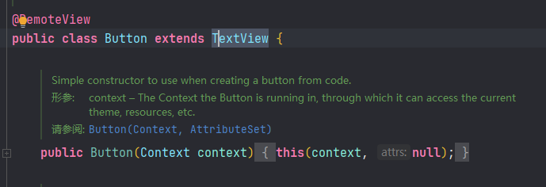


此外，按钮还要额外注意textAllCaps与onClick两个属性


**textAllCaps属性**

对于TextView来说，text属性设置了什么文本，文本视图就显示什么文本。但对于Button来说，不管 text属性设置的是大写字母还是小写字母，按钮控件都默认转成大写字母显示。

该属性默认为true表 示全部转为大写，如果设置为false则表示不转为大写。于是在布局文件添加新的Button标签，该标签补 充了android:textAllCaps="false"


```xml
<?xml version="1.0" encoding="utf-8"?>
<LinearLayout xmlns:android="http://schemas.android.com/apk/res/android"
        xmlns:tools="http://schemas.android.com/tools"
        xmlns:app="http://schemas.android.com/apk/res-auto"
        android:layout_width="match_parent"
        android:layout_height="match_parent"
        tools:context=".MainActivity2"
        android:orientation="vertical"
        android:gravity="center">

    <TextView
            android:layout_width="match_parent"
            android:layout_height="wrap_content"
            android:text="自动转大写"
            android:textSize="20sp"
            android:gravity="center"/>

    <Button
            android:layout_width="match_parent"
            android:layout_height="wrap_content"
            android:text="abcdefABC123你好"
            android:textSize="16sp" />

    <TextView
            android:layout_width="match_parent"
            android:layout_height="wrap_content"
            android:text="保持原样"
            android:textSize="20sp"
            android:gravity="center"
            android:layout_marginTop="30sp"/>

    <Button
            android:layout_width="match_parent"
            android:layout_height="wrap_content"
            android:text="abcdefABC123你好"
            android:textSize="16sp"
            android:textAllCaps="false" />


</LinearLayout>
```


**onClick属性**

按钮之所以成为按钮，是因为它会响应按下动作，就手机而言，按下动作等同于点击操作，即手指轻触 屏幕然后马上松开。每当点击按钮之时，就表示用户确认了某个事项，接下来轮到App接着处理了。 onClick属性便用来接管用户的点击动作，该属性的值是个方法名，也就是当前页面的Java代码存在这么 一个方法：当用户点击按钮时，就自动调用该方法。


```xml
<?xml version="1.0" encoding="utf-8"?>
<LinearLayout xmlns:android="http://schemas.android.com/apk/res/android"
        xmlns:tools="http://schemas.android.com/tools"
        xmlns:app="http://schemas.android.com/apk/res-auto"
        android:layout_width="match_parent"
        android:layout_height="match_parent"
        tools:context=".MainActivity3"
        android:orientation="vertical"
        android:gravity="center">


    <Button
            android:layout_width="match_parent"
            android:layout_height="wrap_content"
            android:text="请点击按钮"
            android:textSize="16sp"
            android:onClick="onClick"/>


</LinearLayout>
```


```java
package mao.android_button;

import androidx.appcompat.app.AppCompatActivity;

import android.os.Bundle;
import android.util.Log;
import android.view.View;

public class MainActivity3 extends AppCompatActivity
{
    public static final String TAG = "MainActivity3";

    @Override
    protected void onCreate(Bundle savedInstanceState)
    {
        super.onCreate(savedInstanceState);
        setContentView(R.layout.activity_main3);
    }

    public void onClick(View view)
    {
        Log.d(TAG, "onClick: 按钮被点击了");
    }
}
```


### 点击事件和长按事件

虽然按钮控件能够在XML文件中通过onClick属性指定点击方法，但是方法的名称可以随便叫，既能叫 doClick也能叫doTouch，甚至叫它doA或doB都没问题，这样很不利于规范化代码，倘若以后换了别人 接手，就不晓得doA或doB是干什么用的。因此在实际开发中，不推荐使用Button标签的onClick属性， 而是在代码中给按钮对象注册点击监听器


所谓监听器，意思是专门监听控件的动作行为，它平时无所事事，只有控件发生了指定的动作，监听器 才会触发开关去执行对应的代码逻辑。点击监听器需要实现接口View.OnClickListener，并重写onClick 方法补充点击事件的处理代码，再由按钮调用setOnClickListener方法设置监听器对象。


```xml
<?xml version="1.0" encoding="utf-8"?>
<LinearLayout xmlns:android="http://schemas.android.com/apk/res/android"
        xmlns:tools="http://schemas.android.com/tools"
        xmlns:app="http://schemas.android.com/apk/res-auto"
        android:layout_width="match_parent"
        android:layout_height="match_parent"
        tools:context=".MainActivity"
        android:gravity="center"
        android:orientation="vertical">

    <Button
            android:id="@+id/button1"
            android:layout_width="match_parent"
            android:layout_height="wrap_content"
            android:text="页面1"
            android:textSize="16sp"
            android:textAllCaps="false" />

    <Button
            android:id="@+id/button2"
            android:layout_width="match_parent"
            android:layout_height="wrap_content"
            android:text="页面2"
            android:textSize="16sp"
            android:textAllCaps="false" />

</LinearLayout>
```


```java
package mao.android_button;

import androidx.appcompat.app.AppCompatActivity;

import android.content.Intent;
import android.os.Bundle;
import android.view.View;
import android.widget.Button;

public class MainActivity extends AppCompatActivity
{

    @Override
    protected void onCreate(Bundle savedInstanceState)
    {
        super.onCreate(savedInstanceState);
        setContentView(R.layout.activity_main);

        //也可以不使用匿名内部类的方法设置监听器，也可以使用lambda表达式创建，
        //也可以复用一个View.OnClickListener实例
        findViewById(R.id.button1).setOnClickListener(new View.OnClickListener()
        {
            @Override
            public void onClick(View v)
            {
                startActivity(new Intent(MainActivity.this, MainActivity2.class));
            }
        });

        findViewById(R.id.button2).setOnClickListener(new View.OnClickListener()
        {
            @Override
            public void onClick(View v)
            {
                startActivity(new Intent(MainActivity.this, MainActivity3.class));
            }
        });
    }
}
```


如果一个页面只有一个按钮，单独定义新的监听器倒也无妨，可是如果存在许多按钮，每个按钮都定义自己的监听器，不是很好。对于同时监听多个按钮的情况，更好的办法是注册统一的监听器，也就是让当前页面实现接口View.OnClickListener，如此一来，onClick方法便写在了页面代码之内。因为 是统一的监听器，所以onClick内部需要判断是哪个按钮被点击了，也就是利用视图对象的getId方法检查控件编号


```java
package mao.android_button;

import androidx.appcompat.app.AppCompatActivity;

import android.content.Intent;
import android.os.Bundle;
import android.view.View;
import android.widget.Button;

public class MainActivity extends AppCompatActivity
{

    @Override
    protected void onCreate(Bundle savedInstanceState)
    {
        super.onCreate(savedInstanceState);
        setContentView(R.layout.activity_main);

        //也可以不使用匿名内部类的方法设置监听器，也可以使用lambda表达式创建，
        //也可以复用一个View.OnClickListener实例
/*        findViewById(R.id.button1).setOnClickListener(new View.OnClickListener()
        {
            @Override
            public void onClick(View v)
            {
                startActivity(new Intent(MainActivity.this, MainActivity2.class));
            }
        });

        findViewById(R.id.button2).setOnClickListener(new View.OnClickListener()
        {
            @Override
            public void onClick(View v)
            {
                startActivity(new Intent(MainActivity.this, MainActivity3.class));
            }
        });*/

        View.OnClickListener onClickListener = new View.OnClickListener()
        {
            @Override
            public void onClick(View v)
            {
                if (v.getId() == R.id.button1)
                {
                    startActivity(new Intent(MainActivity.this, MainActivity2.class));
                }
                else if (v.getId() == R.id.button2)
                {
                    startActivity(new Intent(MainActivity.this, MainActivity3.class));
                }
                else
                {
                    //...
                }
            }
        };

        findViewById(R.id.button1).setOnClickListener(onClickListener);
        findViewById(R.id.button2).setOnClickListener(onClickListener);


    }
}
```


**长按事件**

除了点击事件，Android还设计了另外一种长按事件，每当控件被按住超过500毫秒之后，就会触发该控件的长按事件。若要捕捉按钮的长按事件，可调用按钮对象的setOnLongClickListener方法设置长按监听器。


```xml
<?xml version="1.0" encoding="utf-8"?>
<LinearLayout xmlns:android="http://schemas.android.com/apk/res/android"
        xmlns:tools="http://schemas.android.com/tools"
        xmlns:app="http://schemas.android.com/apk/res-auto"
        android:layout_width="match_parent"
        android:layout_height="match_parent"
        tools:context=".MainActivity4"
        android:orientation="vertical"
        android:gravity="center">


    <Button
            android:id="@+id/button4"
            android:layout_width="match_parent"
            android:layout_height="wrap_content"
            android:text="请长按按钮"
            android:textSize="16sp" />


</LinearLayout>
```


```java
package mao.android_button;

import androidx.appcompat.app.AppCompatActivity;

import android.os.Bundle;
import android.util.Log;
import android.view.View;

public class MainActivity4 extends AppCompatActivity
{
    public static final String TAG = "MainActivity4";

    @Override
    protected void onCreate(Bundle savedInstanceState)
    {
        super.onCreate(savedInstanceState);
        setContentView(R.layout.activity_main4);

        findViewById(R.id.button4).setLongClickable(true);
        findViewById(R.id.button4).setOnLongClickListener(new View.OnLongClickListener()
        {
            @Override
            public boolean onLongClick(View v)
            {
                Log.d(TAG, "onClick: 长按按钮事件被触发了");
                return true;
            }
        });
    }
}
```


点击监听器和长按监听器不局限于按钮控件，其实它们都来源于视图基类View，凡是从 View派生而来的各类控件，均可注册点击监听器和长按监听器。譬如文本视图TextView，其对象也能调 用setOnClickListener方法与setOnLongClickListener方法，此时TextView控件就会响应点击动作和长 按动作。因为按钮存在按下和松开两种背景，便于提示用户该控件允许点击，但文本视图默认没有按压 背景，不方便判断是否被点击，所以一般不会让文本视图处理点击事件和长按事件


### 禁用与恢复按钮

尽管按钮控件生来就是给人点击的，可是某些情况希望暂时禁止点击操作，譬如用户在注册的时候，有 的网站要求用户必须同意指定条款，而且至少浏览10秒之后才能点击注册按钮。那么在10秒之前，注册 按钮应当置灰且不能点击，等过了10秒之后，注册按钮才恢复正常。在这样的业务场景中，按钮先后拥 有两种状态，即不可用状态与可用状态

* 不可用按钮：按钮不允许点击，即使点击也没反应，同时按钮文字为灰色
* 可用按钮：按钮允许点击，点击按钮会触发点击事件，同时按钮文字为正常的黑色


从上述的区别说明可知，不可用与可用状态主要有两点差异：其一，是否允许点击；其二，按钮文字的 颜色。就文字颜色而言，可在布局文件中使用textColor属性设置颜色，也可在Java代码中调用 setTextColor方法设置颜色。至于是否允许点击，则需引入新属性android:enabled，该属性值为true时 表示启用按钮，即允许点击按钮；该属性值为false时表示禁用按钮，即不允许点击按钮。在Java代码 中，则可通过setEnabled方法设置按钮的可用状态（true表示启用，false表示禁用）


```xml
<?xml version="1.0" encoding="utf-8"?>
<LinearLayout xmlns:android="http://schemas.android.com/apk/res/android"
        xmlns:tools="http://schemas.android.com/tools"
        xmlns:app="http://schemas.android.com/apk/res-auto"
        android:layout_width="match_parent"
        android:layout_height="match_parent"
        tools:context=".MainActivity5">

    <Button
            android:layout_width="wrap_content"
            android:layout_height="wrap_content"
            android:text="按钮为启用状态"
            android:textSize="20sp"
            android:textColor="#ff00ff" />

    <Button
            android:layout_width="wrap_content"
            android:layout_height="wrap_content"
            android:text="按钮为禁用状态"
            android:textSize="20sp"
            android:textColor="@color/purple_500"
            android:enabled="false" />


</LinearLayout>
```


**模拟验证码发送按钮**


```xml
<?xml version="1.0" encoding="utf-8"?>
<LinearLayout xmlns:android="http://schemas.android.com/apk/res/android"
        xmlns:tools="http://schemas.android.com/tools"
        xmlns:app="http://schemas.android.com/apk/res-auto"
        android:layout_width="match_parent"
        android:layout_height="match_parent"
        tools:context=".MainActivity6"
        android:orientation="vertical"
        android:gravity="center">


    <Button
            android:id="@+id/button6"
            android:layout_width="match_parent"
            android:layout_height="wrap_content"
            android:layout_margin="50dp"
            android:text="@string/send_code"
            android:textColor="@color/design_default_color_secondary"
            android:textSize="20sp" />


</LinearLayout>
```


```java
package mao.android_button;

import androidx.appcompat.app.AppCompatActivity;

import android.os.Bundle;
import android.util.Log;
import android.view.View;
import android.widget.Button;

import java.util.Timer;
import java.util.TimerTask;
import java.util.concurrent.locks.LockSupport;

public class MainActivity6 extends AppCompatActivity
{

    private Button button;

    public static final String TAG = "MainActivity6";

    @Override
    protected void onCreate(Bundle savedInstanceState)
    {
        super.onCreate(savedInstanceState);
        setContentView(R.layout.activity_main6);
        button = findViewById(R.id.button6);
        button.setOnClickListener(new View.OnClickListener()
        {
            @Override
            public void onClick(View v)
            {
                handler();
            }
        });
    }

    private void handler()
    {
        Log.d(TAG, "onClick: 调用");
        if (!button.isEnabled())
        {
            //其实跑不到这里
            Log.d(TAG, "onClick: 不可用");
        }
        //当前可用
        button.setEnabled(false);
        final int[] i = {10};


        Timer timer = new Timer();
        timer.schedule(new TimerTask()
        {
            @Override
            public void run()
            {
                button.setText(String.valueOf(i[0]));
                if (i[0] < 0)
                {
                    MainActivity6.this.runOnUiThread(new Runnable()
                    {
                        @Override
                        public void run()
                        {
                            //Thread.sleep();方法调用会无响应
                            //LockSupport.park也是一样，原子操作(cas)也是一样
                            //Android系统中的视图组件并不是线程安全的，
                            // 如果要更新视图，必须在主线程中更新，不可以在子线程中执行更新的操作。
                            //Only the original thread that created a view hierarchy can touch its views.
                            //解决方案：MainActivity6.this.runOnUiThread
                            //或者使用Handler对象
                            button.setEnabled(true);
                            button.setText("重新发送验证码");
                            timer.cancel();
                        }
                    });
                }
                i[0]--;
            }
        }, 0, 1000);

    }
}
```


**注意：**

**Thread.sleep();方法调用会无响应，LockSupport.park也是一样，原子操作(cas)也是一样**
**Android系统中的视图组件并不是线程安全的，**
**如果要更新视图，必须在主线程中更新，不可以在子线程中执行更新的操作。**
**Only the original thread that created a view hierarchy can touch its views.**
**解决方案：MainActivity6.this.runOnUiThread，或者使用Handler对象**


运行


主页面


```xml
<?xml version="1.0" encoding="utf-8"?>
<LinearLayout xmlns:android="http://schemas.android.com/apk/res/android"
        xmlns:tools="http://schemas.android.com/tools"
        xmlns:app="http://schemas.android.com/apk/res-auto"
        android:layout_width="match_parent"
        android:layout_height="match_parent"
        tools:context=".MainActivity"
        android:gravity="center"
        android:orientation="vertical">

    <Button
            android:id="@+id/button1"
            android:layout_width="match_parent"
            android:layout_height="wrap_content"
            android:text="页面1"
            android:textSize="16sp"
            android:textAllCaps="false" />

    <Button
            android:id="@+id/button2"
            android:layout_width="match_parent"
            android:layout_height="wrap_content"
            android:text="页面2"
            android:textSize="16sp"
            android:textAllCaps="false" />

    <Button
            android:id="@+id/button3"
            android:layout_width="match_parent"
            android:layout_height="wrap_content"
            android:text="页面3"
            android:textSize="16sp"
            android:textAllCaps="false" />

    <Button
            android:id="@+id/button5"
            android:layout_width="match_parent"
            android:layout_height="wrap_content"
            android:text="页面4"
            android:textSize="16sp"
            android:textAllCaps="false" />

    <Button
            android:id="@+id/button7"
            android:layout_width="match_parent"
            android:layout_height="wrap_content"
            android:text="页面5"
            android:textSize="16sp"
            android:textAllCaps="false" />

</LinearLayout>
```


```java
package mao.android_button;

import androidx.appcompat.app.AppCompatActivity;

import android.content.Intent;
import android.os.Bundle;
import android.view.View;
import android.widget.Button;

public class MainActivity extends AppCompatActivity
{

    @Override
    protected void onCreate(Bundle savedInstanceState)
    {
        super.onCreate(savedInstanceState);
        setContentView(R.layout.activity_main);

        //也可以不使用匿名内部类的方法设置监听器，也可以使用lambda表达式创建，
        //也可以复用一个View.OnClickListener实例
/*        findViewById(R.id.button1).setOnClickListener(new View.OnClickListener()
        {
            @Override
            public void onClick(View v)
            {
                startActivity(new Intent(MainActivity.this, MainActivity2.class));
            }
        });

        findViewById(R.id.button2).setOnClickListener(new View.OnClickListener()
        {
            @Override
            public void onClick(View v)
            {
                startActivity(new Intent(MainActivity.this, MainActivity3.class));
            }
        });*/

        View.OnClickListener onClickListener = new View.OnClickListener()
        {
            @Override
            public void onClick(View v)
            {
                if (v.getId() == R.id.button1)
                {
                    startActivity(new Intent(MainActivity.this, MainActivity2.class));
                }
                else if (v.getId() == R.id.button2)
                {
                    startActivity(new Intent(MainActivity.this, MainActivity3.class));
                }
                else if (v.getId()==R.id.button3)
                {
                    startActivity(new Intent(MainActivity.this, MainActivity4.class));
                }
                else if (v.getId()==R.id.button5)
                {
                    startActivity(new Intent(MainActivity.this, MainActivity5.class));
                }
                else if (v.getId()==R.id.button7)
                {
                    startActivity(new Intent(MainActivity.this, MainActivity6.class));
                }
                else
                {
                    //...
                }
            }
        };

        findViewById(R.id.button1).setOnClickListener(onClickListener);
        findViewById(R.id.button2).setOnClickListener(onClickListener);
        findViewById(R.id.button3).setOnClickListener(onClickListener);
        findViewById(R.id.button5).setOnClickListener(onClickListener);
        findViewById(R.id.button7).setOnClickListener(onClickListener);
    }
}
```


## 消息提示

### Toast

App同用户交互的过程中，时常要向用户反馈一些信息，例如：点错了按钮、输入了非法字符等等，诸如此类。对于这些一句话的提示，Android设计了Toast控件，用于展示短暂的提示文字。

```java
Toast.makeText(MainActivity.this, "提示文字", Toast.LENGTH_SHORT).show();
```

其中show方法用来展示提示窗，而makeText方 法用来构建提示文字的模板。makeText的第一个参数为当前页面的实例；第二个参数为准备显示的提示文本；第三个参数规定了提示窗的驻留时长，为Toast.LENGTH_SHORT表示停留 2秒后消失，为Toast.LENGTH_LONG表示停留3.5秒后消失


## 图像显示

### 图像视图ImageView

显示文本用到了文本视图TextView，显示图像则用到图像视图ImageView。由于图像通常保存为单独的 图片文件，因此需要先把图片放到res/drawable目录，然后再去引用该图片的资源名称。比如现在有张 苹果图片名为apple.png，那么XML文件通过属性android:src设置图片资源，属性值格式形如 “@drawable/不含扩展名的图片名称”。

```xml
<ImageView
android:layout_width="match_parent"
android:layout_height="200dp"
android:src="@drawable/apple" />
```


```xml
<?xml version="1.0" encoding="utf-8"?>
<LinearLayout xmlns:android="http://schemas.android.com/apk/res/android"
        xmlns:tools="http://schemas.android.com/tools"
        android:layout_width="match_parent"
        android:layout_height="match_parent"
        tools:context=".MainActivity2"
        android:orientation="vertical"
        android:gravity="center"
        android:background="#444444">


    <ImageView
            android:layout_width="match_parent"
            android:layout_height="wrap_content"
            android:src="@drawable/img"
            android:contentDescription="图片" />

</LinearLayout>
```


ImageView本身默认图片居中显示，不管图片有多大抑或有多小，图像视图都会自动缩放图片，使之刚 好够着ImageView的边界，并且缩放后的图片保持原始的宽高比例，看起来图片很完美地占据视图中 央。这种缩放类型在XML文件中通过属性android:scaleType定义，即使图像视图未明确指定该属性，系 统也会默认其值为fitCenter，表示让图像缩放后居中显示。


在Java代码中可调用setScaleType方法设置图像视图的缩放类型


```java
package mao.android_imageview;

import androidx.appcompat.app.AppCompatActivity;

import android.os.Bundle;
import android.widget.ImageView;

public class MainActivity10 extends AppCompatActivity
{

    @Override
    protected void onCreate(Bundle savedInstanceState)
    {
        super.onCreate(savedInstanceState);
        setContentView(R.layout.activity_main10);
        ImageView imageView1 = findViewById(R.id.ImageView1);
        imageView1.setScaleType(ImageView.ScaleType.CENTER);
    }
}
```


枚举

```java
/**
 * Options for scaling the bounds of an image to the bounds of this view.
 */
public enum ScaleType {
    /**
     * Scale using the image matrix when drawing. The image matrix can be set using
     * {@link ImageView#setImageMatrix(Matrix)}. From XML, use this syntax:
     * <code>android:scaleType="matrix"</code>.
     */
    MATRIX      (0),
    /**
     * Scale the image using {@link Matrix.ScaleToFit#FILL}.
     * From XML, use this syntax: <code>android:scaleType="fitXY"</code>.
     */
    FIT_XY      (1),
    /**
     * Scale the image using {@link Matrix.ScaleToFit#START}.
     * From XML, use this syntax: <code>android:scaleType="fitStart"</code>.
     */
    FIT_START   (2),
    /**
     * Scale the image using {@link Matrix.ScaleToFit#CENTER}.
     * From XML, use this syntax:
     * <code>android:scaleType="fitCenter"</code>.
     */
    FIT_CENTER  (3),
    /**
     * Scale the image using {@link Matrix.ScaleToFit#END}.
     * From XML, use this syntax: <code>android:scaleType="fitEnd"</code>.
     */
    FIT_END     (4),
    /**
     * Center the image in the view, but perform no scaling.
     * From XML, use this syntax: <code>android:scaleType="center"</code>.
     */
    CENTER      (5),
    /**
     * Scale the image uniformly (maintain the image's aspect ratio) so
     * that both dimensions (width and height) of the image will be equal
     * to or larger than the corresponding dimension of the view
     * (minus padding). The image is then centered in the view.
     * From XML, use this syntax: <code>android:scaleType="centerCrop"</code>.
     */
    CENTER_CROP (6),
    /**
     * Scale the image uniformly (maintain the image's aspect ratio) so
     * that both dimensions (width and height) of the image will be equal
     * to or less than the corresponding dimension of the view
     * (minus padding). The image is then centered in the view.
     * From XML, use this syntax: <code>android:scaleType="centerInside"</code>.
     */
    CENTER_INSIDE (7);

    ScaleType(int ni) {
        nativeInt = ni;
    }
    final int nativeInt;
}
```


缩放类型


```xml
<?xml version="1.0" encoding="utf-8"?>
<LinearLayout xmlns:android="http://schemas.android.com/apk/res/android"
        xmlns:tools="http://schemas.android.com/tools"
        android:layout_width="match_parent"
        android:layout_height="match_parent"
        tools:context=".MainActivity3"
        android:orientation="vertical"
        android:gravity="center"
        android:background="#444444">


    <ImageView
            android:background="@color/cardview_shadow_start_color"
            android:layout_width="match_parent"
            android:layout_height="200dp"
            android:src="@drawable/img"
            android:contentDescription="图片"
            android:scaleType="fitCenter"/>

</LinearLayout>
```


```xml
<?xml version="1.0" encoding="utf-8"?>
<LinearLayout xmlns:android="http://schemas.android.com/apk/res/android"
        xmlns:tools="http://schemas.android.com/tools"
        android:layout_width="match_parent"
        android:layout_height="match_parent"
        tools:context=".MainActivity4"
        android:orientation="vertical"
        android:gravity="center"
        android:background="#444444">


    <ImageView
            android:background="@color/cardview_shadow_start_color"
            android:layout_width="match_parent"
            android:layout_height="200dp"
            android:src="@drawable/img"
            android:contentDescription="图片"
            android:scaleType="centerCrop"/>

</LinearLayout>
```


```xml
<?xml version="1.0" encoding="utf-8"?>
<LinearLayout xmlns:android="http://schemas.android.com/apk/res/android"
        xmlns:tools="http://schemas.android.com/tools"
        android:layout_width="match_parent"
        android:layout_height="match_parent"
        tools:context=".MainActivity5"
        android:orientation="vertical"
        android:gravity="center"
        android:background="#444444">


    <ImageView
            android:background="@color/cardview_shadow_start_color"
            android:layout_width="match_parent"
            android:layout_height="200dp"
            android:src="@drawable/img"
            android:contentDescription="图片"
            android:scaleType="centerInside"/>

</LinearLayout>
```


```xml
<?xml version="1.0" encoding="utf-8"?>
<LinearLayout xmlns:android="http://schemas.android.com/apk/res/android"
        xmlns:tools="http://schemas.android.com/tools"
        android:layout_width="match_parent"
        android:layout_height="match_parent"
        tools:context=".MainActivity6"
        android:orientation="vertical"
        android:gravity="center"
        android:background="#444444">


    <ImageView
            android:background="@color/cardview_shadow_start_color"
            android:layout_width="match_parent"
            android:layout_height="200dp"
            android:src="@drawable/img"
            android:contentDescription="图片"
            android:scaleType="center"/>

</LinearLayout>
```


```xml
<?xml version="1.0" encoding="utf-8"?>
<LinearLayout xmlns:android="http://schemas.android.com/apk/res/android"
        xmlns:tools="http://schemas.android.com/tools"
        android:layout_width="match_parent"
        android:layout_height="match_parent"
        tools:context=".MainActivity7"
        android:orientation="vertical"
        android:gravity="center"
        android:background="#444444">


    <ImageView
            android:background="@color/cardview_shadow_start_color"
            android:layout_width="match_parent"
            android:layout_height="200dp"
            android:src="@drawable/img"
            android:contentDescription="图片"
            android:scaleType="fitXY"/>

</LinearLayout>
```


```xml
<?xml version="1.0" encoding="utf-8"?>
<LinearLayout xmlns:android="http://schemas.android.com/apk/res/android"
        xmlns:tools="http://schemas.android.com/tools"
        android:layout_width="match_parent"
        android:layout_height="match_parent"
        tools:context=".MainActivity8"
        android:orientation="vertical"
        android:gravity="center"
        android:background="#444444">


    <ImageView
            android:background="@color/cardview_shadow_start_color"
            android:layout_width="match_parent"
            android:layout_height="200dp"
            android:src="@drawable/img"
            android:contentDescription="图片"
            android:scaleType="fitStart"/>

</LinearLayout>
```


```xml
<?xml version="1.0" encoding="utf-8"?>
<LinearLayout xmlns:android="http://schemas.android.com/apk/res/android"
        xmlns:tools="http://schemas.android.com/tools"
        android:layout_width="match_parent"
        android:layout_height="match_parent"
        tools:context=".MainActivity9"
        android:orientation="vertical"
        android:gravity="center"
        android:background="#444444">


    <ImageView
            android:background="@color/cardview_shadow_start_color"
            android:layout_width="match_parent"
            android:layout_height="200dp"
            android:src="@drawable/img"
            android:contentDescription="图片"
            android:scaleType="fitEnd"/>

</LinearLayout>
```


```xml
<?xml version="1.0" encoding="utf-8"?>
<LinearLayout xmlns:android="http://schemas.android.com/apk/res/android"
        xmlns:tools="http://schemas.android.com/tools"
        android:layout_width="match_parent"
        android:layout_height="match_parent"
        tools:context=".MainActivity10"
        android:orientation="vertical"
        android:gravity="center"
        android:background="#444444">


    <ImageView
            android:id="@+id/ImageView1"
            android:background="@color/cardview_shadow_start_color"
            android:layout_width="match_parent"
            android:layout_height="200dp"
            android:src="@drawable/img"
            android:contentDescription="图片" />

</LinearLayout>
```


主页面

```xml
<?xml version="1.0" encoding="utf-8"?>
<LinearLayout xmlns:android="http://schemas.android.com/apk/res/android"
        xmlns:tools="http://schemas.android.com/tools"
        android:layout_width="match_parent"
        android:layout_height="match_parent"
        tools:context=".MainActivity"
        android:orientation="vertical"
        android:gravity="center">

    <Button
            android:id="@+id/button1"
            android:layout_width="match_parent"
            android:layout_height="wrap_content"
            android:text="默认scaleType"
            android:textColor="@color/purple_200"
            android:textSize="25sp"
            android:textAllCaps="false"/>

    <Button
            android:id="@+id/button2"
            android:layout_width="match_parent"
            android:layout_height="wrap_content"
            android:text="fitCenter"
            android:textColor="@color/purple_200"
            android:textSize="25sp"
            android:textAllCaps="false"/>


    <Button
            android:id="@+id/button3"
            android:layout_width="match_parent"
            android:layout_height="wrap_content"
            android:text="centerCrop"
            android:textColor="@color/purple_200"
            android:textSize="25sp"
            android:textAllCaps="false"/>

    <Button
            android:id="@+id/button4"
            android:layout_width="match_parent"
            android:layout_height="wrap_content"
            android:text="centerInside"
            android:textColor="@color/purple_200"
            android:textSize="25sp"
            android:textAllCaps="false"/>

    <Button
            android:id="@+id/button5"
            android:layout_width="match_parent"
            android:layout_height="wrap_content"
            android:text="center"
            android:textColor="@color/purple_200"
            android:textSize="25sp"
            android:textAllCaps="false"/>

    <Button
            android:id="@+id/button6"
            android:layout_width="match_parent"
            android:layout_height="wrap_content"
            android:text="fitXY"
            android:textColor="@color/purple_200"
            android:textSize="25sp"
            android:textAllCaps="false"/>

    <Button
            android:id="@+id/button7"
            android:layout_width="match_parent"
            android:layout_height="wrap_content"
            android:text="fitStart"
            android:textColor="@color/purple_200"
            android:textSize="25sp"
            android:textAllCaps="false"/>

    <Button
            android:id="@+id/button8"
            android:layout_width="match_parent"
            android:layout_height="wrap_content"
            android:text="fitEnd"
            android:textColor="@color/purple_200"
            android:textSize="25sp"
            android:textAllCaps="false"/>

    <Button
            android:id="@+id/button9"
            android:layout_width="match_parent"
            android:layout_height="wrap_content"
            android:text="通过java代码设置"
            android:textColor="@color/purple_200"
            android:textSize="25sp"
            android:textAllCaps="false"/>


</LinearLayout>
```


```java
package mao.android_imageview;

import androidx.appcompat.app.AppCompatActivity;

import android.content.Intent;
import android.os.Bundle;
import android.view.View;

public class MainActivity extends AppCompatActivity
{

    @Override
    protected void onCreate(Bundle savedInstanceState)
    {
        super.onCreate(savedInstanceState);
        setContentView(R.layout.activity_main);
        findViewById(R.id.button1).setOnClickListener(new View.OnClickListener()
        {
            @Override
            public void onClick(View v)
            {
                startActivity(new Intent(MainActivity.this, MainActivity2.class));
            }
        });
        findViewById(R.id.button1).setOnClickListener(new View.OnClickListener()
        {
            @Override
            public void onClick(View v)
            {
                startActivity(new Intent(MainActivity.this, MainActivity2.class));
            }
        });
        findViewById(R.id.button2).setOnClickListener(new View.OnClickListener()
        {
            @Override
            public void onClick(View v)
            {
                startActivity(new Intent(MainActivity.this, MainActivity3.class));
            }
        });
        findViewById(R.id.button3).setOnClickListener(new View.OnClickListener()
        {
            @Override
            public void onClick(View v)
            {
                startActivity(new Intent(MainActivity.this, MainActivity4.class));
            }
        });
        findViewById(R.id.button4).setOnClickListener(new View.OnClickListener()
        {
            @Override
            public void onClick(View v)
            {
                startActivity(new Intent(MainActivity.this, MainActivity5.class));
            }
        });
        findViewById(R.id.button5).setOnClickListener(new View.OnClickListener()
        {
            @Override
            public void onClick(View v)
            {
                startActivity(new Intent(MainActivity.this, MainActivity6.class));
            }
        });
        findViewById(R.id.button6).setOnClickListener(new View.OnClickListener()
        {
            @Override
            public void onClick(View v)
            {
                startActivity(new Intent(MainActivity.this, MainActivity7.class));
            }
        });
        findViewById(R.id.button7).setOnClickListener(new View.OnClickListener()
        {
            @Override
            public void onClick(View v)
            {
                startActivity(new Intent(MainActivity.this, MainActivity8.class));
            }
        });
        findViewById(R.id.button8).setOnClickListener(new View.OnClickListener()
        {
            @Override
            public void onClick(View v)
            {
                startActivity(new Intent(MainActivity.this, MainActivity9.class));
            }
        });
        findViewById(R.id.button9).setOnClickListener(new View.OnClickListener()
        {
            @Override
            public void onClick(View v)
            {
                startActivity(new Intent(MainActivity.this, MainActivity10.class));
            }
        });
    }
}
```


运行


按顺序点击


表面上 fitCenter、centerInside、center三个类型都是居中显示，且均不越过图像视图的边界。
它们之间的区 别在于：fitCenter既允许缩小图片、也允许放大图片，centerInside只允许缩小图片、不允许放大图 标，而center自始至终保持原始尺寸（既不允许缩小图片、也不允许放大图片）。
因此，当图片尺寸大于视图宽高，centerInside与fitCenter都会缩小图片，此时它俩的显示效果相同；当图片尺寸小于视图宽高，centerInside与center都保持图片大小不变，此时它俩的显示效果相同。


### 图像按钮ImageButton

常见的按钮控件Button其实是文本按钮，因为按钮上面只能显示文字，不能显示图片，ImageButton才是显示图片的图像按钮。虽然ImageButton号称图像按钮，但它并非继承Button，而是继承了 ImageView


* Button既可显示文本也可显示图片（通过setBackgroundResource方法设置背景图片），而 ImageButton只能显示图片不能显示文本
* ImageButton上的图像可按比例缩放，而Button通过背景设置的图像会拉伸变形，因为背景图采取 fitXY方式，无法按比例缩放
* Button只能靠背景显示一张图片，而ImageButton可分别在前景和背景显示图片，从而实现两张图片叠加的效果


不过使用ImageButton得注意，图像按钮默认的缩放类型为center（保持原始尺寸不缩放图片），而非 图像视图默认的fitCenter，倘若图片尺寸较大，那么图像按钮将无法显示整个图片。为避免显示不完整 的情况，XML文件中的ImageButton标签必须指定fitCenter的缩放类型


```xml
<?xml version="1.0" encoding="utf-8"?>
<LinearLayout xmlns:android="http://schemas.android.com/apk/res/android"
        xmlns:tools="http://schemas.android.com/tools"
        xmlns:app="http://schemas.android.com/apk/res-auto"
        android:layout_width="match_parent"
        android:layout_height="match_parent"
        tools:context=".MainActivity"
        android:orientation="vertical"
        android:gravity="center"
        android:padding="50dp">

    <TextView
            android:layout_width="wrap_content"
            android:layout_height="wrap_content"
            android:text="点击下面的图片按钮"
            android:layout_marginBottom="20dp"
            android:textSize="20sp" />

    <ImageButton
            android:id="@+id/ImageButton1"
            android:layout_width="match_parent"
            android:layout_height="200dp"
            android:src="@drawable/ic_launcher_foreground"
            android:background="@drawable/img"
            android:scaleType="fitCenter"/>

</LinearLayout>
```


```java
package mao.android_imagebutton;

import androidx.appcompat.app.AppCompatActivity;

import android.os.Bundle;
import android.util.Log;
import android.view.View;
import android.widget.ImageButton;

public class MainActivity extends AppCompatActivity
{

    public static final String TAG = "MainActivity";

    @Override
    protected void onCreate(Bundle savedInstanceState)
    {
        super.onCreate(savedInstanceState);
        setContentView(R.layout.activity_main);
        ImageButton imageButton1 = findViewById(R.id.ImageButton1);
        imageButton1.setOnClickListener(new View.OnClickListener()
        {
            @Override
            public void onClick(View v)
            {
                Log.d(TAG, "onClick: 点击");
            }
        });
    }
}
```


### 同时展示文本与图像

现在有了Button可在按钮上显示文字，又有ImageButton可在按钮上显示图像，照理说绝大多数场合都够用了。然而现实项目中的需求往往捉摸不定，例如客户要求在按钮文字的左边加一个图标，这样按钮 内部既有文字又有图片，Button和ImageButton都没法直接使用。若用LinearLayout对 ImageView和TextView组合布局，虽然可行，XML文件却变得冗长许多。

其实有个既简单又灵活的办法，要想在文字周围放置图片，使用按钮控件Button就能实现。

* drawableTop：指定文字上方的图片
* drawableBottom：指定文字下方的图片
* drawableLeft：指定文字左边的图片。
* drawableRight：指定文字右边的图片
* drawablePadding：指定图片与文字的间距


```xml
<?xml version="1.0" encoding="utf-8"?>
<LinearLayout xmlns:android="http://schemas.android.com/apk/res/android"
        xmlns:tools="http://schemas.android.com/tools"
        xmlns:app="http://schemas.android.com/apk/res-auto"
        android:layout_width="match_parent"
        android:layout_height="match_parent"
        tools:context=".MainActivity"
        android:orientation="vertical"
        android:gravity="center">

    <Button
            android:layout_width="wrap_content"
            android:layout_height="wrap_content"
            android:text="图标在文字左侧"
            android:drawablePadding="5dp"
            android:drawableLeft="@drawable/ic_launcher_foreground"
            android:textSize="16sp" />

    <Button
            android:layout_width="wrap_content"
            android:layout_height="wrap_content"
            android:text="图标在文字右侧"
            android:drawablePadding="5dp"
            android:drawableRight="@drawable/ic_launcher_foreground"
            android:textSize="16sp" />

    <Button
            android:layout_width="wrap_content"
            android:layout_height="wrap_content"
            android:text="图标在文字上面"
            android:drawablePadding="5dp"
            android:drawableTop="@drawable/ic_launcher_foreground"
            android:textSize="16sp" />

    <Button
            android:layout_width="wrap_content"
            android:layout_height="wrap_content"
            android:text="图标在文字下面"
            android:drawablePadding="5dp"
            android:drawableBottom="@drawable/ic_launcher_foreground"
            android:textSize="16sp" />

</LinearLayout>
```


## 计算器

计算器的界面分为两大部分，第一部分是上方的计算表达式，既包括用户的按键输入，也包括计算结果 数字；第二部分是下方的各个按键，例如：从0到9的数字按钮、加减乘除与等号、正负号按钮、小数点 按钮、求倒数按钮、平方按钮、开方按钮，以及退格、清空、取消等控制按钮。通过这些按键操作，能 够实现整数和小数的四则运算，以及求倒数、求平方、求开方等简单运算


按照计算器App的效果图，大致分布着下列Android控件：

* 线性布局LinearLayout：因为计算器界面整体从上往下布局，所以需要垂直方向的LinearLayout
* 网格布局GridLayout：计算器下半部分的几排按钮，正好成五行四列表格分布，适合采用GridLayout
* 滚动视图ScrollView：虽然计算器界面不宽也不高，但是以防万一，最好还是加个垂直方向的ScrollView
* 文本视图TextView：很明显顶部标题“简单计算器”就是TextView，且文字居中显示；标题下面的计算结果也需要使用TextView，且文字靠右靠下显示
* 按钮Button：几乎所有的数字与运算符按钮都采用了Button控件
* 图像按钮ImageButton：开根号的运算符“√”虽然能够打出来，但是右上角少了一横， 所以该按钮要显示一张标准的开根号图片，这用到了ImageButton


对于简单计算来说，每次运算至少需要两个操作数，比如加减乘除四则运算就要求有两个操作数，求倒数、求平方、求开方只要求一个操作数；并且每次运算过程有且仅有一个运算符（等号不计在内）


布局

```xml
<?xml version="1.0" encoding="utf-8"?>
<LinearLayout xmlns:android="http://schemas.android.com/apk/res/android"
        xmlns:tools="http://schemas.android.com/tools"
        xmlns:app="http://schemas.android.com/apk/res-auto"
        android:layout_width="match_parent"
        android:layout_height="match_parent"
        tools:context=".MainActivity"
        android:padding="5dp"
        android:orientation="vertical">


    <ScrollView
            android:layout_width="match_parent"
            android:layout_height="wrap_content">

        <LinearLayout
                android:layout_width="match_parent"
                android:layout_height="wrap_content"
                android:orientation="vertical">

            <TextView
                    android:layout_width="match_parent"
                    android:layout_height="wrap_content"
                    android:gravity="center"
                    android:text="@string/simple_calculator"
                    android:textColor="#00ffff"
                    android:textSize="20sp" />

            <TextView
                    android:id="@+id/tv_result"
                    android:layout_width="match_parent"
                    android:layout_height="wrap_content"
                    android:gravity="right|bottom"
                    android:lines="5"
                    android:text="0"
                    android:textColor="#ff0000"
                    android:textSize="26sp"
                    android:layout_marginBottom="@dimen/show_text_marginBottom"/>

            <GridLayout
                    android:layout_width="match_parent"
                    android:layout_height="wrap_content"
                    android:columnCount="4"
                    android:rowCount="5">

                <Button
                        android:id="@+id/btn_cancel"
                        android:layout_width="0dp"
                        android:layout_height="@dimen/button_height"
                        android:layout_columnWeight="1"
                        android:gravity="center"
                        android:layout_margin="@dimen/Button_mrgin"
                        android:text="@string/cancel"
                        android:textColor="@color/black"
                        android:textSize="@dimen/button_font_size" />

                <Button
                        android:id="@+id/btn_divide"
                        android:layout_width="0dp"
                        android:layout_height="@dimen/button_height"
                        android:layout_columnWeight="1"
                        android:gravity="center"
                        android:layout_margin="@dimen/Button_mrgin"
                        android:text="@string/divide"
                        android:textColor="@color/black"
                        android:textSize="@dimen/button_font_size" />

                <Button
                        android:id="@+id/btn_multiply"
                        android:layout_width="0dp"
                        android:layout_height="@dimen/button_height"
                        android:layout_columnWeight="1"
                        android:gravity="center"
                        android:layout_margin="@dimen/Button_mrgin"
                        android:text="@string/multiply"
                        android:textColor="@color/black"
                        android:textSize="@dimen/button_font_size" />

                <Button
                        android:id="@+id/btn_clear"
                        android:layout_width="0dp"
                        android:layout_height="@dimen/button_height"
                        android:layout_columnWeight="1"
                        android:gravity="center"
                        android:layout_margin="@dimen/Button_mrgin"
                        android:text="@string/clear"
                        android:textColor="@color/black"
                        android:textSize="@dimen/button_font_size" />

                <Button
                        android:id="@+id/btn_seven"
                        android:layout_width="0dp"
                        android:layout_height="@dimen/button_height"
                        android:layout_columnWeight="1"
                        android:gravity="center"
                        android:layout_margin="@dimen/Button_mrgin"
                        android:text="@string/seven"
                        android:textColor="@color/black"
                        android:textSize="@dimen/button_font_size" />

                <Button
                        android:id="@+id/btn_eight"
                        android:layout_width="0dp"
                        android:layout_height="@dimen/button_height"
                        android:layout_columnWeight="1"
                        android:gravity="center"
                        android:layout_margin="@dimen/Button_mrgin"
                        android:text="@string/eight"
                        android:textColor="@color/black"
                        android:textSize="@dimen/button_font_size" />

                <Button
                        android:id="@+id/btn_nine"
                        android:layout_width="0dp"
                        android:layout_height="@dimen/button_height"
                        android:layout_columnWeight="1"
                        android:gravity="center"
                        android:layout_margin="@dimen/Button_mrgin"
                        android:text="@string/nine"
                        android:textColor="@color/black"
                        android:textSize="@dimen/button_font_size" />

                <Button
                        android:id="@+id/btn_plus"
                        android:layout_width="0dp"
                        android:layout_height="@dimen/button_height"
                        android:layout_columnWeight="1"
                        android:gravity="center"
                        android:layout_margin="@dimen/Button_mrgin"
                        android:text="@string/plus"
                        android:textColor="@color/black"
                        android:textSize="@dimen/button_font_size" />

                <Button
                        android:id="@+id/btn_four"
                        android:layout_width="0dp"
                        android:layout_height="@dimen/button_height"
                        android:layout_columnWeight="1"
                        android:gravity="center"
                        android:layout_margin="@dimen/Button_mrgin"
                        android:text="@string/four"
                        android:textColor="@color/black"
                        android:textSize="@dimen/button_font_size" />

                <Button
                        android:id="@+id/btn_five"
                        android:layout_width="0dp"
                        android:layout_height="@dimen/button_height"
                        android:layout_columnWeight="1"
                        android:gravity="center"
                        android:layout_margin="@dimen/Button_mrgin"
                        android:text="@string/five"
                        android:textColor="@color/black"
                        android:textSize="@dimen/button_font_size" />

                <Button
                        android:id="@+id/btn_six"
                        android:layout_width="0dp"
                        android:layout_height="@dimen/button_height"
                        android:layout_columnWeight="1"
                        android:gravity="center"
                        android:layout_margin="@dimen/Button_mrgin"
                        android:text="@string/six"
                        android:textColor="@color/black"
                        android:textSize="@dimen/button_font_size" />

                <Button
                        android:id="@+id/btn_minus"
                        android:layout_width="0dp"
                        android:layout_height="@dimen/button_height"
                        android:layout_columnWeight="1"
                        android:gravity="center"
                        android:layout_margin="@dimen/Button_mrgin"
                        android:text="@string/minus"
                        android:textColor="@color/black"
                        android:textSize="@dimen/button_font_size" />

                <Button
                        android:id="@+id/btn_one"
                        android:layout_width="0dp"
                        android:layout_height="@dimen/button_height"
                        android:layout_columnWeight="1"
                        android:gravity="center"
                        android:layout_margin="@dimen/Button_mrgin"
                        android:text="@string/one"
                        android:textColor="@color/black"
                        android:textSize="@dimen/button_font_size" />

                <Button
                        android:id="@+id/btn_two"
                        android:layout_width="0dp"
                        android:layout_height="@dimen/button_height"
                        android:layout_columnWeight="1"
                        android:gravity="center"
                        android:layout_margin="@dimen/Button_mrgin"
                        android:text="@string/two"
                        android:textColor="@color/black"
                        android:textSize="@dimen/button_font_size" />

                <Button
                        android:id="@+id/btn_three"
                        android:layout_width="0dp"
                        android:layout_height="@dimen/button_height"
                        android:layout_columnWeight="1"
                        android:gravity="center"
                        android:layout_margin="@dimen/Button_mrgin"
                        android:text="@string/three"
                        android:textColor="@color/black"
                        android:textSize="@dimen/button_font_size" />

                <ImageButton
                        android:id="@+id/ib_sqrt"
                        android:layout_width="0dp"
                        android:layout_height="@dimen/button_height"
                        android:layout_columnWeight="1"
                        android:src="@drawable/sqrt"
                        android:layout_margin="@dimen/Button_mrgin"
                        android:background="@color/purple_200"
                        android:contentDescription="@string/sprt"
                        android:scaleType="centerInside" />

                <Button
                        android:id="@+id/btn_reciprocal"
                        android:layout_width="0dp"
                        android:layout_height="@dimen/button_height"
                        android:layout_columnWeight="1"
                        android:gravity="center"
                        android:layout_margin="@dimen/Button_mrgin"
                        android:text="@string/reciprocal"
                        android:textColor="@color/black"
                        android:textSize="@dimen/button_1_x" />

                <Button
                        android:id="@+id/btn_zero"
                        android:layout_width="0dp"
                        android:layout_height="@dimen/button_height"
                        android:layout_columnWeight="1"
                        android:gravity="center"
                        android:layout_margin="@dimen/Button_mrgin"
                        android:text="@string/zero"
                        android:textColor="@color/black"
                        android:textSize="@dimen/button_font_size" />

                <Button
                        android:id="@+id/btn_dot"
                        android:layout_width="0dp"
                        android:layout_height="@dimen/button_height"
                        android:layout_columnWeight="1"
                        android:gravity="center"
                        android:layout_margin="@dimen/Button_mrgin"
                        android:text="@string/dot"
                        android:textColor="@color/black"
                        android:textSize="@dimen/button_font_size" />

                <Button
                        android:id="@+id/btn_equal"
                        android:layout_width="0dp"
                        android:layout_height="@dimen/button_height"
                        android:layout_columnWeight="1"
                        android:gravity="center"
                        android:layout_margin="@dimen/Button_mrgin"
                        android:text="@string/equal"
                        android:textColor="@color/black"
                        android:textSize="@dimen/button_font_size" />

            </GridLayout>

        </LinearLayout>

    </ScrollView>

</LinearLayout>
```


逻辑代码

```java
package mao.android_calculator;

import androidx.appcompat.app.AppCompatActivity;

import android.annotation.SuppressLint;
import android.os.Bundle;
import android.util.Log;
import android.view.View;
import android.widget.TextView;
import android.widget.Toast;

import java.text.SimpleDateFormat;
import java.util.Date;

public class MainActivity extends AppCompatActivity implements View.OnClickListener
{
    /**
     * 标签
     */
    public static final String TAG = "MainActivity";

    private TextView tv_result;
    // 第一个操作数
    private String firstNum = "";
    // 运算符
    private String operator = "";
    // 第二个操作数
    private String secondNum = "";
    // 当前的计算结果
    private String result = "";
    // 显示的文本内容
    private String showText = "";

    @Override
    protected void onCreate(Bundle savedInstanceState)
    {
        super.onCreate(savedInstanceState);
        setContentView(R.layout.activity_main);

        Toast.makeText(this, "mao " +
                new SimpleDateFormat("yyyy-MM-dd HH:mm:ss").format(new Date()),
                Toast.LENGTH_SHORT).show();

        // 从布局文件中获取名叫tv_result的文本视图
        tv_result = findViewById(R.id.tv_result);
        // 下面给每个按钮控件都注册了点击监听器
        findViewById(R.id.btn_cancel).setOnClickListener(this);
        // “除法”按钮
        findViewById(R.id.btn_divide).setOnClickListener(this);
        // “乘法”按钮
        findViewById(R.id.btn_multiply).setOnClickListener(this);
        // “清除”按钮
        findViewById(R.id.btn_clear).setOnClickListener(this);
        // 数字7
        findViewById(R.id.btn_seven).setOnClickListener(this);
        // 数字8
        findViewById(R.id.btn_eight).setOnClickListener(this);
        // 数字9
        findViewById(R.id.btn_nine).setOnClickListener(this);
        // “加法”按钮
        findViewById(R.id.btn_plus).setOnClickListener(this);
        // 数字4
        findViewById(R.id.btn_four).setOnClickListener(this);
        // 数字5
        findViewById(R.id.btn_five).setOnClickListener(this);
        // 数字6
        findViewById(R.id.btn_six).setOnClickListener(this);
        // “减法”按钮
        findViewById(R.id.btn_minus).setOnClickListener(this);
        // 数字1
        findViewById(R.id.btn_one).setOnClickListener(this);
        // 数字2
        findViewById(R.id.btn_two).setOnClickListener(this);
        // 数字3
        findViewById(R.id.btn_three).setOnClickListener(this);
        // 求倒数按钮
        findViewById(R.id.btn_reciprocal).setOnClickListener(this);
        // 数字0
        findViewById(R.id.btn_zero).setOnClickListener(this);
        // “小数点”按钮
        findViewById(R.id.btn_dot).setOnClickListener(this);
        // “等号”按钮
        findViewById(R.id.btn_equal).setOnClickListener(this);
        // “开平方”按钮
        findViewById(R.id.ib_sqrt).setOnClickListener(this);
    }

    @SuppressLint("NonConstantResourceId")
    @Override
    public void onClick(View v)
    {
        String inputText;
        // 如果是开根号按钮
        if (v.getId() == R.id.ib_sqrt)
        {
            inputText = "√";
        }
        else
        {
            // 除了开根号之外的其他按钮
            inputText = ((TextView) v).getText().toString();
        }
        switch (v.getId())
        {
            // 点击了清除按钮
            case R.id.btn_clear:
                clear();
                break;
            // 点击了取消按钮
            case R.id.btn_cancel:
                break;
            // 点击了加、减、乘、除按钮
            case R.id.btn_plus:
            case R.id.btn_minus:
            case R.id.btn_multiply:
            case R.id.btn_divide:
                plus_minus_multiply_divide(inputText);
                break;
            // 点击了等号按钮
            case R.id.btn_equal:
                equal();
                break;
            // 点击了开根号按钮
            case R.id.ib_sqrt:
                sqrt();
                break;
            // 点击了求倒数按钮
            case R.id.btn_reciprocal:
                reciprocal();
                break;
            // 点击了其他按钮，包括数字和小数点
            default:
                caseDefault(inputText);
        }

    }

    /**
     * 加减乘除
     *
     * @param inputText 输入文本
     */
    private void plus_minus_multiply_divide(String inputText)
    {
        if (firstNum.equals("."))
        {
            return;
        }
        operator = inputText; // 运算符
        if (!secondNum.equals(""))
        {
            double result = calculateFour();
            this.result = String.valueOf(result);
            firstNum = this.result;
            secondNum = "";

        }
        refreshText(showText + operator);
        Log.d(TAG, "onClick: showText=" + showText
                + ", operator=" + operator);
        Log.d(TAG, "onClick: firstNum="
                + firstNum + ",secondNum=" + secondNum);
        Log.d(TAG, "onClick: result=" + result);
        return;
    }

    /**
     * caseDefault
     *
     * @param inputText 输入文本
     */
    private void caseDefault(String inputText)
    {
        // 上次的运算结果已经出来了
        if (result.length() > 0 && operator.equals(""))
        {
            clear();
        }

        // 无运算符，则继续拼接第一个操作数
        if (operator.equals(""))
        {
            firstNum = firstNum + inputText;
        }
        else
        {
            // 有运算符，则继续拼接第二个操作数
            secondNum = secondNum + inputText;
        }
        // 整数不需要前面的0
        if (showText.equals("0") && !inputText.equals("."))
        {
            refreshText(inputText);
        }
        else
        {
            refreshText(showText + inputText);
        }
        return;
    }


    /**
     * 等号
     */
    private void equal()
    {
        // 加减乘除四则运算
        double calculate_result = calculateFour();
        refreshOperate(String.valueOf(calculate_result));
        refreshText(showText + "=" + result);
        return;
    }

    /**
     * 求倒数
     */
    private void reciprocal()
    {
        if (firstNum.equals("."))
        {
            return;
        }
        double reciprocal_result;
        if (firstNum.equals(""))
        {
            reciprocal_result = 0;
        }
        else
        {
            reciprocal_result = 1.0 / Double.parseDouble(firstNum);
        }
        refreshOperate(String.valueOf(reciprocal_result));
        refreshText(showText + "/=" + result);
        return;
    }


    /**
     * √
     */
    private void sqrt()
    {
        if (firstNum.equals("."))
        {
            return;
        }
        double sqrt_result;
        if (firstNum.equals(""))
        {
            sqrt_result = 0;
        }
        else
        {
            sqrt_result = Math.sqrt(Double.parseDouble(firstNum));
        }
        refreshOperate(String.valueOf(sqrt_result));
        refreshText(showText + "√=" + result);
        return;
    }


    /**
     * 加减乘除四则运算，返回计算结果
     *
     * @return double
     */
    private double calculateFour()
    {
        if (firstNum.equals("") && secondNum.equals(""))
        {
            clear();
            return 0;
        }
        Log.d(TAG, "calculateFour: firstNum="
                + firstNum + ",secondNum=" + secondNum);
        switch (operator)
        {
            case "＋":
                if (secondNum.equals(""))
                {
                    return Double.parseDouble(firstNum);
                }
                if (firstNum.equals(""))
                {
                    return Double.parseDouble(secondNum);
                }
                return Double.parseDouble(firstNum) + Double.parseDouble(secondNum);
            case "－":
                if (secondNum.equals(""))
                {
                    return Double.parseDouble(firstNum);
                }
                //-7
                if (firstNum.equals(""))
                {
                    return -1 * (Double.parseDouble(secondNum));
                }
                return Double.parseDouble(firstNum) - Double.parseDouble(secondNum);
            case "×":
                if (secondNum.equals(""))
                {
                    return Double.parseDouble(firstNum);
                }
                if (firstNum.equals(""))
                {
                    return Double.parseDouble(secondNum);
                }
                return Double.parseDouble(firstNum) * Double.parseDouble(secondNum);
            default:
                if (secondNum.equals(""))
                {
                    return Double.parseDouble(firstNum);
                }
                if (firstNum.equals(""))
                {
                    return Double.parseDouble(secondNum);
                }
                return Double.parseDouble(firstNum) / Double.parseDouble(secondNum);
        }
    }

    /**
     * 清空并初始化
     */
    private void clear()
    {
        refreshOperate("");
        refreshText("");
    }

    /**
     * 刷新运算结果
     *
     * @param new_result 新结果
     */
    private void refreshOperate(String new_result)
    {
        result = new_result;
        firstNum = result;
        secondNum = "";
        operator = "";
    }

    /**
     * 刷新文本显示
     *
     * @param text 文本
     */
    private void refreshText(String text)
    {
        showText = text;
        tv_result.setText(showText);
    }
}
```


运行


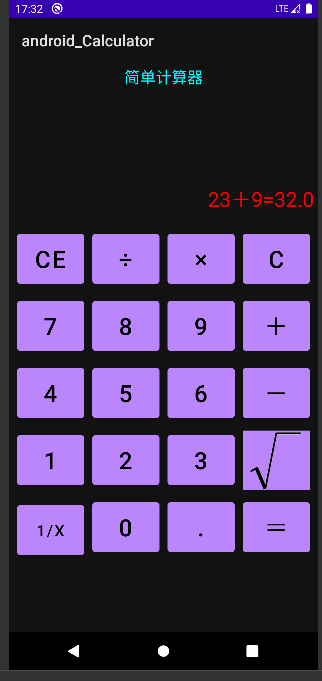


# 活动Activity

## 启停活动页面

### Activity的启动和结束


启动一个活动页面：

```java
startActivity(new Intent(this, ActFinishActivity.class));
```

结束当前的活动页面：

```java
finish();
```


### Activity的生命周期

App引入活动的概念而非传统的页面概念，单从字面意思理解，页面更像是静态的，而 活动更像是动态的。犹如花开花落那般，活动也有从含苞待放到盛开再到凋零的生命过程。每次创建新 的活动页面，自动生成的Java代码都给出了onCreate方法，该方法用于执行活动创建的相关操作，包括加载XML布局、设置文本视图的初始文字、注册按钮控件的点击监听，等等。onCreate方法所代表的创 建动作，正是一个活动最开始的行为，除了onCreate，活动还有其他几种生命周期行为，它们对应的方法说明如下：

* onCreate：创建活动。此时会把页面布局加载进内存，进入了初始状态
* onStart：开启活动。此时会把活动页面显示在屏幕上，进入了就绪状态
* onResume：恢复活动。此时活动页面进入活跃状态，能够与用户正常交互，例如允许响应用户的 点击动作、允许用户输入文字等
* onPause：暂停活动。此时活动页面进入暂停状态（也就是退回就绪状态），无法与用户正常交互
* onStop：停止活动。此时活动页面将不在屏幕上显示
* onDestroy：销毁活动。此时回收活动占用的系统资源，把页面从内存中清除掉
* onRestart：重启活动。处于停止状态的活动，若想重新开启的话，无须经历onCreate的重复创建 过程，而是走onRestart的重启过程
* onNewIntent：重用已有的活动实例


打开新页面的方法调用顺序为：

**onCreate→onStart→onResume**


关闭旧页面的方法调用顺序为：

**onPause→onStop→onDestroy**


如果一个Activity已经启动过，并且存在当前应用的Activity任务栈中，启动模式为singleTask， singleInstance或singleTop(此时已在任务栈顶端)，那么在此启动或回到这个Activity的时候，不 会创建新的实例，也就是不会执行onCreate方法，而是执行onNewIntent方法


```xml
<?xml version="1.0" encoding="utf-8"?>
<LinearLayout xmlns:android="http://schemas.android.com/apk/res/android"
        xmlns:tools="http://schemas.android.com/tools"
        xmlns:app="http://schemas.android.com/apk/res-auto"
        android:layout_width="match_parent"
        android:layout_height="match_parent"
        tools:context=".MainActivity"
        android:orientation="vertical"
        android:padding="5dp">

    <ScrollView
            android:layout_width="match_parent"
            android:layout_height="wrap_content">

        <TextView
                android:id="@+id/TextView"
                android:layout_width="match_parent"
                android:layout_height="wrap_content"
                app:layout_constraintBottom_toBottomOf="parent"
                app:layout_constraintStart_toStartOf="parent"
                app:layout_constraintEnd_toEndOf="parent"
                android:textSize="20sp"
                android:textColor="@color/purple_200"
                app:layout_constraintTop_toTopOf="parent" />

    </ScrollView>

</LinearLayout>
```


```java
package mao.android_activity;

import androidx.appcompat.app.AppCompatActivity;

import android.annotation.SuppressLint;
import android.os.Bundle;
import android.util.Log;
import android.widget.TextView;

import java.text.SimpleDateFormat;
import java.util.Date;

public class MainActivity extends AppCompatActivity
{

    /**
     * 文本视图
     */
    private TextView textView;

    /**
     * SimpleDateFormat
     */
    private final SimpleDateFormat simpleDateFormat = new SimpleDateFormat("HH:mm:ss");

    /**
     * 标签
     */
    public static final String TAG = "MainActivity";

    @SuppressLint("SetTextI18n")
    @Override
    protected void onCreate(Bundle savedInstanceState)
    {
        super.onCreate(savedInstanceState);
        setContentView(R.layout.activity_main);
        textView = findViewById(R.id.TextView);
        Log.d(TAG, "onCreate: ");
        textView.setText(textView.getText() + "\n" + simpleDateFormat.format(new Date()) + "---> onCreate");
    }

    @SuppressLint("SetTextI18n")
    @Override
    protected void onStart()
    {
        super.onStart();
        Log.d(TAG, "onStart: ");
        textView.setText(textView.getText() + "\n" + simpleDateFormat.format(new Date()) + "---> onStart");
    }

    @SuppressLint("SetTextI18n")
    @Override
    protected void onResume()
    {
        super.onResume();
        Log.d(TAG, "onResume: ");
        textView.setText(textView.getText() + "\n" + simpleDateFormat.format(new Date()) + "---> onResume");
    }

    @SuppressLint("SetTextI18n")
    @Override
    protected void onPause()
    {
        super.onPause();
        Log.d(TAG, "onPause: ");
        textView.setText(textView.getText() + "\n" + simpleDateFormat.format(new Date()) + "---> onPause");
    }

    @SuppressLint("SetTextI18n")
    @Override
    protected void onStop()
    {
        super.onStop();
        Log.d(TAG, "onStop: ");
        textView.setText(textView.getText() + "\n" + simpleDateFormat.format(new Date()) + "---> onStop");
    }

    @Override
    protected void onDestroy()
    {
        super.onDestroy();
        Log.d(TAG, "onDestroy: ");
    }

    @SuppressLint("SetTextI18n")
    @Override
    protected void onRestart()
    {
        super.onRestart();
        Log.d(TAG, "onRestart: ");
        textView.setText(textView.getText() + "\n" + simpleDateFormat.format(new Date()) + "---> onRestart");
    }


}
```


### Activity的启动模式

从第一个活动跳到第二个活动，接着结束第二个活动就能返回第一个活动，可是为什么 不直接返回桌面呢？这要从Android的内核设计说起了，系统给每个正在运行的App都分配了活动栈，栈 里面容纳着已经创建且尚未销毁的活动信息。鉴于栈是一种先进后出、后进先出的数据结构，故而后面 入栈的活动总是先出栈，假设3个活动的入栈顺序为：活动A→活动B→活动C，则它们的出栈顺序将变 为：活动C→活动B→活动A，可见活动C结束之后会返回活动B，而不是返回活动A或者别的地方

假定某个App分配到的活动栈大小为3，该App先后打开两个活动


依次结束已打开的两个活动


不过前述的出入栈情况仅是默认的标准模式，实际上Android允许在创建活动时指定该活动的启动模 式，通过启动模式控制活动的出入栈行为。App提供了两种办法用于设置活动页面的启动模式，其一是 修改AndroidManifest.xml，在指定的activity节点添加属性android:launchMode，表示本活动以哪个 启动模式运行。其二是在代码中调用Intent对象的setFlags方法，表明后续打开的活动页面采用该启动标志


**launchMode属性的取值说明：**

* standard：标准模式，无论何时启动哪个活动，都是重新创建该页面的实例并放入栈顶。如果不指定launchMode属性，则默认为标准模式
* singleTop：启动新活动时，判断如果栈顶正好就是该活动的实例，则重用该实例；否则创建新的实例并放入栈顶，也就是按照standard模式处理
* singleTask：启动新活动时，判断如果栈中存在该活动的实例，则重用该实例， 并清除位于该实例上面的所有实例；否则按照standard模式处理
* singleInstance：启动新活动时，将该活动的实例放入一个新栈中，原栈的实例列表保持不变


```xml
<activity
        android:name=".MainActivity"
        android:exported="true"
        android:launchMode="standard">
    <intent-filter>
        <action android:name="android.intent.action.MAIN" />

        <category android:name="android.intent.category.LAUNCHER" />
    </intent-filter>
</activity>
```


**启动标志的取值说明：**

* Intent.FLAG_ACTIVITY_NEW_TASK：开辟一个新的任务栈
* Intent.FLAG_ACTIVITY_SINGLE_TOP：当栈顶为待跳转的活动实例之时，则重用栈顶的实例
* Intent.FLAG_ACTIVITY_CLEAR_TOP：当栈中存在待跳转的活动实例时，则重新创建一个新实例， 并清除原实例上方的所有实例
* Intent.FLAG_ACTIVITY_NO_HISTORY：栈中不保存新启动的活动实例
* Intent.FLAG_ACTIVITY_CLEAR_TASK：跳转到新页面时，栈中的原有实例都被清空


```java
Intent intent = new Intent(MainActivity11.this, MainActivity10.class);
intent.setFlags(Intent.FLAG_ACTIVITY_CLEAR_TOP);
startActivity(intent);
```


**在两个活动之间交替跳转**

假设活动A有个按钮，点击该按钮会跳到活动B；同时活动B也有个按钮，点击按钮会跳到活动A；从首页 打开活动A之后，就点击按钮在活动A与活动B之间轮流跳转。此时活动页面的跳转流程为：首页→活动 A→活动B→活动A→活动B→活动A→活动B→……多次跳转之后想回到首页，正常的话返回流程是这样 的：……→活动B→活动A→活动B→活动A→活动B→活动A→首页，注意每个箭头都代表按一次返回键

可见要按下许多次返回键才能返回首页。其实在活动A和活动B之间本不应该重复返回，因为回来回去总 是这两个页面有什么意义呢？照理说每个活动返回一次足矣，同一个地方返回两次已经是多余的了，再 返回应当回到首页才是。也就是说，不管过去的时候怎么跳转，回来的时候应该按照这个流程：……→活 动B→活动A→首页，或者按照这个流程：……→活动A→活动B→首页，总之已经返回了的页面，决不再 返回第二次

对于不允许重复返回的情况，可以设置启动标志FLAG_ACTIVITY_CLEAR_TOP，即使活动栈里面存在待 跳转的活动实例，也会重新创建该活动的实例，并清除原实例上方的所有实例，保证栈中最多只有该活 动的唯一实例，从而避免了无谓的重复返回


**登录成功后不再返回登录页面**

很多App第一次打开都要求用户登录，登录成功再进入App首页，如果这时按下返回键，发现并没有回 到上一个登录页面，而是直接退出App了，这又是什么缘故呢？原来用户登录成功后，App便记下用户的登录信息，接下来默认该用户是登录状态，自然不必重新输入用户名和密码了。既然默认用户已经登录，哪里还需要回到登录页面？不光登录页面，登录之前的其他页面包括获取验证码、找回密码等页面都不应回去

对于回不去的登录页面情况，可以设置启动标志FLAG_ACTIVITY_CLEAR_TASK，该标志会清空当前活动 栈里的所有实例。不过全部清空之后，意味着当前栈没法用了，必须另外找个活动栈才行，也就是同时 设置启动标志FLAG_ACTIVITY_NEW_TASK，该标志用于开辟新任务的活动栈

```java
intent.setFlags(Intent.FLAG_ACTIVITY_CLEAR_TASK |Intent.FLAG_ACTIVITY_NEW_TASK);
```


#### 默认启动模式 standard

该模式可以被设定，不在 manifest 设定时候，Activity 的默认模式就是 standard。在该模式下，启动 的 Activity 会依照启动顺序被依次压入 Task 栈中


#### 栈顶复用模式 singleTop

在该模式下，如果栈顶 Activity 为我们要新建的 Activity（目标Activity），那么就不会重复创建新的 Activity


**应用场景**

适合开启渠道多、多应用开启调用的 Activity，通过这种设置可以避免已经创建过的 Activity 被重复创建，多数通过动态设置使用


#### 栈内复用模式 singleTask

与 singleTop 模式相似，只不过 singleTop 模式是只是针对栈顶的元素，而 singleTask 模式下，如果 task 栈内存在目标 Activity 实例，则将 task 内的对应 Activity 实例之上的所有 Activity 弹出栈，并将对 应 Activity 置于栈顶，获得焦点


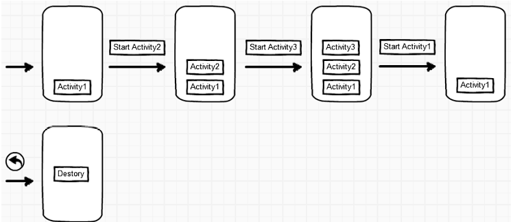


**应用场景**

* 程序主界面：我们肯定不希望主界面被创建多次，而且在主界面退出的时候退出整个 App 是最好的效 果
* 耗费系统资源的Activity：对于那些及其耗费系统资源的 Activity，我们可以考虑将其设为 singleTask 模式，减少资源耗费


#### 全局唯一模式 singleInstance

在该模式下，我们会为目标 Activity 创建一个新的 Task 栈，将目标 Activity 放入新的 Task，并让目标 Activity获得焦点。新的 Task 有且只有这一个 Activity 实例。 如果已经创建过目标 Activity 实例，则 不会创建新的 Task，而是将以前创建过的 Activity 唤醒


#### 动态设置启动模式

在上述所有情况，都是我们在Manifest中通过 launchMode 属性设置的，这个被称为静态设置，动态设置是通过 Java 代码设置的

如果同时有动态和静态设置，那么动态的优先级更高。


**FLAG_ACTIVITY_NEW_TASK**

此 Flag 跟 singleInstance 很相似，在给目标 Activity 设立此 Flag 后，会根据目标 Activity 的 affinity 进 行匹配，如果已经存在与其affinity 相同的 task，则将目标 Activity 压入此 Task。反之没有的话，则新 建一个 task，新建的 task 的 affinity 值与目标 Activity 相同，然后将目标 Activity 压入此栈

但它与 singleInstance 有不同的点

* 新的 Task 没有说只能存放一个目标 Activity，只是说决定是否新建一个 Task，而 singleInstance 模式下新的 Task 只能放置一个目标 Activity
* 在同一应用下，如果 Activity 都是默认的 affinity，那么此 Flag 无效，而 singleInstance 默认情况 也会创建新的 Task


**FLAG_ACTIVITY_SINGLE_TOP**

此 Flag 与静态设置中的 singleTop 效果相同


**FLAG_ACTIVITY_CLEAR_TOP**

当设置此 Flag 时，目标 Activity 会检查 Task 中是否存在此实例，如果没有则添加压入栈。如果有，就将位于 Task 中的对应 Activity 其上的所有 Activity 弹出栈


#### 代码


**顺序从1到11**


布局文件

```xml
<?xml version="1.0" encoding="utf-8"?>
<LinearLayout xmlns:android="http://schemas.android.com/apk/res/android"
        xmlns:tools="http://schemas.android.com/tools"
        xmlns:app="http://schemas.android.com/apk/res-auto"
        android:layout_width="match_parent"
        android:layout_height="match_parent"
        tools:context=".MainActivity"
        android:orientation="vertical"
        android:gravity="center">

    <Button
            android:id="@+id/main_button1"
            android:layout_width="match_parent"
            android:layout_height="wrap_content"
            android:text="默认standard"
            android:textAllCaps="false"
            android:textSize="20sp" />

    <Button
            android:id="@+id/main_button2"
            android:layout_width="match_parent"
            android:layout_height="wrap_content"
            android:text="singleTop"
            android:textAllCaps="false"
            android:textSize="20sp" />

    <Button
            android:id="@+id/main_button3"
            android:layout_width="match_parent"
            android:layout_height="wrap_content"
            android:text="singleTask"
            android:textAllCaps="false"
            android:textSize="20sp" />

    <Button
            android:id="@+id/main_button4"
            android:layout_width="match_parent"
            android:layout_height="wrap_content"
            android:text="singleInstance"
            android:textAllCaps="false"
            android:textSize="20sp" />

    <Button
            android:id="@+id/main_button5"
            android:layout_width="match_parent"
            android:layout_height="wrap_content"
            android:text="通过代码设置：Intent.FLAG_ACTIVITY_CLEAR_TOP"
            android:textAllCaps="false"
            android:textSize="16sp" />

</LinearLayout>
```


```xml
<?xml version="1.0" encoding="utf-8"?>
<LinearLayout xmlns:android="http://schemas.android.com/apk/res/android"
        xmlns:tools="http://schemas.android.com/tools"
        xmlns:app="http://schemas.android.com/apk/res-auto"
        android:layout_width="match_parent"
        android:layout_height="match_parent"
        tools:context=".MainActivity2"
        android:orientation="vertical"
        android:gravity="center">

    <TextView
            android:layout_width="wrap_content"
            android:layout_height="wrap_content"
            android:text="A"
            android:textSize="30sp" />

    <Button
            android:id="@+id/button_a_1"
            android:layout_width="match_parent"
            android:layout_height="wrap_content"
            android:text="跳转B"
            android:textAllCaps="false"
            android:textSize="20sp" />

    <Button
            android:id="@+id/button_self_1"
            android:layout_width="match_parent"
            android:layout_height="wrap_content"
            android:text="自己"
            android:textAllCaps="false"
            android:textSize="20sp" />

</LinearLayout>
```


```xml
<?xml version="1.0" encoding="utf-8"?>
<LinearLayout xmlns:android="http://schemas.android.com/apk/res/android"
        xmlns:tools="http://schemas.android.com/tools"
        xmlns:app="http://schemas.android.com/apk/res-auto"
        android:layout_width="match_parent"
        android:layout_height="match_parent"
        tools:context=".MainActivity3"
        android:orientation="vertical"
        android:gravity="center">

    <TextView
            android:layout_width="wrap_content"
            android:layout_height="wrap_content"
            android:text="B"
            android:textSize="30sp" />

    <Button
            android:id="@+id/button_b_1"
            android:layout_width="match_parent"
            android:layout_height="wrap_content"
            android:text="跳转A"
            android:textAllCaps="false"
            android:textSize="20sp" />

</LinearLayout>
```


```xml
<?xml version="1.0" encoding="utf-8"?>
<LinearLayout xmlns:android="http://schemas.android.com/apk/res/android"
        xmlns:tools="http://schemas.android.com/tools"
        xmlns:app="http://schemas.android.com/apk/res-auto"
        android:layout_width="match_parent"
        android:layout_height="match_parent"
        tools:context=".MainActivity4"
        android:orientation="vertical"
        android:gravity="center">

    <TextView
            android:layout_width="wrap_content"
            android:layout_height="wrap_content"
            android:text="A"
            android:textSize="30sp" />

    <Button
            android:id="@+id/button_a_2"
            android:layout_width="match_parent"
            android:layout_height="wrap_content"
            android:text="跳转B"
            android:textAllCaps="false"
            android:textSize="20sp" />

    <Button
            android:id="@+id/button_self_2"
            android:layout_width="match_parent"
            android:layout_height="wrap_content"
            android:text="自己"
            android:textAllCaps="false"
            android:textSize="20sp" />

</LinearLayout>
```


```xml
<?xml version="1.0" encoding="utf-8"?>
<LinearLayout xmlns:android="http://schemas.android.com/apk/res/android"
        xmlns:tools="http://schemas.android.com/tools"
        xmlns:app="http://schemas.android.com/apk/res-auto"
        android:layout_width="match_parent"
        android:layout_height="match_parent"
        tools:context=".MainActivity5"
        android:orientation="vertical"
        android:gravity="center">

    <TextView
            android:layout_width="wrap_content"
            android:layout_height="wrap_content"
            android:text="B"
            android:textSize="30sp" />

    <Button
            android:id="@+id/button_b_2"
            android:layout_width="match_parent"
            android:layout_height="wrap_content"
            android:text="跳转A"
            android:textAllCaps="false"
            android:textSize="20sp" />

</LinearLayout>
```


```xml
<?xml version="1.0" encoding="utf-8"?>
<LinearLayout xmlns:android="http://schemas.android.com/apk/res/android"
        xmlns:tools="http://schemas.android.com/tools"
        xmlns:app="http://schemas.android.com/apk/res-auto"
        android:layout_width="match_parent"
        android:layout_height="match_parent"
        tools:context=".MainActivity6"
        android:orientation="vertical"
        android:gravity="center">

    <TextView
            android:layout_width="wrap_content"
            android:layout_height="wrap_content"
            android:text="A"
            android:textSize="30sp" />

    <Button
            android:id="@+id/button_a_3"
            android:layout_width="match_parent"
            android:layout_height="wrap_content"
            android:text="跳转B"
            android:textAllCaps="false"
            android:textSize="20sp" />

    <Button
            android:id="@+id/button_self_3"
            android:layout_width="match_parent"
            android:layout_height="wrap_content"
            android:text="自己"
            android:textAllCaps="false"
            android:textSize="20sp" />

</LinearLayout>
```


```xml
<?xml version="1.0" encoding="utf-8"?>
<LinearLayout xmlns:android="http://schemas.android.com/apk/res/android"
        xmlns:tools="http://schemas.android.com/tools"
        xmlns:app="http://schemas.android.com/apk/res-auto"
        android:layout_width="match_parent"
        android:layout_height="match_parent"
        tools:context=".MainActivity7"
        android:orientation="vertical"
        android:gravity="center">

    <TextView
            android:layout_width="wrap_content"
            android:layout_height="wrap_content"
            android:text="B"
            android:textSize="30sp" />

    <Button
            android:id="@+id/button_b_3"
            android:layout_width="match_parent"
            android:layout_height="wrap_content"
            android:text="跳转A"
            android:textAllCaps="false"
            android:textSize="20sp" />

</LinearLayout>
```


```xml
<?xml version="1.0" encoding="utf-8"?>
<LinearLayout xmlns:android="http://schemas.android.com/apk/res/android"
        xmlns:tools="http://schemas.android.com/tools"
        xmlns:app="http://schemas.android.com/apk/res-auto"
        android:layout_width="match_parent"
        android:layout_height="match_parent"
        tools:context=".MainActivity8"
        android:orientation="vertical"
        android:gravity="center">

    <TextView
            android:layout_width="wrap_content"
            android:layout_height="wrap_content"
            android:text="A"
            android:textSize="30sp" />

    <Button
            android:id="@+id/button_a_4"
            android:layout_width="match_parent"
            android:layout_height="wrap_content"
            android:text="跳转B"
            android:textAllCaps="false"
            android:textSize="20sp" />

    <Button
            android:id="@+id/button_self_4"
            android:layout_width="match_parent"
            android:layout_height="wrap_content"
            android:text="自己"
            android:textAllCaps="false"
            android:textSize="20sp" />

</LinearLayout>
```


```xml
<?xml version="1.0" encoding="utf-8"?>
<LinearLayout xmlns:android="http://schemas.android.com/apk/res/android"
        xmlns:tools="http://schemas.android.com/tools"
        xmlns:app="http://schemas.android.com/apk/res-auto"
        android:layout_width="match_parent"
        android:layout_height="match_parent"
        tools:context=".MainActivity9"
        android:orientation="vertical"
        android:gravity="center">

    <TextView
            android:layout_width="wrap_content"
            android:layout_height="wrap_content"
            android:text="B"
            android:textSize="30sp" />

    <Button
            android:id="@+id/button_b_4"
            android:layout_width="match_parent"
            android:layout_height="wrap_content"
            android:text="跳转A"
            android:textAllCaps="false"
            android:textSize="20sp" />

</LinearLayout>
```


```xml
<?xml version="1.0" encoding="utf-8"?>
<LinearLayout xmlns:android="http://schemas.android.com/apk/res/android"
        xmlns:tools="http://schemas.android.com/tools"
        xmlns:app="http://schemas.android.com/apk/res-auto"
        android:layout_width="match_parent"
        android:layout_height="match_parent"
        tools:context=".MainActivity10"
        android:orientation="vertical"
        android:gravity="center">

    <TextView
            android:layout_width="wrap_content"
            android:layout_height="wrap_content"
            android:text="A"
            android:textSize="30sp" />

    <Button
            android:id="@+id/button_a_5"
            android:layout_width="match_parent"
            android:layout_height="wrap_content"
            android:text="跳转B"
            android:textAllCaps="false"
            android:textSize="20sp" />

    <Button
            android:id="@+id/button_self_5"
            android:layout_width="match_parent"
            android:layout_height="wrap_content"
            android:text="自己"
            android:textAllCaps="false"
            android:textSize="20sp" />

</LinearLayout>
```


```xml
<?xml version="1.0" encoding="utf-8"?>
<LinearLayout xmlns:android="http://schemas.android.com/apk/res/android"
        xmlns:tools="http://schemas.android.com/tools"
        xmlns:app="http://schemas.android.com/apk/res-auto"
        android:layout_width="match_parent"
        android:layout_height="match_parent"
        tools:context=".MainActivity11"
        android:orientation="vertical"
        android:gravity="center">

    <TextView
            android:layout_width="wrap_content"
            android:layout_height="wrap_content"
            android:text="B"
            android:textSize="30sp" />

    <Button
            android:id="@+id/button_b_5"
            android:layout_width="match_parent"
            android:layout_height="wrap_content"
            android:text="跳转A"
            android:textAllCaps="false"
            android:textSize="20sp" />

</LinearLayout>
```


逻辑代码


```java
package mao.android_activity_boot_mode;

import androidx.appcompat.app.AppCompatActivity;

import android.content.Intent;
import android.os.Bundle;
import android.view.View;

public class MainActivity extends AppCompatActivity
{

    @Override
    protected void onCreate(Bundle savedInstanceState)
    {
        super.onCreate(savedInstanceState);
        setContentView(R.layout.activity_main);
        findViewById(R.id.main_button1).setOnClickListener(new View.OnClickListener()
        {
            @Override
            public void onClick(View v)
            {
                startActivity(new Intent(MainActivity.this, MainActivity2.class));
            }
        });
        findViewById(R.id.main_button2).setOnClickListener(new View.OnClickListener()
        {
            @Override
            public void onClick(View v)
            {
                startActivity(new Intent(MainActivity.this, MainActivity4.class));
            }
        });
        findViewById(R.id.main_button3).setOnClickListener(new View.OnClickListener()
        {
            @Override
            public void onClick(View v)
            {
                startActivity(new Intent(MainActivity.this, MainActivity6.class));
            }
        });
        findViewById(R.id.main_button4).setOnClickListener(new View.OnClickListener()
        {
            @Override
            public void onClick(View v)
            {
                startActivity(new Intent(MainActivity.this, MainActivity8.class));
            }
        });
        findViewById(R.id.main_button5).setOnClickListener(new View.OnClickListener()
        {
            @Override
            public void onClick(View v)
            {
                startActivity(new Intent(MainActivity.this, MainActivity10.class));
            }
        });
    }
}
```


```java
package mao.android_activity_boot_mode;

import android.content.Intent;
import android.os.Bundle;
import android.view.View;

import androidx.appcompat.app.AppCompatActivity;

public class MainActivity2 extends AppCompatActivity
{

    @Override
    protected void onCreate(Bundle savedInstanceState)
    {
        super.onCreate(savedInstanceState);
        setContentView(R.layout.activity_main2);
        findViewById(R.id.button_a_1).setOnClickListener(new View.OnClickListener()
        {
            @Override
            public void onClick(View v)
            {
                startActivity(new Intent(MainActivity2.this, MainActivity3.class));
            }
        });

        findViewById(R.id.button_self_1).setOnClickListener(new View.OnClickListener()
        {
            @Override
            public void onClick(View v)
            {
                startActivity(new Intent(MainActivity2.this, MainActivity2.class));
            }
        });
    }
}
```


```java
package mao.android_activity_boot_mode;

import android.content.Intent;
import android.os.Bundle;
import android.view.View;

import androidx.appcompat.app.AppCompatActivity;

public class MainActivity3 extends AppCompatActivity
{

    @Override
    protected void onCreate(Bundle savedInstanceState)
    {
        super.onCreate(savedInstanceState);
        setContentView(R.layout.activity_main3);

        findViewById(R.id.button_b_1).setOnClickListener(new View.OnClickListener()
        {
            @Override
            public void onClick(View v)
            {
                startActivity(new Intent(MainActivity3.this, MainActivity2.class));
            }
        });
    }
}
```


```java
package mao.android_activity_boot_mode;

import androidx.appcompat.app.AppCompatActivity;

import android.content.Intent;
import android.os.Bundle;
import android.view.View;

public class MainActivity4 extends AppCompatActivity
{

    @Override
    protected void onCreate(Bundle savedInstanceState)
    {
        super.onCreate(savedInstanceState);
        setContentView(R.layout.activity_main4);

        findViewById(R.id.button_a_2).setOnClickListener(new View.OnClickListener()
        {
            @Override
            public void onClick(View v)
            {
                startActivity(new Intent(MainActivity4.this, MainActivity5.class));
            }
        });

        findViewById(R.id.button_self_2).setOnClickListener(new View.OnClickListener()
        {
            @Override
            public void onClick(View v)
            {
                startActivity(new Intent(MainActivity4.this, MainActivity4.class));
            }
        });
    }
}
```


```java
package mao.android_activity_boot_mode;

import androidx.appcompat.app.AppCompatActivity;

import android.content.Intent;
import android.os.Bundle;
import android.view.View;

public class MainActivity5 extends AppCompatActivity
{

    @Override
    protected void onCreate(Bundle savedInstanceState)
    {
        super.onCreate(savedInstanceState);
        setContentView(R.layout.activity_main5);

        findViewById(R.id.button_b_2).setOnClickListener(new View.OnClickListener()
        {
            @Override
            public void onClick(View v)
            {
                startActivity(new Intent(MainActivity5.this, MainActivity4.class));
            }
        });
    }
}
```


```java
package mao.android_activity_boot_mode;

import androidx.appcompat.app.AppCompatActivity;

import android.content.Intent;
import android.os.Bundle;
import android.view.View;

public class MainActivity6 extends AppCompatActivity
{

    @Override
    protected void onCreate(Bundle savedInstanceState)
    {
        super.onCreate(savedInstanceState);
        setContentView(R.layout.activity_main6);

        findViewById(R.id.button_a_3).setOnClickListener(new View.OnClickListener()
        {
            @Override
            public void onClick(View v)
            {
                startActivity(new Intent(MainActivity6.this, MainActivity7.class));
            }
        });

        findViewById(R.id.button_self_3).setOnClickListener(new View.OnClickListener()
        {
            @Override
            public void onClick(View v)
            {
                startActivity(new Intent(MainActivity6.this, MainActivity6.class));
            }
        });
    }
}
```


```java
package mao.android_activity_boot_mode;

import androidx.appcompat.app.AppCompatActivity;

import android.content.Intent;
import android.os.Bundle;
import android.view.View;

public class MainActivity7 extends AppCompatActivity
{

    @Override
    protected void onCreate(Bundle savedInstanceState)
    {
        super.onCreate(savedInstanceState);
        setContentView(R.layout.activity_main7);

        findViewById(R.id.button_b_3).setOnClickListener(new View.OnClickListener()
        {
            @Override
            public void onClick(View v)
            {
                startActivity(new Intent(MainActivity7.this, MainActivity6.class));
            }
        });
    }
}
```


```java
package mao.android_activity_boot_mode;

import androidx.appcompat.app.AppCompatActivity;

import android.content.Intent;
import android.os.Bundle;
import android.view.View;

public class MainActivity8 extends AppCompatActivity
{

    @Override
    protected void onCreate(Bundle savedInstanceState)
    {
        super.onCreate(savedInstanceState);
        setContentView(R.layout.activity_main8);

        findViewById(R.id.button_a_4).setOnClickListener(new View.OnClickListener()
        {
            @Override
            public void onClick(View v)
            {
                startActivity(new Intent(MainActivity8.this, MainActivity9.class));
            }
        });

        findViewById(R.id.button_self_4).setOnClickListener(new View.OnClickListener()
        {
            @Override
            public void onClick(View v)
            {
                startActivity(new Intent(MainActivity8.this, MainActivity8.class));
            }
        });
    }
}
```


```java
package mao.android_activity_boot_mode;

import androidx.appcompat.app.AppCompatActivity;

import android.content.Intent;
import android.os.Bundle;
import android.view.View;

public class MainActivity9 extends AppCompatActivity
{

    @Override
    protected void onCreate(Bundle savedInstanceState)
    {
        super.onCreate(savedInstanceState);
        setContentView(R.layout.activity_main9);

        findViewById(R.id.button_b_4).setOnClickListener(new View.OnClickListener()
        {
            @Override
            public void onClick(View v)
            {
                startActivity(new Intent(MainActivity9.this, MainActivity8.class));
            }
        });
    }
}
```


```java
package mao.android_activity_boot_mode;

import androidx.appcompat.app.AppCompatActivity;

import android.content.Intent;
import android.os.Bundle;
import android.view.View;

public class MainActivity10 extends AppCompatActivity
{

    @Override
    protected void onCreate(Bundle savedInstanceState)
    {
        super.onCreate(savedInstanceState);
        setContentView(R.layout.activity_main10);

        findViewById(R.id.button_a_5).setOnClickListener(new View.OnClickListener()
        {
            @Override
            public void onClick(View v)
            {
                startActivity(new Intent(MainActivity10.this, MainActivity11.class));
            }
        });

        findViewById(R.id.button_self_5).setOnClickListener(new View.OnClickListener()
        {
            @Override
            public void onClick(View v)
            {
                startActivity(new Intent(MainActivity10.this, MainActivity10.class));
            }
        });
    }
}
```


```java
package mao.android_activity_boot_mode;

import androidx.appcompat.app.AppCompatActivity;

import android.content.Intent;
import android.os.Bundle;
import android.view.View;

public class MainActivity11 extends AppCompatActivity
{

    @Override
    protected void onCreate(Bundle savedInstanceState)
    {
        super.onCreate(savedInstanceState);
        setContentView(R.layout.activity_main11);

        findViewById(R.id.button_b_5).setOnClickListener(new View.OnClickListener()
        {
            @Override
            public void onClick(View v)
            {
                Intent intent = new Intent(MainActivity11.this, MainActivity10.class);
                intent.setFlags(Intent.FLAG_ACTIVITY_CLEAR_TOP);
                startActivity(intent);
            }
        });
    }
}
```


清单文件

```xml
<?xml version="1.0" encoding="utf-8"?>
<manifest xmlns:android="http://schemas.android.com/apk/res/android"
        xmlns:tools="http://schemas.android.com/tools"
        package="mao.android_activity_boot_mode">

    <application
            android:allowBackup="true"
            android:dataExtractionRules="@xml/data_extraction_rules"
            android:fullBackupContent="@xml/backup_rules"
            android:icon="@mipmap/ic_launcher"
            android:label="@string/app_name"
            android:roundIcon="@mipmap/ic_launcher_round"
            android:supportsRtl="true"
            android:theme="@style/Theme.Android_Activity_boot_mode"
            tools:targetApi="31">
        <activity
                android:name=".MainActivity11"
                android:exported="false" />
        <activity
                android:name=".MainActivity10"
                android:exported="false" />
        <activity
                android:name=".MainActivity9"
                android:exported="false" />
        <activity
                android:name=".MainActivity8"
                android:exported="false"
                android:launchMode="singleInstance" />
        <activity
                android:name=".MainActivity7"
                android:exported="false" />
        <activity
                android:name=".MainActivity6"
                android:exported="false"
                android:launchMode="singleTask" />
        <activity
                android:name=".MainActivity5"
                android:exported="false" />
        <activity
                android:name=".MainActivity4"
                android:exported="false"
                android:launchMode="singleTop" />
        <activity
                android:name=".MainActivity3"
                android:exported="false" />
        <activity
                android:name=".MainActivity2"
                android:exported="false" />
        <activity
                android:name=".MainActivity"
                android:exported="true"
                android:launchMode="standard">
            <intent-filter>
                <action android:name="android.intent.action.MAIN" />

                <category android:name="android.intent.category.LAUNCHER" />
            </intent-filter>
        </activity>
    </application>

</manifest>
```


仔细观察切换活动的动画效果


## 在活动之间传递消息

### 显式Intent和隐式Intent

Intent的中文名 是意图，意思是我想让你干什么，简单地说，就是传递消息。Intent是各个组件之间信息沟通的桥梁， 既能在Activity之间沟通，又能在Activity与Service之间沟通，也能在Activity与Broadcast之间沟通。总 而言之，Intent用于Android各组件之间的通信，它主要完成下列3部分工作：

* 标明本次通信请求从哪里来、到哪里去、要怎么走
* 发起方携带本次通信需要的数据内容，接收方从收到的意图中解析数据
* 发起方若想判断接收方的处理结果，意图就要负责让接收方传回应答的数据内容


| 元素名称 | 设置方法 | 说明与用途 |
| :------: | :------: | :--------: |
|Component |setComponent| 组件，它指定意图的来源与目标|
|Action| setAction| 动作，它指定意图的动作行为|
|Data |setData |即Uri，它指定动作要操纵的数据路径|
|Category |addCategory |类别，它指定意图的操作类别|
|Type| setType |数据类型，它指定消息的数据类型|
|Extras| putExtras| 扩展信息，它指定装载的包裹信息|
|Flags| setFlags| 标志位，它指定活动的启动标志|


#### 显式Intent

**显式Intent，直接指定来源活动与目标活动，属于精确匹配**

在构建一个意图对象时，需要指定两个参数，第一个参数表示跳转的来源页面，即“来源Activity.this”； 第二个参数表示待跳转的页面，即“目标Activity.class”

```java
Intent intent = new Intent(this, Activity2.class);
```

或者

```java
Intent intent = new Intent(); // 创建一个新意图
intent.setClass(this, Activity2.class); // 设置意图要跳转的目标活动
```

或者

```java
Intent intent = new Intent(); // 创建一个新意图
// 创建包含目标活动在内的组件名称对象
ComponentName component = new ComponentName(this, Activity2.class);
intent.setComponent(component); // 设置意图携带的组件信息
```


#### 隐式Intent

**隐式Intent，没有明确指定要跳转的目标活动，只给出一个动作字符串让系统自动匹配，属于模糊匹配**

通常App不希望向外部暴露活动名称，只给出一个事先定义好的标记串，这样大家约定俗成、按图索骥 就好，隐式Intent便起到了标记过滤作用。这个动作名称标记串，可以是自己定义的动作，也可以是已有的系统动作


| Intent 类的系统动作常量名 | 系统动作的常量值 | 说明 |
| :-----------------------: | :--------------: | :--: |
|ACTION_MAIN |android.intent.action.MAIN| App启动时的入口|
|ACTION_VIEW| android.intent.action.VIEW |向用户显示数据|
|ACTION_SEND |android.intent.action.SEND| 分享内容|
|ACTION_CALL| android.intent.action.CALL| 直接拨号|
|ACITON_DIAL| android.intent.action.DIAL |准备拨号|
|ACTION_SENDTO |android.intent.action.SENDTO |发送短信|
|ACTION_ANSWER |android.intent.action.ANSWER |接听电话|


动作名称既可以通过setAction方法指定，也可以通过构造函数Intent(String action)直接生成意图对象。 当然，由于动作是模糊匹配，因此有时需要更详细的路径

Uri数据可通过构造函数Intent(String action, Uri uri)在生成对象时一起指定，也可通过setData方法指定

Category可通过addCategory 方法指定


```java
package mao.android_explicit_intent_and_implicit_intent;

import androidx.appcompat.app.AppCompatActivity;

import android.content.Intent;
import android.net.Uri;
import android.os.Bundle;
import android.view.View;
import android.widget.Button;


public class MainActivity extends AppCompatActivity
{

    @Override
    protected void onCreate(Bundle savedInstanceState)
    {
        super.onCreate(savedInstanceState);
        setContentView(R.layout.activity_main);

        Button button1 = findViewById(R.id.Button1);
        button1.setOnClickListener(new View.OnClickListener()
        {
            @Override
            public void onClick(View v)
            {
                String phoneNo = "10001";
                Intent intent = new Intent();
                intent.setAction(Intent.ACTION_DIAL);
                Uri uri = Uri.parse("tel:" + phoneNo);
                intent.setData(uri);
                startActivity(intent);

            }
        });

    }
}
```


隐式Intent还用到了过滤器的概念，把不符合匹配条件的过滤掉，剩下符合条件的按照优先顺序调用。 

譬如创建一个App模块，AndroidManifest.xml里的intent-filter就是配置文件中的过滤器。

像最常见的 首页活动MainAcitivity，它的activity节点下面便设置了action和category的过滤条件。

其中 android.intent.action.MAIN表示App的入口动作，而android.intent.category.LAUNCHER表示在桌面上显示App图标


```xml
<activity
        android:name=".MainActivity"
        android:exported="true">
    <intent-filter>
        <action android:name="android.intent.action.MAIN" />

        <category android:name="android.intent.category.LAUNCHER" />
    </intent-filter>
</activity>
```


### 向下一个Activity发送数据

Intent对象的setData方法只指定到达目标的路径，并非本次通信所携带的参数信息，真 正的参数信息存放在Extras中。Intent重载了很多种putExtra方法传递各种类型的参数，包括整型、双精度型、字符串等基本数据类型，甚至Serializable这样的序列化结构。只是调用putExtra方法显然不好管理，像送快递一样大小包裹随便扔，不但找起来不方便，丢了也难以知道。所以Android引入了 Bundle概念，可以把Bundle理解为超市的寄包柜或快递收件柜，大小包裹由Bundle统一存取，方便又安全。

Bundle内部用于存放消息的数据结构是Map映射，既可添加或删除元素，还可判断元素是否存在。开发者若要把Bundle数据全部打包好，只需调用一次意图对象的putExtras方法；若要把Bundle数据全部取 出来，也只需调用一次意图对象的getExtras方法


| 数据类型 | 读方法 | 写方法 |
| :------: | :----: | :----: |
|整型数| getInt| putInt|
|浮点数| getFloat| putFloat|
|双精度数 |getDouble| putDouble|
|布尔值| getBoolean| putBoolean|
|字符串| getString| putString|
|字符串数组| getStringArray| putStringArray|
|字符串列表 |getStringArrayList| putStringArrayList|
|可序列化结构 |getSerializable| putSerializable|


```xml
<?xml version="1.0" encoding="utf-8"?>
<LinearLayout xmlns:android="http://schemas.android.com/apk/res/android"
        xmlns:tools="http://schemas.android.com/tools"
        xmlns:app="http://schemas.android.com/apk/res-auto"
        android:layout_width="match_parent"
        android:layout_height="match_parent"
        tools:context=".MainActivity"
        android:orientation="vertical"
        android:gravity="center">

    <Button
            android:id="@+id/b1"
            android:layout_width="match_parent"
            android:layout_height="wrap_content"
            android:textSize="20sp"
            android:text="发送数据" />

    <TextView
            android:id="@+id/tv1"
            android:layout_width="wrap_content"
            android:layout_height="wrap_content"
            android:layout_marginBottom="20dp" />

</LinearLayout>
```


```xml
<?xml version="1.0" encoding="utf-8"?>
<LinearLayout xmlns:android="http://schemas.android.com/apk/res/android"
        xmlns:tools="http://schemas.android.com/tools"
        xmlns:app="http://schemas.android.com/apk/res-auto"
        android:layout_width="match_parent"
        android:layout_height="match_parent"
        tools:context=".MainActivity"
        android:orientation="vertical"
        android:gravity="center">

    <TextView
            android:id="@+id/tv2"
            android:layout_width="wrap_content"
            android:layout_height="wrap_content"
            android:layout_marginBottom="20dp" />

    <Button
            android:id="@+id/b2"
            android:layout_width="match_parent"
            android:layout_height="wrap_content"
            android:textSize="20sp"
            android:text="返回数据" />

</LinearLayout>
```


```java
package mao.android_send_data_and_return_data;

import androidx.appcompat.app.AppCompatActivity;

import android.content.Intent;
import android.os.Bundle;
import android.view.View;

public class MainActivity extends AppCompatActivity
{

    /**
     * 得到int随机数
     *
     * @param min 最小值
     * @param max 最大值
     * @return int
     */
    public static int getIntRandom(int min, int max)
    {
        if (min > max)
        {
            min = max;
        }
        return min + (int) (Math.random() * (max - min + 1));
    }

    @Override
    protected void onCreate(Bundle savedInstanceState)
    {
        super.onCreate(savedInstanceState);
        setContentView(R.layout.activity_main);
        findViewById(R.id.b1).setOnClickListener(new View.OnClickListener()
        {
            @Override
            public void onClick(View v)
            {
                Intent intent = new Intent(MainActivity.this, MainActivity2.class);
                //intent.putExtra("str", "随机数为：");
                Bundle bundle = new Bundle();
                bundle.putString("str", "随机数为：");
                bundle.putInt("random", getIntRandom(0, 100));
                intent.putExtras(bundle);
                startActivity(intent);
            }
        });
    }
}
```


```java
package mao.android_send_data_and_return_data;

import androidx.appcompat.app.AppCompatActivity;

import android.annotation.SuppressLint;
import android.os.Bundle;
import android.widget.TextView;

public class MainActivity2 extends AppCompatActivity
{

    @SuppressLint("SetTextI18n")
    @Override
    protected void onCreate(Bundle savedInstanceState)
    {
        super.onCreate(savedInstanceState);
        setContentView(R.layout.activity_main2);
        TextView textView = findViewById(R.id.tv2);
        Bundle bundle = getIntent().getExtras();
        String str = bundle.getString("str");
        int random = bundle.getInt("random");
        textView.setText(str + random);
    }
}
```


### 向上一个Activity返回数据

数据传递经常是相互的，上一个页面不但把请求数据发送到下一个页面，有时候还要处理下一个页面的 应答数据，所谓应答发生在下一个页面返回到上一个页面之际。如果只把请求数据发送到下一个页面， 上一个页面调用startActivity方法即可；如果还要处理下一个页面的应答数据，此时就得分多步处理


步骤：

* 上一个页面打包好请求数据，调用startActivityForResult方法执行跳转动作
* 下一个页面接收并解析请求数据，进行相应处理
* 下一个页面在返回上一个页面时，打包应答数据并调用setResult方法返回数据包裹
* 上一个页面重写方法onActivityResult，解析获得下一个页面的返回数据


步骤一，上一个页面打包好请求数据，调用startActivityForResult方法执行跳转动作，表示需要处理下 一个页面的应答数据，该方法的第二个参数表示请求代码，它用于标识每个跳转的唯一性。


```java
package mao.android_send_data_and_return_data;

import androidx.appcompat.app.AppCompatActivity;

import android.content.Intent;
import android.os.Bundle;
import android.view.View;

public class MainActivity extends AppCompatActivity
{

    /**
     * 得到int随机数
     *
     * @param min 最小值
     * @param max 最大值
     * @return int
     */
    public static int getIntRandom(int min, int max)
    {
        if (min > max)
        {
            min = max;
        }
        return min + (int) (Math.random() * (max - min + 1));
    }

    @Override
    protected void onCreate(Bundle savedInstanceState)
    {
        super.onCreate(savedInstanceState);
        setContentView(R.layout.activity_main);
        findViewById(R.id.b1).setOnClickListener(new View.OnClickListener()
        {
            @Override
            public void onClick(View v)
            {
                Intent intent = new Intent(MainActivity.this, MainActivity2.class);
                //intent.putExtra("str", "随机数为：");
                Bundle bundle = new Bundle();
                bundle.putString("str", "随机数为：");
                bundle.putInt("random", getIntRandom(0, 100));
                intent.putExtras(bundle);
                //startActivity(intent);
                startActivityForResult(intent, 0);
            }
        });
    }
}
```


步骤二，下一个页面接收并解析请求数据，进行相应处理。


```java
package mao.android_send_data_and_return_data;

import androidx.appcompat.app.AppCompatActivity;

import android.annotation.SuppressLint;
import android.os.Bundle;
import android.widget.TextView;

public class MainActivity2 extends AppCompatActivity
{

    @SuppressLint("SetTextI18n")
    @Override
    protected void onCreate(Bundle savedInstanceState)
    {
        super.onCreate(savedInstanceState);
        setContentView(R.layout.activity_main2);
        TextView textView = findViewById(R.id.tv2);
        Bundle bundle = getIntent().getExtras();
        String str = bundle.getString("str");
        int random = bundle.getInt("random");
        textView.setText(str + random);
    }
}
```


步骤三，下一个页面在返回上一个页面时，打包应答数据并调用setResult方法返回数据包裹。setResult 方法的第一个参数表示应答代码（成功还是失败），第二个参数为携带包裹的意图对象


```java
package mao.android_send_data_and_return_data;

import androidx.appcompat.app.AppCompatActivity;

import android.annotation.SuppressLint;
import android.app.Activity;
import android.content.Intent;
import android.os.Bundle;
import android.view.View;
import android.widget.TextView;

public class MainActivity2 extends AppCompatActivity
{

    /**
     * 得到double型随机数
     *
     * @param min 最小值
     * @param max 最大值
     * @return double
     */
    public static double getDoubleRandom(double min, double max)
    {
        if (min > max)
        {
            min = max;
        }
        return min + (Math.random() * (max - min));
    }

    @SuppressLint("SetTextI18n")
    @Override
    protected void onCreate(Bundle savedInstanceState)
    {
        super.onCreate(savedInstanceState);
        setContentView(R.layout.activity_main2);
        TextView textView = findViewById(R.id.tv2);
        Bundle bundle = getIntent().getExtras();
        String str = bundle.getString("str");
        int random = bundle.getInt("random");
        textView.setText(str + random);

        findViewById(R.id.b2).setOnClickListener(new View.OnClickListener()
        {
            @Override
            public void onClick(View v)
            {
                Intent intent = new Intent();
                Bundle bundle1 = new Bundle();
                bundle1.putString("response_str", "返回的随机数：");
                bundle1.putDouble("response_random", getDoubleRandom(100, 900));
                intent.putExtras(bundle1);
                setResult(Activity.RESULT_OK, intent);
                finish();
            }
        });
    }
}
```


步骤四，上一个页面重写方法onActivityResult，该方法的输入参数包含请求代码和结果代码，其中请求代码用于判断这次返回对应哪个跳转，结果代码用于判断下一个页面是否处理成功。如果下一个页面处理成功，再对返回数据解包操作


```java
package mao.android_send_data_and_return_data;

import androidx.annotation.Nullable;
import androidx.appcompat.app.AppCompatActivity;

import android.annotation.SuppressLint;
import android.app.Activity;
import android.content.Intent;
import android.os.Bundle;
import android.view.View;
import android.widget.TextView;

public class MainActivity extends AppCompatActivity
{

    private TextView textView1;

    /**
     * 得到int随机数
     *
     * @param min 最小值
     * @param max 最大值
     * @return int
     */
    public static int getIntRandom(int min, int max)
    {
        if (min > max)
        {
            min = max;
        }
        return min + (int) (Math.random() * (max - min + 1));
    }

    @Override
    protected void onCreate(Bundle savedInstanceState)
    {
        super.onCreate(savedInstanceState);
        setContentView(R.layout.activity_main);
        findViewById(R.id.b1).setOnClickListener(new View.OnClickListener()
        {
            @Override
            public void onClick(View v)
            {
                Intent intent = new Intent(MainActivity.this, MainActivity2.class);
                //intent.putExtra("str", "随机数为：");
                Bundle bundle = new Bundle();
                bundle.putString("str", "随机数为：");
                bundle.putInt("random", getIntRandom(0, 100));
                intent.putExtras(bundle);
                //startActivity(intent);
                startActivityForResult(intent, 0);
            }
        });

        textView1 = findViewById(R.id.tv1);
    }

    @SuppressLint("SetTextI18n")
    @Override
    protected void onActivityResult(int requestCode, int resultCode, @Nullable Intent data)
    {
        super.onActivityResult(requestCode, resultCode, data);

        if (data != null && requestCode == 0 && resultCode == Activity.RESULT_OK)
        {
            Bundle bundle = data.getExtras();
            String responseStr = bundle.getString("response_str");
            double responseRandom = bundle.getDouble("response_random");
            textView1.setText(responseStr + responseRandom);
        }

    }
}
```


## 为活动补充附加信息

### 利用资源文件配置字符串

利用Bundle固然能在页面跳转的时候传送数据，但这仅限于在代码中传递参数，如果要求临时修改某个 参数的数值，就得去改Java代码。

每次改动代码都得重新编译，让Android Studio编译的功夫也稍微费点时间

对于可能手工变动的参数，通常把参数名称与参数值的对应关系写入配置文件，由程序在运 行时读取配置文件，这样只需修改配置文件就能改变对应数据了。res\values目录下面的strings.xml就用来配置字符串形式的参数


```xml
<string name="key">value</string>
```


调用getString方法即可根据“R.string.参数名称”获得指定参数的字符串值


```java
String value = getString(R.string.key);
```


getString方法来自于Context类，由于页面所在的活动类AppCompatActivity追根溯源来自 Context这个抽象类，因此凡是活动页面代码都能直接调用getString方法


### 利用元数据传递配置信息

尽管资源文件能够配置字符串参数，然而有时候为安全起见，某个参数要给某个活动专用，并不希望其他活动也能获取该参数，此时就不方便到处使用getString了

Activity提供了元数据（Metadata） 的概念，元数据是一种描述其他数据的数据，它相当于描述固定活动的参数信息。

打开 AndroidManifest.xml，在测试活动的activity节点内部添加meta-data标签，通过属性name指定元数据 的名称，通过属性value指定元数据的值。


```xml
<activity android:name=".MetaDataActivity">
	<meta-data android:name="key" android:value="value" />
</activity>
```


元数据的value属性既可直接填字符串，也可引用strings.xml已定义的字符串资源，引用格式形如 “@string/字符串的资源名称”


```xml
<activity android:name=".MetaDataActivity">
	<meta-data
		android:name="key"
		android:value="@string/key" />
</activity>
```


配置好了activity节点的meta-data标签，再回到Java代码获取元数据信息，获取步骤分为下列3步：

* 调用getPackageManager方法获得当前应用的包管理器
* 调用包管理器的getActivityInfo方法获得当前活动的信息对象
* 活动信息对象的metaData是Bundle包裹类型，调用包裹对象的getString即可获得指定名称的参数值


```java
// 获取应用包管理器
PackageManager pm = getPackageManager(); 
//从应用包管理器中获取当前的活动信息
ActivityInfo act = pm.getActivityInfo(getComponentName(),PackageManager.GET_META_DATA);
//获取活动附加的元数据信息
Bundle bundle = act.metaData; 
String value = bundle.getString("key"); 
```


### 给应用页面注册快捷方式

元数据不单单能传递简单的字符串参数，还能传送更复杂的资源数据，从Android 7.1开始新增的快捷方式便用到了这点


首先打开res/values目录下的strings.xml，在resources节点内部添加下述的3组（每组两个，共6个）字 符串配置，每组都代表一个菜单项，每组又分为长名称和短名称，平时优先展示长名称，当长名称放不下时才展示短名称。


```xml
<resources>
    <string name="app_name">android_register_shortcuts</string>

    <string name="first_short">first</string>
    <string name="first_long">页面1</string>
    <string name="second_short">second</string>
    <string name="second_long">页面2</string>
    <string name="third_short">third</string>
    <string name="third_long">页面3</string>

</resources>
```


准备三个页面


主页面

```xml
<?xml version="1.0" encoding="utf-8"?>
<LinearLayout xmlns:android="http://schemas.android.com/apk/res/android"
        xmlns:tools="http://schemas.android.com/tools"
        xmlns:app="http://schemas.android.com/apk/res-auto"
        android:layout_width="match_parent"
        android:layout_height="match_parent"
        tools:context=".MainActivity"
        android:orientation="vertical"
        android:gravity="center">

    <TextView
            android:layout_width="wrap_content"
            android:layout_height="wrap_content"
            android:text="主页面\n请使用快捷方式打开其它页面"
            app:layout_constraintBottom_toBottomOf="parent"
            app:layout_constraintStart_toStartOf="parent"
            app:layout_constraintEnd_toEndOf="parent"
            android:textSize="26sp"
            android:textColor="@color/teal_200"
            app:layout_constraintTop_toTopOf="parent" />

</LinearLayout>
```


三个页面


```xml
<?xml version="1.0" encoding="utf-8"?>
<LinearLayout xmlns:android="http://schemas.android.com/apk/res/android"
        xmlns:tools="http://schemas.android.com/tools"
        xmlns:app="http://schemas.android.com/apk/res-auto"
        android:layout_width="match_parent"
        android:layout_height="match_parent"
        tools:context=".MainActivity2"
        android:orientation="vertical"
        android:gravity="center">

    <TextView
            android:layout_width="wrap_content"
            android:layout_height="wrap_content"
            android:text="页面1"
            app:layout_constraintBottom_toBottomOf="parent"
            app:layout_constraintStart_toStartOf="parent"
            app:layout_constraintEnd_toEndOf="parent"
            android:textSize="26sp"
            android:textColor="@color/teal_200"
            app:layout_constraintTop_toTopOf="parent" />

</LinearLayout>
```


```xml
<?xml version="1.0" encoding="utf-8"?>
<LinearLayout xmlns:android="http://schemas.android.com/apk/res/android"
        xmlns:tools="http://schemas.android.com/tools"
        xmlns:app="http://schemas.android.com/apk/res-auto"
        android:layout_width="match_parent"
        android:layout_height="match_parent"
        tools:context=".MainActivity3"
        android:orientation="vertical"
        android:gravity="center">

    <TextView
            android:layout_width="wrap_content"
            android:layout_height="wrap_content"
            android:text="页面2"
            app:layout_constraintBottom_toBottomOf="parent"
            app:layout_constraintStart_toStartOf="parent"
            app:layout_constraintEnd_toEndOf="parent"
            android:textSize="26sp"
            android:textColor="@color/teal_200"
            app:layout_constraintTop_toTopOf="parent" />

</LinearLayout>
```


```xml
<?xml version="1.0" encoding="utf-8"?>
<LinearLayout xmlns:android="http://schemas.android.com/apk/res/android"
        xmlns:tools="http://schemas.android.com/tools"
        xmlns:app="http://schemas.android.com/apk/res-auto"
        android:layout_width="match_parent"
        android:layout_height="match_parent"
        tools:context=".MainActivity4"
        android:orientation="vertical"
        android:gravity="center">

    <TextView
            android:layout_width="wrap_content"
            android:layout_height="wrap_content"
            android:text="页面3"
            app:layout_constraintBottom_toBottomOf="parent"
            app:layout_constraintStart_toStartOf="parent"
            app:layout_constraintEnd_toEndOf="parent"
            android:textSize="26sp"
            android:textColor="@color/teal_200"
            app:layout_constraintTop_toTopOf="parent" />

</LinearLayout>
```


接着在res目录下创建名为xml的文件夹，并在该文件夹创建shortcuts.xml


```xml
<?xml version ="1.0" encoding="utf-8"?>
<shortcuts xmlns:android="http://schemas.android.com/apk/res/android">
    <!-- Add shortcuts that launch your app to a specific screen or task. -->
    <!-- Learn more at https://developer.android.com/guide/topics/ui/shortcuts/creating-shortcuts -->
    <!--     <shortcut android:shortcutId="SHORTCUT_ID" -->
    <!--         android:enabled="true" -->
    <!--         android:shortcutShortLabel="SHORTCUT_SHORT_LABEL" -->
    <!--         android:shortcutLongLabel="SHORTCUT_LONG_LABEL" -->
    <!--         android:shortcutDisabledMessage="SHORTCUT_DISABLED_MESSAGE"> -->
    <!--         <intent -->
    <!--             android:action="android.intent.action.VIEW" -->
    <!--             android:targetClass="REPLACE_IT_WITH_FULL_QUALIFIED_CLASS" -->
    <!--             android:targetPackage="REPLACE_IT_WITH_TARGET_PACKAGE" /> -->
    <!--     </shortcut> -->

    <!-- Integrate with Google Assistant App Actions for launching your app with various voice commands. -->
    <!-- Learn more at: https://developers.google.com/assistant/app/overview -->
    <!-- <capability android:name="actions.intent.OPEN_APP_FEATURE"> -->
    <!--     Provide query fulfillment instructions for this capability, or bind it to a shortcut. -->
    <!--     Learn more at: https://developers.google.com/assistant/app/action-schema -->
    <!-- </capability> -->


    <shortcut
            android:shortcutId="first"
            android:enabled="true"
            android:icon="@mipmap/ic_launcher"
            android:shortcutShortLabel="@string/first_short"
            android:shortcutLongLabel="@string/first_long">
        <!-- targetClass指定了点击该项菜单后要打开哪个活动页面 -->
        <intent
                android:action="android.intent.action.VIEW"
                android:targetPackage="mao.android_register_shortcuts"
                android:targetClass="mao.android_register_shortcuts.MainActivity2">

            <categories android:name="android.shortcut.conversation" />

        </intent>

    </shortcut>


    <shortcut
            android:shortcutId="second"
            android:enabled="true"
            android:icon="@mipmap/ic_launcher"
            android:shortcutShortLabel="@string/second_short"
            android:shortcutLongLabel="@string/second_long">
        <!-- targetClass指定了点击该项菜单后要打开哪个活动页面 -->
        <intent
                android:action="android.intent.action.VIEW"
                android:targetPackage="mao.android_register_shortcuts"
                android:targetClass="mao.android_register_shortcuts.MainActivity3">

            <categories android:name="android.shortcut.conversation" />

        </intent>

    </shortcut>


    <shortcut
            android:shortcutId="third"
            android:enabled="true"
            android:icon="@mipmap/ic_launcher"
            android:shortcutShortLabel="@string/third_short"
            android:shortcutLongLabel="@string/third_long">
        <!-- targetClass指定了点击该项菜单后要打开哪个活动页面 -->
        <intent
                android:action="android.intent.action.VIEW"
                android:targetPackage="mao.android_register_shortcuts"
                android:targetClass="mao.android_register_shortcuts.MainActivity4">

            <categories android:name="android.shortcut.conversation" />

        </intent>

    </shortcut>

</shortcuts>
```


由上述的XML例子中看到，每个shortcut节点都代表了一个菜单项，该节点的各属性说明如下：

* shortcutId：快捷方式的编号
* enabled：是否启用快捷方式。true表示启用，false表示禁用
* icon：快捷菜单左侧的图标
* shortcutShortLabel：快捷菜单的短标签
* shortcutLongLabel：快捷菜单的长标签。优先展示长标签的文本，长标签放不下时才展示短标签的文本


以上的节点属性仅仅指明了每项菜单的基本规格，点击菜单项之后的跳转动作还要由shortcut内部的 intent节点定义，该节点主要有targetPackage与targetClass两个属性需要修改，其中targetPackage属性固定为当前App的包名，而targetClass属性描述了菜单项对应的活动类完整路径


然后打开AndroidManifest.xml，找到MainActivity所在的activity节点，在该节点内部补充如下的元数据配置，其中name属性为android.app.shortcuts，而resource属性为@xml/shortcuts


```xml
<?xml version="1.0" encoding="utf-8"?>
<manifest xmlns:android="http://schemas.android.com/apk/res/android"
        xmlns:tools="http://schemas.android.com/tools"
        package="mao.android_register_shortcuts">

    <application
            android:allowBackup="true"
            android:dataExtractionRules="@xml/data_extraction_rules"
            android:fullBackupContent="@xml/backup_rules"
            android:icon="@mipmap/ic_launcher"
            android:label="@string/app_name"
            android:roundIcon="@mipmap/ic_launcher_round"
            android:supportsRtl="true"
            android:theme="@style/Theme.Android_register_shortcuts"
            tools:targetApi="31">
        <activity
                android:name=".MainActivity4"
                android:exported="false" />
        <activity
                android:name=".MainActivity3"
                android:exported="false" />
        <activity
                android:name=".MainActivity2"
                android:exported="false" />
        <activity
                android:name=".MainActivity"
                android:exported="true">
            <intent-filter>
                <action android:name="android.intent.action.MAIN" />

                <category android:name="android.intent.category.LAUNCHER" />
            </intent-filter>

            <!-- 指定快捷方式。在桌面上长按应用图标，就会弹出@xml/shortcuts所描述的快捷菜单 -->
            <meta-data
                    android:name="android.app.shortcuts"
                    android:resource="@xml/shortcuts" />


        </activity>
    </application>

</manifest>
```


运行


# 中级控件

## 图形定制

### 图形Drawable

Android把所有能够显示的图形都抽象为Drawable类（可绘制的）。这里的图形不止是图片，还包括色块、画板、背景等

包含图片在内的图形文件放在res目录的各个drawable目录下，其中drawable目录一般保存描述性的 XML文件，而图片文件一般放在具体分辨率的drawable目录下

* drawable-ldpi里面存放低分辨率的图片（如240×320），现在基本没有这样的智能手机了
* drawable-mdpi里面存放中等分辨率的图片（如320×480），这样的智能手机已经很少了
* drawable-hdpi里面存放高分辨率的图片（如480×800），一般对应4英寸～4.5英寸的手机（但不绝对，同尺寸的手机有可能分辨率不同，手机分辨率就高不就低，因为分辨率低了屏幕会有模糊的感觉）
* drawable-xhdpi里面存放加高分辨率的图片（如720×1280），一般对应5英寸～5.5英寸的手机
* drawable-xxhdpi里面存放超高分辨率的图片（如1080×1920），一般对应6英寸～6.5英寸的手机
* drawable-xxxhdpi里面存放超超高分辨率的图片（如1440×2560），一般对应7英寸以上的平板电脑


基本上，分辨率每加大一级，宽度和高度就要增加二分之一或三分之一像素。如果各目录存在同名图 片，Android就会根据手机的分辨率分别适配对应文件夹里的图片。在开发App时，为了兼容不同的手机 屏幕，在各目录存放不同分辨率的图片，才能达到最合适的显示效果。例如，在drawable-hdpi放了一 张背景图片bg.png（分辨率为480×800），其他目录没放，使用分辨率为480×800的手机查看该App界 面没有问题，但是使用分辨率为720×1280的手机查看该App会发现背景图片有点模糊，原因是Android 为了让bg.png适配高分辨率的屏幕，强行把bg.png拉伸到了720×1280，拉伸的后果是图片变模糊了


在XML布局文件中引用图形文件可使用“@drawable/不含扩展名的文件名称”这种形式，如各视图的 background属性、ImageView和ImageButton的src属性、TextView和Button四个方向的drawable  系列属性都可以引用图形文件


### 形状图形

Shape图形又称形状图形，它用来描述常见的几何形状，包括矩形、圆角矩形、圆形、椭圆等。用好形 状图形可以让App页面不再呆板，还可以节省美工不少工作量


形状图形的定义文件放在drawable目录下，它是以shape标签为根节点的XML描述文件。根节点下定义 了6个节点，分别是：size（尺寸）、stroke（描边）、corners（圆角）、solid（填充）、padding （间隔）、gradient（渐变），各节点的属性值主要是长宽、半径、角度以及颜色等


#### shape

shape是形状图形文件的根节点，它描述了当前是哪种几何图形


形状类型说明：

* rectangle：矩形。默认值
* oval：椭圆。此时corners节点会失效
* line：直线。此时必须设置stroke节点，不然会报错
* ring：圆环


#### size

size是shape的下级节点，它描述了形状图形的宽高尺寸。若无size节点，则表示宽高与宿主视图一样大 小

* height：像素类型，图形高度
* width：像素类型，图形宽度


#### stroke

stroke是shape的下级节点，它描述了形状图形的描边规格。若无stroke节点，则表示不存在描边

* color：颜色类型，描边的颜色
* dashGap：像素类型，每段虚线之间的间隔
* dashWidth：像素类型，每段虚线的宽度。若dashGap和dashWidth有一个值为0，则描边为实线
* width：像素类型，描边的厚度


#### corners

corners是shape的下级节点，它描述了形状图形的圆角大小。若无corners节点，则表示没有圆角

* bottomLeftRadius：像素类型，左下圆角的半径
* bottomRightRadius：像素类型，右下圆角的半径
* topLeftRadius：像素类型，左上圆角的半径
* topRightRadius：像素类型，右上圆角的半径
* radius：像素类型，4个圆角的半径（若有上面4个圆角半径的定义，则不需要radius定义）


#### solid

solid是shape的下级节点，它描述了形状图形的填充色彩。若无solid节点，则表示无填充颜色

* color：颜色类型，内部填充的颜色


#### padding

padding是shape的下级节点，它描述了形状图形与周围边界的间隔。若无padding节点，则表示四周不 设间隔

* top：像素类型，与上方的间隔
* bottom：像素类型，与下方的间隔
* left：像素类型，与左边的间隔
* right：像素类型，与右边的间隔


#### gradient

gradient是shape的下级节点，它描述了形状图形的颜色渐变。若无gradient节点，则表示没有渐变效果

* angle：整型，渐变的起始角度。为0时表示时钟的9点位置，值增大表示往逆时针方向旋转。例 如，值为90表示6点位置，值为180表示3点位置，值为270表示0点/12点位置
* type：字符串类型，渐变类型
  * linear：线性渐变，默认值
  * radial：放射渐变，起始颜色就是圆心颜色
  * sweep：滚动渐变，即一个线段以某个端点为圆心做360度旋转
* centerX：浮点型，圆心的X坐标。当android:type="linear"时不可用
* centerY：浮点型，圆心的Y坐标。当android:type="linear"时不可用
* gradientRadius：整型，渐变的半径。当android:type="radial"时需要设置该属性
* centerColor：颜色类型，渐变的中间颜色
* startColor：颜色类型，渐变的起始颜色
* endColor：颜色类型，渐变的终止颜色
* useLevel：布尔类型，设置为true为无渐变色、false为有渐变色


#### 步骤


首先右击drawable目录，并依次选择右键菜单的 New→Drawable resource file，在弹窗中输入文件名称再单击OK按钮


```xml
<?xml version="1.0" encoding="utf-8"?>
<shape xmlns:android="http://schemas.android.com/apk/res/android">

    <solid android:color="#ff0077" />
    <corners android:radius="30dp" />

    <stroke
            android:color="@color/design_default_color_primary"
            android:width="5dp" />

</shape>
```


```xml
<?xml version="1.0" encoding="utf-8"?>
<shape xmlns:android="http://schemas.android.com/apk/res/android"
        android:shape="oval">

    <solid android:color="@color/purple_200" />
    <stroke
            android:color="#5500ff"
            android:width="5dp"
            android:dashGap="5dp"
            android:dashWidth="5dp" />

</shape>
```


```xml
<?xml version="1.0" encoding="utf-8"?>
<shape xmlns:android="http://schemas.android.com/apk/res/android"
        android:shape="oval">


    <solid android:color="@color/purple_200" />

    <gradient

            android:startColor="#ff0000"
            android:centerColor="@color/purple_200"
            android:endColor="#00ccff"
            android:centerX="0.5"
            android:centerY="0.5"
            android:gradientRadius="400dp"
            android:type="radial"/>

</shape>
```


```xml
<?xml version="1.0" encoding="utf-8"?>
<shape xmlns:android="http://schemas.android.com/apk/res/android">

    <gradient
            android:startColor="#FF9800"
            android:centerColor="#11A5E8"
            android:endColor="#5C00FF"
            android:angle="45" />

    <corners android:radius="10dp" />

</shape>
```


```xml
<?xml version="1.0" encoding="utf-8"?>
<shape xmlns:android="http://schemas.android.com/apk/res/android">

    <gradient
            android:startColor="#00ccff"
            android:endColor="#ff00aa"
            android:centerX="0.5"
            android:centerY="0.5"
            android:type="sweep" />

    <corners android:radius="50dp" />

</shape>
```


布局


```xml
<?xml version="1.0" encoding="utf-8"?>
<LinearLayout xmlns:android="http://schemas.android.com/apk/res/android"
        xmlns:tools="http://schemas.android.com/tools"
        xmlns:app="http://schemas.android.com/apk/res-auto"
        android:layout_width="match_parent"
        android:layout_height="match_parent"
        tools:context=".MainActivity2"
        android:orientation="vertical"
        android:gravity="center">

    <View
            android:layout_width="wrap_content"
            android:layout_height="wrap_content"
            android:background="@drawable/shape1" />

</LinearLayout>
```


```xml
<?xml version="1.0" encoding="utf-8"?>
<LinearLayout xmlns:android="http://schemas.android.com/apk/res/android"
        xmlns:tools="http://schemas.android.com/tools"
        xmlns:app="http://schemas.android.com/apk/res-auto"
        android:layout_width="match_parent"
        android:layout_height="match_parent"
        tools:context=".MainActivity3"
        android:orientation="vertical"
        android:gravity="center">

    <View
            android:layout_width="wrap_content"
            android:layout_height="wrap_content"
            android:background="@drawable/shape2" />

</LinearLayout>
```


```xml
<?xml version="1.0" encoding="utf-8"?>
<LinearLayout xmlns:android="http://schemas.android.com/apk/res/android"
        xmlns:tools="http://schemas.android.com/tools"
        xmlns:app="http://schemas.android.com/apk/res-auto"
        android:layout_width="match_parent"
        android:layout_height="match_parent"
        tools:context=".MainActivity4"
        android:orientation="vertical"
        android:gravity="center">

    <View
            android:layout_width="wrap_content"
            android:layout_height="wrap_content"
            android:background="@drawable/shape3" />

</LinearLayout>
```


```xml
<?xml version="1.0" encoding="utf-8"?>
<LinearLayout xmlns:android="http://schemas.android.com/apk/res/android"
        xmlns:tools="http://schemas.android.com/tools"
        xmlns:app="http://schemas.android.com/apk/res-auto"
        android:layout_width="match_parent"
        android:layout_height="match_parent"
        tools:context=".MainActivity5"
        android:orientation="vertical"
        android:gravity="center">

    <View
            android:layout_width="wrap_content"
            android:layout_height="wrap_content"
            android:background="@drawable/shape4" />

</LinearLayout>
```


```xml
<?xml version="1.0" encoding="utf-8"?>
<LinearLayout xmlns:android="http://schemas.android.com/apk/res/android"
        xmlns:tools="http://schemas.android.com/tools"
        xmlns:app="http://schemas.android.com/apk/res-auto"
        android:layout_width="match_parent"
        android:layout_height="match_parent"
        tools:context=".MainActivity6"
        android:orientation="vertical"
        android:gravity="center">

    <View
            android:layout_width="wrap_content"
            android:layout_height="wrap_content"
            android:background="@drawable/shape5" />

</LinearLayout>
```


### 九宫格图片

将某张图片设置成视图背景时，如果图片尺寸太小，则系统会自动拉伸图片使之填满背景。可是一旦图片拉得过大，其画面容易变得模糊


为了解决这个问题，Android专门设计了点九图片。点九图片的扩展名是png，文件名后面常带有“.9”字 样。因为该图片划分了3×3的九宫格区域，所以得名点九图片，也叫九宫格图片。如果背景是一个形状 图形，其stroke节点的width属性已经设置了固定数值（如1dp），那么无论该图形被拉到多大，描边宽 度始终是1dp。点九图片的实现原理与之类似，即拉伸图形时，只拉伸内部区域，不拉伸边缘线条


用Android Studio制作一张点九图片：


### 状态列表图形

常见的图形文件一般为静态图形，但有时会用到动态图形，比如按钮控件的背景在正常情况下是凸起 的，在按下时是凹陷的，从按下到弹起的过程，用户便晓得点击了该按钮。根据不同的触摸情况变更图 形状态，这种情况用到了Drawable的一个子类StateListDrawable（状态列表图形），它在XML文件中 规定了不同状态时候所呈现的图形列表


接下来演示一下状态列表图形的界面效果，右击drawable目录，并依次选择右键菜单的 New→Drawable resource file，在弹窗中输入文件名称再单击OK按钮，即可自动生成一个XML描述文件。往该文件填入下面的状态列表图形定义


```xml
<?xml version="1.0" encoding="utf-8"?>
<selector xmlns:android="http://schemas.android.com/apk/res/android">

    <item android:state_pressed="true" android:drawable="@drawable/img" />

    <item android:drawable="@drawable/shape4" />

</selector>
```


上述XML文件的关键点是state_pressed属性，该属性表示按下状态，值为true表示按下时显示 button_pressed图像，其余情况显示button_normal图像


```xml
<?xml version="1.0" encoding="utf-8"?>
<LinearLayout xmlns:android="http://schemas.android.com/apk/res/android"
        xmlns:tools="http://schemas.android.com/tools"
        xmlns:app="http://schemas.android.com/apk/res-auto"
        android:layout_width="match_parent"
        android:layout_height="match_parent"
        tools:context=".MainActivity8"
        android:orientation="vertical"
        android:gravity="center">

    <Button
            android:layout_width="200dp"
            android:layout_height="100dp"
            android:text="原生"
            android:layout_margin="10dp" />

    <ImageButton
            android:layout_width="200dp"
            android:layout_height="100dp"
            android:background="@drawable/button_selector"
            android:contentDescription="九宫格" />

</LinearLayout>
```


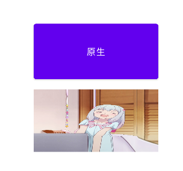


## 选择按钮

### 复选框CheckBox

在Android体系中，CompoundButton类是抽象的 复合按钮，因为是抽象类，所以它不能直接使用。实际开发中用的是CompoundButton的几个派生类， 主要有复选框CheckBox、单选按钮RadioButton以及开关按钮Switch，这些派生类均可使用 CompoundButton的属性和方法。加之CompoundButton本身继承了Button类，故以上几种按钮同时 具备Button的属性和方法


CompoundButton在XML文件中主要使用下面两个属性

* checked：指定按钮的勾选状态，true表示勾选，false则表示未勾选。默认为未勾选
* button：指定左侧勾选图标的图形资源，如果不指定就使用系统的默认图标


CompoundButton在Java代码中主要使用下列4种方法：

* setChecked：设置按钮的勾选状态
* setButtonDrawable：设置左侧勾选图标的图形资源
* setOnCheckedChangeListener：设置勾选状态变化的监听器
* sChecked：判断按钮是否勾选


复选框CheckBox是CompoundButton一个最简单的实现控件，点击复选框将它勾选，再次点击取消勾 选。复选框对象调用setOnCheckedChangeListener方法设置勾选监听器，这样在勾选和取消勾选时就 会触发监听器的勾选事件


```xml
<?xml version="1.0" encoding="utf-8"?>
<LinearLayout xmlns:android="http://schemas.android.com/apk/res/android"
        xmlns:tools="http://schemas.android.com/tools"
        xmlns:app="http://schemas.android.com/apk/res-auto"
        android:layout_width="match_parent"
        android:layout_height="match_parent"
        tools:context=".MainActivity2"
        android:orientation="vertical"
        android:gravity="center">

    <CheckBox
            android:id="@+id/checkbox1"
            android:layout_width="match_parent"
            android:layout_height="wrap_content"
            android:text="复选框1"
            android:padding="10dp"
            android:layout_margin="10dp"
            android:checked="false" />

    <CheckBox
            android:id="@+id/checkbox2"
            android:layout_width="match_parent"
            android:layout_height="wrap_content"
            android:text="复选框2"
            android:padding="10dp"
            android:layout_margin="10dp" />

</LinearLayout>
```


```java
package mao.android_checkbox;

import androidx.appcompat.app.AppCompatActivity;

import android.os.Bundle;
import android.widget.CheckBox;
import android.widget.CompoundButton;
import android.widget.Toast;

public class MainActivity2 extends AppCompatActivity
{

    @Override
    protected void onCreate(Bundle savedInstanceState)
    {
        super.onCreate(savedInstanceState);
        setContentView(R.layout.activity_main2);

        CheckBox checkBox1 = findViewById(R.id.checkbox1);

        checkBox1.setOnCheckedChangeListener(new CompoundButton.OnCheckedChangeListener()
        {
            @Override
            public void onCheckedChanged(CompoundButton buttonView, boolean isChecked)
            {
                if (isChecked)
                {
                    buttonView.setText("选中状态");
                }
                else
                {
                    buttonView.setText("取消选中");
                }
            }
        });

        CheckBox checkBox2 = findViewById(R.id.checkbox2);
        checkBox2.setChecked(true);
        checkBox2.setOnCheckedChangeListener(new CompoundButton.OnCheckedChangeListener()
        {
            @Override
            public void onCheckedChanged(CompoundButton buttonView, boolean isChecked)
            {
                if (isChecked)
                {
                    Toast.makeText(MainActivity2.this, "选中状态", Toast.LENGTH_SHORT).show();
                }
                else
                {
                    Toast.makeText(MainActivity2.this, "取消选中", Toast.LENGTH_SHORT).show();
                }
            }
        });
    }
}
```


### 开关按钮Switch

Switch是开关按钮，它像一个高级版本的CheckBox，在选中与取消选中时可展现的界面元素比复选框丰富

* textOn：设置右侧开启时的文本
* textOff：设置左侧关闭时的文本
* track：设置开关轨道的背景
* thumb：设置开关标识的图标


```xml
<?xml version="1.0" encoding="utf-8"?>
<LinearLayout xmlns:android="http://schemas.android.com/apk/res/android"
        xmlns:tools="http://schemas.android.com/tools"
        xmlns:app="http://schemas.android.com/apk/res-auto"
        android:layout_width="match_parent"
        android:layout_height="match_parent"
        tools:context=".MainActivity2"
        android:orientation="vertical"
        android:gravity="center">

    <LinearLayout
            android:layout_height="wrap_content"
            android:layout_width="match_parent"
            android:orientation="horizontal"
            android:padding="10dp">

        <TextView
                android:layout_width="0dp"
                android:layout_height="wrap_content"
                android:layout_weight="1"
                android:text="WiFi开关"
                android:textSize="20sp" />

        <Switch
                android:id="@+id/switch1"
                android:layout_width="wrap_content"
                android:layout_height="wrap_content"
                tools:ignore="UseSwitchCompatOrMaterialXml" />

    </LinearLayout>

    <LinearLayout
            android:layout_height="wrap_content"
            android:layout_width="match_parent"
            android:orientation="horizontal"
            android:padding="10dp">

        <TextView
                android:layout_width="0dp"
                android:layout_height="wrap_content"
                android:layout_weight="1"
                android:text="蓝牙开关"
                android:textSize="20sp" />

        <Switch
                android:id="@+id/switch2"
                android:layout_width="wrap_content"
                android:layout_height="wrap_content"
                tools:ignore="UseSwitchCompatOrMaterialXml" />


    </LinearLayout>


    <LinearLayout
            android:layout_height="wrap_content"
            android:layout_width="match_parent"
            android:orientation="horizontal"
            android:padding="10dp">

        <TextView
                android:layout_width="0dp"
                android:layout_height="wrap_content"
                android:layout_weight="1"
                android:text="移动数据开关"
                android:textSize="20sp" />

        <Switch
                android:id="@+id/switch3"
                android:layout_width="wrap_content"
                android:layout_height="wrap_content"
                android:checked="true"
                tools:ignore="UseSwitchCompatOrMaterialXml" />


    </LinearLayout>


</LinearLayout>
```


```java
package mao.android_switch;

import android.annotation.SuppressLint;
import android.os.Bundle;
import android.widget.CompoundButton;
import android.widget.Switch;
import android.widget.Toast;

import androidx.appcompat.app.AppCompatActivity;

public class MainActivity2 extends AppCompatActivity
{

    @SuppressLint("UseSwitchCompatOrMaterialCode")
    @Override
    protected void onCreate(Bundle savedInstanceState)
    {
        super.onCreate(savedInstanceState);
        setContentView(R.layout.activity_main2);

        Switch switch1 = findViewById(R.id.switch1);
        Switch switch2 = findViewById(R.id.switch2);
        Switch switch3 = findViewById(R.id.switch3);

        switch1.setChecked(true);

        switch1.setOnCheckedChangeListener(new CompoundButton.OnCheckedChangeListener()
        {
            @Override
            public void onCheckedChanged(CompoundButton buttonView, boolean isChecked)
            {
                if (isChecked)
                {
                    Toast.makeText(MainActivity2.this, "WiFi已打开", Toast.LENGTH_SHORT).show();
                }
                else
                {
                    Toast.makeText(MainActivity2.this, "WiFi已关闭", Toast.LENGTH_SHORT).show();
                }
            }
        });

        switch2.setOnCheckedChangeListener(new CompoundButton.OnCheckedChangeListener()
        {
            @Override
            public void onCheckedChanged(CompoundButton buttonView, boolean isChecked)
            {
                if (isChecked)
                {
                    Toast.makeText(MainActivity2.this, "蓝牙已打开", Toast.LENGTH_SHORT).show();
                }
                else
                {
                    Toast.makeText(MainActivity2.this, "蓝牙已关闭", Toast.LENGTH_SHORT).show();
                }
            }
        });

        switch3.setOnCheckedChangeListener(new CompoundButton.OnCheckedChangeListener()
        {
            @Override
            public void onCheckedChanged(CompoundButton buttonView, boolean isChecked)
            {
                if (isChecked)
                {
                    Toast.makeText(MainActivity2.this, "移动数据已打开", Toast.LENGTH_SHORT).show();
                }
                else
                {
                    Toast.makeText(MainActivity2.this, "移动数据已关闭", Toast.LENGTH_SHORT).show();
                }
            }
        });
    }
}
```


现在要让Android实现类似iOS的开关按钮，主要思路是借助状态列表图形，首先创建一个图形专用的 XML文件，给状态列表指定选中与未选中时候的开关图标


```xml
<selector xmlns:android="http://schemas.android.com/apk/res/android">
	<item android:state_checked="true" android:drawable="@drawable/switch_on"/>
	<item android:drawable="@drawable/switch_off"/>
</selector>
```


然后把CheckBox标签的background属性设置为@drawable/switch_selector，同时将button属性设置为@null


```xml
<CheckBox
	android:id="@+id/status"
	android:layout_width="wrap_content"
	android:layout_height="wrap_content"
	android:background="@drawable/switch_selector"
	android:button="@null" />
```


### 单选按钮RadioButton

所谓单选按钮，指的是在一组按钮中选择其中一项，并且不能多选，这要求有个容器确定这组按钮的范围，这个容器便是单选组RadioGroup。

单选组实质上是个布局，同一组RadioButton都要放在同一个 RadioGroup节点下。

RadioGroup提供了orientation属性指定下级控件的排列方向，该属性为 horizontal时，单选按钮在水平方向排列；

该属性为vertical时，单选按钮在垂直方向排列。 RadioGroup下面除了RadioButton，还可以挂载其他子控件（如TextView、ImageView等）。

如此看来，单选组相当于特殊的线性布局，它们主要有以下两个区别：

* 单选组多了管理单选按钮的功能，而线性布局不具备该功能
* 如果不指定orientation属性，那么单选组默认垂直排列，而线性布局默认水平排列


RadioGroup在Java代码中的3个常用方法：

* check：选中指定资源编号的单选按钮
* getCheckedRadioButtonId：获取已选中单选按钮的资源编号
* setOnCheckedChangeListener：设置单选按钮勾选变化的监听器


与CheckBox不同的是，RadioButton默认未选中，点击后显示选中，但是再次点击不会取消选中。只有 点击同组的其他单选按钮时，原来选中的单选按钮才会取消选中。另需注意，单选按钮的选中事件不是 由RadioButton处理，而是由RadioGroup处理


```xml
<?xml version="1.0" encoding="utf-8"?>
<LinearLayout xmlns:android="http://schemas.android.com/apk/res/android"
        xmlns:tools="http://schemas.android.com/tools"
        xmlns:app="http://schemas.android.com/apk/res-auto"
        android:layout_width="match_parent"
        android:layout_height="match_parent"
        tools:context=".MainActivity"
        android:orientation="vertical"
        android:gravity="center">


    <TextView
            android:layout_width="wrap_content"
            android:layout_height="wrap_content"
            android:textSize="24sp"
            android:text="question1: 1+1=?" />

    <RadioGroup
            android:id="@+id/question1"
            android:layout_width="match_parent"
            android:layout_height="wrap_content"
            android:orientation="horizontal"
            android:gravity="center">

        <RadioButton
                android:id="@+id/a"
                android:layout_width="0dp"
                android:layout_weight="1"
                android:layout_height="wrap_content"
                android:text="A:1"
                android:textSize="20sp"
                android:padding="5dp" />

        <RadioButton
                android:id="@+id/b"
                android:layout_width="0dp"
                android:layout_weight="1"
                android:layout_height="wrap_content"
                android:text="B:2"
                android:textSize="20sp"
                android:padding="5dp" />

        <RadioButton
                android:id="@+id/c"
                android:layout_width="0dp"
                android:layout_weight="1"
                android:layout_height="wrap_content"
                android:textSize="20sp"
                android:text="C:3"
                android:padding="5dp" />

        <RadioButton
                android:id="@+id/d"
                android:layout_width="0dp"
                android:layout_weight="1"
                android:layout_height="wrap_content"
                android:textSize="20sp"
                android:text="D:4"
                android:padding="5dp" />

    </RadioGroup>


    <TextView
            android:layout_marginTop="10dp"
            android:layout_width="wrap_content"
            android:layout_height="wrap_content"
            android:textSize="24sp"
            android:text="question2: 3+4=?" />

    <RadioGroup
            android:id="@+id/question2"
            android:layout_width="match_parent"
            android:layout_height="wrap_content"
            android:orientation="horizontal"
            android:gravity="center">

        <RadioButton
                android:id="@+id/a2"
                android:layout_width="0dp"
                android:layout_weight="1"
                android:layout_height="wrap_content"
                android:text="A:2"
                android:textSize="20sp"
                android:padding="5dp" />

        <RadioButton
                android:id="@+id/b2"
                android:layout_width="0dp"
                android:layout_weight="1"
                android:layout_height="wrap_content"
                android:text="B:4"
                android:textSize="20sp"
                android:padding="5dp" />

        <RadioButton
                android:id="@+id/c2"
                android:layout_width="0dp"
                android:layout_weight="1"
                android:layout_height="wrap_content"
                android:textSize="20sp"
                android:text="C:7"
                android:padding="5dp" />

        <RadioButton
                android:id="@+id/d2"
                android:layout_width="0dp"
                android:layout_weight="1"
                android:layout_height="wrap_content"
                android:textSize="20sp"
                android:text="D:9"
                android:padding="5dp" />

    </RadioGroup>


</LinearLayout>
```


```java
package mao.android_radiobutton;

import androidx.appcompat.app.AppCompatActivity;

import android.os.Bundle;
import android.widget.RadioGroup;
import android.widget.Toast;

public class MainActivity2 extends AppCompatActivity
{

    @Override
    protected void onCreate(Bundle savedInstanceState)
    {
        super.onCreate(savedInstanceState);
        setContentView(R.layout.activity_main2);

        RadioGroup radioGroup = findViewById(R.id.question1);
        radioGroup.setOnCheckedChangeListener(new RadioGroup.OnCheckedChangeListener()
        {
            @Override
            public void onCheckedChanged(RadioGroup group, int checkedId)
            {
                if (checkedId==R.id.b)
                {
                    Toast.makeText(MainActivity2.this,"YES", Toast.LENGTH_SHORT).show();
                }
                else
                {
                    Toast.makeText(MainActivity2.this,"ERROR", Toast.LENGTH_SHORT).show();
                }
            }
        });

        RadioGroup radioGroup2 = findViewById(R.id.question2);
        radioGroup2.setOnCheckedChangeListener(new RadioGroup.OnCheckedChangeListener()
        {
            @Override
            public void onCheckedChanged(RadioGroup group, int checkedId)
            {
                if (checkedId==R.id.c2)
                {
                    Toast.makeText(MainActivity2.this,"YES", Toast.LENGTH_SHORT).show();
                }
                else
                {
                    Toast.makeText(MainActivity2.this,"ERROR", Toast.LENGTH_SHORT).show();
                }
            }
        });
    }
}
```


## 文本输入

### 编辑框EditText

编辑框EditText用于接收软键盘输入的文字，例如用户名、密码、评价内容等，它由文本视图派生而来，除了TextView已有的各种属性和方法，EditText还支持下列XML属性

* inputType：指定输入的文本类型。若同时使用多种文本类型，则可 使用竖线“|”把多种文本类型拼接起来
  * text： 文本
  * textPassword： 文本密码。显示时用圆点“·”代替
  * number： 整型数
  * numberSigned： 带符号的数字。允许在开头带负号“－”
  * numberDecimal： 带小数点的数字
  * numberPassword： 数字密码。显示时用圆点“·”代替
  * datetime： 时间日期格式。除了数字外，还允许输入横线、斜杆、空格、冒号
  * date： 日期格式。除了数字外，还允许输入横线“-”和斜杆“/”
  * time： 时间格式。除了数字外，还允许输入冒号“:”
* maxLength：指定文本允许输入的最大长度
* hint：指定提示文本的内容
* textColorHint：指定提示文本的颜色


```xml
<?xml version="1.0" encoding="utf-8"?>
<LinearLayout xmlns:android="http://schemas.android.com/apk/res/android"
        xmlns:tools="http://schemas.android.com/tools"
        xmlns:app="http://schemas.android.com/apk/res-auto"
        android:layout_width="match_parent"
        android:layout_height="match_parent"
        tools:context=".MainActivity2"
        android:orientation="vertical"
        android:gravity="center">

    <EditText
            android:layout_width="match_parent"
            android:layout_height="wrap_content"
            android:hint="请输入用户名"
            android:layout_margin="5dp"
            android:maxLength="10"
            android:textSize="20sp"
            android:inputType="text"
            android:autofillHints="username" />

    <EditText
            android:layout_width="match_parent"
            android:layout_height="wrap_content"
            android:hint="请输入密码"
            android:layout_margin="5dp"
            android:maxLength="10"
            android:textSize="20sp"
            android:inputType="numberPassword" />


</LinearLayout>
```


根据以上图示可知编辑框的各属性正常工作，不过编辑框有根下划线，未输入时显示灰色，正在输入时显示其它颜色，这种效果是怎么实现的呢？其实下划线没用到新属性，而用了已有的背景属性background； 至于未输入与正在输入两种情况的颜色差异，乃是因为使用了状态列表图形，编辑框获得焦点时（正在输入）显示其它颜色的下划线，其余时候显示灰色下划线。当然EditText默认的下划线背景不甚好看，下面将利用状态列表图形将编辑框背景改为更加美观的圆角矩形


首先编写圆角矩形的形状图形文件


```xml
<?xml version="1.0" encoding="utf-8"?>
<shape xmlns:android="http://schemas.android.com/apk/res/android">

    <solid android:color="#ffddff" />

    <stroke
            android:color="#00ddff"
            android:width="3dp" />

    <corners android:radius="10dp" />

    <padding
            android:bottom="2dp"
            android:left="2dp"
            android:right="2dp"
            android:top="2dp" />

</shape>
```


```xml
<?xml version="1.0" encoding="utf-8"?>
<shape xmlns:android="http://schemas.android.com/apk/res/android">

    <solid android:color="#ccccff" />

    <stroke
            android:color="#00ddff"
            android:width="3dp" />

    <corners android:radius="10dp" />

    <padding
            android:bottom="2dp"
            android:left="2dp"
            android:right="2dp"
            android:top="2dp" />

</shape>
```


接着编写编辑框背景的状态列表图形文件，主要在selector节点下添加两个item，一个item设置了获得 焦点时刻（android:state_focused="true"）的图形为@drawable/shape_edit_focus；另一个item设置 了图形@drawable/shape_edit_normal但未指定任何状态，表示其他情况都展示该图形


```xml
<?xml version="1.0" encoding="utf-8"?>
<selector xmlns:android="http://schemas.android.com/apk/res/android">

    <item android:state_focused="true" android:drawable="@drawable/shape1" />

    <item android:drawable="@drawable/shape2" />

</selector>
```


然后编写页面的XML布局文件


```xml
<?xml version="1.0" encoding="utf-8"?>
<LinearLayout xmlns:android="http://schemas.android.com/apk/res/android"
        xmlns:tools="http://schemas.android.com/tools"
        xmlns:app="http://schemas.android.com/apk/res-auto"
        android:layout_width="match_parent"
        android:layout_height="match_parent"
        tools:context=".MainActivity2"
        android:orientation="vertical"
        android:gravity="center">

    <EditText
            android:layout_width="match_parent"
            android:layout_height="wrap_content"
            android:hint="请输入用户名"
            android:layout_margin="5dp"
            android:maxLength="10"
            android:textSize="20sp"
            android:inputType="text"
            android:autofillHints="username" />

    <EditText
            android:layout_width="match_parent"
            android:layout_height="wrap_content"
            android:hint="请输入密码"
            android:layout_margin="5dp"
            android:maxLength="10"
            android:textSize="20sp"
            android:inputType="numberPassword" />

    <EditText
            android:layout_width="match_parent"
            android:layout_height="wrap_content"
            android:hint="请输入用户名"
            android:layout_margin="5dp"
            android:background="@null"
            android:maxLength="10"
            android:textSize="20sp"
            android:inputType="text"
            android:autofillHints="username" />

    <EditText
            android:layout_width="match_parent"
            android:layout_height="wrap_content"
            android:hint="请输入密码"
            android:layout_margin="5dp"
            android:background="@null"
            android:maxLength="10"
            android:textSize="20sp"
            android:inputType="numberPassword" />


    <EditText
            android:layout_width="match_parent"
            android:layout_height="wrap_content"
            android:hint="请输入用户名"
            android:layout_margin="5dp"
            android:background="@drawable/edit_text"
            android:maxLength="10"
            android:textSize="20sp"
            android:inputType="text"
            android:autofillHints="username" />

    <EditText
            android:layout_width="match_parent"
            android:layout_height="wrap_content"
            android:hint="请输入密码"
            android:layout_margin="5dp"
            android:background="@drawable/edit_text"
            android:maxLength="10"
            android:textSize="20sp"
            android:inputType="numberPassword" />


</LinearLayout>
```


指定提示文本的颜色


### 焦点变更监听器

虽然编辑框EditText提供了maxLength属性，用来设置可输入文本的最大长度，但是它没提供对应的 minLength属性，也就无法设置可输入文本的最小长度。譬如手机号码为固定的11位数字，用户必须输 满11位才是合法的，然而编辑框不会自动检查手机号码是否达到11位，即使用户少输一位只输入十位数 字，编辑框依然认为这是合法的手机号


既然编辑框不会自动校验手机号是否达到11位，势必要求代码另行检查。一种想法是在用户点击登录按 钮时再判断，不过通常此时已经输完手机号与密码，为啥不能在输入密码之前就判断手机号码的位数 呢？早点检查可以帮助用户早点发现错误，特别是表单元素较多的时候，更能改善用户的使用体验。就 上面的登录例子而言，手机号编辑框下方为密码框，那么能否给密码框注册点击事件，以便在用户准备输入密码时就校验手机号的位数呢？

然而实际运行App却发现，先输入手机号码再输入密码，一开始并不会触发密码框的点击事件，再次点 击密码框才会触发点击事件。缘由是编辑框比较特殊，要点击两次后才会触发点击事件，因为第一次点击只触发焦点变更事件，第二次点击才触发点击事件。编辑框的所谓焦点，直观上就看那个闪动的光 标，哪个编辑框有光标，焦点就落在哪里。光标在编辑框之间切换，便产生了焦点变更事件，所以对于编辑框来说，应当注册焦点变更监听器，而非注册点击监听器。


焦点变更监听器来自于接口View.OnFocusChangeListener，若想注册该监听器，就要调用编辑框对象 的setOnFocusChangeListener方法，即可在光标切换之时（获得光标和失去光标）触发焦点变更事件


```xml
<?xml version="1.0" encoding="utf-8"?>
<LinearLayout xmlns:android="http://schemas.android.com/apk/res/android"
        xmlns:tools="http://schemas.android.com/tools"
        xmlns:app="http://schemas.android.com/apk/res-auto"
        android:layout_width="match_parent"
        android:layout_height="match_parent"
        tools:context=".MainActivity5"
        android:orientation="vertical"
        android:gravity="center">

    <EditText
            android:id="@+id/phone_n1"
            android:layout_width="match_parent"
            android:layout_height="wrap_content"
            android:hint="请输入11位的手机号码"
            android:layout_margin="5dp"
            android:maxLength="11"
            android:textSize="20sp"
            android:inputType="number"
             />

    <EditText
            android:id="@+id/password1"
            android:layout_width="match_parent"
            android:layout_height="wrap_content"
            android:hint="请输入6位数字密码"
            android:layout_margin="5dp"
            android:maxLength="6"
            android:textSize="20sp"
            android:inputType="numberPassword" />


</LinearLayout>
```


```java
package mao.android_edittext;

import androidx.appcompat.app.AppCompatActivity;

import android.os.Bundle;
import android.view.View;
import android.widget.EditText;
import android.widget.Toast;

public class MainActivity5 extends AppCompatActivity
{

    @Override
    protected void onCreate(Bundle savedInstanceState)
    {
        super.onCreate(savedInstanceState);
        setContentView(R.layout.activity_main5);

        EditText editText_phone = findViewById(R.id.phone_n1);
        EditText editText_password = findViewById(R.id.password1);

        editText_phone.setOnFocusChangeListener(new View.OnFocusChangeListener()
        {
            @Override
            public void onFocusChange(View v, boolean hasFocus)
            {
                if (v.getId() == R.id.phone_n1 && !hasFocus)
                {
                    String phone = editText_phone.getText().toString();
                    if (phone.length() < 11)
                    {
                        //editText_phone.requestFocus();
                        Toast.makeText(MainActivity5.this, "手机号码长度不足11位", Toast.LENGTH_SHORT).show();
                    }
                }
            }
        });

        editText_password.setOnFocusChangeListener(new View.OnFocusChangeListener()
        {
            @Override
            public void onFocusChange(View v, boolean hasFocus)
            {
                if (v.getId() == R.id.password1 && !hasFocus)
                {
                    String password = editText_password.getText().toString();
                    if (password.length() < 6)
                    {
                        //editText_password.requestFocus();
                        Toast.makeText(MainActivity5.this, "密码长度不足6位", Toast.LENGTH_SHORT).show();
                    }
                }
            }
        });
    }
}
```


### 文本变化监听器

输入法的软键盘往往会遮住页面下半部分，使得“登录”“确认”“下一步”等按钮看不到了，用户若想点击这 些按钮还得再点一次返回键才能关闭软键盘。为了方便用户操作，最好在满足特定条件时自动关闭软键盘，比如手机号码输入满11位后自动关闭软键盘，又如密码输入满6位后自动关闭软键盘，等等。达到指定位数便自动关闭键盘的功能，可以再分解为两个独立的功能点，一个是如何关闭软键盘，另一个是 如何判断已输入的文字达到指定位数


**如何关闭软键盘**

关闭软键盘要由系统服务INPUT_METHOD_SERVICE服务处理


```java
/**
     * 关闭(隐藏)输入法
     *
     * @param activity 活动
     * @param view     视图
     */
    public void closeInput(Activity activity, View view)
    {
        //从系统服务中获取输入法管理器
        InputMethodManager inputMethodManager = (InputMethodManager) activity.getSystemService(Context.INPUT_METHOD_SERVICE);
        //关闭屏幕上的输入法软键盘
        inputMethodManager.hideSoftInputFromWindow(view.getWindowToken(), 0);
    }
```


**如何判断已输入的文字达到指定位数**

该功能点要求实时监控当前已输入的文本长度，这个监控操作用到文本监听器接口TextWatcher，该接 口提供了3个监控方法，具体说明如下：

* beforeTextChanged：在文本改变之前触发
* onTextChanged：在文本改变过程中触发
* afterTextChanged：在文本改变之后触发


```xml
<?xml version="1.0" encoding="utf-8"?>
<LinearLayout xmlns:android="http://schemas.android.com/apk/res/android"
        xmlns:tools="http://schemas.android.com/tools"
        xmlns:app="http://schemas.android.com/apk/res-auto"
        android:layout_width="match_parent"
        android:layout_height="match_parent"
        tools:context=".MainActivity6"
        android:orientation="vertical"
        android:gravity="center">

    <EditText
            android:id="@+id/phone_n2"
            android:layout_width="match_parent"
            android:layout_height="wrap_content"
            android:hint="请输入11位的手机号码"
            android:layout_margin="5dp"
            android:maxLength="11"
            android:textSize="20sp"
            android:inputType="number"
            />

    <EditText
            android:id="@+id/password2"
            android:layout_width="match_parent"
            android:layout_height="wrap_content"
            android:hint="请输入6位数字密码"
            android:layout_margin="5dp"
            android:maxLength="6"
            android:textSize="20sp"
            android:inputType="numberPassword" />


</LinearLayout>
```


```java
package mao.android_edittext;

import androidx.appcompat.app.AppCompatActivity;

import android.annotation.SuppressLint;
import android.app.Activity;
import android.content.Context;
import android.os.Bundle;
import android.text.Editable;
import android.text.TextWatcher;
import android.view.View;
import android.view.inputmethod.InputMethodManager;
import android.widget.EditText;

import com.google.android.material.internal.TextWatcherAdapter;

public class MainActivity6 extends AppCompatActivity
{

    @Override
    protected void onCreate(Bundle savedInstanceState)
    {
        super.onCreate(savedInstanceState);
        setContentView(R.layout.activity_main6);

        EditText editText_phone = findViewById(R.id.phone_n2);
        EditText editText_password = findViewById(R.id.password2);

        //可以使用对应的接口适配器模式，可以提取并重用代码
        editText_phone.addTextChangedListener(new TextWatcher()
        {
            @Override
            public void beforeTextChanged(CharSequence s, int start, int count, int after)
            {

            }

            @Override
            public void onTextChanged(CharSequence s, int start, int before, int count)
            {

            }

            @Override
            public void afterTextChanged(Editable s)
            {
                String phone = editText_phone.getText().toString();
                if (phone.length() == 11)
                {
                    closeInput(MainActivity6.this, editText_phone);
                }
            }
        });

        editText_password.addTextChangedListener(new TextWatcher()
        {
            @Override
            public void beforeTextChanged(CharSequence s, int start, int count, int after)
            {

            }

            @Override
            public void onTextChanged(CharSequence s, int start, int before, int count)
            {

            }

            @Override
            public void afterTextChanged(Editable s)
            {
                String password = editText_password.getText().toString();
                if (password.length() == 6)
                {
                    closeInput(MainActivity6.this, editText_password);
                }
            }
        });


    }

    /**
     * 关闭(隐藏)输入法
     *
     * @param activity 活动
     * @param view     视图
     */
    public void closeInput(Activity activity, View view)
    {
        //从系统服务中获取输入法管理器
        InputMethodManager inputMethodManager = (InputMethodManager) activity.getSystemService(Context.INPUT_METHOD_SERVICE);
        //关闭屏幕上的输入法软键盘
        inputMethodManager.hideSoftInputFromWindow(view.getWindowToken(), 0);
    }
}
```


## 对话框

### 提醒对话框AlertDialog

AlertDialog名为提醒对话框，它是Android中最常用的对话框，可以完成常见的交互操作，例如提示、 确认、选择等功能。由于AlertDialog没有公开的构造方法，因此必须借助建造器AlertDialog.Builder才 能完成参数设置，AlertDialog.Builder的常用方法说明如下：

* setIcon：设置对话框的标题图标。 
* setTitle：设置对话框的标题文本。 
* setMessage：设置对话框的内容文本。 
* setPositiveButton：设置肯定按钮的信息，包括按钮文本和点击监听器。 
* setNegativeButton：设置否定按钮的信息，包括按钮文本和点击监听器。 
* setNeutralButton：设置中性按钮的信息，包括按钮文本和点击监听器，该方法比较少用


通过AlertDialog.Builder设置完对话框参数，还需调用建造器的create方法才能生成对话框实例。最后调用对话框实例的show方法，在页面上弹出提醒对话框


```java
package mao.android_alertdialog;


import android.content.DialogInterface;
import android.os.Bundle;
import android.widget.Toast;

import androidx.appcompat.app.AlertDialog;
import androidx.appcompat.app.AppCompatActivity;

public class MainActivity2 extends AppCompatActivity
{

    @Override
    protected void onCreate(Bundle savedInstanceState)
    {
        super.onCreate(savedInstanceState);
        setContentView(R.layout.activity_main2);

        AlertDialog.Builder builder = new AlertDialog.Builder(this);
        builder.setTitle("标题")
                .setIcon(R.drawable.ic_launcher_foreground)
                .setMessage("内容")
                .setPositiveButton("确定按钮", new DialogInterface.OnClickListener()
                {
                    @Override
                    public void onClick(DialogInterface dialog, int which)
                    {
                        Toast.makeText(MainActivity2.this, "点击确定", Toast.LENGTH_SHORT).show();
                    }
                })
                .setNegativeButton("取消按钮", new DialogInterface.OnClickListener()
                {
                    @Override
                    public void onClick(DialogInterface dialog, int which)
                    {
                        Toast.makeText(MainActivity2.this, "点击取消", Toast.LENGTH_SHORT).show();
                        finish();
                    }
                })
                .setNeutralButton("中性按钮", new DialogInterface.OnClickListener()
                {
                    @Override
                    public void onClick(DialogInterface dialog, int which)
                    {
                        Toast.makeText(MainActivity2.this, "暂时不确定", Toast.LENGTH_SHORT).show();
                    }
                })
                .create().show();
    }
}
```


### 日期框DatePicker

虽然EditText提供了inputType="date"的日期输入，但是很少有人会手工输入完整日期，况且EditText 还不支持“ 年 ** 月 **日”这样的中文日期，所以系统提供了专门的日期选择器DatePicker，供用户选择具体的年月日。


```xml
<?xml version="1.0" encoding="utf-8"?>
<LinearLayout xmlns:android="http://schemas.android.com/apk/res/android"
        xmlns:tools="http://schemas.android.com/tools"
        xmlns:app="http://schemas.android.com/apk/res-auto"
        android:layout_width="match_parent"
        android:layout_height="match_parent"
        tools:context=".MainActivity2"
        android:orientation="vertical"
        android:gravity="center">

    <DatePicker
            android:id="@+id/DatePicker"
            android:layout_width="match_parent"
            android:layout_height="wrap_content"
            android:layout_margin="10dp" />

    <Button
            android:id="@+id/button_DatePicker"
            android:layout_width="match_parent"
            android:layout_height="wrap_content"
            android:text="确定"
            android:layout_margin="10dp" />

    <TextView
            android:id="@+id/result1"
            android:layout_width="wrap_content"
            android:layout_height="wrap_content"
            android:layout_margin="10dp" />

</LinearLayout>
```


```xml
<?xml version="1.0" encoding="utf-8"?>
<LinearLayout xmlns:android="http://schemas.android.com/apk/res/android"
        xmlns:tools="http://schemas.android.com/tools"
        xmlns:app="http://schemas.android.com/apk/res-auto"
        android:layout_width="match_parent"
        android:layout_height="match_parent"
        tools:context=".MainActivity3"
        android:orientation="vertical"
        android:gravity="center">

    <DatePicker
            android:id="@+id/DatePicker2"
            android:layout_width="match_parent"
            android:layout_height="wrap_content"
            android:layout_margin="10dp"
            android:datePickerMode="spinner" />

    <Button
            android:id="@+id/button_DatePicker2"
            android:layout_width="match_parent"
            android:layout_height="wrap_content"
            android:text="确定"
            android:layout_margin="10dp" />

    <TextView
            android:id="@+id/result2"
            android:layout_width="wrap_content"
            android:layout_height="wrap_content"
            android:layout_margin="10dp" />

</LinearLayout>
```


```xml
<?xml version="1.0" encoding="utf-8"?>
<LinearLayout xmlns:android="http://schemas.android.com/apk/res/android"
        xmlns:tools="http://schemas.android.com/tools"
        xmlns:app="http://schemas.android.com/apk/res-auto"
        android:layout_width="match_parent"
        android:layout_height="match_parent"
        tools:context=".MainActivity4"
        android:orientation="vertical"
        android:gravity="center">

    <DatePicker
            android:id="@+id/DatePicker3"
            android:layout_width="match_parent"
            android:layout_height="wrap_content"
            android:layout_margin="10dp"
            android:datePickerMode="spinner"
            android:calendarViewShown="false" />

    <Button
            android:id="@+id/button_DatePicker3"
            android:layout_width="match_parent"
            android:layout_height="wrap_content"
            android:text="确定"
            android:layout_margin="10dp" />

    <TextView
            android:id="@+id/result3"
            android:layout_width="wrap_content"
            android:layout_height="wrap_content"
            android:layout_margin="10dp" />

</LinearLayout>
```


```java
package mao.android_datepicker;

import androidx.appcompat.app.AppCompatActivity;

import android.annotation.SuppressLint;
import android.os.Bundle;
import android.view.View;
import android.widget.Button;
import android.widget.DatePicker;
import android.widget.TextView;

public class MainActivity2 extends AppCompatActivity
{

    @Override
    protected void onCreate(Bundle savedInstanceState)
    {
        super.onCreate(savedInstanceState);
        setContentView(R.layout.activity_main2);

        DatePicker datePicker = findViewById(R.id.DatePicker);
        TextView textView = findViewById(R.id.result1);
        Button button = findViewById(R.id.button_DatePicker);

        button.setOnClickListener(new View.OnClickListener()
        {
            @SuppressLint("SetTextI18n")
            @Override
            public void onClick(View v)
            {
                int year = datePicker.getYear();
                int month = datePicker.getMonth() + 1;
                int dayOfMonth = datePicker.getDayOfMonth();
                textView.setText("当前选择的是" + year + "年" + month + "月" + dayOfMonth + "日");
            }
        });

    }
}
```


```java
package mao.android_datepicker;

import androidx.appcompat.app.AppCompatActivity;

import android.annotation.SuppressLint;
import android.os.Bundle;
import android.view.View;
import android.widget.Button;
import android.widget.DatePicker;
import android.widget.TextView;

public class MainActivity3 extends AppCompatActivity
{

    @Override
    protected void onCreate(Bundle savedInstanceState)
    {
        super.onCreate(savedInstanceState);
        setContentView(R.layout.activity_main3);

        DatePicker datePicker = findViewById(R.id.DatePicker2);
        TextView textView = findViewById(R.id.result2);
        Button button = findViewById(R.id.button_DatePicker2);

        button.setOnClickListener(new View.OnClickListener()
        {
            @SuppressLint("SetTextI18n")
            @Override
            public void onClick(View v)
            {
                int year = datePicker.getYear();
                int month = datePicker.getMonth() + 1;
                int dayOfMonth = datePicker.getDayOfMonth();
                textView.setText("当前选择的是" + year + "年" + month + "月" + dayOfMonth + "日");
            }
        });
    }
}
```


```java
package mao.android_datepicker;

import androidx.appcompat.app.AppCompatActivity;

import android.annotation.SuppressLint;
import android.os.Bundle;
import android.view.View;
import android.widget.Button;
import android.widget.DatePicker;
import android.widget.TextView;

public class MainActivity4 extends AppCompatActivity
{

    @Override
    protected void onCreate(Bundle savedInstanceState)
    {
        super.onCreate(savedInstanceState);
        setContentView(R.layout.activity_main4);

        DatePicker datePicker = findViewById(R.id.DatePicker3);
        TextView textView = findViewById(R.id.result3);
        Button button = findViewById(R.id.button_DatePicker3);

        button.setOnClickListener(new View.OnClickListener()
        {
            @SuppressLint("SetTextI18n")
            @Override
            public void onClick(View v)
            {
                int year = datePicker.getYear();
                int month = datePicker.getMonth() + 1;
                int dayOfMonth = datePicker.getDayOfMonth();
                textView.setText("当前选择的是" + year + "年" + month + "月" + dayOfMonth + "日");
            }
        });
    }
}
```


### 日期对话框DatePickerDialog

DatePicker并非弹窗模式，而是在当前页面占据一块区域，并且不会自动关闭。 按习惯来说，日期控件应该弹出对话框，选择完日期就要自动关闭对话框。因此，很少直接在界面上显示DatePicker，而是利用已经封装好的日期选择对话DatePickerDialog


DatePickerDialog相当于在AlertDialog上装载了DatePicker，编码时只需调用构造方法设置当前的年、 月、日，然后调用show方法即可弹出日期对话框。日期选择事件则由监听器OnDateSetListener负责响 应，在该监听器的onDateSet方法中，开发者获取用户选择的具体日期，再做后续处理。特别注意 onDateSet的月份参数，它的起始值不是1而是0。也就是说，一月份对应的参数值为0，十二月份对应的参数值为11


```xml
<?xml version="1.0" encoding="utf-8"?>
<LinearLayout xmlns:android="http://schemas.android.com/apk/res/android"
        xmlns:tools="http://schemas.android.com/tools"
        xmlns:app="http://schemas.android.com/apk/res-auto"
        android:layout_width="match_parent"
        android:layout_height="match_parent"
        tools:context=".MainActivity2"
        android:orientation="vertical"
        android:gravity="center">

    
    <TextView
            android:id="@+id/result1"
            android:layout_width="wrap_content"
            android:layout_height="wrap_content"
            android:layout_margin="10dp" />

</LinearLayout>
```


```java
package mao.android_datepickerdialog;

import androidx.appcompat.app.AppCompatActivity;

import android.annotation.SuppressLint;
import android.app.DatePickerDialog;
import android.content.DialogInterface;
import android.os.Bundle;
import android.widget.DatePicker;
import android.widget.TextView;

import java.util.Calendar;

public class MainActivity2 extends AppCompatActivity
{

    @Override
    protected void onCreate(Bundle savedInstanceState)
    {
        super.onCreate(savedInstanceState);
        setContentView(R.layout.activity_main2);

        TextView textView = findViewById(R.id.result1);

        Calendar calendar = Calendar.getInstance();


        DatePickerDialog datePickerDialog = new DatePickerDialog(this, new DatePickerDialog.OnDateSetListener()
        {
            @SuppressLint("SetTextI18n")
            @Override
            public void onDateSet(DatePicker view, int year, int month, int dayOfMonth)
            {
                textView.setText("当前选择的是" + year + "年" + (month + 1) + "月" + dayOfMonth + "日");
            }
        },
                calendar.get(Calendar.YEAR),
                calendar.get(Calendar.MONTH),
                calendar.get(Calendar.DAY_OF_MONTH));

        datePickerDialog.setOnCancelListener(new DialogInterface.OnCancelListener()
        {
            @Override
            public void onCancel(DialogInterface dialog)
            {
                finish();
            }
        });

        datePickerDialog.show();
    }
}
```


### 时间框TimePicker

既然有了日期选择器，还得有对应的时间选择器。


```xml
<?xml version="1.0" encoding="utf-8"?>
<LinearLayout xmlns:android="http://schemas.android.com/apk/res/android"
        xmlns:tools="http://schemas.android.com/tools"
        xmlns:app="http://schemas.android.com/apk/res-auto"
        android:layout_width="match_parent"
        android:layout_height="match_parent"
        tools:context=".MainActivity2"
        android:orientation="vertical"
        android:gravity="center">

    <TimePicker
            android:id="@+id/TimePicker"
            android:layout_width="match_parent"
            android:layout_height="wrap_content"
            android:layout_margin="10dp" />

    <Button
            android:id="@+id/button_TimePicker"
            android:layout_width="match_parent"
            android:layout_height="wrap_content"
            android:text="确定"
            android:layout_margin="10dp" />

    <TextView
            android:id="@+id/result1"
            android:layout_width="wrap_content"
            android:layout_height="wrap_content"
            android:layout_margin="10dp" />

</LinearLayout>
```


```xml
<?xml version="1.0" encoding="utf-8"?>
<LinearLayout xmlns:android="http://schemas.android.com/apk/res/android"
        xmlns:tools="http://schemas.android.com/tools"
        xmlns:app="http://schemas.android.com/apk/res-auto"
        android:layout_width="match_parent"
        android:layout_height="match_parent"
        tools:context=".MainActivity3"
        android:orientation="vertical"
        android:gravity="center">

    <TimePicker
            android:id="@+id/TimePicker2"
            android:layout_width="match_parent"
            android:layout_height="wrap_content"
            android:layout_margin="10dp"
            android:timePickerMode="spinner" />

    <Button
            android:id="@+id/button_TimePicker2"
            android:layout_width="match_parent"
            android:layout_height="wrap_content"
            android:text="确定"
            android:layout_margin="10dp" />

    <TextView
            android:id="@+id/result2"
            android:layout_width="wrap_content"
            android:layout_height="wrap_content"
            android:layout_margin="10dp" />

</LinearLayout>
```


```xml
<?xml version="1.0" encoding="utf-8"?>
<LinearLayout xmlns:android="http://schemas.android.com/apk/res/android"
        xmlns:tools="http://schemas.android.com/tools"
        xmlns:app="http://schemas.android.com/apk/res-auto"
        android:layout_width="match_parent"
        android:layout_height="match_parent"
        tools:context=".MainActivity4"
        android:orientation="vertical"
        android:gravity="center">

    <TimePicker
            android:id="@+id/TimePicker3"
            android:layout_width="match_parent"
            android:layout_height="wrap_content"
            android:layout_margin="10dp" />

    <Button
            android:id="@+id/button_TimePicker3"
            android:layout_width="match_parent"
            android:layout_height="wrap_content"
            android:text="确定"
            android:layout_margin="10dp" />

    <TextView
            android:id="@+id/result3"
            android:layout_width="wrap_content"
            android:layout_height="wrap_content"
            android:layout_margin="10dp" />

</LinearLayout>
```


```xml
<?xml version="1.0" encoding="utf-8"?>
<LinearLayout xmlns:android="http://schemas.android.com/apk/res/android"
        xmlns:tools="http://schemas.android.com/tools"
        xmlns:app="http://schemas.android.com/apk/res-auto"
        android:layout_width="match_parent"
        android:layout_height="match_parent"
        tools:context=".MainActivity5"
        android:orientation="vertical"
        android:gravity="center">

    <TimePicker
            android:id="@+id/TimePicker4"
            android:layout_width="match_parent"
            android:layout_height="wrap_content"
            android:layout_margin="10dp"
            android:timePickerMode="spinner" />

    <Button
            android:id="@+id/button_TimePicker4"
            android:layout_width="match_parent"
            android:layout_height="wrap_content"
            android:text="确定"
            android:layout_margin="10dp" />

    <TextView
            android:id="@+id/result4"
            android:layout_width="wrap_content"
            android:layout_height="wrap_content"
            android:layout_margin="10dp" />

</LinearLayout>
```


```java
package mao.android_timepicker;


import android.annotation.SuppressLint;
import android.os.Bundle;
import android.view.View;
import android.widget.Button;
import android.widget.DatePicker;
import android.widget.TextView;
import android.widget.TimePicker;

import androidx.appcompat.app.AppCompatActivity;

public class MainActivity2 extends AppCompatActivity
{

    @Override
    protected void onCreate(Bundle savedInstanceState)
    {
        super.onCreate(savedInstanceState);
        setContentView(R.layout.activity_main2);

        TimePicker timePicker = findViewById(R.id.TimePicker);
        TextView textView = findViewById(R.id.result1);
        Button button = findViewById(R.id.button_TimePicker);

        button.setOnClickListener(new View.OnClickListener()
        {
            @SuppressLint("SetTextI18n")
            @Override
            public void onClick(View v)
            {
                int hour = timePicker.getHour();
                int minute = timePicker.getMinute();
                textView.setText("当前选择的是" + hour + "时" + minute + "分");
            }
        });
    }
}
```


```java
package mao.android_timepicker;


import android.annotation.SuppressLint;
import android.os.Bundle;
import android.view.View;
import android.widget.Button;
import android.widget.TextView;
import android.widget.TimePicker;

import androidx.appcompat.app.AppCompatActivity;

public class MainActivity3 extends AppCompatActivity
{

    @Override
    protected void onCreate(Bundle savedInstanceState)
    {
        super.onCreate(savedInstanceState);
        setContentView(R.layout.activity_main3);

        TimePicker timePicker = findViewById(R.id.TimePicker2);
        TextView textView = findViewById(R.id.result2);
        Button button = findViewById(R.id.button_TimePicker2);

        button.setOnClickListener(new View.OnClickListener()
        {
            @SuppressLint("SetTextI18n")
            @Override
            public void onClick(View v)
            {
                int hour = timePicker.getHour();
                int minute = timePicker.getMinute();
                textView.setText("当前选择的是" + hour + "时" + minute + "分");
            }
        });
    }
}
```


```java
package mao.android_timepicker;


import android.annotation.SuppressLint;
import android.os.Bundle;
import android.view.View;
import android.widget.Button;
import android.widget.TextView;
import android.widget.TimePicker;

import androidx.appcompat.app.AppCompatActivity;

public class MainActivity4 extends AppCompatActivity
{

    @Override
    protected void onCreate(Bundle savedInstanceState)
    {
        super.onCreate(savedInstanceState);
        setContentView(R.layout.activity_main4);

        TimePicker timePicker = findViewById(R.id.TimePicker3);
        TextView textView = findViewById(R.id.result3);
        Button button = findViewById(R.id.button_TimePicker3);

        timePicker.setIs24HourView(true);

        button.setOnClickListener(new View.OnClickListener()
        {
            @SuppressLint("SetTextI18n")
            @Override
            public void onClick(View v)
            {
                int hour = timePicker.getHour();
                int minute = timePicker.getMinute();
                textView.setText("当前选择的是" + hour + "时" + minute + "分");
            }
        });
    }
}
```


```java
package mao.android_timepicker;

import androidx.appcompat.app.AppCompatActivity;

import android.annotation.SuppressLint;
import android.os.Bundle;
import android.view.View;
import android.widget.Button;
import android.widget.TextView;
import android.widget.TimePicker;

public class MainActivity5 extends AppCompatActivity
{

    @Override
    protected void onCreate(Bundle savedInstanceState)
    {
        super.onCreate(savedInstanceState);
        setContentView(R.layout.activity_main5);

        TimePicker timePicker = findViewById(R.id.TimePicker4);
        TextView textView = findViewById(R.id.result4);
        Button button = findViewById(R.id.button_TimePicker4);

        timePicker.setIs24HourView(true);

        button.setOnClickListener(new View.OnClickListener()
        {
            @SuppressLint("SetTextI18n")
            @Override
            public void onClick(View v)
            {
                int hour = timePicker.getHour();
                int minute = timePicker.getMinute();
                textView.setText("当前选择的是" + hour + "时" + minute + "分");
            }
        });
    }
}
```


### 时间对话框TimePickerDialog

构造方法传的是当前的小时与分钟，最后一个参数表示是否采取24小时制，一般为true表示小时 的数值范围为0～23；若为false则表示采取12小时制


```XML
<?xml version="1.0" encoding="utf-8"?>
<LinearLayout xmlns:android="http://schemas.android.com/apk/res/android"
        xmlns:tools="http://schemas.android.com/tools"
        xmlns:app="http://schemas.android.com/apk/res-auto"
        android:layout_width="match_parent"
        android:layout_height="match_parent"
        tools:context=".MainActivity2"
        android:orientation="vertical"
        android:gravity="center">


    <TextView
            android:id="@+id/result1"
            android:layout_width="wrap_content"
            android:layout_height="wrap_content"
            android:layout_margin="10dp" />

</LinearLayout>
```


```java
package mao.android_timepickerdialog;

import androidx.appcompat.app.AppCompatActivity;

import android.annotation.SuppressLint;
import android.app.TimePickerDialog;
import android.content.DialogInterface;
import android.os.Bundle;
import android.widget.TextView;
import android.widget.TimePicker;

import java.util.Calendar;

public class MainActivity2 extends AppCompatActivity
{

    @Override
    protected void onCreate(Bundle savedInstanceState)
    {
        super.onCreate(savedInstanceState);
        setContentView(R.layout.activity_main2);

        TextView textView = findViewById(R.id.result1);

        TimePickerDialog timePickerDialog = new TimePickerDialog(this, new TimePickerDialog.OnTimeSetListener()
        {
            @SuppressLint("SetTextI18n")
            @Override
            public void onTimeSet(TimePicker view, int hourOfDay, int minute)
            {
                textView.setText("当前选择的是" + hourOfDay + "时" + minute + "分");
            }
        }, Calendar.getInstance().get(Calendar.HOUR_OF_DAY), Calendar.getInstance().get(Calendar.MINUTE), true);

        timePickerDialog.setOnCancelListener(new DialogInterface.OnCancelListener()
        {
            @Override
            public void onCancel(DialogInterface dialog)
            {
                finish();
            }
        });

        timePickerDialog.create();
        timePickerDialog.show();
    }
}
```


## 登录页面

### 需求描述

* 密码输入框和验证码输入框的左侧标题以及输入框内部的提示语各不相同
* 如果是密码登录，则需要支持找回密码；如果是验证码登录，则需要支持向用户手机发送验证码
* 密码登录可以提供记住密码功能，而验证码的数值每次都不一样，无须也没法记住验证码


对于找回密码功能，一般直接跳到找回密码页面，在该页面输入和确认新密码，并校验找回密码的合法性（通过短信验证码检查）


在找回密码的操作过程当中，为了更好地增强用户体验，有必要在几个关键节点处提醒用户。比如成功发送验证码之后，要及时提示用户注意查收短信，这里暂且做成提醒对话框的形式。又比如密码登录成功之后，也要告知用户已经修改成功登录，注意继续后面的操作


### 界面设计

用户登录与找回密码界面看似简单，用到的控件却不少。按照之前的界面效果图，大致从上到下、从左 到右分布着下列Android控件：


* 单选按钮RadioButton：用来区分是密码登录还是验证码登录

* 文本视图TextView：输入框左侧要显示此处应该输入什么信息
* 编辑框EditText：用来输入手机号码、密码和验证码
* 复选框CheckBox：用于判断是否记住密码
* 按钮Button：除了“登录”按钮，还有“忘记密码”和“获取验证码”两个按钮
* 线性布局LinearLayout：整体界面从上往下排列，用到了垂直方向的线性布局
* 相对布局RelativeLayout：忘记密码的按钮与密码输入框是叠加的，且“忘记密码”与上级视图右对齐
* 单选组RadioGroup：密码登录和验证码登录这两个单选按钮，需要放在单选组之中
* 提醒对话框AlertDialog：为了演示方便，获取验证码与登录成功都通过提醒对话框向用户反馈结果


另外，由于整个登录模块由登录页面和找回密码页面组成，因此这两个页面之间需要进行数据交互，也 就是在页面跳转之时传递参数。譬如，从登录页面跳到找回密码页面，要携带唯一标识的手机号码作为 请求参数，不然密码找回页面不知道要给哪个手机号码修改密码。同时，从找回密码页面回到登录页面，也要将修改之后的新密码作为应答参数传回去，否则登录页面不知道密码被改成什么了


### 逻辑细节

#### **关于自动清空错误的密码**

这里有个细微的用户体验问题：用户会去找回密码，肯定是发现输入的密码不对；那么修改密码后回到 登录页面，如果密码框里还是刚才的错误密码，用户只能先清空错误密码，然后才能输入新密码。一个 App要想让用户觉得好用，就得急用户之所急，想用户之所想，像刚才那个错误密码的情况，应当由 App在返回登录页面时自动清空原来的错误密码

自动清空密码框的操作，放在onActivityResult方法中处理是个办法，但这样有个问题，如果用户直接按 返回键回到登录页面，那么onActivityResult方法发现数据为空便不做处理。因此应该这么处理：判断当 前是否为返回页面动作，只要是从找回密码页面返回到当前页面，则不管是否携带应答参数，都要自动清空密码输入框。对应的Java代码则为重写登录页面的onRestart方法，在该方法中强制清空密码。这样一来，不管用户是修改密码完成回到登录页，还是点击返回键回到登录页，App都会自动清空密码框了


#### **关于自动隐藏输入法面板**

在输入手机号码或者密码的时候，屏幕下方都会弹出输入法面板，供用户按键输入数字和字母。但是输 入法面板往往占据屏幕下方大块空间，很是碍手碍脚，用户输入完11位的手机号码时，还得再按一下返 回键来关闭输入法面板，接着才能继续输入密码。理想的做法是：一旦用户输完11位手机号码，App就 要自动隐藏输入法。同理，一旦用户输完6位密码或者6位验证码，App也要自动隐藏输入法。要想让 App具备这种智能的判断功能，就得给文本编辑框添加监听器，只要当前编辑框输入文本长度达到11位 或者和6位，App就自动隐藏输入法面板


#### **关于密码修改的校验操作**

由于密码对于用户来说是很重要的信息，因此必须认真校验新密码的合法性

具体的密码修改校验可分作下列4个步骤：

1. 新密码和确认输入的新密码都要是6位数字
2. 新密码和确认输入的新密码必须保持一致
3. 用户输入的验证码必须和系统下发的验证码一致
4. 密码修改成功，携带修改后的新密码返回登录页面


### 实现


#### dimens.xml

```xml
<?xml version="1.0" encoding="utf-8"?>
<resources>
    <dimen name="main_paddingTop">50dp</dimen>
    <dimen name="main_paddingLeftAndRight">5dp</dimen>
    <dimen name="editText_paddingLeftAndRight">10dp</dimen>
    <dimen name="common_font_size">17sp</dimen>
    <dimen name="button_font_size">20sp</dimen>
    <dimen name="item_layout_height">50dp</dimen>
</resources>
```


#### strings.xml

```xml
<resources>
    <string name="app_name">android_login_page</string>

    <string name="login_by_password">密码登录</string>
    <string name="login_by_verifycode">验证码登录</string>
    <string name="phone_number">手机号码：</string>
    <string name="input_phone_number">请输入手机号码</string>
    <string name="login_password">登录密码：</string>
    <string name="input_password">请输入密码</string>
    <string name="forget_password">忘记密码</string>
    <string name="remember_password">记住密码</string>
    <string name="login">登&#160; &#160; &#160; 录</string>
    <string name="input_new_password">输入新密码：</string>
    <string name="input_new_password_hint">请输入新密码</string>
    <string name="confirm_new_password">确认新密码：</string>
    <string name="input_new_password_again">请再次输入新密码</string>
    <string name="verifycode">&#160; &#160; 验证码：</string>
    <string name="verifycode2">&#160; &#160; &#160; &#160; 验证码：</string>
    <string name="input_verifycode">请输入验证码</string>
    <string name="get_verifycode">获取验证码</string>
    <string name="done">确&#160; &#160; &#160;定</string>

</resources>
```


#### 图形shape1.xml

```xml
<?xml version="1.0" encoding="utf-8"?>
<shape xmlns:android="http://schemas.android.com/apk/res/android">

    <solid android:color="@color/purple_200" />
    <corners android:radius="15dp" />

</shape>
```


#### 主登录页面布局

```xml
<?xml version="1.0" encoding="utf-8"?>
<LinearLayout xmlns:android="http://schemas.android.com/apk/res/android"
        xmlns:tools="http://schemas.android.com/tools"
        android:layout_width="match_parent"
        android:layout_height="match_parent"
        tools:context=".MainActivity"
        android:orientation="vertical"
        android:paddingLeft="@dimen/main_paddingLeftAndRight"
        android:paddingRight="@dimen/main_paddingLeftAndRight"
        android:paddingTop="@dimen/main_paddingTop">

    <RadioGroup
            android:id="@+id/rg_login"
            android:layout_width="match_parent"
            android:layout_height="@dimen/item_layout_height"
            android:orientation="horizontal">

        <RadioButton
                android:id="@+id/rb_password"
                android:layout_width="0dp"
                android:layout_height="match_parent"
                android:layout_weight="1"
                android:checked="true"
                android:text="@string/login_by_password"
                android:textSize="@dimen/common_font_size" />

        <RadioButton
                android:id="@+id/rb_verifycode"
                android:layout_width="0dp"
                android:layout_height="match_parent"
                android:layout_weight="1"
                android:text="@string/login_by_verifycode"
                android:textSize="@dimen/common_font_size" />

    </RadioGroup>

    <LinearLayout
            android:layout_width="match_parent"
            android:layout_height="@dimen/item_layout_height"
            android:orientation="horizontal">

        <TextView
                android:layout_width="wrap_content"
                android:layout_height="match_parent"
                android:gravity="center"
                android:text="@string/phone_number"
                android:textColor="@color/black"
                android:textSize="@dimen/common_font_size" />

        <EditText
                android:id="@+id/et_phone"
                android:paddingLeft="@dimen/editText_paddingLeftAndRight"
                android:paddingRight="@dimen/editText_paddingLeftAndRight"
                android:layout_width="0dp"
                android:layout_height="match_parent"
                android:layout_marginTop="5dp"
                android:layout_marginBottom="5dp"
                android:layout_weight="1"
                android:background="@drawable/shape1"
                android:hint="@string/input_phone_number"
                android:inputType="phone"
                android:maxLength="11"
                android:textSize="@dimen/common_font_size" />


    </LinearLayout>

    <LinearLayout
            android:layout_width="match_parent"
            android:layout_height="@dimen/item_layout_height"
            android:orientation="horizontal">

        <TextView
                android:id="@+id/tv_password"
                android:layout_width="wrap_content"
                android:layout_height="match_parent"
                android:gravity="center"
                android:text="@string/login_password"
                android:textColor="@color/black"
                android:textSize="@dimen/common_font_size" />

        <RelativeLayout
                android:layout_width="0dp"
                android:layout_height="match_parent"
                android:layout_weight="1">

            <EditText
                    android:id="@+id/et_password"
                    android:paddingLeft="@dimen/editText_paddingLeftAndRight"
                    android:paddingRight="@dimen/editText_paddingLeftAndRight"
                    android:layout_width="match_parent"
                    android:layout_height="match_parent"
                    android:layout_marginTop="5dp"
                    android:layout_marginBottom="5dp"
                    android:layout_weight="1"
                    android:background="@drawable/shape1"
                    android:hint="@string/input_password"
                    android:inputType="numberPassword"
                    android:maxLength="6"
                    android:textSize="@dimen/common_font_size" />

            <Button
                    android:id="@+id/btn_forget"
                    android:layout_width="wrap_content"
                    android:layout_height="match_parent"
                    android:layout_alignParentEnd="true"
                    android:text="@string/forget_password"
                    android:textSize="@dimen/common_font_size" />
        </RelativeLayout>

    </LinearLayout>

    <CheckBox
            android:id="@+id/ck_remember"
            android:layout_width="match_parent"
            android:layout_height="wrap_content"
            android:text="@string/remember_password"
            android:textSize="@dimen/common_font_size" />

    <Button
            android:id="@+id/btn_login"
            android:layout_width="match_parent"
            android:layout_height="wrap_content"
            android:text="@string/login"
            android:textSize="@dimen/button_font_size" />

</LinearLayout>
```


#### 忘记密码页面布局

```xml
<?xml version="1.0" encoding="utf-8"?>
<LinearLayout xmlns:android="http://schemas.android.com/apk/res/android"
        xmlns:tools="http://schemas.android.com/tools"
        xmlns:app="http://schemas.android.com/apk/res-auto"
        android:layout_width="match_parent"
        android:layout_height="match_parent"
        tools:context=".MainActivity2"
        android:orientation="vertical"
        android:paddingLeft="@dimen/main_paddingLeftAndRight"
        android:paddingRight="@dimen/main_paddingLeftAndRight"
        android:paddingTop="@dimen/main_paddingTop">

    <LinearLayout
            android:layout_width="match_parent"
            android:layout_height="@dimen/item_layout_height"
            android:orientation="horizontal">

        <TextView
                android:layout_width="wrap_content"
                android:layout_height="match_parent"
                android:gravity="center"
                android:text="@string/input_new_password"
                android:textColor="@color/black"
                android:textSize="@dimen/common_font_size" />

        <EditText
                android:id="@+id/et_password_first"
                android:layout_width="0dp"
                android:paddingLeft="@dimen/editText_paddingLeftAndRight"
                android:paddingRight="@dimen/editText_paddingLeftAndRight"
                android:layout_height="match_parent"
                android:layout_marginTop="5dp"
                android:layout_marginBottom="5dp"
                android:layout_weight="1"
                android:background="@drawable/shape1"
                android:hint="@string/input_new_password_hint"
                android:inputType="numberPassword"
                android:maxLength="6"
                android:textSize="@dimen/common_font_size" />


    </LinearLayout>

    <LinearLayout
            android:layout_width="match_parent"
            android:layout_height="@dimen/item_layout_height"
            android:orientation="horizontal">

        <TextView
                android:layout_width="wrap_content"
                android:layout_height="match_parent"
                android:gravity="center"
                android:text="@string/confirm_new_password"
                android:textColor="@color/black"
                android:textSize="@dimen/common_font_size" />

        <EditText
                android:id="@+id/et_password_second"
                android:layout_width="0dp"
                android:layout_height="match_parent"
                android:paddingLeft="@dimen/editText_paddingLeftAndRight"
                android:paddingRight="@dimen/editText_paddingLeftAndRight"
                android:layout_marginTop="5dp"
                android:layout_marginBottom="5dp"
                android:layout_weight="1"
                android:background="@drawable/shape1"
                android:hint="@string/input_new_password_again"
                android:inputType="numberPassword"
                android:maxLength="6"
                android:textSize="@dimen/common_font_size" />


    </LinearLayout>

    <LinearLayout
            android:layout_width="match_parent"
            android:layout_height="@dimen/item_layout_height"
            android:orientation="horizontal">

        <TextView
                android:layout_width="wrap_content"
                android:layout_height="match_parent"
                android:gravity="center"
                android:text="@string/verifycode2"
                android:textColor="@color/black"
                android:textSize="@dimen/common_font_size" />

        <RelativeLayout
                android:layout_width="0dp"
                android:layout_height="match_parent"
                android:layout_weight="1">

            <EditText
                    android:id="@+id/et_verifycode"
                    android:layout_width="match_parent"
                    android:layout_height="match_parent"
                    android:layout_marginTop="5dp"
                    android:layout_marginBottom="5dp"
                    android:paddingLeft="@dimen/editText_paddingLeftAndRight"
                    android:paddingRight="@dimen/editText_paddingLeftAndRight"
                    android:layout_weight="1"
                    android:background="@drawable/shape1"
                    android:hint="@string/input_verifycode"
                    android:inputType="numberPassword"
                    android:maxLength="6"
                    android:textSize="@dimen/common_font_size" />

            <Button
                    android:id="@+id/btn_verifycode"
                    android:layout_width="wrap_content"
                    android:layout_height="match_parent"
                    android:layout_alignParentEnd="true"
                    android:text="@string/get_verifycode"
                    android:textSize="@dimen/common_font_size" />
        </RelativeLayout>

    </LinearLayout>

    <Button
            android:id="@+id/btn_confirm"
            android:layout_width="match_parent"
            android:layout_height="wrap_content"
            android:text="@string/done"
            android:textSize="@dimen/button_font_size" />

</LinearLayout>
```


#### 登录页面逻辑代码

```java
package mao.android_login_page;

import androidx.activity.result.ActivityResult;
import androidx.activity.result.ActivityResultCallback;
import androidx.activity.result.ActivityResultLauncher;
import androidx.activity.result.contract.ActivityResultContracts;
import androidx.appcompat.app.AppCompatActivity;

import android.annotation.SuppressLint;
import android.app.Activity;
import android.app.AlertDialog;
import android.content.Context;
import android.content.Intent;
import android.os.Bundle;
import android.text.Editable;
import android.text.TextWatcher;
import android.util.Log;
import android.view.View;
import android.view.inputmethod.InputMethodManager;
import android.widget.Button;
import android.widget.CheckBox;
import android.widget.EditText;
import android.widget.RadioButton;
import android.widget.RadioGroup;
import android.widget.TextView;
import android.widget.Toast;

import java.util.Random;

/**
 * Class(类名): MainActivity
 * Author(作者）: mao
 * Author QQ：1296193245
 * GitHub：https://github.com/maomao124/
 * Date(创建日期)： 2022/9/25
 * Time(创建时间)： 20:49
 * Version(版本): 1.0
 * Description(描述)： 无
 */

public class MainActivity extends AppCompatActivity implements RadioGroup.OnCheckedChangeListener, View.OnClickListener
{
    private TextView tv_password;
    private EditText et_password;
    private Button btn_forget;
    private CheckBox ck_remember;
    private EditText et_phone;
    private RadioButton rb_password;
    private RadioButton rb_verifyCode;
    private ActivityResultLauncher<Intent> register;
    @SuppressWarnings("all")
    private Button btn_login;
    private String password = "123456";
    private String verifyCode;

    private static final String TAG = "loginPage";


    @Override
    protected void onCreate(Bundle savedInstanceState)
    {
        super.onCreate(savedInstanceState);
        setContentView(R.layout.activity_main);

        RadioGroup rb_login = findViewById(R.id.rg_login);
        tv_password = findViewById(R.id.tv_password);
        et_phone = findViewById(R.id.et_phone);
        et_password = findViewById(R.id.et_password);
        btn_forget = findViewById(R.id.btn_forget);
        ck_remember = findViewById(R.id.ck_remember);
        rb_password = findViewById(R.id.rb_password);
        rb_verifyCode = findViewById(R.id.rb_verifycode);
        btn_login = findViewById(R.id.btn_login);
        // 给rg_login设置单选监听器
        rb_login.setOnCheckedChangeListener(this);
        // 给et_phone添加文本变更监听器
        et_phone.addTextChangedListener(new HideTextWatcher(et_phone, 11));
        // 给et_password添加文本变更监听器
        et_password.addTextChangedListener(new HideTextWatcher(et_password, 6));
        btn_forget.setOnClickListener(this);
        btn_login.setOnClickListener(this);

        register = registerForActivityResult(new ActivityResultContracts.StartActivityForResult(), new ActivityResultCallback<ActivityResult>()
        {
            @Override
            public void onActivityResult(ActivityResult result)
            {
                Intent intent = result.getData();
                if (intent != null && result.getResultCode() == Activity.RESULT_OK)
                {
                    // 用户密码已改为新密码，故更新密码变量
                    password = intent.getStringExtra("new_password");
                }
            }
        });
    }

    @Override
    public void onCheckedChanged(RadioGroup group, int checkedId)
    {
        if (checkedId == R.id.rb_password)
        {
            // 选择了密码登录
            changeRadioGroupPassword();
        }
        else if (checkedId == R.id.rb_verifycode)
        {
            // 选择了验证码登录
            changeRadioGroupVerifycode();
        }
        else
        {
            //异常
            Log.w(TAG, "onCheckedChanged: error");
        }
       /* switch (checkedId)
        {
            case R.id.rb_password:
                changeRadioGroupPassword();
                break;
            case R.id.rb_verifycode:
                changeRadioGroupVerifycode();
                break;
        }*/
    }

    private void changeRadioGroupVerifycode()
    {
        tv_password.setText(getString(R.string.verifycode));
        et_password.setHint(getString(R.string.input_verifycode));
        btn_forget.setText(getString(R.string.get_verifycode));
        ck_remember.setVisibility(View.GONE);
    }

    private void changeRadioGroupPassword()
    {
        tv_password.setText(getString(R.string.login_password));
        et_password.setHint(getString(R.string.input_password));
        btn_forget.setText(getString(R.string.forget_password));
        ck_remember.setVisibility(View.VISIBLE);
    }


    @Override
    public void onClick(View v)
    {
        //获取手机号码
        String phone = et_phone.getText().toString();
        if (phone.length() < 11)
        {
            Toast.makeText(this, "请输入正确的手机号", Toast.LENGTH_SHORT).show();
            return;
        }
        if (v.getId() == R.id.btn_forget)
        {
            // 选择了密码方式校验，此时要跳到找回密码页面
            clickForget(phone);
        }
        else if (v.getId() == R.id.btn_login)
        {
            // 密码方式校验
            clickLogin();
        }
        else
        {
            Log.w(TAG, "onClick: error");
        }

        /*switch (v.getId())
        {
            case R.id.btn_forget:
                // 选择了密码方式校验，此时要跳到找回密码页面
                clickForget(phone);
                break;
            case R.id.btn_login:
                // 密码方式校验
                clickLogin();
                break;
        }*/
    }

    private void clickLogin()
    {
        if (rb_password.isChecked())
        {
            if (!password.equals(et_password.getText().toString()))
            {
                Toast.makeText(this, "请输入正确的密码", Toast.LENGTH_SHORT).show();
                return;
            }
            // 提示用户登录成功
            loginSuccess();
        }
        else if (rb_verifyCode.isChecked())
        {
            if (verifyCode == null)
            {
                Toast.makeText(this, "请先获取验证码", Toast.LENGTH_SHORT).show();
                return;
            }
            // 验证码方式校验
            if (!verifyCode.equals(et_password.getText().toString()))
            {
                Toast.makeText(this, "请输入正确的验证码", Toast.LENGTH_SHORT).show();
                return;
            }
            // 提示用户登录成功
            loginSuccess();
        }
    }

    /**
     * 处理点击忘记密码选项
     *
     * @param phone 电话
     */
    @SuppressLint("DefaultLocale")
    private void clickForget(String phone)
    {
        if (rb_password.isChecked())
        {
            // 以下携带手机号码跳转到找回密码页面
            Intent intent = new Intent(this, MainActivity2.class);
            intent.putExtra("phone", phone);
            register.launch(intent);
        }
        else if (rb_verifyCode.isChecked())
        {
            // 生成六位随机数字的验证码
            verifyCode = String.format("%06d", new Random().nextInt(999999));
            // 以下弹出提醒对话框，提示用户记住六位验证码数字
            AlertDialog.Builder builder = new AlertDialog.Builder(this);
            builder.setTitle("请记住验证码");
            builder.setMessage("手机号" + phone + ",本次验证码是" + verifyCode + ",请输入验证码");
            builder.setPositiveButton("好的", null);
            AlertDialog dialog = builder.create();
            dialog.show();
        }
    }

    /**
     * 登录成功
     */
    private void loginSuccess()
    {
        String desc = String.format("您的手机号码是%s，恭喜你通过登录验证，点击“确定”按钮返回上个页面",
                et_phone.getText().toString());
        // 以下弹出提醒对话框，提示用户登录成功
        AlertDialog.Builder builder = new AlertDialog.Builder(this);
        builder.setTitle("登录成功");
        builder.setMessage(desc);
        builder.setPositiveButton("确定返回", (dialog, which) ->
        {
            // 结束当前的活动页面
            finish();
        });
        builder.setNegativeButton("我再看看", null);
        AlertDialog dialog = builder.create();
        dialog.show();
    }


    class HideTextWatcher implements TextWatcher
    {
        private final EditText editText;
        private final int maxLength;

        public HideTextWatcher(EditText v, int maxLength)
        {
            this.editText = v;
            this.maxLength = maxLength;
        }

        @Override
        public void beforeTextChanged(CharSequence s, int start, int count, int after)
        {

        }

        @Override
        public void onTextChanged(CharSequence s, int start, int before, int count)
        {

        }

        @Override
        public void afterTextChanged(Editable s)
        {
            if (s.toString().length() == maxLength)
            {
                // 隐藏输入法软键盘
                closeInput(MainActivity.this, editText);
            }
        }
    }

    /**
     * 关闭(隐藏)输入法
     *
     * @param activity 活动
     * @param view     视图
     */
    public void closeInput(Activity activity, View view)
    {
        //从系统服务中获取输入法管理器
        InputMethodManager inputMethodManager = (InputMethodManager) activity.getSystemService(Context.INPUT_METHOD_SERVICE);
        //关闭屏幕上的输入法软键盘
        inputMethodManager.hideSoftInputFromWindow(view.getWindowToken(), 0);
    }

}
```


#### 忘记密码页面逻辑代码

```java
package mao.android_login_page;

import androidx.appcompat.app.AppCompatActivity;

import android.annotation.SuppressLint;
import android.app.Activity;
import android.app.AlertDialog;
import android.content.Context;
import android.content.Intent;
import android.os.Bundle;
import android.text.Editable;
import android.text.TextWatcher;
import android.util.Log;
import android.view.View;
import android.view.inputmethod.InputMethodManager;
import android.widget.EditText;
import android.widget.Toast;

import com.google.android.material.internal.TextWatcherAdapter;

import java.util.Random;

/**
 * Class(类名): MainActivity2
 * Author(作者）: mao
 * Author QQ：1296193245
 * GitHub：https://github.com/maomao124/
 * Date(创建日期)： 2022/9/25
 * Time(创建时间)： 20:48
 * Version(版本): 1.0
 * Description(描述)： 无
 */

public class MainActivity2 extends AppCompatActivity implements View.OnClickListener
{
    private String phone;
    private String verifyCode;
    private EditText et_password_first;
    private EditText et_password_second;
    private EditText et_verifyCode;

    public static final String TAG = "forget_password_page";

    @SuppressLint("RestrictedApi")
    @Override
    protected void onCreate(Bundle savedInstanceState)
    {
        super.onCreate(savedInstanceState);
        setContentView(R.layout.activity_main2);

        et_password_first = findViewById(R.id.et_password_first);
        et_password_second = findViewById(R.id.et_password_second);
        et_verifyCode = findViewById(R.id.et_verifycode);
        // 从上一个页面获取要修改密码的手机号码
        phone = getIntent().getStringExtra("phone");

        findViewById(R.id.btn_verifycode).setOnClickListener(this);
        findViewById(R.id.btn_confirm).setOnClickListener(this);

        et_password_first.addTextChangedListener(new TextWatcher()
        {
            @Override
            public void beforeTextChanged(CharSequence s, int start, int count, int after)
            {

            }

            @Override
            public void onTextChanged(CharSequence s, int start, int before, int count)
            {

            }

            @Override
            public void afterTextChanged(Editable s)
            {
                if (s.toString().length() == 6)
                {
                    // 隐藏输入法软键盘
                    closeInput(MainActivity2.this, et_password_first);
                }
            }
        });

        et_password_second.addTextChangedListener(new TextWatcher()
        {
            @Override
            public void beforeTextChanged(CharSequence s, int start, int count, int after)
            {

            }

            @Override
            public void onTextChanged(CharSequence s, int start, int before, int count)
            {

            }

            @Override
            public void afterTextChanged(Editable s)
            {
                if (s.toString().length() == 6)
                {
                    // 隐藏输入法软键盘
                    closeInput(MainActivity2.this, et_password_second);
                }
            }
        });

        et_verifyCode.addTextChangedListener(new TextWatcher()
        {
            @Override
            public void beforeTextChanged(CharSequence s, int start, int count, int after)
            {

            }

            @Override
            public void onTextChanged(CharSequence s, int start, int before, int count)
            {

            }

            @Override
            public void afterTextChanged(Editable s)
            {
                if (s.toString().length() == 6)
                {
                    // 隐藏输入法软键盘
                    closeInput(MainActivity2.this, et_verifyCode);
                }
            }
        });

    }

    @Override
    public void onClick(View v)
    {
        if (v.getId() == R.id.btn_verifycode)
        {
            // 点击了“获取验证码”按钮
            clickVerifyCode();
        }
        else if (v.getId() == R.id.btn_confirm)
        {
            // 点击了“确定”按钮
            clickConfirm();
        }
        else
        {
            Log.w(TAG, "onClick: error");
        }

    }

    /**
     * 处理点击确认按钮
     */
    private void clickConfirm()
    {
        String password_first = et_password_first.getText().toString();
        String password_second = et_password_second.getText().toString();
        if (password_first.length() < 6)
        {
            Toast.makeText(this, "请输入正确的密码", Toast.LENGTH_SHORT).show();
            return;
        }

        if (!password_first.equals(password_second))
        {
            Toast.makeText(this, "两次输入的新密码不一致", Toast.LENGTH_SHORT).show();
            return;
        }

        if (verifyCode == null)
        {
            Toast.makeText(this, "请先获取验证码", Toast.LENGTH_SHORT).show();
            return;
        }
        if (!verifyCode.equals(et_verifyCode.getText().toString()))
        {
            Toast.makeText(this, "请输入正确的验证码", Toast.LENGTH_SHORT).show();
            return;
        }

        Toast.makeText(this, "密码修改成功", Toast.LENGTH_SHORT).show();
        // 以下把修改好的新密码返回给上一个页面
        Intent intent = new Intent();
        intent.putExtra("new_password", password_first);
        setResult(Activity.RESULT_OK, intent);
        finish();
    }

    /**
     * 处理点击验证码按钮
     */
    @SuppressLint("DefaultLocale")
    private void clickVerifyCode()
    {
        // 生成六位随机数字的验证码
        verifyCode = String.format("%06d", new Random().nextInt(999999));
        // 以下弹出提醒对话框，提示用户记住六位验证码数字
        AlertDialog.Builder builder = new AlertDialog.Builder(this);
        builder.setTitle("请记住验证码");
        builder.setMessage("手机号" + phone + ",本次验证码是" + verifyCode + ",请输入验证码");
        builder.setPositiveButton("好的", null);
        AlertDialog dialog = builder.create();
        dialog.show();
    }


    /**
     * 关闭(隐藏)输入法
     *
     * @param activity 活动
     * @param view     视图
     */
    public void closeInput(Activity activity, View view)
    {
        //从系统服务中获取输入法管理器
        InputMethodManager inputMethodManager = (InputMethodManager) activity.getSystemService(Context.INPUT_METHOD_SERVICE);
        //关闭屏幕上的输入法软键盘
        inputMethodManager.hideSoftInputFromWindow(view.getWindowToken(), 0);
    }
}
```


### 运行效果


# 数据存储

## 共享参数SharedPreferences

### 共享参数的用法

SharedPreferences是Android的一个轻量级存储工具，它采用的存储结构是Key-Value的键值对方式， 类似于Java的Properties，二者都是把Key-Value的键值对保存在配置文件中。不同的是，Properties的文件内容形如Key=Value，而SharedPreferences的存储介质是XML文件，且以XML标记保存键值对。 保存共享参数键值对信息的文件路径为：/data/data/应用包名/shared_prefs/文件名.xml


基于XML格式的特点，共享参数主要用于如下场合：

* 简单且孤立的数据。若是复杂且相互关联的数据，则要保存于关系数据库
* 文本形式的数据。若是二进制数据，则要保存至文件
* 需要持久化存储的数据。App退出后再次启动时，之前保存的数据仍然有效


实际开发中，共享参数经常存储的数据包括：App的个性化配置信息、用户使用App的行为信息、临时需要保存的片段信息等


共享参数对数据的存储和读取操作类似于Map，也有存储数据的put方法，以及读取数据的get方法。调用getSharedPreferences方法可以获得共享参数实例

```java
SharedPreferences shared = getSharedPreferences("share", MODE_PRIVATE);
```

getSharedPreferences方法的第一个参数是文件名，填share表示共享参数的文件名 是share.xml；第二个参数是操作模式，填MODE_PRIVATE表示私有模式


往共享参数存储数据要借助于Editor类

```java
SharedPreferences.Editor editor = shared.edit(); // 获得编辑器的对象
editor.putString("key", "value");
editor.commit(); // 提交编辑器中的修改
```


从共享参数读取数据相对简单，直接调用共享参数实例的getxxx方法即可读取键值，注意 getxxx方法 的第二个参数表示默认值

```java
String key= shared.getString ( "key","");
```


```xml
<?xml version="1.0" encoding="utf-8"?>
<LinearLayout xmlns:android="http://schemas.android.com/apk/res/android"
        xmlns:tools="http://schemas.android.com/tools"
        xmlns:app="http://schemas.android.com/apk/res-auto"
        android:layout_width="match_parent"
        android:layout_height="match_parent"
        tools:context=".MainActivity"
        android:orientation="vertical"
        android:gravity="center"
        android:padding="5dp">

    <LinearLayout
            android:layout_width="match_parent"
            android:layout_height="wrap_content"
            android:orientation="horizontal">

        <TextView
                android:layout_width="55dp"
                android:gravity="center"
                android:layout_height="wrap_content"
                android:text="学号"
                android:textSize="24sp" />

        <EditText
                android:id="@+id/EditText_id"
                android:layout_width="0dp"
                android:layout_height="wrap_content"
                android:layout_weight="1"
                android:autofillHints="请输入学号"
                android:maxLength="13"
                android:inputType="number" />

    </LinearLayout>

    <LinearLayout
            android:layout_width="match_parent"
            android:layout_height="wrap_content"
            android:orientation="horizontal">

        <TextView
                android:layout_width="55dp"
                android:gravity="center"
                android:layout_height="wrap_content"
                android:text="姓名"
                android:textSize="24sp" />

        <EditText
                android:id="@+id/EditText_name"
                android:layout_width="0dp"
                android:layout_height="wrap_content"
                android:layout_weight="1"
                android:autofillHints="请输入姓名"
                android:maxLength="10"
                android:inputType="text" />

    </LinearLayout>

    <LinearLayout
            android:layout_width="match_parent"
            android:layout_height="wrap_content"
            android:orientation="horizontal">

        <TextView
                android:layout_width="55dp"
                android:gravity="center"
                android:layout_height="wrap_content"
                android:text="年龄"
                android:textSize="24sp" />

        <EditText
                android:id="@+id/EditText_age"
                android:layout_width="0dp"
                android:layout_height="wrap_content"
                android:layout_weight="1"
                android:autofillHints="年龄"
                android:maxLength="2"
                android:inputType="number" />

    </LinearLayout>

    <LinearLayout
            android:layout_width="match_parent"
            android:layout_height="wrap_content"
            android:orientation="horizontal"
            android:layout_marginBottom="10dp">

        <TextView
                android:layout_width="55dp"
                android:gravity="center"
                android:layout_height="wrap_content"
                android:text="体重"
                android:textSize="24sp" />

        <EditText
                android:id="@+id/EditText_weight"
                android:layout_width="0dp"
                android:layout_height="wrap_content"
                android:layout_weight="1"
                android:autofillHints="体重"
                android:inputType="numberDecimal" />

    </LinearLayout>


    <Button
            android:id="@+id/Button_save"
            android:layout_width="match_parent"
            android:layout_height="wrap_content"
            android:text="保存数据"
            android:textSize="20sp"
            android:layout_margin="10dp" />

    <Button
            android:id="@+id/Button_load"
            android:layout_width="match_parent"
            android:layout_height="wrap_content"
            android:text="读取数据"
            android:textSize="20sp"
            android:layout_margin="10dp" />


</LinearLayout>
```


```java
package mao.android_sharedpreferences;

import androidx.appcompat.app.AppCompatActivity;

import android.app.AlertDialog;
import android.content.SharedPreferences;
import android.os.Bundle;
import android.util.Log;
import android.view.View;
import android.widget.Button;
import android.widget.EditText;
import android.widget.Toast;

/**
 * Class(类名): MainActivity
 * Author(作者）: mao
 * Author QQ：1296193245
 * GitHub：https://github.com/maomao124/
 * Date(创建日期)： 2022/9/25
 * Time(创建时间)： 23:01
 * Version(版本): 1.0
 * Description(描述)： 无
 */

public class MainActivity extends AppCompatActivity
{

    /**
     * save按钮
     */
    private Button saveButton;
    /**
     * load按钮
     */
    private Button loadButton;

    /**
     * 学号编辑文本
     */
    private EditText idEditText;

    /**
     * 名称编辑文本
     */
    private EditText nameEditText;

    /**
     * 年龄编辑文本
     */
    private EditText ageEditText;

    /**
     * 体重编辑文本
     */
    private EditText weightEditText;


    /**
     * 标签
     */
    private static final String TAG = "MainActivity";

    @Override
    protected void onCreate(Bundle savedInstanceState)
    {
        super.onCreate(savedInstanceState);
        setContentView(R.layout.activity_main);

        saveButton = findViewById(R.id.Button_save);
        loadButton = findViewById(R.id.Button_load);

        idEditText = findViewById(R.id.EditText_id);
        nameEditText = findViewById(R.id.EditText_name);
        ageEditText = findViewById(R.id.EditText_age);
        weightEditText = findViewById(R.id.EditText_weight);

        saveButton.setOnClickListener(new View.OnClickListener()
        {
            @Override
            public void onClick(View v)
            {
                save();
            }
        });

        loadButton.setOnClickListener(new View.OnClickListener()
        {
            @Override
            public void onClick(View v)
            {
                load();
            }
        });

        //load();
    }


    /**
     * 保存
     */
    private void save()
    {
        try
        {
            long id = Long.parseLong(idEditText.getText().toString());
            String name = nameEditText.getText().toString();
            int age = Integer.parseInt(ageEditText.getText().toString());
            float weight = Float.parseFloat(weightEditText.getText().toString());

            SharedPreferences.Editor editor = getSharedPreferences("text", MODE_PRIVATE).edit();

            editor.putLong("id", id);
            editor.putString("name", name);
            editor.putInt("age", age);
            editor.putFloat("weight", weight);

            editor.commit();
            //异步
            //editor.apply();

            Toast.makeText(this, "保存成功", Toast.LENGTH_SHORT).show();
        }
        catch (Exception e)
        {
            Log.e(TAG, "save: ", e);
            AlertDialog.Builder builder = new AlertDialog.Builder(this);
            builder.setTitle("异常")
                    .setMessage("出现异常，请检查输入\n异常内容为\n：" + e.getMessage())
                    .setPositiveButton("确定", null)
                    .create()
                    .show();
        }


    }

    /**
     * 加载
     */
    private void load()
    {
        SharedPreferences sharedPreferences = getSharedPreferences("text", MODE_PRIVATE);
        long id = sharedPreferences.getLong("id", 0);
        String name = sharedPreferences.getString("name", "");
        int age = sharedPreferences.getInt("age", 0);
        float weight = sharedPreferences.getFloat("weight", 0.0f);

        idEditText.setText(String.valueOf(id));
        nameEditText.setText(name);
        ageEditText.setText(String.valueOf(age));
        weightEditText.setText(String.valueOf(weight));


        String str = "学号：" + id + "\n姓名：" + name + "\n年龄：" + age + "\n体重：" + weight;
        AlertDialog.Builder builder = new AlertDialog.Builder(this);
        builder.setTitle("读取到的内容")
                .setMessage(str)
                .setPositiveButton("确定", null)
                .create()
                .show();
    }

    @Override
    protected void onDestroy()
    {
        super.onDestroy();
        save();
    }
}
```


找到/data/data/应用包名/shared_prefs/text.xml


```xml
<?xml version='1.0' encoding='utf-8' standalone='yes' ?>
<map>
    <string name="name">zad</string>
    <float name="weight" value="68.96" />
    <long name="id" value="123455665422" />
    <int name="age" value="20" />
</map>
```


### 实现记住密码功能

利用共享参数改造之前的项目，使之实现记住密码的功能


```java
package mao.android_login_page_implement_remember_password_function;

import androidx.activity.result.ActivityResult;
import androidx.activity.result.ActivityResultCallback;
import androidx.activity.result.ActivityResultLauncher;
import androidx.activity.result.contract.ActivityResultContracts;
import androidx.appcompat.app.AppCompatActivity;

import android.annotation.SuppressLint;
import android.app.Activity;
import android.app.AlertDialog;
import android.content.Context;
import android.content.Intent;
import android.content.SharedPreferences;
import android.os.Bundle;
import android.text.Editable;
import android.text.TextWatcher;
import android.util.Log;
import android.view.View;
import android.view.inputmethod.InputMethodManager;
import android.widget.Button;
import android.widget.CheckBox;
import android.widget.EditText;
import android.widget.RadioButton;
import android.widget.RadioGroup;
import android.widget.TextView;
import android.widget.Toast;

import java.util.Random;

/**
 * Class(类名): MainActivity
 * Author(作者）: mao
 * Author QQ：1296193245
 * GitHub：https://github.com/maomao124/
 * Date(创建日期)： 2022/9/26
 * Time(创建时间)： 19:54
 * Version(版本): 1.0
 * Description(描述)： 无
 */

public class MainActivity extends AppCompatActivity implements RadioGroup.OnCheckedChangeListener, View.OnClickListener
{
    private TextView tv_password;
    private EditText et_password;
    private Button btn_forget;
    private CheckBox ck_remember;
    private EditText et_phone;
    private RadioButton rb_password;
    private RadioButton rb_verifyCode;
    private ActivityResultLauncher<Intent> register;
    @SuppressWarnings("all")
    private Button btn_login;
    private String password = "123456";
    private String verifyCode;

    private static final String TAG = "loginPage";
    private RadioGroup rb_login;


    @Override
    protected void onCreate(Bundle savedInstanceState)
    {
        super.onCreate(savedInstanceState);
        setContentView(R.layout.activity_main);

        rb_login = findViewById(R.id.rg_login);
        tv_password = findViewById(R.id.tv_password);
        et_phone = findViewById(R.id.et_phone);
        et_password = findViewById(R.id.et_password);
        btn_forget = findViewById(R.id.btn_forget);
        ck_remember = findViewById(R.id.ck_remember);
        rb_password = findViewById(R.id.rb_password);
        rb_verifyCode = findViewById(R.id.rb_verifycode);
        btn_login = findViewById(R.id.btn_login);
        // 给rg_login设置单选监听器
        rb_login.setOnCheckedChangeListener(this);
        // 给et_phone添加文本变更监听器
        et_phone.addTextChangedListener(new HideTextWatcher(et_phone, 11));
        // 给et_password添加文本变更监听器
        et_password.addTextChangedListener(new HideTextWatcher(et_password, 6));
        btn_forget.setOnClickListener(this);
        btn_login.setOnClickListener(this);

        register = registerForActivityResult(new ActivityResultContracts.StartActivityForResult(), new ActivityResultCallback<ActivityResult>()
        {
            @Override
            public void onActivityResult(ActivityResult result)
            {
                Intent intent = result.getData();
                if (intent != null && result.getResultCode() == Activity.RESULT_OK)
                {
                    // 用户密码已改为新密码，故更新密码变量
                    password = intent.getStringExtra("new_password");
                }
            }
        });

        loadData();
    }

    @Override
    public void onCheckedChanged(RadioGroup group, int checkedId)
    {
        if (checkedId == R.id.rb_password)
        {
            // 选择了密码登录
            changeRadioGroupPassword();
        }
        else if (checkedId == R.id.rb_verifycode)
        {
            // 选择了验证码登录
            changeRadioGroupVerifycode();
        }
        else
        {
            //异常
            Log.w(TAG, "onCheckedChanged: error");
        }
       /* switch (checkedId)
        {
            case R.id.rb_password:
                changeRadioGroupPassword();
                break;
            case R.id.rb_verifycode:
                changeRadioGroupVerifycode();
                break;
        }*/
    }

    private void changeRadioGroupVerifycode()
    {
        tv_password.setText(getString(R.string.verifycode));
        et_password.setHint(getString(R.string.input_verifycode));
        btn_forget.setText(getString(R.string.get_verifycode));
        ck_remember.setVisibility(View.GONE);
    }

    private void changeRadioGroupPassword()
    {
        tv_password.setText(getString(R.string.login_password));
        et_password.setHint(getString(R.string.input_password));
        btn_forget.setText(getString(R.string.forget_password));
        ck_remember.setVisibility(View.VISIBLE);
    }


    @Override
    public void onClick(View v)
    {
        //获取手机号码
        String phone = et_phone.getText().toString();
        if (phone.length() < 11)
        {
            Toast.makeText(this, "请输入正确的手机号", Toast.LENGTH_SHORT).show();
            return;
        }
        if (v.getId() == R.id.btn_forget)
        {
            // 选择了密码方式校验，此时要跳到找回密码页面
            clickForget(phone);
        }
        else if (v.getId() == R.id.btn_login)
        {
            // 密码方式校验
            clickLogin();
        }
        else
        {
            Log.w(TAG, "onClick: error");
        }

        /*switch (v.getId())
        {
            case R.id.btn_forget:
                // 选择了密码方式校验，此时要跳到找回密码页面
                clickForget(phone);
                break;
            case R.id.btn_login:
                // 密码方式校验
                clickLogin();
                break;
        }*/
    }

    private void clickLogin()
    {
        if (rb_password.isChecked())
        {
            if (!password.equals(et_password.getText().toString()))
            {
                Toast.makeText(this, "请输入正确的密码", Toast.LENGTH_SHORT).show();
                return;
            }
            // 提示用户登录成功
            loginSuccess();
        }
        else if (rb_verifyCode.isChecked())
        {
            if (verifyCode == null)
            {
                Toast.makeText(this, "请先获取验证码", Toast.LENGTH_SHORT).show();
                return;
            }
            // 验证码方式校验
            if (!verifyCode.equals(et_password.getText().toString()))
            {
                Toast.makeText(this, "请输入正确的验证码", Toast.LENGTH_SHORT).show();
                return;
            }
            // 提示用户登录成功
            loginSuccess();
        }
    }

    /**
     * 处理点击忘记密码选项
     *
     * @param phone 电话
     */
    @SuppressLint("DefaultLocale")
    private void clickForget(String phone)
    {
        if (rb_password.isChecked())
        {
            // 以下携带手机号码跳转到找回密码页面
            Intent intent = new Intent(this, MainActivity2.class);
            intent.putExtra("phone", phone);
            register.launch(intent);
        }
        else if (rb_verifyCode.isChecked())
        {
            // 生成六位随机数字的验证码
            verifyCode = String.format("%06d", new Random().nextInt(999999));
            // 以下弹出提醒对话框，提示用户记住六位验证码数字
            AlertDialog.Builder builder = new AlertDialog.Builder(this);
            builder.setTitle("请记住验证码");
            builder.setMessage("手机号" + phone + ",本次验证码是" + verifyCode + ",请输入验证码");
            builder.setPositiveButton("好的", null);
            AlertDialog dialog = builder.create();
            dialog.show();
        }
    }

    /**
     * 登录成功
     */
    private void loginSuccess()
    {
        saveData();
        String desc = String.format("您的手机号码是%s，恭喜你通过登录验证，点击“确定”按钮返回上个页面",
                et_phone.getText().toString());
        // 以下弹出提醒对话框，提示用户登录成功
        AlertDialog.Builder builder = new AlertDialog.Builder(this);
        builder.setTitle("登录成功");
        builder.setMessage(desc);
        builder.setPositiveButton("确定返回", (dialog, which) ->
        {
            // 结束当前的活动页面
            finish();
        });
        builder.setNegativeButton("我再看看", null);
        AlertDialog dialog = builder.create();
        dialog.show();
    }


    class HideTextWatcher implements TextWatcher
    {
        private final EditText editText;
        private final int maxLength;

        public HideTextWatcher(EditText v, int maxLength)
        {
            this.editText = v;
            this.maxLength = maxLength;
        }

        @Override
        public void beforeTextChanged(CharSequence s, int start, int count, int after)
        {

        }

        @Override
        public void onTextChanged(CharSequence s, int start, int before, int count)
        {

        }

        @Override
        public void afterTextChanged(Editable s)
        {
            if (s.toString().length() == maxLength)
            {
                // 隐藏输入法软键盘
                closeInput(MainActivity.this, editText);
            }
        }
    }

    /**
     * 关闭(隐藏)输入法
     *
     * @param activity 活动
     * @param view     视图
     */
    public void closeInput(Activity activity, View view)
    {
        //从系统服务中获取输入法管理器
        InputMethodManager inputMethodManager = (InputMethodManager) activity.getSystemService(Context.INPUT_METHOD_SERVICE);
        //关闭屏幕上的输入法软键盘
        inputMethodManager.hideSoftInputFromWindow(view.getWindowToken(), 0);
    }


    /**
     * 加载数据
     */
    private void loadData()
    {
        Log.d(TAG, "loadData: start");
        SharedPreferences sharedPreferences = getSharedPreferences("login", MODE_PRIVATE);

        String phone = sharedPreferences.getString("phone", "");
        String password = sharedPreferences.getString("password", "");

        et_phone.setText(phone);
        et_password.setText(password);
    }

    /**
     * 保存数据
     */
    private void saveData()
    {
        Log.d(TAG, "saveData: startSave");
        if (rb_login.getCheckedRadioButtonId() != R.id.rb_password)
        {
            return;
        }
        if (ck_remember.isChecked())
        {
            Log.d(TAG, "saveData: save...");
            SharedPreferences sharedPreferences = getSharedPreferences("login", MODE_PRIVATE);
            SharedPreferences.Editor editor = sharedPreferences.edit();

            String phone = et_phone.getText().toString();
            String password = et_password.getText().toString();

            editor.putString("phone", phone);
            editor.putString("password", password);

            editor.apply();
        }
    }
}
```


重启软件


## 数据库SQLite

### SQL的基本语法

SQL本质上是一种编程语言，它的学名叫作“结构化查询语言”（全称为Structured Query Language，简 称SQL）。不过SQL语言并非通用的编程语言，它专用于数据库的访问和处理，更像是一种操作命令， 所以常说SQL语句而不说SQL代码。标准的SQL语句分为3类：数据定义、数据操纵和数据控制，但不同的数据库往往有自己的实现

SQLite是一种小巧的嵌入式数据库，使用方便、开发简单。如同MySQL、Oracle那样，SQLite也采用 SQL语句管理数据，由于它属于轻型数据库，不涉及复杂的数据控制操作，因此App开发只用到数据定 义和数据操纵两类SQL。此外，SQLite的SQL语法与通用的SQL语法略有不同


#### 创建表格

```sqlite
CREATE TABLE IF NOT EXISTS user_info (
	_id INTEGER PRIMARY KEY AUTOINCREMENT NOT NULL,
	name VARCHAR NOT NULL,
	age INTEGER NOT NULL,
	height LONG NOT NULL,
	weight FLOAT NOT NULL,
	married INTEGER NOT NULL,
	update_time VARCHAR NOT NULL);
```


* SQL语句不区分大小写，无论是create与table这类关键词，还是表格名称、字段名称，都不区分大小 写。唯一区分大小写的是被单引号括起来的字符串值
* 为避免重复建表，应加上IF NOT EXISTS关键词，例如CREATE TABLE IF NOT EXISTS　表格名称
* SQLite支持整型INTEGER、长整型LONG、字符串VARCHAR、浮点数FLOAT，但不支持布尔类型。布尔类型的数据要使用整型保存，如果直接保存布尔数据，在入库时SQLite会自动将它转为0或1，其中0 表示false，1表示true
* 建表时需要唯一标识字段，它的字段名为id。创建新表都要加上该字段定义，例如id INTEGER PRIMARY KEY AUTOINCREMENT NOT NULL


####  删除表格

```sqlite
DROP TABLE IF EXISTS user_info;
```


#### 修改表结构

表格的修改动作由alter命令完成，格式为“ALTER TABLE　表格名称　修改操作;”。不过SQLite只支持增加字段，不支持修改字段，也不支持删除字段。对于字段增加操作，需要在alter之后补充add命令， 具体格式如“ALTER TABLE　表格名称　ADD COLUMN　字段名称　字段类型;”


```sqlite
ALTER TABLE user_info ADD COLUMN phone VARCHAR;
```


#### 数据操纵语言

和其它数据库一样


### 数据库管理器SQLiteDatabase

SQL语句毕竟只是SQL命令，若要在Java代码中操纵SQLite，还需专门的工具类。SQLiteDatabase便是 Android提供的SQLite数据库管理器，开发者可以在活动页面代码调用openOrCreateDatabase方法获取数据库实例

数据库管理器SQLiteDatabase提供了若干操作 数据表的API，常用的方法有3类：


#### 管理类，用于数据库层面的操作

* openDatabase：打开指定路径的数据库
* isOpen：判断数据库是否已打开
* close：关闭数据库
* getVersion：获取数据库的版本号
* setVersion：设置数据库的版本号


#### 事务类，用于事务层面的操作

* beginTransaction：开始事务
* setTransactionSuccessful：设置事务的成功标志
* endTransaction：结束事务。执行本方法时，系统会判断之前是否调用了setTransactionSuccessful方法，如果之前已调用该方法就提交事务，如果没有调用该方法就回滚事务。


#### 数据处理类，用于数据表层面的操作

* execSQL：执行拼接好的SQL控制语句。一般用于建表、删表、变更表结构
* delete：删除符合条件的记录。 
* update：更新符合条件的记录信息。 
* insert：插入一条记录。 
* query：执行查询操作，并返回结果集的游标。 
* rawQuery：执行拼接好的SQL查询语句，并返回结果集的游标


### 数据库帮助器SQLiteOpenHelper

由于SQLiteDatabase存在局限性，一不小心就会重复打开数据库，处理数据库的升级也不方便；因此 Android提供了数据库帮助器SQLiteOpenHelper，帮助开发者合理使用SQLite


SQLiteOpenHelper的具体使用步骤如下：

* 步骤一，新建一个继承自SQLiteOpenHelper的数据库操作类，按提示重写onCreate和onUpgrade两个 方法。其中，onCreate方法只在第一次打开数据库时执行，在此可以创建表结构；而onUpgrade方法在 数据库版本升高时执行，在此可以根据新旧版本号变更表结构
* 步骤二，为保证数据库安全使用，需要封装几个必要方法，包括获取单例对象、打开数据库连接、关闭数据库连接，说明如下：
  * 获取单例对象：确保在App运行过程中数据库只会打开一次，避免重复打开引起错误
  * 打开数据库连接：SQLite有锁机制，即读锁和写锁的处理；故而数据库连接也分两种，读连接可调用getReadableDatabase方法获得，写连接可调用getWritableDatabase获得
  * 关闭数据库连接：数据库操作完毕，调用数据库实例的close方法关闭连接
* 步骤三， 提供对表记录增加、删除、修改、查询的操作方法。能被SQLite直接使用的数据结构是ContentValues类，它类似于映射Map，也提供了put和get方法存取键值对。区别之处在于：ContentValues的键只能是字符串，不能是其他类型。ContentValues主要用于增加记录和更新记录，对应数据库的insert和update方法。记录的查询操作用到了游标类Cursor，调用query和rawQuery方法返回的都是Cursor对象，若要获取全部的查询结果，则需根据游标的指示一条一条遍历结果集合。Cursor的常用方法可分为3类，说明如下：
  * 游标控制类方法，用于指定游标的状态
    * close：关闭游标
    * isClosed：判断游标是否关闭
    * isFirst：判断游标是否在开头
    * isLast：判断游标是否在末尾
  * 游标移动类方法，把游标移动到指定位置
    * moveToFirst：移动游标到开头
    * moveToLast：移动游标到末尾
    * moveToNext：移动游标到下一条记录
    * moveToPrevious：移动游标到上一条记录
    * move：往后移动游标若干条记录
    * moveToPosition：移动游标到指定位置的记录
  * 获取记录类方法，可获取记录的数量、类型以及取值
    * getCount：获取结果记录的数量
    * getInt：获取指定字段的整型值
    * getLong：获取指定字段的长整型值
    * getFloat：获取指定字段的浮点数值
    * getString：获取指定字段的字符串值
    * getType：获取指定字段的字段类型


#### 改进项目

改进之前SharedPreferences那一节的项目


添加滚动面板


```xml
<?xml version="1.0" encoding="utf-8"?>
<LinearLayout xmlns:android="http://schemas.android.com/apk/res/android"
        xmlns:tools="http://schemas.android.com/tools"
        xmlns:app="http://schemas.android.com/apk/res-auto"
        android:layout_width="match_parent"
        android:layout_height="match_parent"
        tools:context=".MainActivity"
        android:orientation="vertical"
        android:gravity="center"
        android:padding="5dp">

    <LinearLayout
            android:layout_width="match_parent"
            android:layout_height="wrap_content"
            android:orientation="horizontal">

        <TextView
                android:layout_width="55dp"
                android:gravity="center"
                android:layout_height="wrap_content"
                android:text="学号"
                android:textSize="24sp" />

        <EditText
                android:id="@+id/EditText_id"
                android:layout_width="0dp"
                android:layout_height="wrap_content"
                android:layout_weight="1"
                android:autofillHints="请输入学号"
                android:maxLength="13"
                android:inputType="number" />

    </LinearLayout>

    <LinearLayout
            android:layout_width="match_parent"
            android:layout_height="wrap_content"
            android:orientation="horizontal">

        <TextView
                android:layout_width="55dp"
                android:gravity="center"
                android:layout_height="wrap_content"
                android:text="姓名"
                android:textSize="24sp" />

        <EditText
                android:id="@+id/EditText_name"
                android:layout_width="0dp"
                android:layout_height="wrap_content"
                android:layout_weight="1"
                android:autofillHints="请输入姓名"
                android:maxLength="10"
                android:inputType="text" />

    </LinearLayout>

    <LinearLayout
            android:layout_width="match_parent"
            android:layout_height="wrap_content"
            android:orientation="horizontal">

        <TextView
                android:layout_width="55dp"
                android:gravity="center"
                android:layout_height="wrap_content"
                android:text="年龄"
                android:textSize="24sp" />

        <EditText
                android:id="@+id/EditText_age"
                android:layout_width="0dp"
                android:layout_height="wrap_content"
                android:layout_weight="1"
                android:autofillHints="年龄"
                android:maxLength="2"
                android:inputType="number" />

    </LinearLayout>

    <LinearLayout
            android:layout_width="match_parent"
            android:layout_height="wrap_content"
            android:orientation="horizontal"
            android:layout_marginBottom="10dp">

        <TextView
                android:layout_width="55dp"
                android:gravity="center"
                android:layout_height="wrap_content"
                android:text="体重"
                android:textSize="24sp" />

        <EditText
                android:id="@+id/EditText_weight"
                android:layout_width="0dp"
                android:layout_height="wrap_content"
                android:layout_weight="1"
                android:autofillHints="体重"
                android:inputType="numberDecimal" />

    </LinearLayout>


    <Button
            android:id="@+id/Button_save"
            android:layout_width="match_parent"
            android:layout_height="wrap_content"
            android:text="保存数据"
            android:textSize="20sp"
            android:layout_margin="10dp" />

    <Button
            android:id="@+id/Button_load"
            android:layout_width="match_parent"
            android:layout_height="wrap_content"
            android:text="读取数据"
            android:textSize="20sp"
            android:layout_margin="10dp" />


    <ScrollView
            android:layout_width="match_parent"
            android:layout_height="wrap_content">

        <TextView
                android:id="@+id/TextView_result"
                android:layout_width="match_parent"
                android:layout_height="wrap_content"
                android:textSize="20sp" />

    </ScrollView>

</LinearLayout>
```


添加实体类


```java
package mao.android_sqliteopenhelper.entity;


/**
 * Project name(项目名称)：android_SQLiteOpenHelper
 * Package(包名): mao.android_sqliteopenhelper.entity
 * Class(类名): Student
 * Author(作者）: mao
 * Author QQ：1296193245
 * GitHub：https://github.com/maomao124/
 * Date(创建日期)： 2022/9/26
 * Time(创建时间)： 22:30
 * Version(版本): 1.0
 * Description(描述)： 无
 */


public class Student
{
    /**
     * id
     */
    private Long id;
    /**
     * 名字
     */
    private String name;
    /**
     * 年龄
     */
    private Integer age;
    /**
     * 重量
     */
    private Float weight;

    /**
     * 构造方法
     */
    public Student()
    {

    }

    /**
     * 构造方法
     *
     * @param id     id
     * @param name   名字
     * @param age    年龄
     * @param weight 重量
     */
    public Student(Long id, String name, Integer age, Float weight)
    {
        this.id = id;
        this.name = name;
        this.age = age;
        this.weight = weight;
    }

    /**
     * Gets id.
     *
     * @return the id
     */
    public Long getId()
    {
        return id;
    }

    /**
     * Sets id.
     *
     * @param id the id
     */
    public void setId(Long id)
    {
        this.id = id;
    }

    /**
     * Gets name.
     *
     * @return the name
     */
    public String getName()
    {
        return name;
    }

    /**
     * Sets name.
     *
     * @param name the name
     */
    public void setName(String name)
    {
        this.name = name;
    }

    /**
     * Gets age.
     *
     * @return the age
     */
    public Integer getAge()
    {
        return age;
    }

    /**
     * Sets age.
     *
     * @param age the age
     */
    public void setAge(Integer age)
    {
        this.age = age;
    }

    /**
     * Gets weight.
     *
     * @return the weight
     */
    public Float getWeight()
    {
        return weight;
    }

    /**
     * Sets weight.
     *
     * @param weight the weight
     */
    public void setWeight(Float weight)
    {
        this.weight = weight;
    }

    @Override
    public boolean equals(Object o)
    {
        if (this == o)
        {
            return true;
        }
        if (o == null || getClass() != o.getClass())
        {
            return false;
        }

        Student student = (Student) o;

        if (getId() != null ? !getId().equals(student.getId()) : student.getId() != null)
        {
            return false;
        }
        if (getName() != null ? !getName().equals(student.getName()) : student.getName() != null)
        {
            return false;
        }
        if (getAge() != null ? !getAge().equals(student.getAge()) : student.getAge() != null)
        {
            return false;
        }
        return getWeight() != null ? getWeight().equals(student.getWeight()) : student.getWeight() == null;
    }

    @Override
    public int hashCode()
    {
        int result = getId() != null ? getId().hashCode() : 0;
        result = 31 * result + (getName() != null ? getName().hashCode() : 0);
        result = 31 * result + (getAge() != null ? getAge().hashCode() : 0);
        result = 31 * result + (getWeight() != null ? getWeight().hashCode() : 0);
        return result;
    }


    @Override
    @SuppressWarnings("all")
    public String toString()
    {
        final StringBuilder stringbuilder = new StringBuilder();
        stringbuilder.append("id：").append(id).append('\n');
        stringbuilder.append("name：").append(name).append('\n');
        stringbuilder.append("age：").append(age).append('\n');
        stringbuilder.append("weight：").append(weight).append('\n');
        return stringbuilder.toString();
    }

    /**
     * 构建器
     *
     * @author mao
     */
    public static class Builder
    {
        private Long id;
        private String name;
        private Integer age;
        private Float weight;


        public Builder setId(Long id)
        {
            this.id = id;
            return this;
        }

        public Builder setName(String name)
        {
            this.name = name;
            return this;
        }

        public Builder setAge(Integer age)
        {
            this.age = age;
            return this;
        }

        public Builder setWeight(Float weight)
        {
            this.weight = weight;
            return this;
        }

        /**
         * 构建
         *
         * @return {@link Student}
         */
        public Student build()
        {
            return new Student(id, name, age, weight);
        }
    }
}
```


dao


```java
package mao.android_sqliteopenhelper.dao;

import android.content.ContentValues;
import android.content.Context;
import android.database.Cursor;
import android.database.sqlite.SQLiteDatabase;
import android.database.sqlite.SQLiteOpenHelper;
import android.util.Log;

import androidx.annotation.Nullable;

import java.util.ArrayList;
import java.util.List;

import mao.android_sqliteopenhelper.entity.Student;

/**
 * Project name(项目名称)：android_SQLiteOpenHelper
 * Package(包名): mao.android_sqliteopenhelper.dao
 * Class(类名): DBHelper
 * Author(作者）: mao
 * Author QQ：1296193245
 * GitHub：https://github.com/maomao124/
 * Date(创建日期)： 2022/9/26
 * Time(创建时间)： 22:08
 * Version(版本): 1.0
 * Description(描述)： 无
 */

public class DBHelper extends SQLiteOpenHelper
{

    /**
     * 数据库名字
     */
    private static final String DB_NAME = "student.db";

    /**
     * 表名
     */
    private static final String TABLE_NAME = "student_info";

    /**
     * 数据库版本
     */
    private static final int DB_VERSION = 1;

    /**
     * 实例，单例模式，懒汉式，双重检查锁方式
     */
    private static volatile DBHelper dbHelper = null;

    /**
     * 读数据库
     */
    private SQLiteDatabase readDatabase;
    /**
     * 写数据库
     */
    private SQLiteDatabase writeDatabase;

    /**
     * 标签
     */
    private static final String TAG = "DBHelper";


    /**
     * 构造方法
     *
     * @param context 上下文
     */
    public DBHelper(@Nullable Context context)
    {
        super(context, DB_NAME, null, DB_VERSION);
    }

    /**
     * 获得实例
     *
     * @param context 上下文
     * @return {@link DBHelper}
     */
    public static DBHelper getInstance(Context context)
    {
        if (dbHelper == null)
        {
            synchronized (DBHelper.class)
            {
                if (dbHelper == null)
                {
                    dbHelper = new DBHelper(context);
                }
            }
        }
        return dbHelper;
    }

    /**
     * 打开读连接
     *
     * @return {@link SQLiteDatabase}
     */
    public SQLiteDatabase openReadConnection()
    {
        if (readDatabase == null || !readDatabase.isOpen())
        {
            readDatabase = dbHelper.getReadableDatabase();
        }
        return readDatabase;
    }

    /**
     * 打开写连接
     *
     * @return {@link SQLiteDatabase}
     */
    public SQLiteDatabase openWriteConnection()
    {
        if (writeDatabase == null || !writeDatabase.isOpen())
        {
            writeDatabase = dbHelper.getWritableDatabase();
        }
        return readDatabase;
    }

    /**
     * 关闭数据库读连接和写连接
     */
    public void closeConnection()
    {
        if (readDatabase != null && readDatabase.isOpen())
        {
            readDatabase.close();
            readDatabase = null;
        }

        if (writeDatabase != null && writeDatabase.isOpen())
        {
            writeDatabase.close();
            writeDatabase = null;
        }
    }


    @Override
    public void onCreate(SQLiteDatabase db)
    {
        String sql = "CREATE TABLE IF NOT EXISTS " + TABLE_NAME + " (" +
                "id INTEGER PRIMARY KEY AUTOINCREMENT NOT NULL," +
                " name VARCHAR NOT NULL," +
                " age INTEGER NOT NULL," +
                " weight FLOAT NOT NULL)";
        db.execSQL(sql);
    }

    /**
     * 数据库版本更新时触发回调
     *
     * @param db         SQLiteDatabase
     * @param oldVersion 旧版本
     * @param newVersion 新版本
     */
    @Override
    public void onUpgrade(SQLiteDatabase db, int oldVersion, int newVersion)
    {

    }

    /**
     * 查询所有
     *
     * @return {@link List}<{@link Student}>
     */
    public List<Student> queryAll()
    {
        List<Student> list = new ArrayList<>();

        Cursor cursor = readDatabase.query(TABLE_NAME, null, "1=1", new String[]{}, null, null, null);

        while (cursor.moveToNext())
        {
            Student student = new Student.Builder()
                    .setId(cursor.getLong(0))
                    .setName(cursor.getString(1))
                    .setAge(cursor.getInt(2))
                    .setWeight(cursor.getFloat(3))
                    .build();
            list.add(student);
        }

        cursor.close();
        return list;
    }

    /**
     * 插入
     *
     * @param student 学生
     * @return boolean
     */
    public boolean insert(Student student)
    {
        ContentValues contentValues = new ContentValues();
        setContentValues(student, contentValues);
        long insert = writeDatabase.insert(TABLE_NAME, null, contentValues);
        return insert > 0;
    }

    /**
     * 插入多条数据
     *
     * @param list 列表
     * @return boolean
     */
    public boolean insert(List<Student> list)
    {
        try
        {
            writeDatabase.beginTransaction();
            for (Student student : list)
            {
                boolean insert = this.insert(student);
                if (!insert)
                {
                    throw new Exception();
                }
            }
            writeDatabase.setTransactionSuccessful();
            return true;
        }
        catch (Exception e)
        {
            writeDatabase.endTransaction();
            Log.e(TAG, "insert: ", e);
            return false;
        }
    }

    /**
     * 更新
     *
     * @param student 学生
     * @return boolean
     */
    public boolean update(Student student)
    {
        ContentValues contentValues = new ContentValues();
        setContentValues(student, contentValues);
        int update = writeDatabase.update(TABLE_NAME, contentValues, "id=?", new String[]{student.getId().toString()});
        return update > 0;
    }

    /**
     * 填充ContentValues
     *
     * @param student       Student
     * @param contentValues ContentValues
     */
    private void setContentValues(Student student, ContentValues contentValues)
    {
        contentValues.put("id", student.getId());
        contentValues.put("name", student.getName());
        contentValues.put("age", student.getAge());
        contentValues.put("weight", student.getWeight());
    }


    /**
     * 删除
     *
     * @param id id
     * @return boolean
     */
    public boolean delete(long id)
    {
        int delete = writeDatabase.delete(TABLE_NAME, "id=?", new String[]{String.valueOf(id)});
        return delete > 0;
    }


}
```


MainActivity

```java
package mao.android_sqliteopenhelper;

import androidx.appcompat.app.AppCompatActivity;

import android.annotation.SuppressLint;
import android.app.AlertDialog;
import android.content.SharedPreferences;
import android.database.sqlite.SQLiteConstraintException;
import android.os.Bundle;
import android.util.Log;
import android.view.View;
import android.widget.Button;
import android.widget.EditText;
import android.widget.TextView;
import android.widget.Toast;

import java.util.ArrayList;
import java.util.List;

import mao.android_sqliteopenhelper.dao.DBHelper;
import mao.android_sqliteopenhelper.entity.Student;

/**
 * Class(类名): MainActivity
 * Author(作者）: mao
 * Author QQ：1296193245
 * GitHub：https://github.com/maomao124/
 * Date(创建日期)： 2022/9/26
 * Time(创建时间)： 22:38
 * Version(版本): 1.0
 * Description(描述)： 无
 */

public class MainActivity extends AppCompatActivity
{

    /**
     * save按钮
     */
    private Button saveButton;
    /**
     * load按钮
     */
    private Button loadButton;

    /**
     * 学号编辑文本
     */
    private EditText idEditText;

    /**
     * 名称编辑文本
     */
    private EditText nameEditText;

    /**
     * 年龄编辑文本
     */
    private EditText ageEditText;

    /**
     * 体重编辑文本
     */
    private EditText weightEditText;


    /**
     * 标签
     */
    private static final String TAG = "MainActivity";

    /**
     * db helper
     */
    private DBHelper dbHelper;

    /**
     * 结果文本视图
     */
    private TextView resultTextView;


    @Override
    protected void onCreate(Bundle savedInstanceState)
    {
        super.onCreate(savedInstanceState);
        setContentView(R.layout.activity_main);


        saveButton = findViewById(R.id.Button_save);
        loadButton = findViewById(R.id.Button_load);

        idEditText = findViewById(R.id.EditText_id);
        nameEditText = findViewById(R.id.EditText_name);
        ageEditText = findViewById(R.id.EditText_age);
        weightEditText = findViewById(R.id.EditText_weight);
        resultTextView = findViewById(R.id.TextView_result);

        saveButton.setOnClickListener(new View.OnClickListener()
        {
            @Override
            public void onClick(View v)
            {
                save();
            }
        });

        loadButton.setOnClickListener(new View.OnClickListener()
        {
            @Override
            public void onClick(View v)
            {
                load();
            }
        });

        //load();
    }


    /**
     * 保存
     */
    private void save()
    {
//        try
//        {
//            long id = Long.parseLong(idEditText.getText().toString());
//            String name = nameEditText.getText().toString();
//            int age = Integer.parseInt(ageEditText.getText().toString());
//            float weight = Float.parseFloat(weightEditText.getText().toString());
//
//            SharedPreferences.Editor editor = getSharedPreferences("text", MODE_PRIVATE).edit();
//
//            editor.putLong("id", id);
//            editor.putString("name", name);
//            editor.putInt("age", age);
//            editor.putFloat("weight", weight);
//
//            editor.commit();
//            //异步
//            //editor.apply();
//
//            Toast.makeText(this, "保存成功", Toast.LENGTH_SHORT).show();
//        }
//        catch (Exception e)
//        {
//            Log.e(TAG, "save: ", e);
//            AlertDialog.Builder builder = new AlertDialog.Builder(this);
//            builder.setTitle("异常")
//                    .setMessage("出现异常，请检查输入\n异常内容为\n：" + e.getMessage())
//                    .setPositiveButton("确定", null)
//                    .create()
//                    .show();
//        }

        try
        {
            long id = Long.parseLong(idEditText.getText().toString());
            String name = nameEditText.getText().toString();
            int age = Integer.parseInt(ageEditText.getText().toString());
            float weight = Float.parseFloat(weightEditText.getText().toString());

            Student student = new Student(id, name, age, weight);
            boolean insert = dbHelper.insert(student);
            if (!insert)
            {
                //插入失败，存在主键，转换为更新
                boolean update = dbHelper.update(student);
                if (!update)
                {
                    Toast.makeText(this, "更新失败", Toast.LENGTH_SHORT).show();
                    return;
                }
                Log.d(TAG, "update: " + student);
                Toast.makeText(this, "更新成功", Toast.LENGTH_SHORT).show();
            }
            Log.d(TAG, "save: " + student);
            Toast.makeText(this, "保存成功", Toast.LENGTH_SHORT).show();
        }
        catch (Exception e)
        {
            Log.e(TAG, "save: ", e);
            AlertDialog.Builder builder = new AlertDialog.Builder(this);
            builder.setTitle("异常")
                    .setMessage("出现异常，请检查输入\n异常内容为\n：" + e.getMessage())
                    .setPositiveButton("确定", null)
                    .create()
                    .show();
        }
    }

    /**
     * 加载
     */
    @SuppressLint("SetTextI18n")
    private void load()
    {
//        SharedPreferences sharedPreferences = getSharedPreferences("text", MODE_PRIVATE);
//        long id = sharedPreferences.getLong("id", 0);
//        String name = sharedPreferences.getString("name", "");
//        int age = sharedPreferences.getInt("age", 0);
//        float weight = sharedPreferences.getFloat("weight", 0.0f);
//
//        idEditText.setText(String.valueOf(id));
//        nameEditText.setText(name);
//        ageEditText.setText(String.valueOf(age));
//        weightEditText.setText(String.valueOf(weight));
//
//
//        String str = "学号：" + id + "\n姓名：" + name + "\n年龄：" + age + "\n体重：" + weight;
//        AlertDialog.Builder builder = new AlertDialog.Builder(this);
//        builder.setTitle("读取到的内容")
//                .setMessage(str)
//                .setPositiveButton("确定", null)
//                .create()
//                .show();


        Log.d(TAG, "load: start");
        List<Student> list = dbHelper.queryAll();
        resultTextView.setText("");
        for (Student student : list)
        {
            Log.d(TAG, "load: " + student);
            Long id = student.getId();
            String name = student.getName();
            Integer age = student.getAge();
            Float weight = student.getWeight();

            String str = "\n\n\n学号：" + id + "\n姓名：" + name + "\n年龄：" + age + "\n体重：" + weight;
            resultTextView.setText(resultTextView.getText().toString() + str);
            if (idEditText.getText().toString().equals(id.toString()))
            {
                idEditText.setText(String.valueOf(id));
                nameEditText.setText(name);
                ageEditText.setText(String.valueOf(age));
                weightEditText.setText(String.valueOf(weight));
            }
        }
    }

    @Override
    protected void onDestroy()
    {
        super.onDestroy();
        save();
    }

    @Override
    protected void onStart()
    {
        super.onStart();
        dbHelper = DBHelper.getInstance(this);
        dbHelper.openReadConnection();
        dbHelper.openWriteConnection();
    }

    @Override
    protected void onStop()
    {
        super.onStop();
        dbHelper.closeConnection();
    }
}
```


#### 优化记住密码功能

实现记住密码功能”中，虽然使用共享参数实现了记住密码功能，但是该方案只能记住一个用 户的登录信息，并且手机号码跟密码没有对应关系，如果换个手机号码登录，前一个用户的登录信息就 被覆盖了。真正的记住密码功能应当是这样的：先输入手机号码，然后根据手机号码匹配保存的密码， 一个手机号码对应一个密码，从而实现具体手机号码的密码记忆功能。 现在运用数据库技术分条存储各用户的登录信息，并支持根据手机号查找登录信息，从而同时记住多个 手机号的密码。

* 声明一个数据库的帮助器对象，然后在活动页面的onResume方法中打开数据库连接，在onPasue 方法中关闭数据库连接
* 登录成功时，如果用户勾选了“记住密码”，就将手机号码及其密码保存至数据库
* 再次打开登录页面，用户输入手机号再点击密码框的时候，App根据手机号到数据库查找登录信息，并将记录结果中的密码填入密码框


实体类

```java
package mao.android_login_page_implement_remember_password_function_sqliteopenhelper.entity;


import java.util.Date;

/**
 * Project name(项目名称)：android_login_page_implement_remember_password_function_SQLiteOpenHelper
 * Package(包名): mao.android_login_page_implement_remember_password_function_sqliteopenhelper.entity
 * Class(类名): User
 * Author(作者）: mao
 * Author QQ：1296193245
 * GitHub：https://github.com/maomao124/
 * Date(创建日期)： 2022/9/27
 * Time(创建时间)： 10:47
 * Version(版本): 1.0
 * Description(描述)： 无
 */


public class User
{
    /**
     * 电话
     */
    private String phone;

    /**
     * 密码
     */
    private String password;

    /**
     * 最后更新时间，存放的是时间戳
     * 1970 年 1 月 1 日 00:00:00 GMT 以来的毫秒数
     */
    private Long lastUpdateTime;

    /**
     * Instantiates a new User.
     */
    public User()
    {

    }

    /**
     * 用户
     *
     * @param phone          电话
     * @param password       密码
     * @param lastUpdateTime 最后更新时间
     */
    public User(String phone, String password, Long lastUpdateTime)
    {
        this.phone = phone;
        this.password = password;
        this.lastUpdateTime = lastUpdateTime;
    }

    /**
     * Gets phone.
     *
     * @return the phone
     */
    public String getPhone()
    {
        return phone;
    }

    /**
     * Sets phone.
     *
     * @param phone the phone
     */
    public void setPhone(String phone)
    {
        this.phone = phone;
    }

    /**
     * Gets password.
     *
     * @return the password
     */
    public String getPassword()
    {
        return password;
    }

    /**
     * Sets password.
     *
     * @param password the password
     */
    public void setPassword(String password)
    {
        this.password = password;
    }

    /**
     * Gets last update time.
     *
     * @return the last update time
     */
    public Long getLastUpdateTime()
    {
        return lastUpdateTime;
    }

    /**
     * Sets last update time.
     *
     * @param lastUpdateTime the last update time
     */
    public void setLastUpdateTime(Long lastUpdateTime)
    {
        this.lastUpdateTime = lastUpdateTime;
    }

    /**
     * 设置最后更新时间
     */
    public void setLastUpdateTime()
    {
        this.lastUpdateTime = new Date().getTime();
    }

    @Override
    public boolean equals(Object o)
    {
        if (this == o)
        {
            return true;
        }
        if (o == null || getClass() != o.getClass())
        {
            return false;
        }

        User user = (User) o;

        if (getPhone() != null ? !getPhone().equals(user.getPhone()) : user.getPhone() != null)
        {
            return false;
        }
        if (getPassword() != null ? !getPassword().equals(user.getPassword()) : user.getPassword() != null)
        {
            return false;
        }
        return getLastUpdateTime() != null ? getLastUpdateTime().equals(user.getLastUpdateTime()) : user.getLastUpdateTime() == null;
    }

    @Override
    public int hashCode()
    {
        int result = getPhone() != null ? getPhone().hashCode() : 0;
        result = 31 * result + (getPassword() != null ? getPassword().hashCode() : 0);
        result = 31 * result + (getLastUpdateTime() != null ? getLastUpdateTime().hashCode() : 0);
        return result;
    }

    @Override
    @SuppressWarnings("all")
    public String toString()
    {
        final StringBuilder stringbuilder = new StringBuilder();
        stringbuilder.append("phone：").append(phone).append('\n');
        stringbuilder.append("password：").append(password).append('\n');
        stringbuilder.append("lastUpdateTime：").append(lastUpdateTime).append('\n');
        return stringbuilder.toString();
    }
}
```


持久化层

```java
package mao.android_login_page_implement_remember_password_function_sqliteopenhelper.dao;

import android.content.ContentValues;
import android.content.Context;
import android.database.Cursor;
import android.database.sqlite.SQLiteDatabase;
import android.database.sqlite.SQLiteOpenHelper;
import android.util.Log;

import androidx.annotation.Nullable;

import java.io.Serializable;
import java.util.ArrayList;
import java.util.List;

import mao.android_login_page_implement_remember_password_function_sqliteopenhelper.entity.User;

/**
 * Project name(项目名称)：android_login_page_implement_remember_password_function_SQLiteOpenHelper
 * Package(包名): mao.android_login_page_implement_remember_password_function_sqliteopenhelper.dao
 * Class(类名): UserDao
 * Author(作者）: mao
 * Author QQ：1296193245
 * GitHub：https://github.com/maomao124/
 * Date(创建日期)： 2022/9/27
 * Time(创建时间)： 10:49
 * Version(版本): 1.0
 * Description(描述)： 无
 */

public class UserDao extends SQLiteOpenHelper
{
    /**
     * 数据库名字
     */
    private static final String DB_NAME = "user.db";

    /**
     * 表名
     */
    private static final String TABLE_NAME = "user_info";

    /**
     * 数据库版本
     */
    private static final int DB_VERSION = 1;

    /**
     * 实例，单例模式，懒汉式，双重检查锁方式
     */
    private static volatile UserDao userDao = null;

    /**
     * 读数据库
     */
    private SQLiteDatabase readDatabase;
    /**
     * 写数据库
     */
    private SQLiteDatabase writeDatabase;

    /**
     * 标签
     */
    private static final String TAG = "UserDao";


    /**
     * 构造方法
     *
     * @param context 上下文
     */
    public UserDao(@Nullable Context context)
    {
        super(context, DB_NAME, null, DB_VERSION);
    }

    /**
     * 获得实例
     *
     * @param context 上下文
     * @return {@link UserDao}
     */
    public static UserDao getInstance(Context context)
    {
        if (userDao == null)
        {
            synchronized (UserDao.class)
            {
                if (userDao == null)
                {
                    userDao = new UserDao(context);
                }
            }
        }
        return userDao;
    }

    /**
     * 打开读连接
     *
     * @return {@link SQLiteDatabase}
     */
    public SQLiteDatabase openReadConnection()
    {
        if (readDatabase == null || !readDatabase.isOpen())
        {
            readDatabase = userDao.getReadableDatabase();
        }
        return readDatabase;
    }

    /**
     * 打开写连接
     *
     * @return {@link SQLiteDatabase}
     */
    public SQLiteDatabase openWriteConnection()
    {
        if (writeDatabase == null || !writeDatabase.isOpen())
        {
            writeDatabase = userDao.getWritableDatabase();
        }
        return readDatabase;
    }

    /**
     * 关闭数据库读连接和写连接
     */
    public void closeConnection()
    {
        if (readDatabase != null && readDatabase.isOpen())
        {
            readDatabase.close();
            readDatabase = null;
        }

        if (writeDatabase != null && writeDatabase.isOpen())
        {
            writeDatabase.close();
            writeDatabase = null;
        }
    }


    @Override
    public void onCreate(SQLiteDatabase db)
    {
        String sql = "CREATE TABLE IF NOT EXISTS " + TABLE_NAME + " (" +
                "phone VARCHAR PRIMARY KEY NOT NULL," +
                "password VARCHAR NOT NULL," +
                "lastUpdateTime LONG NOT NULL)";

        db.execSQL(sql);
    }

    /**
     * 数据库版本更新时触发回调
     *
     * @param db         SQLiteDatabase
     * @param oldVersion 旧版本
     * @param newVersion 新版本
     */
    @Override
    public void onUpgrade(SQLiteDatabase db, int oldVersion, int newVersion)
    {

    }


    /**
     * 查询所有
     *
     * @return {@link List}<{@link User}>
     */
    public List<User> queryAll()
    {
        List<User> list = new ArrayList<>();

        Cursor cursor = readDatabase.query(TABLE_NAME, null, "1=1", new String[]{}, null, null, null);

        while (cursor.moveToNext())
        {
            User user = new User();
            setUser(cursor, user);
            list.add(user);
        }

        cursor.close();
        return list;
    }

    /**
     * 通过id查询
     *
     * @param phone 电话
     * @return {@link User}
     */
    public User queryById(Serializable phone)
    {
        User user = null;
        Cursor cursor = readDatabase.query(TABLE_NAME, null, "phone=?", new String[]{String.valueOf(phone)}, null, null, null);
        if (cursor.moveToNext())
        {
            user = new User();
            setUser(cursor, user);
        }
        cursor.close();
        return user;
    }

    /**
     * 插入一条数据
     *
     * @param user User对象
     * @return boolean
     */
    public boolean insert(User user)
    {
        ContentValues contentValues = new ContentValues();
        setContentValues(user, contentValues);
        long insert = writeDatabase.insert(TABLE_NAME, null, contentValues);
        return insert > 0;
    }

    /**
     * 插入多条数据
     *
     * @param list 列表
     * @return boolean
     */
    public boolean insert(List<User> list)
    {
        try
        {
            writeDatabase.beginTransaction();
            for (User user : list)
            {
                boolean insert = this.insert(user);
                if (!insert)
                {
                    throw new Exception();
                }
            }
            writeDatabase.setTransactionSuccessful();
            return true;
        }
        catch (Exception e)
        {
            writeDatabase.endTransaction();
            Log.e(TAG, "insert: ", e);
            return false;
        }
    }

    /**
     * 更新
     *
     * @param user User对象
     * @return boolean
     */
    public boolean update(User user)
    {
        ContentValues contentValues = new ContentValues();
        setContentValues(user, contentValues);
        int update = writeDatabase.update(TABLE_NAME, contentValues, "phone=?", new String[]{user.getPhone()});
        return update > 0;
    }

    /**
     * 插入或更新，先尝试插入，如果插入失败，更新
     *
     * @param user 用户
     * @return boolean
     */
    public boolean insertOrUpdate(User user)
    {
        boolean insert = insert(user);
        if (insert)
        {
            return true;
        }
        return update(user);
    }


    /**
     * 删除
     *
     * @param phone phone
     * @return boolean
     */
    public boolean delete(Serializable phone)
    {
        int delete = writeDatabase.delete(TABLE_NAME, "phone=?", new String[]{(String) phone});
        return delete > 0;
    }

    /**
     * 填充ContentValues
     *
     * @param user          User
     * @param contentValues ContentValues
     */
    private void setContentValues(User user, ContentValues contentValues)
    {
        contentValues.put("phone", user.getPhone());
        contentValues.put("password", user.getPassword());
        contentValues.put("lastUpdateTime", user.getLastUpdateTime());
    }

    /**
     * 填充User
     *
     * @param cursor 游标
     * @param user   用户
     */
    private User setUser(Cursor cursor, User user)
    {
        user.setPhone(cursor.getString(0));
        user.setPassword(cursor.getString(1));
        user.setLastUpdateTime(cursor.getLong(2));

        return user;
    }

    public User queryLastTime()
    {
        User user = null;
        Cursor cursor = readDatabase.query(TABLE_NAME, null, "1=1", new String[]{}, null, null, "lastUpdateTime desc");
        if (cursor.moveToNext())
        {
            user = setUser(cursor, new User());
        }
        cursor.close();
        return user;
    }

}
```


MainActivity

```java
package mao.android_login_page_implement_remember_password_function_sqliteopenhelper;

import androidx.activity.result.ActivityResult;
import androidx.activity.result.ActivityResultCallback;
import androidx.activity.result.ActivityResultLauncher;
import androidx.activity.result.contract.ActivityResultContracts;
import androidx.appcompat.app.AppCompatActivity;

import android.annotation.SuppressLint;
import android.app.Activity;
import android.app.AlertDialog;
import android.content.Context;
import android.content.Intent;
import android.content.SharedPreferences;
import android.os.Bundle;
import android.text.Editable;
import android.text.TextWatcher;
import android.util.Log;
import android.view.View;
import android.view.inputmethod.InputMethodManager;
import android.widget.Button;
import android.widget.CheckBox;
import android.widget.EditText;
import android.widget.RadioButton;
import android.widget.RadioGroup;
import android.widget.TextView;
import android.widget.Toast;

import java.util.Date;
import java.util.Random;

import mao.android_login_page_implement_remember_password_function_sqliteopenhelper.dao.UserDao;
import mao.android_login_page_implement_remember_password_function_sqliteopenhelper.entity.User;

public class MainActivity extends AppCompatActivity implements RadioGroup.OnCheckedChangeListener, View.OnClickListener
{
    private TextView tv_password;
    private EditText et_password;
    private Button btn_forget;
    private CheckBox ck_remember;
    private EditText et_phone;
    private RadioButton rb_password;
    private RadioButton rb_verifyCode;
    private ActivityResultLauncher<Intent> register;
    @SuppressWarnings("all")
    private Button btn_login;
    private String password = "123456";
    private String verifyCode;

    private static final String TAG = "loginPage";
    private RadioGroup rb_login;
    private UserDao userDao;


    @Override
    protected void onCreate(Bundle savedInstanceState)
    {
        super.onCreate(savedInstanceState);
        setContentView(R.layout.activity_main);

        rb_login = findViewById(R.id.rg_login);
        tv_password = findViewById(R.id.tv_password);
        et_phone = findViewById(R.id.et_phone);
        et_password = findViewById(R.id.et_password);
        btn_forget = findViewById(R.id.btn_forget);
        ck_remember = findViewById(R.id.ck_remember);
        rb_password = findViewById(R.id.rb_password);
        rb_verifyCode = findViewById(R.id.rb_verifycode);
        btn_login = findViewById(R.id.btn_login);
        // 给rg_login设置单选监听器
        rb_login.setOnCheckedChangeListener(this);
        // 给et_phone添加文本变更监听器
        et_phone.addTextChangedListener(new HideTextWatcher(et_phone, 11));
        // 给et_password添加文本变更监听器
        et_password.addTextChangedListener(new HideTextWatcher(et_password, 6));
        btn_forget.setOnClickListener(this);
        btn_login.setOnClickListener(this);

        register = registerForActivityResult(new ActivityResultContracts.StartActivityForResult(), new ActivityResultCallback<ActivityResult>()
        {
            @Override
            public void onActivityResult(ActivityResult result)
            {
                Intent intent = result.getData();
                if (intent != null && result.getResultCode() == Activity.RESULT_OK)
                {
                    // 用户密码已改为新密码，故更新密码变量
                    password = intent.getStringExtra("new_password");
                }
            }
        });

        loadData();
    }

    @Override
    public void onCheckedChanged(RadioGroup group, int checkedId)
    {
        if (checkedId == R.id.rb_password)
        {
            // 选择了密码登录
            changeRadioGroupPassword();
        }
        else if (checkedId == R.id.rb_verifycode)
        {
            // 选择了验证码登录
            changeRadioGroupVerifycode();
        }
        else
        {
            //异常
            Log.w(TAG, "onCheckedChanged: error");
        }
       /* switch (checkedId)
        {
            case R.id.rb_password:
                changeRadioGroupPassword();
                break;
            case R.id.rb_verifycode:
                changeRadioGroupVerifycode();
                break;
        }*/
    }

    private void changeRadioGroupVerifycode()
    {
        tv_password.setText(getString(R.string.verifycode));
        et_password.setHint(getString(R.string.input_verifycode));
        btn_forget.setText(getString(R.string.get_verifycode));
        ck_remember.setVisibility(View.GONE);
    }

    private void changeRadioGroupPassword()
    {
        tv_password.setText(getString(R.string.login_password));
        et_password.setHint(getString(R.string.input_password));
        btn_forget.setText(getString(R.string.forget_password));
        ck_remember.setVisibility(View.VISIBLE);
    }


    @Override
    public void onClick(View v)
    {
        //获取手机号码
        String phone = et_phone.getText().toString();
        if (phone.length() < 11)
        {
            Toast.makeText(this, "请输入正确的手机号", Toast.LENGTH_SHORT).show();
            return;
        }
        if (v.getId() == R.id.btn_forget)
        {
            // 选择了密码方式校验，此时要跳到找回密码页面
            clickForget(phone);
        }
        else if (v.getId() == R.id.btn_login)
        {
            // 密码方式校验
            clickLogin();
        }
        else
        {
            Log.w(TAG, "onClick: error");
        }

        /*switch (v.getId())
        {
            case R.id.btn_forget:
                // 选择了密码方式校验，此时要跳到找回密码页面
                clickForget(phone);
                break;
            case R.id.btn_login:
                // 密码方式校验
                clickLogin();
                break;
        }*/
    }

    private void clickLogin()
    {
        if (rb_password.isChecked())
        {
//            if (!password.equals(et_password.getText().toString()))
//            {
//                Toast.makeText(this, "请输入正确的密码", Toast.LENGTH_SHORT).show();
//                return;
//            }

            User user = userDao.queryById(et_phone.getText().toString());
            if (user == null)
            {
                if (!password.equals(et_password.getText().toString()))
                {
                    Toast.makeText(this, "请输入正确的密码", Toast.LENGTH_SHORT).show();
                    return;
                }
                loginSuccess();
                return;
            }
            if (!(et_password.getText().toString().equals(user.getPassword())))
            {
                Toast.makeText(this, "请输入正确的密码", Toast.LENGTH_SHORT).show();
                return;
            }
            loginSuccess();
        }
        else if (rb_verifyCode.isChecked())
        {
            if (verifyCode == null)
            {
                Toast.makeText(this, "请先获取验证码", Toast.LENGTH_SHORT).show();
                return;
            }
            // 验证码方式校验
            if (!verifyCode.equals(et_password.getText().toString()))
            {
                Toast.makeText(this, "请输入正确的验证码", Toast.LENGTH_SHORT).show();
                return;
            }
            // 提示用户登录成功
            loginSuccess();
        }
    }

    /**
     * 处理点击忘记密码选项
     *
     * @param phone 电话
     */
    @SuppressLint("DefaultLocale")
    private void clickForget(String phone)
    {
        if (rb_password.isChecked())
        {
            // 以下携带手机号码跳转到找回密码页面
            Intent intent = new Intent(this, MainActivity2.class);
            intent.putExtra("phone", phone);
            register.launch(intent);
        }
        else if (rb_verifyCode.isChecked())
        {
            // 生成六位随机数字的验证码
            verifyCode = String.format("%06d", new Random().nextInt(999999));
            // 以下弹出提醒对话框，提示用户记住六位验证码数字
            AlertDialog.Builder builder = new AlertDialog.Builder(this);
            builder.setTitle("请记住验证码");
            builder.setMessage("手机号" + phone + ",本次验证码是" + verifyCode + ",请输入验证码");
            builder.setPositiveButton("好的", null);
            AlertDialog dialog = builder.create();
            dialog.show();
        }
    }

    /**
     * 登录成功
     */
    private void loginSuccess()
    {
        saveData();
        String desc = String.format("您的手机号码是%s，恭喜你通过登录验证，点击“确定”按钮返回上个页面",
                et_phone.getText().toString());
        // 以下弹出提醒对话框，提示用户登录成功
        AlertDialog.Builder builder = new AlertDialog.Builder(this);
        builder.setTitle("登录成功");
        builder.setMessage(desc);
        builder.setPositiveButton("确定返回", (dialog, which) ->
        {
            // 结束当前的活动页面
            finish();
        });
        builder.setNegativeButton("我再看看", null);
        AlertDialog dialog = builder.create();
        dialog.show();
    }


    class HideTextWatcher implements TextWatcher
    {
        private final EditText editText;
        private final int maxLength;

        public HideTextWatcher(EditText v, int maxLength)
        {
            this.editText = v;
            this.maxLength = maxLength;
        }

        @Override
        public void beforeTextChanged(CharSequence s, int start, int count, int after)
        {

        }

        @Override
        public void onTextChanged(CharSequence s, int start, int before, int count)
        {

        }

        @Override
        public void afterTextChanged(Editable s)
        {
            if (s.toString().length() == maxLength)
            {
                // 隐藏输入法软键盘
                closeInput(MainActivity.this, editText);
            }
        }
    }

    /**
     * 关闭(隐藏)输入法
     *
     * @param activity 活动
     * @param view     视图
     */
    public void closeInput(Activity activity, View view)
    {
        //从系统服务中获取输入法管理器
        InputMethodManager inputMethodManager = (InputMethodManager) activity.getSystemService(Context.INPUT_METHOD_SERVICE);
        //关闭屏幕上的输入法软键盘
        inputMethodManager.hideSoftInputFromWindow(view.getWindowToken(), 0);
    }


    /**
     * 加载数据
     */
    private void loadData()
    {
        Log.d(TAG, "loadData: start");
//        SharedPreferences sharedPreferences = getSharedPreferences("login", MODE_PRIVATE);
//
//        String phone = sharedPreferences.getString("phone", "");
//        String password = sharedPreferences.getString("password", "");

        UserDao instance = UserDao.getInstance(this);
        instance.openReadConnection();
        User user = instance.queryLastTime();
        if (user == null)
        {
            return;
        }
        String phone = user.getPhone();
        String password = user.getPassword();

        et_phone.setText(phone);
        et_password.setText(password);
        ck_remember.setChecked(true);
        instance.closeConnection();
    }

    /**
     * 保存数据
     */
    private void saveData()
    {
        Log.d(TAG, "saveData: startSave");
        if (rb_login.getCheckedRadioButtonId() != R.id.rb_password)
        {
            return;
        }
        if (ck_remember.isChecked())
        {
//            Log.d(TAG, "saveData: save...");
//            SharedPreferences sharedPreferences = getSharedPreferences("login", MODE_PRIVATE);
//            SharedPreferences.Editor editor = sharedPreferences.edit();
//
//            String phone = et_phone.getText().toString();
//            String password = et_password.getText().toString();
//
//            editor.putString("phone", phone);
//            editor.putString("password", password);
//
//            editor.apply();

            String phone = et_phone.getText().toString();
            String password = et_password.getText().toString();

            User user = new User(phone, password, new Date().getTime());
            boolean b = userDao.insertOrUpdate(user);
            if (!b)
            {
                Toast.makeText(this, "保存或者更新失败", Toast.LENGTH_SHORT).show();
            }
            Toast.makeText(this, "保存或者更新成功", Toast.LENGTH_SHORT).show();

        }
        else
        {
            String phone = et_phone.getText().toString();
            User user = userDao.queryById(phone);
            if (user != null)
            {
                userDao.delete(phone);
            }

        }
    }

    @Override
    protected void onResume()
    {
        super.onResume();
        userDao = UserDao.getInstance(this);
        userDao.openReadConnection();
        userDao.openWriteConnection();
        Log.d(TAG, "onResume: queryAll:\n" + userDao.queryAll());
    }

    @Override
    protected void onPause()
    {
        super.onPause();
        userDao.closeConnection();
    }
}
```


运行


添加


重启后再进入


更新以前的的号码的密码


重启


登录，取消勾选记住密码


已经被删除


## 存储卡的文件操作

### 私有存储空间与公共存储空间

为了更规范地管理手机存储空间，Android从7.0开始将存储卡划分为私有存储和公共存储两大部分，也 就是分区存储方式，系统给每个App都分配了默认的私有存储空间。App在私有空间上读写文件无须任 何授权，但是若想在公共空间读写文件，则要在AndroidManifest.xml里面添加下述的权限配置


```xml
<!-- 存储卡读写 -->
<uses-permission android:name="android.permission.WRITE_EXTERNAL_STORAGE"/>
<uses-permission android:name="android.permission.READ_EXTERNAL_STORAG" />
```


但是即使App声明了完整的存储卡操作权限，系统仍然默认禁止该App访问公共空间。打开手机的系统设置界面，进入到具体应用的管理页面，会发现该应用的存储访问权限被禁止了


当然图示的禁止访问只是不让访问存储卡的公共空间，App自身的私有空间依旧可以正常读写。这缘于 Android把存储卡分成了两块区域，一块是所有应用均可访问的公共空间，另一块是只有应用自己才可访问的专享空间。虽然Android给每个应用都分配了单独的安装目录，但是安装目录的空间很紧张，所 以Android在存储卡的“Android/data”目录下给每个应用又单独建了一个文件目录，用来保存应用自己 需要处理的临时文件。这个目录只有当前应用才能够读写文件，其他应用是不允许读写的。由于私有空 间本身已经加了访问权限控制，因此它不受系统禁止访问的影响，应用操作自己的文件目录自然不成问题。因为私有的文件目录只有属主应用才能访问，所以一旦属主应用被卸载，那么对应的目录也会被删掉


既然存储卡分为公共空间和私有空间两部分，它们的空间路径获取也就有所不同。

* 若想获取公共空间的存储路径，调用的是Environment.getExternalStoragePublicDirectory方法；
* 若想获取应用私有空间的存储路径，调用的是getExternalFilesDir方法


```java
package mao.android_read_write_memory_card;

import androidx.annotation.RequiresApi;
import androidx.appcompat.app.AppCompatActivity;

import android.annotation.SuppressLint;
import android.os.Build;
import android.os.Bundle;
import android.os.Environment;
import android.widget.TextView;

public class MainActivity extends AppCompatActivity
{

    @RequiresApi(api = Build.VERSION_CODES.Q)
    @SuppressLint("SetTextI18n")
    @Override
    protected void onCreate(Bundle savedInstanceState)
    {
        super.onCreate(savedInstanceState);
        setContentView(R.layout.activity_main);

        TextView textView = findViewById(R.id.TextView_result);

        // 获取系统的公共存储路径
        String s = Environment.getExternalStorageDirectory().toString();
        textView.setText(textView.getText() + "\n\n公共存储根路径：" + s);

        s = Environment.getExternalStoragePublicDirectory(Environment.DIRECTORY_DOWNLOADS).toString();

        textView.setText(textView.getText() + "\n\n公共存储下载路径：" + s);

        s = Environment.getExternalStoragePublicDirectory(Environment.DIRECTORY_MUSIC).toString();

        textView.setText(textView.getText() + "\n\n公共存储音乐路径：" + s);

        s = Environment.getExternalStoragePublicDirectory(Environment.DIRECTORY_PICTURES).toString();

        textView.setText(textView.getText() + "\n\n公共存储图片路径：" + s);

        s = getExternalFilesDir(Environment.DIRECTORY_DOWNLOADS).toString();

        textView.setText(textView.getText() + "\n\n私有存储下载路径：" + s);

        // Android10的存储空间默认采取分区方式，此处判断是传统方式还是分区方式
        boolean externalStorageLegacy = Environment.isExternalStorageLegacy();

        textView.setText(textView.getText() + "\n\n是否是分区方式：" + externalStorageLegacy);
    }
}
```


```xml
<?xml version="1.0" encoding="utf-8"?>
<androidx.constraintlayout.widget.ConstraintLayout xmlns:android="http://schemas.android.com/apk/res/android"
        xmlns:tools="http://schemas.android.com/tools"
        xmlns:app="http://schemas.android.com/apk/res-auto"
        android:layout_width="match_parent"
        android:layout_height="match_parent"
        tools:context=".MainActivity">

    <TextView
            android:id="@+id/TextView_result"
            android:layout_width="wrap_content"
            android:layout_height="wrap_content"
            app:layout_constraintBottom_toBottomOf="parent"
            app:layout_constraintStart_toStartOf="parent"
            app:layout_constraintEnd_toEndOf="parent"
            app:layout_constraintTop_toTopOf="parent" />

</androidx.constraintlayout.widget.ConstraintLayout>
```


### 在存储卡上读写文本文件


更改之前共享参数SharedPreferences那一节的项目


添加实体类

```java
package mao.android_read_and_write_text_files_on_memory_cards.entity;

import java.io.Serializable;

/**
 * Project name(项目名称)：android_read_and_write_text_files_on_memory_cards
 * Package(包名): mao.android_read_and_write_text_files_on_memory_cards.entity
 * Class(类名): Student
 * Author(作者）: mao
 * Author QQ：1296193245
 * GitHub：https://github.com/maomao124/
 * Date(创建日期)： 2022/9/27
 * Time(创建时间)： 20:34
 * Version(版本): 1.0
 * Description(描述)： 无
 */


public class Student implements Serializable
{
    /**
     * id
     */
    private Long id;
    /**
     * 名字
     */
    private String name;
    /**
     * 年龄
     */
    private Integer age;
    /**
     * 重量
     */
    private Float weight;


    /**
     * Instantiates a new Student.
     */
    public Student()
    {
    }

    /**
     * Instantiates a new Student.
     *
     * @param id     the id
     * @param name   the name
     * @param age    the age
     * @param weight the weight
     */
    public Student(Long id, String name, Integer age, Float weight)
    {
        this.id = id;
        this.name = name;
        this.age = age;
        this.weight = weight;
    }

    /**
     * Gets id.
     *
     * @return the id
     */
    public Long getId()
    {
        return id;
    }

    /**
     * Sets id.
     *
     * @param id the id
     */
    public void setId(Long id)
    {
        this.id = id;
    }

    /**
     * Gets name.
     *
     * @return the name
     */
    public String getName()
    {
        return name;
    }

    /**
     * Sets name.
     *
     * @param name the name
     */
    public void setName(String name)
    {
        this.name = name;
    }

    /**
     * Gets age.
     *
     * @return the age
     */
    public Integer getAge()
    {
        return age;
    }

    /**
     * Sets age.
     *
     * @param age the age
     */
    public void setAge(Integer age)
    {
        this.age = age;
    }

    /**
     * Gets weight.
     *
     * @return the weight
     */
    public Float getWeight()
    {
        return weight;
    }

    /**
     * Sets weight.
     *
     * @param weight the weight
     */
    public void setWeight(Float weight)
    {
        this.weight = weight;
    }

    @Override
    public boolean equals(Object o)
    {
        if (this == o)
        {
            return true;
        }
        if (o == null || getClass() != o.getClass())
        {
            return false;
        }

        Student student = (Student) o;

        if (getId() != null ? !getId().equals(student.getId()) : student.getId() != null)
        {
            return false;
        }
        if (getName() != null ? !getName().equals(student.getName()) : student.getName() != null)
        {
            return false;
        }
        if (getAge() != null ? !getAge().equals(student.getAge()) : student.getAge() != null)
        {
            return false;
        }
        return getWeight() != null ? getWeight().equals(student.getWeight()) : student.getWeight() == null;
    }

    @Override
    public int hashCode()
    {
        int result = getId() != null ? getId().hashCode() : 0;
        result = 31 * result + (getName() != null ? getName().hashCode() : 0);
        result = 31 * result + (getAge() != null ? getAge().hashCode() : 0);
        result = 31 * result + (getWeight() != null ? getWeight().hashCode() : 0);
        return result;
    }

    @Override
    @SuppressWarnings("all")
    public String toString()
    {
        final StringBuilder stringbuilder = new StringBuilder();
        stringbuilder.append("id：").append(id).append('\n');
        stringbuilder.append("name：").append(name).append('\n');
        stringbuilder.append("age：").append(age).append('\n');
        stringbuilder.append("weight：").append(weight).append('\n');
        return stringbuilder.toString();
    }
}
```


对象的序列化类


```java
package mao.android_read_and_write_text_files_on_memory_cards.io;

import java.io.File;
import java.io.FileInputStream;
import java.io.FileNotFoundException;
import java.io.FileOutputStream;
import java.io.ObjectInputStream;
import java.io.ObjectOutputStream;

/**
 * Project name(项目名称)：android_read_and_write_text_files_on_memory_cards
 * Package(包名): mao.android_read_and_write_text_files_on_memory_cards.io
 * Class(类名): ObjectFileIO
 * Author(作者）: mao
 * Author QQ：1296193245
 * GitHub：https://github.com/maomao124/
 * Date(创建日期)： 2022/9/27
 * Time(创建时间)： 20:36
 * Version(版本): 1.0
 * Description(描述)： 以前学java se 时写的，有些东西不能用
 */

public class ObjectFileIO
{
    private static boolean isWarning = true;

    public static void setIsWarning(boolean isWarning)
    {
        ObjectFileIO.isWarning = isWarning;
    }

    /**
     * 将对象写入到文件里
     *
     * @param object 要写入的对象
     * @param path   文件的路径
     * @return 写入成功，则返回true，写入失败，则返回false
     */
    public static boolean write(Object object, String path)
    {
        File file = null;
        FileOutputStream fileOutputStream = null;
        ObjectOutputStream objectOutputStream = null;
        try                                  //文件流打开，文件读写
        {
            file = new File(path);
            fileOutputStream = new FileOutputStream(file);
            objectOutputStream = new ObjectOutputStream(fileOutputStream);
            objectOutputStream.writeObject(object);
            return true;
        }
        catch (FileNotFoundException e)      //文件未找到
        {
            if (isWarning)
            {
                //Toolkit.getDefaultToolkit().beep();
            }
            System.err.println("文件未找到！！！  " + "\n错误内容：" + e.getMessage());
            return false;
        }
        catch (Exception e)                  //其它异常
        {
            if (isWarning)
            {
                //Toolkit.getDefaultToolkit().beep();
            }
            e.printStackTrace();
            return false;
        }
        finally
        {
            try                              //关闭流
            {
                if (fileOutputStream != null)
                {
                    fileOutputStream.close();
                }
            }
            catch (NullPointerException e)    //空指针异常
            {
                if (isWarning)
                {
                    //Toolkit.getDefaultToolkit().beep();
                }
                System.err.println("文件已经被关闭，无法再次关闭！！！");
            }
            catch (Exception e)              //其它异常
            {
                if (isWarning)
                {
                    //Toolkit.getDefaultToolkit().beep();
                }
                e.printStackTrace();
            }
            try                              //关闭流
            {
                if (objectOutputStream != null)
                {
                    objectOutputStream.close();
                }
            }
            catch (NullPointerException e)    //空指针异常
            {
                if (isWarning)
                {
                    //Toolkit.getDefaultToolkit().beep();
                }
                System.err.println("文件已经被关闭，无法再次关闭！！！");
            }
            catch (Exception e)              //其它异常
            {
                if (isWarning)
                {
                    //Toolkit.getDefaultToolkit().beep();
                }
                e.printStackTrace();
            }
        }
    }


    /**
     * 从文件里读取对象
     *
     * @param path 文件的路径
     * @return Object 对象。如果读取失败，则返回null
     */
    public static Object read(String path)
    {
        File file = null;
        FileInputStream fileInputStream = null;
        ObjectInputStream objectInputStream = null;
        try                                  //文件流打开，文件读写
        {
            file = new File(path);
            fileInputStream = new FileInputStream(file);
            objectInputStream = new ObjectInputStream(fileInputStream);
            return objectInputStream.readObject();
        }
        catch (FileNotFoundException e)      //文件未找到
        {
            if (isWarning)
            {
                //Toolkit.getDefaultToolkit().beep();
            }
            System.err.println("文件未找到！！！  " + "\n错误内容：" + e.getMessage());
            return null;
        }
        catch (Exception e)                  //其它异常
        {
            if (isWarning)
            {
                //Toolkit.getDefaultToolkit().beep();
            }
            e.printStackTrace();
            return null;
        }
        finally
        {
            try                              //关闭流
            {
                if (fileInputStream != null)
                {
                    fileInputStream.close();
                }
            }
            catch (NullPointerException e)    //空指针异常
            {
                if (isWarning)
                {
                    //Toolkit.getDefaultToolkit().beep();
                }
                System.err.println("文件已经被关闭，无法再次关闭！！！");
            }
            catch (Exception e)              //其它异常
            {
                if (isWarning)
                {
                    //Toolkit.getDefaultToolkit().beep();
                }
                e.printStackTrace();
            }

            try                              //关闭流
            {
                if (objectInputStream != null)
                {
                    objectInputStream.close();
                }
            }
            catch (NullPointerException e)    //空指针异常
            {
                if (isWarning)
                {
                    //Toolkit.getDefaultToolkit().beep();
                }
                System.err.println("文件已经被关闭，无法再次关闭！！！");
            }
            catch (Exception e)              //其它异常
            {
                if (isWarning)
                {
                    //Toolkit.getDefaultToolkit().beep();
                }
                e.printStackTrace();
            }
        }
    }

    /**
     * 从文件里读取对象
     *
     * @param path  文件的路径
     * @param clazz 要返回的的对象的类的字节码
     * @param <T>   泛型T
     * @return 泛型对象，如果读取失败，则返回null
     */
    @SuppressWarnings("all")
    public static <T> T read(String path, Class<T> clazz)
    {
        T t = null;
        File file = null;
        FileInputStream fileInputStream = null;
        ObjectInputStream objectInputStream = null;
        try                                  //文件流打开，文件读写
        {
            file = new File(path);
            fileInputStream = new FileInputStream(file);
            objectInputStream = new ObjectInputStream(fileInputStream);
            t = (T) objectInputStream.readObject();
            return t;
        }
        catch (FileNotFoundException e)      //文件未找到
        {
            if (isWarning)
            {
                //Toolkit.getDefaultToolkit().beep();
            }
            System.err.println("文件未找到！！！  " + "\n错误内容：" + e.getMessage());
            return null;
        }
        catch (Exception e)                  //其它异常
        {
            if (isWarning)
            {
                //Toolkit.getDefaultToolkit().beep();
            }
            e.printStackTrace();
            return null;
        }
        finally
        {
            try                              //关闭流
            {
                if (fileInputStream != null)
                {
                    fileInputStream.close();
                }
            }
            catch (NullPointerException e)    //空指针异常
            {
                if (isWarning)
                {
                    //Toolkit.getDefaultToolkit().beep();
                }
                System.err.println("文件已经被关闭，无法再次关闭！！！");
            }
            catch (Exception e)              //其它异常
            {
                if (isWarning)
                {
                    //Toolkit.getDefaultToolkit().beep();
                }
                e.printStackTrace();
            }

            try                              //关闭流
            {
                if (objectInputStream != null)
                {
                    objectInputStream.close();
                }
            }
            catch (NullPointerException e)    //空指针异常
            {
                if (isWarning)
                {
                    //Toolkit.getDefaultToolkit().beep();
                }
                System.err.println("文件已经被关闭，无法再次关闭！！！");
            }
            catch (Exception e)              //其它异常
            {
                if (isWarning)
                {
                    //Toolkit.getDefaultToolkit().beep();
                }
                e.printStackTrace();
            }
        }
    }

}
```


MainActivity


```java
package mao.android_read_and_write_text_files_on_memory_cards;

import androidx.appcompat.app.AppCompatActivity;

import android.app.AlertDialog;
import android.content.SharedPreferences;
import android.os.Bundle;
import android.os.Environment;
import android.util.Log;
import android.view.View;
import android.widget.Button;
import android.widget.EditText;
import android.widget.Toast;

import java.io.File;

import mao.android_read_and_write_text_files_on_memory_cards.entity.Student;
import mao.android_read_and_write_text_files_on_memory_cards.io.ObjectFileIO;


/**
 * Class(类名): MainActivity
 * Author(作者）: mao
 * Author QQ：1296193245
 * GitHub：https://github.com/maomao124/
 * Date(创建日期)： 2022/9/27
 * Time(创建时间)： 20:33
 * Version(版本): 1.0
 * Description(描述)： 无
 */


public class MainActivity extends AppCompatActivity
{
    /**
     * save按钮
     */
    private Button saveButton;
    /**
     * load按钮
     */
    private Button loadButton;

    /**
     * 学号编辑文本
     */
    private EditText idEditText;

    /**
     * 名称编辑文本
     */
    private EditText nameEditText;

    /**
     * 年龄编辑文本
     */
    private EditText ageEditText;

    /**
     * 体重编辑文本
     */
    private EditText weightEditText;


    /**
     * 标签
     */
    private static final String TAG = "MainActivity";

    @Override
    protected void onCreate(Bundle savedInstanceState)
    {
        super.onCreate(savedInstanceState);
        setContentView(R.layout.activity_main);

        saveButton = findViewById(R.id.Button_save);
        loadButton = findViewById(R.id.Button_load);

        idEditText = findViewById(R.id.EditText_id);
        nameEditText = findViewById(R.id.EditText_name);
        ageEditText = findViewById(R.id.EditText_age);
        weightEditText = findViewById(R.id.EditText_weight);

        saveButton.setOnClickListener(new View.OnClickListener()
        {
            @Override
            public void onClick(View v)
            {
                save();
            }
        });

        loadButton.setOnClickListener(new View.OnClickListener()
        {
            @Override
            public void onClick(View v)
            {
                load();
            }
        });

        //load();
    }


    /**
     * 保存
     */
    private void save()
    {
        try
        {
            long id = Long.parseLong(idEditText.getText().toString());
            String name = nameEditText.getText().toString();
            int age = Integer.parseInt(ageEditText.getText().toString());
            float weight = Float.parseFloat(weightEditText.getText().toString());

//            SharedPreferences.Editor editor = getSharedPreferences("text", MODE_PRIVATE).edit();
//
//            editor.putLong("id", id);
//            editor.putString("name", name);
//            editor.putInt("age", age);
//            editor.putFloat("weight", weight);
//
//            editor.commit();


            Student student = new Student(id, name, age, weight);
            File file = getExternalFilesDir(Environment.DIRECTORY_DOWNLOADS);

            boolean b = ObjectFileIO.write(student, file.toString() + "/test.txt");
            if (!b)
            {
                AlertDialog.Builder builder = new AlertDialog.Builder(this);
                builder.setTitle("异常")
                        .setMessage("写入失败")
                        .setPositiveButton("确定", null)
                        .create()
                        .show();
                return;
            }

            //异步
            //editor.apply();

            Toast.makeText(this, "保存成功", Toast.LENGTH_SHORT).show();
        }
        catch (Exception e)
        {
            Log.e(TAG, "save: ", e);
            AlertDialog.Builder builder = new AlertDialog.Builder(this);
            builder.setTitle("异常")
                    .setMessage("出现异常，请检查输入\n异常内容为：\n" + e.getMessage())
                    .setPositiveButton("确定", null)
                    .create()
                    .show();
        }


    }

    /**
     * 加载
     */
    private void load()
    {
//        SharedPreferences sharedPreferences = getSharedPreferences("text", MODE_PRIVATE);
//        long id = sharedPreferences.getLong("id", 0);
//        String name = sharedPreferences.getString("name", "");
//        int age = sharedPreferences.getInt("age", 0);
//        float weight = sharedPreferences.getFloat("weight", 0.0f);


        try
        {
            File file = getExternalFilesDir(Environment.DIRECTORY_DOWNLOADS);
            Student student = ObjectFileIO.read(file.toString() + "/test.txt", Student.class);

            if (student == null)
            {
                throw new Exception("读取失败");
            }
            Long id = student.getId();
            String name = student.getName();
            Integer age = student.getAge();
            Float weight = student.getWeight();

            idEditText.setText(String.valueOf(id));
            nameEditText.setText(name);
            ageEditText.setText(String.valueOf(age));
            weightEditText.setText(String.valueOf(weight));


            String str = "学号：" + id + "\n姓名：" + name + "\n年龄：" + age + "\n体重："
                    + weight + "\n\n文件路径：" + file.toString() + "/test.txt";
            AlertDialog.Builder builder = new AlertDialog.Builder(this);
            builder.setTitle("读取到的内容")
                    .setMessage(str)
                    .setPositiveButton("确定", null)
                    .create()
                    .show();
        }
        catch (Exception e)
        {
            Log.e(TAG, "save: ", e);
            AlertDialog.Builder builder = new AlertDialog.Builder(this);
            builder.setTitle("异常")
                    .setMessage("出现异常，请检查输入\n异常内容为：\n" + e.getMessage())
                    .setPositiveButton("确定", null)
                    .create()
                    .show();
        }
    }

    @Override
    protected void onDestroy()
    {
        super.onDestroy();
        save();
    }
}
```


运行


点击保存


重启


点击读取数据


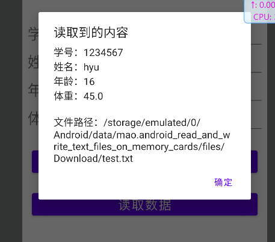


### 在存储卡上读写图片文件

文本文件读写可以转换为对字符串的读写，而图片文件保存的是图像数据，需要专门的位图工具Bitmap 处理。位图对象依据来源不同又分成3种获取方式，分别对应位图工厂BitmapFactory的下列3种方法：

* decodeResource：从指定的资源文件中获取位图数据。例如下面代码表示从资源文件huawei.png 获取位图对象

```java
Bitmap bitmap = BitmapFactory.decodeResource(getResources(),R.drawable.huawei);
```

* decodeFile：从指定路径的文件中获取位图数据。注意从Android 10开始，该方法只适用于私有目录下的图片，不适用公共空间下的图片
* decodeStream：从指定的输入流中获取位图数据。比如使用IO流打开图片文件，此时文件输入流对象即可作为decodeStream方法的入参

```java
/**
     * 从指定路径的图片文件中读取位图数据
     *
     * @param path 路径
     * @return {@link Bitmap}
     */
    public static Bitmap openImage(String path)
    {
        // 声明一个位图对象
        Bitmap bitmap = null;
        // 根据指定的文件路径构建文件输入流对象
        try (FileInputStream fileInputStream = new FileInputStream(path))
        {
            // 从文件输入流中解码位图数据
            bitmap = BitmapFactory.decodeStream(fileInputStream);
        }
        catch (Exception e)
        {
            e.printStackTrace();
        }
        return bitmap;
    }

    /**
     * 从指定路径的图片文件中读取位图数据
     *
     * @param file File对象
     * @return {@link Bitmap}
     */
    public static Bitmap openImage(File file)
    {
        // 声明一个位图对象
        Bitmap bitmap = null;
        // 根据指定的文件路径构建文件输入流对象
        try (FileInputStream fileInputStream = new FileInputStream(file))
        {
            // 从文件输入流中解码位图数据
            bitmap = BitmapFactory.decodeStream(fileInputStream);
        }
        catch (Exception e)
        {
            e.printStackTrace();
        }
        return bitmap;
    }
```


得到位图对象之后，就能在图像视图上显示位图。图像视图ImageView提供了下列方法显示各种来源的图片：

* setImageResource：设置图像视图的图片资源，该方法的入参为资源图片的编号，形如 “R.drawable.去掉扩展名的图片名称”
* setImageBitmap：设置图像视图的位图对象，该方法的入参为Bitmap类型
* setImageURI：设置图像视图的路径对象，该方法的入参为Uri类型。字符串格式的文件路径可通过 代码“Uri.parse(file_path)”转换成路径对象


把位图数据写入图片文件却只有一种，即通过位图对象的compress方法将位图数据压缩到文件输出流

```java
/**
     * 把位图数据保存到指定路径的图片文件
     *
     * @param path   路径
     * @param bitmap Bitmap对象
     */
    public static void saveImage(String path, Bitmap bitmap)
    {
        // 根据指定的文件路径构建文件输出流对象
        try (FileOutputStream fileOutputStream = new FileOutputStream(path))
        {
            // 把位图数据压缩到文件输出流中
            bitmap.compress(Bitmap.CompressFormat.JPEG, 80, fileOutputStream);
        }
        catch (Exception e)
        {
            e.printStackTrace();
        }
    }
```


首先准备一张图片，放在公共的下载目录里


布局文件


```xml
<?xml version="1.0" encoding="utf-8"?>
<LinearLayout xmlns:android="http://schemas.android.com/apk/res/android"
        xmlns:tools="http://schemas.android.com/tools"
        xmlns:app="http://schemas.android.com/apk/res-auto"
        android:layout_width="match_parent"
        android:layout_height="match_parent"
        tools:context=".MainActivity"
        android:orientation="vertical"
        android:gravity="center">

    <Button
            android:id="@+id/Button1"
            android:layout_width="match_parent"
            android:layout_height="wrap_content"
            android:text="读取和写入图片文件" />

    <ImageView
            android:id="@+id/ImageView"
            android:layout_width="wrap_content"
            android:layout_height="wrap_content"
            android:contentDescription="这里显示图片" />

</LinearLayout>
```


代码


```java
package mao.android_read_and_write_picture_files_on_memory_card;

import androidx.appcompat.app.AlertDialog;
import androidx.appcompat.app.AppCompatActivity;

import android.graphics.Bitmap;
import android.graphics.BitmapFactory;
import android.os.Bundle;
import android.os.Environment;
import android.view.View;
import android.widget.ImageView;
import android.widget.Toast;

import java.io.File;
import java.io.FileInputStream;
import java.io.FileOutputStream;

public class MainActivity extends AppCompatActivity
{

    @Override
    protected void onCreate(Bundle savedInstanceState)
    {
        super.onCreate(savedInstanceState);
        setContentView(R.layout.activity_main);

        ImageView imageView = findViewById(R.id.ImageView);

        findViewById(R.id.Button1).setOnClickListener(new View.OnClickListener()
        {
            @Override
            public void onClick(View v)
            {
                String path = Environment.getExternalStoragePublicDirectory(Environment.DIRECTORY_DOWNLOADS).toString() + "/294.jpg";
                Bitmap bitmap = openImage(path);
                if (bitmap == null)
                {
                    Toast.makeText(MainActivity.this, "图片获取失败", Toast.LENGTH_SHORT).show();
                    return;
                }
                imageView.setImageBitmap(bitmap);

                String path1 = getExternalFilesDir(Environment.DIRECTORY_DOWNLOADS).toString() + "/out.jpg";

                boolean b = saveImage(path1, bitmap);
                if (!b)
                {
                    Toast.makeText(MainActivity.this, "写入失败", Toast.LENGTH_SHORT).show();
                    return;
                }
                new AlertDialog.Builder(MainActivity.this)
                        .setMessage("写入成功！\n文件位置：" + path1)
                        .setPositiveButton("确定", null)
                        .create()
                        .show();
            }
        });
    }

    /**
     * 从指定路径的图片文件中读取位图数据
     *
     * @param path 路径
     * @return {@link Bitmap}
     */
    public static Bitmap openImage(String path)
    {
        // 声明一个位图对象
        Bitmap bitmap = null;
        // 根据指定的文件路径构建文件输入流对象
        try (FileInputStream fileInputStream = new FileInputStream(path))
        {
            // 从文件输入流中解码位图数据
            bitmap = BitmapFactory.decodeStream(fileInputStream);
        }
        catch (Exception e)
        {
            e.printStackTrace();
        }
        return bitmap;
    }

    /**
     * 从指定路径的图片文件中读取位图数据
     *
     * @param file File对象
     * @return {@link Bitmap}
     */
    public static Bitmap openImage(File file)
    {
        // 声明一个位图对象
        Bitmap bitmap = null;
        // 根据指定的文件路径构建文件输入流对象
        try (FileInputStream fileInputStream = new FileInputStream(file))
        {
            // 从文件输入流中解码位图数据
            bitmap = BitmapFactory.decodeStream(fileInputStream);
        }
        catch (Exception e)
        {
            e.printStackTrace();
        }
        return bitmap;
    }


    /**
     * 把位图数据保存到指定路径的图片文件
     *
     * @param path   路径
     * @param bitmap Bitmap对象
     */
    public static boolean saveImage(String path, Bitmap bitmap)
    {
        // 根据指定的文件路径构建文件输出流对象
        try (FileOutputStream fileOutputStream = new FileOutputStream(path))
        {
            // 把位图数据压缩到文件输出流中
            bitmap.compress(Bitmap.CompressFormat.JPEG, 80, fileOutputStream);
            return true;
        }
        catch (Exception e)
        {
            e.printStackTrace();
            return false;
        }
    }
}


```


运行


没有权限访问


授予权限


如果是安卓10以上

允许了还是会报没有权限


Android10弃用了管理分区外部储存

**需要在AndroidManifest.xml文件的application 标签下加一条属性 android:requestLegacyExternalStorage="true"**


```xml
<?xml version="1.0" encoding="utf-8"?>
<manifest xmlns:android="http://schemas.android.com/apk/res/android"
        xmlns:tools="http://schemas.android.com/tools"
        package="mao.android_read_and_write_picture_files_on_memory_card">


    <!-- 存储卡读写 -->
    <uses-permission android:name="android.permission.WRITE_EXTERNAL_STORAGE" />
    <uses-permission android:name="android.permission.READ_EXTERNAL_STORAG" />


    <application
            android:allowBackup="true"
            android:requestLegacyExternalStorage="true"
            android:dataExtractionRules="@xml/data_extraction_rules"
            android:fullBackupContent="@xml/backup_rules"
            android:icon="@mipmap/ic_launcher"
            android:label="@string/app_name"
            android:roundIcon="@mipmap/ic_launcher_round"
            android:supportsRtl="true"
            android:theme="@style/Theme.Android_read_and_write_picture_files_on_memory_card"
            tools:targetApi="31">
        <activity
                android:name=".MainActivity"
                android:exported="true">
            <intent-filter>
                <action android:name="android.intent.action.MAIN" />

                <category android:name="android.intent.category.LAUNCHER" />
            </intent-filter>
        </activity>
    </application>

</manifest>
```


## 应用组件Application

### Application的生命周期

Application是Android的一大组件，在App运行过程中有且仅有一个Application对象贯穿应用的整个生命周期。打开AndroidManifest.xml，发现activity节点的上级正是application节点，不过该节点并未指定name属性，此时App采用默认的Application实例


每个activity节点都指定了name属性，譬如常见的name属性值为.MainActivity，让人知晓该 activity的入口代码是MainActivity.java。现在尝试给application节点加上name属性：

```xml
<application
        android:name=".application.MainApplication"
        android:allowBackup="true"
        android:dataExtractionRules="@xml/data_extraction_rules"
        android:fullBackupContent="@xml/backup_rules"
        android:icon="@mipmap/ic_launcher"
        android:label="@string/app_name"
        android:roundIcon="@mipmap/ic_launcher_round"
        android:supportsRtl="true"
        android:theme="@style/Theme.Android_Application"
        tools:targetApi="31">
    <activity
            android:name=".MainActivity"
            android:exported="true">
        <intent-filter>
            <action android:name="android.intent.action.MAIN" />

            <category android:name="android.intent.category.LAUNCHER" />
        </intent-filter>
    </activity>
</application>
```


在Java代码的包名目录下创建MainApplication.java，要求该类继承Application，继承之后可供重写的方法主要有以下3个：

* onCreate：在App启动时调用
* onTerminate：在App终止时调用
* onConfigurationChanged：在配置改变时调用，例如从竖屏变为横屏


与生命周期有关的方法是onCreate和onTerminate，那么重写这两个方法，并在重写后的方法中打印日志


```java
package mao.android_application.application;

import android.app.Application;
import android.content.ContentProvider;
import android.content.res.Configuration;
import android.os.Build;
import android.util.Log;

import androidx.annotation.NonNull;

/**
 * Project name(项目名称)：android_Application
 * Package(包名): mao.android_application.application
 * Class(类名): MainApplication
 * Author(作者）: mao
 * Author QQ：1296193245
 * GitHub：https://github.com/maomao124/
 * Date(创建日期)： 2022/9/28
 * Time(创建时间)： 12:14
 * Version(版本): 1.0
 * Description(描述)： 无
 */

public class MainApplication extends Application
{
    /**
     * 标签
     */
    private static final String TAG = "MainApplication";

    @Override
    public void onCreate()
    {
        super.onCreate();
        Log.d(TAG, "onCreate: ");
    }

    /**
     * This method is for use in emulated process environments.  It will
     * never be called on a production Android device, where processes are
     * removed by simply killing them; no user code (including this callback)
     * is executed when doing so.
     */
    @Override
    public void onTerminate()
    {
        super.onTerminate();
        Log.d(TAG, "onTerminate: ");
    }

    @Override
    public void onConfigurationChanged(@NonNull Configuration newConfig)
    {
        super.onConfigurationChanged(newConfig);
        Log.d(TAG, "onConfigurationChanged: ");
    }
}

```


运行测试App，在logcat窗口观察应用日志。但是只在启动一开始看到MainApplication的 onCreate日志（该日志先于MainActivity的onCreate日志），却始终无法看到它的onTerminate日志， 无论是自行退出App还是强行杀掉App，日志都不会打印onTerminate


Android明明提供了这个方法，同时提供了关于 该方法的解释，说明文字如下：This method is for use in emulated process environments．It will never be called on a production Android device, where processes are removed by simply killing them; no user code (including this callback) is executed when doing so。这段话的意思是：该方法供模拟环境使用，它在真机上永远不会被调用，无论是直接杀进程还是代码退出；执行该操作时，不会执行任何用户代码


### 利用Application操作全局变量

C/C++有全局变量的概念，因为全局变量保存在内存中，所以操作全局变量就是操作内存，显然内存的 读写速度远比读写数据库或读写文件快得多。所谓全局，指的是其他代码都可以引用该变量，因此全局变量是共享数据和消息传递的好帮手。不过Java没有全局变量的概念，与之比较接近的是类里面的静态成员变量，该变量不但能被外部直接引用，而且它在不同地方引用的值是一样的（前提是在引用期间不能改动变量值），所以借助静态成员变量也能实现类似全局变量的功能


Application的生命周期覆盖了App运行的全过程。不像短暂的Activity生命周期，一旦退出该页面，Activity实例就被销毁。因此，利用Application的生命特性，能够在Application实例中保存全局变量


适合在Application中保存的全局变量主要有下面3类数据：

* 会频繁读取的信息，例如用户名、手机号码等
* 不方便由意图传递的数据，例如位图对象、非字符串类型的集合对象等
* 容易因频繁分配内存而导致内存泄漏的对象，例如Handler处理器实例等


要想通过Application实现全局内存的读写，得完成以下3项工作：

* 编写一个继承自Application的新类MainApplication。该类采用单例模式，内部先声明自身类的一 个静态成员对象，在创建App时把自身赋值给这个静态对象，然后提供该对象的获取方法getInstance


```java
package mao.android_application.application;

import android.app.Application;
import android.content.ContentProvider;
import android.content.res.Configuration;
import android.os.Build;
import android.util.Log;

import androidx.annotation.NonNull;

import java.util.HashMap;
import java.util.Map;

/**
 * Project name(项目名称)：android_Application
 * Package(包名): mao.android_application.application
 * Class(类名): MainApplication
 * Author(作者）: mao
 * Author QQ：1296193245
 * GitHub：https://github.com/maomao124/
 * Date(创建日期)： 2022/9/28
 * Time(创建时间)： 12:14
 * Version(版本): 1.0
 * Description(描述)： 无
 */

public class MainApplication extends Application
{
    /**
     * 标签
     */
    private static final String TAG = "MainApplication";

    /**
     * 实例，单例模式，双重检查锁，volatile防止指令重排，在写后面加写屏障
     */
    private static volatile MainApplication mainApplication;

    public Map<String, Object> map = new HashMap<>();

    public static MainApplication getInstance()
    {
        if (mainApplication == null)
        {
            synchronized (MainApplication.class)
            {
                if (mainApplication == null)
                {
                    mainApplication = new MainApplication();
                }
            }
        }
        return mainApplication;
    }


    @Override
    public void onCreate()
    {
        super.onCreate();
        Log.d(TAG, "onCreate: ");
    }

    /**
     * This method is for use in emulated process environments.  It will
     * never be called on a production Android device, where processes are
     * removed by simply killing them; no user code (including this callback)
     * is executed when doing so.
     */
    @Override
    public void onTerminate()
    {
        super.onTerminate();
        Log.d(TAG, "onTerminate: ");
    }

    @Override
    public void onConfigurationChanged(@NonNull Configuration newConfig)
    {
        super.onConfigurationChanged(newConfig);
        Log.d(TAG, "onConfigurationChanged: ");
    }
}
```


* 在活动页面代码中调用MainApplication的getInstance方法，获得它的一个静态对象，再通过该对象访问MainApplication的公共变量和公共方法


接下来演示如何读写内存中的全局变量，首先分别创建写内存页面和读内存页面，其中写内存页面把用户的注册信息保存到全局变量map集合里


布局

```xml
<?xml version="1.0" encoding="utf-8"?>
<LinearLayout xmlns:android="http://schemas.android.com/apk/res/android"
        xmlns:tools="http://schemas.android.com/tools"
        xmlns:app="http://schemas.android.com/apk/res-auto"
        android:layout_width="match_parent"
        android:layout_height="match_parent"
        tools:context=".MainActivity"
        android:orientation="vertical"
        android:gravity="center">

    <EditText
            android:id="@+id/EditText1"
            android:layout_width="match_parent"
            android:layout_height="wrap_content"
            android:inputType="text"
            android:hint="用户名" />

    <EditText
            android:id="@+id/EditText2"
            android:layout_width="match_parent"
            android:layout_height="wrap_content"
            android:inputType="numberPassword"
            android:hint="密码" />

    <Button
            android:id="@+id/Button1"
            android:layout_width="match_parent"
            android:layout_height="wrap_content"
            android:text="保存到application域"
            android:textAllCaps="false" />

    <Button
            android:id="@+id/Button2"
            android:layout_width="match_parent"
            android:layout_height="wrap_content"
            android:text="跳转"
            android:textAllCaps="false" />

</LinearLayout>
```


```xml
<?xml version="1.0" encoding="utf-8"?>
<LinearLayout xmlns:android="http://schemas.android.com/apk/res/android"
        xmlns:tools="http://schemas.android.com/tools"
        xmlns:app="http://schemas.android.com/apk/res-auto"
        android:layout_width="match_parent"
        android:layout_height="match_parent"
        tools:context=".MainActivity2"
        android:orientation="vertical"
        android:gravity="center">

    <TextView
            android:id="@+id/TextView_result"
            android:layout_width="wrap_content"
            android:layout_height="wrap_content" />

    <Button
            android:id="@+id/Button3"
            android:layout_width="match_parent"
            android:layout_height="wrap_content"
            android:text="读取application域"
            android:textAllCaps="false" />

</LinearLayout>
```


代码


```java
package mao.android_application;

import androidx.appcompat.app.AppCompatActivity;

import android.content.Intent;
import android.os.Bundle;
import android.view.View;
import android.widget.EditText;

import java.util.Map;

import mao.android_application.application.MainApplication;

public class MainActivity extends AppCompatActivity
{

    @Override
    protected void onCreate(Bundle savedInstanceState)
    {
        super.onCreate(savedInstanceState);
        setContentView(R.layout.activity_main);

        EditText editText1 = findViewById(R.id.EditText1);
        EditText editText2 = findViewById(R.id.EditText2);

        findViewById(R.id.Button1).setOnClickListener(new View.OnClickListener()
        {
            @Override
            public void onClick(View v)
            {
                String username = editText1.getText().toString();
                String password = editText2.getText().toString();

                Map<String, Object> map = MainApplication.getInstance().map;
                map.put("username", username);
                map.put("password", password);
            }
        });

        findViewById(R.id.Button2).setOnClickListener(new View.OnClickListener()
        {
            @Override
            public void onClick(View v)
            {
                startActivity(new Intent(MainActivity.this, MainActivity2.class));
            }
        });

    }
}
```


```java
package mao.android_application;

import androidx.appcompat.app.AppCompatActivity;

import android.annotation.SuppressLint;
import android.content.Context;
import android.os.Bundle;
import android.view.View;
import android.widget.TextView;
import android.widget.Toast;

import java.util.Map;

import mao.android_application.application.MainApplication;

public class MainActivity2 extends AppCompatActivity
{

    @Override
    protected void onCreate(Bundle savedInstanceState)
    {
        super.onCreate(savedInstanceState);
        setContentView(R.layout.activity_main2);

        TextView textView = findViewById(R.id.TextView_result);

        findViewById(R.id.Button3).setOnClickListener(new View.OnClickListener()
        {
            @SuppressLint("SetTextI18n")
            @Override
            public void onClick(View v)
            {
                Map<String, Object> map = MainApplication.getInstance().map;
                String username = (String) map.get("username");
                String password = (String) map.get("password");

                if (username == null)
                {
                    toastShow("用户名读取失败");
                    return;
                }
                if (password == null)
                {
                    toastShow("密码读取失败");
                    return;
                }
                textView.setText("用户名：" + username + "\n密码：" + password);

            }
        });
    }

    /**
     * 显示消息
     *
     * @param message 消息
     */
    private void toastShow(String message)
    {
        Toast.makeText(this, message, Toast.LENGTH_SHORT).show();
    }
}
```


运行


先保存再跳转


读取


## 利用Room简化数据库操作

虽然Android提供了数据库帮助器，但是开发者在进行数据库编程时仍有诸多不便，比如每次增加一张新表，开发者都得手工实现以下代码逻辑：

* 重写数据库帮助器的onCreate方法，添加该表的建表语句
* 在插入记录之时，必须将数据实例的属性值逐一赋给该表的各字段
* 在查询记录之时，必须遍历结果集游标，把各字段值逐一赋给数据实例
* 每次读写操作之前，都要先开启数据库连接；读写操作之后，又要关闭数据库连接


谷歌公司有一个数据库框架—Room，该框架同样基于SQLite，但它通过注解技术极大地简化了数据库操 作，减少了原来相当一部分编码工作量


由于Room并未集成到SDK中，而是作为第三方框架提供，所以要导入依赖

修改模块的build.gradle文件，往 dependencies节点添加下面两行配置，表示导入指定版本的Room库：

```
implementation 'androidx.room:room-runtime:2.3.0'
annotationProcessor 'androidx.room:room-compiler:2.3.0'
```


示例

```
plugins {
    id 'com.android.application'
}

android {
    compileSdk 32

    defaultConfig {
        applicationId "mao.android_room_frame"
        minSdk 25
        targetSdk 32
        versionCode 1
        versionName "1.0"

        testInstrumentationRunner "androidx.test.runner.AndroidJUnitRunner"
    }

    buildTypes {
        release {
            minifyEnabled false
            proguardFiles getDefaultProguardFile('proguard-android-optimize.txt'), 'proguard-rules.pro'
        }
    }
    compileOptions {
        sourceCompatibility JavaVersion.VERSION_1_8
        targetCompatibility JavaVersion.VERSION_1_8
    }
}

dependencies {

    implementation 'androidx.room:room-runtime:2.3.0'
    annotationProcessor 'androidx.room:room-compiler:2.3.0'
    implementation 'androidx.appcompat:appcompat:1.3.0'
    implementation 'com.google.android.material:material:1.4.0'
    implementation 'androidx.constraintlayout:constraintlayout:2.0.4'
    testImplementation 'junit:junit:4.13.2'
    androidTestImplementation 'androidx.test.ext:junit:1.1.3'
    androidTestImplementation 'androidx.test.espresso:espresso-core:3.4.0'
}
```


已学生信息操作为例


#### 编写实体类Student

```java
package mao.android_room_frame.entity;

import androidx.annotation.NonNull;
import androidx.room.Database;
import androidx.room.Entity;
import androidx.room.Ignore;
import androidx.room.PrimaryKey;

import java.io.Serializable;

/**
 * Project name(项目名称)：android_Room_frame
 * Package(包名): mao.android_room_frame.entity
 * Class(类名): Student
 * Author(作者）: mao
 * Author QQ：1296193245
 * GitHub：https://github.com/maomao124/
 * Date(创建日期)： 2022/9/28
 * Time(创建时间)： 13:25
 * Version(版本): 1.0
 * Description(描述)： 无
 */

@Entity
public class Student implements Serializable
{
    /**
     * id
     */
    @PrimaryKey
    @NonNull
    private Long id;

    /**
     * 名字
     */
    private String name;

    /**
     * 性别
     */
    private String sex;

    /**
     * 年龄
     */
    private int age;

    /**
     * Instantiates a new Student.
     */
    public Student()
    {

    }

    /**
     * Instantiates a new Student.
     *
     * @param id   the id
     * @param name the name
     * @param sex  the sex
     * @param age  the age
     */
    @Ignore
    public Student(Long id, String name, String sex, int age)
    {
        this.id = id;
        this.name = name;
        this.sex = sex;
        this.age = age;
    }

    /**
     * Gets id.
     *
     * @return the id
     */
    public Long getId()
    {
        return id;
    }

    /**
     * Sets id.
     *
     * @param id the id
     */
    public void setId(Long id)
    {
        this.id = id;
    }

    /**
     * Gets name.
     *
     * @return the name
     */
    public String getName()
    {
        return name;
    }

    /**
     * Sets name.
     *
     * @param name the name
     */
    public void setName(String name)
    {
        this.name = name;
    }

    /**
     * Gets sex.
     *
     * @return the sex
     */
    public String getSex()
    {
        return sex;
    }

    /**
     * Sets sex.
     *
     * @param sex the sex
     */
    public void setSex(String sex)
    {
        this.sex = sex;
    }

    /**
     * Gets age.
     *
     * @return the age
     */
    public int getAge()
    {
        return age;
    }

    /**
     * Sets age.
     *
     * @param age the age
     */
    public void setAge(int age)
    {
        this.age = age;
    }

    @Override
    public boolean equals(Object o)
    {
        if (this == o)
        {
            return true;
        }
        if (o == null || getClass() != o.getClass())
        {
            return false;
        }

        Student student = (Student) o;

        if (getAge() != student.getAge())
        {
            return false;
        }
        if (getId() != null ? !getId().equals(student.getId()) : student.getId() != null)
        {
            return false;
        }
        if (getName() != null ? !getName().equals(student.getName()) : student.getName() != null)
        {
            return false;
        }
        return getSex() != null ? getSex().equals(student.getSex()) : student.getSex() == null;
    }

    @Override
    public int hashCode()
    {
        int result = getId() != null ? getId().hashCode() : 0;
        result = 31 * result + (getName() != null ? getName().hashCode() : 0);
        result = 31 * result + (getSex() != null ? getSex().hashCode() : 0);
        result = 31 * result + getAge();
        return result;
    }

    @Override
    @SuppressWarnings("all")
    public String toString()
    {
        final StringBuilder stringbuilder = new StringBuilder();
        stringbuilder.append("id：").append(id).append('\n');
        stringbuilder.append("name：").append(name).append('\n');
        stringbuilder.append("sex：").append(sex).append('\n');
        stringbuilder.append("age：").append(age).append('\n');
        return stringbuilder.toString();
    }
}

```


#### 编写持久化类

该类必须添加“@Dao”注解，内部的记录查询方法必须添加“@Query”注 解，记录插入方法必须添加“@Insert”注解，记录更新方法必须添加“@Update”注解，记录删除方法必须 添加“@Delete”注解（带条件的删除方法除外）。对于记录查询方法，允许在@Query之后补充具体的查 询语句以及查询条件；对于记录插入方法与记录更新方法，需明确出现重复记录时要采取哪种处理策略


```java
package mao.android_room_frame.dao;

import androidx.room.Dao;
import androidx.room.Delete;
import androidx.room.Insert;
import androidx.room.OnConflictStrategy;
import androidx.room.Query;
import androidx.room.Update;

import java.util.List;

import mao.android_room_frame.entity.Student;

/**
 * Project name(项目名称)：android_Room_frame
 * Package(包名): mao.android_room_frame.dao
 * Interface(接口名): StudentDao
 * Author(作者）: mao
 * Author QQ：1296193245
 * GitHub：https://github.com/maomao124/
 * Date(创建日期)： 2022/9/28
 * Time(创建时间)： 13:31
 * Version(版本): 1.0
 * Description(描述)： 无
 */

@Dao
public interface StudentDao
{
    /**
     * 查询所有
     *
     * @return {@link List}<{@link Student}>
     */
    @Query("select * from student")
    List<Student> queryAll();

    /**
     * 查询
     *
     * @param id id
     * @return {@link Student}
     */
    @Query("select * from student where id=:id")
    Student query(Long id);

    /**
     * 插入
     *
     * @param student 学生
     */
    @Insert(onConflict = OnConflictStrategy.REPLACE)
    void insert(Student student);

    /**
     * 插入列表
     *
     * @param list 列表
     */
    @Insert
    void insertList(List<Student> list);


    /**
     * 更新
     *
     * @param student 学生
     * @return int
     */
    @Update
    int update(Student student);


    /**
     * 删除
     *
     * @param student 学生
     * @return int
     */
    @Delete
    int delete(Student student);

    /**
     * 删除所有
     */
    @Query("delete from student where 1=1")
    void deleteAll();

}

```


这是一个接口，其实框架生成了对应的实现类，使用的是实现类


```java
package mao.android_room_frame.database;

import androidx.room.DatabaseConfiguration;
import androidx.room.InvalidationTracker;
import androidx.room.RoomOpenHelper;
import androidx.room.RoomOpenHelper.Delegate;
import androidx.room.RoomOpenHelper.ValidationResult;
import androidx.room.util.DBUtil;
import androidx.room.util.TableInfo;
import androidx.room.util.TableInfo.Column;
import androidx.room.util.TableInfo.ForeignKey;
import androidx.room.util.TableInfo.Index;
import androidx.sqlite.db.SupportSQLiteDatabase;
import androidx.sqlite.db.SupportSQLiteOpenHelper;
import androidx.sqlite.db.SupportSQLiteOpenHelper.Callback;
import androidx.sqlite.db.SupportSQLiteOpenHelper.Configuration;

import java.lang.Class;
import java.lang.Override;
import java.lang.String;
import java.lang.SuppressWarnings;
import java.util.HashMap;
import java.util.HashSet;
import java.util.List;
import java.util.Map;
import java.util.Set;

import mao.android_room_frame.dao.StudentDao;
import mao.android_room_frame.dao.StudentDao_Impl;

@SuppressWarnings({"unchecked", "deprecation"})
public final class StudentDatabase_Impl extends StudentDatabase
{
    private volatile StudentDao _studentDao;

    @Override
    protected SupportSQLiteOpenHelper createOpenHelper(DatabaseConfiguration configuration)
    {
        final SupportSQLiteOpenHelper.Callback _openCallback = new RoomOpenHelper(configuration, new RoomOpenHelper.Delegate(1)
        {
            @Override
            public void createAllTables(SupportSQLiteDatabase _db)
            {
                _db.execSQL("CREATE TABLE IF NOT EXISTS `Student` (`id` INTEGER NOT NULL, `name` TEXT, `sex` TEXT, `age` INTEGER NOT NULL, PRIMARY KEY(`id`))");
                _db.execSQL("CREATE TABLE IF NOT EXISTS room_master_table (id INTEGER PRIMARY KEY,identity_hash TEXT)");
                _db.execSQL("INSERT OR REPLACE INTO room_master_table (id,identity_hash) VALUES(42, '4ee27f582a4db332409758cc675862e6')");
            }

            @Override
            public void dropAllTables(SupportSQLiteDatabase _db)
            {
                _db.execSQL("DROP TABLE IF EXISTS `Student`");
                if (mCallbacks != null)
                {
                    for (int _i = 0, _size = mCallbacks.size(); _i < _size; _i++)
                    {
                        mCallbacks.get(_i).onDestructiveMigration(_db);
                    }
                }
            }

            @Override
            protected void onCreate(SupportSQLiteDatabase _db)
            {
                if (mCallbacks != null)
                {
                    for (int _i = 0, _size = mCallbacks.size(); _i < _size; _i++)
                    {
                        mCallbacks.get(_i).onCreate(_db);
                    }
                }
            }

            @Override
            public void onOpen(SupportSQLiteDatabase _db)
            {
                mDatabase = _db;
                internalInitInvalidationTracker(_db);
                if (mCallbacks != null)
                {
                    for (int _i = 0, _size = mCallbacks.size(); _i < _size; _i++)
                    {
                        mCallbacks.get(_i).onOpen(_db);
                    }
                }
            }

            @Override
            public void onPreMigrate(SupportSQLiteDatabase _db)
            {
                DBUtil.dropFtsSyncTriggers(_db);
            }

            @Override
            public void onPostMigrate(SupportSQLiteDatabase _db)
            {
            }

            @Override
            protected RoomOpenHelper.ValidationResult onValidateSchema(SupportSQLiteDatabase _db)
            {
                final HashMap<String, TableInfo.Column> _columnsStudent = new HashMap<String, TableInfo.Column>(4);
                _columnsStudent.put("id", new TableInfo.Column("id", "INTEGER", true, 1, null, TableInfo.CREATED_FROM_ENTITY));
                _columnsStudent.put("name", new TableInfo.Column("name", "TEXT", false, 0, null, TableInfo.CREATED_FROM_ENTITY));
                _columnsStudent.put("sex", new TableInfo.Column("sex", "TEXT", false, 0, null, TableInfo.CREATED_FROM_ENTITY));
                _columnsStudent.put("age", new TableInfo.Column("age", "INTEGER", true, 0, null, TableInfo.CREATED_FROM_ENTITY));
                final HashSet<TableInfo.ForeignKey> _foreignKeysStudent = new HashSet<TableInfo.ForeignKey>(0);
                final HashSet<TableInfo.Index> _indicesStudent = new HashSet<TableInfo.Index>(0);
                final TableInfo _infoStudent = new TableInfo("Student", _columnsStudent, _foreignKeysStudent, _indicesStudent);
                final TableInfo _existingStudent = TableInfo.read(_db, "Student");
                if (!_infoStudent.equals(_existingStudent))
                {
                    return new RoomOpenHelper.ValidationResult(false, "Student(mao.android_room_frame.entity.Student).\n"
                            + " Expected:\n" + _infoStudent + "\n"
                            + " Found:\n" + _existingStudent);
                }
                return new RoomOpenHelper.ValidationResult(true, null);
            }
        }, "4ee27f582a4db332409758cc675862e6", "f5640ef8ac55f28c62199a56d3562702");
        final SupportSQLiteOpenHelper.Configuration _sqliteConfig = SupportSQLiteOpenHelper.Configuration.builder(configuration.context)
                .name(configuration.name)
                .callback(_openCallback)
                .build();
        final SupportSQLiteOpenHelper _helper = configuration.sqliteOpenHelperFactory.create(_sqliteConfig);
        return _helper;
    }

    @Override
    protected InvalidationTracker createInvalidationTracker()
    {
        final HashMap<String, String> _shadowTablesMap = new HashMap<String, String>(0);
        HashMap<String, Set<String>> _viewTables = new HashMap<String, Set<String>>(0);
        return new InvalidationTracker(this, _shadowTablesMap, _viewTables, "Student");
    }

    @Override
    public void clearAllTables()
    {
        super.assertNotMainThread();
        final SupportSQLiteDatabase _db = super.getOpenHelper().getWritableDatabase();
        try
        {
            super.beginTransaction();
            _db.execSQL("DELETE FROM `Student`");
            super.setTransactionSuccessful();
        }
        finally
        {
            super.endTransaction();
            _db.query("PRAGMA wal_checkpoint(FULL)").close();
            if (!_db.inTransaction())
            {
                _db.execSQL("VACUUM");
            }
        }
    }

    @Override
    protected Map<Class<?>, List<Class<?>>> getRequiredTypeConverters()
    {
        final HashMap<Class<?>, List<Class<?>>> _typeConvertersMap = new HashMap<Class<?>, List<Class<?>>>();
        _typeConvertersMap.put(StudentDao.class, StudentDao_Impl.getRequiredConverters());
        return _typeConvertersMap;
    }

    @Override
    public StudentDao getStudentDao()
    {
        if (_studentDao != null)
        {
            return _studentDao;
        }
        else
        {
            synchronized (this)
            {
                if (_studentDao == null)
                {
                    _studentDao = new StudentDao_Impl(this);
                }
                return _studentDao;
            }
        }
    }
}
```


#### 编写数据库类

因为先有数据库然后才有表，所以图书信息表还得放到某个数据库里，这个默认的图书数据库要从 RoomDatabase派生而来，并添加“@Database”注解


```java
package mao.android_room_frame.database;


import androidx.room.Database;

import androidx.room.RoomDatabase;


import mao.android_room_frame.dao.StudentDao;
import mao.android_room_frame.entity.Student;

/**
 * Project name(项目名称)：android_Room_frame
 * Package(包名): mao.android_room_frame.database
 * Class(类名): StudentDatabase
 * Author(作者）: mao
 * Author QQ：1296193245
 * GitHub：https://github.com/maomao124/
 * Date(创建日期)： 2022/9/28
 * Time(创建时间)： 13:43
 * Version(版本): 1.0
 * Description(描述)： 无
 */

/*
entities表示该数据库有哪些表，version表示数据库的版本号
exportSchema表示是否导出数据库信息的json串，建议设为false，若设为true还需指定json文件的保
存路径
 */
@Database(entities = {Student.class}, version = 1, exportSchema = false)
public abstract class StudentDatabase extends RoomDatabase
{
    /**
     * 获取该数据库中某张表的持久化对象
     */
    public abstract StudentDao getStudentDao();
}

```


#### 声明数据库的唯一实例

为了避免重复打开数据库造成的内存泄漏问题，每个数据库在App运行过程中理应只有一个实例，此时要求开发者自定义新的Application类，在该类中声明并获取图书数据库的实例，并将自定义的 Application类设为单例模式，保证App运行之时有且仅有一个应用实例。


```java
package mao.android_room_frame.application;

import android.app.Application;
import android.content.res.Configuration;
import android.util.Log;

import androidx.annotation.NonNull;
import androidx.room.Room;

import java.util.HashMap;
import java.util.Map;

import mao.android_room_frame.database.StudentDatabase;

/**
 * Project name(项目名称)：android_Room_frame
 * Package(包名): mao.android_room_frame.application
 * Class(类名): MainApplication
 * Author(作者）: mao
 * Author QQ：1296193245
 * GitHub：https://github.com/maomao124/
 * Date(创建日期)： 2022/9/28
 * Time(创建时间)： 13:53
 * Version(版本): 1.0
 * Description(描述)： 无
 */


public class MainApplication extends Application
{
    /**
     * 标签
     */
    private static final String TAG = "MainApplication";

    /**
     * 实例，单例模式
     */
    private static volatile MainApplication mainApplication;

    public Map<String, Object> map = new HashMap<>();

    private StudentDatabase studentDatabase;

    /**
     * 得到StudentDatabase
     *
     * @return {@link StudentDatabase}
     */
    public StudentDatabase getStudentDatabase()
    {
        return studentDatabase;
    }

    /**
     * 获得实例
     *
     * @return {@link MainApplication}
     */
    public static MainApplication getInstance()
    {
        return mainApplication;
    }


    @Override
    public void onCreate()
    {
        super.onCreate();
        Log.d(TAG, "onCreate: ");
        mainApplication = this;

        studentDatabase = Room.databaseBuilder(this, StudentDatabase.class, "student")
                //允许迁移数据库（发生数据库变更时，Room默认删除原数据库再创建新数据库。
                //如此一来原来的记录会丢失，故而要改为迁移方式以便保存原有记录）
                .addMigrations()
                //// 允许在主线程中操作数据库（Room默认不能在主线程中操作数据库）
                .allowMainThreadQueries()
                .build();


    }

    /**
     * This method is for use in emulated process environments.  It will
     * never be called on a production Android device, where processes are
     * removed by simply killing them; no user code (including this callback)
     * is executed when doing so.
     */
    @Override
    public void onTerminate()
    {
        super.onTerminate();
        Log.d(TAG, "onTerminate: ");
    }

    @Override
    public void onConfigurationChanged(@NonNull Configuration newConfig)
    {
        super.onConfigurationChanged(newConfig);
        Log.d(TAG, "onConfigurationChanged: ");
    }
}
```


#### 获取数据表的持久化对象

```java
StudentDao studentDao = MainApplication.getInstance().getStudentDatabase().getStudentDao();
```


#### 布局文件


```xml
<?xml version="1.0" encoding="utf-8"?>
<LinearLayout xmlns:android="http://schemas.android.com/apk/res/android"
        xmlns:tools="http://schemas.android.com/tools"
        xmlns:app="http://schemas.android.com/apk/res-auto"
        android:layout_width="match_parent"
        android:layout_height="match_parent"
        tools:context=".MainActivity"
        android:orientation="vertical"
        android:gravity="center">


    <EditText
            android:id="@+id/EditText1"
            android:layout_width="match_parent"
            android:layout_height="wrap_content"
            android:hint="学号"
            android:inputType="number"
            android:maxLength="13" />

    <EditText
            android:id="@+id/EditText2"
            android:layout_width="match_parent"
            android:layout_height="wrap_content"
            android:hint="姓名"
            android:maxLength="5"
            android:inputType="text" />

    <EditText
            android:id="@+id/EditText3"
            android:layout_width="match_parent"
            android:layout_height="wrap_content"
            android:hint="性别"
            android:maxLength="1" />

    <EditText
            android:id="@+id/EditText4"
            android:layout_width="match_parent"
            android:layout_height="wrap_content"
            android:hint="年龄"
            android:maxLength="2"
            android:inputType="number" />

    <Button
            android:id="@+id/Button1"
            android:layout_width="match_parent"
            android:layout_height="wrap_content"
            android:text="添加" />

    <Button
            android:id="@+id/Button2"
            android:layout_width="match_parent"
            android:layout_height="wrap_content"
            android:text="修改" />

    <Button
            android:id="@+id/Button3"
            android:layout_width="match_parent"
            android:layout_height="wrap_content"
            android:text="删除" />

    <Button
            android:id="@+id/Button4"
            android:layout_width="match_parent"
            android:layout_height="wrap_content"
            android:text="查询" />

    <Button
            android:id="@+id/Button5"
            android:layout_width="match_parent"
            android:layout_height="wrap_content"
            android:text="查询所有" />

    <ScrollView
            android:layout_width="match_parent"
            android:layout_height="wrap_content">

        <TextView
                android:id="@+id/TextView1"
                android:layout_width="match_parent"
                android:layout_height="wrap_content" />
    </ScrollView>

</LinearLayout>
```


#### MainActivity代码


```java
package mao.android_room_frame;

import androidx.appcompat.app.AppCompatActivity;

import android.annotation.SuppressLint;
import android.app.AlertDialog;
import android.content.DialogInterface;
import android.os.Bundle;
import android.util.Log;
import android.view.View;
import android.widget.EditText;
import android.widget.TextView;
import android.widget.Toast;

import java.util.List;

import mao.android_room_frame.application.MainApplication;
import mao.android_room_frame.dao.StudentDao;
import mao.android_room_frame.entity.Student;

public class MainActivity extends AppCompatActivity
{

    private StudentDao studentDao;
    private TextView textView;
    private EditText editText1;
    private EditText editText2;
    private EditText editText3;
    private EditText editText4;

    /**
     * 标签
     */
    private static final String TAG = "MainActivity";

    @Override
    protected void onCreate(Bundle savedInstanceState)
    {
        super.onCreate(savedInstanceState);
        setContentView(R.layout.activity_main);

        studentDao = MainApplication.getInstance().getStudentDatabase().getStudentDao();

        textView = findViewById(R.id.TextView1);

        editText1 = findViewById(R.id.EditText1);
        editText2 = findViewById(R.id.EditText2);
        editText3 = findViewById(R.id.EditText3);
        editText4 = findViewById(R.id.EditText4);


        findViewById(R.id.Button1).setOnClickListener(new View.OnClickListener()
        {
            @Override
            public void onClick(View v)
            {
                insert();
            }
        });

        findViewById(R.id.Button2).setOnClickListener(new View.OnClickListener()
        {
            @Override
            public void onClick(View v)
            {
                update();
            }
        });

        findViewById(R.id.Button3).setOnClickListener(new View.OnClickListener()
        {
            @Override
            public void onClick(View v)
            {
                delete();
            }
        });

        findViewById(R.id.Button4).setOnClickListener(new View.OnClickListener()
        {
            @Override
            public void onClick(View v)
            {
                query();
            }
        });

        findViewById(R.id.Button5).setOnClickListener(new View.OnClickListener()
        {
            @Override
            public void onClick(View v)
            {
                queryAll();
            }
        });

    }

    /**
     * 插入
     */
    private void insert()
    {
        try
        {
            Long id = Long.valueOf(editText1.getText().toString());
            String name = editText2.getText().toString();
            String sex = editText3.getText().toString();
            int age = Integer.parseInt(editText4.getText().toString());

            if (!sex.equals("男") && !sex.equals("女"))
            {
                throw new Exception("性别只能为男或者女");
            }
            Student student = new Student(id, name, sex, age);
            studentDao.insert(student);
            toastShow("已尝试插入");
        }
        catch (Exception e)
        {
            Log.e(TAG, "insert: ", e);
            toastShow("异常：" + e.getMessage());
        }
    }


    /**
     * 更新
     */
    private void update()
    {
        try
        {
            Long id = Long.valueOf(editText1.getText().toString());
            String name = editText2.getText().toString();
            String sex = editText3.getText().toString();
            int age = Integer.parseInt(editText4.getText().toString());

            Student student = studentDao.query(id);
            if (student == null)
            {
                throw new Exception("未查询到学号为" + id + "的信息");
            }
            student.setName(name);
            student.setSex(sex);
            student.setAge(age);
            int update = studentDao.update(student);
            if (update <= 0)
            {
                throw new Exception("更新失败");
            }
            toastShow("更新成功");
        }
        catch (Exception e)
        {
            Log.e(TAG, "update: ", e);
            toastShow("异常：" + e.getMessage());
        }
    }

    /**
     * 删除
     */
    private void delete()
    {
        try
        {
            if (editText1.getText().toString().equals(""))
            {
                toastShow("学号为空");
                return;
            }
            long id = Long.parseLong(editText1.getText().toString());

            AlertDialog.Builder builder = new AlertDialog.Builder(this);
            builder.setTitle("删除确认")
                    .setMessage("是否删除学号为" + id + "的信息？")
                    .setPositiveButton("确认", new DialogInterface.OnClickListener()
                    {
                        @Override
                        public void onClick(DialogInterface dialog, int which)
                        {
                            int delete = studentDao.delete(new Student(id, null, null, 0));
                            if (delete <= 0)
                            {
                                toastShow("删除失败");
                                return;
                            }
                            toastShow("删除成功");
                        }
                    })
                    .setNegativeButton("取消", null)
                    .create()
                    .show();

        }
        catch (Exception e)
        {
            Log.e(TAG, "delete: ", e);
            toastShow("异常：" + e.getMessage());
        }
    }

    /**
     * 查询
     */
    private void query()
    {
        try
        {
            if (editText1.getText().toString().equals(""))
            {
                toastShow("学号为空");
                return;
            }
            long id = Long.parseLong(editText1.getText().toString());

            Student student = studentDao.query(id);
            if (student == null)
            {
                toastShow("查询不到学号为" + id + "的信息");
                editText1.setText("");
                editText2.setText("");
                editText3.setText("");
                editText4.setText("");
                return;
            }
            editText1.setText(String.valueOf(id));
            editText2.setText(student.getName());
            editText3.setText(student.getSex());
            editText4.setText(String.valueOf(student.getAge()));
            toastShow("查询成功");
        }
        catch (Exception e)
        {
            Log.e(TAG, "query: ", e);
            toastShow("异常：" + e.getMessage());
        }
    }

    /**
     * 查询所有
     */
    @SuppressLint("SetTextI18n")
    private void queryAll()
    {
        try
        {
            textView.setText("");
            List<Student> studentList = studentDao.queryAll();
            for (Student student : studentList)
            {
                textView.setText(textView.getText() + "\n\n" + student.toString());
            }
            toastShow("查询到" + studentList.size() + "条数据");
        }
        catch (Exception e)
        {
            Log.e(TAG, "queryAll: ", e);
            toastShow("异常：" + e.getMessage());
        }
    }

    /**
     * 显示消息
     *
     * @param message 消息
     */
    private void toastShow(String message)
    {
        Toast.makeText(this, message, Toast.LENGTH_SHORT).show();
    }
}
```


#### 运行

添加


查询所有


查询


更新


查询所有


删除


查询所有


再次删除


#### 添加一个快捷方式

因为还有批量添加和清除全部这两个方法还没有测试


在xml中添加shortcuts.xml文件


```xml
<?xml version ="1.0" encoding="utf-8"?>
<shortcuts xmlns:android="http://schemas.android.com/apk/res/android">
    <!-- Add shortcuts that launch your app to a specific screen or task. -->
    <!-- Learn more at https://developer.android.com/guide/topics/ui/shortcuts/creating-shortcuts -->
    <!-- <shortcut android:shortcutId="SHORTCUT_ID" -->
    <!--     android:enabled="true" -->
    <!--     android:shortcutShortLabel="SHORTCUT_SHORT_LABEL" -->
    <!--     android:shortcutLongLabel="SHORTCUT_LONG_LABEL" -->
    <!--     android:shortcutDisabledMessage="SHORTCUT_DISABLED_MESSAGE"> -->
    <!--     <intent -->
    <!--         android:action="android.intent.action.VIEW" -->
    <!--         android:targetClass="REPLACE_IT_WITH_FULL_QUALIFIED_CLASS" -->
    <!--         android:targetPackage="REPLACE_IT_WITH_TARGET_PACKAGE" /> -->
    <!-- </shortcut> -->

    <!-- Integrate with Google Assistant App Actions for launching your app with various voice commands. -->
    <!-- Learn more at: https://developers.google.com/assistant/app/overview -->
    <!-- <capability android:name="actions.intent.OPEN_APP_FEATURE"> -->
    <!--     Provide query fulfillment instructions for this capability, or bind it to a shortcut. -->
    <!--     Learn more at: https://developers.google.com/assistant/app/action-schema -->
    <!-- </capability> -->

    <shortcut
            android:shortcutId="f"
            android:enabled="true"
            android:icon="@mipmap/ic_launcher"
            android:shortcutShortLabel="@string/s"
            android:shortcutLongLabel="@string/l">
        <!-- targetClass指定了点击该项菜单后要打开哪个活动页面 -->
        <intent
                android:action="android.intent.action.VIEW"
                android:targetPackage="mao.android_room_frame"
                android:targetClass="mao.android_room_frame.MainActivity2">

            <categories android:name="android.shortcut.conversation" />

        </intent>

    </shortcut>

</shortcuts>
```


字符串常量

```xml
<resources>
    <string name="app_name">android_Room_frame</string>

    <string name="s">insert and clear</string>
    <string name="l">批量添加和清空数据</string>

</resources>
```


#### 更改清单文件


```xml
<?xml version="1.0" encoding="utf-8"?>
<manifest xmlns:android="http://schemas.android.com/apk/res/android"
        xmlns:tools="http://schemas.android.com/tools"
        package="mao.android_room_frame">

    <application
            android:name=".application.MainApplication"
            android:allowBackup="true"
            android:dataExtractionRules="@xml/data_extraction_rules"
            android:fullBackupContent="@xml/backup_rules"
            android:icon="@mipmap/ic_launcher"
            android:label="@string/app_name"
            android:roundIcon="@mipmap/ic_launcher_round"
            android:supportsRtl="true"
            android:theme="@style/Theme.Android_Room_frame"
            tools:targetApi="31">
        <activity
                android:name=".MainActivity2"
                android:exported="false" />
        <activity
                android:name=".MainActivity"
                android:exported="true">
            <intent-filter>
                <action android:name="android.intent.action.MAIN" />

                <category android:name="android.intent.category.LAUNCHER" />
            </intent-filter>

            <!-- 指定快捷方式。在桌面上长按应用图标，就会弹出@xml/shortcuts所描述的快捷菜单 -->
            <meta-data
                    android:name="android.app.shortcuts"
                    android:resource="@xml/shortcuts" />


        </activity>
    </application>

</manifest>
```


#### 添加activity


#### 布局文件

```xml
<?xml version="1.0" encoding="utf-8"?>
<LinearLayout xmlns:android="http://schemas.android.com/apk/res/android"
        xmlns:tools="http://schemas.android.com/tools"
        xmlns:app="http://schemas.android.com/apk/res-auto"
        android:layout_width="match_parent"
        android:layout_height="match_parent"
        tools:context=".MainActivity2"
        android:orientation="vertical"
        android:gravity="center">

    <EditText
            android:id="@+id/EditText2_1"
            android:layout_width="match_parent"
            android:layout_height="wrap_content"
            android:hint="请输入批量添加的数量"
            android:inputType="number"
            android:maxLength="4" />

    <EditText
            android:id="@+id/EditText2_2"
            android:layout_width="match_parent"
            android:layout_height="wrap_content"
            android:hint="请输入起始学号"
            android:inputType="number"
            android:maxLength="13" />

    <Button
            android:id="@+id/Button_2_1"
            android:layout_width="match_parent"
            android:layout_height="wrap_content"
            android:text="开始批量添加" />

    <Button
            android:id="@+id/Button_2_2"
            android:layout_width="match_parent"
            android:layout_height="wrap_content"
            android:text="清空所有数据"
            android:textColor="#ff0000" />


</LinearLayout>
```


#### MainActivity2代码


```java
package mao.android_room_frame;


import android.app.AlertDialog;
import android.content.DialogInterface;
import android.os.Bundle;
import android.util.Log;
import android.view.View;
import android.widget.EditText;
import android.widget.Toast;

import androidx.appcompat.app.AppCompatActivity;

import java.util.ArrayList;
import java.util.List;
import java.util.UUID;

import mao.android_room_frame.application.MainApplication;
import mao.android_room_frame.dao.StudentDao;
import mao.android_room_frame.entity.Student;

public class MainActivity2 extends AppCompatActivity
{

    private EditText editText1;
    private EditText editText2;

    private static final String TAG = "MainActivity2";
    private StudentDao studentDao;

    @Override
    protected void onCreate(Bundle savedInstanceState)
    {
        super.onCreate(savedInstanceState);
        setContentView(R.layout.activity_main2);

        studentDao = MainApplication.getInstance().getStudentDatabase().getStudentDao();

        editText1 = findViewById(R.id.EditText2_1);
        editText2 = findViewById(R.id.EditText2_2);

        findViewById(R.id.Button_2_1).setOnClickListener(new View.OnClickListener()
        {
            @Override
            public void onClick(View v)
            {
                insertList();
            }
        });

        findViewById(R.id.Button_2_2).setOnClickListener(new View.OnClickListener()
        {
            @Override
            public void onClick(View v)
            {
                deleteAll();
            }
        });


    }


    /**
     * 批量插入
     */
    private void insertList()
    {
        try
        {
            int count = Integer.parseInt(editText1.getText().toString());
            long startId = Long.parseLong(editText2.getText().toString());
            if (count < 1)
            {
                toastShow("数量小于1");
                return;
            }
            if (startId <= 0)
            {
                toastShow("起始学号小于0");
                return;
            }

            List<Student> list = new ArrayList<>(count);

            for (int i = 0; i < count; i++)
            {
                long id = startId + i;
                String name = UUID.randomUUID().toString().substring(0, 6);
                String sex = getIntRandom(1, 10) > 5 ? "男" : "女";
                int age = getIntRandom(15, 30);

                Student student = new Student(id, name, sex, age);
                list.add(student);
            }
            studentDao.insertList(list);
            toastShow("已尝试批量插入");
        }
        catch (Exception e)
        {
            Log.e(TAG, "InsertList: ", e);
            toastShow("异常：" + e.getMessage());
        }
    }

    /**
     * 删除所有
     */
    private void deleteAll()
    {
        AlertDialog.Builder builder = new AlertDialog.Builder(this);
        builder.setTitle("清空全部数据！")
                .setMessage("这将会清空所有的数据，是否继续？")
                .setPositiveButton("确定", new DialogInterface.OnClickListener()
                {
                    @Override
                    public void onClick(DialogInterface dialog, int which)
                    {
                        try
                        {
                            studentDao.deleteAll();
                            toastShow("清空成功");
                        }
                        catch (Exception e)
                        {
                            Log.e(TAG, "onClick: ", e);
                            toastShow("异常：" + e.getMessage());
                        }
                    }
                })
                .setNeutralButton("取消", new DialogInterface.OnClickListener()
                {
                    @Override
                    public void onClick(DialogInterface dialog, int which)
                    {
                        toastShow("点击取消");
                    }
                })
                .create()
                .show();
    }

    /**
     * 显示消息
     *
     * @param message 消息
     */
    private void toastShow(String message)
    {
        Toast.makeText(this, message, Toast.LENGTH_SHORT).show();
    }

    /**
     * 得到int随机
     *
     * @param min 最小值
     * @param max 最大值
     * @return int
     */
    public static int getIntRandom(int min, int max)
    {
        if (min > max)
        {
            min = max;
        }
        return min + (int) (Math.random() * (max - min + 1));
    }
}
```


#### 运行

从快捷方式进入


批量添加


进入主页面


点击查询所有


100条数据


再次进入该页面


到1000001时因为主键唯一性插入失败


进入主界面


还是100条数据，前面的数据因为事务回滚了，没有插入


测试清空


再次回到主界面


点击查询所有


所有的数据都被清空了


## 购物车项目

### 需求描述

第一次进入购物车页面，购物车里面是空的，同时提示去逛手机商场。接着去商场页面选购手机，随便挑了几部手机加入购物车，再返回购物车页面，即可看到购物车的商品列表，有商品图片、名称、数量、单价、总价等等信息。当然购物车并不仅仅只是展示待购买的商品，还要支持最终购买的结算操作、支持清空购物车等功能

一旦有新商品加入购物车，购物车图标上的商品数量立马加一。当然，用户也能点击购物车图标直接跳到购物车页面。商场页面除了商品列表之外，页面右上角还有一个 购物车图标，有时这个图标会在页面右下角。商品详情页面通常也有购物车图标，倘使用户在详情页面把商品加入购物车，那么图标上的数字也会加一


### 界面设计

Android控件：

* 线性布局LinearLayout：购物车界面从上往下排列，用到了垂直方向的线性布局
* 网格布局GridLayout：商场页面的陈列橱柜，允许分行分列展示商品
* 相对布局RelativeLayout：页面右上角的购物车图标，图标右上角又有数字标记，按照指定方位排列控件
* 其他常见控件尚有文本视图TextView、图像视图ImageView，按钮控件Button等

存储方式：

* 数据库SQLite：最直观的肯定是数据库了，购物车里的商品列表一定是放在SQLite中，增删改查都少不了它
* 全局内存：购物车图标右上角的数字表示购物车中的商品数量，该数值建议保存在全局内存中，这样不必每次都到数据库中执行count操作
* 存储卡文件：通常商品图片来自于电商平台的服务器，此时往往引入图片缓存机制，也就是首次访问先将网络图片保存到存储卡，下次访问时直接从存储卡获取缓存图片，从而提高图片的加载速度
* 共享参数SharedPreferences：是否首次访问网络图片，这个标志位推荐放在共享参数中，因为它需要持久化存储，并且只有一个参数信息


### 逻辑细节

#### 关于页面跳转

因为购物车页面允许直接跳到商场页面，并且商场页面也允许跳到购物车页面，所以如果用户在这两个页面之间来回跳转，然后再按返回键，结果发现返回的时候也是在两个页面间往返跳转。出现问题的缘由在于：每次启动活动页面都往活动栈加入一个新活动，那么返回出栈之时，也只好一个一个活动依次退出了

解决该问题的办法：对于购物车的活动跳转需要指定启动标志 FLAG_ACTIVITY_CLEAR_TOP，表示活动栈有且仅有该页面的唯一实例，如此即可避免多次返回同一页面的情况。比如从购物车页面跳到商场页面


#### 关于商品图片的缓存

通常商品图片由后端服务器提供，App打开页面时再从服务器下载所需的商品图。可是购物车模块的多个页面都会展示商品图片，如果每次都到服务器请求图片，显然既耗时间又耗流量非常不经济。因此 App都会缓存常用的图片，一旦从服务器成功下载图片，便在手机存储卡上保存图片文件。然后下次界面需要加载商品图片时，就先从存储卡寻找该图片，如果找到就读取图片的位图信息，如果没找到就再到服务器下载图片

以上的缓存逻辑是最简单的二级图片缓存，实际开发往往使用更高级的三级缓存机制


步骤：

* 先判断是否为首次访问网络图片
* 如果是首次访问网络图片，就先从网络服务器下载图片
* 把下载完的图片数据保存到手机的存储卡
* 往数据库中写入商品记录，以及商品图片的本地存储路径
* 更新共享参数中的首次访问标志(是否为首次访问也可以判断PicPath字段是否为空来实现)


```java

    /**
     * 把位图数据保存到指定路径的图片文件
     *
     * @param path   路径
     * @param bitmap Bitmap对象
     */
    public static boolean saveImage(String path, Bitmap bitmap)
    {
        // 根据指定的文件路径构建文件输出流对象
        try (FileOutputStream fileOutputStream = new FileOutputStream(path))
        {
            // 把位图数据压缩到文件输出流中
            bitmap.compress(Bitmap.CompressFormat.JPEG, 80, fileOutputStream);
            return true;
        }
        catch (Exception e)
        {
            e.printStackTrace();
            return false;
        }
    }

    /**
     * 从指定路径的图片文件中读取位图数据
     *
     * @param path 路径
     * @return {@link Bitmap}
     */
    public static Bitmap openImage(String path)
    {
        // 声明一个位图对象
        Bitmap bitmap = null;
        // 根据指定的文件路径构建文件输入流对象
        try (FileInputStream fileInputStream = new FileInputStream(path))
        {
            // 从文件输入流中解码位图数据
            bitmap = BitmapFactory.decodeStream(fileInputStream);
        }
        catch (Exception e)
        {
            e.printStackTrace();
        }
        return bitmap;
    }

    /**
     * 从指定路径的图片文件中读取位图数据
     *
     * @param file File对象
     * @return {@link Bitmap}
     */
    public static Bitmap openImage(File file)
    {
        // 声明一个位图对象
        Bitmap bitmap = null;
        // 根据指定的文件路径构建文件输入流对象
        try (FileInputStream fileInputStream = new FileInputStream(file))
        {
            // 从文件输入流中解码位图数据
            bitmap = BitmapFactory.decodeStream(fileInputStream);
        }
        catch (Exception e)
        {
            e.printStackTrace();
        }
        return bitmap;
    }

    /**
     * 得到图像位图
     *
     * @param goodsInfo GoodsInfo对象
     * @return {@link Bitmap}
     */
    public Bitmap getImageBitmap(GoodsInfo goodsInfo)
    {
        if (goodsInfo.getPicPath() != null && !"".equals(goodsInfo.getPicPath()))
        {
            Log.d(TAG, "getImageBitmap: 加载图片");
            Bitmap bitmap = openImage(goodsInfo.getPicPath());
            if (bitmap != null)
            {
                //GoodsInfo里有缓存的图片路径，并且加载到了图片的路径，直接返回
                return bitmap;
            }
            Log.d(TAG, "getImageBitmap: 本地图片缓存不存在，需要重新加载：" + goodsInfo.getId());
            //GoodsInfo里有缓存的图片路径，但是没有加载到图片的路径
            //图片不存在，路径失效，需要再次从网络加载
            Log.d(TAG, "getImageBitmap: 从网络上加载图片");
            Result result = getImageBitmapByHTTP(goodsInfo);
            bitmap = result.getBitmap();
            if (!result.isResult())
            {
                //从网络上加载失败失败，直接使用
                return bitmap;
            }
            //保存
            String path = getExternalFilesDir(Environment.DIRECTORY_DOWNLOADS).toString() + "/" + goodsInfo.getId() + ".jpg";
            Log.d(TAG, "getImageBitmap: 保存图片，位置：" + path);
            boolean b = saveImageBitmap(goodsInfo, bitmap, path);
            if (!b)
            {
                //保存失败，直接使用
                return bitmap;
            }
            //保存成功
            //更新数据库
            goodsInfo.setPicPath(path);
            goodsDao.update(goodsInfo);
            Log.d(TAG, "getImageBitmap: 更新数据库");
            return bitmap;
        }
        Log.d(TAG, "getImageBitmap: 第一次加载图片");
        //不存在，第一次加载
        Result result = getImageBitmapByHTTP(goodsInfo);
        Bitmap bitmap = result.getBitmap();
        if (!result.isResult())
        {
            //从网络上加载失败失败，直接使用
            return bitmap;
        }
        //保存
        String path = getExternalFilesDir(Environment.DIRECTORY_DOWNLOADS).toString() + "/" + goodsInfo.getId() + ".jpg";
        boolean b = saveImageBitmap(goodsInfo, bitmap, path);
        if (!b)
        {
            //保存失败，直接使用
            return bitmap;
        }
        //保存成功
        //更新数据库
        goodsInfo.setPicPath(path);
        goodsDao.update(goodsInfo);
        Log.d(TAG, "getImageBitmap: 更新数据库");
        return bitmap;
    }

    /**
     * 保存图像位图
     *
     * @param goodsInfo 货物信息
     */
    public boolean saveImageBitmap(GoodsInfo goodsInfo, Bitmap bitmap, String path)
    {
        return saveImage(path, bitmap);
    }


    /**
     * 模拟从网络上获取图片
     *
     * @return {@link Bitmap}
     */
    public Result getImageBitmapByHTTP(GoodsInfo goodsInfo)
    {
        Bitmap bitmap = BitmapFactory.decodeResource(getResources(), goodsInfo.getPic());
        if (bitmap == null)
        {
            //为空，加载默认的图片
            bitmap = BitmapFactory.decodeResource(getResources(), R.drawable.test);
            return new Result().setResult(false).setBitmap(bitmap);
        }
        return new Result().setResult(true).setBitmap(bitmap);
    }
```


#### 关于各页面共同的标题栏

注意到购物车、手机商场、手机详情三个页面顶部都有标题栏，而且这三个标题栏风格统一，既然如 此，能否把它做成公共的标题栏呢？当然App界面支持局部的公共布局，以购物车的标题栏为例，公共布局的实现过程包括以下两个步骤：

* 步骤一，首先定义标题栏专用的布局文件，包含返回箭头、文字标题、购物车图标、商品数量表等


```xml
<RelativeLayout xmlns:android="http://schemas.android.com/apk/res/android"
        android:layout_width="match_parent"
        android:layout_height="50dp"
        android:background="#aaaaff">

    <ImageView
            android:id="@+id/iv_back"
            android:layout_width="50dp"
            android:layout_height="match_parent"
            android:layout_alignParentLeft="true"
            android:padding="10dp"
            android:scaleType="fitCenter"
            android:src="@mipmap/ic_launcher"
            android:contentDescription="返回" />

    <TextView
            android:id="@+id/tv_title"
            android:layout_width="wrap_content"
            android:layout_height="match_parent"
            android:layout_centerInParent="true"
            android:gravity="center"
            android:textColor="@color/black"
            android:textSize="20sp" />

    <ImageView
            android:id="@+id/iv_cart"
            android:layout_width="50dp"
            android:layout_height="match_parent"
            android:layout_alignParentRight="true"
            android:scaleType="fitCenter"
            android:src="@mipmap/ic_launcher" />

    <TextView
            android:id="@+id/tv_count"
            android:layout_width="20dp"
            android:layout_height="20dp"
            android:layout_alignParentTop="true"
            android:layout_toRightOf="@+id/iv_cart"
            android:layout_marginLeft="-20dp"
            android:gravity="center"
            android:background="@drawable/shape_oval_red"
            android:text="0"
            android:textColor="@color/white"
            android:textSize="15sp" />

</RelativeLayout>
```


因为没有图片资源，所以使用安卓的图标代替


* 步骤二，然后在购物车页面的布局文件中添加如下一行include标签，表示引入title_shopping.xml的布局内容：

```xml
<include layout="@layout/title_shopping" />
```


#### 关于商品网格的单元布局

商场页面的商品列表，呈现三行二列的表格布局，每个表格单元的界面布局雷同，都是商品名称在上、 商品图片居中、商品价格与添加按钮在下，看起来跟公共标题栏的处理有些类似。但后者为多个页面引用同一个标题栏，是多对一的关系；而前者为一个商场页面引用了多个商品网格，是一对多的关系。因此二者的实现过程不尽相同，就商场网格而言，它的单元复用分为下列3个步骤：

* 步骤一，在商场页面的布局文件中添加GridLayout节点
* 步骤二，为商场网格编写统一的商品信息布局
* 步骤三，在商场页面的Java代码中，先利用下面代码获取布局文件item_goods.xml的根视图

```java
View view = LayoutInflater.from(this).inflate(R.layout.item_goods, null);
```

* 再从根视图中依据控件ID分别取出网格单元的各控件对象

```java
ImageView iv_thumb = view.findViewById(R.id.iv_thumb);
TextView tv_name = view.findViewById(R.id.tv_name);
TextView tv_price = view.findViewById(R.id.tv_price);
Button btn_add = view.findViewById(R.id.btn_add);
```


### 实现

#### 表设计

##### 商品表

```java
String sql = "CREATE TABLE IF NOT EXISTS " + TABLE_NAME +
                "(id INTEGER PRIMARY KEY AUTOINCREMENT NOT NULL," +
                " name VARCHAR NOT NULL," +
                " description VARCHAR NOT NULL," +
                " price FLOAT NOT NULL," +
                " picPath VARCHAR," +
                " pic INTEGER NOT NULL)";
```


##### 购物车表

```java
String sql = "CREATE TABLE IF NOT EXISTS " + TABLE_NAME +
                "(id INTEGER PRIMARY KEY AUTOINCREMENT NOT NULL," +
                " goodsId INTEGER NOT NULL," +
                " count INTEGER NOT NULL);";
```


#### 实体类

##### GoodsInfo

```java
package mao.android_shopping.entity;

import java.util.ArrayList;
import java.util.List;

import mao.android_shopping.R;

/**
 * Project name(项目名称)：android_shopping
 * Package(包名): mao.android_shopping.entity
 * Class(类名): GoodsInfo
 * Author(作者）: mao
 * Author QQ：1296193245
 * GitHub：https://github.com/maomao124/
 * Date(创建日期)： 2022/9/29
 * Time(创建时间)： 19:48
 * Version(版本): 1.0
 * Description(描述)： 无
 */


public class GoodsInfo
{
    /**
     * id
     */
    private int id;
    /**
     * 名字
     */
    private String name;
    /**
     * 描述
     */
    private String description;
    /**
     * 价格
     */
    private float price;
    /**
     * 大图的保存路径
     */
    private String picPath;
    /**
     * 大图的资源编号
     */
    private int pic;


    /**
     * Instantiates a new Goods info.
     */
    public GoodsInfo()
    {

    }

    /**
     * Instantiates a new Goods info.
     *
     * @param id          the id
     * @param name        the name
     * @param description the description
     * @param price       the price
     * @param picPath     the pic path
     * @param pic         the pic
     */
    public GoodsInfo(int id, String name, String description, float price, String picPath, int pic)
    {
        this.id = id;
        this.name = name;
        this.description = description;
        this.price = price;
        this.picPath = picPath;
        this.pic = pic;
    }

    /**
     * Gets id.
     *
     * @return the id
     */
    public int getId()
    {
        return id;
    }

    /**
     * Sets id.
     *
     * @param id the id
     * @return the id
     */
    public GoodsInfo setId(int id)
    {
        this.id = id;
        return this;
    }

    /**
     * Gets name.
     *
     * @return the name
     */
    public String getName()
    {
        return name;
    }

    /**
     * Sets name.
     *
     * @param name the name
     * @return the name
     */
    public GoodsInfo setName(String name)
    {
        this.name = name;
        return this;
    }

    /**
     * Gets description.
     *
     * @return the description
     */
    public String getDescription()
    {
        return description;
    }

    /**
     * Sets description.
     *
     * @param description the description
     * @return the description
     */
    public GoodsInfo setDescription(String description)
    {
        this.description = description;
        return this;
    }

    /**
     * Gets price.
     *
     * @return the price
     */
    public float getPrice()
    {
        return price;
    }

    /**
     * Sets price.
     *
     * @param price the price
     * @return the price
     */
    public GoodsInfo setPrice(float price)
    {
        this.price = price;
        return this;
    }

    /**
     * Gets pic path.
     *
     * @return the pic path
     */
    public String getPicPath()
    {
        return picPath;
    }

    /**
     * Sets pic path.
     *
     * @param picPath the pic path
     * @return the pic path
     */
    public GoodsInfo setPicPath(String picPath)
    {
        this.picPath = picPath;
        return this;
    }

    /**
     * Gets pic.
     *
     * @return the pic
     */
    public int getPic()
    {
        return pic;
    }

    /**
     * Sets pic.
     *
     * @param pic the pic
     * @return the pic
     */
    public GoodsInfo setPic(int pic)
    {
        this.pic = pic;
        return this;
    }

    @Override
    @SuppressWarnings("all")
    public String toString()
    {
        final StringBuilder stringbuilder = new StringBuilder();
        stringbuilder.append("id：").append(id).append('\n');
        stringbuilder.append("name：").append(name).append('\n');
        stringbuilder.append("description：").append(description).append('\n');
        stringbuilder.append("price：").append(price).append('\n');
        stringbuilder.append("picPath：").append(picPath).append('\n');
        stringbuilder.append("pic：").append(pic).append('\n');
        return stringbuilder.toString();
    }

    /**
     * 手机商品的名称数组
     */
    private static final String[] mNameArray =
            {
                    "iPhone11", "Mate30", "小米10", "OPPO Reno3", "vivo X30", "荣耀30S"
            };
    /**
     * 手机商品的描述数组
     */
    private static final String[] mDescArray =
            {
                    "Apple iPhone11 256GB 绿色 4G全网通手机",
                    "华为 HUAWEI Mate30 8GB+256GB 丹霞橙 5G全网通 全面屏手机",
                    "小米 MI10 8GB+128GB 钛银黑 5G手机 游戏拍照手机",
                    "OPPO Reno3 8GB+128GB 蓝色星夜 双模5G 拍照游戏智能手机",
                    "vivo X30 8GB+128GB 绯云 5G全网通 美颜拍照手机",
                    "荣耀30S 8GB+128GB 蝶羽红 5G芯片 自拍全面屏手机"
            };


    /**
     * 手机商品的价格数组
     */
    private static final float[] mPriceArray = {6299, 4999, 3999, 2999, 2998, 2399};
    /**
     * 手机商品的大图数组
     */
    private static final int[] mPicArray =
            {
                    R.drawable.test,
                    R.drawable.test,
                    R.drawable.test,
                    R.drawable.test,
                    R.drawable.test,
                    R.drawable.test
            };

    /**
     * 获取默认的列表
     *
     * @return {@link List}<{@link GoodsInfo}>
     */
    public static List<GoodsInfo> getDefaultList()
    {
        List<GoodsInfo> goodsList = new ArrayList<>();
        for (int i = 0; i < mNameArray.length; i++)
        {
            GoodsInfo info = new GoodsInfo();
            info.id = i;
            info.name = mNameArray[i];
            info.description = mDescArray[i];
            info.price = mPriceArray[i];
            info.pic = mPicArray[i];
            goodsList.add(info);
        }

        for (int i = 0; i < mNameArray.length; i++)
        {
            GoodsInfo info = new GoodsInfo();
            info.id = i + mNameArray.length;
            info.name = mNameArray[i];
            info.description = mDescArray[i];
            info.price = mPriceArray[i];
            info.pic = mPicArray[i];
            goodsList.add(info);
        }
        for (int i = 0; i < mNameArray.length; i++)
        {
            GoodsInfo info = new GoodsInfo();
            info.id = i + mNameArray.length * 2;
            info.name = mNameArray[i];
            info.description = mDescArray[i];
            info.price = mPriceArray[i];
            info.pic = mPicArray[i];
            goodsList.add(info);
        }
        for (int i = 0; i < mNameArray.length; i++)
        {
            GoodsInfo info = new GoodsInfo();
            info.id = i + mNameArray.length * 3;
            info.name = mNameArray[i];
            info.description = mDescArray[i];
            info.price = mPriceArray[i];
            info.pic = mPicArray[i];
            goodsList.add(info);
        }


        return goodsList;
    }

}
```


##### CartInfo

```java
package mao.android_shopping.entity;

/**
 * Project name(项目名称)：android_shopping
 * Package(包名): mao.android_shopping.entity
 * Class(类名): CartInfo
 * Author(作者）: mao
 * Author QQ：1296193245
 * GitHub：https://github.com/maomao124/
 * Date(创建日期)： 2022/9/29
 * Time(创建时间)： 19:46
 * Version(版本): 1.0
 * Description(描述)： 无
 */


public class CartInfo
{
    /**
     * id
     */
    private Integer id;

    /**
     * 商品编号
     */
    private int goodsId;
    /**
     * 商品数量
     */
    private int count;

    /**
     * Instantiates a new Cart info.
     */
    public CartInfo()
    {
    }

    /**
     * Instantiates a new Cart info.
     *
     * @param id      the id
     * @param goodsId the goods id
     * @param count   the count
     */
    public CartInfo(Integer id, int goodsId, int count)
    {
        this.id = id;
        this.goodsId = goodsId;
        this.count = count;
    }

    /**
     * Gets id.
     *
     * @return the id
     */
    public Integer getId()
    {
        return id;
    }

    /**
     * Sets id.
     *
     * @param id the id
     * @return the id
     */
    public CartInfo setId(Integer id)
    {
        this.id = id;
        return this;
    }

    /**
     * Gets goods id.
     *
     * @return the goods id
     */
    public int getGoodsId()
    {
        return goodsId;
    }

    /**
     * Sets goods id.
     *
     * @param goodsId the goods id
     * @return the goods id
     */
    public CartInfo setGoodsId(int goodsId)
    {
        this.goodsId = goodsId;
        return this;
    }

    /**
     * Gets count.
     *
     * @return the count
     */
    public int getCount()
    {
        return count;
    }

    /**
     * Sets count.
     *
     * @param count the count
     * @return the count
     */
    public CartInfo setCount(int count)
    {
        this.count = count;
        return this;
    }

    @Override
    @SuppressWarnings("all")
    public String toString()
    {
        final StringBuilder stringbuilder = new StringBuilder();
        stringbuilder.append("id：").append(id).append('\n');
        stringbuilder.append("goodsId：").append(goodsId).append('\n');
        stringbuilder.append("count：").append(count).append('\n');
        return stringbuilder.toString();
    }
}
```


##### Result

```java
package mao.android_shopping.entity;

import android.graphics.Bitmap;

/**
 * Project name(项目名称)：android_shopping
 * Package(包名): mao.android_shopping.entity
 * Class(类名): Result
 * Author(作者）: mao
 * Author QQ：1296193245
 * GitHub：https://github.com/maomao124/
 * Date(创建日期)： 2022/9/30
 * Time(创建时间)： 13:46
 * Version(版本): 1.0
 * Description(描述)： 无
 */


public class Result
{
    /**
     * 结果
     */
    boolean result;

    /**
     * 位图
     */
    Bitmap bitmap;

    /**
     * Instantiates a new Result.
     */
    public Result()
    {

    }

    /**
     * Instantiates a new Result.
     *
     * @param result the result
     * @param bitmap the bitmap
     */
    public Result(boolean result, Bitmap bitmap)
    {
        this.result = result;
        this.bitmap = bitmap;
    }

    /**
     * Is result boolean.
     *
     * @return the boolean
     */
    public boolean isResult()
    {
        return result;
    }

    /**
     * Sets result.
     *
     * @param result the result
     * @return the result
     */
    public Result setResult(boolean result)
    {
        this.result = result;
        return this;
    }

    /**
     * Gets bitmap.
     *
     * @return the bitmap
     */
    public Bitmap getBitmap()
    {
        return bitmap;
    }

    /**
     * Sets bitmap.
     *
     * @param bitmap the bitmap
     * @return the bitmap
     */
    public Result setBitmap(Bitmap bitmap)
    {
        this.bitmap = bitmap;
        return this;
    }
}
```


#### 数据持久化层

##### GoodsDao

```java
package mao.android_shopping.dao;

import android.content.ContentValues;
import android.content.Context;
import android.database.Cursor;
import android.database.sqlite.SQLiteDatabase;
import android.database.sqlite.SQLiteOpenHelper;
import android.util.Log;

import androidx.annotation.Nullable;

import java.io.Serializable;
import java.util.ArrayList;
import java.util.List;

import mao.android_shopping.entity.GoodsInfo;

/**
 * Project name(项目名称)：android_shopping
 * Package(包名): mao.android_shopping.dao
 * Class(类名): GoodsDao
 * Author(作者）: mao
 * Author QQ：1296193245
 * GitHub：https://github.com/maomao124/
 * Date(创建日期)： 2022/9/29
 * Time(创建时间)： 20:10
 * Version(版本): 1.0
 * Description(描述)： 无
 */

public class GoodsDao extends SQLiteOpenHelper
{
    /**
     * 数据库名字
     */
    private static final String DB_NAME = "goods.db";

    /**
     * 表名
     */
    private static final String TABLE_NAME = "goods";

    /**
     * 数据库版本
     */
    private static final int DB_VERSION = 1;

    /**
     * 实例，单例模式，懒汉式，双重检查锁方式
     */
    private static volatile GoodsDao goodsDao = null;

    /**
     * 读数据库
     */
    private SQLiteDatabase readDatabase;
    /**
     * 写数据库
     */
    private SQLiteDatabase writeDatabase;

    /**
     * 标签
     */
    private static final String TAG = "GoodsDao";


    /**
     * 构造方法
     *
     * @param context 上下文
     */
    public GoodsDao(@Nullable Context context)
    {
        super(context, DB_NAME, null, DB_VERSION);
    }

    /**
     * 获得实例
     *
     * @param context 上下文
     * @return {@link GoodsDao}
     */
    public static GoodsDao getInstance(Context context)
    {
        if (goodsDao == null)
        {
            synchronized (GoodsDao.class)
            {
                if (goodsDao == null)
                {
                    goodsDao = new GoodsDao(context);
                }
            }
        }
        return goodsDao;
    }

    /**
     * 打开读连接
     *
     * @return {@link SQLiteDatabase}
     */
    public SQLiteDatabase openReadConnection()
    {
        if (readDatabase == null || !readDatabase.isOpen())
        {
            readDatabase = goodsDao.getReadableDatabase();
        }
        return readDatabase;
    }

    /**
     * 打开写连接
     *
     * @return {@link SQLiteDatabase}
     */
    public SQLiteDatabase openWriteConnection()
    {
        if (writeDatabase == null || !writeDatabase.isOpen())
        {
            writeDatabase = goodsDao.getWritableDatabase();
        }
        return readDatabase;
    }

    /**
     * 关闭数据库读连接和写连接
     */
    public void closeConnection()
    {
        if (readDatabase != null && readDatabase.isOpen())
        {
            readDatabase.close();
            readDatabase = null;
        }

        if (writeDatabase != null && writeDatabase.isOpen())
        {
            writeDatabase.close();
            writeDatabase = null;
        }
    }


    @Override
    public void onCreate(SQLiteDatabase db)
    {
        String sql = "CREATE TABLE IF NOT EXISTS " + TABLE_NAME +
                "(id INTEGER PRIMARY KEY AUTOINCREMENT NOT NULL," +
                " name VARCHAR NOT NULL," +
                " description VARCHAR NOT NULL," +
                " price FLOAT NOT NULL," +
                " picPath VARCHAR," +
                " pic INTEGER NOT NULL)";
        db.execSQL(sql);
    }

    /**
     * 数据库版本更新时触发回调
     *
     * @param db         SQLiteDatabase
     * @param oldVersion 旧版本
     * @param newVersion 新版本
     */
    @Override
    public void onUpgrade(SQLiteDatabase db, int oldVersion, int newVersion)
    {

    }


    /**
     * 查询所有
     *
     * @return {@link List}<{@link GoodsInfo}>
     */
    public List<GoodsInfo> queryAll()
    {
        List<GoodsInfo> list = new ArrayList<>();

        Cursor cursor = readDatabase.query(TABLE_NAME, null, "1=1", new String[]{}, null, null, null);

        while (cursor.moveToNext())
        {
            GoodsInfo goodsInfo = new GoodsInfo();
            setGoodsInfo(cursor, goodsInfo);
            list.add(goodsInfo);
        }

        cursor.close();
        return list;
    }


    /**
     * 通过id(主键)查询
     *
     * @param id id(主键)
     * @return {@link GoodsInfo}
     */
    public GoodsInfo queryById(Serializable id)
    {
        GoodsInfo goodsInfo = null;
        Cursor cursor = readDatabase.query(TABLE_NAME, null, "id=?", new String[]{String.valueOf(id)}, null, null, null);
        if (cursor.moveToNext())
        {
            goodsInfo = new GoodsInfo();
            setGoodsInfo(cursor, goodsInfo);
        }
        cursor.close();
        return goodsInfo;
    }


    /**
     * 插入一条数据
     *
     * @param goodsInfo GoodsInfo对象
     * @return boolean
     */
    public boolean insert(GoodsInfo goodsInfo)
    {
        ContentValues contentValues = new ContentValues();
        setContentValues(goodsInfo, contentValues);
        long insert = writeDatabase.insert(TABLE_NAME, null, contentValues);
        return insert > 0;
    }

    /**
     * 插入多条数据
     *
     * @param list 列表
     * @return boolean
     */
    public boolean insert(List<GoodsInfo> list)
    {
        try
        {
            writeDatabase.beginTransaction();
            for (GoodsInfo goodsInfo : list)
            {
                Log.d(TAG, "insert: \n" + goodsInfo);
                boolean insert = this.insert(goodsInfo);
                if (!insert)
                {
                    throw new Exception();
                }
            }
            writeDatabase.setTransactionSuccessful();
            return true;
        }
        catch (Exception e)
        {
            writeDatabase.endTransaction();
            Log.e(TAG, "insert: ", e);
            return false;
        }
    }

    /**
     * 更新
     *
     * @param goodsInfo GoodsInfo对象
     * @return boolean
     */
    public boolean update(GoodsInfo goodsInfo)
    {
        ContentValues contentValues = new ContentValues();
        setContentValues(goodsInfo, contentValues);
        int update = writeDatabase.update(TABLE_NAME, contentValues, "id=?", new String[]{String.valueOf(goodsInfo.getId())});
        return update > 0;
    }

    /**
     * 插入或更新，先尝试插入，如果插入失败，更新
     *
     * @param goodsInfo GoodsInfo对象
     * @return boolean
     */
    public boolean insertOrUpdate(GoodsInfo goodsInfo)
    {
        boolean insert = insert(goodsInfo);
        if (insert)
        {
            return true;
        }
        return update(goodsInfo);
    }

    /**
     * 删除
     *
     * @param id id
     * @return boolean
     */
    public boolean delete(Serializable id)
    {
        int delete = writeDatabase.delete(TABLE_NAME, "id=?", new String[]{String.valueOf(id)});
        return delete > 0;
    }


    /**
     * 得到总数
     *
     * @return int
     */
    public long getCount()
    {
        Cursor cursor = writeDatabase.query(TABLE_NAME, new String[]{"count(*)"}, "1=1", null, null, null, null);
        cursor.moveToNext();
        long count = cursor.getLong(0);
        cursor.close();
        return count;
    }


    /**
     * 填充ContentValues
     *
     * @param goodsInfo     GoodsInfo
     * @param contentValues ContentValues
     */
    private void setContentValues(GoodsInfo goodsInfo, ContentValues contentValues)
    {
        contentValues.put("id", goodsInfo.getId());
        contentValues.put("name", goodsInfo.getName());
        contentValues.put("description", goodsInfo.getDescription());
        contentValues.put("price", goodsInfo.getPrice());
        contentValues.put("picPath", goodsInfo.getPicPath());
        contentValues.put("pic", goodsInfo.getPic());
    }

    /**
     * 填充GoodsInfo
     *
     * @param cursor    游标
     * @param goodsInfo GoodsInfo对象
     */
    private GoodsInfo setGoodsInfo(Cursor cursor, GoodsInfo goodsInfo)
    {

        goodsInfo.setId(cursor.getInt(0))
                .setName(cursor.getString(1))
                .setDescription(cursor.getString(2))
                .setPrice(cursor.getFloat(3))
                .setPicPath(cursor.getString(4))
                .setPic(cursor.getInt(5));

        return goodsInfo;
    }


}
```


##### CartDao

```java
package mao.android_shopping.dao;

import android.content.ContentValues;
import android.content.Context;
import android.database.Cursor;
import android.database.sqlite.SQLiteDatabase;
import android.database.sqlite.SQLiteOpenHelper;
import android.util.Log;

import androidx.annotation.Nullable;

import java.io.Serializable;
import java.util.ArrayList;
import java.util.List;

import mao.android_shopping.entity.CartInfo;

/**
 * Project name(项目名称)：android_shopping
 * Package(包名): mao.android_shopping.dao
 * Class(类名): CartDao
 * Author(作者）: mao
 * Author QQ：1296193245
 * GitHub：https://github.com/maomao124/
 * Date(创建日期)： 2022/9/29
 * Time(创建时间)： 20:19
 * Version(版本): 1.0
 * Description(描述)： 无
 */

public class CartDao extends SQLiteOpenHelper
{
    /**
     * 数据库名字
     */
    private static final String DB_NAME = "cart.db";

    /**
     * 表名
     */
    private static final String TABLE_NAME = "cart";

    /**
     * 数据库版本
     */
    private static final int DB_VERSION = 1;

    /**
     * 实例，单例模式，懒汉式，双重检查锁方式
     */
    private static volatile CartDao cartDao = null;

    /**
     * 读数据库
     */
    private SQLiteDatabase readDatabase;
    /**
     * 写数据库
     */
    private SQLiteDatabase writeDatabase;

    /**
     * 标签
     */
    private static final String TAG = "CartDao";


    /**
     * 构造方法
     *
     * @param context 上下文
     */
    public CartDao(@Nullable Context context)
    {
        super(context, DB_NAME, null, DB_VERSION);
    }

    /**
     * 获得实例
     *
     * @param context 上下文
     * @return {@link CartDao}
     */
    public static CartDao getInstance(Context context)
    {
        if (cartDao == null)
        {
            synchronized (CartDao.class)
            {
                if (cartDao == null)
                {
                    cartDao = new CartDao(context);
                }
            }
        }
        return cartDao;
    }

    /**
     * 打开读连接
     *
     * @return {@link SQLiteDatabase}
     */
    public SQLiteDatabase openReadConnection()
    {
        if (readDatabase == null || !readDatabase.isOpen())
        {
            readDatabase = cartDao.getReadableDatabase();
        }
        return readDatabase;
    }

    /**
     * 打开写连接
     *
     * @return {@link SQLiteDatabase}
     */
    public SQLiteDatabase openWriteConnection()
    {
        if (writeDatabase == null || !writeDatabase.isOpen())
        {
            writeDatabase = cartDao.getWritableDatabase();
        }
        return readDatabase;
    }

    /**
     * 关闭数据库读连接和写连接
     */
    public void closeConnection()
    {
        if (readDatabase != null && readDatabase.isOpen())
        {
            readDatabase.close();
            readDatabase = null;
        }

        if (writeDatabase != null && writeDatabase.isOpen())
        {
            writeDatabase.close();
            writeDatabase = null;
        }
    }


    @Override
    public void onCreate(SQLiteDatabase db)
    {
        String sql = "CREATE TABLE IF NOT EXISTS " + TABLE_NAME +
                "(id INTEGER PRIMARY KEY AUTOINCREMENT NOT NULL," +
                " goodsId INTEGER NOT NULL," +
                " count INTEGER NOT NULL);";
        db.execSQL(sql);
    }

    /**
     * 数据库版本更新时触发回调
     *
     * @param db         SQLiteDatabase
     * @param oldVersion 旧版本
     * @param newVersion 新版本
     */
    @Override
    public void onUpgrade(SQLiteDatabase db, int oldVersion, int newVersion)
    {

    }


    /**
     * 查询所有
     *
     * @return {@link List}<{@link CartInfo}>
     */
    public List<CartInfo> queryAll()
    {
        List<CartInfo> list = new ArrayList<>();

        Cursor cursor = readDatabase.query(TABLE_NAME, null, "1=1", new String[]{}, null, null, null);

        while (cursor.moveToNext())
        {
            CartInfo cartInfo = new CartInfo();
            setCartInfo(cursor, cartInfo);
            list.add(cartInfo);
        }

        cursor.close();
        return list;
    }


    /**
     * 通过id(主键)查询
     *
     * @param id id(主键)
     * @return {@link CartInfo}
     */
    public CartInfo queryById(Serializable id)
    {
        CartInfo cartInfo = null;
        Cursor cursor = readDatabase.query(TABLE_NAME, null, "id=?", new String[]{String.valueOf(id)}, null, null, null);
        if (cursor.moveToNext())
        {
            cartInfo = new CartInfo();
            setCartInfo(cursor, cartInfo);
        }
        cursor.close();
        return cartInfo;
    }


    /**
     * 插入一条数据
     *
     * @param cartInfo CartInfo对象
     * @return boolean
     */
    public boolean insert(CartInfo cartInfo)
    {
        ContentValues contentValues = new ContentValues();
        setContentValues(cartInfo, contentValues);
        long insert = writeDatabase.insert(TABLE_NAME, null, contentValues);
        return insert > 0;
    }

    /**
     * 插入多条数据
     *
     * @param list 列表
     * @return boolean
     */
    public boolean insert(List<CartInfo> list)
    {
        try
        {
            writeDatabase.beginTransaction();
            for (CartInfo cartInfo : list)
            {
                boolean insert = this.insert(cartInfo);
                if (!insert)
                {
                    throw new Exception();
                }
            }
            writeDatabase.setTransactionSuccessful();
            return true;
        }
        catch (Exception e)
        {
            writeDatabase.endTransaction();
            Log.e(TAG, "insert: ", e);
            return false;
        }
    }

    /**
     * 更新
     *
     * @param cartInfo CartInfo对象
     * @return boolean
     */
    public boolean update(CartInfo cartInfo)
    {
        ContentValues contentValues = new ContentValues();
        setContentValues(cartInfo, contentValues);
        int update = writeDatabase.update(TABLE_NAME, contentValues, "id=?", new String[]{String.valueOf(cartInfo.getId())});
        return update > 0;
    }

    /**
     * 插入或更新，先尝试插入，如果插入失败，更新
     *
     * @param cartInfo CartInfo对象
     * @return boolean
     */
    public boolean insertOrUpdate(CartInfo cartInfo)
    {
        boolean insert = insert(cartInfo);
        if (insert)
        {
            return true;
        }
        return update(cartInfo);
    }

    /**
     * 删除
     *
     * @param id id
     * @return boolean
     */
    public boolean delete(Serializable id)
    {
        int delete = writeDatabase.delete(TABLE_NAME, "id=?", new String[]{String.valueOf(id)});
        return delete > 0;
    }

    /**
     * 删除所有
     *
     * @return boolean
     */
    public boolean deleteAll()
    {
        int delete = writeDatabase.delete(TABLE_NAME, "1=1", null);
        return delete > 0;
    }


    /**
     * 填充ContentValues
     *
     * @param cartInfo      CartInfo
     * @param contentValues ContentValues
     */
    private void setContentValues(CartInfo cartInfo, ContentValues contentValues)
    {
        contentValues.put("id", cartInfo.getId());
        contentValues.put("goodsId", cartInfo.getGoodsId());
        contentValues.put("count", cartInfo.getCount());
    }

    /**
     * 填充CartInfo
     *
     * @param cursor   游标
     * @param cartInfo CartInfo对象
     */
    private CartInfo setCartInfo(Cursor cursor, CartInfo cartInfo)
    {
        cartInfo.setId(cursor.getInt(0))
                .setGoodsId(cursor.getInt(1))
                .setCount(cursor.getInt(2));

        return cartInfo;
    }

    /**
     * 根据商品信息ID查询购物车信息
     *
     * @param goodsId 商品id
     * @return {@link CartInfo}
     */
    private CartInfo queryCartInfoByGoodsId(int goodsId)
    {
        Log.d(TAG, "queryCartInfoByGoodsId: goodsId:" + goodsId);
        Cursor cursor = readDatabase.query(TABLE_NAME, new String[]{"*"}, "goodsId=?", new String[]{String.valueOf(goodsId)}, null, null, null);
        CartInfo info = null;
        if (cursor.moveToNext())
        {
            info = setCartInfo(cursor, new CartInfo());
        }
        return info;
    }

    /**
     * 插入购物车信息
     *
     * @param goodsId 商品id
     */
    public void insertCartInfo(int goodsId)
    {
        // 如果购物车中不存在该商品，添加一条信息
        CartInfo cartInfo = queryCartInfoByGoodsId(goodsId);
        ContentValues contentValues = new ContentValues();
        contentValues.put("goodsId", goodsId);
        if (cartInfo == null)
        {
            contentValues.put("count", 1);
            writeDatabase.insert(TABLE_NAME, null, contentValues);
        }
        else
        {
            // 如果购物车中已经存在该商品，更新商品数量
            contentValues.put("id", cartInfo.getId());
            contentValues.put("count", cartInfo.getCount() + 1);

            writeDatabase.update(TABLE_NAME, contentValues, "id=?", new String[]{String.valueOf(cartInfo.getId())});
        }
    }

    /**
     * 按商品id删除
     *
     * @param goodsId 商品id
     * @return boolean
     */
    public boolean deleteByGoodsId(int goodsId)
    {
        int delete = writeDatabase.delete(TABLE_NAME, "goodsId=?", new String[]{String.valueOf(goodsId)});
        return delete > 0;
    }
}
```


#### MainApplication

```java
package mao.android_shopping.application;

import android.app.Application;
import android.content.res.Configuration;
import android.util.Log;

import androidx.annotation.NonNull;

import java.util.HashMap;
import java.util.Map;

/**
 * Project name(项目名称)：android_shopping
 * Package(包名): mao.android_shopping.application
 * Class(类名): MainApplication
 * Author(作者）: mao
 * Author QQ：1296193245
 * GitHub：https://github.com/maomao124/
 * Date(创建日期)： 2022/9/29
 * Time(创建时间)： 20:32
 * Version(版本): 1.0
 * Description(描述)： 无
 */


public class MainApplication extends Application
{
    /**
     * 标签
     */
    private static final String TAG = "MainApplication";

    /**
     * 实例，单例模式
     */
    private static volatile MainApplication mainApplication;

    public Map<String, Object> data = new HashMap<>();

    public int count;

    public static MainApplication getInstance()
    {
        return mainApplication;
    }


    @Override
    public void onCreate()
    {
        super.onCreate();
        Log.d(TAG, "onCreate: ");
        mainApplication = this;
    }

    /**
     * This method is for use in emulated process environments.  It will
     * never be called on a production Android device, where processes are
     * removed by simply killing them; no user code (including this callback)
     * is executed when doing so.
     */
    @Override
    public void onTerminate()
    {
        super.onTerminate();
        Log.d(TAG, "onTerminate: ");
    }

    @Override
    public void onConfigurationChanged(@NonNull Configuration newConfig)
    {
        super.onConfigurationChanged(newConfig);
        Log.d(TAG, "onConfigurationChanged: ");
    }
}
```


#### 清单文件

```xml
<?xml version="1.0" encoding="utf-8"?>
<manifest xmlns:android="http://schemas.android.com/apk/res/android"
        xmlns:tools="http://schemas.android.com/tools"
        package="mao.android_shopping">

    <uses-permission android:name="android.permission.WRITE_EXTERNAL_STORAGE" />
    <uses-permission android:name="android.permission.READ_EXTERNAL_STORAGE" />

    <application
            android:name=".application.MainApplication"
            android:allowBackup="true"
            android:dataExtractionRules="@xml/data_extraction_rules"
            android:fullBackupContent="@xml/backup_rules"
            android:icon="@mipmap/ic_launcher"
            android:label="@string/app_name"
            android:roundIcon="@mipmap/ic_launcher_round"
            android:supportsRtl="true"
            android:theme="@style/Theme.Android_shopping"
            tools:targetApi="31">

        <activity android:name=".ShoppingCartActivity" />
        <activity android:name=".ShoppingDetailActivity" />

        <activity
                android:name=".ShoppingChannelActivity"
                android:exported="true">
            <intent-filter>
                <action android:name="android.intent.action.MAIN" />

                <category android:name="android.intent.category.LAUNCHER" />
            </intent-filter>
        </activity>
    </application>

</manifest>
```


#### drawble文件

##### shape_oval_red.xml

```xml
<?xml version="1.0" encoding="utf-8"?>
<shape xmlns:android="http://schemas.android.com/apk/res/android"
        android:shape="oval">
    <solid android:color="#ff6666" />
</shape>
```


#### 布局文件


##### item_cart

```xml
<?xml version="1.0" encoding="utf-8"?>
<LinearLayout xmlns:android="http://schemas.android.com/apk/res/android"
        xmlns:tools="http://schemas.android.com/tools"
        android:orientation="horizontal"
        android:layout_width="match_parent"
        android:layout_height="wrap_content">

    <ImageView
            android:id="@+id/iv_thumb"
            android:layout_width="85dp"
            android:layout_height="85dp"
            android:scaleType="fitCenter"
            android:contentDescription="图片" />

    <LinearLayout
            android:layout_width="0dp"
            android:layout_height="match_parent"
            android:layout_weight="3"
            android:orientation="vertical">

        <TextView
                android:id="@+id/tv_name"
                android:layout_width="match_parent"
                android:layout_height="0dp"
                android:layout_weight="2"
                android:gravity="left|center"
                android:textColor="@color/black"
                android:textSize="17sp"
                tools:text="小米手机" />

        <TextView
                android:id="@+id/tv_desc"
                android:layout_width="match_parent"
                android:layout_height="0dp"
                android:layout_weight="3"
                android:gravity="left|center"
                android:textColor="@color/black"
                android:textSize="12sp"
                tools:text="小米 MI10 8GB+128GB 钛银黑 5G手机 游戏拍照手机" />
    </LinearLayout>

    <TextView
            android:id="@+id/tv_count"
            android:layout_width="0dp"
            android:layout_height="match_parent"
            android:layout_weight="1"
            android:gravity="center"
            android:textColor="@color/black"
            android:textSize="17sp"
            tools:text="2" />

    <TextView
            android:id="@+id/tv_price"
            android:layout_width="0dp"
            android:layout_height="match_parent"
            android:layout_weight="1"
            android:gravity="right|center"
            android:textColor="@color/black"
            android:textSize="15sp"
            tools:text="1000" />

    <TextView
            android:id="@+id/tv_sum"
            android:layout_width="0dp"
            android:layout_height="match_parent"
            android:layout_weight="1.2"
            android:gravity="right|center"
            android:textColor="#ff0000"
            android:textSize="17sp"
            tools:text="2000" />

</LinearLayout>
```


##### item_goods

```xml
<?xml version="1.0" encoding="utf-8"?>
<LinearLayout xmlns:android="http://schemas.android.com/apk/res/android"
        xmlns:tools="http://schemas.android.com/tools"
        android:id="@+id/LinearLayout_item"
        android:layout_width="wrap_content"
        android:layout_height="wrap_content"
        android:gravity="center"
        android:orientation="vertical">

    <TextView
            android:id="@+id/tv_name"
            android:layout_width="match_parent"
            android:layout_height="wrap_content"
            android:gravity="center"
            android:textColor="@color/black"
            android:textSize="17sp"
            tools:text="小米手机" />

    <ImageView
            android:id="@+id/iv_thumb"
            android:layout_width="180dp"
            android:layout_height="150dp"
            android:scaleType="fitCenter"
            android:contentDescription="图片" />

    <LinearLayout
            android:layout_width="match_parent"
            android:layout_height="45dp"
            android:orientation="horizontal">

        <TextView
                android:id="@+id/tv_price"
                android:layout_width="0dp"
                android:layout_height="match_parent"
                android:layout_weight="2"
                android:gravity="center"
                android:textColor="#ff0000"
                android:textSize="15sp"
                tools:text="20" />

        <Button
                android:id="@+id/btn_add"
                android:layout_width="0dp"
                android:layout_height="match_parent"
                android:layout_weight="3"
                android:gravity="center"
                android:text="加入购物车"
                android:textColor="@color/black"
                android:textSize="15sp" />
    </LinearLayout>

</LinearLayout>
```


##### title_shopping

```xml
<RelativeLayout xmlns:android="http://schemas.android.com/apk/res/android"
        android:layout_width="match_parent"
        android:layout_height="50dp"
        android:background="#aaaaff">

    <ImageView
            android:id="@+id/iv_back"
            android:layout_width="50dp"
            android:layout_height="match_parent"
            android:layout_alignParentLeft="true"
            android:padding="10dp"
            android:scaleType="fitCenter"
            android:src="@mipmap/ic_launcher"
            android:contentDescription="返回" />

    <TextView
            android:id="@+id/tv_title"
            android:layout_width="wrap_content"
            android:layout_height="match_parent"
            android:layout_centerInParent="true"
            android:gravity="center"
            android:textColor="@color/black"
            android:textSize="20sp" />

    <ImageView
            android:id="@+id/iv_cart"
            android:layout_width="50dp"
            android:layout_height="match_parent"
            android:layout_alignParentRight="true"
            android:scaleType="fitCenter"
            android:src="@mipmap/ic_launcher" />

    <TextView
            android:id="@+id/tv_count"
            android:layout_width="20dp"
            android:layout_height="20dp"
            android:layout_alignParentTop="true"
            android:layout_toRightOf="@+id/iv_cart"
            android:layout_marginLeft="-20dp"
            android:gravity="center"
            android:background="@drawable/shape_oval_red"
            android:text="0"
            android:textColor="@color/white"
            android:textSize="15sp" />

</RelativeLayout>
```


##### activity_shopping_channel

```xml
<LinearLayout xmlns:android="http://schemas.android.com/apk/res/android"
        android:layout_width="match_parent"
        android:layout_height="match_parent"
        android:background="#ffbb99"
        android:orientation="vertical">

    <include layout="@layout/title_shopping" />

    <ScrollView
            android:layout_width="match_parent"
            android:layout_height="wrap_content">

        <GridLayout
                android:id="@+id/gl_channel"
                android:layout_width="match_parent"
                android:layout_height="wrap_content"
                android:columnCount="2" />
    </ScrollView>

</LinearLayout>
```


##### activity_shopping_cart

```xml
<LinearLayout xmlns:android="http://schemas.android.com/apk/res/android"
        xmlns:tools="http://schemas.android.com/tools"
        android:layout_width="match_parent"
        android:layout_height="match_parent"
        android:background="#ffaa"
        android:orientation="vertical">

    <include layout="@layout/title_shopping" />

    <ScrollView
            android:layout_width="match_parent"
            android:layout_height="wrap_content">

        <RelativeLayout
                android:layout_width="match_parent"
                android:layout_height="wrap_content">

            <LinearLayout
                    android:id="@+id/ll_content"
                    android:layout_width="match_parent"
                    android:layout_height="wrap_content"
                    android:orientation="vertical"
                    android:visibility="visible">

                <LinearLayout
                        android:layout_width="match_parent"
                        android:layout_height="wrap_content"
                        android:orientation="horizontal">

                    <TextView
                            android:layout_width="85dp"
                            android:layout_height="wrap_content"
                            android:gravity="center"
                            android:text="图片"
                            android:textColor="@color/black"
                            android:textSize="15sp" />

                    <TextView
                            android:layout_width="0dp"
                            android:layout_height="wrap_content"
                            android:layout_weight="3"
                            android:gravity="center"
                            android:text="名称"
                            android:textColor="@color/black"
                            android:textSize="15sp" />

                    <TextView
                            android:layout_width="0dp"
                            android:layout_height="wrap_content"
                            android:layout_weight="1"
                            android:gravity="center"
                            android:text="数量"
                            android:textColor="@color/black"
                            android:textSize="15sp" />

                    <TextView
                            android:layout_width="0dp"
                            android:layout_height="wrap_content"
                            android:layout_weight="1"
                            android:gravity="center"
                            android:text="单价"
                            android:textColor="@color/black"
                            android:textSize="15sp" />

                    <TextView
                            android:layout_width="0dp"
                            android:layout_height="wrap_content"
                            android:layout_weight="1"
                            android:gravity="center"
                            android:text="总价"
                            android:textColor="@color/black"
                            android:textSize="15sp" />

                </LinearLayout>

                <LinearLayout
                        android:id="@+id/ll_cart"
                        android:layout_width="match_parent"
                        android:layout_height="wrap_content"
                        android:orientation="vertical" />

                <LinearLayout
                        android:layout_width="match_parent"
                        android:layout_height="wrap_content"
                        android:orientation="horizontal"
                        android:padding="0dp">

                    <Button
                            android:id="@+id/btn_clear"
                            android:layout_width="wrap_content"
                            android:layout_height="wrap_content"
                            android:gravity="center"
                            android:text="清空"
                            android:textColor="@color/black"
                            android:textSize="17sp" />

                    <TextView
                            android:layout_width="0dp"
                            android:layout_height="wrap_content"
                            android:layout_weight="1"
                            android:gravity="center|right"
                            android:text="总金额："
                            android:textColor="@color/black"
                            android:textSize="17sp" />

                    <TextView
                            android:id="@+id/tv_total_price"
                            android:layout_width="wrap_content"
                            android:layout_height="wrap_content"
                            android:layout_marginRight="10dp"
                            android:gravity="center|left"
                            android:textColor="#ff0000"
                            android:textSize="25sp" />

                    <Button
                            android:id="@+id/btn_settle"
                            android:layout_width="wrap_content"
                            android:layout_height="wrap_content"
                            android:gravity="center"
                            android:text="结算"
                            android:textColor="@color/black"
                            android:textSize="17sp" />
                </LinearLayout>

            </LinearLayout>

            <LinearLayout
                    android:id="@+id/ll_empty"
                    android:layout_width="match_parent"
                    android:layout_height="wrap_content"
                    android:orientation="vertical"
                    android:visibility="gone"
                    tools:visibility="visible">

                <TextView
                        android:layout_width="match_parent"
                        android:layout_height="wrap_content"
                        android:layout_marginTop="100dp"
                        android:layout_marginBottom="100dp"
                        android:gravity="center"
                        android:text="哎呀，购物车空空如也，快去选购商品吧"
                        android:textColor="@color/black"
                        android:textSize="17sp" />

                <Button
                        android:id="@+id/btn_shopping_channel"
                        android:layout_width="match_parent"
                        android:layout_height="wrap_content"
                        android:gravity="center"
                        android:text="逛逛手机商场"
                        android:textColor="@color/black"
                        android:textSize="17sp" />
            </LinearLayout>

        </RelativeLayout>

    </ScrollView>

</LinearLayout>
```


##### activity_shopping_detail

```xml
<LinearLayout xmlns:android="http://schemas.android.com/apk/res/android"
        xmlns:tools="http://schemas.android.com/tools"
        android:layout_width="match_parent"
        android:layout_height="match_parent"
        android:background="#aaccff"
        android:orientation="vertical">

    <include layout="@layout/title_shopping" />

    <ScrollView
            android:layout_width="match_parent"
            android:layout_height="wrap_content">

        <LinearLayout
                android:layout_width="match_parent"
                android:layout_height="wrap_content"
                android:orientation="vertical">

            <ImageView
                    android:id="@+id/iv_goods_pic"
                    android:layout_width="match_parent"
                    android:layout_height="350dp"
                    android:scaleType="fitCenter"
                    android:contentDescription="图片" />

            <TextView
                    android:id="@+id/tv_goods_price"
                    android:layout_width="match_parent"
                    android:layout_height="wrap_content"
                    android:paddingLeft="5dp"
                    android:textColor="#ff0000"
                    android:textSize="22sp"
                    tools:text="1990" />

            <TextView
                    android:id="@+id/tv_goods_desc"
                    android:layout_width="match_parent"
                    android:layout_height="wrap_content"
                    android:paddingLeft="5dp"
                    android:textColor="@color/black"
                    android:textSize="15sp"
                    tools:text="小米 MI10 8GB+128GB 钛银黑 5G手机 游戏拍照手机" />

            <Button
                    android:id="@+id/btn_add_cart"
                    android:layout_width="match_parent"
                    android:layout_height="wrap_content"
                    android:text="加入购物车"
                    android:textColor="@color/black"
                    android:textSize="17sp" />
        </LinearLayout>
    </ScrollView>

</LinearLayout>
```


#### Activity类

##### ShoppingChannelActivity

```java
package mao.android_shopping;

import androidx.appcompat.app.AppCompatActivity;

import android.annotation.SuppressLint;
import android.content.Intent;
import android.graphics.Bitmap;
import android.graphics.BitmapFactory;
import android.os.Bundle;
import android.os.Environment;
import android.util.Log;
import android.view.LayoutInflater;
import android.view.View;
import android.widget.Button;
import android.widget.GridLayout;
import android.widget.ImageView;
import android.widget.LinearLayout;
import android.widget.TextView;
import android.widget.Toast;

import java.io.File;
import java.io.FileInputStream;
import java.io.FileOutputStream;
import java.util.List;

import mao.android_shopping.application.MainApplication;
import mao.android_shopping.dao.CartDao;
import mao.android_shopping.dao.GoodsDao;
import mao.android_shopping.entity.GoodsInfo;
import mao.android_shopping.entity.Result;


/**
 * Class(类名): ShoppingChannelActivity
 * Author(作者）: mao
 * Author QQ：1296193245
 * GitHub：https://github.com/maomao124/
 * Version(版本): 1.0
 * Description(描述)： 商品列表页
 */

public class ShoppingChannelActivity extends AppCompatActivity implements View.OnClickListener
{

    private TextView tv_count;
    private GridLayout gl_channel;
    private GoodsDao goodsDao;
    private CartDao cartDao;

    private static final String TAG = "ShoppingChannelActivity";

    @Override
    protected void onCreate(Bundle savedInstanceState)
    {
        super.onCreate(savedInstanceState);
        Log.d(TAG, "onCreate: ");
        setContentView(R.layout.activity_shopping_channel);
        TextView tv_title = findViewById(R.id.tv_title);
        tv_title.setText("手机商场");

        tv_count = findViewById(R.id.tv_count);
        gl_channel = findViewById(R.id.gl_channel);
        findViewById(R.id.iv_back).setOnClickListener(this);
        findViewById(R.id.iv_cart).setOnClickListener(this);

        goodsDao = GoodsDao.getInstance(this);
        goodsDao.openReadConnection();
        goodsDao.openWriteConnection();

        cartDao = CartDao.getInstance(this);
        cartDao.openReadConnection();
        cartDao.openWriteConnection();

        long count = goodsDao.getCount();
        Log.d(TAG, "onCreate: count:" + count);

        if (count == 0)
        {
            List<GoodsInfo> list = GoodsInfo.getDefaultList();
            Log.d(TAG, "onCreate: \n" + list);

            //list.forEach(goodsDao::insert);

//            for (GoodsInfo goodsInfo : list)
//            {
//                Bitmap bitmap = BitmapFactory.decodeResource(getResources(), goodsInfo.getPic());
//                String path = getExternalFilesDir(Environment.DIRECTORY_DOWNLOADS).toString() + "/" + goodsInfo.getId() + ".jpg";
//                saveImage(path, bitmap);
//                goodsInfo.setPicPath(path);
//                boolean insert = goodsDao.insert(goodsInfo);
//                if (insert)
//                {
//                    //toastShow("已初始化数据");
//                }
//                else
//                {
//                    toastShow("初始化数据失败");
//                }
//            }

            toastShow("正在初始化数据");
            for (GoodsInfo goodsInfo : list)
            {
                //Bitmap bitmap = BitmapFactory.decodeResource(getResources(), goodsInfo.getPic());
                //String path = getExternalFilesDir(Environment.DIRECTORY_DOWNLOADS).toString() + "/" + goodsInfo.getId() + ".jpg";
                //saveImage(path, bitmap);
                //goodsInfo.setPicPath(path);
                boolean insert = goodsDao.insert(goodsInfo);
                if (insert)
                {
                    //toastShow("已初始化数据");
                }
                else
                {
                    //toastShow("初始化数据失败");
                }
            }


//            boolean insert = goodsDao.insert(list);
//            if (insert)
//            {
//                toastShow("已初始化数据");
//            }
//            else
//            {
//                toastShow("初始化数据失败");
//            }
        }

        // 从数据库查询出商品信息，并展示
        showGoods();
    }

    @Override
    protected void onResume()
    {
        super.onResume();
        // 查询购物车商品总数，并展示
        showCartInfoTotal();
    }

    // 查询购物车商品总数，并展示
    private void showCartInfoTotal()
    {
        int count = cartDao.queryAll().size();
        MainApplication.getInstance().count = count;
        tv_count.setText(String.valueOf(count));
    }

    /**
     * 展示商品
     */
    private void showGoods()
    {
        // 商品条目是一个线性布局，设置布局的宽度为屏幕的一半
        int screenWidth = getResources().getDisplayMetrics().widthPixels;
        LinearLayout.LayoutParams params = new LinearLayout.LayoutParams(screenWidth / 2, LinearLayout.LayoutParams.WRAP_CONTENT);
        // 查询商品数据库中的所有商品记录
        List<GoodsInfo> list = goodsDao.queryAll();

        // 移除下面的所有子视图
        gl_channel.removeAllViews();

        for (GoodsInfo goodsInfo : list)
        {
            Log.d(TAG, "showGoods: \n" + goodsInfo);
            // 获取布局文件item_goods.xml的根视图
            View view = LayoutInflater.from(this).inflate(R.layout.item_goods, null);
            ImageView iv_thumb = view.findViewById(R.id.iv_thumb);
            TextView tv_name = view.findViewById(R.id.tv_name);
            TextView tv_price = view.findViewById(R.id.tv_price);
            Button btn_add = view.findViewById(R.id.btn_add);

            //给控件设置值
            //iv_thumb.setImageURI(Uri.parse(goodsInfo.getPicPath()));
            iv_thumb.setImageBitmap(getImageBitmap(goodsInfo));
            tv_name.setText(goodsInfo.getName());
            tv_price.setText(String.valueOf((int) goodsInfo.getPrice()));

            // 添加到购物车
            btn_add.setOnClickListener(v ->
            {
                addToCart(goodsInfo.getId(), goodsInfo.getName());
            });

            // 点击商品图片，跳转到商品详情页面
            iv_thumb.setOnClickListener(v ->
            {
                Intent intent = new Intent(ShoppingChannelActivity.this, ShoppingDetailActivity.class);
                intent.putExtra("goods_id", goodsInfo.getId());
                startActivity(intent);
            });

            // 把商品视图添加到网格布局
            gl_channel.addView(view, params);
        }
    }

    // 把指定编号的商品添加到购物车
    private void addToCart(int goodsId, String goodsName)
    {
        // 购物车商品数量+1
        int count = ++MainApplication.getInstance().count;
        tv_count.setText(String.valueOf(count));

        cartDao.insertCartInfo(goodsId);

        toastShow("已添加一部" + goodsName + "到购物车");
    }

    @Override
    protected void onDestroy()
    {
        super.onDestroy();
        Log.d(TAG, "onDestroy: ");
        goodsDao.closeConnection();
        cartDao.closeConnection();
    }

    @SuppressLint("NonConstantResourceId")
    @Override
    public void onClick(View v)
    {
        switch (v.getId())
        {
            case R.id.iv_back:
                // 点击了返回图标，关闭当前页面
                finish();
                break;

            case R.id.iv_cart:
                // 点击了购物车图标
                // 从商场页面跳到购物车页面
                Intent intent = new Intent(this, ShoppingCartActivity.class);
                // 设置启动标志，避免多次返回同一页面的
                intent.setFlags(Intent.FLAG_ACTIVITY_CLEAR_TOP);
                startActivity(intent);
                break;
        }
    }

    /**
     * 显示消息
     *
     * @param message 消息
     */
    private void toastShow(String message)
    {
        Toast.makeText(this, message, Toast.LENGTH_SHORT).show();
    }

    /**
     * 把位图数据保存到指定路径的图片文件
     *
     * @param path   路径
     * @param bitmap Bitmap对象
     */
    public static boolean saveImage(String path, Bitmap bitmap)
    {
        // 根据指定的文件路径构建文件输出流对象
        try (FileOutputStream fileOutputStream = new FileOutputStream(path))
        {
            // 把位图数据压缩到文件输出流中
            bitmap.compress(Bitmap.CompressFormat.JPEG, 80, fileOutputStream);
            return true;
        }
        catch (Exception e)
        {
            e.printStackTrace();
            return false;
        }
    }

    /**
     * 从指定路径的图片文件中读取位图数据
     *
     * @param path 路径
     * @return {@link Bitmap}
     */
    public static Bitmap openImage(String path)
    {
        // 声明一个位图对象
        Bitmap bitmap = null;
        // 根据指定的文件路径构建文件输入流对象
        try (FileInputStream fileInputStream = new FileInputStream(path))
        {
            // 从文件输入流中解码位图数据
            bitmap = BitmapFactory.decodeStream(fileInputStream);
        }
        catch (Exception e)
        {
            e.printStackTrace();
        }
        return bitmap;
    }

    /**
     * 从指定路径的图片文件中读取位图数据
     *
     * @param file File对象
     * @return {@link Bitmap}
     */
    public static Bitmap openImage(File file)
    {
        // 声明一个位图对象
        Bitmap bitmap = null;
        // 根据指定的文件路径构建文件输入流对象
        try (FileInputStream fileInputStream = new FileInputStream(file))
        {
            // 从文件输入流中解码位图数据
            bitmap = BitmapFactory.decodeStream(fileInputStream);
        }
        catch (Exception e)
        {
            e.printStackTrace();
        }
        return bitmap;
    }

    /**
     * 得到图像位图
     *
     * @param goodsInfo GoodsInfo对象
     * @return {@link Bitmap}
     */
    public Bitmap getImageBitmap(GoodsInfo goodsInfo)
    {
        if (goodsInfo.getPicPath() != null && !"".equals(goodsInfo.getPicPath()))
        {
            Log.d(TAG, "getImageBitmap: 加载图片");
            Bitmap bitmap = openImage(goodsInfo.getPicPath());
            if (bitmap != null)
            {
                //GoodsInfo里有缓存的图片路径，并且加载到了图片的路径，直接返回
                return bitmap;
            }
            Log.d(TAG, "getImageBitmap: 本地图片缓存不存在，需要重新加载：" + goodsInfo.getId());
            //GoodsInfo里有缓存的图片路径，但是没有加载到图片的路径
            //图片不存在，路径失效，需要再次从网络加载
            Log.d(TAG, "getImageBitmap: 从网络上加载图片");
            Result result = getImageBitmapByHTTP(goodsInfo);
            bitmap = result.getBitmap();
            if (!result.isResult())
            {
                //从网络上加载失败失败，直接使用
                return bitmap;
            }
            //保存
            String path = getExternalFilesDir(Environment.DIRECTORY_DOWNLOADS).toString() + "/" + goodsInfo.getId() + ".jpg";
            Log.d(TAG, "getImageBitmap: 保存图片，位置：" + path);
            boolean b = saveImageBitmap(goodsInfo, bitmap, path);
            if (!b)
            {
                //保存失败，直接使用
                return bitmap;
            }
            //保存成功
            //更新数据库
            goodsInfo.setPicPath(path);
            goodsDao.update(goodsInfo);
            Log.d(TAG, "getImageBitmap: 更新数据库");
            return bitmap;
        }
        Log.d(TAG, "getImageBitmap: 第一次加载图片");
        //不存在，第一次加载
        Result result = getImageBitmapByHTTP(goodsInfo);
        Bitmap bitmap = result.getBitmap();
        if (!result.isResult())
        {
            //从网络上加载失败失败，直接使用
            return bitmap;
        }
        //保存
        String path = getExternalFilesDir(Environment.DIRECTORY_DOWNLOADS).toString() + "/" + goodsInfo.getId() + ".jpg";
        boolean b = saveImageBitmap(goodsInfo, bitmap, path);
        if (!b)
        {
            //保存失败，直接使用
            return bitmap;
        }
        //保存成功
        //更新数据库
        goodsInfo.setPicPath(path);
        goodsDao.update(goodsInfo);
        Log.d(TAG, "getImageBitmap: 更新数据库");
        return bitmap;
    }

    /**
     * 保存图像位图
     *
     * @param goodsInfo 货物信息
     */
    public boolean saveImageBitmap(GoodsInfo goodsInfo, Bitmap bitmap, String path)
    {
        return saveImage(path, bitmap);
    }


    /**
     * 模拟从网络上获取图片
     *
     * @return {@link Bitmap}
     */
    public Result getImageBitmapByHTTP(GoodsInfo goodsInfo)
    {
        Bitmap bitmap = BitmapFactory.decodeResource(getResources(), goodsInfo.getPic());
        if (bitmap == null)
        {
            //为空，加载默认的图片
            bitmap = BitmapFactory.decodeResource(getResources(), R.drawable.test);
            return new Result().setResult(false).setBitmap(bitmap);
        }
        return new Result().setResult(true).setBitmap(bitmap);
    }

}
```


##### ShoppingCartActivity

```java
package mao.android_shopping;

import android.annotation.SuppressLint;
import android.app.AlertDialog;
import android.content.Intent;
import android.net.Uri;
import android.os.Bundle;
import android.os.PersistableBundle;
import android.util.Log;
import android.view.LayoutInflater;
import android.view.View;
import android.widget.ImageView;
import android.widget.LinearLayout;
import android.widget.TextView;
import android.widget.Toast;

import androidx.annotation.Nullable;
import androidx.appcompat.app.AppCompatActivity;

import java.util.HashMap;
import java.util.List;
import java.util.Map;

import mao.android_shopping.application.MainApplication;
import mao.android_shopping.dao.CartDao;
import mao.android_shopping.dao.GoodsDao;
import mao.android_shopping.entity.CartInfo;
import mao.android_shopping.entity.GoodsInfo;

/**
 * Project name(项目名称)：android_shopping
 * Package(包名): mao.android_shopping
 * Class(类名): ShoppingCartActivity
 * Author(作者）: mao
 * Author QQ：1296193245
 * GitHub：https://github.com/maomao124/
 * Date(创建日期)： 2022/9/29
 * Time(创建时间)： 20:58
 * Version(版本): 1.0
 * Description(描述)： 购物车页
 */

public class ShoppingCartActivity extends AppCompatActivity implements View.OnClickListener
{
    private TextView tv_count;
    private LinearLayout ll_cart;

    // 声明一个购物车中的商品信息列表
    private List<CartInfo> mCartList;
    // 声明一个根据商品编号查找商品信息的映射，把商品信息缓存起来，这样不用每一次都去查询数据库
    private final Map<Integer, GoodsInfo> mGoodsMap = new HashMap<>();
    private TextView tv_total_price;
    private LinearLayout ll_empty;
    private LinearLayout ll_content;
    private CartDao cartDao;
    private GoodsDao goodsDao;

    private static final String TAG = "ShoppingCartActivity";

    @Override
    protected void onCreate(Bundle savedInstanceState)
    {
        super.onCreate(savedInstanceState);
        Log.d(TAG, "onCreate: ");
        setContentView(R.layout.activity_shopping_cart);
        TextView tv_title = findViewById(R.id.tv_title);
        tv_title.setText("购物车");
        ll_cart = findViewById(R.id.ll_cart);
        tv_total_price = findViewById(R.id.tv_total_price);

        tv_count = findViewById(R.id.tv_count);
        tv_count.setText(String.valueOf(MainApplication.getInstance().count));

        cartDao = CartDao.getInstance(this);
        cartDao.openReadConnection();
        cartDao.openWriteConnection();

        goodsDao = GoodsDao.getInstance(this);
        goodsDao.openReadConnection();
        goodsDao.openWriteConnection();

        findViewById(R.id.iv_back).setOnClickListener(this);
        findViewById(R.id.btn_shopping_channel).setOnClickListener(this);
        findViewById(R.id.btn_clear).setOnClickListener(this);
        findViewById(R.id.btn_settle).setOnClickListener(this);
        ll_empty = findViewById(R.id.ll_empty);
        ll_content = findViewById(R.id.ll_content);
    }

    @Override
    protected void onDestroy()
    {
        super.onDestroy();
        Log.d(TAG, "onDestroy: ");
        //cartDao.closeConnection();
        //goodsDao.closeConnection();
    }

    @Override
    protected void onResume()
    {
        super.onResume();
        showCart();
    }

    /**
     * 展示购物车中的商品列表
     */
    private void showCart()
    {
        // 移除下面的所有子视图
        ll_cart.removeAllViews();
        // 查询购物车数据库中所有的商品记录
        mCartList = cartDao.queryAll();
        if (mCartList.size() == 0)
        {
            Log.d(TAG, "showCart: 购物车为空");
            ll_empty.setVisibility(View.VISIBLE);
            ll_content.setVisibility(View.GONE);
            return;
        }

        for (CartInfo cartInfo : mCartList)
        {
            // 根据商品编号查询商品数据库中的商品记录
            GoodsInfo goods = goodsDao.queryById(cartInfo.getGoodsId());
            mGoodsMap.put(cartInfo.getGoodsId(), goods);

            // 获取布局文件item_cart.xml的根视图
            View view = LayoutInflater.from(this).inflate(R.layout.item_cart, null);
            ImageView iv_thumb = view.findViewById(R.id.iv_thumb);
            TextView tv_name = view.findViewById(R.id.tv_name);
            TextView tv_desc = view.findViewById(R.id.tv_desc);
            TextView tv_count = view.findViewById(R.id.tv_count);
            TextView tv_price = view.findViewById(R.id.tv_price);
            TextView tv_sum = view.findViewById(R.id.tv_sum);

            iv_thumb.setImageURI(Uri.parse(goods.getPicPath()));
            tv_name.setText(goods.getName());
            tv_desc.setText(goods.getDescription());
            tv_count.setText(String.valueOf(cartInfo.getCount()));
            tv_price.setText(String.valueOf((int) goods.getPrice()));
            // 设置商品总价
            tv_sum.setText(String.valueOf((int) (cartInfo.getCount() * goods.getPrice())));

            // 给商品行添加长按事件。长按商品行就删除该商品
            view.setOnLongClickListener(v ->
            {
                AlertDialog.Builder builder = new AlertDialog.Builder(ShoppingCartActivity.this);
                builder.setMessage("是否从购物车删除" + goods.getName() + "？");
                builder.setPositiveButton("是", (dialog, which) ->
                {
                    // 移除当前视图
                    ll_cart.removeView(v);
                    // 删除该商品
                    deleteGoods(cartInfo);
                });
                builder.setNegativeButton("否", null);
                builder.create().show();
                return true;
            });

            // 给商品行添加点击事件。点击商品行跳到商品的详情页
            view.setOnClickListener(v ->
            {
                Intent intent = new Intent(ShoppingCartActivity.this, ShoppingDetailActivity.class);
                intent.putExtra("goods_id", goods.getId());
                startActivity(intent);
            });

            // 往购物车列表添加该商品行
            ll_cart.addView(view);
        }

        // 重新计算购物车中的商品总金额
        refreshTotalPrice();
    }

    /**
     * 删除商品
     *
     * @param info 信息
     */
    private void deleteGoods(CartInfo info)
    {
        MainApplication.getInstance().count -= info.getCount();
        // 从购物车的数据库中删除商品
        cartDao.deleteByGoodsId(info.getGoodsId());
        // 从购物车的列表中删除商品
        CartInfo removed = null;
        for (CartInfo cartInfo : mCartList)
        {
            if (cartInfo.getGoodsId() == info.getGoodsId())
            {
                removed = cartInfo;
                break;
            }
        }
        mCartList.remove(removed);
        // 显示最新的商品数量
        showCount();
        toastShow("已从购物车删除" + mGoodsMap.get(info.getGoodsId()).getName());
        mGoodsMap.remove(info.getGoodsId());
        // 刷新购物车中所有商品的总金额
        refreshTotalPrice();
    }

    // 显示购物车图标中的商品数量
    private void showCount()
    {
        tv_count.setText(String.valueOf(MainApplication.getInstance().count));
        // 购物车中没有商品，显示“空空如也”
        if (MainApplication.getInstance().count == 0)
        {
            ll_empty.setVisibility(View.VISIBLE);
            ll_content.setVisibility(View.GONE);
            ll_cart.removeAllViews();
        }
        else
        {
            ll_content.setVisibility(View.VISIBLE);
            ll_empty.setVisibility(View.GONE);
        }
    }

    // 重新计算购物车中的商品总金额
    private void refreshTotalPrice()
    {
        int totalPrice = 0;
        for (CartInfo cartInfo : mCartList)
        {
            GoodsInfo goods = mGoodsMap.get(cartInfo.getGoodsId());
            totalPrice += goods.getPrice() * cartInfo.getCount();
        }
        tv_total_price.setText(String.valueOf(totalPrice));
    }

    @SuppressLint("NonConstantResourceId")
    @Override
    public void onClick(View v)
    {
        switch (v.getId())
        {
            case R.id.iv_back:
                // 点击了返回图标
                // 关闭当前页面
                finish();
                break;

            case R.id.btn_shopping_channel:
                // 从购物车页面跳到商场页面
                Intent intent = new Intent(this, ShoppingChannelActivity.class);
                intent.setFlags(Intent.FLAG_ACTIVITY_CLEAR_TOP);
                startActivity(intent);
                break;

            case R.id.btn_clear:
                // 清空购物车数据库
                cartDao.deleteAll();
                MainApplication.getInstance().count = 0;
                // 显示最新的商品数量
                showCount();
                toastShow("购物车已清空");
                break;

            case R.id.btn_settle:
                // 点击了“结算”按钮
                AlertDialog.Builder builder = new AlertDialog.Builder(this);
                builder.setTitle("结算商品");
                builder.setMessage("请求发送失败");
                builder.setPositiveButton("我知道了", null);
                builder.create().show();
                break;
        }
    }

    /**
     * 显示消息
     *
     * @param message 消息
     */
    private void toastShow(String message)
    {
        Toast.makeText(this, message, Toast.LENGTH_SHORT).show();
    }
}
```


##### ShoppingDetailActivity

```java
package mao.android_shopping;

import android.annotation.SuppressLint;
import android.content.Intent;
import android.net.Uri;
import android.os.Bundle;
import android.util.Log;
import android.view.View;
import android.widget.ImageView;
import android.widget.TextView;
import android.widget.Toast;

import androidx.appcompat.app.AppCompatActivity;

import mao.android_shopping.application.MainApplication;
import mao.android_shopping.dao.CartDao;
import mao.android_shopping.dao.GoodsDao;
import mao.android_shopping.entity.GoodsInfo;

/**
 * Project name(项目名称)：android_shopping
 * Package(包名): mao.android_shopping
 * Class(类名): ShoppingDetailActivity
 * Author(作者）: mao
 * Author QQ：1296193245
 * GitHub：https://github.com/maomao124/
 * Date(创建日期)： 2022/9/29
 * Time(创建时间)： 21:25
 * Version(版本): 1.0
 * Description(描述)： 商品详情页
 */

public class ShoppingDetailActivity extends AppCompatActivity implements View.OnClickListener
{
    private TextView tv_title;
    private TextView tv_count;
    private TextView tv_goods_price;
    private TextView tv_goods_desc;
    private ImageView iv_goods_pic;
    private int mGoodsId;
    private GoodsDao goodsDao;
    private CartDao cartDao;

    private static final String TAG = "ShoppingDetailActivity";

    @Override
    protected void onCreate(Bundle savedInstanceState)
    {
        super.onCreate(savedInstanceState);
        Log.d(TAG, "onCreate: ");
        setContentView(R.layout.activity_shopping_detail);
        tv_title = findViewById(R.id.tv_title);
        tv_count = findViewById(R.id.tv_count);
        tv_goods_price = findViewById(R.id.tv_goods_price);
        tv_goods_desc = findViewById(R.id.tv_goods_desc);
        iv_goods_pic = findViewById(R.id.iv_goods_pic);
        findViewById(R.id.iv_back).setOnClickListener(this);
        findViewById(R.id.iv_cart).setOnClickListener(this);
        findViewById(R.id.btn_add_cart).setOnClickListener(this);

        tv_count.setText(String.valueOf(MainApplication.getInstance().count));

        goodsDao = GoodsDao.getInstance(this);
        goodsDao.openReadConnection();
        goodsDao.openWriteConnection();

        cartDao = CartDao.getInstance(this);
        cartDao.openReadConnection();
        cartDao.openWriteConnection();
    }

    @Override
    protected void onResume()
    {
        super.onResume();
        showDetail();
    }

    @Override
    protected void onDestroy()
    {
        super.onDestroy();
        Log.d(TAG, "onDestroy: ");
        //goodsDao.closeConnection();
        //cartDao.closeConnection();
    }

    private void showDetail()
    {
        // 获取上一个页面传来的商品编号
        mGoodsId = getIntent().getIntExtra("goods_id", 0);
        if (mGoodsId >= 0)
        {
            // 根据商品编号查询商品数据库中的商品记录
            GoodsInfo goodsInfo = goodsDao.queryById(mGoodsId);
            tv_title.setText(goodsInfo.getName());
            tv_goods_desc.setText(goodsInfo.getDescription());
            tv_goods_price.setText(String.valueOf((int) goodsInfo.getPrice()));
            iv_goods_pic.setImageURI(Uri.parse(goodsInfo.getPicPath()));
        }
    }

    @SuppressLint("NonConstantResourceId")
    @Override
    public void onClick(View v)
    {
        switch (v.getId())
        {
            case R.id.iv_back:
                finish();
                break;

            case R.id.iv_cart:
                Intent intent = new Intent(this, ShoppingCartActivity.class);
                startActivity(intent);
                break;

            case R.id.btn_add_cart:
                addToCart(mGoodsId);
                break;
        }
    }

    private void addToCart(int goodsId)
    {
        // 购物车商品数量+1
        int count = ++MainApplication.getInstance().count;
        tv_count.setText(String.valueOf(count));
        cartDao.insertCartInfo(goodsId);
        toastShow("成功添加至购物车");
    }

    /**
     * 显示消息
     *
     * @param message 消息
     */
    private void toastShow(String message)
    {
        Toast.makeText(this, message, Toast.LENGTH_SHORT).show();
    }
}
```


### 运行


因为没有图片资源，用其它图片代替的


右上角的是购物车的图片，左上角的是返回的图片


部分日志：


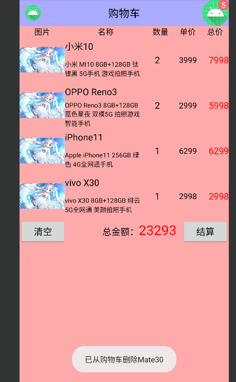


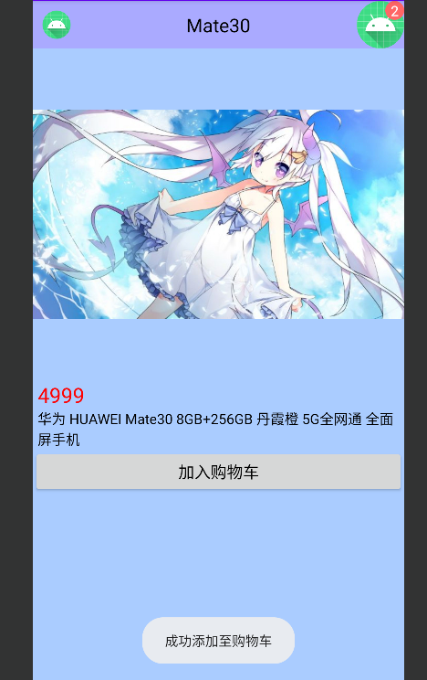


# 内容共享

## 在应用之间共享数据

### 通过ContentProvider封装数据

Android号称提供了4大组件，分别是活动Activity、广播Broadcast、服务Service和内容提供器 ContentProvider。其中内容提供器涵盖与内部数据存取有关的一系列组件，完整的内容组件由内容提供器ContentProvider、内容解析器ContentResolver、内容观察器ContentObserver三部分组成


ContentProvider给App存取内部数据提供了统一的外部接口，让不同的应用之间得以互相共享数据

ContentProvider可操作当前设备其他应用的内部数据，它是一种中间层次的数据存储形式


在实际编码中，ContentProvider只是服务端App存取数据的抽象类，开发者需要在其基础上实现一个完 整的内容提供器，并重写下列数据库管理方法

* onCreate：创建数据库并获得数据库连接
* insert：插入数据
* delete：删除数据
* update：更新数据
* query：查询数据，并返回结果集的游标
* getType：获取内容提供器支持的数据类型


ContentProvider作为中间接口，本身并不直接保存数据， 而是通过SQLiteOpenHelper与SQLiteDatabase间接操作底层的数据库。所以要想使用 ContentProvider，首先得实现SQLite的数据库帮助器，然后由ContentProvider封装对外的接口。以之前的学生信息为例，具体步骤主要分成以下3步


#### 1. 编写数据库帮助器

这个数据库帮助器就是常规的SQLite操作代码


```java
package mao.android_contentprovider.dao;

import android.content.ContentValues;
import android.content.Context;
import android.database.Cursor;
import android.database.sqlite.SQLiteDatabase;
import android.database.sqlite.SQLiteOpenHelper;
import android.util.Log;

import androidx.annotation.Nullable;

import java.io.Serializable;
import java.util.ArrayList;
import java.util.List;

import mao.android_contentprovider.entity.Student;

/**
 * Project name(项目名称)：android_ContentProvider
 * Package(包名): mao.android_contentprovider.dao
 * Class(类名): StudentDao
 * Author(作者）: mao
 * Author QQ：1296193245
 * GitHub：https://github.com/maomao124/
 * Date(创建日期)： 2022/9/30
 * Time(创建时间)： 15:18
 * Version(版本): 1.0
 * Description(描述)： 无
 */

public class StudentDao extends SQLiteOpenHelper
{
    /**
     * 数据库名字
     */
    private static final String DB_NAME = "student.db";

    /**
     * 表名
     */
    private static final String TABLE_NAME = "student";

    /**
     * 数据库版本
     */
    private static final int DB_VERSION = 1;

    /**
     * 实例，单例模式，懒汉式，双重检查锁方式
     */
    private static volatile StudentDao studentDao = null;

    /**
     * 读数据库
     */
    private SQLiteDatabase readDatabase;
    /**
     * 写数据库
     */
    private SQLiteDatabase writeDatabase;

    /**
     * 标签
     */
    private static final String TAG = "StudentDao";


    /**
     * 构造方法
     *
     * @param context 上下文
     */
    public StudentDao(@Nullable Context context)
    {
        super(context, DB_NAME, null, DB_VERSION);
    }

    /**
     * 获得实例
     *
     * @param context 上下文
     * @return {@link StudentDao}
     */
    public static StudentDao getInstance(Context context)
    {
        if (studentDao == null)
        {
            synchronized (StudentDao.class)
            {
                if (studentDao == null)
                {
                    studentDao = new StudentDao(context);
                }
            }
        }
        return studentDao;
    }

    /**
     * 打开读连接
     *
     * @return {@link SQLiteDatabase}
     */
    public SQLiteDatabase openReadConnection()
    {
        if (readDatabase == null || !readDatabase.isOpen())
        {
            readDatabase = studentDao.getReadableDatabase();
        }
        return readDatabase;
    }

    /**
     * 打开写连接
     *
     * @return {@link SQLiteDatabase}
     */
    public SQLiteDatabase openWriteConnection()
    {
        if (writeDatabase == null || !writeDatabase.isOpen())
        {
            writeDatabase = studentDao.getWritableDatabase();
        }
        return readDatabase;
    }

    /**
     * 关闭数据库读连接和写连接
     */
    public void closeConnection()
    {
        if (readDatabase != null && readDatabase.isOpen())
        {
            readDatabase.close();
            readDatabase = null;
        }

        if (writeDatabase != null && writeDatabase.isOpen())
        {
            writeDatabase.close();
            writeDatabase = null;
        }
    }


    @Override
    public void onCreate(SQLiteDatabase db)
    {

        String sql = "CREATE TABLE IF NOT EXISTS " + TABLE_NAME + " (" +
                "id INTEGER PRIMARY KEY AUTOINCREMENT NOT NULL," +
                " name VARCHAR NOT NULL," +
                " age INTEGER NOT NULL," +
                " weight FLOAT NOT NULL)";
        db.execSQL(sql);
    }

    /**
     * 数据库版本更新时触发回调
     *
     * @param db         SQLiteDatabase
     * @param oldVersion 旧版本
     * @param newVersion 新版本
     */
    @Override
    public void onUpgrade(SQLiteDatabase db, int oldVersion, int newVersion)
    {

    }


    /**
     * 查询所有
     *
     * @return {@link List}<{@link Student}>
     */
    public List<Student> queryAll()
    {
        List<Student> list = new ArrayList<>();

        Cursor cursor = readDatabase.query(TABLE_NAME, null, "1=1", new String[]{}, null, null, null);

        while (cursor.moveToNext())
        {
            Student student = new Student();
            setStudent(cursor, student);
            list.add(student);
        }

        cursor.close();
        return list;
    }


    /**
     * 通过id(主键)查询
     *
     * @param id id(主键)
     * @return {@link Student}
     */
    public Student queryById(Serializable id)
    {
        Student student = null;
        Cursor cursor = readDatabase.query(TABLE_NAME, null, "id=?", new String[]{String.valueOf(id)}, null, null, null);
        if (cursor.moveToNext())
        {
            student = new Student();
            setStudent(cursor, student);
        }
        cursor.close();
        return student;
    }


    /**
     * 插入一条数据
     *
     * @param student Student对象
     * @return boolean
     */
    public boolean insert(Student student)
    {
        ContentValues contentValues = new ContentValues();
        setContentValues(student, contentValues);
        long insert = writeDatabase.insert(TABLE_NAME, null, contentValues);
        return insert > 0;
    }

    /**
     * 插入多条数据
     *
     * @param list 列表
     * @return boolean
     */
    public boolean insert(List<Student> list)
    {
        try
        {
            writeDatabase.beginTransaction();
            for (Student student : list)
            {
                boolean insert = this.insert(student);
                if (!insert)
                {
                    throw new Exception();
                }
            }
            writeDatabase.setTransactionSuccessful();
            return true;
        }
        catch (Exception e)
        {
            writeDatabase.endTransaction();
            Log.e(TAG, "insert: ", e);
            return false;
        }
    }

    /**
     * 更新
     *
     * @param student Student对象
     * @return boolean
     */
    public boolean update(Student student)
    {
        ContentValues contentValues = new ContentValues();
        setContentValues(student, contentValues);
        int update = writeDatabase.update(TABLE_NAME, contentValues, "id=?", new String[]{student.getId().toString()});
        return update > 0;
    }

    /**
     * 插入或更新，先尝试插入，如果插入失败，更新
     *
     * @param student Student对象
     * @return boolean
     */
    public boolean insertOrUpdate(Student student)
    {
        boolean insert = insert(student);
        if (insert)
        {
            return true;
        }
        return update(student);
    }

    /**
     * 删除
     *
     * @param id id
     * @return boolean
     */
    public boolean delete(Serializable id)
    {
        int delete = writeDatabase.delete(TABLE_NAME, "id=?", new String[]{String.valueOf(id)});
        return delete > 0;
    }


    /**
     * 填充ContentValues
     *
     * @param student       Student
     * @param contentValues ContentValues
     */
    private void setContentValues(Student student, ContentValues contentValues)
    {
        contentValues.put("id", student.getId());
        contentValues.put("name", student.getName());
        contentValues.put("age", student.getAge());
        contentValues.put("weight", student.getWeight());
    }

    /**
     * 填充Student
     *
     * @param cursor  游标
     * @param student Student对象
     */
    private Student setStudent(Cursor cursor, Student student)
    {
        student.setId(cursor.getLong(0));
        student.setName(cursor.getString(1));
        student.setAge(cursor.getInt(2));
        student.setWeight(cursor.getFloat(3));

        return student;
    }


}
```


#### 2. 编写内容提供器的基础字段类


该类需要实现接口BaseColumns，同时加入几个常量定义


```java
package mao.android_contentprovider.dao;

import android.net.Uri;
import android.provider.BaseColumns;

/**
 * Project name(项目名称)：android_ContentProvider
 * Package(包名): mao.android_contentprovider.dao
 * Class(类名): StudentContent
 * Author(作者）: mao
 * Author QQ：1296193245
 * GitHub：https://github.com/maomao124/
 * Date(创建日期)： 2022/9/30
 * Time(创建时间)： 15:24
 * Version(版本): 1.0
 * Description(描述)： 无
 */

public class StudentContent implements BaseColumns
{
    /**
     * 这里的名称必须与AndroidManifest.xml里的android:authorities保持一致
     */
    public static final String AUTHORITIES = "mao.android_ContentProvider.provider.studentProvider";

    /**
     * 内容提供器的外部表名
     */
    public static final String TABLE_NAME = StudentDao.TABLE_NAME;

    /**
     * 访问内容提供器的URI
     */
    public static final Uri CONTENT_URI = Uri.parse("content://" + AUTHORITIES + "/student");


    //下面是该表的各个字段名称

    /**
     * 学生学号
     */
    public static final String STUDENT_ID = "id";
    /**
     * 学生名字
     */
    public static final String STUDENT_NAME = "name";
    /**
     * 学生年龄
     */
    public static final String STUDENT_AGE = "age";
    /**
     * 学生体重
     */
    public static final String STUDENT_WEIGHT = "weight";

}
```


#### 3. 通过右键菜单创建内容提供器


右击App模块的包名目录，在弹出的右键菜单中依次选择New→Other→Content Provider


创建完成后的类

```java
package mao.android_contentprovider.provider;

import android.content.ContentProvider;
import android.content.ContentValues;
import android.database.Cursor;
import android.net.Uri;

public class StudentProvider extends ContentProvider
{
    public StudentProvider()
    {
    }

    @Override
    public int delete(Uri uri, String selection, String[] selectionArgs)
    {
        // Implement this to handle requests to delete one or more rows.
        throw new UnsupportedOperationException("Not yet implemented");
    }

    @Override
    public String getType(Uri uri)
    {
        // TODO: Implement this to handle requests for the MIME type of the data
        // at the given URI.
        throw new UnsupportedOperationException("Not yet implemented");
    }

    @Override
    public Uri insert(Uri uri, ContentValues values)
    {
        // TODO: Implement this to handle requests to insert a new row.
        throw new UnsupportedOperationException("Not yet implemented");
    }

    @Override
    public boolean onCreate()
    {
        // TODO: Implement this to initialize your content provider on startup.
        return false;
    }

    @Override
    public Cursor query(Uri uri, String[] projection, String selection,
                        String[] selectionArgs, String sortOrder)
    {
        // TODO: Implement this to handle query requests from clients.
        throw new UnsupportedOperationException("Not yet implemented");
    }

    @Override
    public int update(Uri uri, ContentValues values, String selection,
                      String[] selectionArgs)
    {
        // TODO: Implement this to handle requests to update one or more rows.
        throw new UnsupportedOperationException("Not yet implemented");
    }
}
```


会在清单文件里加入一段代码


```xml
<provider
        android:name=".StudentProvider"
        android:authorities="mao.android_ContentProvider.provider.StudentProvider"
        android:enabled="true"
        android:exported="true" />
```


编写代码


```java
package mao.android_contentprovider.provider;

import android.content.ContentProvider;
import android.content.ContentUris;
import android.content.ContentValues;
import android.content.UriMatcher;
import android.database.Cursor;
import android.database.sqlite.SQLiteDatabase;
import android.net.Uri;

import mao.android_contentprovider.dao.StudentContent;
import mao.android_contentprovider.dao.StudentDao;

public class StudentProvider extends ContentProvider
{
    /*
       需要继承ContentProvider
     */

    /**
     * 标签
     */
    private static final String TAG = "StudentProvider";


    private StudentDao studentDao;

    /**
     * Uri匹配时的代号
     */
    public static final int STUDENT_INFO = 1;

    /**
     * uri匹配器
     */
    public static final UriMatcher uriMatcher = new UriMatcher(UriMatcher.NO_MATCH);


    static
    {
        //往Uri匹配器中添加指定的数据路径
        uriMatcher.addURI(StudentContent.AUTHORITIES, StudentContent.path, STUDENT_INFO);
    }


    public StudentProvider()
    {
    }

    @Override
    public int delete(Uri uri, String selection, String[] selectionArgs)
    {
        int count = 0;
        if (uriMatcher.match(uri) == STUDENT_INFO)
        {
            //匹配到了学生信息表
            //获取SQLite数据库的写连接
            SQLiteDatabase writableDatabase = studentDao.getWritableDatabase();
            //执行SQLite的删除操作，并返回删除记录的数目
            count = writableDatabase.delete(StudentContent.TABLE_NAME, selection, selectionArgs);
            // 关闭SQLite数据库连接
            //writableDatabase.close();
        }
        return count;

    }

    @Override
    public String getType(Uri uri)
    {
        // TODO: Implement this to handle requests for the MIME type of the data
        // at the given URI.
        throw new UnsupportedOperationException("Not yet implemented");
    }

    @Override
    public Uri insert(Uri uri, ContentValues values)
    {
        if (uriMatcher.match(uri) == STUDENT_INFO)
        {
            // 匹配到了学生信息表
            // 获取SQLite数据库的写连接
            SQLiteDatabase writableDatabase = studentDao.getWritableDatabase();
            // 向指定的表插入数据，返回记录的行号
            long rowId = writableDatabase.insert(StudentContent.TABLE_NAME, null, values);
            // 判断插入是否执行成功
            if (rowId > 0)
            {
                // 如果添加成功，就利用新记录的行号生成新的地址
                Uri newUri = ContentUris.withAppendedId(StudentContent.CONTENT_URI, rowId);
                //通知监听器，数据已经改变
                getContext().getContentResolver().notifyChange(newUri, null);
            }
            // 关闭SQLite数据库连接
            //writableDatabase.close();
        }
        return uri;
    }

    @Override
    public boolean onCreate()
    {
        studentDao = StudentDao.getInstance(getContext());
        studentDao.openWriteConnection();
        studentDao.openWriteConnection();
        return true;
    }

    @Override
    public Cursor query(Uri uri, String[] projection, String selection,
                        String[] selectionArgs, String sortOrder)
    {
        Cursor cursor = null;
        if (uriMatcher.match(uri) == STUDENT_INFO)
        {
            //匹配到了学生信息表
            //获取SQLite数据库的读连接
            SQLiteDatabase readableDatabase = studentDao.getReadableDatabase();
            //执行SQLite的查询操作
            cursor = readableDatabase.query(StudentContent.TABLE_NAME, projection,
                    selection, selectionArgs, null, null,
                    sortOrder);
            //设置内容解析器的监听
            cursor.setNotificationUri(getContext().getContentResolver(), uri);
        }
        //返回查询结果集的游标
        return cursor;
    }

    @Override
    public int update(Uri uri, ContentValues values, String selection,
                      String[] selectionArgs)
    {
        int count = 0;
        if (uriMatcher.match(uri) == STUDENT_INFO)
        {
            // 匹配到了学生信息表
            // 获取SQLite数据库的写连接
            SQLiteDatabase writableDatabase = studentDao.getWritableDatabase();
            // 向指定的表插入数据，返回记录的行号
            count = writableDatabase.update(StudentContent.TABLE_NAME, values, selection, selectionArgs);
            // 关闭SQLite数据库连接
            //writableDatabase.close();
        }
        return count;
    }
}
```


经过以上3个步骤之后，便完成了服务端App的接口封装工作，接下来再由其他App去访问服务端App的数据


为了方便查看，可以在MainActivity中添加以下代码

```java
package mao.android_contentprovider;

import androidx.appcompat.app.AppCompatActivity;

import android.os.Bundle;
import android.util.Log;

import mao.android_contentprovider.dao.StudentDao;

public class MainActivity extends AppCompatActivity
{

    private StudentDao studentDao;

    private static final String TAG = "MainActivity";

    @Override
    protected void onCreate(Bundle savedInstanceState)
    {
        super.onCreate(savedInstanceState);
        setContentView(R.layout.activity_main);

        studentDao = StudentDao.getInstance(this);
        studentDao.openReadConnection();
        studentDao.openWriteConnection();
        Log.d(TAG, "onCreate: ");

    }

    @Override
    protected void onStart()
    {
        super.onStart();
        Log.d(TAG, "onStart: query:\n" + studentDao.queryAll() + "\n");
    }

    @Override
    protected void onDestroy()
    {
        super.onDestroy();
        Log.d(TAG, "onDestroy: ");
        studentDao.closeConnection();

    }
}
```


### 通过ContentResolver访问数据

如果客户端App想访问对方的内部数据， 就要借助内容解析器ContentResolver。内容解析器是客户端App操作服务端数据的工具，与之对应的内容提供器则是服务端的数据接口。在活动代码中调用getContentResolver方法，即可获取内容解析器的实例

ContentResolver提供的方法与ContentProvider一一对应，比如insert、delete、query、update、 getType等，甚至连方法的参数类型都雷同


查询操作稍微复杂一些，调用query方法会返回游标对象，这个游标正是SQLite的游标Cursor，query方法的输入参数有好几个，具体说明如下：

* uri：Uri类型，指定本次操作的数据表路径
* projection：字符串数组类型，指定将要查询的字段名称列表
* selection：字符串类型，指定查询条件
* selectionArgs：字符串数组类型，指定查询条件中的参数取值列表
* sortOrder：字符串类型，指定排序条件


通过ContentResolver访问数据大致流程如下：


#### 1. 拷贝Provider的实体类和xxxContent


如果访问的系统的Provider，可以不需要实体类和Content，但是需要知道访问内容提供器的URI


#### 2. 编写xxxResolver


```java
package mao.android_contentresolver.resolver;

import android.content.ContentValues;
import android.content.Context;
import android.database.Cursor;
import android.net.Uri;

import java.io.Serializable;
import java.util.ArrayList;
import java.util.List;

import mao.android_contentresolver.dao.StudentContent;
import mao.android_contentresolver.entity.Student;

/**
 * Project name(项目名称)：android_ContentResolver
 * Package(包名): mao.android_contentresolver.resolver
 * Class(类名): StudentResolver
 * Author(作者）: mao
 * Author QQ：1296193245
 * GitHub：https://github.com/maomao124/
 * Date(创建日期)： 2022/9/30
 * Time(创建时间)： 21:20
 * Version(版本): 1.0
 * Description(描述)： 无
 */

public class StudentResolver
{
    /**
     * 上下文
     */
    private Context context;


    /**
     * 构造方法
     *
     * @param context 上下文
     */
    public StudentResolver(Context context)
    {
        this.context = context;
    }

    /**
     * 插入
     *
     * @param student Student对象
     */
    public void insert(Student student)
    {
        ContentValues contentValues = new ContentValues();
        setContentValues(student, contentValues);
        context.getContentResolver().insert(StudentContent.CONTENT_URI, contentValues);
    }

    /**
     * 更新
     *
     * @param student Student对象
     * @return boolean
     */
    public boolean update(Student student)
    {
        ContentValues contentValues = new ContentValues();
        setContentValues(student, contentValues);
        int update = context.getContentResolver().update(StudentContent.CONTENT_URI,
                contentValues, "id=?", new String[]{String.valueOf(student.getId())});
        return update > 0;
    }

    /**
     * 删除
     *
     * @param id id
     * @return boolean
     */
    public boolean delete(Serializable id)
    {
        int delete = context.getContentResolver()
                .delete(StudentContent.CONTENT_URI, "id=?",
                        new String[]{String.valueOf(id)});
        return delete > 0;
    }

    /**
     * 查询所有
     *
     * @return {@link List}<{@link Student}>
     */
    public List<Student> queryAll()
    {

        Cursor cursor = context.getContentResolver().query(StudentContent.CONTENT_URI,
                null, "1=1", null, null);
        List<Student> list = new ArrayList<>();
        while (cursor.moveToNext())
        {
            Student student = setStudent(cursor, new Student());
            list.add(student);
        }
        return list;
    }

    /**
     * 查询
     *
     * @param id id
     * @return {@link Student}
     */
    public Student query(Serializable id)
    {
        Cursor cursor = context.getContentResolver().query(StudentContent.CONTENT_URI,
                null, "id=?", new String[]{String.valueOf(id)}, null);
        if (cursor.moveToNext())
        {
            return setStudent(cursor, new Student());
        }
        return null;
    }


    /**
     * 填充ContentValues
     *
     * @param student       Student
     * @param contentValues ContentValues
     */
    private void setContentValues(Student student, ContentValues contentValues)
    {
        contentValues.put("id", student.getId());
        contentValues.put("name", student.getName());
        contentValues.put("age", student.getAge());
        contentValues.put("weight", student.getWeight());
    }

    /**
     * 填充Student
     *
     * @param cursor  游标
     * @param student Student对象
     */
    private Student setStudent(Cursor cursor, Student student)
    {
        student.setId(cursor.getLong(0));
        student.setName(cursor.getString(1));
        student.setAge(cursor.getInt(2));
        student.setWeight(cursor.getFloat(3));

        return student;
    }
}
```


#### 3. 编写其它代码调用xxxResolver的方法


布局文件


```xml
<?xml version="1.0" encoding="utf-8"?>
<LinearLayout xmlns:android="http://schemas.android.com/apk/res/android"
        xmlns:tools="http://schemas.android.com/tools"
        xmlns:app="http://schemas.android.com/apk/res-auto"
        android:layout_width="match_parent"
        android:layout_height="match_parent"
        tools:context=".MainActivity"
        android:orientation="vertical"
        android:gravity="center">


    <EditText
            android:id="@+id/EditText1"
            android:layout_width="match_parent"
            android:layout_height="wrap_content"
            android:hint="学号"
            android:inputType="number"
            android:maxLength="13" />

    <EditText
            android:id="@+id/EditText2"
            android:layout_width="match_parent"
            android:layout_height="wrap_content"
            android:hint="姓名"
            android:maxLength="5"
            android:inputType="text" />

    <EditText
            android:id="@+id/EditText3"
            android:layout_width="match_parent"
            android:layout_height="wrap_content"
            android:hint="年龄"
            android:maxLength="2" />

    <EditText
            android:id="@+id/EditText4"
            android:layout_width="match_parent"
            android:layout_height="wrap_content"
            android:hint="体重"
            android:inputType="numberDecimal" />

    <Button
            android:id="@+id/Button1"
            android:layout_width="match_parent"
            android:layout_height="wrap_content"
            android:text="添加" />

    <Button
            android:id="@+id/Button2"
            android:layout_width="match_parent"
            android:layout_height="wrap_content"
            android:text="修改" />

    <Button
            android:id="@+id/Button3"
            android:layout_width="match_parent"
            android:layout_height="wrap_content"
            android:text="删除" />

    <Button
            android:id="@+id/Button4"
            android:layout_width="match_parent"
            android:layout_height="wrap_content"
            android:text="查询" />

    <Button
            android:id="@+id/Button5"
            android:layout_width="match_parent"
            android:layout_height="wrap_content"
            android:text="查询所有" />

    <ScrollView
            android:layout_width="match_parent"
            android:layout_height="wrap_content">

        <TextView
                android:id="@+id/TextView1"
                android:layout_width="match_parent"
                android:layout_height="wrap_content" />
    </ScrollView>

</LinearLayout>
```


MainActivity

```java
package mao.android_contentresolver;

import androidx.appcompat.app.AppCompatActivity;

import android.annotation.SuppressLint;
import android.app.AlertDialog;
import android.content.DialogInterface;
import android.os.Bundle;
import android.util.Log;
import android.view.View;
import android.widget.EditText;
import android.widget.TextView;
import android.widget.Toast;

import java.util.List;

import mao.android_contentresolver.entity.Student;
import mao.android_contentresolver.resolver.StudentResolver;

public class MainActivity extends AppCompatActivity
{

    private StudentResolver studentResolver;
    private TextView textView;
    private EditText editText1;
    private EditText editText2;
    private EditText editText3;
    private EditText editText4;

    /**
     * 标签
     */
    private static final String TAG = "MainActivity";

    @Override
    protected void onCreate(Bundle savedInstanceState)
    {
        super.onCreate(savedInstanceState);
        setContentView(R.layout.activity_main);

        studentResolver = new StudentResolver(this);

        textView = findViewById(R.id.TextView1);

        editText1 = findViewById(R.id.EditText1);
        editText2 = findViewById(R.id.EditText2);
        editText3 = findViewById(R.id.EditText3);
        editText4 = findViewById(R.id.EditText4);


        findViewById(R.id.Button1).setOnClickListener(new View.OnClickListener()
        {
            @Override
            public void onClick(View v)
            {
                insert();
            }
        });

        findViewById(R.id.Button2).setOnClickListener(new View.OnClickListener()
        {
            @Override
            public void onClick(View v)
            {
                update();
            }
        });

        findViewById(R.id.Button3).setOnClickListener(new View.OnClickListener()
        {
            @Override
            public void onClick(View v)
            {
                delete();
            }
        });

        findViewById(R.id.Button4).setOnClickListener(new View.OnClickListener()
        {
            @Override
            public void onClick(View v)
            {
                query();
            }
        });

        findViewById(R.id.Button5).setOnClickListener(new View.OnClickListener()
        {
            @Override
            public void onClick(View v)
            {
                queryAll();
            }
        });

    }

    /**
     * 插入
     */
    private void insert()
    {
        try
        {
            Long id = Long.valueOf(editText1.getText().toString());
            String name = editText2.getText().toString();
            int age = Integer.parseInt(editText3.getText().toString());
            float weight = Float.parseFloat(editText4.getText().toString());

            Student student = new Student(id, name, age, weight);
            studentResolver.insert(student);
            toastShow("已尝试插入");
        }
        catch (Exception e)
        {
            Log.e(TAG, "insert: ", e);
            toastShow("异常：" + e.getMessage());
        }
    }


    /**
     * 更新
     */
    private void update()
    {
        try
        {
            Long id = Long.valueOf(editText1.getText().toString());
            String name = editText2.getText().toString();
            int age = Integer.parseInt(editText3.getText().toString());
            float weight = Float.parseFloat(editText4.getText().toString());

            Student student = studentResolver.query(id);
            if (student == null)
            {
                throw new Exception("未查询到学号为" + id + "的信息");
            }
            student.setName(name);
            student.setAge(age);
            student.setWeight(weight);
            boolean update = studentResolver.update(student);
            if (!update)
            {
                throw new Exception("更新失败");
            }
            toastShow("更新成功");
        }
        catch (Exception e)
        {
            Log.e(TAG, "update: ", e);
            toastShow("异常：" + e.getMessage());
        }
    }

    /**
     * 删除
     */
    private void delete()
    {
        try
        {
            if (editText1.getText().toString().equals(""))
            {
                toastShow("学号为空");
                return;
            }
            long id = Long.parseLong(editText1.getText().toString());

            AlertDialog.Builder builder = new AlertDialog.Builder(this);
            builder.setTitle("删除确认")
                    .setMessage("是否删除学号为" + id + "的信息？")
                    .setPositiveButton("确认", new DialogInterface.OnClickListener()
                    {
                        @Override
                        public void onClick(DialogInterface dialog, int which)
                        {
                            boolean delete = studentResolver.delete(id);
                            if (!delete)
                            {
                                toastShow("删除失败");
                                return;
                            }
                            toastShow("删除成功");
                        }
                    })
                    .setNegativeButton("取消", null)
                    .create()
                    .show();

        }
        catch (Exception e)
        {
            Log.e(TAG, "delete: ", e);
            toastShow("异常：" + e.getMessage());
        }
    }

    /**
     * 查询
     */
    private void query()
    {
        try
        {
            if (editText1.getText().toString().equals(""))
            {
                toastShow("学号为空");
                return;
            }
            long id = Long.parseLong(editText1.getText().toString());

            Student student = studentResolver.query(id);
            if (student == null)
            {
                toastShow("查询不到学号为" + id + "的信息");
                editText1.setText("");
                editText2.setText("");
                editText3.setText("");
                editText4.setText("");
                return;
            }
            editText1.setText(String.valueOf(id));
            editText2.setText(student.getName());
            editText3.setText(String.valueOf(student.getAge()));
            editText4.setText(String.valueOf(student.getWeight()));
            toastShow("查询成功");
        }
        catch (Exception e)
        {
            Log.e(TAG, "query: ", e);
            toastShow("异常：" + e.getMessage());
        }
    }

    /**
     * 查询所有
     */
    @SuppressLint("SetTextI18n")
    private void queryAll()
    {
        try
        {
            textView.setText("");
            List<Student> studentList = studentResolver.queryAll();
            for (Student student : studentList)
            {
                textView.setText(textView.getText() + "\n\n" + student.toString());
            }
            toastShow("查询到" + studentList.size() + "条数据");
        }
        catch (Exception e)
        {
            Log.e(TAG, "queryAll: ", e);
            toastShow("异常：" + e.getMessage());
        }
    }

    /**
     * 显示消息
     *
     * @param message 消息
     */
    private void toastShow(String message)
    {
        Toast.makeText(this, message, Toast.LENGTH_SHORT).show();
    }
}
```


### 测试访问


运行resolver应用，Provider应用要保持在后台运行


插入数据


回到Provider应用，进入，触发onstart方法


查看日志


插入成功


测试查询全部


测试根据学号查询


查询学号为2的学生信息


查询学号为12的学生信息


测试修改，将学号为12的年龄更新为21，体重更改为30.2


查询所有


进入Provider应用，查看日志


测试删除


查询所有


进入Provider应用，查看日志


## 运行时动态申请权限

从Android 7.0开始，系统仍然默认禁止App访问公共空间，必须到设置界面手动开启应用的存储卡权限才行。尽管此举是为用户隐私着想，可是用户咋知道要手工开权限呢？就算用户知道，去设置界面找到权限开关也颇费周折。为此Android支持在Java代码中处理权限，处理过程分为3个步骤：


### 检查App是否开启了指定权限

权限检查需要调用ContextCompat的checkSelfPermission方法，该方法的第一个参数为活动实例，第 二个参数为待检查的权限名称，例如存储卡的写权限名为 Manifest.permission.WRITE_EXTERNAL_STORAGE。注意checkSelfPermission方法的返回值，当它为PackageManager.PERMISSION_GRANTED时表示已经授权，否则就是未获授权


### 请求系统弹窗，以便用户选择是否开启权限

一旦发现某个权限尚未开启，就得弹窗提示用户手工开启，这个弹窗不是开发者自己写的提醒对话框， 而是系统专门用于权限申请的对话框。调用ActivityCompat的requestPermissions方法，即可命令系统自动弹出权限申请窗口，该方法的第一个参数为活动实例，第二个参数为待申请的权限名称数组，第三个参数为本次操作的请求代码


###  判断用户的权限选择结果

然而上面第二步的requestPermissions方法没有返回值，那怎么判断用户到底选了开启权限还是拒绝权 限呢？其实活动页面提供了权限选择的回调方法onRequestPermissionsResult，如果当前页面请求弹出权限申请窗口，那么该页面的Java代码必须重写onRequestPermissionsResult方法，并在该方法内部处理用户的权限选择结果


具体到编码实现上，前两步的权限校验和请求弹窗可以合并到一块，先调用checkSelfPermission方法检查某个权限是否已经开启，如果没有开启再调用requestPermissions方法请求系统弹窗。


```java
/**
 * 检查某个权限
 *
 * @param act         Activity对象
 * @param permission  许可
 * @param requestCode 请求代码
 * @return boolean 返回true表示已启用该权限，返回false表示未启用该权限
 */
public static boolean checkPermission(Activity act, String permission, int requestCode)
{
    return checkPermission(act, new String[]{permission}, requestCode);
}


/**
 * 检查多个权限
 *
 * @param act         Activity对象
 * @param permissions 权限
 * @param requestCode 请求代码
 * @return boolean 返回true表示已完全启用权限，返回false表示未完全启用权限
 */
@SuppressWarnings("all")
public static boolean checkPermission(Activity act, String[] permissions, int requestCode)
{
    boolean result = true;
    if (Build.VERSION.SDK_INT >= Build.VERSION_CODES.M)
    {
        int check = PackageManager.PERMISSION_GRANTED;
        //通过权限数组检查是否都开启了这些权限
        for (String permission : permissions)
        {
            check = ContextCompat.checkSelfPermission(act, permission);
            if (check != PackageManager.PERMISSION_GRANTED)
            {
                //有个权限没有开启，就跳出循环
                break;
            }
        }
        if (check != PackageManager.PERMISSION_GRANTED)
        {
            //未开启该权限，则请求系统弹窗，好让用户选择是否立即开启权限
            ActivityCompat.requestPermissions(act, permissions, requestCode);
            result = false;
        }
    }
    return result;
}
```


注意到上面代码有判断安卓版本号，只有系统版本大于Android 6.0（版本代号为M），才执行后续的权 限校验操作。这是因为从Android 6.0开始引入了运行时权限机制，在Android 6.0之前，只要App在 AndroidManifest.xml中添加了权限配置，则系统会自动给App开启相关权限；但在Android 6.0之后， 即便事先添加了权限配置，系统也不会自动开启权限，而要开发者在App运行时判断权限的开关情况， 再据此动态申请未获授权的权限


回到活动页面代码，一方面增加权限校验入口，比如点击某个按钮后触发权限检查操作，其中 Manifest.permission.WRITE_EXTERNAL_STORAGE表示存储卡权限


```java
findViewById(R.id.Button1).setOnClickListener(new View.OnClickListener()
{
    @Override
    public void onClick(View v)
    {
        if (checkPermission(MainActivity.this, Manifest.permission.WRITE_EXTERNAL_STORAGE,
                R.id.Button1 % 65536))
        {
            startActivity(new Intent(MainActivity.this, MainActivity2.class));
        }
    }
});
```


另一方面还要重写活动的onRequestPermissionsResult方法，在方法内部校验用户的选择结果，若用户同意授权，就执行后续业务；若用户拒绝授权，只能提示用户无法开展后续业务了


全部代码

```java
package mao.android_dynamic_application_permission;

import androidx.annotation.NonNull;
import androidx.appcompat.app.AppCompatActivity;
import androidx.core.app.ActivityCompat;
import androidx.core.content.ContextCompat;

import android.Manifest;
import android.app.Activity;
import android.content.Intent;
import android.content.pm.PackageManager;
import android.os.Build;
import android.os.Bundle;
import android.view.View;
import android.widget.Toast;

public class MainActivity extends AppCompatActivity
{

    @Override
    protected void onCreate(Bundle savedInstanceState)
    {
        super.onCreate(savedInstanceState);
        setContentView(R.layout.activity_main);

        findViewById(R.id.Button1).setOnClickListener(new View.OnClickListener()
        {
            @Override
            public void onClick(View v)
            {
                save(R.id.Button1);
            }
        });

        findViewById(R.id.Button2).setOnClickListener(new View.OnClickListener()
        {
            @Override
            public void onClick(View v)
            {
                camera(R.id.Button2);
            }
        });
    }

    /**
     * 保存
     *
     * @param requestCode 请求代码 ,可以是组件的id
     */
    public void save(int requestCode)
    {
        if (checkPermission(MainActivity.this, Manifest.permission.WRITE_EXTERNAL_STORAGE,
                requestCode % 65536))
        {
            //成功获取到权限
            startActivity(new Intent(MainActivity.this, MainActivity2.class));
        }
    }

    /**
     * 相机
     *
     * @param requestCode 请求代码
     */
    public void camera(int requestCode)
    {
        if (checkPermission(MainActivity.this, Manifest.permission.CAMERA,
                requestCode % 65536))
        {
            //成功获取到权限
            startActivity(new Intent(MainActivity.this, MainActivity3.class));
        }
    }


    @Override
    public void onRequestPermissionsResult(int requestCode, @NonNull String[] permissions, @NonNull int[] grantResults)
    {
        super.onRequestPermissionsResult(requestCode, permissions, grantResults);

        // requestCode不能为负数，也不能大于2的16次方即65536
        if (requestCode == R.id.Button1 % 65536)
        {
            if (checkGrant(grantResults))
            {
                //用户选择了同意授权
                startActivity(new Intent(this, MainActivity2.class));
            }
            else
            {
                toastShow("没有权限");
            }
        }
        else if (requestCode == R.id.Button2 % 65536)
        {
            if (checkGrant(grantResults))
            {
                //用户选择了同意授权
                startActivity(new Intent(this, MainActivity3.class));
            }
            else
            {
                toastShow("没有权限");
            }
        }
    }


    /**
     * 检查权限结果数组，
     *
     * @param grantResults 授予相应权限的结果是PackageManager.PERMISSION_GRANTED
     *                     或PackageManager.PERMISSION_DENIED
     *                     从不为空
     * @return boolean 返回true表示都已经获得授权 返回false表示至少有一个未获得授权
     */
    public static boolean checkGrant(int[] grantResults)
    {
        boolean result = true;
        if (grantResults != null)
        {
            for (int grant : grantResults)
            {
                //遍历权限结果数组中的每条选择结果
                if (grant != PackageManager.PERMISSION_GRANTED)
                {
                    //未获得授权，返回false
                    result = false;
                    break;
                }
            }
        }
        else
        {
            result = false;
        }
        return result;
    }


    /**
     * 检查某个权限
     *
     * @param act         Activity对象
     * @param permission  许可
     * @param requestCode 请求代码
     * @return boolean 返回true表示已启用该权限，返回false表示未启用该权限
     */
    public static boolean checkPermission(Activity act, String permission, int requestCode)
    {
        return checkPermission(act, new String[]{permission}, requestCode);
    }


    /**
     * 检查多个权限
     *
     * @param act         Activity对象
     * @param permissions 权限
     * @param requestCode 请求代码
     * @return boolean 返回true表示已完全启用权限，返回false表示未完全启用权限
     */
    @SuppressWarnings("all")
    public static boolean checkPermission(Activity act, String[] permissions, int requestCode)
    {
        boolean result = true;
        if (Build.VERSION.SDK_INT >= Build.VERSION_CODES.M)
        {
            int check = PackageManager.PERMISSION_GRANTED;
            //通过权限数组检查是否都开启了这些权限
            for (String permission : permissions)
            {
                check = ContextCompat.checkSelfPermission(act, permission);
                if (check != PackageManager.PERMISSION_GRANTED)
                {
                    //有个权限没有开启，就跳出循环
                    break;
                }
            }
            if (check != PackageManager.PERMISSION_GRANTED)
            {
                //未开启该权限，则请求系统弹窗，好让用户选择是否立即开启权限
                ActivityCompat.requestPermissions(act, permissions, requestCode);
                result = false;
            }
        }
        return result;
    }

    /**
     * 显示消息
     *
     * @param message 消息
     */
    private void toastShow(String message)
    {
        Toast.makeText(this, message, Toast.LENGTH_SHORT).show();
    }

}
```


在Android 10系统中，即使授权通过，App仍然无法访问公共空间，这是因为Android10默认开启沙箱模 式，不允许直接使用公共空间的文件路径，此时要修改AndroidManifest.xml，给application节点添加如下的requestLegacyExternalStorage属性：

```xml
android:requestLegacyExternalStorage="true"
```


从Android 11开始，为了让应用升级时也能正常访问公共空间，还得修改AndroidManifest.xml，给 application节点添加如下的preserveLegacyExternalStorage属性，表示暂时关闭沙箱模式：

```xml
android:preserveLegacyExternalStorage="true"
```


除了存储卡的读写权限，还有部分权限也要求运行时动态申请


主清单文件

```xml
<?xml version="1.0" encoding="utf-8"?>
<manifest xmlns:android="http://schemas.android.com/apk/res/android"
        xmlns:tools="http://schemas.android.com/tools"
        package="mao.android_dynamic_application_permission">

    <uses-permission android:name="android.permission.WRITE_EXTERNAL_STORAGE" />
    <uses-permission android:name="android.permission.READ_EXTERNAL_STORAG" />
    <uses-permission android:name="android.permission.CAMERA" />

    <application
            android:allowBackup="true"
            android:dataExtractionRules="@xml/data_extraction_rules"
            android:fullBackupContent="@xml/backup_rules"
            android:requestLegacyExternalStorage="true"
            android:icon="@mipmap/ic_launcher"
            android:label="@string/app_name"
            android:roundIcon="@mipmap/ic_launcher_round"
            android:supportsRtl="true"
            android:theme="@style/Theme.Android_dynamic_application_permission"
            tools:targetApi="31">
        <activity
                android:name=".MainActivity3"
                android:exported="false" />
        <activity
                android:name=".MainActivity2"
                android:exported="false" />
        <activity
                android:name=".MainActivity"
                android:exported="true">
            <intent-filter>
                <action android:name="android.intent.action.MAIN" />

                <category android:name="android.intent.category.LAUNCHER" />
            </intent-filter>
        </activity>
    </application>

</manifest>
```


## 使用内容组件获取信息

### 利用ContentResolver读写联系人

在实际开发中，普通App很少会开放数据接口给其他应用访问，作为服务端接口的ContentProvider基本 用不到。内容组件能够派上用场的情况，往往是App想要访问系统应用的通讯数据，比如查看联系人、 短信、通话记录，以及对这些通讯数据进行增、删、改、查


访问系统的通讯数据之前，得先在AndroidManifest.xml添加相应的权限配置，常见的通讯权限配置主要有下面几个：

```xml
<!-- 联系人/通讯录。包括读联系人、写联系人 -->
<uses-permission android:name="android.permission.READ_CONTACTS" />
<uses-permission android:name="android.permission.WRITE_CONTACTS" />
<!-- 短信。包括发送短信、接收短信、读短信-->
<uses-permission android:name="android.permission.SEND_SMS" />
<uses-permission android:name="android.permission.RECEIVE_SMS" />
<uses-permission android:name="android.permission.READ_SMS" />
<!-- 通话记录。包括读通话记录、写通话记录 -->
<uses-permission android:name="android.permission.READ_CALL_LOG" />
<uses-permission android:name="android.permission.WRITE_CALL_LOG" />
```


从Android 6.0开始，上述的通讯权限默认是关闭的，必须在运行App的时候动态申请相关权限

尽管系统允许App通过内容解析器修改联系人列表，但操作过程比较烦琐，因为一个联系人可能有多个 电话号码，还可能有多个邮箱，所以系统通讯录将其设计为3张表，分别是联系人基本信息表、联系号码 表、联系邮箱表，于是每添加一位联系人，就要调用至少三次insert方法。


raw_contacts 表：


data表：

记录了用户的通讯录所有数据，包括手机号，显示名称等，但是里面的mimetype_id表示不同的数据类 型，这与表mimetypes表中的id相对应，raw_contact_id 与下面的 raw_contacts表中的 id 相对应


mimetypes表：


部分代码

```java
/**
 * 往通讯录里插入数据
 *
 * @param requestCode 请求代码
 */
public void insert(int requestCode)
{
    if (checkPermission(MainActivity.this, Manifest.permission.WRITE_CONTACTS,
            requestCode % 65536))
    {
        //成功获取到权限
        insert();
    }
}

/**
 * 插入联系人
 */
private void insert()
{
    try
    {
        String name = editText1.getText().toString();
        String phone = editText2.getText().toString();
        String email = editText3.getText().toString();

        if (name.equals(""))
        {
            toastShow("请输入联系人姓名");
            return;
        }
        if (phone.equals(""))
        {
            toastShow("请输入联系人手机号码");
            return;
        }
        //电子邮箱可以为空
        /*
        if (email.equals(""))
        {
            toastShow("请输入联系人电子邮箱");
            return;
        }*/

        Contact contact = new Contact(name, phone, email);
        //addContacts(getContentResolver(), contact);
        addFullContacts(getContentResolver(), contact);
        toastShow("已尝试插入");
    }
    catch (Exception e)
    {
        Log.e(TAG, "insert: ", e);
        toastShow("异常：" + e.getMessage());
    }
}

/**
 * 往手机通讯录一次性添加一个联系人信息（包括主记录、姓名、电话号码、电子邮箱）
 * 有事务，推荐。要么全部成功，要么全部失败
 *
 * @param resolver 解析器
 * @param contact  联系
 */
private void addFullContacts(ContentResolver resolver, Contact contact)
{
    //创建一个插入联系人主记录的内容操作器
    ContentProviderOperation op_main = ContentProviderOperation
            .newInsert(ContactsContract.RawContacts.CONTENT_URI)
            .withValue(ContactsContract.RawContacts.ACCOUNT_NAME, null)
            .build();

    // 创建一个插入联系人姓名记录的内容操作器
    ContentProviderOperation op_name = ContentProviderOperation
            .newInsert(ContactsContract.Data.CONTENT_URI)
            // 将第0个操作的id，即 raw_contacts 的 id 作为 data 表中的 raw_contact_id
            .withValueBackReference(ContactsContract.Contacts.Data.RAW_CONTACT_ID, 0)
            .withValue(ContactsContract.Contacts.Data.MIMETYPE,
                    ContactsContract.CommonDataKinds.StructuredName.CONTENT_ITEM_TYPE)
            .withValue(ContactsContract.Contacts.Data.DATA2, contact.getName())
            .build();

    // 创建一个插入联系人电话号码记录的内容操作器
    ContentProviderOperation op_phone = ContentProviderOperation
            .newInsert(ContactsContract.Data.CONTENT_URI)
            // 将第0个操作的id，即 raw_contacts 的 id 作为 data 表中的 raw_contact_id
            .withValueBackReference(ContactsContract.Contacts.Data.RAW_CONTACT_ID, 0)
            .withValue(ContactsContract.Contacts.Data.MIMETYPE,
                    ContactsContract.CommonDataKinds.Phone.CONTENT_ITEM_TYPE)
            .withValue(ContactsContract.Contacts.Data.DATA1, contact.getPhone())
            .withValue(ContactsContract.Contacts.Data.DATA2,
                    ContactsContract.CommonDataKinds.Phone.TYPE_MOBILE)
            .build();

    // 创建一个插入联系人电子邮箱记录的内容操作器
    ContentProviderOperation op_email = ContentProviderOperation
            .newInsert(ContactsContract.Data.CONTENT_URI)
            // 将第0个操作的id，即 raw_contacts 的 id 作为 data 表中的 raw_contact_id
            .withValueBackReference(ContactsContract.Contacts.Data.RAW_CONTACT_ID, 0)
            .withValue(ContactsContract.Contacts.Data.MIMETYPE,
                    ContactsContract.CommonDataKinds.Email.CONTENT_ITEM_TYPE)
            .withValue(ContactsContract.Contacts.Data.DATA1, contact.getEmail())
            .withValue(ContactsContract.Contacts.Data.DATA2,
                    ContactsContract.CommonDataKinds.Email.TYPE_WORK)
            .build();

    // 声明一个内容操作器的列表，并将上面四个操作器添加到该列表中
    ArrayList<ContentProviderOperation> operations = new ArrayList<>();
    operations.add(op_main);
    operations.add(op_name);
    operations.add(op_phone);
    operations.add(op_email);

    try
    {
        // 批量提交四个操作
        resolver.applyBatch(ContactsContract.AUTHORITY, operations);
    }
    catch (OperationApplicationException | RemoteException e)
    {
        Log.e(TAG, "addFullContacts: ", e);
    }
}


/**
 * 往手机通讯录添加一个联系人信息（包括姓名、电话号码、电子邮箱）
 *
 * @param resolver 解析器
 * @param contact  Contact对象
 */
public static void addContacts(ContentResolver resolver, Contact contact)
{
    // 构建一个指向系统联系人提供器的Uri对象
    Uri raw_uri = Uri.parse("content://com.android.contacts/raw_contacts");
    // 创建新的配对
    ContentValues values = new ContentValues();
    // 往 raw_contacts 添加联系人记录，并获取添加后的联系人编号
    long contactId = ContentUris.parseId(resolver.insert(raw_uri, values));
    // 构建一个指向系统联系人数据的Uri对象
    Uri uri = Uri.parse("content://com.android.contacts/data");
    // 创建新的配对
    ContentValues name = new ContentValues();
    // 往配对添加联系人编号
    name.put("raw_contact_id", contactId);
    // 往配对添加“姓名”的数据类型
    name.put("mimetype", "vnd.android.cursor.item/name");
    // 往配对添加联系人的姓名
    name.put("data2", contact.getName());
    // 往提供器添加联系人的姓名记录
    resolver.insert(uri, name);
    // 创建新的配对
    ContentValues phone = new ContentValues();
    // 往配对添加联系人编号
    phone.put("raw_contact_id", contactId);
    // 往配对添加“电话号码”的数据类型
    phone.put("mimetype", "vnd.android.cursor.item/phone_v2");
    // 往配对添加联系人的电话号码
    phone.put("data1", contact.getPhone());
    // 联系类型。1表示家庭，2表示工作
    phone.put("data2", "2");
    // 往提供器添加联系人的号码记录
    resolver.insert(uri, phone);
    // 创建新的配对
    ContentValues email = new ContentValues();
    // 往配对添加联系人编号
    email.put("raw_contact_id", contactId);
    // 往配对添加“电子邮箱”的数据类型
    email.put("mimetype", "vnd.android.cursor.item/email_v2");
    // 往配对添加联系人的电子邮箱
    email.put("data1", contact.getEmail());
    // 联系类型。1表示家庭，2表示工作
    email.put("data2", "2");
    // 往提供器添加联系人的邮箱记录
    resolver.insert(uri, email);
}
```


同理，联系人读取代码也分成3个步骤，先查出联系人的基本信息，再依次查询联系人号码和联系人邮箱


部分源码

```java
/**
 * 读取手机联系人
 *
 * @param resolver 解析器
 * @return {@link List}<{@link Contact}>
 */
@SuppressLint("Range")
private List<Contact> readPhoneContacts(ContentResolver resolver)
{
    List<Contact> list = new ArrayList<>();
    // 先查询 raw_contacts 表，在根据 raw_contacts_id 去查询 data 表
    Cursor cursor = resolver.query(ContactsContract.RawContacts.CONTENT_URI,
            new String[]{ContactsContract.RawContacts._ID},
            null, null, null, null);
    while (cursor.moveToNext())
    {
        int rawContactId = cursor.getInt(0);
        Uri uri = Uri.parse("content://com.android.contacts/contacts/" + rawContactId + "/data");
        Cursor dataCursor = resolver.query(uri,
                new String[]{ContactsContract.Contacts.Data.MIMETYPE,
                        ContactsContract.Contacts.Data.DATA1,
                        ContactsContract.Contacts.Data.DATA2},
                null, null, null);
        Contact contact = new Contact();
        while (dataCursor.moveToNext())
        {
            String data1 = dataCursor.getString(dataCursor.getColumnIndex(ContactsContract.Contacts.Data.DATA1));
            String mimeType = dataCursor.getString(dataCursor.getColumnIndex(ContactsContract.Contacts.Data.MIMETYPE));
            switch (mimeType)
            {
                //是姓名
                case ContactsContract.CommonDataKinds.StructuredName.CONTENT_ITEM_TYPE:
                    contact.setName(data1);
                    break;

                //邮箱
                case ContactsContract.CommonDataKinds.Email.CONTENT_ITEM_TYPE:
                    contact.setEmail(data1);
                    break;

                //手机
                case ContactsContract.CommonDataKinds.Phone.CONTENT_ITEM_TYPE:
                    contact.setPhone(data1);
                    break;
            }
        }

        dataCursor.close();

        // RawContacts 表中出现的 _id，不一定在 Data 表中都会有对应记录
        if (contact.getName() != null)
        {
            Log.d(TAG, "readPhoneContacts: \n" + contact + "\n");
            list.add(contact);
        }
    }
    cursor.close();
    return list;
}
```


#### 布局文件

```xml
<?xml version="1.0" encoding="utf-8"?>
<LinearLayout xmlns:android="http://schemas.android.com/apk/res/android"
        xmlns:tools="http://schemas.android.com/tools"
        xmlns:app="http://schemas.android.com/apk/res-auto"
        android:layout_width="match_parent"
        android:layout_height="match_parent"
        tools:context=".MainActivity"
        android:orientation="vertical"
        android:gravity="center">

    <EditText
            android:id="@+id/EditText1"
            android:layout_width="match_parent"
            android:layout_height="wrap_content"
            android:hint="联系人姓名" />

    <EditText
            android:id="@+id/EditText2"
            android:layout_width="match_parent"
            android:layout_height="wrap_content"
            android:inputType="number"
            android:maxLength="11"
            android:hint="联系人号码" />

    <EditText
            android:id="@+id/EditText3"
            android:layout_width="match_parent"
            android:layout_height="wrap_content"
            android:inputType="textEmailAddress"
            android:hint="联系人邮箱" />

    <Button
            android:id="@+id/Button1"
            android:layout_width="match_parent"
            android:layout_height="wrap_content"
            android:text="添加联系人" />

    <Button
            android:id="@+id/Button2"
            android:layout_width="match_parent"
            android:layout_height="wrap_content"
            android:text="查询所有联系人" />


    <ScrollView
            android:layout_width="match_parent"
            android:layout_height="wrap_content">

        <TextView
                android:id="@+id/result"
                android:layout_width="match_parent"
                android:layout_height="wrap_content" />


    </ScrollView>

</LinearLayout>
```


#### 实体类

```java
package mao.android_read_and_write_contacts_with_contentresolver.entity;

/**
 * Project name(项目名称)：android_read_and_write_contacts_with_ContentResolver
 * Package(包名): mao.android_read_and_write_contacts_with_contentresolver.entity
 * Class(类名): Contact
 * Author(作者）: mao
 * Author QQ：1296193245
 * GitHub：https://github.com/maomao124/
 * Date(创建日期)： 2022/10/1
 * Time(创建时间)： 14:11
 * Version(版本): 1.0
 * Description(描述)： 联系人实体类
 */

public class Contact
{
    /**
     * 名字
     */
    private String name;
    /**
     * 电话
     */
    private String phone;
    /**
     * 电子邮件
     */
    private String email;

    /**
     * Instantiates a new Contact.
     */
    public Contact()
    {
    }

    /**
     * Instantiates a new Contact.
     *
     * @param name  the name
     * @param phone the phone
     * @param email the email
     */
    public Contact(String name, String phone, String email)
    {
        this.name = name;
        this.phone = phone;
        this.email = email;
    }

    /**
     * Gets name.
     *
     * @return the name
     */
    public String getName()
    {
        return name;
    }

    /**
     * Sets name.
     *
     * @param name the name
     * @return the name
     */
    public Contact setName(String name)
    {
        this.name = name;
        return this;
    }

    /**
     * Gets phone.
     *
     * @return the phone
     */
    public String getPhone()
    {
        return phone;
    }

    /**
     * Sets phone.
     *
     * @param phone the phone
     * @return the phone
     */
    public Contact setPhone(String phone)
    {
        this.phone = phone;
        return this;
    }

    /**
     * Gets email.
     *
     * @return the email
     */
    public String getEmail()
    {
        return email;
    }

    /**
     * Sets email.
     *
     * @param email the email
     * @return the email
     */
    public Contact setEmail(String email)
    {
        this.email = email;
        return this;
    }

    @Override
    @SuppressWarnings("all")
    public String toString()
    {
        final StringBuilder stringbuilder = new StringBuilder();
        stringbuilder.append("name：").append(name).append('\n');
        stringbuilder.append("phone：").append(phone).append('\n');
        stringbuilder.append("email：").append(email).append("\n\n");
        return stringbuilder.toString();
    }
}
```


#### MainActivity

```java
package mao.android_read_and_write_contacts_with_contentresolver;

import androidx.annotation.NonNull;
import androidx.appcompat.app.AppCompatActivity;
import androidx.core.app.ActivityCompat;
import androidx.core.content.ContextCompat;

import android.Manifest;
import android.annotation.SuppressLint;
import android.app.Activity;
import android.content.ContentProviderOperation;
import android.content.ContentResolver;
import android.content.ContentUris;
import android.content.ContentValues;
import android.content.OperationApplicationException;
import android.content.pm.PackageManager;
import android.database.Cursor;
import android.net.Uri;
import android.os.Build;
import android.os.Bundle;
import android.os.RemoteException;
import android.provider.ContactsContract;
import android.util.Log;
import android.view.View;
import android.widget.EditText;
import android.widget.TextView;
import android.widget.Toast;

import java.util.ArrayList;
import java.util.List;

import mao.android_read_and_write_contacts_with_contentresolver.entity.Contact;


/**
 * Class(类名): MainActivity
 * Author(作者）: mao
 * Author QQ：1296193245
 * GitHub：https://github.com/maomao124/
 * Date(创建日期)： 2022/10/1
 * Time(创建时间)： 14:38
 * Version(版本): 1.0
 * Description(描述)： 无
 */

public class MainActivity extends AppCompatActivity
{

    private EditText editText1;
    private EditText editText2;
    private EditText editText3;
    private TextView result;

    /**
     * 标签
     */
    private static final String TAG = "MainActivity";


    @Override
    protected void onCreate(Bundle savedInstanceState)
    {
        super.onCreate(savedInstanceState);
        setContentView(R.layout.activity_main);

        editText1 = findViewById(R.id.EditText1);
        editText2 = findViewById(R.id.EditText2);
        editText3 = findViewById(R.id.EditText3);
        result = findViewById(R.id.result);

        findViewById(R.id.Button1).setOnClickListener(new View.OnClickListener()
        {
            @Override
            public void onClick(View v)
            {
                insert(R.id.Button1);
            }
        });
        findViewById(R.id.Button2).setOnClickListener(new View.OnClickListener()
        {
            @Override
            public void onClick(View v)
            {
                queryAll(R.id.Button2);
            }
        });
    }


    /**
     * 查询所有
     *
     * @param requestCode 请求代码
     */
    private void queryAll(int requestCode)
    {
        if (checkPermission(MainActivity.this, Manifest.permission.READ_CONTACTS,
                requestCode % 65536))
        {
            //成功获取到权限
            queryAll();
        }
    }

    /**
     * 查询所有
     */
    private void queryAll()
    {
        List<Contact> list = readPhoneContacts(getContentResolver());
        StringBuilder stringBuilder = new StringBuilder();
        list.forEach(stringBuilder::append);
        result.setText(stringBuilder.toString());
    }


    /**
     * 往通讯录里插入数据
     *
     * @param requestCode 请求代码
     */
    public void insert(int requestCode)
    {
        if (checkPermission(MainActivity.this, Manifest.permission.WRITE_CONTACTS,
                requestCode % 65536))
        {
            //成功获取到权限
            insert();
        }
    }

    /**
     * 插入联系人
     */
    private void insert()
    {
        try
        {
            String name = editText1.getText().toString();
            String phone = editText2.getText().toString();
            String email = editText3.getText().toString();

            if (name.equals(""))
            {
                toastShow("请输入联系人姓名");
                return;
            }
            if (phone.equals(""))
            {
                toastShow("请输入联系人手机号码");
                return;
            }
            //电子邮箱可以为空
            /*
            if (email.equals(""))
            {
                toastShow("请输入联系人电子邮箱");
                return;
            }*/

            Contact contact = new Contact(name, phone, email);
            //addContacts(getContentResolver(), contact);
            addFullContacts(getContentResolver(), contact);
            toastShow("已尝试插入");
        }
        catch (Exception e)
        {
            Log.e(TAG, "insert: ", e);
            toastShow("异常：" + e.getMessage());
        }
    }


    /**
     * 读取手机联系人
     *
     * @param resolver 解析器
     * @return {@link List}<{@link Contact}>
     */
    @SuppressLint("Range")
    private List<Contact> readPhoneContacts(ContentResolver resolver)
    {
        List<Contact> list = new ArrayList<>();
        // 先查询 raw_contacts 表，在根据 raw_contacts_id 去查询 data 表
        Cursor cursor = resolver.query(ContactsContract.RawContacts.CONTENT_URI,
                new String[]{ContactsContract.RawContacts._ID},
                null, null, null, null);
        while (cursor.moveToNext())
        {
            int rawContactId = cursor.getInt(0);
            Uri uri = Uri.parse("content://com.android.contacts/contacts/" + rawContactId + "/data");
            Cursor dataCursor = resolver.query(uri,
                    new String[]{ContactsContract.Contacts.Data.MIMETYPE,
                            ContactsContract.Contacts.Data.DATA1,
                            ContactsContract.Contacts.Data.DATA2},
                    null, null, null);
            Contact contact = new Contact();
            while (dataCursor.moveToNext())
            {
                String data1 = dataCursor.getString(dataCursor.getColumnIndex(ContactsContract.Contacts.Data.DATA1));
                String mimeType = dataCursor.getString(dataCursor.getColumnIndex(ContactsContract.Contacts.Data.MIMETYPE));
                switch (mimeType)
                {
                    //是姓名
                    case ContactsContract.CommonDataKinds.StructuredName.CONTENT_ITEM_TYPE:
                        contact.setName(data1);
                        break;

                    //邮箱
                    case ContactsContract.CommonDataKinds.Email.CONTENT_ITEM_TYPE:
                        contact.setEmail(data1);
                        break;

                    //手机
                    case ContactsContract.CommonDataKinds.Phone.CONTENT_ITEM_TYPE:
                        contact.setPhone(data1);
                        break;
                }
            }

            dataCursor.close();

            // RawContacts 表中出现的 _id，不一定在 Data 表中都会有对应记录
            if (contact.getName() != null)
            {
                Log.d(TAG, "readPhoneContacts: \n" + contact + "\n");
                list.add(contact);
            }
        }
        cursor.close();
        return list;
    }


    /**
     * 往手机通讯录一次性添加一个联系人信息（包括主记录、姓名、电话号码、电子邮箱）
     * 有事务，推荐。要么全部成功，要么全部失败
     *
     * @param resolver 解析器
     * @param contact  联系
     */
    private void addFullContacts(ContentResolver resolver, Contact contact)
    {
        //创建一个插入联系人主记录的内容操作器
        ContentProviderOperation op_main = ContentProviderOperation
                .newInsert(ContactsContract.RawContacts.CONTENT_URI)
                .withValue(ContactsContract.RawContacts.ACCOUNT_NAME, null)
                .build();

        // 创建一个插入联系人姓名记录的内容操作器
        ContentProviderOperation op_name = ContentProviderOperation
                .newInsert(ContactsContract.Data.CONTENT_URI)
                // 将第0个操作的id，即 raw_contacts 的 id 作为 data 表中的 raw_contact_id
                .withValueBackReference(ContactsContract.Contacts.Data.RAW_CONTACT_ID, 0)
                .withValue(ContactsContract.Contacts.Data.MIMETYPE,
                        ContactsContract.CommonDataKinds.StructuredName.CONTENT_ITEM_TYPE)
                .withValue(ContactsContract.Contacts.Data.DATA2, contact.getName())
                .build();

        // 创建一个插入联系人电话号码记录的内容操作器
        ContentProviderOperation op_phone = ContentProviderOperation
                .newInsert(ContactsContract.Data.CONTENT_URI)
                // 将第0个操作的id，即 raw_contacts 的 id 作为 data 表中的 raw_contact_id
                .withValueBackReference(ContactsContract.Contacts.Data.RAW_CONTACT_ID, 0)
                .withValue(ContactsContract.Contacts.Data.MIMETYPE,
                        ContactsContract.CommonDataKinds.Phone.CONTENT_ITEM_TYPE)
                .withValue(ContactsContract.Contacts.Data.DATA1, contact.getPhone())
                .withValue(ContactsContract.Contacts.Data.DATA2,
                        ContactsContract.CommonDataKinds.Phone.TYPE_MOBILE)
                .build();

        // 创建一个插入联系人电子邮箱记录的内容操作器
        ContentProviderOperation op_email = ContentProviderOperation
                .newInsert(ContactsContract.Data.CONTENT_URI)
                // 将第0个操作的id，即 raw_contacts 的 id 作为 data 表中的 raw_contact_id
                .withValueBackReference(ContactsContract.Contacts.Data.RAW_CONTACT_ID, 0)
                .withValue(ContactsContract.Contacts.Data.MIMETYPE,
                        ContactsContract.CommonDataKinds.Email.CONTENT_ITEM_TYPE)
                .withValue(ContactsContract.Contacts.Data.DATA1, contact.getEmail())
                .withValue(ContactsContract.Contacts.Data.DATA2,
                        ContactsContract.CommonDataKinds.Email.TYPE_WORK)
                .build();

        // 声明一个内容操作器的列表，并将上面四个操作器添加到该列表中
        ArrayList<ContentProviderOperation> operations = new ArrayList<>();
        operations.add(op_main);
        operations.add(op_name);
        operations.add(op_phone);
        operations.add(op_email);

        try
        {
            // 批量提交四个操作
            resolver.applyBatch(ContactsContract.AUTHORITY, operations);
        }
        catch (OperationApplicationException | RemoteException e)
        {
            Log.e(TAG, "addFullContacts: ", e);
        }
    }


    /**
     * 往手机通讯录添加一个联系人信息（包括姓名、电话号码、电子邮箱）
     *
     * @param resolver 解析器
     * @param contact  Contact对象
     */
    public static void addContacts(ContentResolver resolver, Contact contact)
    {
        // 构建一个指向系统联系人提供器的Uri对象
        Uri raw_uri = Uri.parse("content://com.android.contacts/raw_contacts");
        // 创建新的配对
        ContentValues values = new ContentValues();
        // 往 raw_contacts 添加联系人记录，并获取添加后的联系人编号
        long contactId = ContentUris.parseId(resolver.insert(raw_uri, values));
        // 构建一个指向系统联系人数据的Uri对象
        Uri uri = Uri.parse("content://com.android.contacts/data");
        // 创建新的配对
        ContentValues name = new ContentValues();
        // 往配对添加联系人编号
        name.put("raw_contact_id", contactId);
        // 往配对添加“姓名”的数据类型
        name.put("mimetype", "vnd.android.cursor.item/name");
        // 往配对添加联系人的姓名
        name.put("data2", contact.getName());
        // 往提供器添加联系人的姓名记录
        resolver.insert(uri, name);
        // 创建新的配对
        ContentValues phone = new ContentValues();
        // 往配对添加联系人编号
        phone.put("raw_contact_id", contactId);
        // 往配对添加“电话号码”的数据类型
        phone.put("mimetype", "vnd.android.cursor.item/phone_v2");
        // 往配对添加联系人的电话号码
        phone.put("data1", contact.getPhone());
        // 联系类型。1表示家庭，2表示工作
        phone.put("data2", "2");
        // 往提供器添加联系人的号码记录
        resolver.insert(uri, phone);
        // 创建新的配对
        ContentValues email = new ContentValues();
        // 往配对添加联系人编号
        email.put("raw_contact_id", contactId);
        // 往配对添加“电子邮箱”的数据类型
        email.put("mimetype", "vnd.android.cursor.item/email_v2");
        // 往配对添加联系人的电子邮箱
        email.put("data1", contact.getEmail());
        // 联系类型。1表示家庭，2表示工作
        email.put("data2", "2");
        // 往提供器添加联系人的邮箱记录
        resolver.insert(uri, email);
    }


    @Override
    public void onRequestPermissionsResult(int requestCode, @NonNull String[] permissions, @NonNull int[] grantResults)
    {
        super.onRequestPermissionsResult(requestCode, permissions, grantResults);

        // requestCode不能为负数，也不能大于2的16次方即65536
        if (requestCode == R.id.Button1 % 65536)
        {
            if (checkGrant(grantResults))
            {
                //用户选择了同意授权
                insert();
            }
            else
            {
                toastShow("没有写联系人的权限");
            }
        }
        else if (requestCode == R.id.Button2 % 65536)
        {
            if (checkGrant(grantResults))
            {
                //用户选择了同意授权
                queryAll();
            }
            else
            {
                toastShow("没有读联系人的权限");
            }
        }
    }


    /**
     * 检查权限结果数组，
     *
     * @param grantResults 授予相应权限的结果是PackageManager.PERMISSION_GRANTED
     *                     或PackageManager.PERMISSION_DENIED
     *                     从不为空
     * @return boolean 返回true表示都已经获得授权 返回false表示至少有一个未获得授权
     */
    public static boolean checkGrant(int[] grantResults)
    {
        boolean result = true;
        if (grantResults != null)
        {
            for (int grant : grantResults)
            {
                //遍历权限结果数组中的每条选择结果
                if (grant != PackageManager.PERMISSION_GRANTED)
                {
                    //未获得授权，返回false
                    result = false;
                    break;
                }
            }
        }
        else
        {
            result = false;
        }
        return result;
    }


    /**
     * 检查某个权限
     *
     * @param act         Activity对象
     * @param permission  许可
     * @param requestCode 请求代码
     * @return boolean 返回true表示已启用该权限，返回false表示未启用该权限
     */
    public static boolean checkPermission(Activity act, String permission, int requestCode)
    {
        return checkPermission(act, new String[]{permission}, requestCode);
    }


    /**
     * 检查多个权限
     *
     * @param act         Activity对象
     * @param permissions 权限
     * @param requestCode 请求代码
     * @return boolean 返回true表示已完全启用权限，返回false表示未完全启用权限
     */
    @SuppressWarnings("all")
    public static boolean checkPermission(Activity act, String[] permissions, int requestCode)
    {
        boolean result = true;
        if (Build.VERSION.SDK_INT >= Build.VERSION_CODES.M)
        {
            int check = PackageManager.PERMISSION_GRANTED;
            //通过权限数组检查是否都开启了这些权限
            for (String permission : permissions)
            {
                check = ContextCompat.checkSelfPermission(act, permission);
                if (check != PackageManager.PERMISSION_GRANTED)
                {
                    //有个权限没有开启，就跳出循环
                    break;
                }
            }
            if (check != PackageManager.PERMISSION_GRANTED)
            {
                //未开启该权限，则请求系统弹窗，好让用户选择是否立即开启权限
                ActivityCompat.requestPermissions(act, permissions, requestCode);
                result = false;
            }
        }
        return result;
    }

    /**
     * 显示消息
     *
     * @param message 消息
     */
    private void toastShow(String message)
    {
        Toast.makeText(this, message, Toast.LENGTH_SHORT).show();
    }
}
```


#### 运行


查询所有联系人


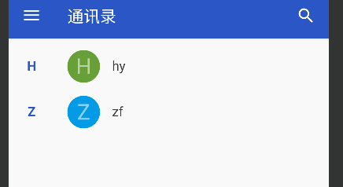


添加联系人


点击添加，再点击查询


### 利用ContentObserver监听短信

ContentResolver获取数据采用的是主动查询方式，有查询就有数据，没查询就没数据。然而有时不但要获取以往的数据，还要实时获取新增的数据，最常见的业务场景是短信验证码。电商App经常在用户 注册或付款时发送验证码短信，为了替用户省事，App通常会监控手机刚收到的短信验证码，并自动填写验证码输入框。这时就用到了内容观察器ContentObserver，事先给目标内容注册一个观察器，目标 内容的数据一旦发生变化，就马上触发观察器的监听事件，从而执行开发者预先定义的代码


内容观察器的用法与内容提供器类似，也要从ContentObserver派生一个新的观察器，然后通过 ContentResolver对象调用相应的方法注册或注销观察器。下面是内容解析器与内容观察器之间的交互方法说明：

* registerContentObserver：内容解析器要注册内容观察器
* unregisterContentObserver：内容解析器要注销内容观察器
* notifyChange：通知内容观察器发生了数据变化，此时会触发观察器的onChange方法


记得声明权限

```xml
<!-- 短信。包括发送短信、接收短信、读短信-->
<uses-permission android:name="android.permission.SEND_SMS" />
<uses-permission android:name="android.permission.RECEIVE_SMS" />
<uses-permission android:name="android.permission.READ_SMS" />
```


#### 代码

```java
package mao.android_monitor_sms_messages_with_contentobserver;

import androidx.annotation.NonNull;
import androidx.annotation.Nullable;
import androidx.appcompat.app.AppCompatActivity;
import androidx.core.app.ActivityCompat;
import androidx.core.content.ContextCompat;

import android.Manifest;
import android.annotation.SuppressLint;
import android.app.Activity;
import android.app.AlertDialog;
import android.content.Context;
import android.content.DialogInterface;
import android.content.pm.PackageManager;
import android.database.ContentObserver;
import android.database.Cursor;
import android.net.Uri;
import android.os.Build;
import android.os.Bundle;
import android.os.Handler;
import android.os.Looper;
import android.util.Log;
import android.widget.Toast;

public class MainActivity extends AppCompatActivity
{
    private SmsGetObserver smsGetObserver;

    private static final String TAG = "MainActivity";

    @Override
    protected void onCreate(Bundle savedInstanceState)
    {
        super.onCreate(savedInstanceState);
        setContentView(R.layout.activity_main);

        readSMS(168);

        // 给指定Uri注册内容观察器，一旦发生数据变化，就触发观察器的onChange方法
        Uri uri = Uri.parse("content://sms");
        // notifyForDescendents：
        // false ：表示精确匹配，即只匹配该Uri，true ：表示可以同时匹配其派生的Uri
        // 假设UriMatcher 里注册的Uri共有一下类型：
        // 1.content://AUTHORITIES/table
        // 2.content://AUTHORITIES/table/#
        // 3.content://AUTHORITIES/table/subtable
        // 假设我们当前需要观察的Uri为content://AUTHORITIES/student:
        // 如果发生数据变化的 Uri 为 3。
        // 当notifyForDescendents为false，那么该ContentObserver会监听不到，但是当notifyForDescendents 为ture，能捕捉该Uri的数据库变化。
        smsGetObserver = new SmsGetObserver(this);
        getContentResolver().registerContentObserver(uri, true, smsGetObserver);
    }

    @Override
    protected void onDestroy()
    {
        super.onDestroy();
        getContentResolver().unregisterContentObserver(smsGetObserver);
    }

    private static class SmsGetObserver extends ContentObserver
    {

        private final Context context;

        public SmsGetObserver(Context context)
        {
            super(new Handler(Looper.getMainLooper()));
            this.context = context;
        }

        @SuppressLint("Range")
        @Override
        public void onChange(boolean selfChange, @Nullable Uri uri)
        {
            super.onChange(selfChange, uri);
            // onChange会多次调用，收到一条短信会调用两次onChange
            // mUri===content://sms/raw/20
            // mUri===content://sms/inbox/20
            // 安卓7.0以上系统，点击标记为已读，也会调用一次
            // mUri===content://sms
            // 收到一条短信都是uri后面都会有确定的一个数字，对应数据库的_id，比如上面的20
            if (uri == null)
            {
                return;
            }
            if (uri.toString().contains("content://sms/raw") ||
                    uri.toString().equals("content://sms"))
            {
                return;
            }

            //通过内容解析器获取符合条件的结果集游标
            Cursor cursor = context.getContentResolver().query(uri, new String[]{"address", "body", "date"},
                    null, null, "date DESC");
            if (cursor.moveToNext())
            {
                // 短信的发送号码
                String sender = cursor.getString(cursor.getColumnIndex("address"));
                // 短信内容
                String content = cursor.getString(cursor.getColumnIndex("body"));
                Log.d(TAG, "onChange: 短信发送号码：" + sender + ",短信内容：" + content);

                AlertDialog.Builder builder = new AlertDialog.Builder(context);
                builder.setTitle("监听到一条短信")
                        .setMessage("短信发送者：" + sender + "\n内容：" + content)
                        .setPositiveButton("我知道了", null)
                        .create()
                        .show();
            }
            cursor.close();
        }
    }


    /**
     * 保存
     *
     * @param requestCode 请求代码 ,可以是组件的id
     */
    public void readSMS(int requestCode)
    {
        if (checkPermission(MainActivity.this, Manifest.permission.READ_SMS,
                requestCode % 65536))
        {
            //成功获取到权限
            toastShow("成功获取到读取短信的权限");
        }
    }


    @Override
    public void onRequestPermissionsResult(int requestCode, @NonNull String[] permissions, @NonNull int[] grantResults)
    {
        super.onRequestPermissionsResult(requestCode, permissions, grantResults);

        // requestCode不能为负数，也不能大于2的16次方即65536
        if (requestCode == 168 % 65536)
        {
            if (checkGrant(grantResults))
            {
                //用户选择了同意授权
                toastShow("成功获取到读取短信的权限");
            }
            else
            {
                AlertDialog.Builder builder = new AlertDialog.Builder(this);
                builder.setTitle("无权限")
                        .setMessage("没有读取短信的权限")
                        .setPositiveButton("我知道了", new DialogInterface.OnClickListener()
                        {
                            @Override
                            public void onClick(DialogInterface dialog, int which)
                            {
                                finish();
                            }
                        })
                        .create()
                        .show();
            }
        }
    }


    /**
     * 检查权限结果数组，
     *
     * @param grantResults 授予相应权限的结果是PackageManager.PERMISSION_GRANTED
     *                     或PackageManager.PERMISSION_DENIED
     *                     从不为空
     * @return boolean 返回true表示都已经获得授权 返回false表示至少有一个未获得授权
     */
    public static boolean checkGrant(int[] grantResults)
    {
        boolean result = true;
        if (grantResults != null)
        {
            for (int grant : grantResults)
            {
                //遍历权限结果数组中的每条选择结果
                if (grant != PackageManager.PERMISSION_GRANTED)
                {
                    //未获得授权，返回false
                    result = false;
                    break;
                }
            }
        }
        else
        {
            result = false;
        }
        return result;
    }


    /**
     * 检查某个权限
     *
     * @param act         Activity对象
     * @param permission  许可
     * @param requestCode 请求代码
     * @return boolean 返回true表示已启用该权限，返回false表示未启用该权限
     */
    public static boolean checkPermission(Activity act, String permission, int requestCode)
    {
        return checkPermission(act, new String[]{permission}, requestCode);
    }


    /**
     * 检查多个权限
     *
     * @param act         Activity对象
     * @param permissions 权限
     * @param requestCode 请求代码
     * @return boolean 返回true表示已完全启用权限，返回false表示未完全启用权限
     */
    @SuppressWarnings("all")
    public static boolean checkPermission(Activity act, String[] permissions, int requestCode)
    {
        boolean result = true;
        if (Build.VERSION.SDK_INT >= Build.VERSION_CODES.M)
        {
            int check = PackageManager.PERMISSION_GRANTED;
            //通过权限数组检查是否都开启了这些权限
            for (String permission : permissions)
            {
                check = ContextCompat.checkSelfPermission(act, permission);
                if (check != PackageManager.PERMISSION_GRANTED)
                {
                    //有个权限没有开启，就跳出循环
                    break;
                }
            }
            if (check != PackageManager.PERMISSION_GRANTED)
            {
                //未开启该权限，则请求系统弹窗，好让用户选择是否立即开启权限
                ActivityCompat.requestPermissions(act, permissions, requestCode);
                result = false;
            }
        }
        return result;
    }

    /**
     * 显示消息
     *
     * @param message 消息
     */
    private void toastShow(String message)
    {
        Toast.makeText(this, message, Toast.LENGTH_SHORT).show();
    }

}
```


#### 运行


需要权限，尝试拒绝


再次进入


允许


发送短信

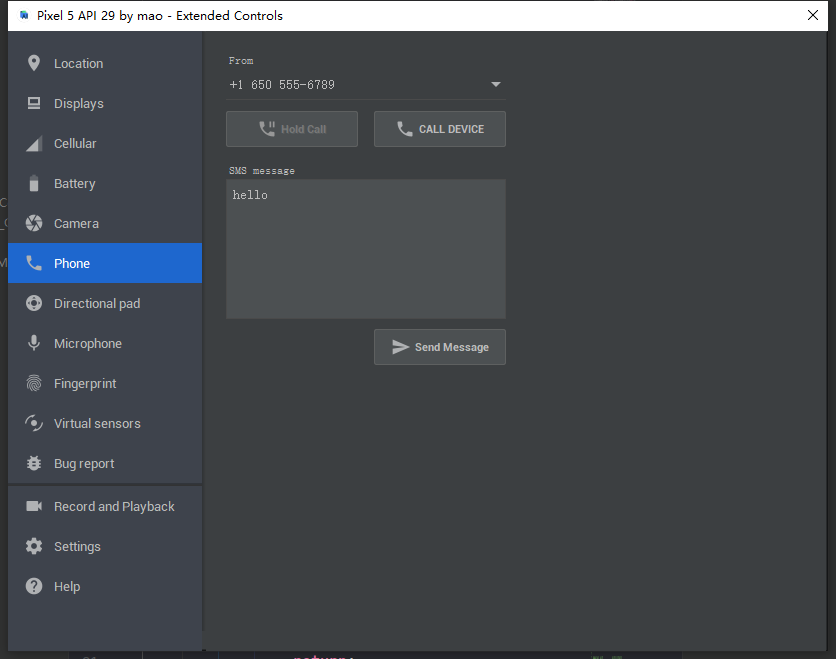


成功监听到短信


更改发送人和内容


查看日志


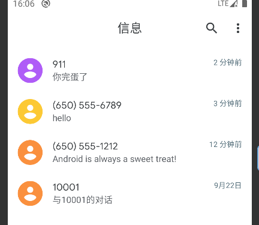


### 常用URI


## 在应用之间共享文件

### 使用相册图片发送彩信

不同应用之间可以共享数据，当然也能共享文件，比如系统相册保存着用户拍摄的照片，这些照片理应 分享给其他App使用。举个例子，短信只能发送文本，而彩信允许同时发送文本和图片，彩信的附件图片就来自系统相册。现在准备到系统相册挑选照片，测试页面的Java代码先增加以下两行代码，分别声明一个路径对象和选择照片的请求码：

```java
    /**
     * 文件的路径对象
     */
    private Uri uri;
    /**
     * 选择照片的请求码
     */
    private final int CHOOSE_CODE = 1238;
```


接着在选取按钮的点击方法中加入下面代码，表示打开系统相册选择照片：

```java
Intent albumIntent = new Intent(Intent.ACTION_GET_CONTENT);
albumIntent.setType("image/*"); // 设置内容类型为图像
startActivityForResult(albumIntent, CHOOSE_CODE); // 打开系统相册，并等待图片选择结果
```


上面的跳转代码期望接收照片选择结果，于是重写当前活动的onActivityResult方法，调用返回意图的 getData方法获得选中照片的路径对象


```java
@Override
    protected void onActivityResult(int requestCode, int resultCode, Intent intent)
    {
        super.onActivityResult(requestCode, resultCode, intent);

        if (resultCode == RESULT_OK && requestCode == CHOOSE_CODE)
        {
            //从相册选择一张照片
            if (intent.getData() != null)
            {
                //数据非空，表示选中了某张照片
                //获得选中照片的路径对象
                uri = intent.getData();
                //设置图像视图的路径对象
                imageButton.setImageURI(uri);

                Log.d(TAG, "uri.getPath=" + uri.getPath() + ",uri.toString=" + uri.toString());
            }
            else
            {
                uri = null;
            }
        }
    }
```


这下拿到了相册照片的路径对象，既能把它显示到图像视图，也能将它作为图片附件发送彩信了。由于 普通应用无法自行发送彩信，必须打开系统的信息应用才行，于是编写页面跳转代码，往意图对象塞入详细的彩信数据，包括彩信发送的目标号码、标题、内容，以及Uri类型的图片附件


```java
/**
 * 发送彩信
 *
 * @param phone   电话
 * @param title   标题
 * @param message 消息
 */
private void sendMms(String phone, String title, String message)
{
    // 创建一个发送动作的意图
    Intent intent = new Intent(Intent.ACTION_SEND);
    // 另外开启新页面
    intent.addFlags(Intent.FLAG_ACTIVITY_NEW_TASK);
    // 需要读权限
    intent.addFlags(Intent.FLAG_GRANT_READ_URI_PERMISSION);
    // 彩信发送的目标号码
    intent.putExtra("address", phone);
    // 彩信的标题
    intent.putExtra("subject", title);
    // 彩信的内容
    intent.putExtra("sms_body", message);
    // mUri为彩信的图片附件
    intent.putExtra(Intent.EXTRA_STREAM, uri);
    // 彩信的附件为图片
    intent.setType("image/*");
    // 部分手机无法直接跳到彩信发送页面，故而需要用户手动选择彩信应用
    //intent.setClassName("com.android.mms","com.android.mms.ui.ComposeMessageActivity");
    //因为未指定要打开哪个页面，所以系统会在底部弹出选择窗口
    startActivity(intent);
    toastShow("请在弹窗中选择短信或者信息应用");
}
```


#### 代码


布局文件

```xml
<?xml version="1.0" encoding="utf-8"?>
<LinearLayout xmlns:android="http://schemas.android.com/apk/res/android"
        xmlns:tools="http://schemas.android.com/tools"
        xmlns:app="http://schemas.android.com/apk/res-auto"
        android:layout_width="match_parent"
        android:layout_height="match_parent"
        tools:context=".MainActivity"
        android:orientation="vertical"
        android:gravity="center">

    <EditText
            android:id="@+id/EditText1"
            android:layout_width="match_parent"
            android:layout_height="wrap_content"
            android:hint="对方号码"
            android:maxLength="11"
            android:inputType="number" />

    <EditText
            android:id="@+id/EditText2"
            android:layout_width="match_parent"
            android:layout_height="wrap_content"
            android:hint="彩信标题"
            android:maxLength="20" />

    <EditText
            android:id="@+id/EditText3"
            android:layout_width="match_parent"
            android:layout_height="wrap_content"
            android:hint="彩信内容"
            android:lines="3" />


    <LinearLayout
            android:layout_width="match_parent"
            android:layout_height="wrap_content"
            android:orientation="horizontal"
            android:gravity="left">


        <TextView
                android:layout_width="wrap_content"
                android:layout_height="wrap_content"
                android:text="图片附件："
                android:layout_gravity="center" />

        <ImageButton
                android:id="@+id/ImageButton"
                android:layout_width="200dp"
                android:scaleType="fitCenter"
                android:layout_height="150dp" />

    </LinearLayout>

    <Button
            android:id="@+id/Button"
            android:layout_width="match_parent"
            android:layout_height="wrap_content"
            android:text="发送彩信" />


</LinearLayout>
```


MainActivity

```java
package mao.android_send_mms_with_album_pictures;

import androidx.appcompat.app.AppCompatActivity;

import android.content.Intent;
import android.net.Uri;
import android.os.Bundle;
import android.util.Log;
import android.view.View;
import android.widget.EditText;
import android.widget.ImageButton;
import android.widget.Toast;

public class MainActivity extends AppCompatActivity
{

    /**
     * 标签
     */
    private static final String TAG = "MainActivity";

    /**
     * 文件的路径对象
     */
    private Uri uri;
    /**
     * 选择照片的请求码
     */
    private final int CHOOSE_CODE = 1238;


    private ImageButton imageButton;
    private EditText editText1;
    private EditText editText2;
    private EditText editText3;

    @Override
    protected void onCreate(Bundle savedInstanceState)
    {
        super.onCreate(savedInstanceState);
        setContentView(R.layout.activity_main);

        editText1 = findViewById(R.id.EditText1);
        editText2 = findViewById(R.id.EditText2);
        editText3 = findViewById(R.id.EditText3);
        imageButton = findViewById(R.id.ImageButton);
        imageButton.setOnClickListener(new View.OnClickListener()
        {
            @Override
            public void onClick(View v)
            {
                Intent albumIntent = new Intent(Intent.ACTION_GET_CONTENT);
                //设置内容类型为图像
                albumIntent.setType("image/*");
                //打开系统相册，并等待图片选择结果
                startActivityForResult(albumIntent, CHOOSE_CODE);
            }
        });
        findViewById(R.id.Button).setOnClickListener(new View.OnClickListener()
        {
            @Override
            public void onClick(View v)
            {
                String phone = editText1.getText().toString();
                if (phone.equals(""))
                {
                    toastShow("请输入电话号码");
                    return;
                }
                String title = editText2.getText().toString();
                if (title.equals(""))
                {
                    toastShow("请输入标题");
                    return;
                }
                String message = editText3.getText().toString();
                if (message.equals(""))
                {
                    toastShow("请输入内容");
                    return;
                }
                if (uri == null)
                {
                    toastShow("请选择一张图片");
                    return;
                }

                sendMms(phone, title, message);

            }
        });

    }


    /**
     * 发送彩信
     *
     * @param phone   电话
     * @param title   标题
     * @param message 消息
     */
    private void sendMms(String phone, String title, String message)
    {
        // 创建一个发送动作的意图
        Intent intent = new Intent(Intent.ACTION_SEND);
        // 另外开启新页面
        intent.addFlags(Intent.FLAG_ACTIVITY_NEW_TASK);
        // 需要读权限
        intent.addFlags(Intent.FLAG_GRANT_READ_URI_PERMISSION);
        // 彩信发送的目标号码
        intent.putExtra("address", phone);
        // 彩信的标题
        intent.putExtra("subject", title);
        // 彩信的内容
        intent.putExtra("sms_body", message);
        // mUri为彩信的图片附件
        intent.putExtra(Intent.EXTRA_STREAM, uri);
        // 彩信的附件为图片
        intent.setType("image/*");
        // 部分手机无法直接跳到彩信发送页面，故而需要用户手动选择彩信应用
        //intent.setClassName("com.android.mms","com.android.mms.ui.ComposeMessageActivity");
        //因为未指定要打开哪个页面，所以系统会在底部弹出选择窗口
        startActivity(intent);
        toastShow("请在弹窗中选择短信或者信息应用");
    }


    @Override
    protected void onActivityResult(int requestCode, int resultCode, Intent intent)
    {
        super.onActivityResult(requestCode, resultCode, intent);

        if (resultCode == RESULT_OK && requestCode == CHOOSE_CODE)
        {
            //从相册选择一张照片
            if (intent.getData() != null)
            {
                //数据非空，表示选中了某张照片
                //获得选中照片的路径对象
                uri = intent.getData();
                //设置图像视图的路径对象
                imageButton.setImageURI(uri);

                Log.d(TAG, "uri.getPath=" + uri.getPath() + ",uri.toString=" + uri.toString());
            }
            else
            {
                uri = null;
                //imageButton.setImageURI(null);
            }
        }
    }

    /**
     * 显示消息
     *
     * @param message 消息
     */
    private void toastShow(String message)
    {
        Toast.makeText(this, message, Toast.LENGTH_SHORT).show();
    }
}
```


#### 运行


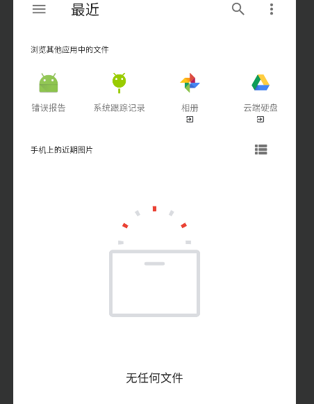


### 借助FileProvider发送彩信

通过系统相册固然可以获得照片的路径对象，却无法知晓更多的详细信息，例如照片名称、文件大小、 文件路径等信息，也就无法进行个性化的定制开发。为了把更多的文件信息开放出来，Android设计了专门的媒体共享库，允许开发者通过内容组件从中获取更详细的媒体信息

图片所在的相册媒体库路径为MediaStore.Images.Media.EXTERNAL_CONTENT_URI，通过内容解析器 即可从媒体库依次遍历得到图片列表详情。为便于代码管理，首先要声明如下的对象变量：

```java
/**
     * 图像列表
     */
    private final List<ImageInfo> imageList = new ArrayList<>();

    /**
     * 图像uri
     */
    private final Uri imageUri = MediaStore.Images.Media.EXTERNAL_CONTENT_URI;


    /**
     * 媒体库的字段名称数组
     */
    private final String[] imageColumn = new String[]
            {
                    // 编号
                    MediaStore.Images.Media._ID,
                    // 标题
                    MediaStore.Images.Media.TITLE,
                    // 文件大小
                    MediaStore.Images.Media.SIZE,
                    // 文件路径
                    MediaStore.Images.Media.DATA
            };

```


然后使用内容解析器查询媒体库的图片信息，简单起见只挑选文件大小最小的前6张图片


```java
/**
     * 加载图像列表
     */
    private void loadImageList()
    {
        // 清空图片列表
        imageList.clear();
        // 查询相册媒体库，并返回结果集的游标。“_size asc”表示按照文件大小升序排列
        Cursor cursor = getContentResolver().query(imageUri, imageColumn, null,
                null, "_size asc");
        if (cursor != null)
        {
            //遍历结果集，并逐个添加到图片列表。简单起见只挑选前六张图片
            for (int i = 0; i < 6 && cursor.moveToNext(); i++)
            {
                // 创建一个图片信息对象
                ImageInfo image = new ImageInfo();
                // 设置图片编号
                image.setId(cursor.getLong(0));
                // 设置图片名称
                image.setName(cursor.getString(1));
                // 设置图片的文件大小
                image.setSize(cursor.getLong(2));
                // 设置图片的文件路经
                image.setPath(cursor.getString(3));

                Log.d(TAG, image.getName() + " " + image.getSize() + " " +
                        image.getPath());


                // 添加至图片列表
                imageList.add(image);
            }
            //关闭数据库游标
            cursor.close();
        }
    }
```


以上代码获得了字符串格式的文件路径，而彩信发送应用却要求Uri类型的路径对象，原本可以通 过代码“Uri.parse(path)”将字符串转换为Uri对象，但是从Android 7.0开始，系统不允许其他应用直接访 问老格式的路径，必须使用文件提供器FileProvider才能获取合法的Uri路径，相当于A应用申明了共享某 个文件，然后B应用方可访问该文件。为此需要重头配置FileProvider，详细的配置步骤说明如下


首先在res目录新建xml文件夹，并在该文件夹中创建file_paths.xml，再往XML文件填入以下内容，表示 定义几个外部文件目录：


```xml
<paths>
    <external-path path="Android/data/mao.android_send_mms_with_fileprovider/" name="files_root" />
    <external-path path="." name="external_storage_root" />
</paths>
```


接着打开AndroidManifest.xml，在application节点内部添加下面的provider标签，表示声明当前应用的内容提供器组件


```xml
<!-- 兼容Android7.0，把访问文件的Uri方式改为FileProvider -->
<provider
        android:name="androidx.core.content.FileProvider"
        android:authorities="@string/file_provider"
        android:exported="false"
        android:grantUriPermissions="true">
    <meta-data
            android:name="android.support.FILE_PROVIDER_PATHS"
            android:resource="@xml/file_paths" />
</provider>
```


上面的provider有两处地方允许修改，一处是authorities属性，它规定了授权字符串，这是每个提供器 的唯一标识；另一处是元数据的resource属性，它指明了文件提供器的路径资源，也就是刚才定义的 file_paths.xml


回到活动页面的源码，在发送彩信之前添加下述代码，目的是根据字符串路径构建Uri对象


```java
// 根据指定路径创建一个Uri对象
Uri uri = Uri.parse(imageInfo.getPath());

// 通过FileProvider获得文件的Uri访问方式
uri = FileProvider.getUriForFile(this,
        "mao.android_send_mms_with_fileprovider", new
                File(imageInfo.getPath()));
```


布局文件


```xml
<LinearLayout xmlns:android="http://schemas.android.com/apk/res/android"
        android:layout_width="match_parent"
        android:layout_height="match_parent"
        android:orientation="vertical"
        android:padding="5dp">

    <LinearLayout
            android:layout_width="match_parent"
            android:layout_height="wrap_content"
            android:orientation="horizontal">

        <TextView
                android:layout_width="wrap_content"
                android:layout_height="match_parent"
                android:gravity="center"
                android:text="对方号码："
                android:textColor="@color/black"
                android:textSize="17sp" />

        <EditText
                android:id="@+id/et_phone"
                android:layout_width="0dp"
                android:layout_height="match_parent"
                android:layout_margin="3dp"
                android:layout_weight="1"
                android:inputType="number"
                android:textColor="@color/black"
                android:textSize="17sp"
                android:text="10086"/>

    </LinearLayout>

    <LinearLayout
            android:layout_width="match_parent"
            android:layout_height="wrap_content"
            android:orientation="horizontal">

        <TextView
                android:layout_width="wrap_content"
                android:layout_height="match_parent"
                android:gravity="center"
                android:text="彩信标题："
                android:textColor="@color/black"
                android:textSize="17sp" />

        <EditText
                android:id="@+id/et_title"
                android:layout_width="0dp"
                android:layout_height="match_parent"
                android:layout_margin="3dp"
                android:layout_weight="1"
                android:textColor="@color/black"
                android:textSize="17sp"
                android:text="Hallo"/>

    </LinearLayout>

    <LinearLayout
            android:layout_width="match_parent"
            android:layout_height="100dp"
            android:orientation="horizontal">

        <TextView
                android:layout_width="wrap_content"
                android:layout_height="match_parent"
                android:gravity="center"
                android:text="彩信内容："
                android:textColor="@color/black"
                android:textSize="17sp" />

        <EditText
                android:id="@+id/et_message"
                android:layout_width="0dp"
                android:layout_height="match_parent"
                android:layout_margin="3dp"
                android:layout_weight="1"
                android:gravity="left|top"
                android:textColor="@color/black"
                android:textSize="17sp"
                android:text="test"/>

    </LinearLayout>

    <TextView
            android:layout_width="match_parent"
            android:layout_height="30dp"
            android:text="点击下方图片开始发送彩信"
            android:textColor="@color/black"
            android:textSize="17sp" />

    <GridLayout
            android:id="@+id/gl_appendix"
            android:layout_width="match_parent"
            android:layout_height="wrap_content"
            android:columnCount="3" />

</LinearLayout>
```


实体类


```java
package mao.android_send_mms_with_fileprovider.entiey;

/**
 * Project name(项目名称)：android_send_MMS_with_FileProvider
 * Package(包名): mao.android_send_mms_with_fileprovider.entiey
 * Class(类名): ImageInfo
 * Author(作者）: mao
 * Author QQ：1296193245
 * GitHub：https://github.com/maomao124/
 * Date(创建日期)： 2022/10/2
 * Time(创建时间)： 14:09
 * Version(版本): 1.0
 * Description(描述)： 无
 */

public class ImageInfo
{
    /**
     * id
     */
    private long id;
    /**
     * 名字
     */
    private String name;
    /**
     * 大小
     */
    private long size;
    /**
     * 路径
     */
    private String path;

    /**
     * Instantiates a new Image info.
     */
    public ImageInfo()
    {
    }

    /**
     * Instantiates a new Image info.
     *
     * @param id   the id
     * @param name the name
     * @param size the size
     * @param path the path
     */
    public ImageInfo(long id, String name, long size, String path)
    {
        this.id = id;
        this.name = name;
        this.size = size;
        this.path = path;
    }

    /**
     * Gets id.
     *
     * @return the id
     */
    public long getId()
    {
        return id;
    }

    /**
     * Sets id.
     *
     * @param id the id
     * @return the id
     */
    public ImageInfo setId(long id)
    {
        this.id = id;
        return this;
    }

    /**
     * Gets name.
     *
     * @return the name
     */
    public String getName()
    {
        return name;
    }

    /**
     * Sets name.
     *
     * @param name the name
     * @return the name
     */
    public ImageInfo setName(String name)
    {
        this.name = name;
        return this;
    }

    /**
     * Gets size.
     *
     * @return the size
     */
    public long getSize()
    {
        return size;
    }

    /**
     * Sets size.
     *
     * @param size the size
     * @return the size
     */
    public ImageInfo setSize(long size)
    {
        this.size = size;
        return this;
    }

    /**
     * Gets path.
     *
     * @return the path
     */
    public String getPath()
    {
        return path;
    }

    /**
     * Sets path.
     *
     * @param path the path
     * @return the path
     */
    public ImageInfo setPath(String path)
    {
        this.path = path;
        return this;
    }

    @Override
    @SuppressWarnings("all")
    public String toString()
    {
        final StringBuilder stringbuilder = new StringBuilder();
        stringbuilder.append("id：").append(id).append('\n');
        stringbuilder.append("name：").append(name).append('\n');
        stringbuilder.append("size：").append(size).append('\n');
        stringbuilder.append("path：").append(path).append('\n');
        return stringbuilder.toString();
    }
}
```


MainActivity


```java
package mao.android_send_mms_with_fileprovider;

import androidx.annotation.NonNull;
import androidx.appcompat.app.AppCompatActivity;
import androidx.core.app.ActivityCompat;
import androidx.core.content.ContextCompat;
import androidx.core.content.FileProvider;

import android.Manifest;
import android.annotation.SuppressLint;
import android.app.Activity;
import android.app.AlertDialog;
import android.content.Intent;
import android.content.pm.PackageManager;
import android.database.Cursor;

import android.graphics.Bitmap;
import android.graphics.BitmapFactory;
import android.media.MediaScannerConnection;
import android.net.Uri;
import android.os.Build;
import android.os.Bundle;
import android.os.Environment;
import android.provider.MediaStore;
import android.util.Log;
import android.view.ViewGroup;
import android.widget.EditText;
import android.widget.GridLayout;
import android.widget.ImageView;
import android.widget.Toast;

import java.io.File;
import java.util.ArrayList;
import java.util.List;

import mao.android_send_mms_with_fileprovider.entiey.ImageInfo;

public class MainActivity extends AppCompatActivity
{

    private static final String[] PERMISSIONS = new String[]
            {
                    Manifest.permission.READ_EXTERNAL_STORAGE
            };

    private static final int PERMISSION_REQUEST_CODE = 1;

    private final List<ImageInfo> imageList = new ArrayList<>();

    private GridLayout gl_appendix;
    private EditText et_phone;
    private EditText et_title;
    private EditText et_message;

    private static final String TAG = "MainActivity";


    @Override
    protected void onCreate(Bundle savedInstanceState)
    {
        super.onCreate(savedInstanceState);
        setContentView(R.layout.activity_main);

        et_phone = findViewById(R.id.et_phone);
        et_title = findViewById(R.id.et_title);
        et_message = findViewById(R.id.et_message);
        gl_appendix = findViewById(R.id.gl_appendix);

        //手动让MediaStore扫描入库
        MediaScannerConnection.scanFile(this,
                new String[]{Environment.getExternalStoragePublicDirectory(Environment.DIRECTORY_DOWNLOADS).toString()},
                null, null);

        if (checkPermission(this, PERMISSIONS, PERMISSION_REQUEST_CODE))
        {
            // 加载图片列表
            loadImageList();

            if (imageList.size() <= 6)
            {
                AlertDialog.Builder builder = new AlertDialog.Builder(this);
                builder.setTitle("图片不够")
                        .setMessage("图片数量不足6张,当前为" + imageList.size() + "张")
                        .setPositiveButton("确定", null)
                        .create()
                        .show();
            }

            // 显示图像网格
            showImageGrid();
        }
    }

    @Override
    public void onRequestPermissionsResult(int requestCode, @NonNull String[] permissions, @NonNull int[] grantResults)
    {
        super.onRequestPermissionsResult(requestCode, permissions, grantResults);
        if (requestCode == PERMISSION_REQUEST_CODE &&
                checkGrant(grantResults))
        {
            // 加载图片列表
            loadImageList();

            if (imageList.size() <= 6)
            {
                AlertDialog.Builder builder = new AlertDialog.Builder(this);
                builder.setTitle("图片不够")
                        .setMessage("图片数量不足6张")
                        .setPositiveButton("确定", null)
                        .create()
                        .show();
            }


            // 显示图像网格
            showImageGrid();
        }
        else
        {
            AlertDialog.Builder builder = new AlertDialog.Builder(this);
            builder.setTitle("没有权限")
                    .setMessage("没有相关权限")
                    .setPositiveButton("确定", null)
                    .create()
                    .show();
        }
    }

    // 显示图像网格
    private void showImageGrid()
    {
        gl_appendix.removeAllViews();
        for (ImageInfo image : imageList)
        {
            // image -> ImageView
            ImageView iv_appendix = new ImageView(this);
            Bitmap bitmap = BitmapFactory.decodeFile(image.getPath());
            iv_appendix.setImageBitmap(bitmap);
            // 设置图像视图的缩放类型
            iv_appendix.setScaleType(ImageView.ScaleType.FIT_CENTER);
            // 设置图像视图的布局参数
            int px = 400;
            ViewGroup.LayoutParams params = new ViewGroup.LayoutParams(px, px);
            iv_appendix.setLayoutParams(params);
            // 设置图像视图的内部间距
            int padding = 30;
            iv_appendix.setPadding(padding, padding, padding, padding);
            iv_appendix.setOnClickListener(v ->
            {
                sendMms(et_phone.getText().toString(),
                        et_title.getText().toString(),
                        et_message.getText().toString(),
                        image.getPath());
            });
            // 把图像视图添加至网格布局
            gl_appendix.addView(iv_appendix);
        }
    }

    // 加载图片列表
    @SuppressLint("Range")
    private void loadImageList()
    {
        //MediaStore
        String[] columns = new String[]
                {
                        MediaStore.Images.Media._ID, // 编号
                        MediaStore.Images.Media.TITLE, // 标题
                        MediaStore.Images.Media.SIZE,// 文件大小
                        MediaStore.Images.Media.DATA,// 文件路径
                };
        // 图片大小在300KB以内
        @SuppressLint("Recycle") Cursor cursor = getContentResolver().query(
                MediaStore.Images.Media.EXTERNAL_CONTENT_URI,
                columns,
                "_size < 307200",
                null,
                "_size DESC"
        );
        int count = 0;
        if (cursor != null)
        {
            while (cursor.moveToNext() && count < 6)
            {
                ImageInfo image = new ImageInfo();
                image.setId(cursor.getLong(cursor.getColumnIndex(MediaStore.Images.Media._ID)));
                image.setName(cursor.getString(cursor.getColumnIndex(MediaStore.Images.Media.TITLE)));
                image.setSize(cursor.getLong(cursor.getColumnIndex(MediaStore.Images.Media.SIZE)));
                image.setPath(cursor.getString(cursor.getColumnIndex(MediaStore.Images.Media.DATA)));
                count++;
                imageList.add(image);
                Log.d(TAG, "loadImageList: " + image);
            }
        }

    }

    // 发送带图片的彩信
    private void sendMms(String phone, String title, String message, String path)
    {
        // 根据指定路径创建一个Uri对象
        Uri uri = Uri.parse(path);
        // 兼容Android7.0，把访问文件的Uri方式改为FileProvider
        if (Build.VERSION.SDK_INT >= Build.VERSION_CODES.N)
        {
            // 通过FileProvider获得文件的Uri访问方式
            uri = FileProvider.getUriForFile(this, getString(R.string.file_provider), new File(path));
        }
        Intent intent = new Intent(Intent.ACTION_SEND);
        intent.addFlags(Intent.FLAG_ACTIVITY_NEW_TASK);
        // Intent 的接受者将被准许读取Intent 携带的URI数据
        intent.addFlags(Intent.FLAG_GRANT_READ_URI_PERMISSION);
        // 彩信发送的目标号码
        intent.putExtra("address", phone);
        // 彩信的标题
        intent.putExtra("subject", title);
        // 彩信的内容
        intent.putExtra("sms_body", message);
        // 彩信的图片附件
        intent.putExtra(Intent.EXTRA_STREAM, uri);
        // 彩信的附件为图片
        intent.setType("image/*");
        // 因为未指定要打开哪个页面，所以系统会在底部弹出选择窗口
        startActivity(intent);
        toastShow("请在弹窗中选择短信或者信息应用");
    }

    /**
     * 显示消息
     *
     * @param message 消息
     */
    private void toastShow(String message)
    {
        Toast.makeText(this, message, Toast.LENGTH_SHORT).show();
    }


    /**
     * 检查权限结果数组，
     *
     * @param grantResults 授予相应权限的结果是PackageManager.PERMISSION_GRANTED
     *                     或PackageManager.PERMISSION_DENIED
     *                     从不为空
     * @return boolean 返回true表示都已经获得授权 返回false表示至少有一个未获得授权
     */
    public static boolean checkGrant(int[] grantResults)
    {
        boolean result = true;
        if (grantResults != null)
        {
            for (int grant : grantResults)
            {
                //遍历权限结果数组中的每条选择结果
                if (grant != PackageManager.PERMISSION_GRANTED)
                {
                    //未获得授权，返回false
                    result = false;
                    break;
                }
            }
        }
        else
        {
            result = false;
        }
        return result;
    }


    /**
     * 检查某个权限
     *
     * @param act         Activity对象
     * @param permission  许可
     * @param requestCode 请求代码
     * @return boolean 返回true表示已启用该权限，返回false表示未启用该权限
     */
    public static boolean checkPermission(Activity act, String permission, int requestCode)
    {
        return checkPermission(act, new String[]{permission}, requestCode);
    }


    /**
     * 检查多个权限
     *
     * @param act         Activity对象
     * @param permissions 权限
     * @param requestCode 请求代码
     * @return boolean 返回true表示已完全启用权限，返回false表示未完全启用权限
     */
    @SuppressWarnings("all")
    public static boolean checkPermission(Activity act, String[] permissions, int requestCode)
    {
        boolean result = true;
        if (Build.VERSION.SDK_INT >= Build.VERSION_CODES.M)
        {
            int check = PackageManager.PERMISSION_GRANTED;
            //通过权限数组检查是否都开启了这些权限
            for (String permission : permissions)
            {
                check = ContextCompat.checkSelfPermission(act, permission);
                if (check != PackageManager.PERMISSION_GRANTED)
                {
                    //有个权限没有开启，就跳出循环
                    break;
                }
            }
            if (check != PackageManager.PERMISSION_GRANTED)
            {
                //未开启该权限，则请求系统弹窗，好让用户选择是否立即开启权限
                ActivityCompat.requestPermissions(act, permissions, requestCode);
                result = false;
            }
        }
        return result;
    }
}
```


图片不够，没法测试


# 高级控件

## 下拉列表

### 下拉框Spinner

Spinner是下拉框控件，它用于从一串列表中选择某项，其功能类似于单选按钮的组合。下拉列表的展示 方式有两种，一种是在当前下拉框的正下方弹出列表框，此时要把spinnerMode属性设置为 dropdown，另一种是在页面中部弹出列表对话框，此时要把spinnerMode属性设置为dialog


```xml
<?xml version="1.0" encoding="utf-8"?>
<LinearLayout xmlns:android="http://schemas.android.com/apk/res/android"
        xmlns:tools="http://schemas.android.com/tools"
        xmlns:app="http://schemas.android.com/apk/res-auto"
        android:layout_width="match_parent"
        android:layout_height="match_parent"
        tools:context=".MainActivity2"
        android:orientation="vertical"
        android:gravity="center">


    <Spinner
            android:id="@+id/Spinner1"
            android:layout_width="match_parent"
            android:layout_height="wrap_content"
            android:spinnerMode="dropdown" />

</LinearLayout>
```


```xml
<?xml version="1.0" encoding="utf-8"?>
<LinearLayout xmlns:android="http://schemas.android.com/apk/res/android"
        xmlns:tools="http://schemas.android.com/tools"
        xmlns:app="http://schemas.android.com/apk/res-auto"
        android:layout_width="match_parent"
        android:layout_height="match_parent"
        tools:context=".MainActivity3"
        android:orientation="vertical"
        android:gravity="center">


    <Spinner
            android:id="@+id/Spinner1"
            android:layout_width="match_parent"
            android:layout_height="wrap_content"
            android:spinnerMode="dialog" />

</LinearLayout>
```


此外，在Java代码中，Spinner还可以调用下列4个方法：

* setPrompt：设置标题文字。注意对话框模式才显示标题，下拉模式不显示标题。
* setAdapter：设置列表项的数据适配器
* setSelection：设置当前选中哪项。注意该方法要在setAdapter方法后调用
* setOnItemSelectedListener：设置下拉列表的选择监听器，该监听器要实现接口OnItemSelectedListener


下拉框模式

```java
package mao.android_spinner;

import androidx.appcompat.app.AppCompatActivity;

import android.os.Bundle;
import android.view.View;
import android.widget.AdapterView;
import android.widget.ArrayAdapter;
import android.widget.Spinner;
import android.widget.Toast;

public class MainActivity2 extends AppCompatActivity
{

    @Override
    protected void onCreate(Bundle savedInstanceState)
    {
        super.onCreate(savedInstanceState);
        setContentView(R.layout.activity_main2);

        Spinner spinner = findViewById(R.id.Spinner1);

        //ArrayAdapter<String> arrayAdapter = new ArrayAdapter<>(this,android.R.layout.simple_list_item_1, new String[]{"1", "2"});
        ArrayAdapter<String> arrayAdapter = new ArrayAdapter<>(this, R.layout.item_select,
                new String[]
                        {
                                "选项1",
                                "选项2",
                                "选项3",
                                "选项4",
                                "选项5",
                                "选项6",
                                "选项7"
                        }
        );
        spinner.setAdapter(arrayAdapter);

        spinner.setOnItemSelectedListener(new AdapterView.OnItemSelectedListener()
        {
            @Override
            public void onItemSelected(AdapterView<?> parent, View view, int position, long id)
            {
                toastShow("当前选择的是第" + (position + 1) + "个");
            }

            @Override
            public void onNothingSelected(AdapterView<?> parent)
            {
                toastShow("取消选择");
            }
        });
    }

    /**
     * 显示消息
     *
     * @param message 消息
     */
    private void toastShow(String message)
    {
        Toast.makeText(this, message, Toast.LENGTH_SHORT).show();
    }
}
```


对话框模式


```java
package mao.android_spinner;

import androidx.appcompat.app.AppCompatActivity;

import android.os.Bundle;
import android.view.View;
import android.widget.AdapterView;
import android.widget.ArrayAdapter;
import android.widget.Spinner;
import android.widget.Toast;

public class MainActivity3 extends AppCompatActivity
{

    @Override
    protected void onCreate(Bundle savedInstanceState)
    {
        super.onCreate(savedInstanceState);
        setContentView(R.layout.activity_main3);

        Spinner spinner = findViewById(R.id.Spinner1);

        ArrayAdapter<String> arrayAdapter = new ArrayAdapter<>(this, R.layout.item_select,
                new String[]
                        {
                                "选项1",
                                "选项2",
                                "选项3",
                                "选项4",
                                "选项5",
                                "选项6",
                                "选项7"
                        }
        );
        spinner.setPrompt("请选择");
        spinner.setAdapter(arrayAdapter);

        spinner.setOnItemSelectedListener(new AdapterView.OnItemSelectedListener()
        {
            @Override
            public void onItemSelected(AdapterView<?> parent, View view, int position, long id)
            {
                toastShow("当前选择的是第" + (position + 1) + "个");
            }

            @Override
            public void onNothingSelected(AdapterView<?> parent)
            {
                toastShow("取消选择");
            }
        });
    }

    /**
     * 显示消息
     *
     * @param message 消息
     */
    private void toastShow(String message)
    {
        Toast.makeText(this, message, Toast.LENGTH_SHORT).show();
    }
}
```


运行


对话框模式


### 数组适配器ArrayAdapter

这个适配器好比一组数据的加工流水线，你丢给它一大把糖果，适配器先按顺序排列糖果，然后拿来制作好的包装盒（对应每个列表项的布局文件item_select.xml），把糖果往里面一塞，出来的便是一个个精美的糖果盒（界面上排布整齐的列表框）。这个流水线可以做得很复杂，也可以做得简单一些，最简单的流水线就是之前演示用到的数组适配器ArrayAdapter


ArrayAdapter主要用于每行列表只展示文本的情况


实现过程分成下列3个步骤：

步骤一，编写列表项的XML文件，内部布局只有一个TextView标签


```xml
<?xml version="1.0" encoding="utf-8"?>
<TextView xmlns:android="http://schemas.android.com/apk/res/android"
        xmlns:tools="http://schemas.android.com/tools"
        android:layout_width="match_parent"
        android:layout_height="50dp"
        android:gravity="center"
        android:textColor="#ff0000"
        android:textSize="17sp" />
```


步骤二，调用ArrayAdapter的构造方法，填入待展现的字符串数组，以及列表项的包装盒，即XML文件 R.layout.item_select。


```java
ArrayAdapter<String> arrayAdapter = new ArrayAdapter<>(this, R.layout.item_select,
        new String[]
                {
                        "选项1",
                        "选项2",
                        "选项3",
                        "选项4",
                        "选项5",
                        "选项6",
                        "选项7"
                }
);
```


也可以使用系统自带的

```java
ArrayAdapter<String> arrayAdapter = new ArrayAdapter<>(this,android.R.layout.simple_list_item_1, new String[]{"1", "2"});
```


步骤三，调用下拉框控件的setAdapter方法，传入第二步得到的适配器实例


```java
spinner.setAdapter(arrayAdapter);
```


### 简单适配器SimpleAdapter

ArrayAdapter只能显示文本列表，显然不够美观，有时还想给列表加上图标。这时简单适配器SimpleAdapter就能派上用场了，它允许在列表项中同时展示文本与图片


SimpleAdapter的实现过程略微复杂，因为它的原料需要更多信息。例如，原料不但有糖果，还有贺卡，这样就得把一大袋糖果和一大袋贺卡送进流水线，适配器每次拿一颗糖果和一张贺卡，把糖果与贺卡按规定塞进包装盒。对于SimpleAdapter的构造方法来说，第2个参数Map容器放的是原料糖果与贺卡，第3个参数放的是包装盒，第4个参数放的是糖果袋与贺卡袋的名称，第5个参数放的是包装盒里塞糖果的位置与塞贺卡的位置


布局文件

```xml
<?xml version="1.0" encoding="utf-8"?>
<LinearLayout xmlns:android="http://schemas.android.com/apk/res/android"
        xmlns:tools="http://schemas.android.com/tools"
        xmlns:app="http://schemas.android.com/apk/res-auto"
        android:layout_width="match_parent"
        android:layout_height="match_parent"
        tools:context=".MainActivity3"
        android:orientation="vertical"
        android:gravity="center">


    <Spinner
            android:id="@+id/Spinner3"
            android:layout_width="match_parent"
            android:layout_height="wrap_content"
            android:spinnerMode="dropdown" />

</LinearLayout>
```


item_simple.xml

```xml
<?xml version="1.0" encoding="utf-8"?>
<LinearLayout xmlns:android="http://schemas.android.com/apk/res/android"
        xmlns:tools="http://schemas.android.com/tools"
        android:layout_width="match_parent"
        android:layout_height="wrap_content"
        android:orientation="horizontal">

    <ImageView
            android:id="@+id/iv_icon"
            android:layout_width="0dp"
            android:layout_height="50dp"
            android:layout_weight="1" />

    <TextView
            android:id="@+id/tv_name"
            android:layout_width="0dp"
            android:layout_height="match_parent"
            android:layout_weight="3"
            android:gravity="center"
            android:textColor="#ff0000"
            android:textSize="17sp" />

</LinearLayout>
```


MainActivity4

```java
package mao.android_spinner;

import androidx.appcompat.app.AppCompatActivity;

import android.os.Bundle;
import android.view.View;
import android.widget.AdapterView;
import android.widget.SimpleAdapter;
import android.widget.Spinner;
import android.widget.Toast;

import java.util.ArrayList;
import java.util.HashMap;
import java.util.List;
import java.util.Map;

public class MainActivity4 extends AppCompatActivity
{

    @Override
    protected void onCreate(Bundle savedInstanceState)
    {
        super.onCreate(savedInstanceState);
        setContentView(R.layout.activity_main4);

        Spinner spinner = findViewById(R.id.Spinner3);

        int[] iconArray = new int[]
                {
                        R.drawable.ic_launcher_foreground,
                        R.drawable.ic_launcher_foreground,
                        R.drawable.ic_launcher_foreground,
                        R.drawable.ic_launcher_foreground,
                        R.drawable.ic_launcher_foreground,
                        R.drawable.ic_launcher_foreground,
                };

        String[] nameArray = new String[]
                {
                        "选项1",
                        "选项2",
                        "选项3",
                        "选项4",
                        "选项5",
                        "选项6",
                };


        List<Map<String, Object>> list = new ArrayList<>();
        for (int i = 0; i < nameArray.length; i++)
        {
            Map<String, Object> map = new HashMap<>(2);
            map.put("icon", iconArray[i]);
            map.put("name", nameArray[i]);
            list.add(map);
        }

        SimpleAdapter simpleAdapter = new SimpleAdapter(this, list,
                R.layout.item_simple,
                new String[]{"icon", "name"},
                new int[]{R.id.iv_icon, R.id.tv_name}
        );

        spinner.setAdapter(simpleAdapter);
        spinner.setSelection(2);

        spinner.setOnItemSelectedListener(new AdapterView.OnItemSelectedListener()
        {
            @Override
            public void onItemSelected(AdapterView<?> parent, View view, int position, long id)
            {
                toastShow("当前选择的是第" + (position + 1) + "个");
            }

            @Override
            public void onNothingSelected(AdapterView<?> parent)
            {
                toastShow("取消选择");
            }
        });

    }

    /**
     * 显示消息
     *
     * @param message 消息
     */
    private void toastShow(String message)
    {
        Toast.makeText(this, message, Toast.LENGTH_SHORT).show();
    }
}
```


运行


对话框模式


```xml
<?xml version="1.0" encoding="utf-8"?>
<LinearLayout xmlns:android="http://schemas.android.com/apk/res/android"
        xmlns:tools="http://schemas.android.com/tools"
        xmlns:app="http://schemas.android.com/apk/res-auto"
        android:layout_width="match_parent"
        android:layout_height="match_parent"
        tools:context=".MainActivity5"
        android:orientation="vertical"
        android:gravity="center">


    <Spinner
            android:id="@+id/Spinner4"
            android:layout_width="match_parent"
            android:layout_height="wrap_content"
            android:spinnerMode="dialog" />

</LinearLayout>
```


```java
package mao.android_spinner;

import androidx.appcompat.app.AppCompatActivity;

import android.os.Bundle;
import android.view.View;
import android.widget.AdapterView;
import android.widget.SimpleAdapter;
import android.widget.Spinner;
import android.widget.Toast;

import java.util.ArrayList;
import java.util.HashMap;
import java.util.List;
import java.util.Map;

public class MainActivity5 extends AppCompatActivity
{

    @Override
    protected void onCreate(Bundle savedInstanceState)
    {
        super.onCreate(savedInstanceState);
        setContentView(R.layout.activity_main5);
        Spinner spinner = findViewById(R.id.Spinner4);

        int[] iconArray = new int[]
                {
                        R.drawable.ic_launcher_foreground,
                        R.drawable.ic_launcher_foreground,
                        R.drawable.ic_launcher_foreground,
                        R.drawable.ic_launcher_foreground,
                        R.drawable.ic_launcher_foreground,
                        R.drawable.ic_launcher_foreground,
                };

        String[] nameArray = new String[]
                {
                        "选项1",
                        "选项2",
                        "选项3",
                        "选项4",
                        "选项5",
                        "选项6",
                };


        List<Map<String, Object>> list = new ArrayList<>();
        for (int i = 0; i < nameArray.length; i++)
        {
            Map<String, Object> map = new HashMap<>(2);
            map.put("icon", iconArray[i]);
            map.put("name", nameArray[i]);
            list.add(map);
        }

        SimpleAdapter simpleAdapter = new SimpleAdapter(this, list,
                R.layout.item_simple,
                new String[]{"icon", "name"},
                new int[]{R.id.iv_icon, R.id.tv_name}
        );


        spinner.setPrompt("请选择");
        spinner.setAdapter(simpleAdapter);
        spinner.setSelection(2);

        spinner.setOnItemSelectedListener(new AdapterView.OnItemSelectedListener()
        {
            @Override
            public void onItemSelected(AdapterView<?> parent, View view, int position, long id)
            {
                toastShow("当前选择的是第" + (position + 1) + "个");
            }

            @Override
            public void onNothingSelected(AdapterView<?> parent)
            {
                toastShow("取消选择");
            }
        });

    }

    /**
     * 显示消息
     *
     * @param message 消息
     */
    private void toastShow(String message)
    {
        Toast.makeText(this, message, Toast.LENGTH_SHORT).show();
    }
}
```


运行


## 列表类视图

### 基本适配器BaseAdapter

数组适配器适用于纯文本的列表数据，简单适配器适用于带图标的列表数据。然 而实际应用常常有更复杂的列表，比如每个列表项存在3个以上的控件，这种情况即便是简单适配器也很吃力，而且不易扩展。为此Android提供了一种适应性更强的基本适配器BaseAdapter，该适配器允许开发者在别的代码文件中编写操作代码，大大提高了代码的可读性和可维护性


从BaseAdapter派生的数据适配器主要实现下面5种方法：

* 构造方法：指定适配器需要处理的数据集合
* getCount：获取列表项的个数
* getItem：获取列表项的数据
* getItemId：获取列表项的编号
* getView：获取每项的展示视图，并对每项的内部控件进行业务处理


具体的编码过程分为3步：


步骤一，编写列表项的布局文件


```xml
<?xml version="1.0" encoding="utf-8"?>
<LinearLayout xmlns:android="http://schemas.android.com/apk/res/android"
        android:orientation="horizontal"
        android:layout_width="match_parent"
        android:layout_height="match_parent">

    <ImageView
            android:id="@+id/icon"
            android:layout_width="0dp"
            android:layout_height="50dp"
            android:layout_weight="1"
            android:scaleType="fitCenter" />


    <LinearLayout
            android:layout_width="0dp"
            android:layout_height="50dp"
            android:layout_weight="4"
            android:orientation="vertical">

        <TextView
                android:id="@+id/title"
                android:layout_width="match_parent"
                android:layout_height="wrap_content"
                android:textSize="18sp"
                android:textColor="#00ff00" />

        <TextView
                android:id="@+id/content"
                android:layout_width="match_parent"
                android:layout_height="wrap_content"
                android:textColor="#00aaff" />


    </LinearLayout>

</LinearLayout>
```


步骤二，写个新的适配器继承BaseAdapter，实现对列表项的管理操作


```java
package mao.android_baseadapter.adapter;

import android.content.Context;
import android.view.LayoutInflater;
import android.view.View;
import android.view.ViewGroup;
import android.widget.BaseAdapter;
import android.widget.ImageView;
import android.widget.TextView;


import java.util.List;

import mao.android_baseadapter.R;
import mao.android_baseadapter.entity.SpinnerInfo;

/**
 * Project name(项目名称)：android_BaseAdapter
 * Package(包名): mao.android_baseadapter.adapter
 * Class(类名): SpinnerAdapter
 * Author(作者）: mao
 * Author QQ：1296193245
 * GitHub：https://github.com/maomao124/
 * Date(创建日期)： 2022/10/3
 * Time(创建时间)： 13:55
 * Version(版本): 1.0
 * Description(描述)： SpinnerAdapter
 */

public class SpinnerAdapter extends BaseAdapter
{

    /**
     * 上下文
     */
    private final Context context;

    /**
     * 列表
     */
    private final List<SpinnerInfo> list;

    public SpinnerAdapter(Context context, List<SpinnerInfo> list)
    {
        this.context = context;
        this.list = list;
    }


    /**
     * 获取列表项的个数
     *
     * @return int
     */
    @Override
    public int getCount()
    {
        return list.size();
    }

    /**
     * 获取列表项的数据
     *
     * @param position 位置
     * @return {@link Object}
     */
    @Override
    public Object getItem(int position)
    {
        return list.get(position);
    }

    /**
     * 获取列表项的编号
     *
     * @param position 位置
     * @return long
     */
    @Override
    public long getItemId(int position)
    {
        return position;
    }

    /**
     * 获取指定位置的列表项视图
     *
     * @param position    位置
     * @param convertView 转换视图
     * @param parent      ViewGroup对象
     * @return {@link View}
     */
    @Override
    public View getView(int position, View convertView, ViewGroup parent)
    {
        ViewHolder viewHolder;
        if (convertView == null)
        {
            viewHolder = new ViewHolder();
            convertView = LayoutInflater.from(context).inflate(R.layout.item_baseadaper, null);
            viewHolder.icon = convertView.findViewById(R.id.icon);
            viewHolder.title = convertView.findViewById(R.id.title);
            viewHolder.content = convertView.findViewById(R.id.content);
            convertView.setTag(viewHolder);
        }
        else
        {
            viewHolder = (ViewHolder) convertView.getTag();
        }
        SpinnerInfo spinnerInfo = list.get(position);
        viewHolder.icon.setImageResource(spinnerInfo.getIcon());
        viewHolder.title.setText(spinnerInfo.getTitle());
        viewHolder.content.setText(spinnerInfo.getContent());
        return convertView;
    }


    private static final class ViewHolder
    {
        public ImageView icon;
        public TextView title;
        public TextView content;
    }
}
```


实体类

```java
package mao.android_baseadapter.entity;

/**
 * Project name(项目名称)：android_BaseAdapter
 * Package(包名): mao.android_baseadapter.entity
 * Class(类名): SpinnerInfo
 * Author(作者）: mao
 * Author QQ：1296193245
 * GitHub：https://github.com/maomao124/
 * Date(创建日期)： 2022/10/3
 * Time(创建时间)： 13:57
 * Version(版本): 1.0
 * Description(描述)： 无
 */


public class SpinnerInfo
{
    /**
     * 图标
     */
    private int icon;
    /**
     * 标题
     */
    private String title;
    /**
     * 内容
     */
    private String content;

    /**
     * Instantiates a new Spinner info.
     */
    public SpinnerInfo()
    {

    }

    /**
     * Instantiates a new Spinner info.
     *
     * @param icon    the icon
     * @param title   the title
     * @param content the content
     */
    public SpinnerInfo(int icon, String title, String content)
    {
        this.icon = icon;
        this.title = title;
        this.content = content;
    }

    /**
     * Gets icon.
     *
     * @return the icon
     */
    public int getIcon()
    {
        return icon;
    }

    /**
     * Sets icon.
     *
     * @param icon the icon
     * @return the icon
     */
    public SpinnerInfo setIcon(int icon)
    {
        this.icon = icon;
        return this;
    }

    /**
     * Gets title.
     *
     * @return the title
     */
    public String getTitle()
    {
        return title;
    }

    /**
     * Sets title.
     *
     * @param title the title
     * @return the title
     */
    public SpinnerInfo setTitle(String title)
    {
        this.title = title;
        return this;
    }

    /**
     * Gets content.
     *
     * @return the content
     */
    public String getContent()
    {
        return content;
    }

    /**
     * Sets content.
     *
     * @param content the content
     * @return the content
     */
    public SpinnerInfo setContent(String content)
    {
        this.content = content;
        return this;
    }

    @Override
    @SuppressWarnings("all")
    public String toString()
    {
        final StringBuilder stringbuilder = new StringBuilder();
        stringbuilder.append("icon：").append(icon).append('\n');
        stringbuilder.append("title：").append(title).append('\n');
        stringbuilder.append("content：").append(content).append('\n');
        return stringbuilder.toString();
    }
}
```


步骤三，在页面代码中创建该适配器实例，并交给下拉框设置


```java
package mao.android_baseadapter;

import androidx.appcompat.app.AppCompatActivity;

import android.os.Bundle;
import android.view.View;
import android.widget.AdapterView;
import android.widget.Spinner;
import android.widget.Toast;

import java.util.ArrayList;
import java.util.List;

import mao.android_baseadapter.adapter.SpinnerAdapter;
import mao.android_baseadapter.entity.SpinnerInfo;

public class MainActivity extends AppCompatActivity
{

    @Override
    protected void onCreate(Bundle savedInstanceState)
    {
        super.onCreate(savedInstanceState);
        setContentView(R.layout.activity_main);

        Spinner spinner = findViewById(R.id.Spinner);

        List<SpinnerInfo> list = new ArrayList<>(6);
        {
            SpinnerInfo spinnerInfo = new SpinnerInfo();
            spinnerInfo.setIcon(R.drawable.ic_launcher_foreground)
                    .setTitle("标题1")
                    .setContent("这是内容1....");
            list.add(spinnerInfo);
        }
        {
            SpinnerInfo spinnerInfo = new SpinnerInfo();
            spinnerInfo.setIcon(R.drawable.ic_launcher_foreground)
                    .setTitle("标题2")
                    .setContent("这是内容2....");
            list.add(spinnerInfo);
        }
        {
            SpinnerInfo spinnerInfo = new SpinnerInfo();
            spinnerInfo.setIcon(R.drawable.ic_launcher_foreground)
                    .setTitle("标题3")
                    .setContent("这是内容3....");
            list.add(spinnerInfo);
        }
        {
            SpinnerInfo spinnerInfo = new SpinnerInfo();
            spinnerInfo.setIcon(R.drawable.ic_launcher_foreground)
                    .setTitle("标题4")
                    .setContent("这是内容4....");
            list.add(spinnerInfo);
        }
        {
            SpinnerInfo spinnerInfo = new SpinnerInfo();
            spinnerInfo.setIcon(R.drawable.ic_launcher_foreground)
                    .setTitle("标题5")
                    .setContent("这是内容5....");
            list.add(spinnerInfo);
        }
        {
            SpinnerInfo spinnerInfo = new SpinnerInfo();
            spinnerInfo.setIcon(R.drawable.ic_launcher_foreground)
                    .setTitle("标题6")
                    .setContent("这是内容6....");
            list.add(spinnerInfo);
        }

        SpinnerAdapter spinnerAdapter = new SpinnerAdapter(this, list);

        spinner.setAdapter(spinnerAdapter);
        spinner.setSelection(3);
        spinner.setOnItemSelectedListener(new AdapterView.OnItemSelectedListener()
        {
            @Override
            public void onItemSelected(AdapterView<?> parent, View view, int position, long id)
            {
                toastShow("当前选中的是第" + (position + 1) + "项");
            }

            @Override
            public void onNothingSelected(AdapterView<?> parent)
            {

            }
        });
    }

    /**
     * 显示消息
     *
     * @param message 消息
     */
    private void toastShow(String message)
    {
        Toast.makeText(this, message, Toast.LENGTH_SHORT).show();
    }
}
```


运行


### 列表视图ListView

若想在页面上直接显示全部列表信息，就要引入新的列表视图ListView。列表视图允许在页 面上分行展示相似的数据列表，例如新闻列表、商品列表、图书列表等，方便用户浏览与操作

ListView同样通过setAdapter方法设置列表项的数据适配器，但操作列表项的时候，它不使用 setOnItemSelectedListener方法，而是调用setOnItemClickListener方法设置列表项的点击监听器 OnItemClickListener，有时也调用setOnItemLongClickListener方法设置列表项的长按监听器 OnItemLongClickListener。在点击列表项或者长按列表项之时，即可触发监听器对应的事件处理方法。除此之外，列表视图还新增了几个属性与方法


在XML文件中添加ListView很简单，只要以下几行就声明了一个列表视图：


```xml
<?xml version="1.0" encoding="utf-8"?>
<LinearLayout xmlns:android="http://schemas.android.com/apk/res/android"
        xmlns:tools="http://schemas.android.com/tools"
        xmlns:app="http://schemas.android.com/apk/res-auto"
        android:layout_width="match_parent"
        android:layout_height="match_parent"
        tools:context=".MainActivity"
        android:orientation="vertical">

    <ListView
            android:id="@+id/ListView"
            android:layout_width="match_parent"
            android:layout_height="wrap_content" />

</LinearLayout>
```


往列表视图填充数据也很容易，先利用基本适配器实现列表适配器，再调用setAdapter方法设置适配器对象


实体类

```java
package mao.android_listview.entity;

/**
 * Project name(项目名称)：android_ListView
 * Package(包名): mao.android_listview.entity
 * Class(类名): ListViewInfo
 * Author(作者）: mao
 * Author QQ：1296193245
 * GitHub：https://github.com/maomao124/
 * Date(创建日期)： 2022/10/3
 * Time(创建时间)： 14:45
 * Version(版本): 1.0
 * Description(描述)： 无
 */


public class ListViewInfo
{
    /**
     * 图标
     */
    private int icon;
    /**
     * 标题
     */
    private String title;
    /**
     * 内容
     */
    private String content;

    /**
     * Instantiates a new List view info.
     */
    public ListViewInfo()
    {

    }

    /**
     * Instantiates a new List view info.
     *
     * @param icon    the icon
     * @param title   the title
     * @param content the content
     */
    public ListViewInfo(int icon, String title, String content)
    {
        this.icon = icon;
        this.title = title;
        this.content = content;
    }

    /**
     * Gets icon.
     *
     * @return the icon
     */
    public int getIcon()
    {
        return icon;
    }

    /**
     * Sets icon.
     *
     * @param icon the icon
     * @return the icon
     */
    public ListViewInfo setIcon(int icon)
    {
        this.icon = icon;
        return this;
    }

    /**
     * Gets title.
     *
     * @return the title
     */
    public String getTitle()
    {
        return title;
    }

    /**
     * Sets title.
     *
     * @param title the title
     * @return the title
     */
    public ListViewInfo setTitle(String title)
    {
        this.title = title;
        return this;
    }

    /**
     * Gets content.
     *
     * @return the content
     */
    public String getContent()
    {
        return content;
    }

    /**
     * Sets content.
     *
     * @param content the content
     * @return the content
     */
    public ListViewInfo setContent(String content)
    {
        this.content = content;
        return this;
    }

    @Override
    @SuppressWarnings("all")
    public String toString()
    {
        final StringBuilder stringbuilder = new StringBuilder();
        stringbuilder.append("icon：").append(icon).append('\n');
        stringbuilder.append("title：").append(title).append('\n');
        stringbuilder.append("content：").append(content).append('\n');
        return stringbuilder.toString();
    }
}
```


适配器类

```java
package mao.android_listview.adapter;

import android.annotation.SuppressLint;
import android.content.Context;
import android.view.LayoutInflater;
import android.view.View;
import android.view.ViewGroup;
import android.widget.BaseAdapter;
import android.widget.ImageView;
import android.widget.TextView;

import java.util.List;

import mao.android_listview.R;
import mao.android_listview.entity.ListViewInfo;

/**
 * Project name(项目名称)：android_ListView
 * Package(包名): mao.android_listview.adapter
 * Class(类名): ListViewAdapter
 * Author(作者）: mao
 * Author QQ：1296193245
 * GitHub：https://github.com/maomao124/
 * Date(创建日期)： 2022/10/3
 * Time(创建时间)： 14:46
 * Version(版本): 1.0
 * Description(描述)： 无
 */

public class ListViewAdapter extends BaseAdapter
{
    /**
     * 上下文
     */
    private final Context context;

    /**
     * 列表
     */
    private final List<ListViewInfo> list;

    public ListViewAdapter(Context context, List<ListViewInfo> list)
    {
        this.context = context;
        this.list = list;
    }

    /**
     * 得到集合的总数
     *
     * @return int
     */
    @Override
    public int getCount()
    {
        return list.size();
    }

    /**
     * 获取某个位置的ListViewInfo对象
     *
     * @param position 位置
     * @return {@link Object}
     */
    @Override
    public Object getItem(int position)
    {
        return list.get(position);
    }

    /**
     * 获取id
     *
     * @param position 位置
     * @return long
     */
    @Override
    public long getItemId(int position)
    {
        return position;
    }

    @SuppressLint("InflateParams")
    @Override
    public View getView(int position, View convertView, ViewGroup parent)
    {
        ListViewHolder listViewHolder;

        if (convertView == null)
        {
            listViewHolder = new ListViewHolder();
            convertView = LayoutInflater.from(context).inflate(R.layout.item_baseadaper, null);
            listViewHolder.icon = convertView.findViewById(R.id.icon);
            listViewHolder.title = convertView.findViewById(R.id.title);
            listViewHolder.content = convertView.findViewById(R.id.content);
            convertView.setTag(listViewHolder);
        }
        else
        {
            listViewHolder = (ListViewHolder) convertView.getTag();
        }
        ListViewInfo listViewInfo = list.get(position);
        listViewHolder.icon.setImageResource(listViewInfo.getIcon());
        listViewHolder.title.setText(listViewInfo.getTitle());
        listViewHolder.content.setText(listViewInfo.getContent());
        return convertView;
    }


    private static class ListViewHolder
    {
        /**
         * 图标
         */
        public ImageView icon;
        /**
         * 标题
         */
        public TextView title;
        /**
         * 内容
         */
        public TextView content;
    }
}
```


MainActivity

```java
package mao.android_listview;

import androidx.appcompat.app.AppCompatActivity;

import android.app.AlertDialog;
import android.content.DialogInterface;
import android.os.Bundle;
import android.view.View;
import android.widget.AdapterView;
import android.widget.ListView;
import android.widget.Toast;

import java.util.ArrayList;
import java.util.List;

import mao.android_listview.adapter.ListViewAdapter;
import mao.android_listview.entity.ListViewInfo;

public class MainActivity extends AppCompatActivity
{

    @Override
    protected void onCreate(Bundle savedInstanceState)
    {
        super.onCreate(savedInstanceState);
        setContentView(R.layout.activity_main);

        ListView listView = findViewById(R.id.ListView);

        List<ListViewInfo> list = new ArrayList<>(30);

        for (int i = 1; i <= 100; i++)
        {
            ListViewInfo listViewInfo = new ListViewInfo()
                    .setIcon(R.drawable.ic_launcher_foreground)
                    .setTitle("标题" + i)
                    .setContent("内容" + i + ".........");
            list.add(listViewInfo);
        }

        ListViewAdapter listViewAdapter = new ListViewAdapter(this, list);

        listView.setAdapter(listViewAdapter);
        listView.setOnItemClickListener(new AdapterView.OnItemClickListener()
        {
            @Override
            public void onItemClick(AdapterView<?> parent, View view, int position, long id)
            {
                toastShow("第" + (position + 1) + "个被点击");
            }
        });
        listView.setOnItemLongClickListener(new AdapterView.OnItemLongClickListener()
        {
            @Override
            public boolean onItemLongClick(AdapterView<?> parent, View view, int position, long id)
            {
                toastShow("第" + (position + 1) + "个被长按了");
                AlertDialog.Builder builder = new AlertDialog.Builder(MainActivity.this);
                builder.setTitle("删除提示")
                        .setMessage("是否删除？")
                        .setPositiveButton("确认", new DialogInterface.OnClickListener()
                        {
                            @Override
                            public void onClick(DialogInterface dialog, int which)
                            {
                                list.remove(position);
                                listViewAdapter.notifyDataSetChanged();
                            }
                        })
                        .setNeutralButton("取消", null)
                        .create()
                        .show();
                return true;
            }
        });
    }

    /**
     * 显示消息
     *
     * @param message 消息
     */
    private void toastShow(String message)
    {
        Toast.makeText(this, message, Toast.LENGTH_SHORT).show();
    }
}
```


运行


#### 修改列表视图的分隔线样式

修改分隔线样式要在XML文件中同时设置divider（分隔图片）与dividerHeight（分隔高度）两个属性， 并且遵循下列两条规则：

* divider属性设置为@null时，不能再将dividerHeight属性设置为大于0的数值，因为这会导致最后一项没法完全显示，底部有一部分被掩盖了。原因是列表高度为wrap_content时，系统已按照没有分隔线的情况计算列表高度，此时dividerHeight占用了n-1块空白分隔区域，使得最后一项被挤到背影里面去了
* 通过代码设置的话，务必先调用setDivider方法再调用setDividerHeight方法。如果先调用 setDividerHeight后调用setDivider，分隔线高度就会变成分隔图片的高度，而不是setDividerHeight设 置的高度。XML布局文件则不存在divider属性和dividerHeight属性的先后顺序问题


```xml
<?xml version="1.0" encoding="utf-8"?>
<LinearLayout xmlns:android="http://schemas.android.com/apk/res/android"
        xmlns:tools="http://schemas.android.com/tools"
        xmlns:app="http://schemas.android.com/apk/res-auto"
        android:layout_width="match_parent"
        android:layout_height="match_parent"
        tools:context=".MainActivity"
        android:orientation="vertical">

    <ListView
            android:id="@+id/ListView"
            android:layout_width="match_parent"
            android:layout_height="wrap_content"
            android:divider="@color/purple_200"
            android:dividerHeight="5dp" />

</LinearLayout>
```


```xml
<?xml version="1.0" encoding="utf-8"?>
<LinearLayout xmlns:android="http://schemas.android.com/apk/res/android"
        xmlns:tools="http://schemas.android.com/tools"
        xmlns:app="http://schemas.android.com/apk/res-auto"
        android:layout_width="match_parent"
        android:layout_height="match_parent"
        tools:context=".MainActivity"
        android:orientation="vertical">

    <ListView
            android:id="@+id/ListView"
            android:layout_width="match_parent"
            android:layout_height="wrap_content"
            android:divider="@null" />

</LinearLayout>
```


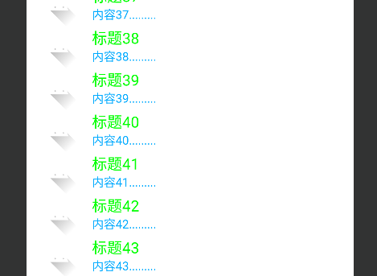


通过java代码设置

```java
listView.setDivider(getResources().getDrawable(R.color.purple_200));
listView.setDividerHeight(20);
```


#### 修改列表项的按压背景

若想取消按压列表项之时默认的水波背景，可在布局文件中设置也可在代码中设置，两种方式的注意点说明如下：

* 在布局文件中取消按压背景的话，直接将listSelector属性设置为@null并不合适，因为尽管设为 @null，按压列表项时仍出现橙色背景。只有把listSelector属性设置为透明色才算真正取消背景
* 在代码中取消按压背景的话，调用setSelector方法不能设置null值，因为null值会在运行时报空指 针异常。正确的做法是先从资源文件获得透明色的图形对象，再调用setSelector方法设置列表项的按压状态图形


图形shape1

```xml
<?xml version="1.0" encoding="utf-8"?>
<shape xmlns:android="http://schemas.android.com/apk/res/android">

    <solid android:color="@color/purple_200" />

    <corners android:radius="10dp" />

    <stroke
            android:color="@color/design_default_color_primary"
            android:width="4dp"
            android:dashWidth="3dp"
            android:dashGap="2dp" />

</shape>
```


```xml
<?xml version="1.0" encoding="utf-8"?>
<LinearLayout xmlns:android="http://schemas.android.com/apk/res/android"
        xmlns:tools="http://schemas.android.com/tools"
        xmlns:app="http://schemas.android.com/apk/res-auto"
        android:layout_width="match_parent"
        android:layout_height="match_parent"
        tools:context=".MainActivity"
        android:orientation="vertical">

    <ListView
            android:id="@+id/ListView"
            android:layout_width="match_parent"
            android:layout_height="wrap_content"
            android:listSelector="@drawable/shape1" />

</LinearLayout>
```


#### 列表视图的高度问题

在XML文件中，如果ListView后面还有其他平级的控件，就要将ListView的高度设为0dp，同时权重设为1，确保列表视图扩展到剩余的页面区域


button在后

```xml
<?xml version="1.0" encoding="utf-8"?>
<LinearLayout xmlns:android="http://schemas.android.com/apk/res/android"
        xmlns:tools="http://schemas.android.com/tools"
        xmlns:app="http://schemas.android.com/apk/res-auto"
        android:layout_width="match_parent"
        android:layout_height="match_parent"
        tools:context=".MainActivity"
        android:orientation="vertical">


    <ListView
            android:id="@+id/ListView"
            android:layout_width="match_parent"
            android:layout_height="wrap_content"
            android:listSelector="@drawable/shape1" />

    <Button
            android:layout_width="match_parent"
            android:layout_height="wrap_content"
            android:text="按钮" />

</LinearLayout>
```


按钮不显示


button在前

```xml
<?xml version="1.0" encoding="utf-8"?>
<LinearLayout xmlns:android="http://schemas.android.com/apk/res/android"
        xmlns:tools="http://schemas.android.com/tools"
        xmlns:app="http://schemas.android.com/apk/res-auto"
        android:layout_width="match_parent"
        android:layout_height="match_parent"
        tools:context=".MainActivity"
        android:orientation="vertical">


    <Button
            android:layout_width="match_parent"
            android:layout_height="wrap_content"
            android:text="按钮" />

    <ListView
            android:id="@+id/ListView"
            android:layout_width="match_parent"
            android:layout_height="wrap_content"
            android:listSelector="@drawable/shape1" />
    

</LinearLayout>
```


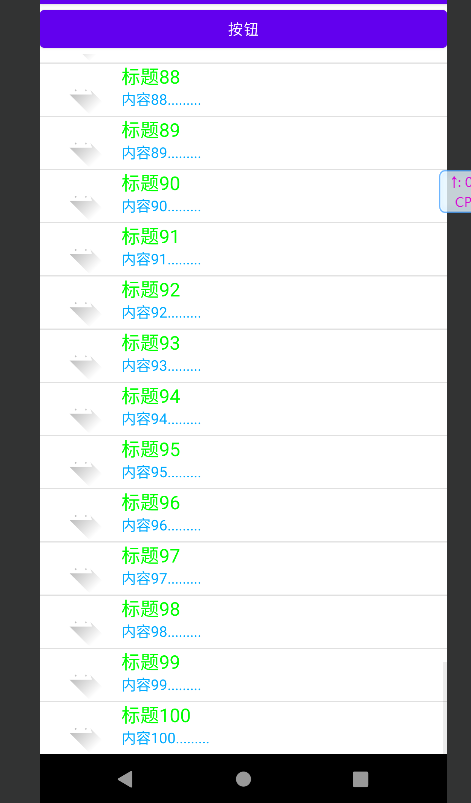


按钮被固定在了上面


解决方案

```xml
<?xml version="1.0" encoding="utf-8"?>
<LinearLayout xmlns:android="http://schemas.android.com/apk/res/android"
        xmlns:tools="http://schemas.android.com/tools"
        xmlns:app="http://schemas.android.com/apk/res-auto"
        android:layout_width="match_parent"
        android:layout_height="match_parent"
        tools:context=".MainActivity"
        android:orientation="vertical">


    <ListView
            android:id="@+id/ListView"
            android:layout_width="match_parent"
            android:layout_height="0dp"
            android:layout_weight="1"
            android:listSelector="@drawable/shape1" />

    <Button
            android:layout_width="match_parent"
            android:layout_height="wrap_content"
            android:text="按钮" />

</LinearLayout>
```


#### 滑动到底部加载新内容


```java
package mao.android_listview;

import androidx.appcompat.app.AppCompatActivity;

import android.app.AlertDialog;
import android.content.DialogInterface;
import android.os.Bundle;
import android.view.View;
import android.widget.AbsListView;
import android.widget.AdapterView;
import android.widget.ListView;
import android.widget.Toast;

import java.util.ArrayList;
import java.util.List;

import mao.android_listview.adapter.ListViewAdapter;
import mao.android_listview.entity.ListViewInfo;

public class MainActivity extends AppCompatActivity
{

    @Override
    protected void onCreate(Bundle savedInstanceState)
    {
        super.onCreate(savedInstanceState);
        setContentView(R.layout.activity_main);

        ListView listView = findViewById(R.id.ListView);

        List<ListViewInfo> list = new ArrayList<>(30);

        for (int i = 1; i <= 100; i++)
        {
            ListViewInfo listViewInfo = new ListViewInfo()
                    .setIcon(R.drawable.ic_launcher_foreground)
                    .setTitle("标题" + i)
                    .setContent("内容" + i + ".........");
            list.add(listViewInfo);
        }
        final int[] count = {100};

        ListViewAdapter listViewAdapter = new ListViewAdapter(this, list);

        listView.setAdapter(listViewAdapter);
        //listView.setDivider(getResources().getDrawable(R.color.purple_200));
        //listView.setDividerHeight(20);
        listView.setOnItemClickListener(new AdapterView.OnItemClickListener()
        {
            @Override
            public void onItemClick(AdapterView<?> parent, View view, int position, long id)
            {
                toastShow("第" + (position + 1) + "个被点击");
            }
        });
        listView.setOnItemLongClickListener(new AdapterView.OnItemLongClickListener()
        {
            @Override
            public boolean onItemLongClick(AdapterView<?> parent, View view, int position, long id)
            {
                toastShow("第" + (position + 1) + "个被长按了");
                AlertDialog.Builder builder = new AlertDialog.Builder(MainActivity.this);
                builder.setTitle("删除提示")
                        .setMessage("是否删除？")
                        .setPositiveButton("确认", new DialogInterface.OnClickListener()
                        {
                            @Override
                            public void onClick(DialogInterface dialog, int which)
                            {
                                list.remove(position);
                                listViewAdapter.notifyDataSetChanged();
                            }
                        })
                        .setNeutralButton("取消", null)
                        .create()
                        .show();
                return true;
            }
        });

        listView.setOnScrollListener(new AbsListView.OnScrollListener()
        {
            @Override
            public void onScrollStateChanged(AbsListView view, int scrollState)
            {

            }

            @Override
            public void onScroll(AbsListView view, int firstVisibleItem, int visibleItemCount, int totalItemCount)
            {
                if (firstVisibleItem + visibleItemCount == totalItemCount)
                {
                    View last_view = listView.getChildAt(listView.getChildCount() - 1);
                    if (last_view != null && last_view.getBottom() == listView.getHeight())
                    {
                        toastShow("滑动到底部了，正在加载新内容");
                        for (int i = count[0] + 1; i <= count[0] + 100; i++)
                        {
                            ListViewInfo listViewInfo = new ListViewInfo()
                                    .setIcon(R.drawable.ic_launcher_foreground)
                                    .setTitle("标题" + i)
                                    .setContent("内容" + i + ".........");
                            list.add(listViewInfo);
                        }
                        count[0] = count[0] + 100;
                        listViewAdapter.notifyDataSetChanged();
                    }
                }
            }
        });
    }

    /**
     * 显示消息
     *
     * @param message 消息
     */
    private void toastShow(String message)
    {
        Toast.makeText(this, message, Toast.LENGTH_SHORT).show();
    }
}
```


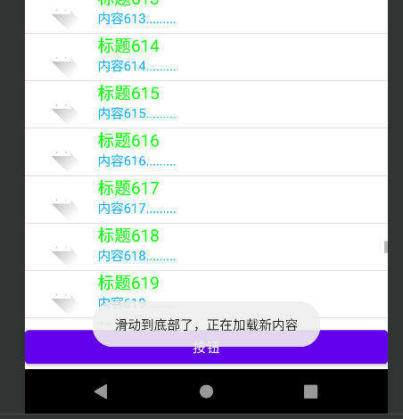


#### 实现上拉刷新


```java
package mao.android_listview;

import androidx.appcompat.app.AppCompatActivity;

import android.app.AlertDialog;
import android.content.DialogInterface;
import android.os.Bundle;
import android.view.View;
import android.widget.AbsListView;
import android.widget.AdapterView;
import android.widget.ListView;
import android.widget.Toast;

import java.util.ArrayList;
import java.util.List;

import mao.android_listview.adapter.ListViewAdapter;
import mao.android_listview.entity.ListViewInfo;

public class MainActivity extends AppCompatActivity
{

    @Override
    protected void onCreate(Bundle savedInstanceState)
    {
        super.onCreate(savedInstanceState);
        setContentView(R.layout.activity_main);

        ListView listView = findViewById(R.id.ListView);

        List<ListViewInfo> list = new ArrayList<>(30);

        for (int i = 1; i <= 100; i++)
        {
            ListViewInfo listViewInfo = new ListViewInfo()
                    .setIcon(R.drawable.ic_launcher_foreground)
                    .setTitle("标题" + i)
                    .setContent("内容" + i + ".........");
            list.add(listViewInfo);
        }
        final int[] count = {100};

        ListViewAdapter listViewAdapter = new ListViewAdapter(this, list);

        listView.setAdapter(listViewAdapter);
        //listView.setDivider(getResources().getDrawable(R.color.purple_200));
        //listView.setDividerHeight(20);
        listView.setOnItemClickListener(new AdapterView.OnItemClickListener()
        {
            @Override
            public void onItemClick(AdapterView<?> parent, View view, int position, long id)
            {
                toastShow("第" + (position + 1) + "个被点击");
            }
        });
        listView.setOnItemLongClickListener(new AdapterView.OnItemLongClickListener()
        {
            @Override
            public boolean onItemLongClick(AdapterView<?> parent, View view, int position, long id)
            {
                toastShow("第" + (position + 1) + "个被长按了");
                AlertDialog.Builder builder = new AlertDialog.Builder(MainActivity.this);
                builder.setTitle("删除提示")
                        .setMessage("是否删除？")
                        .setPositiveButton("确认", new DialogInterface.OnClickListener()
                        {
                            @Override
                            public void onClick(DialogInterface dialog, int which)
                            {
                                list.remove(position);
                                listViewAdapter.notifyDataSetChanged();
                            }
                        })
                        .setNeutralButton("取消", null)
                        .create()
                        .show();
                return true;
            }
        });

        final boolean[] canRefresh = {false};

        listView.setOnScrollListener(new AbsListView.OnScrollListener()
        {
            @Override
            public void onScrollStateChanged(AbsListView view, int scrollState)
            {

            }

            @Override
            public void onScroll(AbsListView view, int firstVisibleItem, int visibleItemCount, int totalItemCount)
            {
                if (firstVisibleItem == 0)
                {
                    View first_view = listView.getChildAt(0);
                    if (first_view != null && first_view.getTop() == 0)
                    {
                        if (canRefresh[0])
                        {
                            toastShow("正在刷新...");
                            list.clear();
                            for (int i = 1; i <= 100; i++)
                            {
                                ListViewInfo listViewInfo = new ListViewInfo()
                                        .setIcon(R.drawable.ic_launcher_foreground)
                                        .setTitle("新的标题" + i)
                                        .setContent("新的内容" + i + ".........");
                                list.add(listViewInfo);
                            }
                            count[0] = 100;
                            listViewAdapter.notifyDataSetChanged();
                            canRefresh[0] = false;
                        }
                    }
                    return;
                }
                if (firstVisibleItem > 0)
                {
                    canRefresh[0] = true;
                }
                if (firstVisibleItem + visibleItemCount == totalItemCount)
                {
                    View last_view = listView.getChildAt(listView.getChildCount() - 1);
                    if (last_view != null && last_view.getBottom() == listView.getHeight())
                    {
                        toastShow("滑动到底部了，正在加载新内容");
                        for (int i = count[0] + 1; i <= count[0] + 100; i++)
                        {
                            ListViewInfo listViewInfo = new ListViewInfo()
                                    .setIcon(R.drawable.ic_launcher_foreground)
                                    .setTitle("标题" + i)
                                    .setContent("内容" + i + ".........");
                            list.add(listViewInfo);
                        }
                        count[0] = count[0] + 100;
                        listViewAdapter.notifyDataSetChanged();
                    }
                }
            }
        });
    }

    /**
     * 显示消息
     *
     * @param message 消息
     */
    private void toastShow(String message)
    {
        Toast.makeText(this, message, Toast.LENGTH_SHORT).show();
    }
}
```


#### 实现再次上拉刷新


```java
package mao.android_listview;

import androidx.appcompat.app.AppCompatActivity;

import android.app.AlertDialog;
import android.content.DialogInterface;
import android.os.Bundle;
import android.view.View;
import android.widget.AbsListView;
import android.widget.AdapterView;
import android.widget.ListView;
import android.widget.Toast;

import java.util.ArrayList;
import java.util.List;

import mao.android_listview.adapter.ListViewAdapter;
import mao.android_listview.entity.ListViewInfo;

public class MainActivity extends AppCompatActivity
{

    @Override
    protected void onCreate(Bundle savedInstanceState)
    {
        super.onCreate(savedInstanceState);
        setContentView(R.layout.activity_main);

        ListView listView = findViewById(R.id.ListView);

        List<ListViewInfo> list = new ArrayList<>(30);

        for (int i = 1; i <= 100; i++)
        {
            ListViewInfo listViewInfo = new ListViewInfo()
                    .setIcon(R.drawable.ic_launcher_foreground)
                    .setTitle("标题" + i)
                    .setContent("内容" + i + ".........");
            list.add(listViewInfo);
        }
        final int[] count = {100};

        ListViewAdapter listViewAdapter = new ListViewAdapter(this, list);

        listView.setAdapter(listViewAdapter);
        //listView.setDivider(getResources().getDrawable(R.color.purple_200));
        //listView.setDividerHeight(20);
        listView.setOnItemClickListener(new AdapterView.OnItemClickListener()
        {
            @Override
            public void onItemClick(AdapterView<?> parent, View view, int position, long id)
            {
                toastShow("第" + (position + 1) + "个被点击");
            }
        });
        listView.setOnItemLongClickListener(new AdapterView.OnItemLongClickListener()
        {
            @Override
            public boolean onItemLongClick(AdapterView<?> parent, View view, int position, long id)
            {
                toastShow("第" + (position + 1) + "个被长按了");
                AlertDialog.Builder builder = new AlertDialog.Builder(MainActivity.this);
                builder.setTitle("删除提示")
                        .setMessage("是否删除？")
                        .setPositiveButton("确认", new DialogInterface.OnClickListener()
                        {
                            @Override
                            public void onClick(DialogInterface dialog, int which)
                            {
                                list.remove(position);
                                listViewAdapter.notifyDataSetChanged();
                            }
                        })
                        .setNeutralButton("取消", null)
                        .create()
                        .show();
                return true;
            }
        });

        final boolean[] canRefresh = {false};
        final long[] firstRefreshTime = {System.currentTimeMillis()};

        listView.setOnScrollListener(new AbsListView.OnScrollListener()
        {
            @Override
            public void onScrollStateChanged(AbsListView view, int scrollState)
            {

            }

            @Override
            public void onScroll(AbsListView view, int firstVisibleItem, int visibleItemCount, int totalItemCount)
            {
                if (firstVisibleItem == 0)
                {
                    View first_view = listView.getChildAt(0);
                    if (first_view != null && first_view.getTop() == 0)
                    {
                        if (canRefresh[0])
                        {

                            if (System.currentTimeMillis() - firstRefreshTime[0] > 3000)
                            {
                                toastShow("再次上划进行刷新页面");
                                firstRefreshTime[0] = System.currentTimeMillis();
                                return;
                            }
                            toastShow("正在刷新...");
                            list.clear();
                            for (int i = 1; i <= 100; i++)
                            {
                                ListViewInfo listViewInfo = new ListViewInfo()
                                        .setIcon(R.drawable.ic_launcher_foreground)
                                        .setTitle("新的标题" + i)
                                        .setContent("新的内容" + i + ".........");
                                list.add(listViewInfo);
                            }
                            count[0] = 100;
                            listViewAdapter.notifyDataSetChanged();
                            canRefresh[0] = false;
                        }
                    }
                    return;
                }
                if (firstVisibleItem > 0)
                {
                    canRefresh[0] = true;
                }
                if (firstVisibleItem + visibleItemCount == totalItemCount)
                {
                    View last_view = listView.getChildAt(listView.getChildCount() - 1);
                    if (last_view != null && last_view.getBottom() == listView.getHeight())
                    {
                        toastShow("滑动到底部了，正在加载新内容");
                        for (int i = count[0] + 1; i <= count[0] + 100; i++)
                        {
                            ListViewInfo listViewInfo = new ListViewInfo()
                                    .setIcon(R.drawable.ic_launcher_foreground)
                                    .setTitle("标题" + i)
                                    .setContent("内容" + i + ".........");
                            list.add(listViewInfo);
                        }
                        count[0] = count[0] + 100;
                        listViewAdapter.notifyDataSetChanged();
                    }
                }
            }
        });
    }

    /**
     * 显示消息
     *
     * @param message 消息
     */
    private void toastShow(String message)
    {
        Toast.makeText(this, message, Toast.LENGTH_SHORT).show();
    }
}
```


#### 列表项的点击问题

通常只要调用setOnItemClickListener方法设置点击监听器，点击列表项即可触发列表项的点击事件， 但是如果列表项中存在编辑框或按钮（含Button、ImageButton、Checkbox等），点击列表项就无法触发点击事件了。缘由在于编辑框和按钮这类控件会抢占焦点，因为它们要么等待用户输入、要么等待用户点击，按道理用户点击按钮确实应该触发按钮的点击事件，而非触发列表项的点击事件，可问题是用户点击列表项的其余区域，也由于焦点被抢占的缘故导致触发不了列表项的点击事件

为了规避焦点抢占的问题，列表视图允许开发者自行设置内部视图的焦点抢占方式，该方式在XML文件 中由descendantFocusability属性指定，在代码中由setDescendantFocusability方法设置

注意焦点抢占方式不是由ListView设置，而是由列表项的根布局设置


演示


```xml
<?xml version="1.0" encoding="utf-8"?>
<LinearLayout xmlns:android="http://schemas.android.com/apk/res/android"
        android:orientation="horizontal"
        android:layout_width="match_parent"
        android:layout_height="match_parent"
        android:gravity="center">

    <ImageView
            android:id="@+id/icon"
            android:layout_width="0dp"
            android:layout_height="50dp"
            android:layout_weight="1"
            android:scaleType="fitCenter" />


    <LinearLayout
            android:layout_width="0dp"
            android:layout_height="50dp"
            android:layout_weight="4"
            android:orientation="vertical">

        <TextView
                android:id="@+id/title"
                android:layout_width="match_parent"
                android:layout_height="wrap_content"
                android:textSize="18sp"
                android:textColor="#00ff00" />

        <TextView
                android:id="@+id/content"
                android:layout_width="match_parent"
                android:layout_height="wrap_content"
                android:textColor="#00aaff" />


    </LinearLayout>

    <Button
            android:id="@+id/Button"
            android:layout_width="0dp"
            android:layout_weight="1"
            android:layout_height="match_parent"
            android:text="按钮" />

</LinearLayout>
```


```java
package mao.android_listview.adapter;

import android.annotation.SuppressLint;
import android.app.AlertDialog;
import android.content.Context;
import android.view.LayoutInflater;
import android.view.View;
import android.view.ViewGroup;
import android.widget.BaseAdapter;
import android.widget.Button;
import android.widget.ImageView;
import android.widget.TextView;

import java.util.List;

import mao.android_listview.R;
import mao.android_listview.entity.ListViewInfo;

/**
 * Project name(项目名称)：android_ListView
 * Package(包名): mao.android_listview.adapter
 * Class(类名): ListViewAdapter
 * Author(作者）: mao
 * Author QQ：1296193245
 * GitHub：https://github.com/maomao124/
 * Date(创建日期)： 2022/10/3
 * Time(创建时间)： 14:46
 * Version(版本): 1.0
 * Description(描述)： 无
 */

public class ListViewAdapter extends BaseAdapter
{
    /**
     * 上下文
     */
    private final Context context;

    /**
     * 列表
     */
    private final List<ListViewInfo> list;

    public ListViewAdapter(Context context, List<ListViewInfo> list)
    {
        this.context = context;
        this.list = list;
    }

    /**
     * 得到集合的总数
     *
     * @return int
     */
    @Override
    public int getCount()
    {
        return list.size();
    }

    /**
     * 获取某个位置的ListViewInfo对象
     *
     * @param position 位置
     * @return {@link Object}
     */
    @Override
    public Object getItem(int position)
    {
        return list.get(position);
    }

    /**
     * 获取id
     *
     * @param position 位置
     * @return long
     */
    @Override
    public long getItemId(int position)
    {
        return position;
    }

    @SuppressLint("InflateParams")
    @Override
    public View getView(int position, View convertView, ViewGroup parent)
    {
        ListViewHolder listViewHolder;

        if (convertView == null)
        {
            listViewHolder = new ListViewHolder();
            convertView = LayoutInflater.from(context).inflate(R.layout.item_baseadaper, null);
            listViewHolder.icon = convertView.findViewById(R.id.icon);
            listViewHolder.title = convertView.findViewById(R.id.title);
            listViewHolder.content = convertView.findViewById(R.id.content);
            listViewHolder.button = convertView.findViewById(R.id.Button);
            listViewHolder.button.setOnClickListener(new View.OnClickListener()
            {
                @Override
                public void onClick(View v)
                {
                    new AlertDialog.Builder(context)
                            .setTitle("提示")
                            .setMessage("按钮被点击了,位于第" + (position + 1) + "个")
                            .setPositiveButton("确定", null)
                            .create()
                            .show();

                }
            });
            convertView.setTag(listViewHolder);
        }
        else
        {
            listViewHolder = (ListViewHolder) convertView.getTag();
        }
        ListViewInfo listViewInfo = list.get(position);
        listViewHolder.icon.setImageResource(listViewInfo.getIcon());
        listViewHolder.title.setText(listViewInfo.getTitle());
        listViewHolder.content.setText(listViewInfo.getContent());
        return convertView;
    }


    private static class ListViewHolder
    {
        /**
         * 图标
         */
        public ImageView icon;
        /**
         * 标题
         */
        public TextView title;
        /**
         * 内容
         */
        public TextView content;
        /**
         * 按钮
         */
        public Button button;
    }
}
```


运行


点击按钮有效，点击按钮外边的文字内容无效


更改为blocksDescendants


```xml
<?xml version="1.0" encoding="utf-8"?>
<LinearLayout xmlns:android="http://schemas.android.com/apk/res/android"
        android:orientation="horizontal"
        android:layout_width="match_parent"
        android:layout_height="match_parent"
        android:descendantFocusability="blocksDescendants"
        android:gravity="center">

    <ImageView
            android:id="@+id/icon"
            android:layout_width="0dp"
            android:layout_height="50dp"
            android:layout_weight="1"
            android:scaleType="fitCenter" />


    <LinearLayout
            android:layout_width="0dp"
            android:layout_height="50dp"
            android:layout_weight="4"
            android:orientation="vertical">

        <TextView
                android:id="@+id/title"
                android:layout_width="match_parent"
                android:layout_height="wrap_content"
                android:textSize="18sp"
                android:textColor="#00ff00" />

        <TextView
                android:id="@+id/content"
                android:layout_width="match_parent"
                android:layout_height="wrap_content"
                android:textColor="#00aaff" />


    </LinearLayout>

    <Button
            android:id="@+id/Button"
            android:layout_width="0dp"
            android:layout_weight="1"
            android:layout_height="match_parent"
            android:text="按钮" />

</LinearLayout>
```


列表项监听器可以触发


### 购物车项目ListView实现


只列出更改或者添加的部分


#### 布局文件

##### activity_shopping_cart

```xml
<LinearLayout xmlns:android="http://schemas.android.com/apk/res/android"
        xmlns:tools="http://schemas.android.com/tools"
        android:layout_width="match_parent"
        android:layout_height="match_parent"
        android:background="#ffaa"
        android:orientation="vertical">

    <include layout="@layout/title_shopping" />


    <RelativeLayout
            android:layout_width="match_parent"
            android:layout_height="wrap_content">

        <LinearLayout
                android:id="@+id/ll_content"
                android:layout_width="match_parent"
                android:layout_height="wrap_content"
                android:orientation="vertical"
                android:visibility="visible">

            <LinearLayout
                    android:layout_width="match_parent"
                    android:layout_height="wrap_content"
                    android:orientation="horizontal">

                <TextView
                        android:layout_width="85dp"
                        android:layout_height="wrap_content"
                        android:gravity="center"
                        android:text="图片"
                        android:textColor="@color/black"
                        android:textSize="15sp" />

                <TextView
                        android:layout_width="0dp"
                        android:layout_height="wrap_content"
                        android:layout_weight="3"
                        android:gravity="center"
                        android:text="名称"
                        android:textColor="@color/black"
                        android:textSize="15sp" />

                <TextView
                        android:layout_width="0dp"
                        android:layout_height="wrap_content"
                        android:layout_weight="1"
                        android:gravity="center"
                        android:text="数量"
                        android:textColor="@color/black"
                        android:textSize="15sp" />

                <TextView
                        android:layout_width="0dp"
                        android:layout_height="wrap_content"
                        android:layout_weight="1"
                        android:gravity="center"
                        android:text="单价"
                        android:textColor="@color/black"
                        android:textSize="15sp" />

                <TextView
                        android:layout_width="0dp"
                        android:layout_height="wrap_content"
                        android:layout_weight="1"
                        android:gravity="center"
                        android:text="总价"
                        android:textColor="@color/black"
                        android:textSize="15sp" />

            </LinearLayout>

            <!--                <LinearLayout-->
            <!--                        android:id="@+id/ll_cart"-->
            <!--                        android:layout_width="match_parent"-->
            <!--                        android:layout_height="wrap_content"-->
            <!--                        android:orientation="vertical" />-->

            <ListView
                    android:id="@+id/ListView_cart"
                    android:layout_width="match_parent"
                    android:layout_height="0dp"
                    android:layout_weight="1" />

            <LinearLayout
                    android:layout_width="match_parent"
                    android:layout_height="wrap_content"
                    android:orientation="horizontal"
                    android:padding="0dp">

                <Button
                        android:id="@+id/btn_clear"
                        android:layout_width="wrap_content"
                        android:layout_height="wrap_content"
                        android:gravity="center"
                        android:text="清空"
                        android:textColor="@color/black"
                        android:textSize="17sp" />

                <TextView
                        android:layout_width="0dp"
                        android:layout_height="wrap_content"
                        android:layout_weight="1"
                        android:gravity="center|right"
                        android:text="总金额："
                        android:textColor="@color/black"
                        android:textSize="17sp" />

                <TextView
                        android:id="@+id/tv_total_price"
                        android:layout_width="wrap_content"
                        android:layout_height="wrap_content"
                        android:layout_marginRight="10dp"
                        android:gravity="center|left"
                        android:textColor="#ff0000"
                        android:textSize="25sp" />

                <Button
                        android:id="@+id/btn_settle"
                        android:layout_width="wrap_content"
                        android:layout_height="wrap_content"
                        android:gravity="center"
                        android:text="结算"
                        android:textColor="@color/black"
                        android:textSize="17sp" />
            </LinearLayout>

        </LinearLayout>

        <LinearLayout
                android:id="@+id/ll_empty"
                android:layout_width="match_parent"
                android:layout_height="wrap_content"
                android:orientation="vertical"
                android:visibility="gone"
                tools:visibility="visible">

            <TextView
                    android:layout_width="match_parent"
                    android:layout_height="wrap_content"
                    android:layout_marginTop="100dp"
                    android:layout_marginBottom="100dp"
                    android:gravity="center"
                    android:text="哎呀，购物车空空如也，快去选购商品吧"
                    android:textColor="@color/black"
                    android:textSize="17sp" />

            <Button
                    android:id="@+id/btn_shopping_channel"
                    android:layout_width="match_parent"
                    android:layout_height="wrap_content"
                    android:gravity="center"
                    android:text="逛逛手机商场"
                    android:textColor="@color/black"
                    android:textSize="17sp" />
        </LinearLayout>

    </RelativeLayout>

</LinearLayout>
```


#### 实体类

##### CartListViewInfo

```java
package mao.android_shopping_cart_listview.entity;


/**
 * Project name(项目名称)：android_shopping_cart_ListView
 * Package(包名): mao.android_shopping_cart_listview.entity
 * Class(类名): CartListViewInfo
 * Author(作者）: mao
 * Author QQ：1296193245
 * GitHub：https://github.com/maomao124/
 * Date(创建日期)： 2022/10/3
 * Time(创建时间)： 21:01
 * Version(版本): 1.0
 * Description(描述)： 无
 */


public class CartListViewInfo
{
    /**
     * 商品id
     */
    private int goodsId;

    /**
     * 图片路径
     */
    private String picPath;

    /**
     * 名字
     */
    private String name;

    /**
     * desc
     */
    private String desc;

    /**
     * 数量
     */
    private int count;

    /**
     * 价格
     */
    private float price;

    /**
     * 总和
     */
    private int sum;

    /**
     * Instantiates a new Cart list view info.
     */
    public CartListViewInfo()
    {

    }

    /**
     * Instantiates a new Cart list view info.
     *
     * @param goodsId the goods id
     * @param picPath the pic path
     * @param name    the name
     * @param desc    the desc
     * @param count   the count
     * @param price   the price
     * @param sum     the sum
     */
    public CartListViewInfo(int goodsId, String picPath, String name, String desc, int count, float price, int sum)
    {
        this.goodsId = goodsId;
        this.picPath = picPath;
        this.name = name;
        this.desc = desc;
        this.count = count;
        this.price = price;
        this.sum = sum;
    }

    /**
     * Gets goods id.
     *
     * @return the goods id
     */
    public int getGoodsId()
    {
        return goodsId;
    }

    /**
     * Sets goods id.
     *
     * @param goodsId the goods id
     * @return the goods id
     */
    public CartListViewInfo setGoodsId(int goodsId)
    {
        this.goodsId = goodsId;
        return this;
    }

    /**
     * Gets pic path.
     *
     * @return the pic path
     */
    public String getPicPath()
    {
        return picPath;
    }

    /**
     * Sets pic path.
     *
     * @param picPath the pic path
     * @return the pic path
     */
    public CartListViewInfo setPicPath(String picPath)
    {
        this.picPath = picPath;
        return this;
    }

    /**
     * Gets name.
     *
     * @return the name
     */
    public String getName()
    {
        return name;
    }

    /**
     * Sets name.
     *
     * @param name the name
     * @return the name
     */
    public CartListViewInfo setName(String name)
    {
        this.name = name;
        return this;
    }

    /**
     * Gets desc.
     *
     * @return the desc
     */
    public String getDesc()
    {
        return desc;
    }

    /**
     * Sets desc.
     *
     * @param desc the desc
     * @return the desc
     */
    public CartListViewInfo setDesc(String desc)
    {
        this.desc = desc;
        return this;
    }

    /**
     * Gets count.
     *
     * @return the count
     */
    public int getCount()
    {
        return count;
    }

    /**
     * Sets count.
     *
     * @param count the count
     * @return the count
     */
    public CartListViewInfo setCount(int count)
    {
        this.count = count;
        return this;
    }

    /**
     * Gets price.
     *
     * @return the price
     */
    public float getPrice()
    {
        return price;
    }

    /**
     * Sets price.
     *
     * @param price the price
     * @return the price
     */
    public CartListViewInfo setPrice(float price)
    {
        this.price = price;
        return this;
    }

    /**
     * Gets sum.
     *
     * @return the sum
     */
    public int getSum()
    {
        return sum;
    }

    /**
     * Sets sum.
     *
     * @param sum the sum
     * @return the sum
     */
    public CartListViewInfo setSum(int sum)
    {
        this.sum = sum;
        return this;
    }

    @Override
    public boolean equals(Object o)
    {
        if (this == o) return true;
        if (o == null || getClass() != o.getClass()) return false;

        CartListViewInfo that = (CartListViewInfo) o;

        if (getGoodsId() != that.getGoodsId()) return false;
        if (getCount() != that.getCount()) return false;
        if (Float.compare(that.getPrice(), getPrice()) != 0) return false;
        if (getSum() != that.getSum()) return false;
        if (getPicPath() != null ? !getPicPath().equals(that.getPicPath()) : that.getPicPath() != null)
        {
            return false;
        }
        if (getName() != null ? !getName().equals(that.getName()) : that.getName() != null)
        {
            return false;
        }
        return getDesc() != null ? getDesc().equals(that.getDesc()) : that.getDesc() == null;
    }

    @Override
    public int hashCode()
    {
        int result = getGoodsId();
        result = 31 * result + (getPicPath() != null ? getPicPath().hashCode() : 0);
        result = 31 * result + (getName() != null ? getName().hashCode() : 0);
        result = 31 * result + (getDesc() != null ? getDesc().hashCode() : 0);
        result = 31 * result + getCount();
        result = 31 * result + (getPrice() != +0.0f ? Float.floatToIntBits(getPrice()) : 0);
        result = 31 * result + getSum();
        return result;
    }

    @Override
    @SuppressWarnings("all")
    public String toString()
    {
        final StringBuilder stringbuilder = new StringBuilder();
        stringbuilder.append("goodsId：").append(goodsId).append('\n');
        stringbuilder.append("picPath：").append(picPath).append('\n');
        stringbuilder.append("name：").append(name).append('\n');
        stringbuilder.append("desc：").append(desc).append('\n');
        stringbuilder.append("count：").append(count).append('\n');
        stringbuilder.append("price：").append(price).append('\n');
        stringbuilder.append("sum：").append(sum).append('\n');
        return stringbuilder.toString();
    }
}
```


#### 基本适配器类

##### CartListViewAdapter

```java
package mao.android_shopping_cart_listview.adapter;

import android.annotation.SuppressLint;
import android.content.Context;
import android.net.Uri;
import android.view.LayoutInflater;
import android.view.View;
import android.view.ViewGroup;
import android.widget.BaseAdapter;
import android.widget.ImageView;
import android.widget.TextView;

import java.util.List;

import mao.android_shopping_cart_listview.R;
import mao.android_shopping_cart_listview.entity.CartListViewInfo;

/**
 * Project name(项目名称)：android_shopping_cart_ListView
 * Package(包名): mao.android_shopping_cart_listview.adapter
 * Class(类名): CartListViewAdapter
 * Author(作者）: mao
 * Author QQ：1296193245
 * GitHub：https://github.com/maomao124/
 * Date(创建日期)： 2022/10/3
 * Time(创建时间)： 21:09
 * Version(版本): 1.0
 * Description(描述)： 无
 */

public class CartListViewAdapter extends BaseAdapter
{

    /**
     * 上下文
     */
    private final Context context;

    /**
     * 列表
     */
    private final List<CartListViewInfo> list;

    /**
     * 购物车列表视图适配器
     *
     * @param context 上下文
     * @param list    列表
     */
    public CartListViewAdapter(Context context, List<CartListViewInfo> list)
    {
        this.context = context;
        this.list = list;
    }

    /**
     * 得到总数
     *
     * @return int
     */
    @Override
    public int getCount()
    {
        return list.size();
    }

    /**
     * 获取CartListViewInfo
     *
     * @param position 位置
     * @return {@link Object}
     */
    @Override
    public Object getItem(int position)
    {
        return list.get(position);
    }

    /**
     * 获取CartListViewInfo的id
     *
     * @param position 位置
     * @return long
     */
    @Override
    public long getItemId(int position)
    {
        return position;
    }

    /**
     * 得到视图
     *
     * @param position    位置
     * @param convertView 将视图
     * @param parent      ViewGroup
     * @return {@link View}
     */
    @SuppressLint("InflateParams")
    @Override
    public View getView(int position, View convertView, ViewGroup parent)
    {
        CartListViewHolder cartListViewHolder;
        if (convertView == null)
        {
            cartListViewHolder = new CartListViewHolder();
            convertView = LayoutInflater.from(context).inflate(R.layout.item_cart, null);
            cartListViewHolder.iv_thumb = convertView.findViewById(R.id.iv_thumb);
            cartListViewHolder.tv_name = convertView.findViewById(R.id.tv_name);
            cartListViewHolder.tv_desc = convertView.findViewById(R.id.tv_desc);
            cartListViewHolder.tv_count = convertView.findViewById(R.id.tv_count);
            cartListViewHolder.tv_price = convertView.findViewById(R.id.tv_price);
            cartListViewHolder.tv_sum = convertView.findViewById(R.id.tv_sum);
            convertView.setTag(cartListViewHolder);
        }
        else
        {
            cartListViewHolder = (CartListViewHolder) convertView.getTag();
        }
        CartListViewInfo cartListViewInfo = list.get(position);
        cartListViewHolder.iv_thumb.setImageURI(Uri.parse(cartListViewInfo.getPicPath()));
        cartListViewHolder.tv_name.setText(cartListViewInfo.getName());
        cartListViewHolder.tv_desc.setText(cartListViewInfo.getDesc());
        cartListViewHolder.tv_count.setText(String.valueOf(cartListViewInfo.getCount()));
        cartListViewHolder.tv_price.setText(String.valueOf((int) cartListViewInfo.getPrice()));
        // 设置商品总价
        cartListViewHolder.tv_sum.setText(String.valueOf((int) (cartListViewInfo.getCount() * cartListViewInfo.getPrice())));
        return convertView;
    }


    /**
     * 购物车列表视图持有人
     *
     * @author mao
     * @date 2022/10/03
     */
    private static class CartListViewHolder
    {
        public ImageView iv_thumb;
        public TextView tv_name;
        public TextView tv_desc;
        public TextView tv_count;
        public TextView tv_price;
        public TextView tv_sum;
    }
}
```


#### activity

##### ShoppingCartActivity

```java
package mao.android_shopping_cart_listview;

import android.annotation.SuppressLint;
import android.app.AlertDialog;
import android.content.Intent;
import android.net.Uri;
import android.os.Bundle;
import android.util.Log;
import android.view.LayoutInflater;
import android.view.View;
import android.widget.AdapterView;
import android.widget.ImageView;
import android.widget.LinearLayout;
import android.widget.ListView;
import android.widget.TextView;
import android.widget.Toast;

import androidx.appcompat.app.AppCompatActivity;

import java.util.ArrayList;
import java.util.HashMap;
import java.util.List;
import java.util.Map;

import mao.android_shopping_cart_listview.adapter.CartListViewAdapter;
import mao.android_shopping_cart_listview.application.MainApplication;
import mao.android_shopping_cart_listview.dao.CartDao;
import mao.android_shopping_cart_listview.dao.GoodsDao;
import mao.android_shopping_cart_listview.entity.CartInfo;
import mao.android_shopping_cart_listview.entity.CartListViewInfo;
import mao.android_shopping_cart_listview.entity.GoodsInfo;


/**
 * Project name(项目名称)：android_shopping
 * Package(包名): mao.android_shopping
 * Class(类名): ShoppingCartActivity
 * Author(作者）: mao
 * Author QQ：1296193245
 * GitHub：https://github.com/maomao124/
 * Date(创建日期)： 2022/9/29
 * Time(创建时间)： 20:58
 * Version(版本): 1.0
 * Description(描述)： 购物车页
 */

public class ShoppingCartActivity extends AppCompatActivity implements View.OnClickListener
{
    private TextView tv_count;
    //private LinearLayout ll_cart;
    ListView listView_cart;

    // 声明一个购物车中的商品信息列表
    private List<CartInfo> mCartList;
    // 声明一个根据商品编号查找商品信息的映射，把商品信息缓存起来，这样不用每一次都去查询数据库
    private final Map<Integer, GoodsInfo> mGoodsMap = new HashMap<>();
    private TextView tv_total_price;
    private LinearLayout ll_empty;
    private LinearLayout ll_content;
    private CartDao cartDao;
    private GoodsDao goodsDao;

    private final List<CartListViewInfo> list = new ArrayList<>();

    /**
     * 标签
     */
    private static final String TAG = "ShoppingCartActivity";

    /**
     * 购物车列表视图适配器
     */
    private final CartListViewAdapter cartListViewAdapter = new CartListViewAdapter(this, list);

    @Override
    protected void onCreate(Bundle savedInstanceState)
    {
        super.onCreate(savedInstanceState);
        Log.d(TAG, "onCreate: ");
        setContentView(R.layout.activity_shopping_cart);
        TextView tv_title = findViewById(R.id.tv_title);
        tv_title.setText("购物车");
        listView_cart = findViewById(R.id.ListView_cart);
        tv_total_price = findViewById(R.id.tv_total_price);

        tv_count = findViewById(R.id.tv_count);
        tv_count.setText(String.valueOf(MainApplication.getInstance().count));

        cartDao = CartDao.getInstance(this);
        cartDao.openReadConnection();
        cartDao.openWriteConnection();

        goodsDao = GoodsDao.getInstance(this);
        goodsDao.openReadConnection();
        goodsDao.openWriteConnection();

        findViewById(R.id.iv_back).setOnClickListener(this);
        findViewById(R.id.btn_shopping_channel).setOnClickListener(this);
        findViewById(R.id.btn_clear).setOnClickListener(this);
        findViewById(R.id.btn_settle).setOnClickListener(this);
        ll_empty = findViewById(R.id.ll_empty);
        ll_content = findViewById(R.id.ll_content);
    }

    @Override
    protected void onDestroy()
    {
        super.onDestroy();
        Log.d(TAG, "onDestroy: ");
        //cartDao.closeConnection();
        //goodsDao.closeConnection();
    }

    @Override
    protected void onResume()
    {
        super.onResume();
        showCart();
    }

    /**
     * 展示购物车中的商品列表
     */
    /*private void showCart()
    {
        // 移除下面的所有子视图
        ll_cart.removeAllViews();
        // 查询购物车数据库中所有的商品记录
        mCartList = cartDao.queryAll();
        if (mCartList.size() == 0)
        {
            Log.d(TAG, "showCart: 购物车为空");
            ll_empty.setVisibility(View.VISIBLE);
            ll_content.setVisibility(View.GONE);
            return;
        }

        for (CartInfo cartInfo : mCartList)
        {
            // 根据商品编号查询商品数据库中的商品记录
            GoodsInfo goods = goodsDao.queryById(cartInfo.getGoodsId());
            mGoodsMap.put(cartInfo.getGoodsId(), goods);

            // 获取布局文件item_cart.xml的根视图
            View view = LayoutInflater.from(this).inflate(R.layout.item_cart, null);
            ImageView iv_thumb = view.findViewById(R.id.iv_thumb);
            TextView tv_name = view.findViewById(R.id.tv_name);
            TextView tv_desc = view.findViewById(R.id.tv_desc);
            TextView tv_count = view.findViewById(R.id.tv_count);
            TextView tv_price = view.findViewById(R.id.tv_price);
            TextView tv_sum = view.findViewById(R.id.tv_sum);

            iv_thumb.setImageURI(Uri.parse(goods.getPicPath()));
            tv_name.setText(goods.getName());
            tv_desc.setText(goods.getDescription());
            tv_count.setText(String.valueOf(cartInfo.getCount()));
            tv_price.setText(String.valueOf((int) goods.getPrice()));
            // 设置商品总价
            tv_sum.setText(String.valueOf((int) (cartInfo.getCount() * goods.getPrice())));

            // 给商品行添加长按事件。长按商品行就删除该商品
            view.setOnLongClickListener(v ->
            {
                AlertDialog.Builder builder = new AlertDialog.Builder(ShoppingCartActivity.this);
                builder.setMessage("是否从购物车删除" + goods.getName() + "？");
                builder.setPositiveButton("是", (dialog, which) ->
                {
                    // 移除当前视图
                    ll_cart.removeView(v);
                    // 删除该商品
                    deleteGoods(cartInfo);
                });
                builder.setNegativeButton("否", null);
                builder.create().show();
                return true;
            });

            // 给商品行添加点击事件。点击商品行跳到商品的详情页
            view.setOnClickListener(v ->
            {
                Intent intent = new Intent(ShoppingCartActivity.this, ShoppingDetailActivity.class);
                intent.putExtra("goods_id", goods.getId());
                startActivity(intent);
            });

            // 往购物车列表添加该商品行
            ll_cart.addView(view);
        }

        // 重新计算购物车中的商品总金额
        refreshTotalPrice();
    }*/


    /**
     * 展示购物车中的商品列表
     */
    private void showCart()
    {
        // 查询购物车数据库中所有的商品记录
        list.clear();
        mCartList = cartDao.queryAll();
        if (mCartList.size() == 0)
        {
            Log.d(TAG, "showCart: 购物车为空");
            ll_empty.setVisibility(View.VISIBLE);
            ll_content.setVisibility(View.GONE);
            return;
        }

        for (CartInfo cartInfo : mCartList)
        {
            // 根据商品编号查询商品数据库中的商品记录
            GoodsInfo goods = goodsDao.queryById(cartInfo.getGoodsId());
            mGoodsMap.put(cartInfo.getGoodsId(), goods);


            CartListViewInfo cartListViewInfo = new CartListViewInfo()
                    .setGoodsId(goods.getId())
                    .setPicPath(goods.getPicPath())
                    .setName(goods.getName())
                    .setDesc(goods.getDescription())
                    .setCount(cartInfo.getCount())
                    .setPrice((int) goods.getPrice())
                    .setSum((int) (cartInfo.getCount() * goods.getPrice()));


            list.add(cartListViewInfo);
        }

        listView_cart.setAdapter(cartListViewAdapter);
        listView_cart.setOnItemLongClickListener(new AdapterView.OnItemLongClickListener()
        {
            @Override
            public boolean onItemLongClick(AdapterView<?> parent, View view, int position, long id)
            {
                AlertDialog.Builder builder = new AlertDialog.Builder(ShoppingCartActivity.this);
                builder.setMessage("是否从购物车删除" + list.get(position).getName() + "？");
                builder.setPositiveButton("是", (dialog, which) ->
                {
                    CartListViewInfo cartListViewInfo = list.remove(position);
                    // 删除该商品
                    deleteGoods(new CartInfo().setGoodsId(cartListViewInfo.getGoodsId())
                            .setCount(cartListViewInfo.getCount()));
                    cartListViewAdapter.notifyDataSetChanged();
                });
                builder.setNegativeButton("否", null);
                builder.create().show();
                return true;
            }
        });
        listView_cart.setOnItemClickListener(new AdapterView.OnItemClickListener()
        {
            @Override
            public void onItemClick(AdapterView<?> parent, View view, int position, long id)
            {
                Intent intent = new Intent(ShoppingCartActivity.this, ShoppingDetailActivity.class);
                intent.putExtra("goods_id", list.get(position).getGoodsId());
                startActivity(intent);
            }
        });

        // 重新计算购物车中的商品总金额
        refreshTotalPrice();
    }

    /**
     * 删除商品
     *
     * @param info 信息
     */
    private void deleteGoods(CartInfo info)
    {
        MainApplication.getInstance().count -= info.getCount();
        // 从购物车的数据库中删除商品
        cartDao.deleteByGoodsId(info.getGoodsId());
        // 从购物车的列表中删除商品
        CartInfo removed = null;
        for (CartInfo cartInfo : mCartList)
        {
            if (cartInfo.getGoodsId() == info.getGoodsId())
            {
                removed = cartInfo;
                break;
            }
        }
        mCartList.remove(removed);
        // 显示最新的商品数量
        showCount();
        toastShow("已从购物车删除" + mGoodsMap.get(info.getGoodsId()).getName());
        mGoodsMap.remove(info.getGoodsId());
        // 刷新购物车中所有商品的总金额
        refreshTotalPrice();
    }

    // 显示购物车图标中的商品数量
    private void showCount()
    {
        tv_count.setText(String.valueOf(MainApplication.getInstance().count));
        // 购物车中没有商品，显示“空空如也”
        if (MainApplication.getInstance().count == 0)
        {
            ll_empty.setVisibility(View.VISIBLE);
            ll_content.setVisibility(View.GONE);
            list.clear();
            cartListViewAdapter.notifyDataSetChanged();
        }
        else
        {
            ll_content.setVisibility(View.VISIBLE);
            ll_empty.setVisibility(View.GONE);
        }
    }

    // 重新计算购物车中的商品总金额
    private void refreshTotalPrice()
    {
        int totalPrice = 0;
        for (CartInfo cartInfo : mCartList)
        {
            GoodsInfo goods = mGoodsMap.get(cartInfo.getGoodsId());
            totalPrice += goods.getPrice() * cartInfo.getCount();
        }
        tv_total_price.setText(String.valueOf(totalPrice));
    }

    @SuppressLint("NonConstantResourceId")
    @Override
    public void onClick(View v)
    {
        switch (v.getId())
        {
            case R.id.iv_back:
                // 点击了返回图标
                // 关闭当前页面
                finish();
                break;

            case R.id.btn_shopping_channel:
                // 从购物车页面跳到商场页面
                Intent intent = new Intent(this, ShoppingChannelActivity.class);
                intent.setFlags(Intent.FLAG_ACTIVITY_CLEAR_TOP);
                startActivity(intent);
                break;

            case R.id.btn_clear:
                // 清空购物车数据库
                cartDao.deleteAll();
                MainApplication.getInstance().count = 0;
                // 显示最新的商品数量
                showCount();
                toastShow("购物车已清空");
                break;

            case R.id.btn_settle:
                // 点击了“结算”按钮
                AlertDialog.Builder builder = new AlertDialog.Builder(this);
                builder.setTitle("结算商品");
                builder.setMessage("请求发送失败");
                builder.setPositiveButton("我知道了", null);
                builder.create().show();
                break;
        }
    }

    /**
     * 显示消息
     *
     * @param message 消息
     */
    private void toastShow(String message)
    {
        Toast.makeText(this, message, Toast.LENGTH_SHORT).show();
    }
}
```


##### ShoppingChannelActivity

添加连续点击两次右上角的返回键才会退出到桌面的功能


```java
package mao.android_shopping_cart_listview;

import android.annotation.SuppressLint;
import android.content.Intent;
import android.graphics.Bitmap;
import android.graphics.BitmapFactory;
import android.os.Bundle;
import android.os.Environment;
import android.util.Log;
import android.view.LayoutInflater;
import android.view.View;
import android.widget.Button;
import android.widget.GridLayout;
import android.widget.ImageView;
import android.widget.LinearLayout;
import android.widget.TextView;
import android.widget.Toast;

import androidx.appcompat.app.AppCompatActivity;

import java.io.File;
import java.io.FileInputStream;
import java.io.FileOutputStream;
import java.util.List;

import mao.android_shopping_cart_listview.application.MainApplication;
import mao.android_shopping_cart_listview.dao.CartDao;
import mao.android_shopping_cart_listview.dao.GoodsDao;
import mao.android_shopping_cart_listview.entity.GoodsInfo;
import mao.android_shopping_cart_listview.entity.Result;


/**
 * Class(类名): ShoppingChannelActivity
 * Author(作者）: mao
 * Author QQ：1296193245
 * GitHub：https://github.com/maomao124/
 * Version(版本): 1.0
 * Description(描述)： 商品列表页
 */

public class ShoppingChannelActivity extends AppCompatActivity implements View.OnClickListener
{

    private TextView tv_count;
    private GridLayout gl_channel;
    private GoodsDao goodsDao;
    private CartDao cartDao;

    private static final String TAG = "ShoppingChannelActivity";

    @Override
    protected void onCreate(Bundle savedInstanceState)
    {
        super.onCreate(savedInstanceState);
        Log.d(TAG, "onCreate: ");
        setContentView(R.layout.activity_shopping_channel);
        TextView tv_title = findViewById(R.id.tv_title);
        tv_title.setText("手机商城");

        tv_count = findViewById(R.id.tv_count);
        gl_channel = findViewById(R.id.gl_channel);
        findViewById(R.id.iv_back).setOnClickListener(this);
        findViewById(R.id.iv_cart).setOnClickListener(this);

        goodsDao = GoodsDao.getInstance(this);
        goodsDao.openReadConnection();
        goodsDao.openWriteConnection();

        cartDao = CartDao.getInstance(this);
        cartDao.openReadConnection();
        cartDao.openWriteConnection();

        long count = goodsDao.getCount();
        Log.d(TAG, "onCreate: count:" + count);

        if (count == 0)
        {
            List<GoodsInfo> list = GoodsInfo.getDefaultList();
            Log.d(TAG, "onCreate: \n" + list);

            //list.forEach(goodsDao::insert);

//            for (GoodsInfo goodsInfo : list)
//            {
//                Bitmap bitmap = BitmapFactory.decodeResource(getResources(), goodsInfo.getPic());
//                String path = getExternalFilesDir(Environment.DIRECTORY_DOWNLOADS).toString() + "/" + goodsInfo.getId() + ".jpg";
//                saveImage(path, bitmap);
//                goodsInfo.setPicPath(path);
//                boolean insert = goodsDao.insert(goodsInfo);
//                if (insert)
//                {
//                    //toastShow("已初始化数据");
//                }
//                else
//                {
//                    toastShow("初始化数据失败");
//                }
//            }

            toastShow("正在初始化数据");
            for (GoodsInfo goodsInfo : list)
            {
                //Bitmap bitmap = BitmapFactory.decodeResource(getResources(), goodsInfo.getPic());
                //String path = getExternalFilesDir(Environment.DIRECTORY_DOWNLOADS).toString() + "/" + goodsInfo.getId() + ".jpg";
                //saveImage(path, bitmap);
                //goodsInfo.setPicPath(path);
                boolean insert = goodsDao.insert(goodsInfo);
                if (insert)
                {
                    //toastShow("已初始化数据");
                }
                else
                {
                    //toastShow("初始化数据失败");
                }
            }


//            boolean insert = goodsDao.insert(list);
//            if (insert)
//            {
//                toastShow("已初始化数据");
//            }
//            else
//            {
//                toastShow("初始化数据失败");
//            }
        }

        // 从数据库查询出商品信息，并展示
        showGoods();
    }

    @Override
    protected void onResume()
    {
        super.onResume();
        // 查询购物车商品总数，并展示
        showCartInfoTotal();
    }

    // 查询购物车商品总数，并展示
    private void showCartInfoTotal()
    {
        int count = cartDao.queryAll().size();
        MainApplication.getInstance().count = count;
        tv_count.setText(String.valueOf(count));
    }

    /**
     * 展示商品
     */
    private void showGoods()
    {
        // 商品条目是一个线性布局，设置布局的宽度为屏幕的一半
        int screenWidth = getResources().getDisplayMetrics().widthPixels;
        LinearLayout.LayoutParams params = new LinearLayout.LayoutParams(screenWidth / 2, LinearLayout.LayoutParams.WRAP_CONTENT);
        // 查询商品数据库中的所有商品记录
        List<GoodsInfo> list = goodsDao.queryAll();

        // 移除下面的所有子视图
        gl_channel.removeAllViews();

        for (GoodsInfo goodsInfo : list)
        {
            Log.d(TAG, "showGoods: \n" + goodsInfo);
            // 获取布局文件item_goods.xml的根视图
            View view = LayoutInflater.from(this).inflate(R.layout.item_goods, null);
            ImageView iv_thumb = view.findViewById(R.id.iv_thumb);
            TextView tv_name = view.findViewById(R.id.tv_name);
            TextView tv_price = view.findViewById(R.id.tv_price);
            Button btn_add = view.findViewById(R.id.btn_add);

            //给控件设置值
            //iv_thumb.setImageURI(Uri.parse(goodsInfo.getPicPath()));
            iv_thumb.setImageBitmap(getImageBitmap(goodsInfo));
            tv_name.setText(goodsInfo.getName());
            tv_price.setText(String.valueOf((int) goodsInfo.getPrice()));

            // 添加到购物车
            btn_add.setOnClickListener(v ->
            {
                addToCart(goodsInfo.getId(), goodsInfo.getName());
            });

            // 点击商品图片，跳转到商品详情页面
            iv_thumb.setOnClickListener(v ->
            {
                Intent intent = new Intent(ShoppingChannelActivity.this, ShoppingDetailActivity.class);
                intent.putExtra("goods_id", goodsInfo.getId());
                startActivity(intent);
            });

            // 把商品视图添加到网格布局
            gl_channel.addView(view, params);
        }
    }

    // 把指定编号的商品添加到购物车
    private void addToCart(int goodsId, String goodsName)
    {
        // 购物车商品数量+1
        int count = ++MainApplication.getInstance().count;
        tv_count.setText(String.valueOf(count));

        cartDao.insertCartInfo(goodsId);

        toastShow("已添加一部" + goodsName + "到购物车");
    }

    @Override
    protected void onDestroy()
    {
        super.onDestroy();
        Log.d(TAG, "onDestroy: ");
        goodsDao.closeConnection();
        cartDao.closeConnection();
    }

    /**
     * 开始时间
     */
    long startTime = System.currentTimeMillis() - 2000;

    @SuppressLint("NonConstantResourceId")
    @Override
    public void onClick(View v)
    {
        switch (v.getId())
        {
            case R.id.iv_back:
                // 点击了返回图标，关闭当前页面
                if (System.currentTimeMillis() - startTime > 2000)
                {
                    toastShow("再按一次返回键退出到桌面");
                    startTime = System.currentTimeMillis();
                    return;
                }
                finish();
                break;

            case R.id.iv_cart:
                // 点击了购物车图标
                // 从商场页面跳到购物车页面
                Intent intent = new Intent(this, ShoppingCartActivity.class);
                // 设置启动标志，避免多次返回同一页面的
                intent.setFlags(Intent.FLAG_ACTIVITY_CLEAR_TOP);
                startActivity(intent);
                break;
        }
    }

    /**
     * 显示消息
     *
     * @param message 消息
     */
    private void toastShow(String message)
    {
        Toast.makeText(this, message, Toast.LENGTH_SHORT).show();
    }

    /**
     * 把位图数据保存到指定路径的图片文件
     *
     * @param path   路径
     * @param bitmap Bitmap对象
     */
    public static boolean saveImage(String path, Bitmap bitmap)
    {
        // 根据指定的文件路径构建文件输出流对象
        try (FileOutputStream fileOutputStream = new FileOutputStream(path))
        {
            // 把位图数据压缩到文件输出流中
            bitmap.compress(Bitmap.CompressFormat.JPEG, 80, fileOutputStream);
            return true;
        }
        catch (Exception e)
        {
            e.printStackTrace();
            return false;
        }
    }

    /**
     * 从指定路径的图片文件中读取位图数据
     *
     * @param path 路径
     * @return {@link Bitmap}
     */
    public static Bitmap openImage(String path)
    {
        // 声明一个位图对象
        Bitmap bitmap = null;
        // 根据指定的文件路径构建文件输入流对象
        try (FileInputStream fileInputStream = new FileInputStream(path))
        {
            // 从文件输入流中解码位图数据
            bitmap = BitmapFactory.decodeStream(fileInputStream);
        }
        catch (Exception e)
        {
            e.printStackTrace();
        }
        return bitmap;
    }

    /**
     * 从指定路径的图片文件中读取位图数据
     *
     * @param file File对象
     * @return {@link Bitmap}
     */
    public static Bitmap openImage(File file)
    {
        // 声明一个位图对象
        Bitmap bitmap = null;
        // 根据指定的文件路径构建文件输入流对象
        try (FileInputStream fileInputStream = new FileInputStream(file))
        {
            // 从文件输入流中解码位图数据
            bitmap = BitmapFactory.decodeStream(fileInputStream);
        }
        catch (Exception e)
        {
            e.printStackTrace();
        }
        return bitmap;
    }

    /**
     * 得到图像位图
     *
     * @param goodsInfo GoodsInfo对象
     * @return {@link Bitmap}
     */
    public Bitmap getImageBitmap(GoodsInfo goodsInfo)
    {
        if (goodsInfo.getPicPath() != null && !"".equals(goodsInfo.getPicPath()))
        {
            Log.d(TAG, "getImageBitmap: 加载图片");
            Bitmap bitmap = openImage(goodsInfo.getPicPath());
            if (bitmap != null)
            {
                //GoodsInfo里有缓存的图片路径，并且加载到了图片的路径，直接返回
                return bitmap;
            }
            Log.d(TAG, "getImageBitmap: 本地图片缓存不存在，需要重新加载：" + goodsInfo.getId());
            //GoodsInfo里有缓存的图片路径，但是没有加载到图片的路径
            //图片不存在，路径失效，需要再次从网络加载
            Log.d(TAG, "getImageBitmap: 从网络上加载图片");
            Result result = getImageBitmapByHTTP(goodsInfo);
            bitmap = result.getBitmap();
            if (!result.isResult())
            {
                //从网络上加载失败失败，直接使用
                return bitmap;
            }
            //保存
            String path = getExternalFilesDir(Environment.DIRECTORY_DOWNLOADS).toString() + "/" + goodsInfo.getId() + ".jpg";
            Log.d(TAG, "getImageBitmap: 保存图片，位置：" + path);
            boolean b = saveImageBitmap(goodsInfo, bitmap, path);
            if (!b)
            {
                //保存失败，直接使用
                return bitmap;
            }
            //保存成功
            //更新数据库
            goodsInfo.setPicPath(path);
            goodsDao.update(goodsInfo);
            Log.d(TAG, "getImageBitmap: 更新数据库");
            return bitmap;
        }
        Log.d(TAG, "getImageBitmap: 第一次加载图片");
        //不存在，第一次加载
        Result result = getImageBitmapByHTTP(goodsInfo);
        Bitmap bitmap = result.getBitmap();
        if (!result.isResult())
        {
            //从网络上加载失败失败，直接使用
            return bitmap;
        }
        //保存
        String path = getExternalFilesDir(Environment.DIRECTORY_DOWNLOADS).toString() + "/" + goodsInfo.getId() + ".jpg";
        boolean b = saveImageBitmap(goodsInfo, bitmap, path);
        if (!b)
        {
            //保存失败，直接使用
            return bitmap;
        }
        //保存成功
        //更新数据库
        goodsInfo.setPicPath(path);
        goodsDao.update(goodsInfo);
        Log.d(TAG, "getImageBitmap: 更新数据库");
        return bitmap;
    }

    /**
     * 保存图像位图
     *
     * @param goodsInfo 货物信息
     */
    public boolean saveImageBitmap(GoodsInfo goodsInfo, Bitmap bitmap, String path)
    {
        return saveImage(path, bitmap);
    }


    /**
     * 模拟从网络上获取图片
     *
     * @return {@link Bitmap}
     */
    public Result getImageBitmapByHTTP(GoodsInfo goodsInfo)
    {
        Bitmap bitmap = BitmapFactory.decodeResource(getResources(), goodsInfo.getPic());
        if (bitmap == null)
        {
            //为空，加载默认的图片
            bitmap = BitmapFactory.decodeResource(getResources(), R.drawable.test);
            return new Result().setResult(false).setBitmap(bitmap);
        }
        return new Result().setResult(true).setBitmap(bitmap);
    }

}
```


#### 运行


清空和结算按钮始终在屏幕底部


### 网格视图GridView

除了列表视图，网格视图GridView也是常见的列表类视图，它用于分行分列显示表格信息，比列表视图更适合展示物品清单。除了沿用列表视图的3个方法setAdapter、setOnItemClickListener、 setOnItemLongClickListener，网格视图还新增了部分属性与方法


| XML中的属性 | GridView类的设置方法 | 说明 |
| :---------: | :------------------: | :--: |
|horizontalSpacing| setHorizontalSpacing| 指定网格项在水平方向的间距|
|verticalSpacing |setVerticalSpacing |指定网格项在垂直方向的间距|
|numColumns |setNumColumns |指定列的数目|
|stretchMode| setStretchMode |指定剩余空间的拉伸模式|
|columnWidth |setColumnWidth |指定每列的宽度。拉伸模式为spacingWidthspacingWidthUniform时，必须指定列宽|


| XML中的拉伸模式 | GridView类的拉伸模式 | 说明 |
| :-------------: | :------------------: | :--: |
|none| NO_STRETCH| 不拉伸|
|columnWidth| STRETCH_COLUMN_WIDTH |若有剩余空间，则拉伸列宽挤掉空隙|
|spacingWidth| STRETCH_SPACING| 若有剩余空间，则列宽不变，把空间分配到每列间的空隙|
|spacingWidthUniform| STRETCH_SPACING_UNIFORM |若有剩余空间，则列宽不变，把空间分配到每列左右的空隙|


#### 代码

##### 布局文件

```xml
<?xml version="1.0" encoding="utf-8"?>
<LinearLayout xmlns:android="http://schemas.android.com/apk/res/android"
        xmlns:tools="http://schemas.android.com/tools"
        xmlns:app="http://schemas.android.com/apk/res-auto"
        android:layout_width="match_parent"
        android:layout_height="match_parent"
        tools:context=".MainActivity"
        android:orientation="vertical"
        android:gravity="center">

    <GridView
            android:id="@+id/GridView"
            android:layout_width="match_parent"
            android:layout_height="wrap_content"
            android:numColumns="2" />

</LinearLayout>
```


##### item_gridview.xml

```xml
<?xml version="1.0" encoding="utf-8"?>
<LinearLayout xmlns:android="http://schemas.android.com/apk/res/android"
        android:orientation="vertical"
        android:layout_width="160dp"
        android:layout_height="200dp"
        android:gravity="center">

    <TextView
            android:id="@+id/title"
            android:layout_width="wrap_content"
            android:layout_height="wrap_content"
            android:textSize="20sp"
            android:textColor="#ffaa00" />

    <ImageView
            android:id="@+id/icon"
            android:layout_width="100dp"
            android:layout_height="70dp"
            android:scaleType="fitCenter" />

    <TextView
            android:id="@+id/content"
            android:layout_width="wrap_content"
            android:layout_height="match_parent"
            android:textColor="#00ccff"
            android:textSize="17sp" />


</LinearLayout>
```


##### 实体类GridViewInfo

```java
package mao.android_gridview.entity;

/**
 * Project name(项目名称)：android_GridView
 * Package(包名): mao.android_gridview.entity
 * Class(类名): GridViewInfo
 * Author(作者）: mao
 * Author QQ：1296193245
 * GitHub：https://github.com/maomao124/
 * Date(创建日期)： 2022/10/4
 * Time(创建时间)： 10:44
 * Version(版本): 1.0
 * Description(描述)： 无
 */

public class GridViewInfo
{

    /**
     * 标题
     */
    private String title;

    /**
     * 图标
     */
    private int icon;

    /**
     * 内容
     */
    private String content;


    /**
     * Instantiates a new Grid view info.
     */
    public GridViewInfo()
    {

    }

    /**
     * Instantiates a new Grid view info.
     *
     * @param title   the title
     * @param icon    the icon
     * @param content the content
     */
    public GridViewInfo(String title, int icon, String content)
    {
        this.title = title;
        this.icon = icon;
        this.content = content;
    }

    /**
     * Gets title.
     *
     * @return the title
     */
    public String getTitle()
    {
        return title;
    }

    /**
     * Sets title.
     *
     * @param title the title
     * @return the title
     */
    public GridViewInfo setTitle(String title)
    {
        this.title = title;
        return this;
    }

    /**
     * Gets icon.
     *
     * @return the icon
     */
    public int getIcon()
    {
        return icon;
    }

    /**
     * Sets icon.
     *
     * @param icon the icon
     * @return the icon
     */
    public GridViewInfo setIcon(int icon)
    {
        this.icon = icon;
        return this;
    }

    /**
     * Gets content.
     *
     * @return the content
     */
    public String getContent()
    {
        return content;
    }

    /**
     * Sets content.
     *
     * @param content the content
     * @return the content
     */
    public GridViewInfo setContent(String content)
    {
        this.content = content;
        return this;
    }

    @Override
    public boolean equals(Object o)
    {
        if (this == o) return true;
        if (o == null || getClass() != o.getClass()) return false;

        GridViewInfo that = (GridViewInfo) o;

        if (getIcon() != that.getIcon()) return false;
        if (getTitle() != null ? !getTitle().equals(that.getTitle()) : that.getTitle() != null)
        {
            return false;
        }
        return getContent() != null ? getContent().equals(that.getContent()) : that.getContent() == null;
    }

    @Override
    public int hashCode()
    {
        int result = getTitle() != null ? getTitle().hashCode() : 0;
        result = 31 * result + getIcon();
        result = 31 * result + (getContent() != null ? getContent().hashCode() : 0);
        return result;
    }

    @Override
    @SuppressWarnings("all")
    public String toString()
    {
        final StringBuilder stringbuilder = new StringBuilder();
        stringbuilder.append("title：").append(title).append('\n');
        stringbuilder.append("icon：").append(icon).append('\n');
        stringbuilder.append("content：").append(content).append('\n');
        return stringbuilder.toString();
    }
}
```


##### 适配器GridViewAdapter

```java
package mao.android_gridview.adapter;

import android.content.Context;
import android.view.LayoutInflater;
import android.view.View;
import android.view.ViewGroup;
import android.widget.BaseAdapter;
import android.widget.ImageView;
import android.widget.TextView;

import java.util.List;

import mao.android_gridview.R;
import mao.android_gridview.entity.GridViewInfo;

/**
 * Project name(项目名称)：android_GridView
 * Package(包名): mao.android_gridview.adapter
 * Class(类名): GridViewAdapter
 * Author(作者）: mao
 * Author QQ：1296193245
 * GitHub：https://github.com/maomao124/
 * Date(创建日期)： 2022/10/4
 * Time(创建时间)： 10:46
 * Version(版本): 1.0
 * Description(描述)： 无
 */

public class GridViewAdapter extends BaseAdapter
{

    /**
     * 上下文
     */
    private final Context context;

    /**
     * 列表
     */
    private final List<GridViewInfo> list;

    public GridViewAdapter(Context context, List<GridViewInfo> list)
    {
        this.context = context;
        this.list = list;
    }

    @Override
    public int getCount()
    {
        return list.size();
    }

    @Override
    public Object getItem(int position)
    {
        return list.get(position);
    }

    @Override
    public long getItemId(int position)
    {
        return position;
    }

    @Override
    public View getView(int position, View convertView, ViewGroup parent)
    {
        GridViewHolder gridViewHolder;

        if (convertView == null)
        {
            gridViewHolder = new GridViewHolder();
            convertView = LayoutInflater.from(context).inflate(R.layout.item_gridview, null);
            gridViewHolder.title = convertView.findViewById(R.id.title);
            gridViewHolder.icon = convertView.findViewById(R.id.icon);
            gridViewHolder.content = convertView.findViewById(R.id.content);
            convertView.setTag(gridViewHolder);
        }
        else
        {
            gridViewHolder = (GridViewHolder) convertView.getTag();
        }
        GridViewInfo gridViewInfo = list.get(position);
        gridViewHolder.title.setText(gridViewInfo.getTitle());
        gridViewHolder.icon.setImageResource(gridViewInfo.getIcon());
        gridViewHolder.content.setText(gridViewInfo.getContent());
        return convertView;
    }


    /**
     * 网格视图持有人
     *
     * @author mao
     */
    private static class GridViewHolder
    {
        /**
         * 标题
         */
        public TextView title;
        /**
         * 图标
         */
        public ImageView icon;
        /**
         * 内容
         */
        public TextView content;
    }
}
```


##### MainActivity2

```java
package mao.android_gridview;

import androidx.appcompat.app.AlertDialog;
import androidx.appcompat.app.AppCompatActivity;

import android.content.DialogInterface;
import android.os.Bundle;
import android.view.View;
import android.widget.AdapterView;
import android.widget.GridView;
import android.widget.Toast;

import java.util.ArrayList;
import java.util.List;

import mao.android_gridview.adapter.GridViewAdapter;
import mao.android_gridview.entity.GridViewInfo;

public class MainActivity2 extends AppCompatActivity
{

    @Override
    protected void onCreate(Bundle savedInstanceState)
    {
        super.onCreate(savedInstanceState);
        setContentView(R.layout.activity_main2);

        GridView gridView = findViewById(R.id.GridView);

        List<GridViewInfo> list = new ArrayList<>(100);
        for (int i = 1; i <= 100; i++)
        {
            GridViewInfo gridViewInfo = new GridViewInfo()
                    .setTitle("标题" + i)
                    .setIcon(R.drawable.img)
                    .setContent("内容" + i + "..............");

            list.add(gridViewInfo);
        }

        GridViewAdapter gridViewAdapter = new GridViewAdapter(this, list);

        gridView.setAdapter(gridViewAdapter);

        gridView.setOnItemClickListener(new AdapterView.OnItemClickListener()
        {
            @Override
            public void onItemClick(AdapterView<?> parent, View view, int position, long id)
            {
                toastShow("第" + (position + 1) + "个被点击了");
            }
        });
        gridView.setOnItemLongClickListener(new AdapterView.OnItemLongClickListener()
        {
            @Override
            public boolean onItemLongClick(AdapterView<?> parent, View view, int position, long id)
            {
                new AlertDialog.Builder(MainActivity2.this)
                        .setTitle("删除提示")
                        .setMessage("是否删除第" + (position + 1) + "个？")
                        .setPositiveButton("确定删除", new DialogInterface.OnClickListener()
                        {
                            @Override
                            public void onClick(DialogInterface dialog, int which)
                            {
                                list.remove(position);
                                gridViewAdapter.notifyDataSetChanged();
                                toastShow("已删除");
                            }
                        })
                        .setNeutralButton("取消", null)
                        .create()
                        .show();
                return true;
            }
        });
    }

    /**
     * 显示消息
     *
     * @param message 消息
     */
    private void toastShow(String message)
    {
        Toast.makeText(this, message, Toast.LENGTH_SHORT).show();
    }
}
```


运行


#### 三列

```xml
<?xml version="1.0" encoding="utf-8"?>
<LinearLayout xmlns:android="http://schemas.android.com/apk/res/android"
        xmlns:tools="http://schemas.android.com/tools"
        xmlns:app="http://schemas.android.com/apk/res-auto"
        android:layout_width="match_parent"
        android:layout_height="match_parent"
        android:orientation="vertical"
        android:gravity="center">

    <GridView
            android:id="@+id/GridView"
            android:layout_width="match_parent"
            android:layout_height="wrap_content"
            android:numColumns="3" />

</LinearLayout>
```


#### 有间距

```xml
<?xml version="1.0" encoding="utf-8"?>
<LinearLayout xmlns:android="http://schemas.android.com/apk/res/android"
        xmlns:tools="http://schemas.android.com/tools"
        xmlns:app="http://schemas.android.com/apk/res-auto"
        android:layout_width="match_parent"
        android:layout_height="match_parent"
        android:orientation="vertical"
        android:gravity="center">

    <GridView
            android:id="@+id/GridView"
            android:layout_width="match_parent"
            android:layout_height="wrap_content"
            android:numColumns="2"
            android:background="#00bbff"
            android:horizontalSpacing="10dp"
            android:verticalSpacing="10dp" />

</LinearLayout>
```


```xml
<?xml version="1.0" encoding="utf-8"?>
<LinearLayout xmlns:android="http://schemas.android.com/apk/res/android"
        android:orientation="vertical"
        android:layout_width="160dp"
        android:layout_height="200dp"
        android:gravity="center"
        android:background="@color/purple_200">

    <TextView
            android:id="@+id/title"
            android:layout_width="wrap_content"
            android:layout_height="wrap_content"
            android:textSize="20sp"
            android:textColor="#ffaa00" />

    <ImageView
            android:id="@+id/icon"
            android:layout_width="100dp"
            android:layout_height="70dp"
            android:scaleType="fitCenter" />

    <TextView
            android:id="@+id/content"
            android:layout_width="wrap_content"
            android:layout_height="match_parent"
            android:textColor="#00ccff"
            android:textSize="17sp" />


</LinearLayout>
```


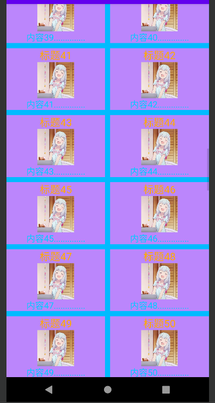


#### 拉伸模式 none


```xml
<?xml version="1.0" encoding="utf-8"?>
<LinearLayout xmlns:android="http://schemas.android.com/apk/res/android"
        xmlns:tools="http://schemas.android.com/tools"
        xmlns:app="http://schemas.android.com/apk/res-auto"
        android:layout_width="match_parent"
        android:layout_height="match_parent"
        android:orientation="vertical"
        android:gravity="center">

    <GridView
            android:id="@+id/GridView"
            android:columnWidth="160dp"
            android:layout_width="match_parent"
            android:layout_height="wrap_content"
            android:numColumns="2"
            android:background="#00bbff"
            android:stretchMode="none"
            android:horizontalSpacing="2dp"
            android:verticalSpacing="2dp" />

</LinearLayout>
```


#### 拉伸模式 columnWidth


```xml
<?xml version="1.0" encoding="utf-8"?>
<LinearLayout xmlns:android="http://schemas.android.com/apk/res/android"
        xmlns:tools="http://schemas.android.com/tools"
        xmlns:app="http://schemas.android.com/apk/res-auto"
        android:layout_width="match_parent"
        android:layout_height="match_parent"
        android:orientation="vertical"
        android:gravity="center">

    <GridView
            android:id="@+id/GridView"
            android:columnWidth="160dp"
            android:layout_width="match_parent"
            android:layout_height="wrap_content"
            android:numColumns="2"
            android:background="#00bbff"
            android:stretchMode="columnWidth"
            android:horizontalSpacing="2dp"
            android:verticalSpacing="2dp"/>

</LinearLayout>
```


#### 拉伸模式 spacingWidth


```xml
<?xml version="1.0" encoding="utf-8"?>
<LinearLayout xmlns:android="http://schemas.android.com/apk/res/android"
        xmlns:tools="http://schemas.android.com/tools"
        xmlns:app="http://schemas.android.com/apk/res-auto"
        android:layout_width="match_parent"
        android:layout_height="match_parent"
        android:orientation="vertical"
        android:gravity="center">

    <GridView
            android:id="@+id/GridView"
            android:columnWidth="160dp"
            android:layout_width="match_parent"
            android:layout_height="wrap_content"
            android:numColumns="2"
            android:background="#00bbff"
            android:stretchMode="spacingWidth"
            android:horizontalSpacing="2dp"
            android:verticalSpacing="2dp"/>

</LinearLayout>
```


#### 拉伸模式 spacingWidthUniform


```xml
<?xml version="1.0" encoding="utf-8"?>
<LinearLayout xmlns:android="http://schemas.android.com/apk/res/android"
        xmlns:tools="http://schemas.android.com/tools"
        xmlns:app="http://schemas.android.com/apk/res-auto"
        android:layout_width="match_parent"
        android:layout_height="match_parent"
        android:orientation="vertical"
        android:gravity="center">

    <GridView
            android:id="@+id/GridView"
            android:columnWidth="160dp"
            android:layout_width="match_parent"
            android:layout_height="wrap_content"
            android:numColumns="2"
            android:background="#00bbff"
            android:stretchMode="spacingWidthUniform"
            android:horizontalSpacing="2dp"
            android:verticalSpacing="2dp"/>

</LinearLayout>
```


## 翻页类视图

### 翻页视图ViewPager

为了实现左右滑动的翻 页功能，Android提供了相应的控件—翻页视图ViewPager。对于ViewPager来说，一个页面就是一个项 （相当于ListView的一个列表项），许多个页面组成了ViewPager的页面项

翻页视图的原理类似列表视图和网格视图，它们的用法也很类似。例如，列表视图和网格视 图使用基本适配器BaseAdapter，翻页视图则使用翻页适配器PagerAdapter；列表视图和网格视图使用 列表项的点击监听器OnItemClickListener，翻页视图则使用页面变更监听器OnPageChangeListener监 听页面切换事件


翻页视图3个常用方法的说明：

* setAdapter：设置页面项的适配器。适配器用的是PagerAdapter及其子类
* setCurrentItem：设置当前页码，也就是要显示哪个页面
* addOnPageChangeListener：添加翻页视图的页面变更监听器。该监听器需实现接口 OnPageChangeListener下的3个方法
  * onPageScrollStateChanged：在页面滑动状态变化时触发
  * onPageScrolled：在页面滑动过程中触发
  * onPageSelected：在选中页面时，即滑动结束后触发


在XML文件中添加ViewPager时注意指定完整路径的节点名称

```xml
<?xml version="1.0" encoding="utf-8"?>
<LinearLayout xmlns:android="http://schemas.android.com/apk/res/android"
        xmlns:tools="http://schemas.android.com/tools"
        xmlns:app="http://schemas.android.com/apk/res-auto"
        android:layout_width="match_parent"
        android:layout_height="match_parent"
        tools:context=".MainActivity"
        android:orientation="vertical"
        android:gravity="center">


    <androidx.viewpager.widget.ViewPager
            android:id="@+id/ViewPager"
            android:layout_width="match_parent"
            android:layout_height="wrap_content" />

</LinearLayout>
```


由于翻页视图包含了多个页面项，因此要借助翻页适配器展示每个页面。翻页适配器的实现原理与基本 适配器类似，从PagerAdapter派生的翻页适配器主要实现下面6个方法

* 构造方法：指定适配器需要处理的数据集合
* getCount：获取页面项的个数
* isViewFromObject：判断当前视图是否来自指定对象，返回view == object即可
* instantiateItem：实例化指定位置的页面，并将其添加到容器中
* destroyItem：从容器中销毁指定位置的页面
* getPageTitle：获得指定页面的标题文本，有搭配翻页标签栏时才要实现该方法


由于监听器OnPageChangeListener多数情况只用到onPageSelected方法，很少用到 onPageScrollStateChanged和onPageScrolled两个方法，因此Android又提供了简化版的页面变更监听 器名为SimpleOnPageChangeListener，新的监听器仅需实现onPageSelected方法


#### 代码

##### item_viewpager.xml

```xml
<?xml version="1.0" encoding="utf-8"?>
<LinearLayout xmlns:android="http://schemas.android.com/apk/res/android"
        android:orientation="vertical"
        android:layout_width="match_parent"
        android:layout_height="match_parent"
        android:gravity="center">

    <TextView
            android:id="@+id/title"
            android:layout_width="wrap_content"
            android:layout_height="40dp"
            android:textSize="28sp"
            android:textColor="@color/purple_200"/>

    <ImageView
            android:id="@+id/icon"
            android:layout_width="wrap_content"
            android:layout_height="450dp" />

    <TextView
            android:id="@+id/content"
            android:layout_width="wrap_content"
            android:layout_height="match_parent"
            android:textSize="20sp"
            android:textColor="#ff8800"/>

</LinearLayout>
```


##### 实体类 ViewPagerInfo

```java
package mao.android_viewpager.entity;

/**
 * Project name(项目名称)：android_ViewPager
 * Package(包名): mao.android_viewpager.entity
 * Class(类名): ViewPagerInfo
 * Author(作者）: mao
 * Author QQ：1296193245
 * GitHub：https://github.com/maomao124/
 * Date(创建日期)： 2022/10/5
 * Time(创建时间)： 13:05
 * Version(版本): 1.0
 * Description(描述)： 无
 */


public class ViewPagerInfo
{
    /**
     * 标题
     */
    private String title;
    /**
     * 图标
     */
    private int icon;
    /**
     * 内容
     */
    private String content;

    /**
     * Instantiates a new View pager info.
     */
    public ViewPagerInfo()
    {

    }

    /**
     * Instantiates a new View pager info.
     *
     * @param title   the title
     * @param icon    the icon
     * @param content the content
     */
    public ViewPagerInfo(String title, int icon, String content)
    {
        this.title = title;
        this.icon = icon;
        this.content = content;
    }

    /**
     * Gets title.
     *
     * @return the title
     */
    public String getTitle()
    {
        return title;
    }

    /**
     * Sets title.
     *
     * @param title the title
     * @return the title
     */
    public ViewPagerInfo setTitle(String title)
    {
        this.title = title;
        return this;
    }

    /**
     * Gets icon.
     *
     * @return the icon
     */
    public int getIcon()
    {
        return icon;
    }

    /**
     * Sets icon.
     *
     * @param icon the icon
     * @return the icon
     */
    public ViewPagerInfo setIcon(int icon)
    {
        this.icon = icon;
        return this;
    }

    /**
     * Gets content.
     *
     * @return the content
     */
    public String getContent()
    {
        return content;
    }

    /**
     * Sets content.
     *
     * @param content the content
     * @return the content
     */
    public ViewPagerInfo setContent(String content)
    {
        this.content = content;
        return this;
    }

    @Override
    @SuppressWarnings("all")
    public String toString()
    {
        final StringBuilder stringbuilder = new StringBuilder();
        stringbuilder.append("title：").append(title).append('\n');
        stringbuilder.append("icon：").append(icon).append('\n');
        stringbuilder.append("content：").append(content).append('\n');
        return stringbuilder.toString();
    }
}
```


##### 适配器 ViewPagerAdapter

```java
package mao.android_viewpager.apapter;

import android.content.Context;
import android.util.Log;
import android.view.LayoutInflater;
import android.view.View;
import android.view.ViewGroup;
import android.widget.ImageView;
import android.widget.TextView;

import androidx.annotation.NonNull;
import androidx.viewpager.widget.PagerAdapter;
import androidx.viewpager.widget.ViewPager;

import java.util.ArrayList;
import java.util.List;

import mao.android_viewpager.R;
import mao.android_viewpager.entity.ViewPagerInfo;

/**
 * Project name(项目名称)：android_ViewPager
 * Package(包名): mao.android_viewpager.apapter
 * Class(类名): ViewPagerAdapter
 * Author(作者）: mao
 * Author QQ：1296193245
 * GitHub：https://github.com/maomao124/
 * Date(创建日期)： 2022/10/5
 * Time(创建时间)： 13:08
 * Version(版本): 1.0
 * Description(描述)： 无
 */

public class ViewPagerAdapter extends PagerAdapter
{

    private static final String TAG = "ViewPagerAdapter";

    /**
     * 上下文
     */
    private final Context context;

    /**
     * 列表
     */
    private final List<ViewPagerInfo> list;

    /**
     * 视图列表
     */
    private final List<View> viewList;


    public ViewPagerAdapter(Context context, List<ViewPagerInfo> list)
    {
        this.context = context;
        this.list = list;

        viewList = new ArrayList<>(list.size());

        for (ViewPagerInfo viewPagerInfo : list)
        {
            View view = LayoutInflater.from(context).inflate(R.layout.item_viewpager, null);
            TextView title = view.findViewById(R.id.title);
            title.setText(viewPagerInfo.getTitle());
            ImageView icon = view.findViewById(R.id.icon);
            icon.setImageResource(viewPagerInfo.getIcon());
            TextView content = view.findViewById(R.id.content);
            content.setText(viewPagerInfo.getContent());
            viewList.add(view);
        }
    }

    @Override
    public int getCount()
    {
        return list.size();
    }

    @Override
    public boolean isViewFromObject(@NonNull View view, @NonNull Object object)
    {
        return view == object;
    }


    @NonNull
    @Override
    public Object instantiateItem(@NonNull ViewGroup container, int position)
    {
        Log.d(TAG, "instantiateItem: p:" + position);
        View view = viewList.get(position);
        container.addView(view);
        return view;
    }

    @Override
    public void destroyItem(@NonNull ViewGroup container, int position, @NonNull Object object)
    {
        Log.d(TAG, "destroyItem: P:" + position);
        container.removeView(viewList.get(position));
    }
}
```


##### MainActivity

```java
package mao.android_viewpager;

import androidx.appcompat.app.AppCompatActivity;
import androidx.viewpager.widget.ViewPager;

import android.os.Bundle;
import android.util.Log;
import android.widget.Toast;

import java.util.ArrayList;
import java.util.List;

import mao.android_viewpager.apapter.ViewPagerAdapter;
import mao.android_viewpager.entity.ViewPagerInfo;

public class MainActivity extends AppCompatActivity
{

    private static final String TAG = "MainActivity";

    @Override
    protected void onCreate(Bundle savedInstanceState)
    {
        super.onCreate(savedInstanceState);
        setContentView(R.layout.activity_main);

        ViewPager viewPager = findViewById(R.id.ViewPager);

        List<ViewPagerInfo> list = new ArrayList<>(10);
        for (int i = 1; i <= 10; i++)
        {
            ViewPagerInfo viewPagerInfo = new ViewPagerInfo()
                    .setTitle("标题" + i)
                    .setIcon(R.drawable.test)
                    .setContent("内容" + i + ".......");
            list.add(viewPagerInfo);
        }

        ViewPagerAdapter viewPagerAdapter = new ViewPagerAdapter(this, list);

        viewPager.setAdapter(viewPagerAdapter);

        viewPager.addOnPageChangeListener(new ViewPager.OnPageChangeListener()
        {
            @Override
            public void onPageScrolled(int position, float positionOffset, int positionOffsetPixels)
            {
                Log.d(TAG, "onPageScrolled: " + position);
                //toastShow("页面滑动中：" + (position + 1));
            }

            @Override
            public void onPageSelected(int position)
            {
                Log.d(TAG, "onPageSelected: " + position);
                toastShow("页面滑动结束：" + (position + 1));
            }

            @Override
            public void onPageScrollStateChanged(int state)
            {
                Log.d(TAG, "onPageScrollStateChanged: " + state);
                toastShow("页面滑动状态变化：" + state);
            }
        });

    }

    /**
     * 显示消息
     *
     * @param message 消息
     */
    private void toastShow(String message)
    {
        Toast.makeText(this, message, Toast.LENGTH_SHORT).show();
    }
}
```


#### 运行


### 翻页标签栏PagerTabStrip

尽管翻页视图实现了左右滑动，可是没滑动的时候看不出这是个翻页视图，而且也不晓得当前滑到了哪 个页面。为此Android提供了翻页标签栏PagerTabStrip，它能够在翻页视图上方显示页面标题，从而方 便用户的浏览操作。PagerTabStrip类似选项卡效果，文本下面有横线，点击左右选项卡即可切换到对应页面。给翻页视图引入翻页标签栏只需下列两个步骤：


步骤一，在XML文件的ViewPager节点内部添加PagerTabStrip节点


```xml
<?xml version="1.0" encoding="utf-8"?>
<LinearLayout xmlns:android="http://schemas.android.com/apk/res/android"
        xmlns:tools="http://schemas.android.com/tools"
        xmlns:app="http://schemas.android.com/apk/res-auto"
        android:layout_width="match_parent"
        android:layout_height="match_parent"
        tools:context=".MainActivity"
        android:orientation="vertical"
        android:gravity="center">


    <androidx.viewpager.widget.ViewPager
            android:id="@+id/ViewPager"
            android:layout_width="match_parent"
            android:layout_height="wrap_content">

        <androidx.viewpager.widget.PagerTabStrip
                android:id="@+id/PagerTabStrip"
                android:layout_width="match_parent"
                android:layout_height="wrap_content" />

    </androidx.viewpager.widget.ViewPager>


</LinearLayout>
```


步骤二，在翻页适配器的代码中重写getPageTitle方法，在不同位置返回对应的标题文本


item_viewpager.xml

```xml
<?xml version="1.0" encoding="utf-8"?>
<LinearLayout xmlns:android="http://schemas.android.com/apk/res/android"
        android:orientation="vertical"
        android:layout_width="match_parent"
        android:layout_height="match_parent"
        android:gravity="center">

<!--    <TextView-->
<!--            android:id="@+id/title"-->
<!--            android:layout_width="wrap_content"-->
<!--            android:layout_height="40dp"-->
<!--            android:textSize="28sp"-->
<!--            android:textColor="@color/purple_200"/>-->

    <ImageView
            android:id="@+id/icon"
            android:layout_marginTop="10dp"
            android:layout_width="wrap_content"
            android:layout_height="450dp" />

    <TextView
            android:id="@+id/content"
            android:layout_width="wrap_content"
            android:layout_height="match_parent"
            android:textSize="20sp"
            android:textColor="#ff8800"/>

</LinearLayout>
```


适配器 ViewPagerAdapter

```java
package mao.android_pagertabstrip.apapter;

import android.content.Context;
import android.util.Log;
import android.view.LayoutInflater;
import android.view.View;
import android.view.ViewGroup;
import android.widget.ImageView;
import android.widget.TextView;

import androidx.annotation.NonNull;
import androidx.annotation.Nullable;
import androidx.viewpager.widget.PagerAdapter;

import java.util.ArrayList;
import java.util.List;

import mao.android_pagertabstrip.R;
import mao.android_pagertabstrip.entity.ViewPagerInfo;


/**
 * Project name(项目名称)：android_ViewPager
 * Package(包名): mao.android_viewpager.apapter
 * Class(类名): ViewPagerAdapter
 * Author(作者）: mao
 * Author QQ：1296193245
 * GitHub：https://github.com/maomao124/
 * Date(创建日期)： 2022/10/5
 * Time(创建时间)： 13:08
 * Version(版本): 1.0
 * Description(描述)： 无
 */

public class ViewPagerAdapter extends PagerAdapter
{

    private static final String TAG = "ViewPagerAdapter";

    /**
     * 上下文
     */
    private final Context context;

    /**
     * 列表
     */
    private final List<ViewPagerInfo> list;

    /**
     * 视图列表
     */
    private final List<View> viewList;


    public ViewPagerAdapter(Context context, List<ViewPagerInfo> list)
    {
        this.context = context;
        this.list = list;

        viewList = new ArrayList<>(list.size());

        for (ViewPagerInfo viewPagerInfo : list)
        {
            View view = LayoutInflater.from(context).inflate(R.layout.item_viewpager, null);
//            TextView title = view.findViewById(R.id.title);
//            title.setText(viewPagerInfo.getTitle());
            ImageView icon = view.findViewById(R.id.icon);
            icon.setImageResource(viewPagerInfo.getIcon());
            TextView content = view.findViewById(R.id.content);
            content.setText(viewPagerInfo.getContent());
            viewList.add(view);
        }
    }

    @Override
    public int getCount()
    {
        return list.size();
    }

    @Override
    public boolean isViewFromObject(@NonNull View view, @NonNull Object object)
    {
        return view == object;
    }


    @NonNull
    @Override
    public Object instantiateItem(@NonNull ViewGroup container, int position)
    {
        Log.d(TAG, "instantiateItem: p:" + position);
        View view = viewList.get(position);
        container.addView(view);
        return view;
    }

    @Override
    public void destroyItem(@NonNull ViewGroup container, int position, @NonNull Object object)
    {
        Log.d(TAG, "destroyItem: P:" + position);
        container.removeView(viewList.get(position));
    }

    @Nullable
    @Override
    public CharSequence getPageTitle(int position)
    {
        return list.get(position).getTitle();
    }


}
```


另外，若想修改翻页标签栏的文本样式，必须在Java代码中调用setTextSize和setTextColor方法才行， 因为PagerTabStrip不支持在XML文件中设置文本大小和文本颜色，只能在代码中设置文本样式


```java
package mao.android_pagertabstrip;

import androidx.appcompat.app.AppCompatActivity;
import androidx.viewpager.widget.PagerTabStrip;
import androidx.viewpager.widget.ViewPager;

import android.graphics.Color;
import android.os.Bundle;
import android.util.Log;
import android.util.TypedValue;
import android.widget.Toast;

import java.util.ArrayList;
import java.util.List;

import mao.android_pagertabstrip.apapter.ViewPagerAdapter;
import mao.android_pagertabstrip.entity.ViewPagerInfo;

public class MainActivity extends AppCompatActivity
{
    private static final String TAG = "MainActivity";

    @Override
    protected void onCreate(Bundle savedInstanceState)
    {
        super.onCreate(savedInstanceState);
        setContentView(R.layout.activity_main);

        ViewPager viewPager = findViewById(R.id.ViewPager);

        List<ViewPagerInfo> list = new ArrayList<>(10);
        for (int i = 1; i <= 10; i++)
        {
            ViewPagerInfo viewPagerInfo = new ViewPagerInfo()
                    .setTitle("标题" + i)
                    .setIcon(R.drawable.test)
                    .setContent("内容" + i + ".......");
            list.add(viewPagerInfo);
        }

        ViewPagerAdapter viewPagerAdapter = new ViewPagerAdapter(this, list);

        viewPager.setAdapter(viewPagerAdapter);

        viewPager.addOnPageChangeListener(new ViewPager.OnPageChangeListener()
        {
            @Override
            public void onPageScrolled(int position, float positionOffset, int positionOffsetPixels)
            {
                Log.d(TAG, "onPageScrolled: " + position);
                //toastShow("页面滑动中：" + (position + 1));
            }

            @Override
            public void onPageSelected(int position)
            {
                Log.d(TAG, "onPageSelected: " + position);
                toastShow("页面滑动结束：" + (position + 1));
            }

            @Override
            public void onPageScrollStateChanged(int state)
            {
                Log.d(TAG, "onPageScrollStateChanged: " + state);
                toastShow("页面滑动状态变化：" + state);
            }
        });


        PagerTabStrip pagerTabStrip = findViewById(R.id.PagerTabStrip);
        pagerTabStrip.setTextColor(Color.rgb(200, 20, 255));
        pagerTabStrip.setTextSize(TypedValue.COMPLEX_UNIT_SP, 28);
    }

    /**
     * 显示消息
     *
     * @param message 消息
     */
    private void toastShow(String message)
    {
        Toast.makeText(this, message, Toast.LENGTH_SHORT).show();
    }
}
```


运行


### 简单的启动引导页

翻页视图的使用范围很广，当用户安装一个新应用时，首次启动大多出现欢迎页面，这个引导页要往右 翻好几页，才会进入应用主页。这种启动引导页就是通过翻页视图实现的

翻页技术的核心在于页面项的XML布局及其适配器， 因此首先要设计页面项的布局。一般来说，引导页由两部分组成，一部分是背景图；另一部分是页面下方的一排圆点，其中高亮的圆点表示当前位于第几页

除了背景图与一排圆点之外，最后一页往往有个按钮，它便是进入应用主页的入口。于是页面项的XML 文件至少包含3个控件：引导页的背景图（采用ImageView）、底部的一排圆点（采用RadioGroup）、 最后一页的入口按钮（采用Button）

启动引导页的适配器代码，主要完成3项工作：

* 根据页面项的XML文件构造每页的视图
* 让当前页码的圆点高亮显示
* 如果翻到了最后一页，就显示中间的入口按钮


#### 布局文件

##### activity_main

```xml
<?xml version="1.0" encoding="utf-8"?>
<LinearLayout xmlns:android="http://schemas.android.com/apk/res/android"
        xmlns:tools="http://schemas.android.com/tools"
        xmlns:app="http://schemas.android.com/apk/res-auto"
        android:layout_width="match_parent"
        android:layout_height="match_parent">

    <androidx.viewpager.widget.ViewPager
            android:id="@+id/ViewPager"
            android:layout_width="match_parent"
            android:layout_height="wrap_content" />

</LinearLayout>
```


##### activity_main2

```xml
<?xml version="1.0" encoding="utf-8"?>
<LinearLayout xmlns:android="http://schemas.android.com/apk/res/android"
        xmlns:tools="http://schemas.android.com/tools"
        xmlns:app="http://schemas.android.com/apk/res-auto"
        android:layout_width="match_parent"
        android:layout_height="match_parent"
        tools:context=".MainActivity2"
        android:orientation="vertical"
        android:gravity="center">

    <TextView
            android:layout_width="wrap_content"
            android:layout_height="wrap_content"
            android:textSize="34sp"
            android:text="主页面" />

</LinearLayout>
```


##### item_launch_boot

```xml
<?xml version="1.0" encoding="utf-8"?>
<RelativeLayout xmlns:android="http://schemas.android.com/apk/res/android"
        android:layout_width="match_parent"
        android:layout_height="match_parent">

    <ImageView
            android:id="@+id/ImageView"
            android:layout_width="match_parent"
            android:layout_height="match_parent"
            android:scaleType="fitXY" />

    <RadioGroup
            android:id="@+id/RadioGroup"
            android:layout_width="wrap_content"
            android:layout_height="wrap_content"
            android:layout_centerHorizontal="true"
            android:layout_alignParentBottom="true"
            android:orientation="horizontal"
            android:paddingBottom="20dp">


    </RadioGroup>

    <Button
            android:id="@+id/Button_start"
            android:layout_width="wrap_content"
            android:layout_height="wrap_content"
            android:layout_centerInParent="true"
            android:text="开始使用"
            android:textSize="28sp"
            android:background="@color/purple_200"
            android:textColor="#00ff00"
            android:visibility="gone" />

</RelativeLayout>
```


#### 适配器

##### LaunchAdapter

```java
package mao.android_launch_boot_page.adapter;

import android.content.Context;
import android.content.Intent;
import android.graphics.drawable.Drawable;
import android.graphics.drawable.ShapeDrawable;
import android.util.Log;
import android.view.LayoutInflater;
import android.view.View;
import android.view.ViewGroup;
import android.widget.Button;
import android.widget.ImageView;
import android.widget.RadioButton;
import android.widget.RadioGroup;

import androidx.annotation.NonNull;
import androidx.viewpager.widget.PagerAdapter;
import androidx.viewpager.widget.ViewPager;

import java.util.ArrayList;
import java.util.List;

import mao.android_launch_boot_page.MainActivity2;
import mao.android_launch_boot_page.R;

/**
 * Project name(项目名称)：android_launch_boot_page
 * Package(包名): mao.android_launch_boot_page.adapter
 * Class(类名): LaunchAdapter
 * Author(作者）: mao
 * Author QQ：1296193245
 * GitHub：https://github.com/maomao124/
 * Date(创建日期)： 2022/10/5
 * Time(创建时间)： 17:07
 * Version(版本): 1.0
 * Description(描述)： 无
 */

public class LaunchAdapter extends PagerAdapter
{

    /**
     * 标签
     */
    private static final String TAG = "LaunchAdapter";

    /**
     * 上下文
     */
    private final Context context;

    /**
     * 视图列表
     */
    private final List<View> viewList;

    /**
     * 图片
     */
    private final int[] images = new int[]
            {
                    R.drawable.l1,
                    R.drawable.l2,
                    R.drawable.l3,
                    R.drawable.l4,
                    R.drawable.l1,
            };

    public LaunchAdapter(Context context)
    {
        this.context = context;

        viewList = new ArrayList<>(images.length);

        for (int i = 0; i < images.length; i++)
        {
            Log.d(TAG, "LaunchAdapter: " + i);
            View view = LayoutInflater.from(context).inflate(R.layout.item_launch_boot, null);
            ImageView imageView = view.findViewById(R.id.ImageView);
            imageView.setImageResource(images[i]);

            RadioGroup radioGroup = view.findViewById(R.id.RadioGroup);

            for (int j = 0; j < images.length; j++)
            {
                RadioButton radioButton = new RadioButton(context);
                radioButton.setLayoutParams(new RadioGroup.LayoutParams(
                        RadioGroup.LayoutParams.WRAP_CONTENT, RadioGroup.LayoutParams.WRAP_CONTENT));

                radioButton.setPadding(10, 10, 10, 10);
                if (j == i)
                {
                    radioButton.setChecked(true);
                }
                radioButton.setClickable(false);
                radioGroup.addView(radioButton);
            }

            if (i == images.length - 1)
            {
                Button button = view.findViewById(R.id.Button_start);
                button.setVisibility(View.VISIBLE);
                button.setOnClickListener(new View.OnClickListener()
                {
                    @Override
                    public void onClick(View v)
                    {
                        context.startActivity(new Intent(context, MainActivity2.class));
                    }
                });
            }
            viewList.add(view);
        }

    }

    @Override
    public int getCount()
    {
        return viewList.size();
    }

    @Override
    public boolean isViewFromObject(@NonNull View view, @NonNull Object object)
    {
        return view == object;
    }

    @NonNull
    @Override
    public Object instantiateItem(@NonNull ViewGroup container, int position)
    {
        View view = viewList.get(position);
        container.addView(view);
        return view;
    }

    @Override
    public void destroyItem(@NonNull ViewGroup container, int position, @NonNull Object object)
    {
        container.removeView(viewList.get(position));
    }
}
```


#### Activity

##### MainActivity

```java
package mao.android_launch_boot_page;

import androidx.appcompat.app.AppCompatActivity;
import androidx.viewpager.widget.ViewPager;

import android.os.Bundle;

import mao.android_launch_boot_page.adapter.LaunchAdapter;

public class MainActivity extends AppCompatActivity
{

    @Override
    protected void onCreate(Bundle savedInstanceState)
    {
        super.onCreate(savedInstanceState);
        setContentView(R.layout.activity_main);

        ViewPager viewPager = findViewById(R.id.ViewPager);
        LaunchAdapter launchAdapter = new LaunchAdapter(this);
        viewPager.setAdapter(launchAdapter);
    }
}
```


#### 主清单文件

```xml
<?xml version="1.0" encoding="utf-8"?>
<manifest xmlns:android="http://schemas.android.com/apk/res/android"
        xmlns:tools="http://schemas.android.com/tools"
        package="mao.android_launch_boot_page">

    <application
            android:allowBackup="true"
            android:dataExtractionRules="@xml/data_extraction_rules"
            android:fullBackupContent="@xml/backup_rules"
            android:icon="@mipmap/ic_launcher"
            android:label="@string/app_name"
            android:roundIcon="@mipmap/ic_launcher_round"
            android:supportsRtl="true"
            android:theme="@style/Theme.AppCompat.DayNight.NoActionBar"
            tools:targetApi="31">
        <activity
                android:name=".MainActivity2"
                android:exported="false" />
        <activity
                android:name=".MainActivity"
                android:launchMode="singleInstance"
                android:exported="true">
            <intent-filter>
                <action android:name="android.intent.action.MAIN" />

                <category android:name="android.intent.category.LAUNCHER" />
            </intent-filter>
        </activity>
    </application>

</manifest>
```


#### 运行


## 通知

### Notification 控件

实现通知，要创建两个对象 ， Notification和NotificationManager


#### NotificationManager

NotificationManager类是一个通知管理器类，这个对象是由系统维护的服务，是以单例模式的方式获得，所以一般并不直接实例化这个对象。

在Activity中，可以使用Activity.getSystemService（String）方法获取NotificationManager对象，Activity.getSystemService（String）方法可以通过Android系统级服务的句柄，返回对应的对象。

在这里需要返回NotificationManager，所以直接传递Context.NOTIFICATION SERVICE即可


```java
NotificationManager notificationManager = (NotificationManager) getSystemService(NOTIFICATION_SERVICE);
```


#### Notification

使用Notificationcompat类的Bulder构造器来创建Notification对象，可以保证程序在所有的版本上都能正常工作。

Android8.0新增了通知渠道这个概念，如果没有设置，则通知无法在Android8.0的机器上显示


```java
Notification notification = new NotificationCompat.Builder(this,"1").build();
```


NotificationCompat.Builder()构造器中包含两个参数，一个是Context通知，一个是channelId，而channelId是android8.0引入的NotificationChannel通知渠道


所以这块需要进行版本判断，并创建NotificationChannel对象，同时NotificationChannel构造中的id要与Notification中的channelId保持一致，importance为通知类型


#### NotificationChannel

Android 8.0引入了通知渠道，其允许您为要显示的每种通知类型创建用户可自定义的渠道。
通知重要程度设置，NotificationManager类中：

* **IMPORTANCE_NONE**：关闭通知
* **IMPORTANCE_MIN**：开启通知，不会弹出，但没有提示音，状态栏中无显示
* **IMPORTANCE_Low**：开启通知，不会弹出，不发出提示音，状态栏中显示
* **IMPORTANCE_DEFAULT**：开启通知，不会弹出，发出提示音，状态栏中显示
* **IMPORTANCE_HIGH**：开启通知，会弹出，发出提示音，状态栏中显示


```java
NotificationManager notificationManager = (NotificationManager) getSystemService(NOTIFICATION_SERVICE);

if (Build.VERSION.SDK_INT >= Build.VERSION_CODES.O)
{
    NotificationChannel notificationChannel = new NotificationChannel("1", "测试通知", NotificationManager.IMPORTANCE_HIGH);
    notificationManager.createNotificationChannel(notificationChannel);
}

Notification notification = new NotificationCompat.Builder(this, "1").build();
```


#### Notifition常用方法

* setContentitle（string string）：设置标题
* setContentText（String string）：设置文本内容
* setSmallion（int icon）：设置小图标
* setLargelcon（Bitmap icon）：设置通知的大图标
* setColor（int argb）：设置小图标的颜色
* setContentintent（Pendingintent intent）：设置点击通知后的跳转意图
* setAutoCancellboolean boolean）：设置点击通知后自动清除通知
* setWhen（long when）：设置通知被创建的时间


Android从5.0系统开始，对于通知栏图标的设计进行了修改。现在Google要求，所有应用程序的通知栏图标，应该只使用alpha图层来进行绘制，而不应该包括RGB图层


```java
package mao.android_notification;

import androidx.appcompat.app.AppCompatActivity;
import androidx.core.app.NotificationCompat;

import android.app.Notification;
import android.app.NotificationChannel;
import android.app.NotificationManager;
import android.graphics.Color;
import android.os.Build;
import android.os.Bundle;

public class MainActivity extends AppCompatActivity
{

    @Override
    protected void onCreate(Bundle savedInstanceState)
    {
        super.onCreate(savedInstanceState);
        setContentView(R.layout.activity_main);

        NotificationManager notificationManager = (NotificationManager) getSystemService(NOTIFICATION_SERVICE);

        if (Build.VERSION.SDK_INT >= Build.VERSION_CODES.O)
        {
            NotificationChannel notificationChannel = new NotificationChannel("1", "测试通知", NotificationManager.IMPORTANCE_HIGH);
            notificationManager.createNotificationChannel(notificationChannel);

        }

        Notification notification = new NotificationCompat.Builder(this, "1")
                .setContentTitle("标题")
                .setContentText("内容")
                .setSmallIcon(R.drawable.ic_launcher_foreground)
                .setColor(Color.rgb(255, 0, 0))
                .setAutoCancel(true)
                .build();
        
        notificationManager.notify(1, notification);
    }
}
```


#### 实现点击后跳转到app

主要通过构造Notification时setContentintent（Pendingintent intent）：设置点击通知后的跳转意图


```java
package mao.android_notification;

import androidx.appcompat.app.AppCompatActivity;
import androidx.core.app.NotificationCompat;

import android.app.Notification;
import android.app.NotificationChannel;
import android.app.NotificationManager;
import android.app.PendingIntent;
import android.content.Intent;
import android.graphics.Color;
import android.os.Build;
import android.os.Bundle;

public class MainActivity extends AppCompatActivity
{

    @Override
    protected void onCreate(Bundle savedInstanceState)
    {
        super.onCreate(savedInstanceState);
        setContentView(R.layout.activity_main);

        NotificationManager notificationManager = (NotificationManager) getSystemService(NOTIFICATION_SERVICE);

        if (Build.VERSION.SDK_INT >= Build.VERSION_CODES.O)
        {
            NotificationChannel notificationChannel = new NotificationChannel("1", "测试通知", NotificationManager.IMPORTANCE_HIGH);
            notificationManager.createNotificationChannel(notificationChannel);
        }

        PendingIntent pendingIntent = PendingIntent.
                getActivity(this, 0, new Intent(MainActivity.this, MainActivity2.class), 0);

        Notification notification = new NotificationCompat.Builder(this, "1")
                .setContentTitle("标题")
                .setContentText("内容")
                .setSmallIcon(R.drawable.ic_launcher_foreground)
                .setColor(Color.rgb(255, 0, 0))
                .setAutoCancel(true)
                .setContentIntent(pendingIntent)
                .build();

        notificationManager.notify(1, notification);
    }
}
```


#### 简单封装


```java

    /**
     * 创建通知渠道，通知的重要程度默认为NotificationManager.IMPORTANCE_HIGH
     *
     * @param id   id
     * @param name 名字
     */
    private void createNotificationChannel(String id, String name)
    {
        NotificationManager notificationManager = (NotificationManager) getSystemService(NOTIFICATION_SERVICE);
        if (Build.VERSION.SDK_INT >= Build.VERSION_CODES.O)
        {
            NotificationChannel notificationChannel = new NotificationChannel(id, name, NotificationManager.IMPORTANCE_HIGH);
            notificationManager.createNotificationChannel(notificationChannel);
        }
    }

    /**
     * 创建通知渠道
     *
     * @param id    id
     * @param name  名字
     * @param level 通知水平,比如：NotificationManager.IMPORTANCE_HIGH
     */
    private void createNotificationChannel(String id, String name, int level)
    {
        NotificationManager notificationManager = (NotificationManager) getSystemService(NOTIFICATION_SERVICE);
        if (Build.VERSION.SDK_INT >= Build.VERSION_CODES.O)
        {
            NotificationChannel notificationChannel = new NotificationChannel(id, name, level);
            notificationManager.createNotificationChannel(notificationChannel);
        }
    }


    /**
     * 发送基本通知
     *
     * @param channelId 通道标识
     * @param id        id
     * @param title     标题
     * @param content   内容
     */
    private void sendBaseNotification(String channelId, int id, String title, String content)
    {
        NotificationManager notificationManager = (NotificationManager) getSystemService(NOTIFICATION_SERVICE);
        Notification notification = new NotificationCompat.Builder(this, channelId)
                .setContentTitle(title)
                .setContentText(content)
                .setSmallIcon(R.drawable.ic_launcher_foreground)
                .setAutoCancel(true)
                .build();
        notificationManager.notify(id, notification);
    }

    /**
     * 发送基本通知
     *
     * @param channelId 通道标识
     * @param id        id
     * @param title     标题
     * @param content   内容
     * @param cls       点击后要跳转到的Activity类
     */
    private void sendBaseNotification(String channelId, int id, String title, String content, Class<?> cls)
    {
        NotificationManager notificationManager = (NotificationManager) getSystemService(NOTIFICATION_SERVICE);
        PendingIntent pendingIntent = PendingIntent.
                getActivity(this, 0,
                        new Intent(this, cls), 0);
        Notification notification = new NotificationCompat.Builder(this, channelId)
                .setContentTitle(title)
                .setContentText(content)
                .setSmallIcon(R.drawable.ic_launcher_foreground)
                .setAutoCancel(true)
                .setContentIntent(pendingIntent)
                .build();
        notificationManager.notify(id, notification);
    }


    /**
     * 发送通知
     *
     * @param channelId 通道标识
     * @param id        id
     * @param title     标题
     * @param content   内容
     * @param cls       点击后要跳转到的Activity类
     * @param smallIcon 小图标
     * @param largeIcon 大图标
     */
    private void sendNotification(String channelId, int id, String title, String content,
                                  Class<?> cls, int smallIcon, Bitmap largeIcon)
    {
        NotificationManager notificationManager = (NotificationManager) getSystemService(NOTIFICATION_SERVICE);
        PendingIntent pendingIntent = PendingIntent.
                getActivity(this, 0,
                        new Intent(this, cls), 0);
        Notification notification = new NotificationCompat.Builder(this, channelId)
                .setContentTitle(title)
                .setContentText(content)
                .setSmallIcon(smallIcon)
                .setLargeIcon(largeIcon)
                .setAutoCancel(true)
                .setContentIntent(pendingIntent)
                .build();
        notificationManager.notify(id, notification);
    }
```


布局：

```xml
<?xml version="1.0" encoding="utf-8"?>
<LinearLayout xmlns:android="http://schemas.android.com/apk/res/android"
        xmlns:tools="http://schemas.android.com/tools"
        xmlns:app="http://schemas.android.com/apk/res-auto"
        android:layout_width="match_parent"
        android:layout_height="match_parent"
        tools:context=".MainActivity"
        android:orientation="vertical"
        android:gravity="center">

    <Button
            android:id="@+id/Button1"
            android:layout_width="match_parent"
            android:layout_height="wrap_content"
            android:text="发送通知" />

    <Button
            android:id="@+id/Button2"
            android:layout_width="match_parent"
            android:layout_height="wrap_content"
            android:text="发送通知 带意图" />

    <Button
            android:id="@+id/Button3"
            android:layout_width="match_parent"
            android:layout_height="wrap_content"
            android:text="发送通知 同一id" />

    <Button
            android:id="@+id/Button4"
            android:layout_width="match_parent"
            android:layout_height="wrap_content"
            android:text="发送通知 带大图标" />

</LinearLayout>
```


```java
package mao.android_notification;

import androidx.appcompat.app.AppCompatActivity;
import androidx.core.app.NotificationCompat;

import android.app.Activity;
import android.app.Notification;
import android.app.NotificationChannel;
import android.app.NotificationManager;
import android.app.PendingIntent;
import android.content.Context;
import android.content.Intent;
import android.graphics.Bitmap;
import android.graphics.BitmapFactory;
import android.graphics.Color;
import android.os.Build;
import android.os.Bundle;
import android.view.View;

import java.util.Random;

public class MainActivity extends AppCompatActivity
{

    @Override
    protected void onCreate(Bundle savedInstanceState)
    {
        super.onCreate(savedInstanceState);
        setContentView(R.layout.activity_main);

//        NotificationManager notificationManager = (NotificationManager) getSystemService(NOTIFICATION_SERVICE);
//
//        if (Build.VERSION.SDK_INT >= Build.VERSION_CODES.O)
//        {
//            NotificationChannel notificationChannel = new NotificationChannel("1", "测试通知", NotificationManager.IMPORTANCE_HIGH);
//            notificationManager.createNotificationChannel(notificationChannel);
//        }
//
//        PendingIntent pendingIntent = PendingIntent.
//                getActivity(this, 0, new Intent(MainActivity.this, MainActivity2.class), 0);
//
//        Notification notification = new NotificationCompat.Builder(this, "1")
//                .setContentTitle("标题")
//                .setContentText("内容")
//                .setSmallIcon(R.drawable.ic_launcher_foreground)
//                .setColor(Color.rgb(255, 0, 0))
//                .setAutoCancel(true)
//                .setContentIntent(pendingIntent)
//                .build();
//
//        notificationManager.notify(1, notification);

        createNotificationChannel("2", "测试通知");

        findViewById(R.id.Button1).setOnClickListener(new View.OnClickListener()
        {
            @Override
            public void onClick(View v)
            {
                sendBaseNotification("2", new Random().nextInt(100000), "标题", "内容");
            }
        });
        findViewById(R.id.Button2).setOnClickListener(new View.OnClickListener()
        {
            @Override
            public void onClick(View v)
            {
                sendBaseNotification("2", new Random().nextInt(100000), "标题", "内容", MainActivity2.class);
            }
        });
        findViewById(R.id.Button3).setOnClickListener(new View.OnClickListener()
        {
            @Override
            public void onClick(View v)
            {
                sendBaseNotification("2", 1, "标题", "内容", MainActivity2.class);
            }
        });
        findViewById(R.id.Button4).setOnClickListener(new View.OnClickListener()
        {
            @Override
            public void onClick(View v)
            {
                Bitmap bitmap = BitmapFactory.decodeResource(getResources(), R.drawable.ic_launcher_foreground);
                sendNotification("2", new Random().nextInt(100000), "标题", "内容",
                        MainActivity2.class, R.drawable.ic_launcher_foreground, bitmap);
            }
        });
    }


    /**
     * 创建通知渠道，通知的重要程度默认为NotificationManager.IMPORTANCE_HIGH
     *
     * @param id   id
     * @param name 名字
     */
    private void createNotificationChannel(String id, String name)
    {
        NotificationManager notificationManager = (NotificationManager) getSystemService(NOTIFICATION_SERVICE);
        if (Build.VERSION.SDK_INT >= Build.VERSION_CODES.O)
        {
            NotificationChannel notificationChannel = new NotificationChannel(id, name, NotificationManager.IMPORTANCE_HIGH);
            notificationManager.createNotificationChannel(notificationChannel);
        }
    }

    /**
     * 创建通知渠道
     *
     * @param id    id
     * @param name  名字
     * @param level 通知水平,比如：NotificationManager.IMPORTANCE_HIGH
     */
    private void createNotificationChannel(String id, String name, int level)
    {
        NotificationManager notificationManager = (NotificationManager) getSystemService(NOTIFICATION_SERVICE);
        if (Build.VERSION.SDK_INT >= Build.VERSION_CODES.O)
        {
            NotificationChannel notificationChannel = new NotificationChannel(id, name, level);
            notificationManager.createNotificationChannel(notificationChannel);
        }
    }


    /**
     * 发送基本通知
     *
     * @param channelId 通道标识
     * @param id        id
     * @param title     标题
     * @param content   内容
     */
    private void sendBaseNotification(String channelId, int id, String title, String content)
    {
        NotificationManager notificationManager = (NotificationManager) getSystemService(NOTIFICATION_SERVICE);
        Notification notification = new NotificationCompat.Builder(this, channelId)
                .setContentTitle(title)
                .setContentText(content)
                .setSmallIcon(R.drawable.ic_launcher_foreground)
                .setAutoCancel(true)
                .build();
        notificationManager.notify(id, notification);
    }

    /**
     * 发送基本通知
     *
     * @param channelId 通道标识
     * @param id        id
     * @param title     标题
     * @param content   内容
     * @param cls       点击后要跳转到的Activity类
     */
    private void sendBaseNotification(String channelId, int id, String title, String content, Class<?> cls)
    {
        NotificationManager notificationManager = (NotificationManager) getSystemService(NOTIFICATION_SERVICE);
        PendingIntent pendingIntent = PendingIntent.
                getActivity(this, 0,
                        new Intent(this, cls), 0);
        Notification notification = new NotificationCompat.Builder(this, channelId)
                .setContentTitle(title)
                .setContentText(content)
                .setSmallIcon(R.drawable.ic_launcher_foreground)
                .setAutoCancel(true)
                .setContentIntent(pendingIntent)
                .build();
        notificationManager.notify(id, notification);
    }


    /**
     * 发送通知
     *
     * @param channelId 通道标识
     * @param id        id
     * @param title     标题
     * @param content   内容
     * @param cls       点击后要跳转到的Activity类
     * @param smallIcon 小图标
     * @param largeIcon 大图标
     */
    private void sendNotification(String channelId, int id, String title, String content,
                                  Class<?> cls, int smallIcon, Bitmap largeIcon)
    {
        NotificationManager notificationManager = (NotificationManager) getSystemService(NOTIFICATION_SERVICE);
        PendingIntent pendingIntent = PendingIntent.
                getActivity(this, 0,
                        new Intent(this, cls), 0);
        Notification notification = new NotificationCompat.Builder(this, channelId)
                .setContentTitle(title)
                .setContentText(content)
                .setSmallIcon(smallIcon)
                .setLargeIcon(largeIcon)
                .setAutoCancel(true)
                .setContentIntent(pendingIntent)
                .build();
        notificationManager.notify(id, notification);
    }
}
```


运行


## 布局

### 表格布局TableLayout

Tablelayout 类以行和列的形式对控件进行管理，每一行为一个 TableRow 对象，或一个 View 控件。当为 TableRow 对象时，可在 TableRow 下添加子控件，默认情况下，每个子控件占据一列。当为View时，该 View 将独占一行


如果我们直接往TableLayout中添加组件的话，那么这个组件将占满一行；

如果我们想一行上有多个组件的话，就要添加一个 TableRow 的容器，把组件都丢到里面；

TableRow 中的组件个数就决定了该行有多少列，而列的宽度由含有最多子控件的 TableRow 决定；

TableRow 的 layout_width 属性，默认是 martch_parent 的，我们自己设置成其他的值也不会生效。但是 layout_height 默认是 wrap_content 的，我们可以自己设置大小


整个表格布局的宽度取决于父容器的宽度（占满父容器本身）

多少列则是看 TableRow 中的组件个数，组件最多的就是 TableLayout 的列数；

比如第一TableRow含2个子控件，第二个TableRow含3个，第三个TableRow含4个，那么该TableLayout的列数为4；


```xml
<?xml version="1.0" encoding="utf-8"?>
<LinearLayout xmlns:android="http://schemas.android.com/apk/res/android"
        xmlns:tools="http://schemas.android.com/tools"
        xmlns:app="http://schemas.android.com/apk/res-auto"
        android:layout_width="match_parent"
        android:layout_height="match_parent"
        tools:context=".MainActivity"
        android:orientation="vertical"
        android:gravity="center">

    <TableLayout
            android:layout_width="match_parent"
            android:layout_height="wrap_content"
            android:orientation="vertical">


        <TableRow>

            <Button
                    android:layout_width="wrap_content"
                    android:layout_height="wrap_content"
                    android:text="1" />

        </TableRow>

        <TableRow>

            <Button
                    android:layout_width="wrap_content"
                    android:layout_height="wrap_content"
                    android:text="1" />

            <Button
                    android:layout_width="wrap_content"
                    android:layout_height="wrap_content"
                    android:text="2" />

        </TableRow>

        <TableRow>

            <Button
                    android:layout_width="wrap_content"
                    android:layout_height="wrap_content"
                    android:text="1" />

            <Button
                    android:layout_width="wrap_content"
                    android:layout_height="wrap_content"
                    android:text="2" />

            <Button
                    android:layout_width="wrap_content"
                    android:layout_height="wrap_content"
                    android:text="3" />

        </TableRow>

        <TableRow>

            <Button
                    android:layout_width="wrap_content"
                    android:layout_height="wrap_content"
                    android:text="1" />

            <Button
                    android:layout_width="wrap_content"
                    android:layout_height="wrap_content"
                    android:text="2" />

            <Button
                    android:layout_width="wrap_content"
                    android:layout_height="wrap_content"
                    android:text="3" />

            <Button
                    android:layout_width="wrap_content"
                    android:layout_height="wrap_content"
                    android:text="4" />

        </TableRow>

    </TableLayout>

</LinearLayout>
```


#### TableLayout属性

* android:stretchColumns : 设置运行被拉伸的列的列序号
* android:shrinkColumns : 设置允许被收缩的列的列序号
* android:collapseColumns : 设置需要被隐藏的列的序号

以上这三个属性的列号都是从 0 开始算的，比如 stretchColunmns = "2"，对应的是第 3 列；可以设置多个，用逗号隔开比如 stretchColunmns = "0,2"；如果是所有列都生效,则用"*"号即可


##### stretchColumns

android:stretchColumns : 设置可伸展的列，该列可以向行方向伸展，最多可占据一整行


```xml
<?xml version="1.0" encoding="utf-8"?>
<LinearLayout xmlns:android="http://schemas.android.com/apk/res/android"
        xmlns:tools="http://schemas.android.com/tools"
        xmlns:app="http://schemas.android.com/apk/res-auto"
        android:layout_width="match_parent"
        android:layout_height="match_parent"
        tools:context=".MainActivity2"
        android:orientation="vertical"
        android:gravity="center">

    <TableLayout
            android:layout_width="match_parent"
            android:layout_height="wrap_content"
            android:stretchColumns="0,2">


        <TableRow>

            <Button
                    android:layout_width="wrap_content"
                    android:layout_height="wrap_content"
                    android:text="1" />

            <Button
                    android:layout_width="wrap_content"
                    android:layout_height="wrap_content"
                    android:text="2" />

            <Button
                    android:layout_width="wrap_content"
                    android:layout_height="wrap_content"
                    android:text="3" />

        </TableRow>

        <TableRow>

            <Button
                    android:layout_width="wrap_content"
                    android:layout_height="wrap_content"
                    android:text="1" />

            <Button
                    android:layout_width="wrap_content"
                    android:layout_height="wrap_content"
                    android:text="2" />

            <Button
                    android:layout_width="wrap_content"
                    android:layout_height="wrap_content"
                    android:text="3" />

        </TableRow>

        <TableRow>

            <Button
                    android:layout_width="wrap_content"
                    android:layout_height="wrap_content"
                    android:text="1" />

            <Button
                    android:layout_width="wrap_content"
                    android:layout_height="wrap_content"
                    android:text="2" />

            <Button
                    android:layout_width="wrap_content"
                    android:layout_height="wrap_content"
                    android:text="3" />

        </TableRow>


    </TableLayout>

</LinearLayout>
```


##### shrinkColumns

设置允许被收缩的列的列序号


```xml
<?xml version="1.0" encoding="utf-8"?>
<LinearLayout xmlns:android="http://schemas.android.com/apk/res/android"
        xmlns:tools="http://schemas.android.com/tools"
        xmlns:app="http://schemas.android.com/apk/res-auto"
        android:layout_width="match_parent"
        android:layout_height="match_parent"
        android:orientation="vertical"
        android:gravity="center">

    <TableLayout
            android:layout_width="match_parent"
            android:layout_height="wrap_content"

            android:shrinkColumns="1">


        <TableRow>

            <Button
                    android:layout_width="wrap_content"
                    android:layout_height="wrap_content"
                    android:text="11111111111111" />

            <Button
                    android:layout_width="wrap_content"
                    android:layout_height="wrap_content"
                    android:text="22222222222222" />

            <Button
                    android:layout_width="wrap_content"
                    android:layout_height="wrap_content"
                    android:text="33333333333333" />

        </TableRow>

        <TableRow>

            <Button
                    android:layout_width="wrap_content"
                    android:layout_height="wrap_content"
                    android:text="11111111111111" />

            <Button
                    android:layout_width="wrap_content"
                    android:layout_height="wrap_content"
                    android:text="22222222222222" />

            <Button
                    android:layout_width="wrap_content"
                    android:layout_height="wrap_content"
                    android:text="33333333333333" />

        </TableRow>

        <TableRow>

            <Button
                    android:layout_width="wrap_content"
                    android:layout_height="wrap_content"
                    android:text="11111111111111" />

            <Button
                    android:layout_width="wrap_content"
                    android:layout_height="wrap_content"
                    android:text="22222222222222" />

            <Button
                    android:layout_width="wrap_content"
                    android:layout_height="wrap_content"
                    android:text="33333333333333" />

        </TableRow>


    </TableLayout>

</LinearLayout>
```


不使用shrinkColumns的效果


##### collapseColumns

设置需要被隐藏的列的序号


```xml
<?xml version="1.0" encoding="utf-8"?>
<LinearLayout xmlns:android="http://schemas.android.com/apk/res/android"
        xmlns:tools="http://schemas.android.com/tools"
        xmlns:app="http://schemas.android.com/apk/res-auto"
        android:layout_width="match_parent"
        android:layout_height="match_parent"
        tools:context=".MainActivity2"
        android:orientation="vertical"
        android:gravity="center">

    <TableLayout
            android:layout_width="match_parent"
            android:layout_height="wrap_content"
            android:collapseColumns="1">


        <TableRow>

            <Button
                    android:layout_width="wrap_content"
                    android:layout_height="wrap_content"
                    android:text="1" />

            <Button
                    android:layout_width="wrap_content"
                    android:layout_height="wrap_content"
                    android:text="2" />

            <Button
                    android:layout_width="wrap_content"
                    android:layout_height="wrap_content"
                    android:text="3" />

            <Button
                    android:layout_width="wrap_content"
                    android:layout_height="wrap_content"
                    android:text="4" />

        </TableRow>

        <TableRow>

            <Button
                    android:layout_width="wrap_content"
                    android:layout_height="wrap_content"
                    android:text="1" />

            <Button
                    android:layout_width="wrap_content"
                    android:layout_height="wrap_content"
                    android:text="2" />

            <Button
                    android:layout_width="wrap_content"
                    android:layout_height="wrap_content"
                    android:text="3" />

            <Button
                    android:layout_width="wrap_content"
                    android:layout_height="wrap_content"
                    android:text="4" />

        </TableRow>

        <TableRow>

            <Button
                    android:layout_width="wrap_content"
                    android:layout_height="wrap_content"
                    android:text="1" />

            <Button
                    android:layout_width="wrap_content"
                    android:layout_height="wrap_content"
                    android:text="2" />

            <Button
                    android:layout_width="wrap_content"
                    android:layout_height="wrap_content"
                    android:text="3" />

            <Button
                    android:layout_width="wrap_content"
                    android:layout_height="wrap_content"
                    android:text="4" />

        </TableRow>

        <TableRow>

            <Button
                    android:layout_width="wrap_content"
                    android:layout_height="wrap_content"
                    android:text="1" />

            <Button
                    android:layout_width="wrap_content"
                    android:layout_height="wrap_content"
                    android:text="2" />

            <Button
                    android:layout_width="wrap_content"
                    android:layout_height="wrap_content"
                    android:text="3" />

            <Button
                    android:layout_width="wrap_content"
                    android:layout_height="wrap_content"
                    android:text="4" />

        </TableRow>


    </TableLayout>

</LinearLayout>
```


#### 单元格属性

* android:layout_column : 指定该单元格在第几列显示
* android:layout_span : 指定该单元格占据的列数（未指定时，为1）


```xml
<?xml version="1.0" encoding="utf-8"?>
<LinearLayout xmlns:android="http://schemas.android.com/apk/res/android"
        xmlns:tools="http://schemas.android.com/tools"
        xmlns:app="http://schemas.android.com/apk/res-auto"
        android:layout_width="match_parent"
        android:layout_height="match_parent"
        android:orientation="vertical"
        android:gravity="center">

    <TableLayout
            android:layout_width="match_parent"
            android:layout_height="wrap_content">


        <TableRow>

            <Button
                    android:layout_width="wrap_content"
                    android:layout_height="wrap_content"
                    android:text="1" />

            <Button
                    android:layout_width="wrap_content"
                    android:layout_height="wrap_content"
                    android:layout_column="2"
                    android:text="从第2列" />

            <Button
                    android:layout_width="wrap_content"
                    android:layout_height="wrap_content"
                    android:text="3" />

            <Button
                    android:layout_width="wrap_content"
                    android:layout_height="wrap_content"
                    android:text="4" />

        </TableRow>

        <TableRow>

            <Button
                    android:layout_width="wrap_content"
                    android:layout_height="wrap_content"
                    android:text="1" />

            <Button
                    android:layout_width="wrap_content"
                    android:layout_height="wrap_content"
                    android:layout_span="2"
                    android:text="占两列" />

            <Button
                    android:layout_width="wrap_content"
                    android:layout_height="wrap_content"
                    android:text="3" />

            <Button
                    android:layout_width="wrap_content"
                    android:layout_height="wrap_content"
                    android:text="4" />

        </TableRow>

        <TableRow>

            <Button
                    android:layout_width="wrap_content"
                    android:layout_height="wrap_content"
                    android:text="1" />

            <Button
                    android:layout_width="wrap_content"
                    android:layout_height="wrap_content"
                    android:text="2" />

            <Button
                    android:layout_width="wrap_content"
                    android:layout_height="wrap_content"
                    android:text="3" />

            <Button
                    android:layout_width="wrap_content"
                    android:layout_height="wrap_content"
                    android:text="4" />

        </TableRow>

        <TableRow>

            <Button
                    android:layout_width="wrap_content"
                    android:layout_height="wrap_content"
                    android:text="1" />

            <Button
                    android:layout_width="wrap_content"
                    android:layout_height="wrap_content"
                    android:text="2" />

            <Button
                    android:layout_width="wrap_content"
                    android:layout_height="wrap_content"
                    android:text="3" />

            <Button
                    android:layout_width="wrap_content"
                    android:layout_height="wrap_content"
                    android:text="4" />

        </TableRow>


    </TableLayout>

</LinearLayout>
```


#### 示例


##### activity_main6

```xml
<?xml version="1.0" encoding="utf-8"?>
<LinearLayout xmlns:android="http://schemas.android.com/apk/res/android"
        xmlns:tools="http://schemas.android.com/tools"
        xmlns:app="http://schemas.android.com/apk/res-auto"
        android:layout_width="match_parent"
        android:layout_height="match_parent"
        tools:context=".MainActivity6"
        android:orientation="vertical"
        android:paddingLeft="15dp"
        android:paddingRight="15dp"
        android:background="@color/cardview_dark_background">

    <ScrollView
            android:layout_width="match_parent"
            android:layout_height="wrap_content">

        <TableLayout
                android:id="@+id/TableLayout"
                android:layout_width="match_parent"
                android:layout_height="wrap_content"
                android:stretchColumns="*">

            <TableRow
                    android:layout_marginBottom="10dp"
                    android:gravity="center">

                <TextView
                        android:id="@+id/id"
                        android:layout_width="wrap_content"
                        android:layout_height="wrap_content"
                        android:textSize="20sp"
                        android:layout_gravity="center"
                        android:textColor="#00ccff"
                        android:text="学号" />

                <TextView
                        android:id="@+id/name"
                        android:layout_width="wrap_content"
                        android:layout_height="wrap_content"
                        android:textSize="20sp"
                        android:textColor="#ff00cc"
                        android:layout_gravity="center"
                        android:text="姓名" />

                <TextView
                        android:id="@+id/sex"
                        android:layout_width="wrap_content"
                        android:layout_height="wrap_content"
                        android:textSize="20sp"
                        android:textColor="#aa00ff"
                        android:layout_gravity="center"
                        android:text="性别" />

                <TextView
                        android:id="@+id/age"
                        android:layout_width="wrap_content"
                        android:layout_height="wrap_content"
                        android:textSize="20sp"
                        android:layout_gravity="center"
                        android:textColor="#ffcc00"
                        android:text="年龄" />

            </TableRow>

        </TableLayout>

    </ScrollView>

</LinearLayout>
```


##### item_table.xml

```xml
<?xml version="1.0" encoding="utf-8"?>
<TableRow xmlns:android="http://schemas.android.com/apk/res/android"
        android:id="@+id/TableRow"
        android:orientation="vertical">


        <TextView
                android:id="@+id/id"
                android:layout_width="wrap_content"
                android:layout_height="wrap_content"
                android:textSize="20sp"
                android:layout_gravity="center"
                android:textColor="#00ccff" />

        <TextView
                android:id="@+id/name"
                android:layout_width="wrap_content"
                android:layout_height="wrap_content"
                android:textSize="20sp"
                android:layout_gravity="center"
                android:textColor="#ff00cc" />

        <TextView
                android:id="@+id/sex"
                android:layout_width="wrap_content"
                android:layout_height="wrap_content"
                android:textSize="20sp"
                android:layout_gravity="center"
                android:textColor="#aa00ff" />

        <TextView
                android:id="@+id/age"
                android:layout_width="wrap_content"
                android:layout_height="wrap_content"
                android:layout_gravity="center"
                android:textSize="20sp"
                android:textColor="#ffcc00" />

</TableRow>
```


##### item_edit.xml

```xml
<?xml version="1.0" encoding="utf-8"?>
<LinearLayout xmlns:android="http://schemas.android.com/apk/res/android"
        android:orientation="vertical"
        android:layout_width="match_parent"
        android:layout_height="match_parent">


    <LinearLayout
            android:layout_width="match_parent"
            android:layout_height="wrap_content"
            android:orientation="horizontal"
            android:gravity="center">

        <TextView
                android:layout_width="wrap_content"
                android:layout_height="wrap_content"
                android:text="姓名："
                android:textSize="20sp" />

        <EditText
                android:id="@+id/EditText_name"
                android:layout_width="match_parent"
                android:layout_height="wrap_content"
                android:hint="姓名"
                android:maxLength="6" />

    </LinearLayout>


    <LinearLayout
            android:layout_width="match_parent"
            android:layout_height="wrap_content"
            android:orientation="horizontal"
            android:gravity="center">

        <TextView
                android:layout_width="wrap_content"
                android:layout_height="wrap_content"
                android:text="性别："
                android:textSize="20sp" />

        <EditText
                android:id="@+id/EditText_sex"
                android:layout_width="match_parent"
                android:layout_height="wrap_content"
                android:hint="性别"
                android:maxLength="1" />

    </LinearLayout>


    <LinearLayout
            android:layout_width="match_parent"
            android:layout_height="wrap_content"
            android:orientation="horizontal"
            android:gravity="center">

        <TextView
                android:layout_width="wrap_content"
                android:layout_height="wrap_content"
                android:text="年龄："
                android:textSize="20sp" />

        <EditText
                android:id="@+id/EditText_age"
                android:layout_width="match_parent"
                android:layout_height="wrap_content"
                android:hint="年龄"
                android:maxLength="2"
                android:inputType="number" />

    </LinearLayout>


</LinearLayout>
```


##### MainActivity6

```java
package mao.android_tablelayout;

import androidx.appcompat.app.AlertDialog;
import androidx.appcompat.app.AppCompatActivity;

import android.content.DialogInterface;
import android.graphics.Color;
import android.os.Bundle;
import android.view.LayoutInflater;
import android.view.View;
import android.widget.EditText;
import android.widget.TableLayout;
import android.widget.TableRow;
import android.widget.TextView;
import android.widget.Toast;

import java.util.Random;
import java.util.UUID;

public class MainActivity6 extends AppCompatActivity
{

    /**
     * 得到int随机
     *
     * @param min 最小值
     * @param max 最大值
     * @return int
     */
    public static int getIntRandom(int min, int max)
    {
        if (min > max)
        {
            min = max;
        }
        return min + (int) (Math.random() * (max - min + 1));
    }


    @Override
    protected void onCreate(Bundle savedInstanceState)
    {
        super.onCreate(savedInstanceState);
        setContentView(R.layout.activity_main6);

        TableLayout tableLayout = findViewById(R.id.TableLayout);

        for (int i = 0; i < 500; i++)
        {
            int id = 100000 + i + 1;
            String name = UUID.randomUUID().toString().substring(0, 6);
            String sex = Math.random() > 0.5 ? "男" : "女";
            int age = getIntRandom(15, 25);

            View view = LayoutInflater.from(this).inflate(R.layout.item_table, null);
            TextView textView_id = view.findViewById(R.id.id);
            textView_id.setText(String.valueOf(id));
            TextView textView_name = view.findViewById(R.id.name);
            textView_name.setText(name);
            TextView textView_sex = view.findViewById(R.id.sex);
            textView_sex.setText(sex);
            if (sex.equals("男"))
            {
                textView_sex.setTextColor(Color.rgb(130, 80, 255));
            }
            TextView textView_age = view.findViewById(R.id.age);
            textView_age.setText(String.valueOf(age));

            TableRow tableRow = view.findViewById(R.id.TableRow);
            tableRow.setOnClickListener(new View.OnClickListener()
            {
                @Override
                public void onClick(View v)
                {
                    View view1 = LayoutInflater.from(MainActivity6.this).inflate(R.layout.item_edit, null);

                    EditText editText_name = view1.findViewById(R.id.EditText_name);
                    EditText editText_sex = view1.findViewById(R.id.EditText_sex);
                    EditText editText_age = view1.findViewById(R.id.EditText_age);

                    editText_name.setText(textView_name.getText().toString());
                    editText_sex.setText(textView_sex.getText().toString());
                    editText_age.setText(textView_age.getText().toString());

                    new AlertDialog.Builder(MainActivity6.this)
                            .setTitle("更新id为" + id + "的信息")
                            .setView(view1)
                            .setPositiveButton("确认修改", new DialogInterface.OnClickListener()
                            {
                                @Override
                                public void onClick(DialogInterface dialog, int which)
                                {
                                    textView_name.setText(editText_name.getText().toString());
                                    textView_sex.setText(editText_sex.getText().toString());
                                    textView_age.setText(editText_age.getText().toString());
                                    toastShow("已更改");
                                }
                            })
                            .setNegativeButton("取消", null)
                            .create()
                            .show();
                }
            });

            tableRow.setOnLongClickListener(new View.OnLongClickListener()
            {
                @Override
                public boolean onLongClick(View v)
                {
                    new AlertDialog.Builder(MainActivity6.this)
                            .setTitle("删除提示")
                            .setMessage("是否删除id为" + id + "的信息？")
                            .setPositiveButton("确定删除", new DialogInterface.OnClickListener()
                            {
                                @Override
                                public void onClick(DialogInterface dialog, int which)
                                {
                                    tableLayout.removeView(view);
                                    toastShow("已删除");
                                }
                            })
                            .setNeutralButton("取消", null)
                            .create()
                            .show();
                    return true;
                }
            });

            tableLayout.addView(view);
        }
    }

    /**
     * 显示消息
     *
     * @param message 消息
     */
    private void toastShow(String message)
    {
        Toast.makeText(this, message, Toast.LENGTH_SHORT).show();
    }
}
```


##### 运行


### 帧布局FrameLayout

FrameLayout(帧布局)顾名思义，就是按照帧来分布的一种布局

使用FrameLayout，会直接在屏幕上开辟出一块空白的区域

采用帧布局时，所有控件都默认显示在屏幕左上角，并按照先后放入的顺序重叠摆放，先放入的将会在更底层，后放入的控件显示在最顶层。帧布局使用于图层设计


|           属性            |            解释            |
| :-----------------------: | :------------------------: |
|    android:foreground     | 设置改帧布局容器的前景图像 |
| android:foregroundGravity |   设置前景图像显示的位置   |


```xml
<?xml version="1.0" encoding="utf-8"?>
<FrameLayout xmlns:android="http://schemas.android.com/apk/res/android"
        xmlns:tools="http://schemas.android.com/tools"
        xmlns:app="http://schemas.android.com/apk/res-auto"
        android:layout_width="match_parent"
        android:layout_height="match_parent"
        android:foreground="@mipmap/ic_launcher_round"
        android:foregroundGravity="bottom">

    <View
            android:layout_width="300dp"
            android:layout_height="300dp"
            android:background="#ff00cc" />

    <View
            android:layout_width="200dp"
            android:layout_height="200dp"
            android:background="#00ccff" />

    <View
            android:layout_width="100dp"
            android:layout_height="100dp"
            android:background="#ffaa00" />

</FrameLayout>
```


### 约束布局ConstraintLayout

约束布局 ConstraintLayout，也有人把它称作“增强型的相对布局”，扁平式的布局方式，无任何嵌套，减少布局的层级，优化渲染性能。是最受欢迎的 Jetpack 库之一，其实是 Android Studio 2.2 中主要的新增功能之一，也是 Google 在2016年的 I/O 大会上重点宣传的一个功能。AS 已经将它作为新建页面默认布局了。经历这几年的迭代，功能已经非常的成熟，现在 2.0 正式版本也发布了，也许你已熟悉了旧版本中的功能，并开始用它来快速构建复杂的页面布局，而新版本除了包含旧版本中的所有功能之外，还在 AS 中集成了可以直接预览 XML 的工具，甚至可以直接在预览界面中对布局进行编辑


#### 优点

ConstraintLayout 可以理解为 RelativeLayout + LinearLayout 的混合强化版，同时新版 Android Studio 的布局编辑器也提供了对 ConstraintLayout 完善的编辑支持。使用 ConstraintLayout 可以很方便地在一个层级上实现复杂的布局，功能也很完善，是 Android 官方目前非常重视的一个 Layout（替代以前的 RelativeLayout），使用 ConstraintLayout 后基本可以抛弃 LinearLayout 和 RelativeLayout 的使用，完全不需要任何嵌套就可以实现复杂的 UI，使用起来特别清爽。减少了很多的嵌套的层级，这样 View 在渲染的时候，减少了很多多余的 measure 和 layout 的开销，如果嵌套的层次越多，提升的效果越明显


需要在模块级build.gradle文件中添加依赖，如果有，则可以忽略


```
dependencies {
    implementation 'androidx.constraintlayout:constraintlayout:2.1.3'
}
```


#### 相对位置

要在ConstraintLayout中确定 view 的位置，必须至少添加一个水平和垂直的约束。每一个约束表示到另一个 view、父布局或者不可见的参考线的连接或者对齐。如果水平或者垂直方向上没有约束，那么其位置就是0


下面是 ConstraintLayout 确定位置的属性，这些属性的值即可以是 parent（父布局），也可以是某个 view 的 id，和同类型的RelativeLayout属性很相似


| ConstraintLayout               | RelativeLayout   | 作用             |
| :----------------------------: | :--------------: | :--------------: |
| layout_constraintLeft_toLeftOf | layout_alignLeft | 与参照控件左对齐 |
| layout_constraintLeft_toRightOf | layout_toRightOf | 在参照控件的右边 |
| layout_constraintRight_toLeftOf | layout_toLeftOf  | 在参照控件的左边 |
| layout_constraintRight_toRightOf | layout_alignRight | 与参照控件右对齐 |
| layout_constraintTop_toTopOf     | layout_alignTop   | 与参照控件上对齐 |
| layout_constraintTop_toBottomOf | layout_below       | 在参照控件底部   |
| layout_constraintBottom_toTopOf | layout_alignBottom | 在参照控件的上部 |
| layout_constraintBottom_toBottomOf     | layout_above         | 与参照控件下对齐   |
| layout_constraintBaseline_toBaselineOf | layout_alignBaseline | 与参照控件基线对齐 |
| layout_constraintStart_toEndOf   |      |      |
| layout_constraintStart_toStartOf |      |      |
| layout_constraintEnd_toStartOf |      |      |
| layout_constraintEnd_toEndOf   |      |      |


start/end 一般情况下和 left/right 是一样的效果，主要是为了做国际化适配


##### 相对父容器


```xml
<?xml version="1.0" encoding="utf-8"?>
<androidx.constraintlayout.widget.ConstraintLayout xmlns:android="http://schemas.android.com/apk/res/android"
        xmlns:tools="http://schemas.android.com/tools"
        xmlns:app="http://schemas.android.com/apk/res-auto"
        android:layout_width="match_parent"
        android:layout_height="match_parent"
        tools:context=".MainActivity2">


    <Button
            android:layout_width="wrap_content"
            android:layout_height="wrap_content"
            android:text="左对齐"
            app:layout_constraintLeft_toLeftOf="parent"
            app:layout_constraintTop_toTopOf="parent" />

    <Button
            android:layout_width="wrap_content"
            android:layout_height="wrap_content"
            android:text="右对齐"
            app:layout_constraintRight_toRightOf="parent"
            app:layout_constraintTop_toTopOf="parent" />

    <Button
            android:layout_width="wrap_content"
            android:layout_height="wrap_content"
            android:text="水平居中"
            app:layout_constraintLeft_toLeftOf="parent"
            app:layout_constraintRight_toRightOf="parent" />

    <Button
            android:layout_width="wrap_content"
            android:layout_height="wrap_content"
            android:text="垂直居中"
            app:layout_constraintBottom_toBottomOf="parent"
            app:layout_constraintTop_toTopOf="parent" />

    <Button
            android:layout_width="wrap_content"
            android:layout_height="wrap_content"
            android:text="底部对齐"
            app:layout_constraintBottom_toBottomOf="parent"
            app:layout_constraintLeft_toLeftOf="parent" />


    <Button
            android:layout_width="wrap_content"
            android:layout_height="wrap_content"
            android:text="水平居中+垂直居中"
            app:layout_constraintBottom_toBottomOf="parent"
            app:layout_constraintLeft_toLeftOf="parent"
            app:layout_constraintRight_toRightOf="parent"
            app:layout_constraintTop_toTopOf="parent" />

</androidx.constraintlayout.widget.ConstraintLayout>
```


```xml
app:layout_constraintLeft_toLeftOf="parent"
app:layout_constraintRight_toRightOf="parent"
```

解释：

即view的左边对齐父布局的左边，view的右边对齐父布局的右边，除非这个view的大小刚好充满整个父布局；
否则的话，就是水平居中显示了。我们可以理解为有两个相同的力，把view拉到中间


##### 水平方向的相对位置


```xml
<?xml version="1.0" encoding="utf-8"?>
<androidx.constraintlayout.widget.ConstraintLayout xmlns:android="http://schemas.android.com/apk/res/android"
        xmlns:tools="http://schemas.android.com/tools"
        xmlns:app="http://schemas.android.com/apk/res-auto"
        android:layout_width="match_parent"
        android:layout_height="match_parent"
        tools:context=".MainActivity3">


    <Button
            android:id="@+id/btn_center"
            android:layout_width="wrap_content"
            android:layout_height="wrap_content"
            android:text="水平参照物"
            app:layout_constraintBottom_toBottomOf="parent"
            app:layout_constraintLeft_toLeftOf="parent"
            app:layout_constraintRight_toRightOf="parent"
            app:layout_constraintTop_toTopOf="parent" />

    <Button
            android:layout_width="wrap_content"
            android:layout_height="wrap_content"
            android:text="Left_toLeftOf"
            app:layout_constraintBottom_toTopOf="@id/btn_center"
            app:layout_constraintLeft_toLeftOf="@id/btn_center" />

    <Button
            android:layout_width="wrap_content"
            android:layout_height="wrap_content"
            android:text="Right_toLeftOf"
            app:layout_constraintBottom_toTopOf="@id/btn_center"
            app:layout_constraintRight_toLeftOf="@id/btn_center" />

    <Button
            android:layout_width="wrap_content"
            android:layout_height="wrap_content"
            android:text="Right_toRightOf"
            app:layout_constraintRight_toRightOf="@id/btn_center"
            app:layout_constraintTop_toBottomOf="@id/btn_center" />

    <Button
            android:layout_width="wrap_content"
            android:layout_height="wrap_content"
            android:text="Left_toRightOf"
            app:layout_constraintLeft_toRightOf="@id/btn_center"
            app:layout_constraintTop_toBottomOf="@id/btn_center" />


</androidx.constraintlayout.widget.ConstraintLayout>
```


##### 竖直方向的相对位置


```xml
<?xml version="1.0" encoding="utf-8"?>
<androidx.constraintlayout.widget.ConstraintLayout xmlns:android="http://schemas.android.com/apk/res/android"
        xmlns:tools="http://schemas.android.com/tools"
        xmlns:app="http://schemas.android.com/apk/res-auto"
        android:layout_width="match_parent"
        android:layout_height="match_parent"
        tools:context=".MainActivity4">


    <Button
            android:id="@+id/btn_center"
            android:layout_width="wrap_content"
            android:layout_height="100dp"
            android:text="竖直参照物"
            app:layout_constraintBottom_toBottomOf="parent"
            app:layout_constraintLeft_toLeftOf="parent"
            app:layout_constraintRight_toRightOf="parent"
            app:layout_constraintTop_toTopOf="parent" />

    <Button
            android:layout_width="wrap_content"
            android:layout_height="wrap_content"
            android:text="Top_toTopOf"
            app:layout_constraintTop_toTopOf="@id/btn_center"
            app:layout_constraintRight_toLeftOf="@id/btn_center" />

    <Button
            android:layout_width="wrap_content"
            android:layout_height="wrap_content"
            android:text="Bottom_toTopOf"
            app:layout_constraintBottom_toTopOf="@id/btn_center"
            app:layout_constraintRight_toLeftOf="@id/btn_center" />

    <Button
            android:layout_width="wrap_content"
            android:layout_height="wrap_content"
            android:text="Top_toBottomOf"
            app:layout_constraintLeft_toRightOf="@id/btn_center"
            app:layout_constraintTop_toBottomOf="@id/btn_center" />

    <Button
            android:layout_width="wrap_content"
            android:layout_height="wrap_content"
            android:text="Bottom_toBottomOf"
            app:layout_constraintLeft_toRightOf="@id/btn_center"
            app:layout_constraintBottom_toBottomOf="@id/btn_center" />


</androidx.constraintlayout.widget.ConstraintLayout>
```


#### 尺寸约束

view 中使用 warp_content 或者固定值等等是没有问题的。但是在 ConstraintLayout 中不推荐使用 match_parent 这个值，如果需要实现跟 match_parent 同样的效果，可以使用 0dp 来代替，其表示 match_parent，即适应约束。其跟 match_parent 还是有区别的


```xml
<?xml version="1.0" encoding="utf-8"?>
<androidx.constraintlayout.widget.ConstraintLayout xmlns:android="http://schemas.android.com/apk/res/android"
        xmlns:tools="http://schemas.android.com/tools"
        xmlns:app="http://schemas.android.com/apk/res-auto"
        android:layout_width="match_parent"
        android:layout_height="match_parent"
        tools:context=".MainActivity5">


    <Button
            android:id="@+id/btn_center"
            android:layout_width="wrap_content"
            android:layout_height="wrap_content"
            android:text="wrap_content"
            app:layout_constraintLeft_toLeftOf="parent"
            app:layout_constraintRight_toRightOf="parent"
            app:layout_constraintTop_toTopOf="parent"/>

    <Button
            android:id="@+id/btn_1"
            android:layout_width="180dp"
            android:layout_height="wrap_content"
            android:text="具体数值：180dp"
            app:layout_constraintLeft_toLeftOf="parent"
            app:layout_constraintRight_toRightOf="parent"
            app:layout_constraintTop_toBottomOf="@id/btn_center"/>

    <Button
            android:layout_width="0dp"
            android:layout_height="wrap_content"
            android:text="0dp(match_parent)"
            app:layout_constraintLeft_toLeftOf="parent"
            app:layout_constraintRight_toRightOf="parent"
            app:layout_constraintTop_toBottomOf="@id/btn_1"/>


</androidx.constraintlayout.widget.ConstraintLayout>
```


#### 宽高比 Ratio

在 ConstraintLayout 中，还可以将宽定义成高的一个比例或者高定义成宽的比率。首先，需要将宽或者高设置为0dp（即match_parent），即要适应约束条件。然后通过 layout_constraintDimensionRatio 属性设置一个比率即可。这个比率可以是一个浮点数，表示宽度和高度之间的比率；也可以是“宽度:高度”形式的比率


```xml
<?xml version="1.0" encoding="utf-8"?>
<androidx.constraintlayout.widget.ConstraintLayout xmlns:android="http://schemas.android.com/apk/res/android"
        xmlns:tools="http://schemas.android.com/tools"
        xmlns:app="http://schemas.android.com/apk/res-auto"
        android:layout_width="match_parent"
        android:layout_height="match_parent"
        tools:context=".MainActivity6">


    <Button
            android:layout_width="wrap_content"
            android:layout_height="0dp"
            android:layout_marginTop="30dp"
            app:layout_constraintTop_toTopOf="parent"
            android:text="宽高比2：1"
            app:layout_constraintDimensionRatio="2:1"
            app:layout_constraintLeft_toLeftOf="parent"
            app:layout_constraintRight_toRightOf="parent"
            android:id="@+id/button" />

    <Button
            android:layout_width="wrap_content"
            android:layout_height="0dp"
            android:text="宽高比2.0"
            app:layout_constraintDimensionRatio="2.0"
            app:layout_constraintLeft_toLeftOf="parent"
            app:layout_constraintRight_toRightOf="parent"
            app:layout_constraintTop_toBottomOf="@+id/button"
            android:id="@+id/button2" />

    <Button
            android:layout_width="wrap_content"
            android:layout_height="0dp"
            android:text="宽高比3.0"
            app:layout_constraintDimensionRatio="3.0"
            app:layout_constraintLeft_toLeftOf="parent"
            app:layout_constraintRight_toRightOf="parent"
            app:layout_constraintTop_toBottomOf="@+id/button2"
            android:id="@+id/button3" />


    <Button
            android:layout_width="wrap_content"
            android:layout_height="0dp"
            android:text="宽高比1：2"
            app:layout_constraintDimensionRatio="1:2"
            app:layout_constraintLeft_toLeftOf="parent"
            app:layout_constraintRight_toRightOf="parent"
            app:layout_constraintTop_toBottomOf="@+id/button3"
            android:id="@+id/button4" />


    <Button
            android:layout_width="wrap_content"
            android:layout_height="0dp"
            android:text="宽高比0.66"
            app:layout_constraintDimensionRatio="0.66"
            app:layout_constraintLeft_toLeftOf="parent"
            app:layout_constraintRight_toRightOf="parent"
            app:layout_constraintTop_toBottomOf="@+id/button4" />


</androidx.constraintlayout.widget.ConstraintLayout>
```


如果宽和高都设置为0dp（match_parent），那么 `layout_constraintDimensionRatio` 的值需要先加一个"W,"或者"H,"来表示约束宽度或高度


```xml
<?xml version="1.0" encoding="utf-8"?>
<androidx.constraintlayout.widget.ConstraintLayout xmlns:android="http://schemas.android.com/apk/res/android"
        xmlns:tools="http://schemas.android.com/tools"
        xmlns:app="http://schemas.android.com/apk/res-auto"
        android:layout_width="match_parent"
        android:layout_height="match_parent"
        tools:context=".MainActivity7">


    <Button
            android:layout_width="0dp"
            android:layout_height="0dp"
            android:text="宽和高都设置为0dp"
            app:layout_constraintBottom_toBottomOf="parent"
            app:layout_constraintDimensionRatio="H,16:9"
            app:layout_constraintLeft_toLeftOf="parent"
            app:layout_constraintRight_toRightOf="parent"
            app:layout_constraintTop_toTopOf="parent"/>


</androidx.constraintlayout.widget.ConstraintLayout>
```


```xml
<?xml version="1.0" encoding="utf-8"?>
<androidx.constraintlayout.widget.ConstraintLayout xmlns:android="http://schemas.android.com/apk/res/android"
        xmlns:tools="http://schemas.android.com/tools"
        xmlns:app="http://schemas.android.com/apk/res-auto"
        android:layout_width="match_parent"
        android:layout_height="match_parent"
        tools:context=".MainActivity8">

    <Button
            android:layout_width="0dp"
            android:layout_height="0dp"
            android:text="宽和高都设置为0dp"
            app:layout_constraintBottom_toBottomOf="parent"
            app:layout_constraintDimensionRatio="W,3:10"
            app:layout_constraintLeft_toLeftOf="parent"
            app:layout_constraintRight_toRightOf="parent"
            app:layout_constraintTop_toTopOf="parent"/>
    
</androidx.constraintlayout.widget.ConstraintLayout>
```


#### 百分比宽高 Percent

ConstraintLayout 还能使用百分比来设置 view 的宽高。要使用百分比，宽或高同样要设置为 0dp（match_parent）


* app:layout_constraintWidth_default ：设置宽为百分比，可以设置percent、spread和wrap
* app:layout_constraintWidth_percent ：0到1之间的值，为占父布局宽度的多少
* app:layout_constraintHeight_default ：设置高为百分比，可以设置percent、spread和wrap
* app:layout_constraintHeight_percent：0到1之间的值，为占父布局高度的多少
  


```xml
<?xml version="1.0" encoding="utf-8"?>
<androidx.constraintlayout.widget.ConstraintLayout xmlns:android="http://schemas.android.com/apk/res/android"
        xmlns:tools="http://schemas.android.com/tools"
        xmlns:app="http://schemas.android.com/apk/res-auto"
        android:layout_width="match_parent"
        android:layout_height="match_parent"
        tools:context=".MainActivity9">


    <Button
            android:layout_width="0dp"
            android:layout_height="wrap_content"
            android:text="宽50%"
            app:layout_constraintWidth_default="percent"
            app:layout_constraintLeft_toLeftOf="parent"
            app:layout_constraintRight_toRightOf="parent"
            app:layout_constraintWidth_percent="0.5"/>

</androidx.constraintlayout.widget.ConstraintLayout>
```


#### 偏移量 bias

如果想让view的位置偏向某一侧，可以使用以下的两个属性来设置：

* layout_constraintHorizontal_bias ：水平偏向 
* layout_constraintVertical_bias ：竖直偏向


其值是0到1之间。默认的居中效果就是50％


```xml
<?xml version="1.0" encoding="utf-8"?>
<androidx.constraintlayout.widget.ConstraintLayout xmlns:android="http://schemas.android.com/apk/res/android"
        xmlns:tools="http://schemas.android.com/tools"
        xmlns:app="http://schemas.android.com/apk/res-auto"
        android:layout_width="match_parent"
        android:layout_height="match_parent"
        tools:context=".MainActivity10">

    <Button
            android:layout_width="wrap_content"
            android:layout_height="wrap_content"
            android:text="左偏移0.2"
            app:layout_constraintLeft_toLeftOf="parent"
            app:layout_constraintRight_toRightOf="parent"
            app:layout_constraintHorizontal_bias="0.3"
            android:id="@+id/button5" />

    <Button
            android:layout_width="wrap_content"
            android:layout_height="wrap_content"
            android:text="右偏移0.2"
            app:layout_constraintLeft_toLeftOf="parent"
            app:layout_constraintRight_toRightOf="parent"
            app:layout_constraintHorizontal_bias="0.7"
            app:layout_constraintTop_toBottomOf="@+id/button5" />


</androidx.constraintlayout.widget.ConstraintLayout>
```


#### 圆形定位 Circular positioning

以一个控件为圆心设置角度和半径定位


- layout_constraintCircle：关联另一个控件，将另一个控件放置在自己圆的半径上，会和下面两个属性一起使用
- layout_constraintCircleRadius：圆的半径
- layout_constraintCircleAngle：圆的角度


```xml
<?xml version="1.0" encoding="utf-8"?>
<androidx.constraintlayout.widget.ConstraintLayout xmlns:android="http://schemas.android.com/apk/res/android"
        xmlns:tools="http://schemas.android.com/tools"
        xmlns:app="http://schemas.android.com/apk/res-auto"
        android:layout_width="match_parent"
        android:layout_height="match_parent"
        tools:context=".MainActivity11">


    <Button
            android:text="中心"
            android:layout_width="wrap_content"
            android:layout_height="wrap_content"
            android:id="@+id/button6"
            app:layout_constraintEnd_toEndOf="parent"
            app:layout_constraintStart_toStartOf="parent"
            app:layout_constraintBottom_toBottomOf="parent"
            app:layout_constraintTop_toTopOf="parent" />


    <Button
            android:layout_width="50dp"
            android:layout_height="50dp"
            app:layout_constraintCircle="@id/button6"
            app:layout_constraintCircleRadius="150dp"
            app:layout_constraintCircleAngle="0" />

    <Button
            android:layout_width="50dp"
            android:layout_height="50dp"
            app:layout_constraintCircle="@id/button6"
            app:layout_constraintCircleRadius="150dp"
            app:layout_constraintCircleAngle="30" />
    
    <Button
            android:layout_width="50dp"
            android:layout_height="50dp"
            app:layout_constraintCircle="@id/button6"
            app:layout_constraintCircleRadius="150dp"
            app:layout_constraintCircleAngle="60" />

    <Button
            android:layout_width="50dp"
            android:layout_height="50dp"
            app:layout_constraintCircle="@id/button6"
            app:layout_constraintCircleRadius="150dp"
            app:layout_constraintCircleAngle="90" />

    <Button
            android:layout_width="50dp"
            android:layout_height="50dp"
            app:layout_constraintCircle="@id/button6"
            app:layout_constraintCircleRadius="150dp"
            app:layout_constraintCircleAngle="120" />

    <Button
            android:layout_width="50dp"
            android:layout_height="50dp"
            app:layout_constraintCircle="@id/button6"
            app:layout_constraintCircleRadius="150dp"
            app:layout_constraintCircleAngle="150" />

    <Button
            android:layout_width="50dp"
            android:layout_height="50dp"
            app:layout_constraintCircle="@id/button6"
            app:layout_constraintCircleRadius="150dp"
            app:layout_constraintCircleAngle="180" />

    <Button
            android:layout_width="50dp"
            android:layout_height="50dp"
            app:layout_constraintCircle="@id/button6"
            app:layout_constraintCircleRadius="150dp"
            app:layout_constraintCircleAngle="210" />

    <Button
            android:layout_width="50dp"
            android:layout_height="50dp"
            app:layout_constraintCircle="@id/button6"
            app:layout_constraintCircleRadius="150dp"
            app:layout_constraintCircleAngle="240" />

    <Button
            android:layout_width="50dp"
            android:layout_height="50dp"
            app:layout_constraintCircle="@id/button6"
            app:layout_constraintCircleRadius="150dp"
            app:layout_constraintCircleAngle="270" />

    <Button
            android:layout_width="50dp"
            android:layout_height="50dp"
            app:layout_constraintCircle="@id/button6"
            app:layout_constraintCircleRadius="150dp"
            app:layout_constraintCircleAngle="300" />

    <Button
            android:layout_width="50dp"
            android:layout_height="50dp"
            app:layout_constraintCircle="@id/button6"
            app:layout_constraintCircleRadius="150dp"
            app:layout_constraintCircleAngle="330" />
    

</androidx.constraintlayout.widget.ConstraintLayout>
```


#### 权重 weight

LinearLayout中可以设置权重，ConstraintLayout 同样也有这个属性


* app:layout_constraintHorizontal_weight ：水平权重 
* app:layout_constraintVertical_weight ：竖直权重


```xml
<?xml version="1.0" encoding="utf-8"?>
<androidx.constraintlayout.widget.ConstraintLayout xmlns:android="http://schemas.android.com/apk/res/android"
        xmlns:tools="http://schemas.android.com/tools"
        xmlns:app="http://schemas.android.com/apk/res-auto"
        android:layout_width="match_parent"
        android:layout_height="match_parent"
        tools:context=".MainActivity12">


    <Button
            android:id="@+id/btn_1"
            android:layout_width="0dp"
            android:layout_height="wrap_content"
            android:text="权重为1"
            app:layout_constraintHorizontal_weight="1"
            app:layout_constraintLeft_toLeftOf="parent"
            app:layout_constraintRight_toLeftOf="@id/btn_2"/>

    <Button
            android:id="@+id/btn_2"
            android:layout_width="0dp"
            android:layout_height="wrap_content"
            android:text="权重为2"
            app:layout_constraintHorizontal_weight="2"
            app:layout_constraintLeft_toRightOf="@id/btn_1"
            app:layout_constraintRight_toLeftOf="@id/btn_3"/>

    <Button
            android:id="@+id/btn_3"
            android:layout_width="0dp"
            android:layout_height="wrap_content"
            app:layout_constraintHorizontal_weight="1"
            android:text="权重为1"
            app:layout_constraintLeft_toRightOf="@id/btn_2"
            app:layout_constraintRight_toRightOf="parent"/>
    

</androidx.constraintlayout.widget.ConstraintLayout>
```


#### 辅助线 Guideline

Guideline 可以用来辅助布局，通过 Guideline 能创建出一条水平线或者垂直线，该线不会显示到界面上，但是能够利用这些线条来添加约束去完成界面的布局


* android:orientation=”horizontal|vertical”：表示是水平或垂直引导线。
* app:layout_constraintGuide_begin=”30dp”：如果是水平引导线，则距离布局顶部30dp，如果是垂直引导线，则距离布局左边30dp。
* app:layout_constraintGuide_end=”30dp”：如果是水平引导线，则距离布局底部30dp，如果是垂直引导线，则距离布局右边30dp
* app:layout_constraintGuide_percent=”0.5”：如果是水平引导线，则距离布局顶部为整个布局高度的50%，如果是垂直引导线，则距离布局左边文这个布局宽度的50%


```xml
<?xml version="1.0" encoding="utf-8"?>
<androidx.constraintlayout.widget.ConstraintLayout xmlns:android="http://schemas.android.com/apk/res/android"
        xmlns:tools="http://schemas.android.com/tools"
        xmlns:app="http://schemas.android.com/apk/res-auto"
        android:layout_width="match_parent"
        android:layout_height="match_parent"
        tools:context=".MainActivity13">


    <androidx.constraintlayout.widget.Guideline
            android:id="@+id/guideline_h"
            android:layout_width="wrap_content"
            android:layout_height="wrap_content"
            android:orientation="horizontal"
            app:layout_constraintGuide_begin="275dp" />

    <androidx.constraintlayout.widget.Guideline
            android:id="@+id/guideline_v"
            android:layout_width="wrap_content"
            android:layout_height="wrap_content"
            android:orientation="vertical"
            app:layout_constraintGuide_percent="0.5" />

    <Button
            android:layout_width="wrap_content"
            android:layout_height="wrap_content"
            app:layout_constraintEnd_toStartOf="@+id/guideline_v"
            app:layout_constraintTop_toTopOf="@+id/guideline_h" />

    <Button
            android:layout_width="wrap_content"
            android:layout_height="wrap_content"
            app:layout_constraintBottom_toTopOf="@+id/guideline_h"
            app:layout_constraintStart_toStartOf="@+id/guideline_v"
            app:layout_constraintEnd_toEndOf="parent"
            android:id="@+id/button7" />

    <Button
            android:layout_width="wrap_content"
            android:layout_height="wrap_content"
            app:layout_constraintStart_toStartOf="@+id/guideline_v"
            app:layout_constraintEnd_toEndOf="parent"
            app:layout_constraintTop_toTopOf="@+id/guideline_h"
            app:layout_constraintBottom_toBottomOf="parent" />


</androidx.constraintlayout.widget.ConstraintLayout>
```


#### 屏障 Barrier

Barrier，直译为障碍、屏障。在约束布局中，可以使用属性constraint_referenced_ids属性来引用多个带约束的组件，从而将它们看作一个整体，Barrier 的介入可以完成很多其他布局不能完成的功能

barrierDirection 指定方向，constraint_referenced_ids引用的控件 id（多个id以逗号隔开）


姓名、联系方式位于左侧区域（随着文本的宽度变化左侧区域的宽度也随之变化），使用传统的布局方式实现嵌套过多，布局不够优雅，可以使用Barrier来实现


```xml
<?xml version="1.0" encoding="utf-8"?>
<androidx.constraintlayout.widget.ConstraintLayout xmlns:android="http://schemas.android.com/apk/res/android"
        xmlns:tools="http://schemas.android.com/tools"
        xmlns:app="http://schemas.android.com/apk/res-auto"
        android:layout_width="match_parent"
        android:layout_height="match_parent"
        tools:context=".MainActivity14">


    <TextView
            android:id="@+id/tv_name"
            android:layout_width="wrap_content"
            android:layout_height="wrap_content"
            android:text="姓名："
            app:layout_constraintBottom_toBottomOf="@+id/et_name"
            app:layout_constraintTop_toTopOf="@+id/et_name"/>

    <TextView
            android:id="@+id/tv_contract"
            android:layout_width="wrap_content"
            android:layout_height="wrap_content"
            android:layout_marginTop="8dp"
            android:text="联系方式："
            app:layout_constraintBottom_toBottomOf="@+id/et_contract"
            app:layout_constraintTop_toTopOf="@+id/et_contract"/>

    <EditText
            android:id="@+id/et_name"
            android:layout_width="0dp"
            android:layout_height="wrap_content"
            android:hint="请输入姓名"
            app:layout_constraintLeft_toLeftOf="@+id/barrier"
            app:layout_constraintRight_toRightOf="parent"
            app:layout_constraintTop_toTopOf="parent"/>

    <EditText
            android:id="@+id/et_contract"
            android:layout_width="0dp"
            android:layout_height="wrap_content"
            android:hint="请输入联系方式"
            app:layout_constraintLeft_toLeftOf="@+id/barrier"
            app:layout_constraintRight_toRightOf="parent"
            app:layout_constraintTop_toBottomOf="@+id/et_name"/>

    <androidx.constraintlayout.widget.Barrier
            android:id="@+id/barrier"
            android:layout_width="wrap_content"
            android:layout_height="wrap_content"
            app:barrierDirection="right"
            app:constraint_referenced_ids="tv_name,tv_contract"/>

</androidx.constraintlayout.widget.ConstraintLayout>
```


#### Group

Group用于控制多个控件的可见性


```xml
<?xml version="1.0" encoding="utf-8"?>
<androidx.constraintlayout.widget.ConstraintLayout xmlns:android="http://schemas.android.com/apk/res/android"
        xmlns:tools="http://schemas.android.com/tools"
        xmlns:app="http://schemas.android.com/apk/res-auto"
        android:layout_width="match_parent"
        android:layout_height="match_parent"
        tools:context=".MainActivity15">


    <androidx.constraintlayout.widget.Group
            android:layout_width="match_parent"
            android:layout_height="wrap_content"
            android:visibility="gone"
            android:id="@+id/group"
            app:constraint_referenced_ids="Button21,Button22">

    </androidx.constraintlayout.widget.Group>


    <Button
            android:id="@+id/Button21"
            android:layout_width="wrap_content"
            android:layout_height="wrap_content"
            app:layout_constraintBottom_toBottomOf="parent"
            app:layout_constraintTop_toTopOf="parent" />

    <Button
            android:id="@+id/Button22"
            android:layout_width="wrap_content"
            android:layout_height="wrap_content"
            app:layout_constraintEnd_toEndOf="parent"
            app:layout_constraintBottom_toBottomOf="parent"
            app:layout_constraintTop_toTopOf="parent" />

    <Button
            android:id="@+id/Button23"
            android:text="切换可见性"
            android:layout_width="wrap_content"
            android:layout_height="wrap_content"
            app:layout_constraintEnd_toStartOf="@+id/Button22"
            app:layout_constraintStart_toEndOf="@+id/Button21"
            app:layout_constraintBottom_toBottomOf="parent"
            app:layout_constraintTop_toBottomOf="@+id/group" />

    <Button
            android:layout_width="wrap_content"
            android:layout_height="wrap_content"
            app:layout_constraintTop_toBottomOf="@+id/Button21"
            app:layout_constraintBottom_toBottomOf="parent" />

</androidx.constraintlayout.widget.ConstraintLayout>
```


```java
package mao.android_constraintlayout;

import androidx.appcompat.app.AppCompatActivity;
import androidx.constraintlayout.widget.Group;

import android.os.Bundle;
import android.view.View;

public class MainActivity15 extends AppCompatActivity
{

    private int i = 0;

    @Override
    protected void onCreate(Bundle savedInstanceState)
    {
        super.onCreate(savedInstanceState);
        setContentView(R.layout.activity_main15);

        Group group = findViewById(R.id.group);


        findViewById(R.id.Button23).setOnClickListener(new View.OnClickListener()
        {
            @Override
            public void onClick(View v)
            {
                if (i % 3 == 0)
                {
                    group.setVisibility(View.VISIBLE);
                }
                else if (i % 3 == 1)
                {
                    group.setVisibility(View.INVISIBLE);
                }
                else
                {
                    group.setVisibility(View.GONE);
                }
                i++;
            }
        });
    }
}
```


#### 隐藏边距 goneMargin

当约束目标的可见性为View.GONE时，还可以通过以下属性设置不同的边距值：

* layout_goneMarginStart 
* layout_goneMarginEnd 
* layout_goneMarginLeft 
* layout_goneMarginTop 
* layout_goneMarginRight 
* layout_goneMarginBottom


#### 链 Chains

将相连的 view 两两约束好的实际上就形成了链。在 ConstraintLayout 中可以实现各种不同的链，权重链是其中一种。整个链由链中的第一个view（链头）上设置的属性控制


##### 创建链条

如果一组小部件通过双向连接（见图，显示最小的链，带有两个小部件），则将其视为链条


##### 链条头

链条由在链的第一个元素（链的“头”）上设置的属性控制

头是水平链最左边的View，或垂直链最顶端的View


##### 链的margin

如果在连接上指定了边距，则将被考虑在内


```xml
<?xml version="1.0" encoding="utf-8"?>
<androidx.constraintlayout.widget.ConstraintLayout xmlns:android="http://schemas.android.com/apk/res/android"
        xmlns:tools="http://schemas.android.com/tools"
        xmlns:app="http://schemas.android.com/apk/res-auto"
        android:layout_width="match_parent"
        android:layout_height="match_parent"
        tools:context=".MainActivity16">


    <Button
            android:id="@+id/buttonA"
            android:layout_width="wrap_content"
            android:layout_height="wrap_content"
            android:layout_marginLeft="50dp"
            android:text="Button"
            app:layout_constraintLeft_toLeftOf="parent"
            app:layout_constraintRight_toLeftOf="@+id/buttonB"/>

    <Button
            android:id="@+id/buttonB"
            android:layout_width="wrap_content"
            android:layout_height="wrap_content"
            android:text="Button"
            app:layout_constraintLeft_toRightOf="@+id/buttonA"
            app:layout_constraintRight_toRightOf="parent"/>

</androidx.constraintlayout.widget.ConstraintLayout>
```


通过app:layout_constraintRight_toLeftOf="@+id/buttonB"和app:layout_constraintLeft_toRightOf="@+id/buttonA"就建立了链条，（我中有你，你中有我）


然后它们两个成了一个整体，所以链条左边设置app:layout_constraintLeft_toLeftOf="parent" 使得和父控件左对齐，
右边设置app:layout_constraintRight_toRightOf="parent"使得和父控件右对齐，
这样整个链条就居中了，最后对左控件设置了margin，相当于整个链条左边有了margin


##### 链条样式

当在链的第一个元素上设置属性 layout_constraintHorizontal_chainStyle 或layout_constraintVertical_chainStyle 时，链的行为将根据指定的样式（默认为CHAIN_SPREAD）而更改


* layout_constraintHorizontal_chainStyle ：横向约束链 
* layout_constraintVertical_chainStyle ：纵向约束链


取值如下：

- Spread：视图是均匀分布的（在考虑外边距之后）。这是默认值。
- Spread inside：第一个和最后一个视图固定在链两端的约束边界上，其余视图均匀分布。
- Weighted：当链设置为 spread 或 spread inside 时，您可以通过将一个或多个视图设置为“match_parent”(0dp) 来填充剩余空间。默认情况下，设置为“match_parent”的每个视图之间的空间均匀分布，但您可以使用 layout_constraintHorizontal_weight 和 layout_constraintVertical_weight 属性为每个视图分配重要性权重。如果您熟悉线性布局中的 layout_weight 的话，就会知道该样式与它的原理是相同的。因此，权重值最高的视图获得的空间最大；相同权重的视图获得同样大小的空间。
- Packed：视图打包在一起（在考虑外边距之后）。 然后，您可以通过更改链的头视图偏差调整整条链的偏差（左/右或上/下）


```xml
<?xml version="1.0" encoding="utf-8"?>
<androidx.constraintlayout.widget.ConstraintLayout xmlns:android="http://schemas.android.com/apk/res/android"
        xmlns:tools="http://schemas.android.com/tools"
        xmlns:app="http://schemas.android.com/apk/res-auto"
        android:layout_width="match_parent"
        android:layout_height="match_parent"
        tools:context=".MainActivity17">


    <Button
            android:id="@+id/buttonA"
            android:layout_width="wrap_content"
            android:layout_height="wrap_content"
            android:text="Button"
            app:layout_constraintHorizontal_chainStyle="spread"
            app:layout_constraintLeft_toLeftOf="parent"
            app:layout_constraintRight_toLeftOf="@+id/buttonB"/>

    <Button
            android:id="@+id/buttonB"
            android:layout_width="wrap_content"
            android:layout_height="wrap_content"
            android:text="Button"
            app:layout_constraintLeft_toRightOf="@+id/buttonA"
            app:layout_constraintRight_toLeftOf="@+id/buttonC"
            app:layout_constraintRight_toRightOf="parent"/>

    <Button
            android:id="@+id/buttonC"
            android:layout_width="wrap_content"
            android:layout_height="wrap_content"
            android:text="Button"
            app:layout_constraintLeft_toRightOf="@+id/buttonB"
            app:layout_constraintRight_toRightOf="parent"/>


    <Button
            android:id="@+id/buttonAA"
            android:layout_width="wrap_content"
            android:layout_height="wrap_content"
            android:text="Button"
            app:layout_constraintHorizontal_chainStyle="spread_inside"
            app:layout_constraintLeft_toLeftOf="parent"
            app:layout_constraintRight_toLeftOf="@+id/buttonBB"
            app:layout_constraintTop_toBottomOf="@+id/buttonA" />

    <Button
            android:id="@+id/buttonBB"
            android:layout_width="wrap_content"
            android:layout_height="wrap_content"
            android:text="Button"
            app:layout_constraintLeft_toRightOf="@+id/buttonAA"
            app:layout_constraintRight_toRightOf="parent"
            app:layout_constraintRight_toLeftOf="@+id/buttonCC"
            app:layout_constraintTop_toBottomOf="@+id/buttonB" />

    <Button
            android:id="@+id/buttonCC"
            android:layout_width="wrap_content"
            android:layout_height="wrap_content"
            android:text="Button"
            app:layout_constraintLeft_toRightOf="@+id/buttonBB"
            app:layout_constraintRight_toRightOf="parent"
            app:layout_constraintTop_toBottomOf="@+id/buttonB" />


    <Button
            android:id="@+id/buttonAAA"
            android:layout_width="wrap_content"
            android:layout_height="wrap_content"
            android:text="Button"
            app:layout_constraintHorizontal_chainStyle="spread"
            app:layout_constraintLeft_toLeftOf="parent"
            app:layout_constraintRight_toLeftOf="@+id/buttonBBB"
            app:layout_constraintTop_toBottomOf="@+id/buttonAA" />

    <Button
            android:id="@+id/buttonBBB"
            android:layout_width="0dp"
            android:layout_height="wrap_content"
            android:text="Button"
            app:layout_constraintLeft_toRightOf="@+id/buttonAAA"
            app:layout_constraintRight_toRightOf="parent"
            app:layout_constraintRight_toLeftOf="@+id/buttonCCC"
            app:layout_constraintTop_toBottomOf="@+id/buttonBB" />

    <Button
            android:id="@+id/buttonCCC"
            android:layout_width="0dp"
            android:layout_height="wrap_content"
            android:text="Button"
            app:layout_constraintLeft_toRightOf="@+id/buttonBBB"
            app:layout_constraintRight_toRightOf="parent"
            app:layout_constraintTop_toBottomOf="@+id/buttonBB" />


    <Button
            android:id="@+id/buttonAAAA"
            android:layout_width="wrap_content"
            android:layout_height="wrap_content"
            android:text="Button"
            app:layout_constraintHorizontal_chainStyle="packed"
            app:layout_constraintLeft_toLeftOf="parent"
            app:layout_constraintRight_toLeftOf="@+id/buttonBBBB"
            app:layout_constraintTop_toBottomOf="@+id/buttonAAA" />

    <Button
            android:id="@+id/buttonBBBB"
            android:layout_width="wrap_content"
            android:layout_height="wrap_content"
            android:text="Button"
            app:layout_constraintLeft_toRightOf="@+id/buttonAAAA"
            app:layout_constraintRight_toRightOf="parent"
            app:layout_constraintRight_toLeftOf="@+id/buttonCCCC"
            app:layout_constraintTop_toBottomOf="@+id/buttonBBB" />

    <Button
            android:id="@+id/buttonCCCC"
            android:layout_width="wrap_content"
            android:layout_height="wrap_content"
            android:text="Button"
            app:layout_constraintLeft_toRightOf="@+id/buttonBBBB"
            app:layout_constraintRight_toRightOf="parent"
            app:layout_constraintTop_toBottomOf="@+id/buttonBBB" />
    


</androidx.constraintlayout.widget.ConstraintLayout>
```


#### 新增VirtualLayouts：Flow布局

Flow布局是Chains的强化版，是一种新的VirtualLayouts。用于构建流式排版效果：当出现空间不足时，可自动换行或自动延展到屏幕的另一区域。即当需要对多个View进行流式布局 / 不确定其布局空间的实际尺寸时，就可使用Flow布局


使用步骤：

* 通过属性`constraint_referenced_ids`获取要引用的视图
* 根据这些视图创建一个虚拟的virtual view group
* 对这些视图进行流式布局


核心属性：flow_wrapMode，用于控制元素的排列方式

* NONE : 默认模式。Views不会被包裹到另一行或列。如果它们在屏幕之外，则不能被看到。
* CHAIN : CHAIN与Chains非常相似，可以认为是Chains的强化版本。CHAIN是根据orientation逐行或逐列进行排列的，默认的展示风格是SPREAD。
* ALIGNED : ALIGNED模式与CHAIN类似，但链式是在将不同行和列的视图对齐后考虑的，默认的样式是SPREAD


##### flow_wrapMode:chain


```xml
<?xml version="1.0" encoding="utf-8"?>
<androidx.constraintlayout.widget.ConstraintLayout xmlns:android="http://schemas.android.com/apk/res/android"
        xmlns:tools="http://schemas.android.com/tools"
        xmlns:app="http://schemas.android.com/apk/res-auto"
        android:id="@+id/ConstraintLayout"
        android:layout_width="match_parent"
        android:layout_height="match_parent"
        tools:context=".MainActivity18">


    <Button
            android:id="@+id/Button111"
            android:layout_width="wrap_content"
            android:layout_height="wrap_content"
            android:text="点击添加-chain"
            app:layout_constraintEnd_toEndOf="parent"
            app:layout_constraintStart_toStartOf="parent"
            android:textAllCaps="false" />


    <androidx.constraintlayout.helper.widget.Flow
            android:id="@+id/Flow"
            android:layout_width="0dp"
            android:layout_height="wrap_content"
            app:flow_wrapMode="chain"
            app:constraint_referenced_ids="Button1112"
            app:layout_constraintTop_toBottomOf="@id/Button111"
            app:layout_constraintEnd_toEndOf="parent"
            app:layout_constraintStart_toStartOf="parent" />

    <Button
            android:id="@+id/Button1112"
            android:text="1"
            android:layout_width="wrap_content"
            android:layout_height="wrap_content" />


</androidx.constraintlayout.widget.ConstraintLayout>
```


```java
package mao.android_constraintlayout;

import androidx.appcompat.app.AppCompatActivity;
import androidx.constraintlayout.helper.widget.Flow;
import androidx.constraintlayout.widget.ConstraintLayout;

import android.os.Bundle;
import android.view.View;
import android.widget.Button;

import java.util.ArrayList;
import java.util.Arrays;
import java.util.List;

public class MainActivity18 extends AppCompatActivity
{

    @Override
    protected void onCreate(Bundle savedInstanceState)
    {
        super.onCreate(savedInstanceState);
        setContentView(R.layout.activity_main18);
        final int[] i = {2};
        ConstraintLayout constraintLayout = findViewById(R.id.ConstraintLayout);

        List<Integer> ids = new ArrayList<>();

        Flow flow = findViewById(R.id.Flow);

        Button button = findViewById(R.id.Button1112);
        ids.add(button.getId());


        findViewById(R.id.Button111).setOnClickListener(new View.OnClickListener()
        {
            @Override
            public void onClick(View v)
            {
                Button button1 = new Button(MainActivity18.this);
                button1.setText(String.valueOf(i[0]));
                i[0]++;
                int id = 10023 + i[0];
                button1.setId(id);
                ids.add(id);
                constraintLayout.addView(button1);
                int[] ids_array = new int[ids.size()];
                for (int j = 0; j < ids.size(); j++)
                {
                    ids_array[j] = ids.get(j);
                }
                flow.setReferencedIds(ids_array);

            }
        });

    }
}
```


##### flow_wrapMode:none


```xml
<?xml version="1.0" encoding="utf-8"?>
<androidx.constraintlayout.widget.ConstraintLayout xmlns:android="http://schemas.android.com/apk/res/android"
        android:id="@+id/ConstraintLayout"
        xmlns:tools="http://schemas.android.com/tools"
        xmlns:app="http://schemas.android.com/apk/res-auto"
        android:layout_width="match_parent"
        android:layout_height="match_parent"
        tools:context=".MainActivity19">


    <Button
            android:id="@+id/Button111"
            android:layout_width="wrap_content"
            android:layout_height="wrap_content"
            android:text="点击添加-none"
            app:layout_constraintEnd_toEndOf="parent"
            app:layout_constraintStart_toStartOf="parent"
            android:textAllCaps="false" />


    <androidx.constraintlayout.helper.widget.Flow
            android:id="@+id/Flow"
            android:layout_width="0dp"
            android:layout_height="wrap_content"
            app:flow_wrapMode="none"
            app:constraint_referenced_ids="Button1112"
            app:layout_constraintTop_toBottomOf="@id/Button111"
            app:layout_constraintEnd_toEndOf="parent"
            app:layout_constraintStart_toStartOf="parent" />

    <Button
            android:id="@+id/Button1112"
            android:text="1"
            android:layout_width="wrap_content"
            android:layout_height="wrap_content" />


</androidx.constraintlayout.widget.ConstraintLayout>
```


```java
package mao.android_constraintlayout;

import androidx.appcompat.app.AppCompatActivity;
import androidx.constraintlayout.helper.widget.Flow;
import androidx.constraintlayout.widget.ConstraintLayout;

import android.os.Bundle;
import android.view.View;
import android.widget.Button;

import java.util.ArrayList;
import java.util.List;

public class MainActivity19 extends AppCompatActivity
{

    @Override
    protected void onCreate(Bundle savedInstanceState)
    {
        super.onCreate(savedInstanceState);
        setContentView(R.layout.activity_main19);

        final int[] i = {2};
        ConstraintLayout constraintLayout = findViewById(R.id.ConstraintLayout);

        List<Integer> ids = new ArrayList<>();

        Flow flow = findViewById(R.id.Flow);

        Button button = findViewById(R.id.Button1112);
        ids.add(button.getId());


        findViewById(R.id.Button111).setOnClickListener(new View.OnClickListener()
        {
            @Override
            public void onClick(View v)
            {
                Button button1 = new Button(MainActivity19.this);
                button1.setText(String.valueOf(i[0]));
                i[0]++;
                int id = 10023 + i[0];
                button1.setId(id);
                ids.add(id);
                constraintLayout.addView(button1);
                int[] ids_array = new int[ids.size()];
                for (int j = 0; j < ids.size(); j++)
                {
                    ids_array[j] = ids.get(j);
                }
                flow.setReferencedIds(ids_array);

            }
        });
    }
}
```


##### flow_wrapMode:aligned


```xml
<?xml version="1.0" encoding="utf-8"?>
<androidx.constraintlayout.widget.ConstraintLayout xmlns:android="http://schemas.android.com/apk/res/android"
        android:id="@+id/ConstraintLayout"
        xmlns:app="http://schemas.android.com/apk/res-auto"
        android:layout_width="match_parent"
        android:layout_height="match_parent">


    <Button
            android:id="@+id/Button111"
            android:layout_width="wrap_content"
            android:layout_height="wrap_content"
            android:text="点击添加-aligned"
            app:layout_constraintEnd_toEndOf="parent"
            app:layout_constraintStart_toStartOf="parent"
            android:textAllCaps="false" />


    <androidx.constraintlayout.helper.widget.Flow
            android:id="@+id/Flow"
            android:layout_width="0dp"
            android:layout_height="wrap_content"
            app:flow_wrapMode="aligned"
            app:constraint_referenced_ids="Button1112"
            app:layout_constraintTop_toBottomOf="@id/Button111"
            app:layout_constraintEnd_toEndOf="parent"
            app:layout_constraintStart_toStartOf="parent" />

    <Button
            android:id="@+id/Button1112"
            android:text="1"
            android:layout_width="wrap_content"
            android:layout_height="wrap_content" />


</androidx.constraintlayout.widget.ConstraintLayout>
```


```java
package mao.android_constraintlayout;

import androidx.appcompat.app.AppCompatActivity;
import androidx.constraintlayout.helper.widget.Flow;
import androidx.constraintlayout.widget.ConstraintLayout;

import android.os.Bundle;
import android.view.View;
import android.widget.Button;

import java.util.ArrayList;
import java.util.List;

public class MainActivity20 extends AppCompatActivity
{

    @Override
    protected void onCreate(Bundle savedInstanceState)
    {
        super.onCreate(savedInstanceState);
        setContentView(R.layout.activity_main20);

        final int[] i = {2};
        ConstraintLayout constraintLayout = findViewById(R.id.ConstraintLayout);

        List<Integer> ids = new ArrayList<>();

        Flow flow = findViewById(R.id.Flow);

        Button button = findViewById(R.id.Button1112);
        ids.add(button.getId());


        findViewById(R.id.Button111).setOnClickListener(new View.OnClickListener()
        {
            @Override
            public void onClick(View v)
            {
                Button button1 = new Button(MainActivity20.this);
                button1.setText(String.valueOf(i[0]));
                i[0]++;
                int id = 10023 + i[0];
                button1.setId(id);
                ids.add(id);
                constraintLayout.addView(button1);
                int[] ids_array = new int[ids.size()];
                for (int j = 0; j < ids.size(); j++)
                {
                    ids_array[j] = ids.get(j);
                }
                flow.setReferencedIds(ids_array);

            }
        });
    }
}
```


## 其它类视图

### 自动完成文本视图

**即AutoCompleteTextView控件**

在百度上面进行关键词搜索的时候，输入需要搜索的关键字就会显示一个下拉列表，列表中会匹配到用户输入的关键词汇

Android 也为开发者提供了一个这样的组件，那就是 AutoCompleteTextView 组件也叫做动完成文本框

AutoCompleteTextView 是 EditText 的子类，从外表上看它就是一个普通的编辑框组件，其实它内在的功能就是在用户输入一定的字符时，该组
件会显示一个下拉列表。在这个列表中用户单击需要的字符，该字符将自动填写在编辑框当中


#### XML属性


| XML属性                     | 描述                                   |
| :-------------------------: | :------------------------------------: |
| android:completionHint      | 设置下拉菜单中显示的提示               |
| android:completionHintView  | 设置下拉菜单中显示的提示视图           |
| android:completionThreshold | 设置用户至少输入几个字符才显示提示列表 |
| android:dropDownAnchor | 设置提示列表显示在某个组件的下面，值为某组件的 id |
| android:dropDownHeight | 设置下拉列表的高度                                |
| android:dropDownHorizontalOffset | 设置下拉列表与文本框之间的水平偏移，下拉菜单默认与文本框左对齐 |
| android:dropDownSelector         | 设置下拉列表选择器的背景                                     |
| android:dropDownVerticalOffset | 设置下拉列表与文本框之间的垂直偏移，下拉菜单默认在文本框下面 |
| android:dropDownWidth          | 设置下拉列表的宽度                                           |
| android:popupBackground | 设置下拉列表的背景 |


#### 代码


##### 布局文件

```xml
<?xml version="1.0" encoding="utf-8"?>
<androidx.constraintlayout.widget.ConstraintLayout xmlns:android="http://schemas.android.com/apk/res/android"
        xmlns:tools="http://schemas.android.com/tools"
        xmlns:app="http://schemas.android.com/apk/res-auto"
        android:layout_width="match_parent"
        android:layout_height="match_parent"
        tools:context=".MainActivity">


    <AutoCompleteTextView
            android:id="@+id/AutoCompleteTextView"
            android:layout_width="200dp"
            android:layout_height="wrap_content"
            android:completionHint="请输入国家名称"
            app:layout_constraintEnd_toEndOf="parent"
            app:layout_constraintStart_toStartOf="parent"
            android:completionThreshold="1"
            android:hint="输入内容"/>


</androidx.constraintlayout.widget.ConstraintLayout>
```


##### MainActivity

```java
package mao.android_autocompletetextview;

import androidx.appcompat.app.AppCompatActivity;

import android.os.Bundle;
import android.widget.ArrayAdapter;
import android.widget.AutoCompleteTextView;

public class MainActivity extends AppCompatActivity
{

    @Override
    protected void onCreate(Bundle savedInstanceState)
    {
        super.onCreate(savedInstanceState);
        setContentView(R.layout.activity_main);

        AutoCompleteTextView autoCompleteTextView = findViewById(R.id.AutoCompleteTextView);

        String country[] =
                {
                        "阿尔巴尼亚", "阿尔及利亚", "阿富汗", "阿根廷", "埃及", "爱尔兰", "澳大利亚",
                        "巴哈马", "白俄罗斯", "百慕大", "巴基斯坦", "巴拿马", "保加利亚", "巴西", "冰岛",
                        "波兰", "朝鲜", "丹麦", "厄瓜多尔", "俄罗斯", "法国", "芬兰", "菲律宾", "古巴",
                        "韩国", "荷兰", "哈萨克斯坦", "加纳", "加拿大", "柬埔寨", "利比里亚", "利比亚", "马尔代夫",
                        "美国", "蒙古", "缅甸", "秘鲁", "摩洛哥", "墨西哥", "尼日利亚", "葡萄牙", "日本",
                        "瑞典", "瑞士", "塞尔维亚", "苏丹", "泰国", "乌克兰", "西班牙", "希腊", "新加坡", "新西兰",
                        "匈牙利", "叙利亚", "牙买加", "伊拉克", "伊朗", "印度", "印度尼西亚", "英国",
                        "越南", "以色列", "中国大陆", "中国澳门", "中国香港", "中国台湾", "智利", "中非共和国"
                };

        ArrayAdapter<String> arrayAdapter = new ArrayAdapter<>(this,
                android.R.layout.simple_list_item_1
                , country);
        autoCompleteTextView.setAdapter(arrayAdapter);

    }
}
```


#### 运行


### 悬浮框PopupWindow

PopupWindow 是一个可以用来展示任意 View 的弹窗，并且它可以在当前正在运行的 Activity 之上的任意位置悬浮

- 悬浮在当前运行的 Activity 之上（这一点和 AlertDialog 类似）
- 可以通过编写 View 布局，自定义弹窗的样式（AlertDialog 也可以实现，不过通常我们不这么用）
- 可以悬浮在任意位置


AlertDialog是非堵塞线程的，而PopupWindow则是堵塞线程的


#### 常用的构造方法

- **public PopupWindow (Context context)**
- **public PopupWindow(View contentView, int width, int height)**
- **public PopupWindow(View contentView)**
- **public PopupWindow(View contentView, int width, int height, boolean focusable)**


contentView是PopupWindow显示的View，focusable是否显示焦点


#### 常用的方法

- **setContentView**(View contentView)：设置PopupWindow显示的View
- **getContentView**()：获得PopupWindow显示的View
- **showAsDropDown(View anchor)**：相对某个控件的位置（正左下方），无偏移
- **showAsDropDown(View anchor, int xoff, int yoff)**：相对某个控件的位置，有偏移
- **showAtLocation(View parent, int gravity, int x, int y)**： 相对于父控件的位置（例如正中央Gravity.CENTER，下方Gravity.BOTTOM等），可以设置偏移或无偏移 PS:parent这个参数只要是activity中的view就可以了！
- **setWidth/setHeight**：设置宽高，也可以在构造方法那里指定好宽高， 除了可以写具体的值，还可以用WRAP_CONTENT或MATCH_PARENT， popupWindow的width和height属性直接和第一层View相对应。
- **setFocusable(true)**：设置焦点，PopupWindow弹出后，所有的触屏和物理按键都由PopupWindows 处理。其他任何事件的响应都必须发生在PopupWindow消失之后，（home 等系统层面的事件除外）。 比如这样一个PopupWindow出现的时候，按back键首先是让PopupWindow消失，第二次按才是退出 activity，准确的说是想退出activity你得首先让PopupWindow消失，因为不并是任何情况下按back PopupWindow都会消失，必须在PopupWindow设置了背景的情况下 。
- **setAnimationStyle(int)：**设置动画效果


#### 代码

##### activity_main

```xml
<?xml version="1.0" encoding="utf-8"?>
<androidx.constraintlayout.widget.ConstraintLayout xmlns:android="http://schemas.android.com/apk/res/android"
        xmlns:tools="http://schemas.android.com/tools"
        xmlns:app="http://schemas.android.com/apk/res-auto"
        android:layout_width="match_parent"
        android:layout_height="match_parent"
        tools:context=".MainActivity">


    <Button
            android:id="@+id/Button_"
            android:text="点击弹出"
            android:layout_width="wrap_content"
            android:layout_height="wrap_content"
            app:layout_constraintStart_toStartOf="parent"
            app:layout_constraintEnd_toEndOf="parent"
            app:layout_constraintTop_toTopOf="parent"
            app:layout_constraintBottom_toBottomOf="parent" />


</androidx.constraintlayout.widget.ConstraintLayout>
```


##### item_popup

```xml
<?xml version="1.0" encoding="utf-8"?>
<LinearLayout xmlns:android="http://schemas.android.com/apk/res/android"
        android:orientation="vertical"
        android:layout_width="match_parent"
        android:layout_height="match_parent">


    <Button
            android:id="@+id/Button1"
            android:layout_width="match_parent"
            android:layout_height="wrap_content"
            android:text="按钮1" />

    <Button
            android:id="@+id/Button2"
            android:layout_width="match_parent"
            android:layout_height="wrap_content"
            android:text="按钮2" />

    <Button
            android:id="@+id/Button3"
            android:layout_width="match_parent"
            android:layout_height="wrap_content"
            android:text="按钮3" />


</LinearLayout>
```


##### MainActivity

```java
package mao.android_popupwindow;

import androidx.appcompat.app.AppCompatActivity;

import android.graphics.drawable.ColorDrawable;
import android.os.Bundle;
import android.view.LayoutInflater;
import android.view.MotionEvent;
import android.view.View;
import android.view.ViewGroup;
import android.widget.Button;
import android.widget.PopupWindow;
import android.widget.Toast;

public class MainActivity extends AppCompatActivity
{

    @Override
    protected void onCreate(Bundle savedInstanceState)
    {
        super.onCreate(savedInstanceState);
        setContentView(R.layout.activity_main);


        Button button = findViewById(R.id.Button_);

        button.setOnClickListener(new View.OnClickListener()
        {
            @Override
            public void onClick(View v)
            {
                View view = LayoutInflater.from(MainActivity.this).inflate(R.layout.item_popup, null);
                Button button1 = view.findViewById(R.id.Button1);
                Button button2 = view.findViewById(R.id.Button2);
                Button button3 = view.findViewById(R.id.Button3);

                button1.setOnClickListener(new View.OnClickListener()
                {
                    @Override
                    public void onClick(View v)
                    {
                        toastShow("你点击了按钮1");
                    }
                });

                button2.setOnClickListener(new View.OnClickListener()
                {
                    @Override
                    public void onClick(View v)
                    {
                        toastShow("你点击了按钮2");
                    }
                });

                button3.setOnClickListener(new View.OnClickListener()
                {
                    @Override
                    public void onClick(View v)
                    {
                        toastShow("你点击了按钮3");
                    }
                });


                PopupWindow popupWindow = new PopupWindow(view,
                        ViewGroup.LayoutParams.WRAP_CONTENT,
                        ViewGroup.LayoutParams.WRAP_CONTENT);
                popupWindow.setBackgroundDrawable(new ColorDrawable(0x44000000));
                popupWindow.setFocusable(true);
                popupWindow.setTouchable(true);
                popupWindow.setTouchInterceptor(new View.OnTouchListener()
                {
                    @Override
                    public boolean onTouch(View v, MotionEvent event)
                    {
                        // 这里如果返回true的话，touch事件将被拦截
                        // 拦截后 PopupWindow的onTouchEvent不被调用，这样点击外部区域无法dismiss
                        return false;
                    }
                });
                popupWindow.showAsDropDown(button,0,30);
            }
        });

    }

    /**
     * 显示消息
     *
     * @param message 消息
     */
    private void toastShow(String message)
    {
        Toast.makeText(this, message, Toast.LENGTH_SHORT).show();
    }
}
```


#### 运行


### 翻转视图ViewFlipper

ViewFlipper是Android自带的一个多页面管理控件，且可以自动播放！ 和ViewPager不同，ViewPager是一页页的，而ViewFlipper则是一层层的，和ViewPager一样，很多时候， 用来实现进入应用后的引导页，或者用于图片轮播


#### 常用的方法

- **setInAnimation**：设置View进入屏幕时使用的动画
- **setOutAnimation**：设置View退出屏幕时使用的动画
- **showNext**：调用该方法来显示ViewFlipper里的下一个View
- **showPrevious**：调用该方法来显示ViewFlipper的上一个View
- **setFilpInterval**：设置View之间切换的时间间隔
- **setFlipping**：使用上面设置的时间间隔来开始切换所有的View，切换会循环进行
- **stopFlipping**：停止View切换


#### 静态导入


##### activity_main2

```xml
<?xml version="1.0" encoding="utf-8"?>
<androidx.constraintlayout.widget.ConstraintLayout xmlns:android="http://schemas.android.com/apk/res/android"
        xmlns:tools="http://schemas.android.com/tools"
        xmlns:app="http://schemas.android.com/apk/res-auto"
        android:layout_width="match_parent"
        android:layout_height="match_parent"
        tools:context=".MainActivity2">


    <ViewFlipper
            android:id="@+id/ViewFlipper"
            android:layout_width="match_parent"
            android:layout_height="match_parent"
            android:inAnimation="@anim/right_in"
            android:outAnimation="@anim/right_out">

        <include layout="@layout/item_1" />

        <include layout="@layout/item_2" />

        <include layout="@layout/item_3" />

        <include layout="@layout/item_4" />

        <include layout="@layout/item_5" />


    </ViewFlipper>

</androidx.constraintlayout.widget.ConstraintLayout>
```


##### item_1

```xml
<?xml version="1.0" encoding="utf-8"?>
<LinearLayout xmlns:android="http://schemas.android.com/apk/res/android"
        xmlns:tools="http://schemas.android.com/tools"
        android:layout_width="match_parent"
        android:layout_height="match_parent"
        android:gravity="center">


    <TextView
            android:layout_width="match_parent"
            android:layout_height="match_parent"
            android:text="1"
            android:gravity="center"
            android:textSize="58sp"
            android:background="#00ccff"
            android:textColor="#cc00ff"
            tools:layout_editor_absoluteY="0dp"
            tools:layout_editor_absoluteX="0dp" />

</LinearLayout>
```


##### item_2

```xml
<?xml version="1.0" encoding="utf-8"?>
<LinearLayout xmlns:android="http://schemas.android.com/apk/res/android"
        xmlns:tools="http://schemas.android.com/tools"
        android:layout_width="match_parent"
        android:layout_height="match_parent"
        android:gravity="center">


    <TextView
            android:layout_width="match_parent"
            android:layout_height="match_parent"
            android:text="2"
            android:gravity="center"
            android:textSize="58sp"
            android:background="#ffaaaa"
            android:textColor="@color/design_default_color_secondary"
            tools:layout_editor_absoluteY="0dp"
            tools:layout_editor_absoluteX="0dp" />

</LinearLayout>
```


##### item_3

```xml
<?xml version="1.0" encoding="utf-8"?>
<LinearLayout xmlns:android="http://schemas.android.com/apk/res/android"
        xmlns:tools="http://schemas.android.com/tools"
        android:layout_width="match_parent"
        android:layout_height="match_parent"
        android:gravity="center">


    <TextView
            android:layout_width="match_parent"
            android:layout_height="match_parent"
            android:text="3"
            android:gravity="center"
            android:textSize="58sp"
            android:background="#ccff00"
            android:textColor="@color/design_default_color_secondary"
            tools:layout_editor_absoluteY="0dp"
            tools:layout_editor_absoluteX="0dp" />

</LinearLayout>
```


##### item_4

```xml
<?xml version="1.0" encoding="utf-8"?>
<LinearLayout xmlns:android="http://schemas.android.com/apk/res/android"
        xmlns:tools="http://schemas.android.com/tools"
        android:layout_width="match_parent"
        android:layout_height="match_parent"
        android:gravity="center">


    <TextView
            android:layout_width="match_parent"
            android:layout_height="match_parent"
            android:text="4"
            android:gravity="center"
            android:textSize="58sp"
            android:background="#aa00ff"
            android:textColor="@color/design_default_color_secondary"
            tools:layout_editor_absoluteY="0dp"
            tools:layout_editor_absoluteX="0dp" />

</LinearLayout>
```


##### item_5

```xml
<?xml version="1.0" encoding="utf-8"?>
<LinearLayout xmlns:android="http://schemas.android.com/apk/res/android"
        xmlns:tools="http://schemas.android.com/tools"
        android:layout_width="match_parent"
        android:layout_height="match_parent"
        android:gravity="center">


    <TextView
            android:layout_width="match_parent"
            android:layout_height="match_parent"
            android:text="5"
            android:gravity="center"
            android:textSize="58sp"
            android:background="#00ff00"
            android:textColor="#ff0000"
            tools:layout_editor_absoluteY="0dp"
            tools:layout_editor_absoluteX="0dp" />

</LinearLayout>
```


##### 动画right_in

```xml
<?xml version="1.0" encoding="utf-8"?>
<set xmlns:android="http://schemas.android.com/apk/res/android">

    <translate
            android:duration="1000"
            android:fromXDelta="100%p"
            android:toXDelta="0" />

</set>
```


##### 动画right_out

```xml
<?xml version="1.0" encoding="utf-8"?>
<set xmlns:android="http://schemas.android.com/apk/res/android" >

    <translate
            android:duration="1000"
            android:fromXDelta="0"
            android:toXDelta="-100%p" />

</set>
```


##### MainActivity2

```java
package mao.android_viewflipper;

import androidx.appcompat.app.AppCompatActivity;

import android.os.Bundle;
import android.widget.ViewFlipper;

public class MainActivity2 extends AppCompatActivity
{

    @Override
    protected void onCreate(Bundle savedInstanceState)
    {
        super.onCreate(savedInstanceState);
        setContentView(R.layout.activity_main2);

        ViewFlipper viewFlipper = findViewById(R.id.ViewFlipper);
        viewFlipper.setFlipInterval(2000);
        viewFlipper.startFlipping();
    }
}
```


##### 运行


#### 动态导入

##### activity_main3

```xml
<?xml version="1.0" encoding="utf-8"?>
<androidx.constraintlayout.widget.ConstraintLayout xmlns:android="http://schemas.android.com/apk/res/android"
        xmlns:tools="http://schemas.android.com/tools"
        xmlns:app="http://schemas.android.com/apk/res-auto"
        android:layout_width="match_parent"
        android:layout_height="match_parent"
        tools:context=".MainActivity3">


    <ViewFlipper
            android:id="@+id/ViewFlipper"
            android:layout_width="match_parent"
            android:layout_height="match_parent" />

</androidx.constraintlayout.widget.ConstraintLayout>
```


##### MainActivity3

```java
package mao.android_viewflipper;

import androidx.appcompat.app.AppCompatActivity;

import android.os.Bundle;
import android.view.LayoutInflater;
import android.view.View;
import android.widget.ViewFlipper;

public class MainActivity3 extends AppCompatActivity
{

    @Override
    protected void onCreate(Bundle savedInstanceState)
    {
        super.onCreate(savedInstanceState);
        setContentView(R.layout.activity_main3);

        ViewFlipper viewFlipper = findViewById(R.id.ViewFlipper);

        viewFlipper.setInAnimation(this, R.anim.right_in);
        viewFlipper.setOutAnimation(this, R.anim.right_out);

        View view1 = LayoutInflater.from(this).inflate(R.layout.item_1,null);
        View view2 = LayoutInflater.from(this).inflate(R.layout.item_2,null);
        View view3 = LayoutInflater.from(this).inflate(R.layout.item_3,null);
        View view4 = LayoutInflater.from(this).inflate(R.layout.item_4,null);
        View view5 = LayoutInflater.from(this).inflate(R.layout.item_5,null);

        viewFlipper.setFlipInterval(2000);
        viewFlipper.addView(view1);
        viewFlipper.addView(view2);
        viewFlipper.addView(view3);
        viewFlipper.addView(view4);
        viewFlipper.addView(view5);
        
        viewFlipper.startFlipping();

    }
}
```


##### 运行


### 进度条ProgressBar

ProgressBar的应用场景很多，比如 用户登录时，后台在发请求，以及等待服务器返回信息，这个时候会用到进度条；或者当在进行一些比较 耗时的操作，需要等待一段较长的时间，这个时候如果没有提示，用户可能会以为程序Carsh或者手机死机 了，这样会大大降低用户体验，所以在需要进行耗时操作的地方，添加上进度条，让用户知道当前的程序在执行中，也可以直观的告诉用户当前任务的执行进度等


ProgressBar继承与View类，直接子类有AbsSeekBar和ContentLoadingProgressBar， 其中AbsSeekBar的子类有SeekBar和RatingBar，可见这二者也是基于ProgressBar实现的


#### xml常用属性

- android:**max**：进度条的最大值
- android:**progress**：进度条已完成进度值
- android:**progressDrawable**：设置轨道对应的Drawable对象
- android:**indeterminate**：如果设置成true，则进度条不精确显示进度
- android:**indeterminateDrawable**：设置不显示进度的进度条的Drawable对象
- android:**indeterminateDuration**：设置不精确显示进度的持续时间
- android:**secondaryProgress**：二级进度条，类似于视频播放的一条是当前播放进度，一条是缓冲进度，前者通过progress属性进行设置！


#### 常用方法

- **getMax**()：返回这个进度条的范围的上限
- **getProgress**()：返回进度
- **getSecondaryProgress**()：返回次要进度
- **incrementProgressBy**(int diff)：指定增加的进度
- **isIndeterminate**()：指示进度条是否在不确定模式下
- **setIndeterminate**(boolean indeterminate)：设置不确定模式下


#### 代码

```xml
<?xml version="1.0" encoding="utf-8"?>
<LinearLayout xmlns:android="http://schemas.android.com/apk/res/android"
        xmlns:tools="http://schemas.android.com/tools"
        xmlns:app="http://schemas.android.com/apk/res-auto"
        android:layout_width="match_parent"
        android:layout_height="match_parent"
        tools:context=".MainActivity2"
        android:orientation="vertical"
        android:gravity="center">

    <ProgressBar
            style="@android:style/Widget.ProgressBar.Small"
            android:layout_width="wrap_content"
            android:layout_height="wrap_content" />

    <ProgressBar
            android:layout_width="wrap_content"
            android:layout_height="wrap_content" />

    <ProgressBar
            style="@android:style/Widget.ProgressBar.Large"
            android:layout_width="wrap_content"
            android:layout_height="wrap_content" />

    <!--系统提供的水平进度条-->
    <ProgressBar
            style="@android:style/Widget.ProgressBar.Horizontal"
            android:layout_width="match_parent"
            android:layout_height="wrap_content"
            android:max="100"
            android:progress="43" />

    <ProgressBar
            style="@android:style/Widget.ProgressBar.Horizontal"
            android:layout_width="match_parent"
            android:layout_height="wrap_content"
            android:layout_marginTop="10dp"
            android:indeterminate="true" />


</LinearLayout>
```


#### 自定义圆形进度条


```java
package mao.android_progressbar.view;

import android.content.Context;
import android.graphics.Canvas;
import android.graphics.Color;
import android.graphics.Paint;
import android.graphics.RectF;
import android.util.AttributeSet;
import android.view.View;

/**
 * Project name(项目名称)：android_ProgressBar
 * Package(包名): mao.android_progressbar.view
 * Class(类名): CirclePgBar
 * Author(作者）: mao
 * Author QQ：1296193245
 * GitHub：https://github.com/maomao124/
 * Date(创建日期)： 2022/10/8
 * Time(创建时间)： 12:48
 * Version(版本): 1.0
 * Description(描述)： 无
 */

public class CirclePgBar extends View
{
    private Paint mBackPaint;
    private Paint mFrontPaint;
    private Paint mTextPaint;
    private float mStrokeWidth = 50;
    private float mHalfStrokeWidth = mStrokeWidth / 2;
    private float mRadius = 200;
    private RectF mRect;
    private int mProgress = 0;
    //目标值，想改多少就改多少
    private int mTargetProgress = 91;
    private int mMax = 100;
    private int mWidth;
    private int mHeight;


    public CirclePgBar(Context context)
    {
        super(context);
        init();
    }

    public CirclePgBar(Context context, AttributeSet attrs)
    {
        super(context, attrs);
        init();
    }

    public CirclePgBar(Context context, AttributeSet attrs, int defStyleAttr)
    {
        super(context, attrs, defStyleAttr);
        init();
    }


    //完成相关参数初始化
    private void init()
    {
        mBackPaint = new Paint();
        mBackPaint.setColor(Color.WHITE);
        mBackPaint.setAntiAlias(true);
        mBackPaint.setStyle(Paint.Style.STROKE);
        mBackPaint.setStrokeWidth(mStrokeWidth);

        mFrontPaint = new Paint();
        mFrontPaint.setColor(Color.GREEN);
        mFrontPaint.setAntiAlias(true);
        mFrontPaint.setStyle(Paint.Style.STROKE);
        mFrontPaint.setStrokeWidth(mStrokeWidth);


        mTextPaint = new Paint();
        mTextPaint.setColor(Color.GREEN);
        mTextPaint.setAntiAlias(true);
        mTextPaint.setTextSize(80);
        mTextPaint.setTextAlign(Paint.Align.CENTER);
    }


    //重写测量大小的onMeasure方法和绘制View的核心方法onDraw()
    @Override
    protected void onMeasure(int widthMeasureSpec, int heightMeasureSpec)
    {
        super.onMeasure(widthMeasureSpec, heightMeasureSpec);
        mWidth = getRealSize(widthMeasureSpec);
        mHeight = getRealSize(heightMeasureSpec);
        setMeasuredDimension(mWidth, mHeight);

    }


    @Override
    protected void onDraw(Canvas canvas)
    {
        initRect();
        float angle = mProgress / (float) mMax * 360;
        canvas.drawCircle(mWidth / 2, mHeight / 2, mRadius, mBackPaint);
        canvas.drawArc(mRect, -90, angle, false, mFrontPaint);
        canvas.drawText(mProgress + "%", mWidth / 2 + mHalfStrokeWidth, mHeight / 2 + mHalfStrokeWidth, mTextPaint);
        if (mProgress < mTargetProgress)
        {
            mProgress += 1;
            invalidate();
        }

    }

    public int getRealSize(int measureSpec)
    {
        int result = 1;
        int mode = MeasureSpec.getMode(measureSpec);
        int size = MeasureSpec.getSize(measureSpec);

        if (mode == MeasureSpec.AT_MOST || mode == MeasureSpec.UNSPECIFIED)
        {
            //自己计算
            result = (int) (mRadius * 2 + mStrokeWidth);
        }
        else
        {
            result = size;
        }

        return result;
    }

    private void initRect()
    {
        if (mRect == null)
        {
            mRect = new RectF();
            int viewSize = (int) (mRadius * 2);
            int left = (mWidth - viewSize) / 2;
            int top = (mHeight - viewSize) / 2;
            int right = left + viewSize;
            int bottom = top + viewSize;
            mRect.set(left, top, right, bottom);
        }
    }
}
```


```xml
<?xml version="1.0" encoding="utf-8"?>
<LinearLayout xmlns:android="http://schemas.android.com/apk/res/android"
        xmlns:tools="http://schemas.android.com/tools"
        xmlns:app="http://schemas.android.com/apk/res-auto"
        android:layout_width="match_parent"
        android:layout_height="match_parent"
        tools:context=".MainActivity4"
        android:orientation="vertical"
        android:gravity="center">


    <mao.android_progressbar.view.CirclePgBar
            android:layout_width="wrap_content"
            android:layout_height="wrap_content" />

</LinearLayout>
```


### 拖动条SeekBar

最常见的地方就是音乐播放器或者视频播放器了，音量控制或者播放进度控制，都用到了这个SeekBar


#### xml常用属性

**android:max** ：滑动条的最大值

**android:progress**：滑动条的当前值

**android:secondaryProgress**：二级滑动条的进度

**android:thumb**  ：滑块的drawable


#### 监听器

SeekBar的事件：**SeekBar.OnSeekBarChangeListener** 我们只需重写三个对应的方法：

* **onProgressChanged**：进度发生改变时会触发
* **onStartTrackingTouch**：按住SeekBar时会触发
* **onStopTrackingTouch**：放开SeekBar时触发


​				


#### 代码


##### 布局文件

```xml
<?xml version="1.0" encoding="utf-8"?>
<androidx.constraintlayout.widget.ConstraintLayout xmlns:android="http://schemas.android.com/apk/res/android"
        xmlns:tools="http://schemas.android.com/tools"
        xmlns:app="http://schemas.android.com/apk/res-auto"
        android:layout_width="match_parent"
        android:layout_height="match_parent"
        tools:context=".MainActivity">

    <SeekBar
            android:id="@+id/SeekBar"
            android:layout_width="match_parent"
            android:layout_height="wrap_content"
            android:max="100"
            android:progress="50"
            app:layout_constraintBottom_toBottomOf="parent"
            app:layout_constraintTop_toTopOf="parent" />


    <TextView
            android:id="@+id/TextView"
            android:layout_width="wrap_content"
            android:layout_height="wrap_content"
            app:layout_constraintEnd_toEndOf="parent"
            app:layout_constraintStart_toStartOf="parent"
            app:layout_constraintBottom_toBottomOf="parent"
            app:layout_constraintTop_toBottomOf="@+id/SeekBar"
            android:textSize="30sp" />

</androidx.constraintlayout.widget.ConstraintLayout>
```


##### MainActivity

```java
package mao.android_seekbar;

import androidx.appcompat.app.AppCompatActivity;

import android.os.Bundle;
import android.util.Log;
import android.widget.SeekBar;
import android.widget.TextView;
import android.widget.Toast;

public class MainActivity extends AppCompatActivity
{
    /**
     * 标签
     */
    private static final String TAG = "MainActivity";

    @Override
    protected void onCreate(Bundle savedInstanceState)
    {
        super.onCreate(savedInstanceState);
        setContentView(R.layout.activity_main);


        SeekBar seekBar = findViewById(R.id.SeekBar);

        TextView textView = findViewById(R.id.TextView);

        seekBar.setOnSeekBarChangeListener(new SeekBar.OnSeekBarChangeListener()
        {
            @Override
            public void onProgressChanged(SeekBar seekBar, int progress, boolean fromUser)
            {
                Log.d(TAG, "onProgressChanged: " + progress);
                textView.setText(String.valueOf(progress));
            }

            @Override
            public void onStartTrackingTouch(SeekBar seekBar)
            {
                toastShow("开始触摸SeekBar，当前值：" + seekBar.getProgress());
            }

            @Override
            public void onStopTrackingTouch(SeekBar seekBar)
            {
                toastShow("停止触摸SeekBar，当前值：" + seekBar.getProgress());
            }
        });
    }

    /**
     * 显示消息
     *
     * @param message 消息
     */
    private void toastShow(String message)
    {
        Toast.makeText(this, message, Toast.LENGTH_SHORT).show();
    }
}
```


### 星级评分条RatingBar

#### xml常用属性

* **android:isIndicator**：是否用作指示，用户无法更改，默认false
* **android:numStars**：显示多少个星星，必须为整数
* **android:rating**：默认评分值，必须为浮点数
* **android:stepSize：** 评分每次增加的值，必须为浮点数


#### 代码


```xml
<?xml version="1.0" encoding="utf-8"?>
<androidx.constraintlayout.widget.ConstraintLayout xmlns:android="http://schemas.android.com/apk/res/android"
        xmlns:tools="http://schemas.android.com/tools"
        xmlns:app="http://schemas.android.com/apk/res-auto"
        android:layout_width="match_parent"
        android:layout_height="match_parent"
        tools:context=".MainActivity">


    <TextView
            android:layout_width="wrap_content"
            android:layout_height="wrap_content"
            android:text="点击评分"
            android:textSize="30sp"
            app:layout_constraintBottom_toTopOf="@+id/ratingBar"
            app:layout_constraintEnd_toEndOf="parent"
            app:layout_constraintStart_toStartOf="parent"
            app:layout_constraintHorizontal_bias="0.498"
            android:layout_marginBottom="8dp" />

    <RatingBar
            android:layout_width="wrap_content"
            android:layout_height="wrap_content"
            app:layout_constraintBottom_toBottomOf="parent"
            app:layout_constraintTop_toTopOf="parent"
            app:layout_constraintEnd_toEndOf="parent"
            app:layout_constraintStart_toStartOf="parent"
            android:id="@+id/ratingBar"
            android:numStars="7"
            android:rating="2.5"
            android:stepSize="0.5" />


</androidx.constraintlayout.widget.ConstraintLayout>
```


```java
package mao.android_ratingbar;

import androidx.appcompat.app.AppCompatActivity;

import android.os.Bundle;
import android.widget.RatingBar;
import android.widget.Toast;

public class MainActivity extends AppCompatActivity
{

    @Override
    protected void onCreate(Bundle savedInstanceState)
    {
        super.onCreate(savedInstanceState);
        setContentView(R.layout.activity_main);

        RatingBar ratingBar = findViewById(R.id.ratingBar);

        ratingBar.setOnRatingBarChangeListener(new RatingBar.OnRatingBarChangeListener()
        {
            @Override
            public void onRatingChanged(RatingBar ratingBar, float rating, boolean fromUser)
            {
                toastShow("评分：" + rating);
            }
        });
    }

    /**
     * 显示消息
     *
     * @param message 消息
     */
    private void toastShow(String message)
    {
        Toast.makeText(this, message, Toast.LENGTH_SHORT).show();
    }
}
```


运行


### 可折叠列表ExpandableListView

ExpandableListView，就是可折叠的列表，它是ListView的子类， 在ListView的基础上它把应用中的列表项分为几组，每组里又可包含多个列表项。类似于QQ联系人列表，他的用法与ListView非常相似，只是ExpandableListVivew显示的列表项需由ExpandableAdapter提供


#### xml相关属性

- **android:childDivider**：指定各组内子类表项之间的分隔条，图片不会完全显示， 分离子列表项的是一条直线
- **android:childIndicator**：显示在子列表旁边的Drawable对象，可以是一个图像
- **android:childIndicatorEnd**：子列表项指示符的结束约束位置
- **android:childIndicatorLeft**：子列表项指示符的左边约束位置
- **android:childIndicatorRight**：子列表项指示符的右边约束位置
- **android:childIndicatorStart**：子列表项指示符的开始约束位置
- **android:groupIndicator**：显示在组列表旁边的Drawable对象，可以是一个图像
- **android:indicatorEnd**：组列表项指示器的结束约束位置
- **android:indicatorLeft**：组列表项指示器的左边约束位置
- **android:indicatorRight**：组列表项指示器的右边约束位置
- **android:indicatorStart**：组列表项指示器的开始约束位置


#### 实现ExpandableAdapter的三种方式

* 扩展**BaseExpandableListAdpter**实现ExpandableAdapter。

* 使用**SimpleExpandableListAdpater**将两个List集合包装成ExpandableAdapter

* 使用**simpleCursorTreeAdapter**将Cursor中的数据包装成SimpleCuroTreeAdapter 


重写**BaseExpandableListAdpter**，其实和之前写的普通的BaseAdapter是类似的， 但是BaseExpandableListAdpter则分成了两部分：组和子列表

重写**isChildSelectable()**方法需要返回true，不然不会触发子Item的点击事件


#### 布局

##### activity_main

```xml
<?xml version="1.0" encoding="utf-8"?>
<androidx.constraintlayout.widget.ConstraintLayout xmlns:android="http://schemas.android.com/apk/res/android"
        xmlns:tools="http://schemas.android.com/tools"
        xmlns:app="http://schemas.android.com/apk/res-auto"
        android:layout_width="match_parent"
        android:layout_height="match_parent"
        tools:context=".MainActivity">

    <ExpandableListView
            android:id="@+id/ExpandableListView"
            android:layout_width="match_parent"
            android:layout_height="wrap_content"
            app:layout_constraintBottom_toBottomOf="parent"
            app:layout_constraintTop_toTopOf="parent"
            android:childDivider="#ff00ff"/>

</androidx.constraintlayout.widget.ConstraintLayout>
```


##### item_exlist_group

```xml
<?xml version="1.0" encoding="utf-8"?>
<LinearLayout xmlns:android="http://schemas.android.com/apk/res/android"
        android:layout_width="match_parent"
        android:layout_height="match_parent"
        xmlns:tools="http://schemas.android.com/tools"
        android:orientation="horizontal"
        android:padding="5dp">

    <TextView
            android:id="@+id/tv_group_name"
            android:layout_width="match_parent"
            android:layout_height="56dp"
            android:gravity="center_vertical"
            android:paddingLeft="30dp"
            tools:text="test"
            android:textStyle="bold"
            android:textColor="#00ccff"
            android:textSize="20sp" />

</LinearLayout>
```


##### item_exlist_item

```xml
<?xml version="1.0" encoding="utf-8"?>
<LinearLayout xmlns:android="http://schemas.android.com/apk/res/android"
        xmlns:tools="http://schemas.android.com/tools"
        android:layout_width="match_parent"
        android:layout_height="match_parent"
        android:orientation="horizontal"
        android:padding="5dp"
        android:background="#ffcccc">

    <ImageView
            android:id="@+id/img_icon"
            android:layout_width="48dp"
            android:layout_height="48dp"
            tools:src="@mipmap/ic_launcher"
            android:focusable="false" />

    <TextView
            android:id="@+id/tv_name"
            android:layout_width="wrap_content"
            android:layout_height="wrap_content"
            android:layout_marginStart="15dp"
            android:layout_marginTop="15dp"
            android:focusable="false"
            android:textColor="#00ccff"
            tools:text="test"
            android:textSize="20sp"/>

</LinearLayout>
```


#### 实体类

##### Group

```java
package mao.android_expandablelistview.entity;

/**
 * Project name(项目名称)：android_ExpandableListView
 * Package(包名): mao.android_expandablelistview.entity
 * Class(类名): Group
 * Author(作者）: mao
 * Author QQ：1296193245
 * GitHub：https://github.com/maomao124/
 * Date(创建日期)： 2022/10/8
 * Time(创建时间)： 14:00
 * Version(版本): 1.0
 * Description(描述)： 无
 */


public class Group
{
    /**
     * 名字
     */
    private String name;

    /**
     * Instantiates a new Group.
     */
    public Group()
    {
    }

    /**
     * Instantiates a new Group.
     *
     * @param name the name
     */
    public Group(String name)
    {
        this.name = name;
    }

    /**
     * Gets name.
     *
     * @return the name
     */
    public String getName()
    {
        return name;
    }

    /**
     * Sets name.
     *
     * @param name the name
     * @return the name
     */
    public Group setName(String name)
    {
        this.name = name;
        return this;
    }
}
```


##### Item

```java
package mao.android_expandablelistview.entity;

/**
 * Project name(项目名称)：android_ExpandableListView
 * Package(包名): mao.android_expandablelistview.entity
 * Class(类名): Item
 * Author(作者）: mao
 * Author QQ：1296193245
 * GitHub：https://github.com/maomao124/
 * Date(创建日期)： 2022/10/8
 * Time(创建时间)： 14:00
 * Version(版本): 1.0
 * Description(描述)： 无
 */


public class Item
{
    /**
     * 图标
     */
    private int icon;

    /**
     * 名字
     */
    private String name;

    /**
     * Instantiates a new Item.
     */
    public Item()
    {
    }

    /**
     * Instantiates a new Item.
     *
     * @param icon the icon
     * @param name the name
     */
    public Item(int icon, String name)
    {
        this.icon = icon;
        this.name = name;
    }


    /**
     * Gets icon.
     *
     * @return the icon
     */
    public int getIcon()
    {
        return icon;
    }

    /**
     * Sets icon.
     *
     * @param icon the icon
     * @return the icon
     */
    public Item setIcon(int icon)
    {
        this.icon = icon;
        return this;
    }

    /**
     * Gets name.
     *
     * @return the name
     */
    public String getName()
    {
        return name;
    }

    /**
     * Sets name.
     *
     * @param name the name
     * @return the name
     */
    public Item setName(String name)
    {
        this.name = name;
        return this;
    }


    @Override
    public boolean equals(Object o)
    {
        if (this == o) return true;
        if (o == null || getClass() != o.getClass()) return false;

        Item item = (Item) o;

        if (getIcon() != item.getIcon()) return false;
        return getName() != null ? getName().equals(item.getName()) : item.getName() == null;
    }

    @Override
    public int hashCode()
    {
        int result = getIcon();
        result = 31 * result + (getName() != null ? getName().hashCode() : 0);
        return result;
    }


    @Override
    @SuppressWarnings("all")
    public String toString()
    {
        final StringBuilder stringbuilder = new StringBuilder();
        stringbuilder.append("icon：").append(icon).append('\n');
        stringbuilder.append("name：").append(name).append('\n');
        return stringbuilder.toString();
    }
}
```


#### 适配器

##### MyBaseExpandableListAdapter

```java
package mao.android_expandablelistview.adapter;

import android.content.Context;
import android.content.DialogInterface;
import android.util.Log;
import android.view.LayoutInflater;
import android.view.View;
import android.view.ViewGroup;
import android.widget.BaseExpandableListAdapter;
import android.widget.ImageView;
import android.widget.TextView;
import android.widget.Toast;


import androidx.appcompat.app.AlertDialog;

import java.util.List;

import mao.android_expandablelistview.R;
import mao.android_expandablelistview.entity.Group;
import mao.android_expandablelistview.entity.Item;

/**
 * Project name(项目名称)：android_ExpandableListView
 * Package(包名): mao.android_expandablelistview.adapter
 * Class(类名): MyBaseExpandableListAdapter
 * Author(作者）: mao
 * Author QQ：1296193245
 * GitHub：https://github.com/maomao124/
 * Date(创建日期)： 2022/10/8
 * Time(创建时间)： 13:57
 * Version(版本): 1.0
 * Description(描述)： 无
 */

public class MyBaseExpandableListAdapter extends BaseExpandableListAdapter
{

    /**
     * 上下文
     */
    private final Context context;


    /**
     * 组数据
     */
    private final List<Group> groupData;

    /**
     * 项数据
     */
    private final List<List<Item>> ItemData;


    public MyBaseExpandableListAdapter(Context context, List<Group> groupData, List<List<Item>> itemData)
    {
        this.context = context;
        this.groupData = groupData;
        ItemData = itemData;
    }

    /**
     * 得到组数
     *
     * @return int
     */
    @Override

    public int getGroupCount()
    {
        return groupData.size();
    }

    /**
     * 获得孩子数
     *
     * @param groupPosition 组位置
     * @return int
     */
    @Override
    public int getChildrenCount(int groupPosition)
    {
        return ItemData.get(groupPosition).size();
    }

    /**
     * 获得Group
     *
     * @param groupPosition 组位置
     * @return {@link Object}
     */
    @Override
    public Object getGroup(int groupPosition)
    {
        return groupData.get(groupPosition);
    }

    /**
     * getChild
     *
     * @param groupPosition 组位置
     * @param childPosition 孩子位置
     * @return {@link Object}
     */
    @Override
    public Object getChild(int groupPosition, int childPosition)
    {
        return ItemData.get(groupPosition).get(childPosition);
    }

    /**
     * 得到组id
     *
     * @param groupPosition 组位置
     * @return long
     */
    @Override
    public long getGroupId(int groupPosition)
    {
        return groupPosition;
    }

    /**
     * 让孩子id
     *
     * @param groupPosition 组位置
     * @param childPosition 孩子位置
     * @return long
     */
    @Override
    public long getChildId(int groupPosition, int childPosition)
    {
        return groupPosition * 100000L + childPosition;
    }

    /**
     * 有稳定id
     *
     * @return boolean
     */
    @Override
    public boolean hasStableIds()
    {
        return false;
    }

    /**
     * 得到Group视图
     *
     * @param groupPosition 组位置
     * @param isExpanded    isExpanded
     * @param convertView   convertView
     * @param parent        parent
     * @return {@link View}
     */
    @Override
    public View getGroupView(int groupPosition, boolean isExpanded, View convertView, ViewGroup parent)
    {
        ViewHolderGroup viewHolderGroup;
        if (convertView == null)
        {
            viewHolderGroup = new ViewHolderGroup();
            convertView = LayoutInflater.from(context).inflate(R.layout.item_exlist_group, parent, false);
            viewHolderGroup.tv_group_name = convertView.findViewById(R.id.tv_group_name);
            convertView.setTag(viewHolderGroup);
        }
        else
        {
            viewHolderGroup = (ViewHolderGroup) convertView.getTag();
        }
        viewHolderGroup.tv_group_name.setText(groupData.get(groupPosition).getName());
        return convertView;
    }

    /**
     * 得到子视图
     *
     * @param groupPosition 组位置
     * @param childPosition 孩子位置
     * @param isLastChild   是否为最后孩子
     * @param convertView   convertView
     * @param parent        parent
     * @return {@link View}
     */
    @Override
    public View getChildView(int groupPosition, int childPosition, boolean isLastChild, View convertView, ViewGroup parent)
    {
        ViewHolderItem viewHolderItem;
        if (convertView == null)
        {
            viewHolderItem = new ViewHolderItem();
            convertView = LayoutInflater.from(context).inflate(R.layout.item_exlist_item, parent, false);
            viewHolderItem.img_icon = convertView.findViewById(R.id.img_icon);
            viewHolderItem.tv_name = convertView.findViewById(R.id.tv_name);
            convertView.setTag(viewHolderItem);
        }
        else
        {
            viewHolderItem = (ViewHolderItem) convertView.getTag();
        }
        viewHolderItem.img_icon.setImageResource(ItemData.get(groupPosition).get(childPosition).getIcon());
        viewHolderItem.tv_name.setText(ItemData.get(groupPosition).get(childPosition).getName());

        convertView.setOnLongClickListener(new View.OnLongClickListener()
        {
            @Override
            public boolean onLongClick(View v)
            {
                Log.d("adapter", "onLongClick: ");

                new AlertDialog.Builder(context)
                        .setTitle("删除提示")
                        .setMessage("是否删除第" + (groupPosition + 1) + "个组的第" + (childPosition + 1) + "项?")
                        .setPositiveButton("确定删除", new DialogInterface.OnClickListener()
                        {
                            @Override
                            public void onClick(DialogInterface dialog, int which)
                            {
                                ItemData.get(groupPosition).remove(childPosition);
                                MyBaseExpandableListAdapter.this.notifyDataSetChanged();
                                toastShow("已删除");
                            }
                        })
                        .setNegativeButton("取消", null)
                        .create()
                        .show();

                return true;
            }
        });

        convertView.setOnClickListener(new View.OnClickListener()
        {
            @Override
            public void onClick(View v)
            {
                toastShow("点击了第" + (groupPosition + 1) + "个组的第" + (childPosition + 1) + "项");
            }
        });

        return convertView;
    }

    /**
     * 设置子列表是否可选中
     *
     * @param groupPosition 组位置
     * @param childPosition 孩子位置
     * @return boolean
     */
    @Override
    public boolean isChildSelectable(int groupPosition, int childPosition)
    {
        return true;
    }


    private static class ViewHolderGroup
    {
        private TextView tv_group_name;
    }

    private static class ViewHolderItem
    {
        private ImageView img_icon;
        private TextView tv_name;
    }


    /**
     * 显示消息
     *
     * @param message 消息
     */
    private void toastShow(String message)
    {
        Toast.makeText(context, message, Toast.LENGTH_SHORT).show();
    }
}
```


#### Activity

##### MainActivity

```java
package mao.android_expandablelistview;

import androidx.appcompat.app.AppCompatActivity;

import android.os.Bundle;
import android.view.View;
import android.widget.AdapterView;
import android.widget.BaseExpandableListAdapter;
import android.widget.ExpandableListView;
import android.widget.Toast;

import java.util.ArrayList;
import java.util.List;
import java.util.UUID;

import mao.android_expandablelistview.adapter.MyBaseExpandableListAdapter;
import mao.android_expandablelistview.entity.Group;
import mao.android_expandablelistview.entity.Item;

public class MainActivity extends AppCompatActivity
{

    @Override
    protected void onCreate(Bundle savedInstanceState)
    {
        super.onCreate(savedInstanceState);
        setContentView(R.layout.activity_main);

        ExpandableListView expandableListView = findViewById(R.id.ExpandableListView);

        List<Group> groupList = new ArrayList<>(5);

        groupList.add(new Group("分组一"));
        groupList.add(new Group("分组二"));
        groupList.add(new Group("分组三"));
        groupList.add(new Group("分组四"));
        groupList.add(new Group("分组五"));
        groupList.add(new Group("分组六"));
        groupList.add(new Group("分组七"));
        groupList.add(new Group("分组八"));
        groupList.add(new Group("分组九"));

        List<List<Item>> itemList = new ArrayList<>();

        for (int i = 0; i < groupList.size(); i++)
        {
            List<Item> list = new ArrayList<>(20);
            for (int j = 0; j < 20; j++)
            {
                String name = UUID.randomUUID().toString().substring(0, 6);
                list.add(new Item().setIcon(R.mipmap.ic_launcher).setName(name));
            }
            itemList.add(list);
        }

        BaseExpandableListAdapter baseExpandableListAdapter = new MyBaseExpandableListAdapter(this, groupList, itemList);

        expandableListView.setAdapter(baseExpandableListAdapter);


        expandableListView.setOnGroupClickListener(new ExpandableListView.OnGroupClickListener()
        {
            @Override
            public boolean onGroupClick(ExpandableListView parent, View v, int groupPosition, long id)
            {
                toastShow("点击了第" + (groupPosition + 1) + "个组");
                return false;
            }
        });

//        expandableListView.setOnChildClickListener(new ExpandableListView.OnChildClickListener()
//        {
//            @Override
//            public boolean onChildClick(ExpandableListView parent, View v, int groupPosition, int childPosition, long id)
//            {
//                toastShow("点击了第" + (groupPosition + 1) + "个组的第" + (childPosition + 1) + "项");
//                return false;
//            }
//        });

//        expandableListView.setOnItemLongClickListener(new AdapterView.OnItemLongClickListener()
//        {
//            @Override
//            public boolean onItemLongClick(AdapterView<?> parent, View view, int position, long id)
//            {
//                toastShow("长按：" + (position + 1));
//                return true;
//            }
//        });

    }

    /**
     * 显示消息
     *
     * @param message 消息
     */
    private void toastShow(String message)
    {
        Toast.makeText(this, message, Toast.LENGTH_SHORT).show();
    }
}
```


#### 运行


### 菜单Menu

在Android中的菜单有如下几种：

- **OptionMenu**：选项菜单，android中最常见的菜单，通过Menu键来调用
- **SubMenu**：子菜单，android中点击子菜单将弹出一个显示子菜单项的悬浮框， 子菜单不支持嵌套，即不能包括其他子菜单
- **ContextMenu**：上下文菜单，通过长按某个视图组件后出现的菜单，该组件需注册上下文菜单


#### 选项菜单 OptionMenu

如何使用OptionMenu？重写两个方法就好，其实这两个方法我们在创建项目的时候就会自动生成

- public boolean **onCreateOptionsMenu**(Menu menu)：调用OptionMenu，在这里完成菜单初始化
- public boolean **onOptionsItemSelected**(MenuItem item)：菜单项被选中时触发，这里完成事件处理


当然除了上面这两个方法我们可以重写外我们还可以重写这三个方法：

- public void **onOptionsMenuClosed**(Menu menu)：菜单关闭会调用该方法
- public boolean **onPrepareOptionsMenu**(Menu menu)：选项菜单显示前会调用该方法， 可在这里进行菜单的调整(动态加载菜单列表)
- public boolean **onMenuOpened**(int featureId, Menu menu)：选项菜单打开以后会调用这个方法


而加载菜单的方式有两种，一种是直接通过编写菜单XML文件，然后调用： **getMenuInflater().inflate(R.menu.menu_main, menu);**加载菜单 或者通过代码动态添加，onCreateOptionsMenu的参数menu，调用add方法添加 菜单，add(菜单项的组号，ID，排序号，标题)，另外如果排序号是按添加顺序排序的话都填0即可


```xml
<?xml version="1.0" encoding="utf-8"?>
<LinearLayout xmlns:android="http://schemas.android.com/apk/res/android"
        xmlns:tools="http://schemas.android.com/tools"
        xmlns:app="http://schemas.android.com/apk/res-auto"
        android:layout_width="match_parent"
        android:layout_height="match_parent"
        tools:context=".MainActivity">

    <TextView
            android:id="@+id/TextView"
            android:layout_width="match_parent"
            android:layout_height="match_parent"
            android:text="通过菜单更改颜色"
            android:gravity="center"
            android:textColor="#ff00ff"
            android:textSize="30sp"
            app:layout_constraintBottom_toBottomOf="parent"
            app:layout_constraintStart_toStartOf="parent"
            app:layout_constraintEnd_toEndOf="parent"
            app:layout_constraintTop_toTopOf="parent" />

</LinearLayout>
```


```java
package mao.android_menu;

import static android.graphics.Color.BLACK;
import static android.graphics.Color.BLUE;
import static android.graphics.Color.CYAN;
import static android.graphics.Color.GRAY;
import static android.graphics.Color.GREEN;
import static android.graphics.Color.RED;
import static android.graphics.Color.YELLOW;

import androidx.annotation.NonNull;
import androidx.appcompat.app.AppCompatActivity;

import android.graphics.Color;
import android.os.Bundle;
import android.view.Menu;
import android.view.MenuItem;
import android.widget.TextView;
import android.widget.Toast;

public class MainActivity extends AppCompatActivity
{

    private TextView textView;

    @Override
    protected void onCreate(Bundle savedInstanceState)
    {
        super.onCreate(savedInstanceState);
        setContentView(R.layout.activity_main);

        textView = findViewById(R.id.TextView);


    }

    @Override
    public boolean onCreateOptionsMenu(Menu menu)
    {
        menu.add(1, RED, 4, "红色");
        menu.add(1, GREEN, 2, "绿色");
        menu.add(1, BLUE, 3, "蓝色");
        menu.add(1, YELLOW, 1, "黄色");
        menu.add(1, GRAY, 5, "灰色");
        menu.add(1, CYAN, 6, "蓝绿色");
        menu.add(1, BLACK, 7, "黑色");
        return true;
    }

    @Override
    public boolean onOptionsItemSelected(@NonNull MenuItem item)
    {
        int id = item.getItemId();
        switch (id)
        {
            case RED:
                textView.setTextColor(Color.RED);
                break;
            case GREEN:
                textView.setTextColor(Color.GREEN);
                break;
            case BLUE:
                textView.setTextColor(Color.BLUE);
                break;
            case YELLOW:
                textView.setTextColor(Color.YELLOW);
                break;
            case GRAY:
                textView.setTextColor(Color.GRAY);
                break;
            case CYAN:
                textView.setTextColor(Color.CYAN);
                break;
            case BLACK:
                textView.setTextColor(Color.BLACK);
                break;
        }
        return super.onOptionsItemSelected(item);
    }

    @Override
    public void onOptionsMenuClosed(Menu menu)
    {
        toastShow("菜单关闭");
    }

    @Override
    public boolean onPrepareOptionsMenu(Menu menu)
    {
        toastShow("菜单打开前");
        return true;
    }

    @Override
    public boolean onMenuOpened(int featureId, Menu menu)
    {
        toastShow("菜单打开后");
        return true;
    }

    /**
     * 显示消息
     *
     * @param message 消息
     */
    private void toastShow(String message)
    {
        Toast.makeText(this, message, Toast.LENGTH_SHORT).show();
    }
}
```


#### 上下文菜单 ContextMenu

长按某个View后出现的菜单则为上下文菜单，我们需要为这个View注册上下文菜单

使用的流程如下：

- 重写onCreateContextMenu()方法
- 为view组件注册上下文菜单，使用registerForContextMenu()方法,参数是View
- 重写onContextItemSelected()方法为菜单项指定事件监听器


```java
package mao.android_menu;

import static android.graphics.Color.BLACK;
import static android.graphics.Color.BLUE;
import static android.graphics.Color.CYAN;
import static android.graphics.Color.GRAY;
import static android.graphics.Color.GREEN;
import static android.graphics.Color.RED;
import static android.graphics.Color.YELLOW;

import androidx.annotation.NonNull;
import androidx.appcompat.app.AppCompatActivity;

import android.graphics.Color;
import android.os.Bundle;
import android.view.ContextMenu;
import android.view.Menu;
import android.view.MenuItem;
import android.view.View;
import android.widget.TextView;
import android.widget.Toast;

public class MainActivity extends AppCompatActivity
{

    private TextView textView;

    @Override
    protected void onCreate(Bundle savedInstanceState)
    {
        super.onCreate(savedInstanceState);
        setContentView(R.layout.activity_main);

        textView = findViewById(R.id.TextView);


    }

    @Override
    public boolean onCreateOptionsMenu(Menu menu)
    {
        menu.add(1, RED, 4, "红色");
        menu.add(1, GREEN, 2, "绿色");
        menu.add(1, BLUE, 3, "蓝色");
        menu.add(1, YELLOW, 1, "黄色");
        menu.add(1, GRAY, 5, "灰色");
        menu.add(1, CYAN, 6, "蓝绿色");
        menu.add(1, BLACK, 7, "黑色");
        return true;
    }

    @Override
    public boolean onOptionsItemSelected(@NonNull MenuItem item)
    {
        int id = item.getItemId();
        switch (id)
        {
            case RED:
                textView.setTextColor(Color.RED);
                break;
            case GREEN:
                textView.setTextColor(Color.GREEN);
                break;
            case BLUE:
                textView.setTextColor(Color.BLUE);
                break;
            case YELLOW:
                textView.setTextColor(Color.YELLOW);
                break;
            case GRAY:
                textView.setTextColor(Color.GRAY);
                break;
            case CYAN:
                textView.setTextColor(Color.CYAN);
                break;
            case BLACK:
                textView.setTextColor(Color.BLACK);
                break;
        }
        return super.onOptionsItemSelected(item);
    }

    @Override
    public void onOptionsMenuClosed(Menu menu)
    {
        toastShow("菜单关闭");
    }

    @Override
    public boolean onPrepareOptionsMenu(Menu menu)
    {
        toastShow("菜单打开前");
        return true;
    }

    @Override
    public boolean onMenuOpened(int featureId, Menu menu)
    {
        toastShow("菜单打开后");
        return true;
    }


    @Override
    protected void onStart()
    {
        super.onStart();
        registerForContextMenu(textView);
    }

    @Override
    protected void onStop()
    {
        super.onStop();
        unregisterForContextMenu(textView);
    }

    @Override
    public void onCreateContextMenu(ContextMenu menu, View v, ContextMenu.ContextMenuInfo menuInfo)
    {
        menu.add(1, 16, 1, "16sp");
        menu.add(1, 24, 2, "24sp");
        menu.add(1, 30, 3, "30sp");
    }

    @Override
    public boolean onContextItemSelected(@NonNull MenuItem item)
    {
        int itemId = item.getItemId();
        switch (itemId)
        {
            case 16:
                textView.setTextSize(16);
                break;
            case 24:
                textView.setTextSize(24);
                break;
            case 30:
                textView.setTextSize(30);
                break;
        }
        return true;
    }

    /**
     * 显示消息
     *
     * @param message 消息
     */
    private void toastShow(String message)
    {
        Toast.makeText(this, message, Toast.LENGTH_SHORT).show();
    }
}
```


#### 子菜单 SubMenu


```java
package mao.android_menu;

import static android.graphics.Color.BLACK;
import static android.graphics.Color.BLUE;
import static android.graphics.Color.CYAN;
import static android.graphics.Color.GRAY;
import static android.graphics.Color.GREEN;
import static android.graphics.Color.RED;
import static android.graphics.Color.YELLOW;

import androidx.annotation.NonNull;
import androidx.appcompat.app.AppCompatActivity;

import android.graphics.Color;
import android.os.Bundle;
import android.view.ContextMenu;
import android.view.Menu;
import android.view.MenuItem;
import android.view.SubMenu;
import android.view.View;
import android.widget.TextView;
import android.widget.Toast;

public class MainActivity extends AppCompatActivity
{

    private TextView textView;

    @Override
    protected void onCreate(Bundle savedInstanceState)
    {
        super.onCreate(savedInstanceState);
        setContentView(R.layout.activity_main);

        textView = findViewById(R.id.TextView);


    }

    @Override
    public boolean onCreateOptionsMenu(Menu menu)
    {
        menu.add(1, RED, 4, "红色");
        menu.add(1, GREEN, 2, "绿色");
        menu.add(1, BLUE, 3, "蓝色");
        menu.add(1, YELLOW, 1, "黄色");
        menu.add(1, GRAY, 5, "灰色");
        menu.add(1, CYAN, 6, "蓝绿色");
        menu.add(1, BLACK, 7, "黑色");
        return true;
    }

    @Override
    public boolean onOptionsItemSelected(@NonNull MenuItem item)
    {
        int id = item.getItemId();
        switch (id)
        {
            case RED:
                textView.setTextColor(Color.RED);
                break;
            case GREEN:
                textView.setTextColor(Color.GREEN);
                break;
            case BLUE:
                textView.setTextColor(Color.BLUE);
                break;
            case YELLOW:
                textView.setTextColor(Color.YELLOW);
                break;
            case GRAY:
                textView.setTextColor(Color.GRAY);
                break;
            case CYAN:
                textView.setTextColor(Color.CYAN);
                break;
            case BLACK:
                textView.setTextColor(Color.BLACK);
                break;
        }
        return super.onOptionsItemSelected(item);
    }

    @Override
    public void onOptionsMenuClosed(Menu menu)
    {
        toastShow("菜单关闭");
    }

    @Override
    public boolean onPrepareOptionsMenu(Menu menu)
    {
        toastShow("菜单打开前");
        return true;
    }

    @Override
    public boolean onMenuOpened(int featureId, Menu menu)
    {
        toastShow("菜单打开后");
        return true;
    }


    @Override
    protected void onStart()
    {
        super.onStart();
        registerForContextMenu(textView);
    }

    @Override
    protected void onStop()
    {
        super.onStop();
        unregisterForContextMenu(textView);
    }

    @Override
    public void onCreateContextMenu(ContextMenu menu, View v, ContextMenu.ContextMenuInfo menuInfo)
    {
        menu.add(1, 16, 1, "16sp");
        SubMenu subMenu = menu.addSubMenu(1, 0, 2, "24-27sp");
        menu.add(1, 30, 3, "30sp");
        subMenu.add(1, 24, 1, "24sp");
        subMenu.add(1, 25, 2, "25sp");
        subMenu.add(1, 26, 3, "26sp");
        subMenu.add(1, 27, 4, "27sp");
    }

    @Override
    public boolean onContextItemSelected(@NonNull MenuItem item)
    {
        int itemId = item.getItemId();
        switch (itemId)
        {
            case 16:
                textView.setTextSize(16);
                break;
            case 24:
                textView.setTextSize(24);
                break;
            case 25:
                textView.setTextSize(25);
                break;
            case 26:
                textView.setTextSize(26);
                break;
            case 27:
                textView.setTextSize(27);
                break;
            case 30:
                textView.setTextSize(30);
                break;
        }
        return true;
    }

    /**
     * 显示消息
     *
     * @param message 消息
     */
    private void toastShow(String message)
    {
        Toast.makeText(this, message, Toast.LENGTH_SHORT).show();
    }
}
```


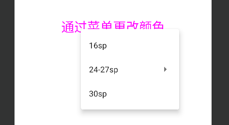


### 侧滑菜单 DrawerLayout

* 主内容视图一定要是DrawerLayout的第一个子视图
* 主内容视图宽度和高度需要match_parent
* 必须显示指定侧滑视图的android:**layout_gravity属性** android:layout_gravity = "start"时，从左向右滑出菜单 android:layout_gravity = "end"时，从右向左滑出菜单 不推荐使用left和right
* 侧滑视图的宽度以dp为单位，不建议超过**320dp**
* 设置侧滑事件：mDrawerLayout.setDrawerListener(DrawerLayout.DrawerListener)


#### 布局

##### activity_main

```xml
<?xml version="1.0" encoding="utf-8"?>
<androidx.drawerlayout.widget.DrawerLayout xmlns:android="http://schemas.android.com/apk/res/android"
        xmlns:tools="http://schemas.android.com/tools"
        xmlns:app="http://schemas.android.com/apk/res-auto"
        android:id="@+id/DrawerLayout"
        android:layout_width="match_parent"
        android:layout_height="match_parent"
        tools:context=".MainActivity">

    <FrameLayout
            android:id="@+id/ly_content"
            android:layout_width="match_parent"
            android:layout_height="match_parent" />

    <ListView
            android:id="@+id/list_left_drawer"
            android:layout_width="180dp"
            android:layout_height="match_parent"
            android:layout_gravity="start"
            android:background="#080808"
            android:choiceMode="singleChoice"
            android:divider="#FFFFFF"
            android:dividerHeight="1dp" />

</androidx.drawerlayout.widget.DrawerLayout>
```


##### fg_content

```xml
<?xml version="1.0" encoding="utf-8"?>
<RelativeLayout xmlns:android="http://schemas.android.com/apk/res/android"
        android:layout_width="match_parent"
        android:layout_height="match_parent"
        android:orientation="vertical">

    <TextView
            android:id="@+id/tv_content"
            android:layout_width="wrap_content"
            android:layout_height="wrap_content"
            android:layout_centerInParent="true"
            android:textSize="25sp" />

</RelativeLayout>
```


##### item_list

```xml
<?xml version="1.0" encoding="utf-8"?>
<RelativeLayout xmlns:android="http://schemas.android.com/apk/res/android"
        android:layout_width="match_parent"
        android:layout_height="48dp"
        android:gravity="center"
        android:orientation="horizontal">

    <ImageView
            android:id="@+id/img_icon"
            android:layout_width="24dp"
            android:layout_height="24dp"
            android:focusable="false" />

    <TextView
            android:id="@+id/txt_content"
            android:layout_width="wrap_content"
            android:layout_height="wrap_content"
            android:layout_marginLeft="10dp"
            android:layout_toRightOf="@id/img_icon"
            android:textColor="#FFFFFF"
            android:textSize="18sp" />
</RelativeLayout>
```


#### 实体类

##### Item

```java
package mao.android_drawerlayout.entity;

/**
 * Project name(项目名称)：android_DrawerLayout
 * Package(包名): mao.android_drawerlayout.entity
 * Class(类名): Item
 * Author(作者）: mao
 * Author QQ：1296193245
 * GitHub：https://github.com/maomao124/
 * Date(创建日期)： 2022/10/8
 * Time(创建时间)： 20:23
 * Version(版本): 1.0
 * Description(描述)： 无
 */


public class Item
{
    /**
     * 图标标识
     */
    private int iconId;

    /**
     * 图标名字
     */
    private String iconName;

    /**
     * Instantiates a new Item.
     */
    public Item()
    {
    }

    /**
     * Instantiates a new Item.
     *
     * @param iconId   the icon id
     * @param iconName the icon name
     */
    public Item(int iconId, String iconName)
    {
        this.iconId = iconId;
        this.iconName = iconName;
    }


    /**
     * Gets icon id.
     *
     * @return the icon id
     */
    public int getIconId()
    {
        return iconId;
    }

    /**
     * Sets icon id.
     *
     * @param iconId the icon id
     * @return the icon id
     */
    public Item setIconId(int iconId)
    {
        this.iconId = iconId;
        return this;
    }

    /**
     * Gets icon name.
     *
     * @return the icon name
     */
    public String getIconName()
    {
        return iconName;
    }

    /**
     * Sets icon name.
     *
     * @param iconName the icon name
     * @return the icon name
     */
    public Item setIconName(String iconName)
    {
        this.iconName = iconName;
        return this;
    }

    @Override
    @SuppressWarnings("all")
    public String toString()
    {
        final StringBuilder stringbuilder = new StringBuilder();
        stringbuilder.append("iconId：").append(iconId).append('\n');
        stringbuilder.append("iconName：").append(iconName).append('\n');
        return stringbuilder.toString();
    }
}
```


#### 适配器

##### MyAdapter

```java
package mao.android_drawerlayout.adapter;

import android.content.Context;
import android.util.SparseArray;
import android.view.LayoutInflater;
import android.view.View;
import android.view.ViewGroup;
import android.widget.BaseAdapter;
import android.widget.ImageView;
import android.widget.TextView;

import java.util.ArrayList;

/**
 * Project name(项目名称)：android_DrawerLayout
 * Package(包名): mao.android_drawerlayout.adapter
 * Class(类名): MyAdapter
 * Author(作者）: mao
 * Author QQ：1296193245
 * GitHub：https://github.com/maomao124/
 * Date(创建日期)： 2022/10/8
 * Time(创建时间)： 20:24
 * Version(版本): 1.0
 * Description(描述)： 无
 *
 * @param <T> the type parameter
 */


public abstract class MyAdapter<T> extends BaseAdapter
{
    private ArrayList<T> mData;
    private int mLayoutRes;           //布局id


    /**
     * Instantiates a new My adapter.
     */
    public MyAdapter()
    {
    }

    /**
     * Instantiates a new My adapter.
     *
     * @param mData      the m data
     * @param mLayoutRes the m layout res
     */
    public MyAdapter(ArrayList<T> mData, int mLayoutRes)
    {
        this.mData = mData;
        this.mLayoutRes = mLayoutRes;
    }

    @Override
    public int getCount()
    {
        return mData != null ? mData.size() : 0;
    }

    @Override
    public T getItem(int position)
    {
        return mData.get(position);
    }

    @Override
    public long getItemId(int position)
    {
        return position;
    }

    @Override
    public View getView(int position, View convertView, ViewGroup parent)
    {
        ViewHolder holder = ViewHolder.bind(parent.getContext(), convertView, parent, mLayoutRes
                , position);
        bindView(holder, getItem(position));
        return holder.getItemView();
    }

    /**
     * Bind view.
     *
     * @param holder the holder
     * @param obj    the obj
     */
    public abstract void bindView(ViewHolder holder, T obj);

    /**
     * 添加一个元素
     *
     * @param data the data
     */
    public void add(T data)
    {
        if (mData == null)
        {
            mData = new ArrayList<>();
        }
        mData.add(data);
        notifyDataSetChanged();
    }

    /**
     * 往特定位置，添加一个元素
     *
     * @param position the position
     * @param data     the data
     */
    public void add(int position, T data)
    {
        if (mData == null)
        {
            mData = new ArrayList<>();
        }
        mData.add(position, data);
        notifyDataSetChanged();
    }

    /**
     * Remove.
     *
     * @param data the data
     */
    public void remove(T data)
    {
        if (mData != null)
        {
            mData.remove(data);
        }
        notifyDataSetChanged();
    }

    /**
     * Remove.
     *
     * @param position the position
     */
    public void remove(int position)
    {
        if (mData != null)
        {
            mData.remove(position);
        }
        notifyDataSetChanged();
    }

    /**
     * Clear.
     */
    public void clear()
    {
        if (mData != null)
        {
            mData.clear();
        }
        notifyDataSetChanged();
    }


    /**
     * The type View holder.
     */
    public static class ViewHolder
    {

        private SparseArray<View> mViews;   //存储ListView 的 item中的View
        private View item;                  //存放convertView
        private int position;               //游标
        private Context context;            //Context上下文

        //构造方法，完成相关初始化
        private ViewHolder(Context context, ViewGroup parent, int layoutRes)
        {
            mViews = new SparseArray<>();
            this.context = context;
            View convertView = LayoutInflater.from(context).inflate(layoutRes, parent, false);
            convertView.setTag(this);
            item = convertView;
        }

        /**
         * Bind view holder.
         *
         * @param context     the context
         * @param convertView the convert view
         * @param parent      the parent
         * @param layoutRes   the layout res
         * @param position    the position
         * @return the view holder
         */
        //绑定ViewHolder与item
        public static ViewHolder bind(Context context, View convertView, ViewGroup parent,
                                      int layoutRes, int position)
        {
            ViewHolder holder;
            if (convertView == null)
            {
                holder = new ViewHolder(context, parent, layoutRes);
            }
            else
            {
                holder = (ViewHolder) convertView.getTag();
                holder.item = convertView;
            }
            holder.position = position;
            return holder;
        }

        /**
         * Gets view.
         *
         * @param <T> the type parameter
         * @param id  the id
         * @return the view
         */
        @SuppressWarnings("unchecked")
        public <T extends View> T getView(int id)
        {
            T t = (T) mViews.get(id);
            if (t == null)
            {
                t = (T) item.findViewById(id);
                mViews.put(id, t);
            }
            return t;
        }


        /**
         * 获取当前条目
         *
         * @return the item view
         */
        public View getItemView()
        {
            return item;
        }

        /**
         * 获取条目位置
         *
         * @return the item position
         */
        public int getItemPosition()
        {
            return position;
        }

        /**
         * 设置文字
         *
         * @param id   the id
         * @param text the text
         * @return the text
         */
        public ViewHolder setText(int id, CharSequence text)
        {
            View view = getView(id);
            if (view instanceof TextView)
            {
                ((TextView) view).setText(text);
            }
            return this;
        }

        /**
         * 设置图片
         *
         * @param id          the id
         * @param drawableRes the drawable res
         * @return the image resource
         */
        public ViewHolder setImageResource(int id, int drawableRes)
        {
            View view = getView(id);
            if (view instanceof ImageView)
            {
                ((ImageView) view).setImageResource(drawableRes);
            }
            else
            {
                view.setBackgroundResource(drawableRes);
            }
            return this;
        }


        /**
         * 设置点击监听
         *
         * @param id       the id
         * @param listener the listener
         * @return the on click listener
         */
        public ViewHolder setOnClickListener(int id, View.OnClickListener listener)
        {
            getView(id).setOnClickListener(listener);
            return this;
        }

        /**
         * 设置可见
         *
         * @param id      the id
         * @param visible the visible
         * @return the visibility
         */
        public ViewHolder setVisibility(int id, int visible)
        {
            getView(id).setVisibility(visible);
            return this;
        }

        /**
         * 设置标签
         *
         * @param id  the id
         * @param obj the obj
         * @return the tag
         */
        public ViewHolder setTag(int id, Object obj)
        {
            getView(id).setTag(obj);
            return this;
        }
    }
}
```


#### 碎片

##### ContentFragment

```java
package mao.android_drawerlayout;

import android.os.Bundle;
import android.view.LayoutInflater;
import android.view.View;
import android.view.ViewGroup;
import android.widget.TextView;

import androidx.fragment.app.Fragment;

/**
 * Project name(项目名称)：android_DrawerLayout
 * Package(包名): mao.android_drawerlayout
 * Class(类名): ContentFragment
 * Author(作者）: mao
 * Author QQ：1296193245
 * GitHub：https://github.com/maomao124/
 * Date(创建日期)： 2022/10/8
 * Time(创建时间)： 20:20
 * Version(版本): 1.0
 * Description(描述)： 无
 */

public class ContentFragment extends Fragment
{
    private TextView tv_content;

    @Override
    public View onCreateView(LayoutInflater inflater, ViewGroup container, Bundle savedInstanceState)
    {
        View view = inflater.inflate(R.layout.fg_content, container, false);
        tv_content = view.findViewById(R.id.tv_content);
        String text = getArguments().getString("text");
        tv_content.setText(text);
        return view;
    }
}
```


#### Activity

##### MainActivity

```java
package mao.android_drawerlayout;

import androidx.appcompat.app.AppCompatActivity;
import androidx.drawerlayout.widget.DrawerLayout;
import androidx.fragment.app.FragmentManager;

import android.os.Bundle;
import android.view.View;
import android.widget.AdapterView;
import android.widget.ListView;

import java.util.ArrayList;

import mao.android_drawerlayout.adapter.MyAdapter;
import mao.android_drawerlayout.entity.Item;

public class MainActivity extends AppCompatActivity implements AdapterView.OnItemClickListener
{

    private DrawerLayout drawer_layout;
    private ListView list_left_drawer;
    private ArrayList<Item> menuLists;
    private MyAdapter<Item> myAdapter = null;

    @Override
    protected void onCreate(Bundle savedInstanceState)
    {
        super.onCreate(savedInstanceState);
        setContentView(R.layout.activity_main);

        drawer_layout = findViewById(R.id.DrawerLayout);
        list_left_drawer = findViewById(R.id.list_left_drawer);

        menuLists = new ArrayList<Item>();
        menuLists.add(new Item(R.mipmap.ic_launcher_round, "选项一"));
        menuLists.add(new Item(R.mipmap.ic_launcher_round, "选项二"));
        menuLists.add(new Item(R.mipmap.ic_launcher_round, "选项三"));
        menuLists.add(new Item(R.mipmap.ic_launcher_round, "选项四"));
        menuLists.add(new Item(R.mipmap.ic_launcher_round, "选项五"));
        menuLists.add(new Item(R.mipmap.ic_launcher_round, "选项六"));

        myAdapter = new MyAdapter<Item>(menuLists, R.layout.item_list)
        {
            @Override
            public void bindView(ViewHolder holder, Item obj)
            {
                holder.setImageResource(R.id.img_icon, obj.getIconId());
                holder.setText(R.id.txt_content, obj.getIconName());
            }
        };
        list_left_drawer.setAdapter(myAdapter);
        list_left_drawer.setOnItemClickListener(this);
    }

    @Override
    public void onItemClick(AdapterView<?> parent, View view, int position, long id)
    {
        ContentFragment contentFragment = new ContentFragment();
        Bundle args = new Bundle();
        args.putString("text", menuLists.get(position).getIconName());
        contentFragment.setArguments(args);
        FragmentManager fm = getSupportFragmentManager();
        fm.beginTransaction().replace(R.id.ly_content, contentFragment).commit();
        drawer_layout.closeDrawer(list_left_drawer);
    }
}
```


#### 运行


### 网页视图 WebView

WebView是Android内置webkit内核的高性能浏览器,而WebView则是在这个基础上进行封装后的一个 控件,WebView直译网页视图,我们可以简单的看作一个可以嵌套到界面上的一个浏览器控件


#### 相关方法

**WebChromeClient**：辅助WebView处理Javascript的对话框、网站图标、网站title、加载进度等


|                             方法                             |            作用            |
| :----------------------------------------------------------: | :------------------------: |
| **onJsAlert**(WebView view,String url,String message,JsResult result) |   处理Js中的Alert对话框    |
| **onJsConfirm**(WebView view,String url,String message,JsResult result) |  处理Js中的Confirm对话框   |
| **onJsPrompt**(WebView view,String url,String message,String defaultValue,JsPromptResult result) |   处理Js中的Prompt对话框   |
|     **onProgressChanged**(WebView view,int newProgress)      | 当加载进度条发生改变时调用 |
|        **onReceivedIcon**(WebView view, Bitmap icon)         |       获得网页的icon       |
|       **onReceivedTitle**(WebView view, String title)        |       获得网页的标题       |


**WebViewClient**：辅助WebView处理各种通知与请求事件


|                             方法                             |                             作用                             |
| :----------------------------------------------------------: | :----------------------------------------------------------: |
|          **onPageStared**(WebView view,String url)           |                    通知主程序网页开始加载                    |
|  **onPageFinished**(WebView view,String url,Bitmap favicon)  |                   通知主程序,网页加载完毕                    |
| **doUpdateVisitedHistory**(WebView view,String url,boolean isReload) |                         更新历史记录                         |
|         **onLoadResource**(WebView view,String url)          |            通知主程序WebView即将加载指定url的资源            |
| **onScaleChanged**(WebView view,float oldScale,float newScale) |                 ViewView的缩放发生改变时调用                 |
|   **shouldOverrideKeyEvent**(WebView view,KeyEvent event)    | 控制webView是否处理按键时间,如果返回true,则WebView不处理,返回false则处理 |
|    **shouldOverrideUrlLoading**(WebView view,String url)     | 控制对新加载的Url的处理,返回true,说明主程序处理WebView不做处理,返回false意味着WebView会对其进行处理 |
| **onReceivedError**(WebView view,int errorCode,String description,String failingUrl) |                 遇到不可恢复的错误信息时调用                 |


**WebSettings**：WebView相关配置的设置，比如setJavaScriptEnabled()设置是否允许JS脚本执行


|                             方法                             |                             作用                             |
| :----------------------------------------------------------: | :----------------------------------------------------------: |
|                      **getSettings**()                       |      返回一个WebSettings对象,用来控制WebView的属性设置       |
|                   **loadUrl**(String url)                    |                        加载指定的Url                         |
|  **loadData**(String data,String mimeType,String encoding)   | 加载指定的Data到WebView中.使用"data:"作为标记头,该方法不能加载网络数据.其中mimeType为数据类型如:textml,image/jpeg. encoding为字符的编码方式 |
| **loadDataWithBaseURL**(String baseUrl, String data, String mimeType, String encoding, String historyUrl) |                   比上面的loadData更加强大                   |
|          **setWebViewClient**(WebViewClient client)          | 为WebView指定一个WebViewClient对象.WebViewClient可以辅助WebView处理各种通知,请求等事件。 |
|        **setWebChromeClient**(WebChromeClient client)        | 为WebView指定一个WebChromeClient对象,WebChromeClient专门用来辅助WebView处理js的对话框,网站title,网站图标,加载进度条等 |


**loadUrl**()：直接显示网页内容(单独显示网络图片)，一般不会出现乱码。* **loadData***(data, "text/html", "UTF-8")：用来加载URI格式的数据，不能通过网络来加载内容， 不能加载图片，而且经常会遇到乱码的问题，我们知道String类型的数据主要是Unicode编码的， 而WebView一般为了节省资源使用的是UTF-8编码，尽管我们按上面写了，但是还需要为webView设置： webview.getSettings().setDefaultTextEncodingName("UTF -8");* **loadDataWithBaseURL***(baseUrl, string, "text/html", "utf-8", null)：loadData类的一个 增强类，可以加载图片，baseUrl为你存储的图片路径，而且只需在这里设置utf-8就可以解决乱码 问题了


#### 直接在Activity上加载一个WebView


```xml
<?xml version="1.0" encoding="utf-8"?>
<WebView xmlns:android="http://schemas.android.com/apk/res/android"
        xmlns:tools="http://schemas.android.com/tools"
        xmlns:app="http://schemas.android.com/apk/res-auto"
        android:id="@+id/WebView"
        android:layout_width="match_parent"
        android:layout_height="match_parent"
        tools:context=".MainActivity">


</WebView>
```


```java
package mao.android_webview;

import androidx.appcompat.app.AppCompatActivity;

import android.annotation.SuppressLint;
import android.os.Bundle;
import android.webkit.WebResourceRequest;
import android.webkit.WebView;
import android.webkit.WebViewClient;
import android.widget.Toast;

public class MainActivity extends AppCompatActivity
{

    /**
     * web视图
     */
    private WebView webView;

    /**
     * 退出时间
     */
    private long exitTime = 0;

    @SuppressLint("SetJavaScriptEnabled")
    @Override
    protected void onCreate(Bundle savedInstanceState)
    {
        super.onCreate(savedInstanceState);
        setContentView(R.layout.activity_main);

        webView = findViewById(R.id.WebView);

        webView.setWebViewClient(new WebViewClient()
        {
            @Override
            public boolean shouldOverrideUrlLoading(WebView view, String url)
            {
                view.loadUrl(url);
                return true;
            }
        });

        webView.getSettings().setJavaScriptEnabled(true);
        webView.getSettings().setBuiltInZoomControls(true);//支持缩放
        webView.getSettings().setUseWideViewPort(true);
        webView.getSettings().setLoadWithOverviewMode(true);
        webView.getSettings().setAllowContentAccess(true);
        webView.getSettings().setAppCacheEnabled(true);//是否使用缓存

        webView.loadUrl("https://www.bilibili.com/");
    }

    @Override
    public void onBackPressed()
    {
        if (webView.canGoBack())
        {
            webView.goBack();
        }
        else
        {
            if ((System.currentTimeMillis() - exitTime) > 2000)
            {
                Toast.makeText(getApplicationContext(), "再按一次退出程序",
                        Toast.LENGTH_SHORT).show();
                exitTime = System.currentTimeMillis();
            }
            else
            {
                super.onBackPressed();
            }

        }
    }
}
```


```xml
<?xml version="1.0" encoding="utf-8"?>
<manifest xmlns:android="http://schemas.android.com/apk/res/android"
        xmlns:tools="http://schemas.android.com/tools">

    <uses-permission android:name="android.permission.INTERNET" />

    <application
            android:usesCleartextTraffic="true"
            android:allowBackup="true"
            android:dataExtractionRules="@xml/data_extraction_rules"
            android:fullBackupContent="@xml/backup_rules"
            android:icon="@mipmap/ic_launcher"
            android:label="@string/app_name"
            android:roundIcon="@mipmap/ic_launcher_round"
            android:supportsRtl="true"
            android:theme="@style/Theme.Android_WebView"
            tools:targetApi="31">
        <activity
                android:name=".MainActivity"
                android:exported="true">
            <intent-filter>
                <action android:name="android.intent.action.MAIN" />

                <category android:name="android.intent.category.LAUNCHER" />
            </intent-filter>

            <meta-data
                    android:name="android.app.lib_name"
                    android:value="" />
        </activity>
    </application>

</manifest>
```


# 碎片Fragment

## 概念

碎片Fragment是个特别的存在，它有点像报纸上的专栏，看起来只占据页面的一小块区域，但是这一区 域有自己的生命周期，可以自行其是，仿佛独立王国；并且该区域只占据空间不扰乱业务，添加之后不 影响宿主页面的其他区域，去除之后也不影响宿主页面的其他区域

每个碎片都有对应的XML布局文件，依据其使用方式可分为静态注册与动态注册两类。静态注册指的是 在XML文件中直接放置fragment节点，类似于一个普通控件，可被多个布局文件同时引用。静态注册一 般用于某个通用的页面部件（如Logo条、广告条等），每个活动页面均可直接引用该部件

他出现的初衷是为了适应大屏幕的平板电脑， 当然现在他仍然是平板APP UI设计的宠儿，而且我们普通手机开发也会加入这个Fragment， 我们可以把他看成一个小型的Activity，又称Activity片段！想想，如果一个很大的界面，我们 就一个布局，写起界面来会有多麻烦，而且如果组件多的话是管理起来也很麻烦！而使用Fragment 我们可以把屏幕划分成几块，然后进行分组，进行一个模块化的管理！从而可以更加方便的在 运行过程中动态地更新Activity的用户界面！另外Fragment并不能单独使用，他需要嵌套在Activity 中使用，尽管他拥有自己的生命周期，但是还是会受到宿主Activity的生命周期的影响，比如Activity 被destory销毁了，他也会跟着销毁

- 3.0版本后引入,即minSdk要大于11
- Fragment需要嵌套在Activity中使用,当然也可以嵌套到另外一个Fragment中,但这个被嵌套 的Fragment也是需要嵌套在Activity中的,间接地说,Fragment还是需要嵌套在Activity中!! 受寄主Activity的生命周期影响,当然他也有自己的生命周期!另外不建议在Fragment里面 嵌套Fragment因为嵌套在里面的Fragment生命周期不可控


## 生命周期


## 碎片的静态注册


fragment_static.xml

```xml
<?xml version="1.0" encoding="utf-8"?>
<LinearLayout xmlns:android="http://schemas.android.com/apk/res/android"
        android:orientation="horizontal"
        android:layout_width="match_parent"
        android:layout_height="match_parent">

    <TextView
            android:id="@+id/tv_adv"
            android:layout_width="0dp"
            android:layout_height="match_parent"
            android:layout_weight="1"
            android:gravity="center"
            android:text="广告图片"
            android:textColor="#000000"
            android:textSize="17sp" />

    <ImageView
            android:id="@+id/iv_adv"
            android:layout_width="0dp"
            android:layout_height="match_parent"
            android:layout_weight="2"
            android:src="@mipmap/ic_launcher"
            android:scaleType="fitCenter" />


</LinearLayout>
```


BlankFragment

```java
package mao.android_fragment.fragment;

import android.os.Bundle;

import androidx.fragment.app.Fragment;

import android.view.LayoutInflater;
import android.view.View;
import android.view.ViewGroup;
import android.widget.ImageView;
import android.widget.TextView;
import android.widget.Toast;

import mao.android_fragment.R;


public class BlankFragment extends Fragment
{

    @Override
    public View onCreateView(LayoutInflater inflater, ViewGroup container,
                             Bundle savedInstanceState)
    {
        View view = inflater.inflate(R.layout.fragment_static, container, false);
        TextView tv_adv = view.findViewById(R.id.tv_adv);
        ImageView iv_adv = view.findViewById(R.id.iv_adv);
        tv_adv.setOnClickListener(new View.OnClickListener()
        {
            @Override
            public void onClick(View v)
            {
                Toast.makeText(getActivity(), "点击了广告文本", Toast.LENGTH_SHORT).show();
            }
        });

        iv_adv.setOnClickListener(new View.OnClickListener()
        {
            @Override
            public void onClick(View v)
            {
                Toast.makeText(getActivity(), "点击了广告图片", Toast.LENGTH_SHORT).show();
            }
        });
        return view;
    }
}
```


若想在活动页面的XML文件中引用上面定义的StaticFragment，可以直接添加一个fragment节点，但需注意下列两点：

* fragment节点必须指定id属性，否则App运行会报错
* fragment节点必须通过name属性指定碎片类的完整路径


```xml
<?xml version="1.0" encoding="utf-8"?>
<androidx.constraintlayout.widget.ConstraintLayout xmlns:android="http://schemas.android.com/apk/res/android"
        xmlns:tools="http://schemas.android.com/tools"
        xmlns:app="http://schemas.android.com/apk/res-auto"
        android:layout_width="match_parent"
        android:layout_height="match_parent"
        tools:context=".MainActivity">


    <FrameLayout
            android:id="@+id/fragment_static"
            android:name="mao.android_fragment.fragment.BlankFragment"
            android:layout_width="match_parent"
            android:layout_height="wrap_content"
            app:layout_constraintLeft_toLeftOf="parent"
            app:layout_constraintRight_toRightOf="parent"/>


    <TextView
            android:layout_width="wrap_content"
            android:layout_height="wrap_content"
            android:text="Hello World!"
            app:layout_constraintBottom_toBottomOf="parent"
            app:layout_constraintStart_toStartOf="parent"
            app:layout_constraintEnd_toEndOf="parent"
            app:layout_constraintTop_toTopOf="parent"
            android:id="@+id/textView" />

</androidx.constraintlayout.widget.ConstraintLayout>
```


Activity在onCreate( )方法中调用setContentView()加载布局文件


## 碎片的动态注册

碎片拥有两种使用方式，也就是静态注册和动态注册。相比静态注册，实际开发中动态注册用得更多。 静态注册是在XML文件中直接添加fragment节点，而动态注册迟至代码执行时才动态添加碎片。动态生成的碎片基本给翻页视图使用


https://blog.csdn.net/shaochen2015821426/article/details/79461921


# 后台服务Service

## Service与Thread线程的区别

Thread是线程，程序执行的最小单元，分配CPU的基本单位！ 而Service则是Android提供一个允许长时间留驻后台的一个组件，最常见的用法就是做轮询操作！或者想在后台做一些事情，比如后台下载更新


## Service的生命周期


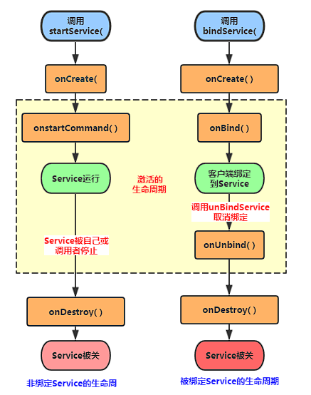


## 相关方法

- **onCreate()**：当Service第一次被创建后立即回调该方法，该方法在整个生命周期 中只会调用一次！
- **onDestory()**：当Service被关闭时会回调该方法，该方法只会回调一次！
- **onStartCommand(intent,flag,startId)**：早期版本是onStart(intent,startId), 当客户端调用startService(Intent)方法时会回调，可多次调用StartService方法， 但不会再创建新的Service对象，而是继续复用前面产生的Service对象，但会继续回调 onStartCommand()方法！
- **IBinder onOnbind(intent)**：该方法是Service都必须实现的方法，该方法会返回一个 IBinder对象，app通过该对象与Service组件进行通信！
- **onUnbind(intent)**：当该Service上绑定的所有客户端都断开时会回调该方法


## 启动方式

### StartService启动Service

* 首次启动会创建一个Service实例,依次调用onCreate()和onStartCommand()方法,此时Service 进入运行状态,如果再次调用StartService启动Service,将不会再创建新的Service对象, 系统会直接复用前面创建的Service对象,调用它的onStartCommand()方法！
* 但这样的Service与它的调用者无必然的联系,就是说当调用者结束了自己的生命周期, 但是只要不调用stopService,那么Service还是会继续运行的!
* 无论启动了多少次Service,只需调用一次StopService即可停掉Service


### BindService启动Service

* 当首次使用bindService绑定一个Service时,系统会实例化一个Service实例,并调用其onCreate()和onBind()方法,然后调用者就可以通过IBinder和Service进行交互了,此后如果再次使用bindService绑定Service,系统不会创建新的Sevice实例,也不会再调用onBind()方法,只会直接把IBinder对象传递给其他后来增加的客户端
* 如果我们解除与服务的绑定,只需调用unbindService(),此时onUnbind和onDestory方法将会被调用!这是一个客户端的情况,假如是多个客户端绑定同一个Service的话,情况如下 当一个客户完成和service之间的互动后，它调用 unbindService() 方法来解除绑定。当所有的客户端都和service解除绑定后，系统会销毁service。（除非service也被startService()方法开启）
* 另外,和上面那张情况不同,bindService模式下的Service是与调用者相互关联的,可以理解为 "一条绳子上的蚂蚱",要死一起死,在bindService后,一旦调用者销毁,那么Service也立即终止


bindService(Intent Service,ServiceConnection conn,int flags)方法说明：

* **service**:通过该intent指定要启动的Service
* **conn**:ServiceConnection对象,用户监听访问者与Service间的连接情况, 连接成功回调该对象中的onServiceConnected(ComponentName,IBinder)方法; 如果Service所在的宿主由于异常终止或者其他原因终止,导致Service与访问者间断开连接时调用***onServiceDisconnected***(CompanentName)方法,主动通过**unBindService()** 方法断开并不会调用上述方法
* **flags**:指定绑定时是否自动创建Service(如果Service还未创建), 参数可以是0(不自动创建),BIND_AUTO_CREATE(自动创建)


## 生命周期验证

### StartService启动Service


```java
package mao.android_startservice.service;

import android.app.Service;
import android.content.Intent;
import android.os.IBinder;
import android.util.Log;

public class MyService extends Service
{

    /**
     * 标签
     */
    private static final String TAG = "MyService";

    public MyService()
    {
    }

    @Override
    public IBinder onBind(Intent intent)
    {
        Log.d(TAG, "onBind: ");
        return null;
    }

    @Override
    public void onCreate()
    {
        Log.d(TAG, "onCreate: ");
    }

    @Override
    public int onStartCommand(Intent intent, int flags, int startId)
    {
        Log.d(TAG, "onStartCommand: ");
        return super.onStartCommand(intent, flags, startId);
    }

    @Override
    public void onDestroy()
    {
        Log.d(TAG, "onDestroy: ");
    }
}
```


```xml
<?xml version="1.0" encoding="utf-8"?>
<manifest xmlns:android="http://schemas.android.com/apk/res/android"
        xmlns:tools="http://schemas.android.com/tools">

    <application
            android:allowBackup="true"
            android:dataExtractionRules="@xml/data_extraction_rules"
            android:fullBackupContent="@xml/backup_rules"
            android:icon="@mipmap/ic_launcher"
            android:label="@string/app_name"
            android:roundIcon="@mipmap/ic_launcher_round"
            android:supportsRtl="true"
            android:theme="@style/Theme.Android_StartService"
            tools:targetApi="31">

        <service
                android:name=".service.MyService"
                android:enabled="true"
                android:exported="true">
            <intent-filter>
                <action android:name="mao.android_startservice.service.MYSERVICE" />
            </intent-filter>

        </service>


        <activity
                android:name=".MainActivity"
                android:exported="true">
            <intent-filter>
                <action android:name="android.intent.action.MAIN" />

                <category android:name="android.intent.category.LAUNCHER" />
            </intent-filter>

            <meta-data
                    android:name="android.app.lib_name"
                    android:value="" />
        </activity>
    </application>

</manifest>
```


```xml
<?xml version="1.0" encoding="utf-8"?>
<androidx.constraintlayout.widget.ConstraintLayout xmlns:android="http://schemas.android.com/apk/res/android"
        xmlns:tools="http://schemas.android.com/tools"
        xmlns:app="http://schemas.android.com/apk/res-auto"
        android:layout_width="match_parent"
        android:layout_height="match_parent"
        tools:context=".MainActivity">

    <Button
            android:id="@+id/button1"
            android:layout_width="wrap_content"
            android:layout_height="wrap_content"
            android:text="开始服务"
            app:layout_constraintEnd_toEndOf="parent"
            android:layout_marginEnd="268dp" />

    <Button
            android:layout_width="wrap_content"
            android:layout_height="wrap_content"
            android:text="停止服务"
            android:id="@+id/button2"
            app:layout_constraintStart_toEndOf="@id/button1"
            android:layout_marginStart="120dp" />

</androidx.constraintlayout.widget.ConstraintLayout>
```


```java
package mao.android_startservice;

import androidx.appcompat.app.AppCompatActivity;

import android.content.Intent;
import android.os.Bundle;
import android.view.View;

public class MainActivity extends AppCompatActivity
{

    @Override
    protected void onCreate(Bundle savedInstanceState)
    {
        super.onCreate(savedInstanceState);
        setContentView(R.layout.activity_main);

        Intent intent = new Intent();
        intent.setAction("mao.android_startservice.service.MYSERVICE");
        intent.setPackage("mao.android_startservice");

        findViewById(R.id.button1).setOnClickListener(new View.OnClickListener()
        {
            @Override
            public void onClick(View v)
            {
                startService(intent);
            }
        });

        findViewById(R.id.button2).setOnClickListener(new View.OnClickListener()
        {
            @Override
            public void onClick(View v)
            {
                stopService(intent);
            }
        });
    }
}
```


### BindService启动Service

Context的bindService方法：

- ServiceConnection对象:监听访问者与Service间的连接情况,如果成功连接,回调 onServiceConnected(),如果异常终止或者其他原因终止导致Service与访问者断开 连接则回调onServiceDisconnected方法,调用unBindService()不会调用该方法!
- onServiceConnected方法中有一个IBinder对象,该对象即可实现与被绑定Service 之间的通信!我们再开发Service类时,默认需要实现IBinder onBind()方法,该方法返回的 IBinder对象会传到ServiceConnection对象中的onServiceConnected的参数,我们就可以 在这里通过这个IBinder与Service进行通信!


步骤：

* **Step 1:**在自定义的Service中继承Binder,实现自己的IBinder对象
* **Step 2:**通过onBind( )方法返回自己的IBinder对象
* **Step 3:**在绑定该Service的类中定义一个ServiceConnection对象,重写两个方法, onServiceConnected和onDisconnected！然后直接读取IBinder传递过来的参数即可


```java
package mao.android_bindservice.service;

import android.app.Service;
import android.content.Intent;
import android.os.Binder;
import android.os.IBinder;
import android.util.Log;

public class MyService extends Service
{

    /**
     * 标签
     */
    private static final String TAG = "MyService";

    private int count;

    private volatile boolean quit;


    //定义onBinder方法所返回的对象
    private final MyBinder binder = new MyBinder();

    public class MyBinder extends Binder
    {
        public int getCount()
        {
            return count;
        }
    }


    public MyService()
    {
    }

    @Override
    public IBinder onBind(Intent intent)
    {
        Log.d(TAG, "onBind: ");
        return binder;
    }

    @Override
    public void onCreate()
    {
        super.onCreate();

        Log.d(TAG, "onCreate: ");
        new Thread(new Runnable()
        {
            @Override
            public void run()
            {
                while (!quit)
                {
                    try
                    {
                        Thread.sleep(1000);
                    }
                    catch (InterruptedException e)
                    {
                        e.printStackTrace();
                    }
                    count++;
                }
            }
        }).start();
    }

    @Override
    public boolean onUnbind(Intent intent)
    {
        Log.d(TAG, "onUnbind: ");
        return true;
    }


    @Override
    public void onDestroy()
    {
        this.quit = true;
    }

    @Override
    public void onRebind(Intent intent)
    {
        super.onRebind(intent);
        Log.d(TAG, "onRebind: ");
    }
}
```


```xml
<?xml version="1.0" encoding="utf-8"?>
<androidx.constraintlayout.widget.ConstraintLayout xmlns:android="http://schemas.android.com/apk/res/android"
        xmlns:tools="http://schemas.android.com/tools"
        xmlns:app="http://schemas.android.com/apk/res-auto"
        android:layout_width="match_parent"
        android:layout_height="match_parent"
        tools:context=".MainActivity">

    <Button
            android:id="@+id/Button1"
            android:layout_width="wrap_content"
            android:layout_height="wrap_content"
            android:text="绑定service"
            app:layout_constraintTop_toTopOf="parent"
            app:layout_constraintStart_toStartOf="parent"
            app:layout_constraintEnd_toEndOf="parent"
            android:layout_marginTop="88dp" />

    <Button
            android:id="@+id/Button2"
            android:layout_width="wrap_content"
            android:layout_height="wrap_content"
            android:text="取消绑定service"
            app:layout_constraintTop_toBottomOf="@+id/Button1"
            app:layout_constraintStart_toStartOf="parent"
            app:layout_constraintEnd_toEndOf="parent"
            android:layout_marginTop="164dp" />

    <Button
            android:id="@+id/Button3"
            android:layout_width="wrap_content"
            android:layout_height="wrap_content"
            android:text="获取service状态"
            app:layout_constraintTop_toBottomOf="@+id/Button2"
            app:layout_constraintBottom_toBottomOf="parent"
            app:layout_constraintStart_toStartOf="parent"
            app:layout_constraintEnd_toEndOf="parent" />

</androidx.constraintlayout.widget.ConstraintLayout>
```


```java
package mao.android_bindservice;

import androidx.appcompat.app.AppCompatActivity;

import android.app.Service;
import android.content.ComponentName;
import android.content.Intent;
import android.content.ServiceConnection;
import android.os.Bundle;
import android.os.IBinder;
import android.util.Log;
import android.view.View;
import android.widget.Toast;

import mao.android_bindservice.service.MyService;

public class MainActivity extends AppCompatActivity
{


    private MyService.MyBinder binder;

    /**
     * 标签
     */
    private static final String TAG = "MainActivity";

    private final ServiceConnection conn = new ServiceConnection()
    {
        @Override
        public void onServiceConnected(ComponentName name, IBinder service)
        {
            Log.d(TAG, "onServiceConnected: ");
            binder = (MyService.MyBinder) service;
        }

        @Override
        public void onServiceDisconnected(ComponentName name)
        {
            Log.d(TAG, "onServiceDisconnected: ");
        }
    };


    @Override
    protected void onCreate(Bundle savedInstanceState)
    {
        super.onCreate(savedInstanceState);
        setContentView(R.layout.activity_main);

        Intent intent = new Intent();
        intent.setAction("mao.android_bindservice.service.MyService");
        intent.setPackage("mao.android_bindservice");

        findViewById(R.id.Button1).setOnClickListener(new View.OnClickListener()
        {
            @Override
            public void onClick(View v)
            {
                bindService(intent, conn, Service.BIND_AUTO_CREATE);
            }
        });

        findViewById(R.id.Button2).setOnClickListener(new View.OnClickListener()
        {
            @Override
            public void onClick(View v)
            {
                unbindService(conn);
            }
        });

        findViewById(R.id.Button3).setOnClickListener(new View.OnClickListener()
        {
            @Override
            public void onClick(View v)
            {
                toastShow("Service的count的值为:" + binder.getCount());
            }
        });
    }

    /**
     * 显示消息
     *
     * @param message 消息
     */
    private void toastShow(String message)
    {
        Toast.makeText(this, message, Toast.LENGTH_SHORT).show();
    }
}
```


# 独立线程服务IntentService

如果我们直接把耗时线程放到Service中的onStart()方法中，虽然可以这样做，但是很容易会引起ANR异常(Application Not Responding)，即应用无响应

* Service不是一个单独的进程,它和它的应用程序在同一个进程中
* Service不是一个线程,这样就意味着我们应该避免在Service中进行耗时操作


于是，Android给我们提供了解决上述问题的替代品，IntentService。

IntentService是继承与Service并处理异步请求的一个类,在IntentService中有 一个工作线程来处理耗时操作,请求的Intent记录会加入队列


客户端通过startService(Intent)来启动IntentService; 我们并不需要手动地区控制IntentService,当任务执行完后,IntentService会自动停止; 可以启动IntentService多次,每个耗时操作会以工作队列的方式在IntentService的 onHandleIntent回调方法中执行,并且每次只会执行一个工作线程,执行完一，再到二......


## IntentService的使用


```java
package mao.android_intentservice.service;

import android.app.IntentService;
import android.content.Intent;
import android.content.Context;
import android.os.IBinder;
import android.util.Log;

import androidx.annotation.Nullable;


public class MyIntentService extends IntentService
{

    private static final String TAG = "MyIntentService";

    public MyIntentService()
    {
        super("MyIntentService");
    }

    @Override
    protected void onHandleIntent(@Nullable Intent intent)
    {
        //Intent是从Activity发过来的，携带识别参数，根据参数不同执行不同的任务
        if (intent == null)
        {
            return;
        }
        String action = intent.getExtras().getString("param");

        if (action.equals("s1"))
        {
            Log.i(TAG, "启动service1");
        }
        else if (action.equals("s2"))
        {
            Log.i(TAG, "启动service2");
        }
        else if (action.equals("s3"))
        {
            Log.i(TAG, "启动service3");
        }

        try
        {
            Thread.sleep(3000);
        }
        catch (InterruptedException e)
        {
            e.printStackTrace();
        }
    }

    @Override
    public void onCreate()
    {
        super.onCreate();
        Log.d(TAG, "onCreate: ");
    }

    @Nullable
    @Override
    public IBinder onBind(Intent intent)
    {
        Log.d(TAG, "onBind: ");
        return super.onBind(intent);
    }

    @Override
    public int onStartCommand(@Nullable Intent intent, int flags, int startId)
    {
        Log.d(TAG, "onStartCommand: ");
        return super.onStartCommand(intent, flags, startId);
    }

    @Override
    public void setIntentRedelivery(boolean enabled)
    {
        super.setIntentRedelivery(enabled);
        Log.d(TAG, "setIntentRedelivery: ");
    }


    @Override
    public void onDestroy()
    {
        super.onDestroy();
        Log.d(TAG, "onDestroy: ");
    }
}
```


```xml
<?xml version="1.0" encoding="utf-8"?>
<manifest xmlns:android="http://schemas.android.com/apk/res/android"
        xmlns:tools="http://schemas.android.com/tools">

    <application
            android:allowBackup="true"
            android:dataExtractionRules="@xml/data_extraction_rules"
            android:fullBackupContent="@xml/backup_rules"
            android:icon="@mipmap/ic_launcher"
            android:label="@string/app_name"
            android:roundIcon="@mipmap/ic_launcher_round"
            android:supportsRtl="true"
            android:theme="@style/Theme.Android_IntentService"
            tools:targetApi="31">
        <service
                android:name=".service.MyIntentService"
                android:exported="false">
            <intent-filter>
                <action android:name="mao.android_intentservice.service.MyIntentService" />
            </intent-filter>
        </service>

        <activity
                android:name=".MainActivity"
                android:exported="true">
            <intent-filter>
                <action android:name="android.intent.action.MAIN" />

                <category android:name="android.intent.category.LAUNCHER" />
            </intent-filter>

            <meta-data
                    android:name="android.app.lib_name"
                    android:value="" />
        </activity>
    </application>

</manifest>
```


```java
package mao.android_intentservice;

import androidx.appcompat.app.AppCompatActivity;

import android.content.Intent;
import android.os.Bundle;

public class MainActivity extends AppCompatActivity
{

    @Override
    protected void onCreate(Bundle savedInstanceState)
    {
        super.onCreate(savedInstanceState);
        setContentView(R.layout.activity_main);

        Intent intent1 = new Intent();
        intent1.setAction("mao.android_intentservice.service.MyIntentService");
        intent1.setPackage("mao.android_intentservice");
        intent1.putExtra("param", "s1");

        Intent intent2 = new Intent();
        intent2.setAction("mao.android_intentservice.service.MyIntentService");
        intent2.setPackage("mao.android_intentservice");
        intent2.putExtra("param", "s2");

        Intent intent3 = new Intent();
        intent3.setAction("mao.android_intentservice.service.MyIntentService");
        intent3.setPackage("mao.android_intentservice");
        intent3.putExtra("param", "s3");


        startService(intent1);
        startService(intent2);
        startService(intent3);
    }
}
```


日志：

```sh
2022-10-09 21:08:22.622 18657-18694 libEGL                  mao.android_intentservice            D  Emulator has host GPU support, qemu.gles is set to 1.
2022-10-09 21:08:22.613 18657-18657 RenderThread            mao.android_intentservice            W  type=1400 audit(0.0:451): avc: denied { write } for name="property_service" dev="tmpfs" ino=8453 scontext=u:r:untrusted_app:s0:c161,c256,c512,c768 tcontext=u:object_r:property_socket:s0 tclass=sock_file permissive=0 app=mao.android_intentservice
2022-10-09 21:08:22.622 18657-18694 libc                    mao.android_intentservice            W  Unable to set property "qemu.gles" to "1": connection failed; errno=13 (Permission denied)
2022-10-09 21:08:22.649 18657-18694 libEGL                  mao.android_intentservice            D  loaded /vendor/lib/egl/libEGL_emulation.so
2022-10-09 21:08:22.656 18657-18694 libEGL                  mao.android_intentservice            D  loaded /vendor/lib/egl/libGLESv1_CM_emulation.so
2022-10-09 21:08:22.660 18657-18694 libEGL                  mao.android_intentservice            D  loaded /vendor/lib/egl/libGLESv2_emulation.so
2022-10-09 21:08:22.833 18657-18657 d_intentservic          mao.android_intentservice            W  Accessing hidden method Landroid/view/View;->computeFitSystemWindows(Landroid/graphics/Rect;Landroid/graphics/Rect;)Z (greylist, reflection, allowed)
2022-10-09 21:08:22.834 18657-18657 d_intentservic          mao.android_intentservice            W  Accessing hidden method Landroid/view/ViewGroup;->makeOptionalFitsSystemWindows()V (greylist, reflection, allowed)
2022-10-09 21:08:22.940 18657-18657 MyIntentService         mao.android_intentservice            D  onCreate: 
2022-10-09 21:08:22.941 18657-18657 MyIntentService         mao.android_intentservice            D  onStartCommand: 
2022-10-09 21:08:22.941 18657-18695 MyIntentService         mao.android_intentservice            I  启动service1
2022-10-09 21:08:22.943 18657-18657 MyIntentService         mao.android_intentservice            D  onStartCommand: 
2022-10-09 21:08:22.943 18657-18657 MyIntentService         mao.android_intentservice            D  onStartCommand: 
2022-10-09 21:08:22.970 18657-18692 HostConnection          mao.android_intentservice            D  HostConnection::get() New Host Connection established 0x93ee7e10, tid 18692
2022-10-09 21:08:22.971 18657-18692 HostConnection          mao.android_intentservice            D  HostComposition ext ANDROID_EMU_CHECKSUM_HELPER_v1 ANDROID_EMU_dma_v1 ANDROID_EMU_direct_mem ANDROID_EMU_host_composition_v1 ANDROID_EMU_host_composition_v2 ANDROID_EMU_vulkan ANDROID_EMU_deferred_vulkan_commands ANDROID_EMU_vulkan_null_optional_strings ANDROID_EMU_vulkan_create_resources_with_requirements ANDROID_EMU_YUV_Cache ANDROID_EMU_vulkan_ignored_handles ANDROID_EMU_vulkan_free_memory_sync ANDROID_EMU_vulkan_shader_float16_int8 ANDROID_EMU_vulkan_async_queue_submit ANDROID_EMU_sync_buffer_data GL_OES_vertex_array_object GL_KHR_texture_compression_astc_ldr ANDROID_EMU_host_side_tracing ANDROID_EMU_gles_max_version_2 
2022-10-09 21:08:22.975 18657-18692 OpenGLRenderer          mao.android_intentservice            W  Failed to choose config with EGL_SWAP_BEHAVIOR_PRESERVED, retrying without...
2022-10-09 21:08:23.002 18657-18692 EGL_emulation           mao.android_intentservice            D  eglCreateContext: 0xa01266e0: maj 2 min 0 rcv 2
2022-10-09 21:08:23.009 18657-18692 EGL_emulation           mao.android_intentservice            D  eglMakeCurrent: 0xa01266e0: ver 2 0 (tinfo 0xa010df60)
2022-10-09 21:08:23.022 18657-18692 Gralloc3                mao.android_intentservice            W  mapper 3.x is not supported
2022-10-09 21:08:23.023 18657-18692 HostConnection          mao.android_intentservice            D  createUnique: call
2022-10-09 21:08:23.023 18657-18692 HostConnection          mao.android_intentservice            D  HostConnection::get() New Host Connection established 0x93ee97b0, tid 18692
2022-10-09 21:08:23.025 18657-18692 HostConnection          mao.android_intentservice            D  HostComposition ext ANDROID_EMU_CHECKSUM_HELPER_v1 ANDROID_EMU_dma_v1 ANDROID_EMU_direct_mem ANDROID_EMU_host_composition_v1 ANDROID_EMU_host_composition_v2 ANDROID_EMU_vulkan ANDROID_EMU_deferred_vulkan_commands ANDROID_EMU_vulkan_null_optional_strings ANDROID_EMU_vulkan_create_resources_with_requirements ANDROID_EMU_YUV_Cache ANDROID_EMU_vulkan_ignored_handles ANDROID_EMU_vulkan_free_memory_sync ANDROID_EMU_vulkan_shader_float16_int8 ANDROID_EMU_vulkan_async_queue_submit ANDROID_EMU_sync_buffer_data GL_OES_vertex_array_object GL_KHR_texture_compression_astc_ldr ANDROID_EMU_host_side_tracing ANDROID_EMU_gles_max_version_2 
2022-10-09 21:08:23.025 18657-18692 eglCodecCommon          mao.android_intentservice            D  allocate: Ask for block of size 0x1000
2022-10-09 21:08:23.026 18657-18692 eglCodecCommon          mao.android_intentservice            D  allocate: ioctl allocate returned offset 0x3ffff4000 size 0x2000
2022-10-09 21:08:23.033 18657-18692 EGL_emulation           mao.android_intentservice            D  eglMakeCurrent: 0xa01266e0: ver 2 0 (tinfo 0xa010df60)
2022-10-09 21:08:23.059  2088-2125  ActivityTaskManager     system_process                       I  Displayed mao.android_intentservice/.MainActivity: +834ms
2022-10-09 21:08:25.944 18657-18695 MyIntentService         mao.android_intentservice            I  启动service2
2022-10-09 21:08:28.946 18657-18695 MyIntentService         mao.android_intentservice            I  启动service3
2022-10-09 21:08:31.949 18657-18657 MyIntentService         mao.android_intentservice            D  onDestroy: 
```


当一个后台的任务,需要分成几个子任务,然后按先后顺序执行,子任务 (简单的说就是异步操作),此时如果我们还是定义一个普通Service然后 在onStart方法中开辟线程,然后又要去控制线程,这样显得非常的繁琐; 此时应该自定义一个IntentService然后再onHandleIntent()方法中完成相关任务


## Activity与Service通信

假如我们启动的是一个下载 的后台Service，而我们想知道Service中下载任务的进度！那么这肯定是需要Service 与Activity进行通信的，而他们之间交流的媒介就是Service中的onBind()方法！ 返回一个我们自定义的Binder对象


基本流程如下：

- 自定义Service中，自定义一个Binder类，然后将需要暴露的方法都写到该类中！
- service类中，实例化这个自定义Binder类，然后重写onBind()方法，将这个Binder对象返回！
- Activity类中实例化一个ServiceConnection对象，重写onServiceConnected()方法，然后获取Binder对象，然后调用相关方法即可


```java
package mao.android_intentservice.service;

import android.app.IntentService;
import android.content.Intent;
import android.os.Binder;
import android.os.IBinder;
import android.util.Log;

import androidx.annotation.Nullable;


public class MyIntentService extends IntentService
{

    private static final String TAG = "MyIntentService";

    private int count = 0;

    private final MyBinder myBinder = new MyBinder();

    public class MyBinder extends Binder
    {
        public int getCount()
        {
            return count;
        }

    }


    public MyIntentService()
    {
        super("MyIntentService");
    }

    @Override
    protected void onHandleIntent(@Nullable Intent intent)
    {
        //Intent是从Activity发过来的，携带识别参数，根据参数不同执行不同的任务
        if (intent == null)
        {
            return;
        }
        String action = intent.getExtras().getString("param");

        if (action.equals("s1"))
        {
            Log.i(TAG, "启动service1");
        }
        else if (action.equals("s2"))
        {
            Log.i(TAG, "启动service2");
        }
        else if (action.equals("s3"))
        {
            Log.i(TAG, "启动service3");
        }

        try
        {
            Thread.sleep(3000);
        }
        catch (InterruptedException e)
        {
            e.printStackTrace();
        }
    }

    @Override
    public void onCreate()
    {
        super.onCreate();
        Log.d(TAG, "onCreate: ");
    }

    @Nullable
    @Override
    public IBinder onBind(Intent intent)
    {
        Log.d(TAG, "onBind: ");
        return myBinder;
    }

    @Override
    public int onStartCommand(@Nullable Intent intent, int flags, int startId)
    {
        Log.d(TAG, "onStartCommand: ");
        return super.onStartCommand(intent, flags, startId);
    }

    @Override
    public void setIntentRedelivery(boolean enabled)
    {
        super.setIntentRedelivery(enabled);
        Log.d(TAG, "setIntentRedelivery: ");
    }


    @Override
    public void onDestroy()
    {
        super.onDestroy();
        Log.d(TAG, "onDestroy: ");
    }
}
```


```java
package mao.android_intentservice;

import androidx.appcompat.app.AppCompatActivity;

import android.content.ComponentName;
import android.content.Intent;
import android.content.ServiceConnection;
import android.os.Bundle;
import android.os.IBinder;
import android.telecom.ConnectionService;
import android.util.Log;
import android.widget.Button;

import mao.android_intentservice.service.MyIntentService;

public class MainActivity extends AppCompatActivity
{

    private static final String TAG = "MainActivity";

    private MyIntentService.MyBinder binder;

    private final ServiceConnection serviceConnection = new ServiceConnection()
    {
        @Override
        public void onServiceConnected(ComponentName name, IBinder service)
        {
            Log.d(TAG, "onServiceConnected: ");
            binder = (MyIntentService.MyBinder) service;
        }

        @Override
        public void onServiceDisconnected(ComponentName name)
        {
            Log.d(TAG, "onServiceDisconnected: ");
        }
    };


    @Override
    protected void onCreate(Bundle savedInstanceState)
    {
        super.onCreate(savedInstanceState);
        setContentView(R.layout.activity_main);

        Intent intent1 = new Intent();
        intent1.setAction("mao.android_intentservice.service.MyIntentService");
        intent1.setPackage("mao.android_intentservice");
        intent1.putExtra("param", "s1");

        Intent intent2 = new Intent();
        intent2.setAction("mao.android_intentservice.service.MyIntentService");
        intent2.setPackage("mao.android_intentservice");
        intent2.putExtra("param", "s2");

        Intent intent3 = new Intent();
        intent3.setAction("mao.android_intentservice.service.MyIntentService");
        intent3.setPackage("mao.android_intentservice");
        intent3.putExtra("param", "s3");


        bindService(intent1, serviceConnection, BIND_AUTO_CREATE);
        bindService(intent2, serviceConnection, BIND_AUTO_CREATE);
        bindService(intent3, serviceConnection, BIND_AUTO_CREATE);

    }
}
```


## IBinder

IBinder是远程对象的基本接口，是饿了高性能而设计的轻量级远程调用机制的核心部分。但他 不仅用于远程调用，也用于进程内调用。该接口定义了与远程对象间交互的协议。但不要直接实现 这个接口，而是**继承**(extends)**Binder**。

IBinder主要的API是**transact()**，与之对应的API是**Binder.onTransact()**。通过前者，你能 想远程IBinder对象发送发出调用，后者使你的远程对象能够响应接收到的调用。IBinder的API都是 **Syncronous(同步)**执行的，比如**transact()**直到对方的**Binder.onTransact()**方法调用玩 后才返回。 调用发生在进程内时无疑是这样的，而在进程间时，在**IPC**的帮助下，也是同样的效果。

通过**transact()**发送的数据是**Parcel**，Parcel是一种一般的缓冲区，除了有数据外还带有 一些描述它内容的元数据。元数据用于管理IBinder对象的引用，这样就能在缓冲区从一个进程移动 到另一个进程时保存这些引用。这样就保证了当一个IBinder被写入到Parcel并发送到另一个进程中， 如果另一个进程把同一个IBinder的引用回发到原来的进程，那么这个原来的进程就能接收到发出的 那个IBinder的引用。这种机制使IBinder和Binder像唯一标志符那样在进程间管理。

系统为每个进程维护一个存放交互线程的线程池。这些交互线程用于派送所有从另外进程发来的IPC 调用。例如：当一个IPC从进程Ａ发到进程Ｂ，Ａ中那个发出调用的线程(这个应该不在线程池中)就阻塞 在**transact()**中了。进程Ｂ中的交互线程池中的一个线程接收了这个调用，它调用 **Binder.onTransact()**，完成后用一个Parcel来做为结果返回。然后进程Ａ中的那个等待的线程在 收到返回的Parcel后得以继续执行。实际上，另一个进程看起来就像是当前进程的一个线程， 但不是当前进程创建的。

Binder机制还支持进程间的递归调用。例如，进程Ａ执行自己的IBinder的transact()调用进程Ｂ 的Binder，而进程Ｂ在其Binder.onTransact()中又用transact()向进程Ａ发起调用，那么进程Ａ 在等待它发出的调用返回的同时，还会用Binder.onTransact()响应进程Ｂ的transact()。 总之Binder造成的结果就是让我们感觉到跨进程的调用与进程内的调用没什么区别。

当操作远程对象时，你经常需要查看它们是否有效，有三种方法可以使用：

- transact()方法将在IBinder所在的进程不存在时抛出RemoteException异常。
- 如果目标进程不存在，那么调用pingBinder()时返回false。
- 可以用linkToDeath()方法向IBinder注册一个IBinder.DeathRecipient， 在IBinder代表的进程退出时被调用


**IBinder是Android给我们提供的一个进程间通信的一个接口，而我们一般是不直接实现这个接口的，** **而是通过继承Binder类来实现进程间通信！是Android中实现IPC(进程间通信)的一种方式**


# 广播Broadcast

## 收发应用广播

### 收发标准广播

App在运行的时候有各种各样的数据流转，有的数据从上一个页面流向下一个页面，此时可通过意图在 活动之间传递包裹；有的数据从应用内存流向存储卡，此时可进行文件读写操作。还有的数据流向千奇百怪，比如活动页面向碎片传递数据

然而若是由碎片向活动页面传递数据，就没有类似 setResult这样回馈结果的方法了

随着App工程的代码量日益增长，承载数据流通的管道会越发不够用，好比装修房子的时候，给每个房 间都预留了网线插口，只有插上网线才能上网。可是现在联网设备越来越多，除了电脑之外，电视也要 联网，平板也要联网，乃至空调都要联网，如此一来网口早就不够用了。那怎样解决众多设备的联网问 题呢？原来家家户户都配了无线路由器，路由器向四周发射WiFi信号，各设备只要安装了无线网卡，就 能接收WiFi信号从而连接上网。于是“发射器+接收器”的模式另辟蹊径，比起网线这种固定管道要灵活得 多，无须拉线即可随时随地传输数据

Android的广播机制正是借鉴了WiFi的通信原理，不必搭建专门的通路，就能在发送方与接收方之间建 立连接。同时广播（Broadcast）也是Android的四大组件之一，它用于Android各组件之间的灵活通 信，与活动的区别在于：

* 活动只能一对一通信；而广播可以一对多，一人发送广播，多人接收处理
* 对于发送方来说，广播不需要考虑接收方有没有在工作，接收方在工作就接收广播，不在工作就丢 弃广播
* 对于接收方来说，因为可能会收到各式各样的广播，所以接收方要自行过滤符合条件的广播，之后 再解包处理


与广播有关的方法主要有以下3个：

* sendBroadcast：发送广播
* registerReceiver：注册广播的接收器，可在onStart或onResume方法中注册接收器
* unregisterReceiver：注销广播的接收器，可在onStop或onPause方法中注销接收器


广播的收发过程可分为3个步骤：发送标准广播、定义广播接收器、开关广播接收器


#### 发送标准广播

广播的发送操作很简单，一共只有两步：先创建意图对象，再调用sendBroadcast方法发送广播即可。 不过要注意，意图对象需要指定广播的动作名称，如同每个路由器都得给自己的WiFi起个名称一般


```xml
<?xml version="1.0" encoding="utf-8"?>
<androidx.constraintlayout.widget.ConstraintLayout xmlns:android="http://schemas.android.com/apk/res/android"
        xmlns:tools="http://schemas.android.com/tools"
        xmlns:app="http://schemas.android.com/apk/res-auto"
        android:layout_width="match_parent"
        android:layout_height="match_parent"
        tools:context=".MainActivity">

    <Button
            android:id="@+id/Button1"
            android:layout_width="wrap_content"
            android:layout_height="wrap_content"
            android:text="发送广播"
            app:layout_constraintEnd_toEndOf="parent"
            app:layout_constraintStart_toStartOf="parent"
            tools:layout_editor_absoluteY="57dp"
            app:layout_constraintHorizontal_bias="0.498" />


    <TextView
            android:id="@+id/TextView"
            android:layout_width="wrap_content"
            android:layout_height="wrap_content"
            app:layout_constraintTop_toBottomOf="@+id/Button1"
            app:layout_constraintEnd_toEndOf="parent"
            app:layout_constraintStart_toStartOf="parent" />

</androidx.constraintlayout.widget.ConstraintLayout>
```


```java
package mao.android_application_broadcast;

import androidx.appcompat.app.AppCompatActivity;

import android.content.Intent;
import android.os.Bundle;
import android.view.View;
import android.widget.TextView;

public class MainActivity extends AppCompatActivity
{

    private TextView textView;

    @Override
    protected void onCreate(Bundle savedInstanceState)
    {
        super.onCreate(savedInstanceState);
        setContentView(R.layout.activity_main);

        textView = findViewById(R.id.TextView);

        findViewById(R.id.Button1).setOnClickListener(new View.OnClickListener()
        {
            @Override
            public void onClick(View v)
            {
                Intent intent = new Intent("mao.android_application_broadcast.b");
                sendBroadcast(intent);
            }
        });
    }


}
```


#### 定义广播接收器

广播发出来之后，还得有设备去接收广播，也就是需要广播接收器。接收器主要规定两个事情，一个是 接收什么样的广播，另一个是收到广播以后要做什么。由于接收器的处理逻辑大同小异，因此Android 提供了抽象之后的接收器基类BroadcastReceiver，开发者自定义的接收器都从BroadcastReceiver派生 而来。新定义的接收器需要重写onReceive方法，方法内部先判断当前广播是否符合待接收的广播名称，校验通过再开展后续的业务逻辑


```java
package mao.android_application_broadcast;

import androidx.appcompat.app.AppCompatActivity;

import android.content.BroadcastReceiver;
import android.content.Context;
import android.content.Intent;
import android.os.Bundle;
import android.view.View;
import android.widget.TextView;

public class MainActivity extends AppCompatActivity
{

    private TextView textView;

    @Override
    protected void onCreate(Bundle savedInstanceState)
    {
        super.onCreate(savedInstanceState);
        setContentView(R.layout.activity_main);

        textView = findViewById(R.id.TextView);

        findViewById(R.id.Button1).setOnClickListener(new View.OnClickListener()
        {
            @Override
            public void onClick(View v)
            {
                Intent intent = new Intent("mao.android_application_broadcast.b");
                sendBroadcast(intent);
            }
        });
    }


    private class MyReceiver extends BroadcastReceiver
    {

        @Override
        public void onReceive(Context context, Intent intent)
        {
            if (intent == null)
            {
                return;
            }
            if (!intent.getAction().equals("mao.android_application_broadcast.b"))
            {
                return;
            }
            textView.setText("收到广播");
        }
    }

}
```


#### 开关广播接收器

为了避免资源浪费，还要求合理使用接收器。就像WiFi上网，需要上网时才打开WiFi，不需要上网时就 关闭WiFi。广播接收器也是如此，活动页面启动之后才注册接收器，活动页面停止之际就注销接收器。 在注册接收器的时候，允许事先指定只接收某种类型的广播，即通过意图过滤器挑选动作名称一致的广 播


```java
package mao.android_application_broadcast;

import androidx.appcompat.app.AppCompatActivity;

import android.annotation.SuppressLint;
import android.content.BroadcastReceiver;
import android.content.Context;
import android.content.Intent;
import android.content.IntentFilter;
import android.os.Bundle;
import android.view.View;
import android.widget.TextView;

import java.util.Date;

public class MainActivity extends AppCompatActivity
{

    private TextView textView;
    private MyReceiver receiver;

    @Override
    protected void onCreate(Bundle savedInstanceState)
    {
        super.onCreate(savedInstanceState);
        setContentView(R.layout.activity_main);

        textView = findViewById(R.id.TextView);

        findViewById(R.id.Button1).setOnClickListener(new View.OnClickListener()
        {
            @Override
            public void onClick(View v)
            {
                Intent intent = new Intent("mao.android_application_broadcast.b");
                sendBroadcast(intent);
            }
        });
    }


    private class MyReceiver extends BroadcastReceiver
    {

        @SuppressLint("SetTextI18n")
        @Override
        public void onReceive(Context context, Intent intent)
        {
            if (intent == null)
            {
                return;
            }
            if (!intent.getAction().equals("mao.android_application_broadcast.b"))
            {
                return;
            }
            textView.setText(textView.getText() + "\n" + new Date().getTime() + ":收到广播");
        }
    }


    @Override
    protected void onStart()
    {
        super.onStart();
        receiver = new MyReceiver();
        IntentFilter filter = new IntentFilter("mao.android_application_broadcast.b");
        registerReceiver(receiver, filter);
    }

    @Override
    protected void onStop()
    {
        super.onStop();
        unregisterReceiver(receiver);
    }
}
```


### 收发有序广播

由于广播没指定唯一的接收者，因此可能存在多个接收器，每个接收器都拥有自己的处理逻辑。这种机 制固然灵活，却不够严谨，因为不同接收器之间也许有矛盾

比如只要办了借书证，大家都能借阅图书馆的藏书，不过一本书被读者甲借出去之后，读者乙就不能再 借这本书了，必须等到读者甲归还了该书之后，读者乙方可继续借阅此书。这个借书场景体现了一种有 序性，即图书是轮流借阅着的，且同时刻仅能借给一位读者，只有前面的读者借完归还，才轮到后面的读者借阅。另外，读者甲一定会归还此书吗？可能读者甲对该书爱不释手，从图书馆高价买断了这本 书；也可能读者甲粗心大意，不小心弄丢了这本书。不管是哪种情况，读者甲都无法还书，导致正在排 队的读者乙无书可借。这种借不到书的场景体现了一种依赖关系，即使读者乙迫不及待地想借到书，也得看读者甲的心情，要是读者甲因为各种理由没能还书，那么读者乙就白白排队了。上述的借书业务对应到广播的接收功能


一个广播存在多个接收器，这些接收器需要排队收听广播，这意味着该广播是条有序广播

先收到广播的接收器A，既可以让其他接收器继续收听广播，也可以中断广播不让其他接收器收 听


#### 发送广播时注明是有序广播

之前发送标准广播用到了sendBroadcast方法，可是该方法发出来的广播是无序的。只有调用 sendOrderedBroadcast方法才能发送有序广播


```xml
<?xml version="1.0" encoding="utf-8"?>
<androidx.constraintlayout.widget.ConstraintLayout xmlns:android="http://schemas.android.com/apk/res/android"
        xmlns:tools="http://schemas.android.com/tools"
        xmlns:app="http://schemas.android.com/apk/res-auto"
        android:layout_width="match_parent"
        android:layout_height="match_parent"
        tools:context=".MainActivity">

    <Button
            android:id="@+id/Button1"
            android:layout_width="wrap_content"
            android:layout_height="wrap_content"
            android:text="发送广播"
            app:layout_constraintEnd_toEndOf="parent"
            app:layout_constraintStart_toStartOf="parent"
            app:layout_constraintHorizontal_bias="0.498"
            app:layout_constraintTop_toBottomOf="@+id/Button2" />


    <Button
            android:id="@+id/Button2"
            android:layout_width="wrap_content"
            android:layout_height="wrap_content"
            android:text="发送有序广播"
            app:layout_constraintEnd_toEndOf="parent"
            app:layout_constraintStart_toStartOf="parent" />

    <TextView
            android:id="@+id/TextView"
            android:layout_width="wrap_content"
            android:layout_height="wrap_content"
            app:layout_constraintTop_toBottomOf="@+id/Button1"
            app:layout_constraintEnd_toEndOf="parent"
            app:layout_constraintStart_toStartOf="parent" />

</androidx.constraintlayout.widget.ConstraintLayout>
```


关键代码

```java
findViewById(R.id.Button2).setOnClickListener(new View.OnClickListener()
{
    @Override
    public void onClick(View v)
    {
        Intent intent = new Intent("mao.android_application_broadcast.b2");
        sendOrderedBroadcast(intent, null);
    }
});
```


```java
package mao.android_application_broadcast;

import androidx.appcompat.app.AppCompatActivity;

import android.annotation.SuppressLint;
import android.content.BroadcastReceiver;
import android.content.Context;
import android.content.Intent;
import android.content.IntentFilter;
import android.os.Bundle;
import android.view.View;
import android.widget.TextView;

import java.util.Date;

public class MainActivity extends AppCompatActivity
{

    private TextView textView;
    private MyReceiver receiver;

    @Override
    protected void onCreate(Bundle savedInstanceState)
    {
        super.onCreate(savedInstanceState);
        setContentView(R.layout.activity_main);

        textView = findViewById(R.id.TextView);

        findViewById(R.id.Button1).setOnClickListener(new View.OnClickListener()
        {
            @Override
            public void onClick(View v)
            {
                Intent intent = new Intent("mao.android_application_broadcast.b");
                sendBroadcast(intent);
            }
        });

        findViewById(R.id.Button2).setOnClickListener(new View.OnClickListener()
        {
            @Override
            public void onClick(View v)
            {
                Intent intent = new Intent("mao.android_application_broadcast.b2");
                sendOrderedBroadcast(intent, null);
            }
        });
    }


    private class MyReceiver extends BroadcastReceiver
    {

        @SuppressLint("SetTextI18n")
        @Override
        public void onReceive(Context context, Intent intent)
        {
            if (intent == null)
            {
                return;
            }
            if (!intent.getAction().equals("mao.android_application_broadcast.b"))
            {
                return;
            }
            textView.setText(textView.getText() + "\n" + new Date().getTime() + ":收到广播");
        }
    }


    @Override
    protected void onStart()
    {
        super.onStart();
        receiver = new MyReceiver();
        IntentFilter filter = new IntentFilter("mao.android_application_broadcast.b");
        registerReceiver(receiver, filter);
    }

    @Override
    protected void onStop()
    {
        super.onStop();
        unregisterReceiver(receiver);
    }
}
```


#### 定义有序广播的接收器

接收器的定义代码基本不变，也要从BroadcastReceiver继承而来，唯一的区别是有序广播的接收器允 许中断广播。倘若在接收器的内部代码调用abortBroadcast方法，就会中断有序广播，使得后面的接收器不能再接收该广播


```java
private class OrderAReceiver extends BroadcastReceiver
{

    @SuppressLint("SetTextI18n")
    @Override
    public void onReceive(Context context, Intent intent)
    {
        if (intent == null)
        {
            return;
        }
        if (!intent.getAction().equals("mao.android_application_broadcast.b2"))
        {
            return;
        }
        textView.setText(textView.getText() + "\n" + new Date().getTime() + ":接收器A收到广播");
        if (checkBox.isChecked())
        {
            abortBroadcast();
        }
    }
}

private class OrderBReceiver extends BroadcastReceiver
{

    @SuppressLint("SetTextI18n")
    @Override
    public void onReceive(Context context, Intent intent)
    {
        if (intent == null)
        {
            return;
        }
        if (!intent.getAction().equals("mao.android_application_broadcast.b2"))
        {
            return;
        }
        textView.setText(textView.getText() + "\n" + new Date().getTime() + ":接收器B收到广播");
    }
}
```


#### 注册有序广播的多个接收器

接收器的注册操作同样调用registerReceiver方法，为了给接收器排队，还需调用意图过滤器的 setPriority方法设置优先级，优先级越大的接收器，越先收到有序广播。如果不设置优先级，或者两个 接收器的优先级相等，那么越早注册的接收器，会越先收到有序广播


```java
package mao.android_application_broadcast;

import androidx.appcompat.app.AppCompatActivity;

import android.annotation.SuppressLint;
import android.content.BroadcastReceiver;
import android.content.Context;
import android.content.Intent;
import android.content.IntentFilter;
import android.os.Bundle;
import android.view.View;
import android.widget.CheckBox;
import android.widget.Switch;
import android.widget.TextView;

import java.util.Date;

public class MainActivity extends AppCompatActivity
{

    private TextView textView;
    private MyReceiver receiver;
    private CheckBox checkBox;

    @Override
    protected void onCreate(Bundle savedInstanceState)
    {
        super.onCreate(savedInstanceState);
        setContentView(R.layout.activity_main);

        textView = findViewById(R.id.TextView);

        checkBox = findViewById(R.id.CheckBox);

        findViewById(R.id.Button1).setOnClickListener(new View.OnClickListener()
        {
            @Override
            public void onClick(View v)
            {
                Intent intent = new Intent("mao.android_application_broadcast.b");
                sendBroadcast(intent);
            }
        });

        findViewById(R.id.Button2).setOnClickListener(new View.OnClickListener()
        {
            @Override
            public void onClick(View v)
            {
                Intent intent = new Intent("mao.android_application_broadcast.b2");
                sendOrderedBroadcast(intent, null);
            }
        });
    }


    private class MyReceiver extends BroadcastReceiver
    {

        @SuppressLint("SetTextI18n")
        @Override
        public void onReceive(Context context, Intent intent)
        {
            if (intent == null)
            {
                return;
            }
            if (!intent.getAction().equals("mao.android_application_broadcast.b"))
            {
                return;
            }
            textView.setText(textView.getText() + "\n" + new Date().getTime() + ":收到广播");
        }
    }


    private class OrderAReceiver extends BroadcastReceiver
    {

        @SuppressLint("SetTextI18n")
        @Override
        public void onReceive(Context context, Intent intent)
        {
            if (intent == null)
            {
                return;
            }
            if (!intent.getAction().equals("mao.android_application_broadcast.b2"))
            {
                return;
            }
            textView.setText(textView.getText() + "\n" + new Date().getTime() + ":接收器A收到广播");
            if (checkBox.isChecked())
            {
                abortBroadcast();
            }
        }
    }

    private class OrderBReceiver extends BroadcastReceiver
    {

        @SuppressLint("SetTextI18n")
        @Override
        public void onReceive(Context context, Intent intent)
        {
            if (intent == null)
            {
                return;
            }
            if (!intent.getAction().equals("mao.android_application_broadcast.b2"))
            {
                return;
            }
            textView.setText(textView.getText() + "\n" + new Date().getTime() + ":接收器B收到广播");
        }
    }


    @Override
    protected void onStart()
    {
        super.onStart();
        receiver = new MyReceiver();
        IntentFilter filter = new IntentFilter("mao.android_application_broadcast.b");
        registerReceiver(receiver, filter);

        OrderAReceiver orderAReceiver = new OrderAReceiver();
        OrderBReceiver orderBReceiver = new OrderBReceiver();

        IntentFilter intentFilterA = new IntentFilter("mao.android_application_broadcast.b2");
        intentFilterA.setPriority(2);
        IntentFilter intentFilterB = new IntentFilter("mao.android_application_broadcast.b2");
        intentFilterB.setPriority(1);

        registerReceiver(orderAReceiver, intentFilterA);
        registerReceiver(orderBReceiver, intentFilterB);

    }

    @Override
    protected void onStop()
    {
        super.onStop();
        unregisterReceiver(receiver);
    }
}
```


勾选单选框


### 收发静态广播

在AndroidManifest.xml中注册接收器，该方式被称作静态注册；而在代码中注册接收器，该方式被称 作动态注册。之所以罕见静态注册，是因为静态注册容易导致安全问题，故而Android 8.0之后废弃了大多数静态注册。话虽如此，Android倒也没有彻底禁止静态注册，只要满足特定的编码条件，那么依然 能够通过静态方式注册接收器


首先右击当前模块的默认包，依次选择右键菜单的New→Package，创建名为receiver的新包，用于存放静态注册的接收器代码


其次右击刚创建的receiver包，依次选择右键菜单的New→Other→Broadcast Receiver


在组件创建对话框的Class Name一栏填写接收器的类名


默认代码：

```java
package mao.android_application_broadcast.receiver;

import android.content.BroadcastReceiver;
import android.content.Context;
import android.content.Intent;

public class MyReceiver extends BroadcastReceiver
{

    @Override
    public void onReceive(Context context, Intent intent)
    {
        // TODO: This method is called when the BroadcastReceiver is receiving
        // an Intent broadcast.
        throw new UnsupportedOperationException("Not yet implemented");
    }
}
```


清单文件

```xml
<receiver
        android:name=".receiver.MyReceiver"
        android:enabled="true"
        android:exported="true">

</receiver>
```


填写代码

```java
package mao.android_application_broadcast.receiver;

import android.content.BroadcastReceiver;
import android.content.Context;
import android.content.Intent;
import android.os.Vibrator;
import android.util.Log;

public class MyReceiver extends BroadcastReceiver
{

    private static final String TAG = "MyReceiver";
    
    @Override
    public void onReceive(Context context, Intent intent)
    {
        Log.d(TAG, "onReceive: ");
        if (intent==null)
        {
            return;
        }
        if (!intent.getAction().equals("mao.android_application_broadcast.receiver.MyReceiver"))
        {
            return;
        }
        Vibrator vibrator = (Vibrator) context.getSystemService(Context.VIBRATOR_SERVICE);
        vibrator.vibrate(500);
    }
}
```


由于震动手机需要申请对应的权限，因此打开AndroidManifest.xml添加以下的权限申请配置：

```xml
<uses-permission android:name="android.permission.VIBRATE" />
```


修改 AndroidManifest.xml，在receiver节点内部增加intent-filter标签加以过滤

```xml
<receiver
        android:name=".receiver.MyReceiver"
        android:enabled="true"
        android:exported="true">
    <intent-filter>
        <action android:name="mao.android_application_broadcast.receiver.MyReceiver" />
    </intent-filter>
</receiver>
```


由于Android 8.0之后删除了大部分静态注册，防止App退出后仍在收听广播， 因此为了让应用能够继续接收静态广播，需要给静态广播指定包名，也就是调用意图对象的 setComponent方法设置组件路径


布局

```xml
<?xml version="1.0" encoding="utf-8"?>
<androidx.constraintlayout.widget.ConstraintLayout xmlns:android="http://schemas.android.com/apk/res/android"
        xmlns:tools="http://schemas.android.com/tools"
        xmlns:app="http://schemas.android.com/apk/res-auto"
        android:layout_width="match_parent"
        android:layout_height="match_parent"
        tools:context=".MainActivity">

    <Button
            android:id="@+id/Button1"
            android:layout_width="wrap_content"
            android:layout_height="wrap_content"
            android:text="发送广播"
            app:layout_constraintEnd_toEndOf="parent"
            app:layout_constraintStart_toStartOf="parent"
            app:layout_constraintTop_toBottomOf="@+id/Button2" />


    <Button
            android:id="@+id/Button2"
            android:layout_width="wrap_content"
            android:layout_height="wrap_content"
            android:text="发送有序广播"
            app:layout_constraintEnd_toEndOf="parent"
            app:layout_constraintStart_toStartOf="parent"
            app:layout_constraintHorizontal_bias="0.498"
            app:layout_constraintTop_toBottomOf="@+id/Button3" />

    <Button
            android:id="@+id/Button3"
            android:layout_width="wrap_content"
            android:layout_height="wrap_content"
            android:text="发送震动广播"
            app:layout_constraintEnd_toEndOf="parent"
            app:layout_constraintStart_toStartOf="parent" />

    <TextView
            android:id="@+id/TextView"
            android:layout_width="wrap_content"
            android:layout_height="wrap_content"
            app:layout_constraintTop_toBottomOf="@+id/Button1"
            app:layout_constraintEnd_toEndOf="parent"
            app:layout_constraintStart_toStartOf="parent" />


    <CheckBox
            android:id="@+id/CheckBox"
            android:layout_width="wrap_content"
            android:layout_height="wrap_content" />

</androidx.constraintlayout.widget.ConstraintLayout>
```


关键代码：

```java
Intent intent = new Intent("mao.android_application_broadcast.receiver.MyReceiver");
intent.setPackage("mao.android_application_broadcast");
sendBroadcast(intent);
```


```java
package mao.android_application_broadcast;

import androidx.appcompat.app.AppCompatActivity;

import android.annotation.SuppressLint;
import android.content.BroadcastReceiver;
import android.content.ComponentName;
import android.content.Context;
import android.content.Intent;
import android.content.IntentFilter;
import android.os.Bundle;
import android.view.View;
import android.widget.CheckBox;
import android.widget.Switch;
import android.widget.TextView;

import java.util.Date;

public class MainActivity extends AppCompatActivity
{

    private TextView textView;
    private MyReceiver receiver;
    private CheckBox checkBox;

    @Override
    protected void onCreate(Bundle savedInstanceState)
    {
        super.onCreate(savedInstanceState);
        setContentView(R.layout.activity_main);

        textView = findViewById(R.id.TextView);

        checkBox = findViewById(R.id.CheckBox);

        findViewById(R.id.Button1).setOnClickListener(new View.OnClickListener()
        {
            @Override
            public void onClick(View v)
            {
                Intent intent = new Intent("mao.android_application_broadcast.b");
                sendBroadcast(intent);
            }
        });

        findViewById(R.id.Button2).setOnClickListener(new View.OnClickListener()
        {
            @Override
            public void onClick(View v)
            {
                Intent intent = new Intent("mao.android_application_broadcast.b2");
                sendOrderedBroadcast(intent, null);
            }
        });

        findViewById(R.id.Button3).setOnClickListener(new View.OnClickListener()
        {
            @Override
            public void onClick(View v)
            {
                Intent intent = new Intent("mao.android_application_broadcast.receiver.MyReceiver");
                intent.setPackage("mao.android_application_broadcast");
                sendBroadcast(intent);

            }
        });
    }


    private class MyReceiver extends BroadcastReceiver
    {

        @SuppressLint("SetTextI18n")
        @Override
        public void onReceive(Context context, Intent intent)
        {
            if (intent == null)
            {
                return;
            }
            if (!intent.getAction().equals("mao.android_application_broadcast.b"))
            {
                return;
            }
            textView.setText(textView.getText() + "\n" + new Date().getTime() + ":收到广播");
        }
    }


    private class OrderAReceiver extends BroadcastReceiver
    {

        @SuppressLint("SetTextI18n")
        @Override
        public void onReceive(Context context, Intent intent)
        {
            if (intent == null)
            {
                return;
            }
            if (!intent.getAction().equals("mao.android_application_broadcast.b2"))
            {
                return;
            }
            textView.setText(textView.getText() + "\n" + new Date().getTime() + ":接收器A收到广播");
            if (checkBox.isChecked())
            {
                abortBroadcast();
            }
        }
    }

    private class OrderBReceiver extends BroadcastReceiver
    {

        @SuppressLint("SetTextI18n")
        @Override
        public void onReceive(Context context, Intent intent)
        {
            if (intent == null)
            {
                return;
            }
            if (!intent.getAction().equals("mao.android_application_broadcast.b2"))
            {
                return;
            }
            textView.setText(textView.getText() + "\n" + new Date().getTime() + ":接收器B收到广播");
        }
    }


    @Override
    protected void onStart()
    {
        super.onStart();
        receiver = new MyReceiver();
        IntentFilter filter = new IntentFilter("mao.android_application_broadcast.b");
        registerReceiver(receiver, filter);

        OrderAReceiver orderAReceiver = new OrderAReceiver();
        OrderBReceiver orderBReceiver = new OrderBReceiver();

        IntentFilter intentFilterA = new IntentFilter("mao.android_application_broadcast.b2");
        intentFilterA.setPriority(2);
        IntentFilter intentFilterB = new IntentFilter("mao.android_application_broadcast.b2");
        intentFilterB.setPriority(1);

        registerReceiver(orderAReceiver, intentFilterA);
        registerReceiver(orderBReceiver, intentFilterB);

    }

    @Override
    protected void onStop()
    {
        super.onStop();
        unregisterReceiver(receiver);
    }
}
```


静态注册只适用于接收App自身的广播，不能接收系统广播，也不能接收其他应用的广播


## 监听系统广播

### 接收分钟到达广播

除了应用自身的广播，系统也会发出各式各样的广播，通过监听这些系统广播，App能够得知周围环境发生了什么变化，从而按照最新环境调整运行逻辑。分钟到达广播便是系统广播之一，每当时钟到达某分零秒，也就是跳到新的分钟时刻，系统就通过全局大喇叭播报分钟广播。App只要在运行时侦听分钟 广播Intent.ACTION_TIME_TICK，即可在分钟切换之际收到广播信息


由于分钟广播属于系统广播，发送操作已经交给系统了，因此若要侦听分钟广播，App只需实现该广播 的接收操作。具体到编码上，接收分钟广播可分解为下面3个步骤：

* 步骤一，定义一个分钟广播的接收器，并重写接收器的onReceive方法，补充收到广播之后的处理逻辑
* 步骤二，重写活动页面的onStart方法，添加广播接收器的注册代码，注意要让接收器过滤分钟到达广播 Intent.ACTION_TIME_TICK
* 步骤三，重写活动页面的onStop方法，添加广播接收器的注销代码


#### 定义分钟广播的接收器


```java
package mao.android_minute_arrival_broadcast.receiver;

import android.content.BroadcastReceiver;
import android.content.Context;
import android.content.Intent;
import android.util.Log;

import java.util.Date;

public class MyReceiver extends BroadcastReceiver
{
    /**
     * 标签
     */
    private static final String TAG = "MyReceiver";

    @Override
    public void onReceive(Context context, Intent intent)
    {
        if (intent == null)
        {
            return;
        }
        if (!intent.getAction().equals(Intent.ACTION_TIME_TICK))
        {
            return;
        }
        Log.i(TAG, "onReceive: 收到分钟到达广播：" + new Date());
    }
}
```


#### 添加广播接收器的注册代码

```java
package mao.android_minute_arrival_broadcast;

import androidx.appcompat.app.AppCompatActivity;

import android.content.Intent;
import android.content.IntentFilter;
import android.os.Bundle;

import mao.android_minute_arrival_broadcast.receiver.MyReceiver;

public class MainActivity extends AppCompatActivity
{

    private MyReceiver receiver;

    @Override
    protected void onCreate(Bundle savedInstanceState)
    {
        super.onCreate(savedInstanceState);
        setContentView(R.layout.activity_main);
    }


    @Override
    protected void onStart()
    {
        super.onStart();
        receiver = new MyReceiver();
        IntentFilter intentFilter = new IntentFilter(Intent.ACTION_TIME_TICK);
        registerReceiver(receiver, intentFilter);
    }
}
```


#### 添加广播接收器的注销代码

```java
package mao.android_minute_arrival_broadcast;

import androidx.appcompat.app.AppCompatActivity;

import android.content.Intent;
import android.content.IntentFilter;
import android.os.Bundle;

import mao.android_minute_arrival_broadcast.receiver.MyReceiver;

public class MainActivity extends AppCompatActivity
{

    private MyReceiver receiver;

    @Override
    protected void onCreate(Bundle savedInstanceState)
    {
        super.onCreate(savedInstanceState);
        setContentView(R.layout.activity_main);
    }


    @Override
    protected void onStart()
    {
        super.onStart();
        receiver = new MyReceiver();
        IntentFilter intentFilter = new IntentFilter(Intent.ACTION_TIME_TICK);
        registerReceiver(receiver, intentFilter);
    }

    @Override
    protected void onStop()
    {
        super.onStop();
        unregisterReceiver(receiver);
    }
}
```


```sh
2022-10-10 10:56:00.029 24398-24398 MyReceiver              mao...roid_minute_arrival_broadcast  I  onReceive: 收到分钟到达广播：Mon Oct 10 10:56:00 GMT+08:00 2022
2022-10-10 10:57:00.003 24398-24398 MyReceiver              mao...roid_minute_arrival_broadcast  I  onReceive: 收到分钟到达广播：Mon Oct 10 10:57:00 GMT+08:00 2022
2022-10-10 10:58:00.003 24398-24398 MyReceiver              mao...roid_minute_arrival_broadcast  I  onReceive: 收到分钟到达广播：Mon Oct 10 10:58:00 GMT+08:00 2022
```


### 接收网络变更广播

除了分钟广播，网络变更广播也很常见，因为手机可能使用WiFi上网，也可能使用数据连接上网，而后 者会产生流量费用，所以手机浏览器都提供了“智能无图”的功能，连上WiFi网络时才显示网页上的图 片，没连上WiFi就不显示图片。这类业务场景就要求侦听网络变更广播，对于当前网络变成WiFi连接、 变成数据连接的两种情况，需要分别判断并加以处理


接收网络变更广播可分解为下面3个步骤：

* 步骤一，定义一个网络广播的接收器，并重写接收器的onReceive方法，补充收到广播之后的处理逻辑
* 步骤二，重写活动页面的onStart方法，添加广播接收器的注册代码，注意要让接收器过滤网络变更广播 android.net.conn.CONNECTIVITY_CHANGE
* 步骤三，重写活动页面的onStop方法，添加广播接收器的注销代码


上述3个步骤中，尤为注意第一步骤，因为onReceive方法只表示收到了网络广播，至于变成哪种网络， 还得把广播消息解包才知道是怎么回事。网络广播携带的包裹中有个名为networkInfo的对象，其数据 类型为NetworkInfo，于是调用NetworkInfo对象的相关方法，即可获取详细的网络信息


* getTypeName：获取网络类型的名称
* getSubtype：获取网络子类型。当网络类型为数据连接时，子类型为2G/3G/4G的细分类型，如 CDMA、EVDO、HSDPA、LTE等


* getSubtypeName：获取网络子类型的名称
* getState：获取网络状态


#### 定义网络广播的接收器

```java
package mao.android_network_change_broadcast;

import androidx.appcompat.app.AppCompatActivity;

import android.annotation.SuppressLint;
import android.content.BroadcastReceiver;
import android.content.Context;
import android.content.Intent;
import android.net.NetworkInfo;
import android.os.Bundle;
import android.widget.TextView;

public class MainActivity extends AppCompatActivity
{

    /**
     * 标签
     */
    private static final String TAG = "MainActivity";
    private TextView textView;

    @Override
    protected void onCreate(Bundle savedInstanceState)
    {
        super.onCreate(savedInstanceState);
        setContentView(R.layout.activity_main);

        textView = findViewById(R.id.TextView);


    }


    private class NetworkReceiver extends BroadcastReceiver
    {

        @SuppressLint("SetTextI18n")
        @Override
        public void onReceive(Context context, Intent intent)
        {
            if (intent == null)
            {
                return;
            }
            NetworkInfo networkInfo = intent.getParcelableExtra("networkInfo");
            String s = "网络类型：" + networkInfo.getTypeName() + ",网络子类型：" + networkInfo.getSubtypeName()
                    + ",网络状态：" + networkInfo.getState().toString();
            textView.setText(textView.getText() +"\n\n"+ s);
        }
    }
}
```


#### 添加广播接收器的注册代码

```java
package mao.android_network_change_broadcast;

import androidx.appcompat.app.AppCompatActivity;

import android.annotation.SuppressLint;
import android.content.BroadcastReceiver;
import android.content.Context;
import android.content.Intent;
import android.content.IntentFilter;
import android.net.NetworkInfo;
import android.os.Bundle;
import android.widget.TextView;

public class MainActivity extends AppCompatActivity
{

    /**
     * 标签
     */
    private static final String TAG = "MainActivity";
    private TextView textView;
    private NetworkReceiver networkReceiver;

    @Override
    protected void onCreate(Bundle savedInstanceState)
    {
        super.onCreate(savedInstanceState);
        setContentView(R.layout.activity_main);

        textView = findViewById(R.id.TextView);


    }


    private class NetworkReceiver extends BroadcastReceiver
    {

        @SuppressLint("SetTextI18n")
        @Override
        public void onReceive(Context context, Intent intent)
        {
            if (intent == null)
            {
                return;
            }
            NetworkInfo networkInfo = intent.getParcelableExtra("networkInfo");
            String s = "网络类型：" + networkInfo.getTypeName() + ",网络子类型：" + networkInfo.getSubtypeName()
                    + ",网络状态：" + networkInfo.getState().toString();
           textView.setText(textView.getText() +"\n\n"+ s);
        }
    }

    @Override
    protected void onStart()
    {
        super.onStart();
        networkReceiver = new NetworkReceiver();
        IntentFilter intentFilter = new IntentFilter("android.net.conn.CONNECTIVITY_CHANGE");
        registerReceiver(networkReceiver, intentFilter);
    }
}
```


#### 添加广播接收器的注销代码

```java
package mao.android_network_change_broadcast;

import androidx.appcompat.app.AppCompatActivity;

import android.annotation.SuppressLint;
import android.content.BroadcastReceiver;
import android.content.Context;
import android.content.Intent;
import android.content.IntentFilter;
import android.net.NetworkInfo;
import android.os.Bundle;
import android.widget.TextView;

public class MainActivity extends AppCompatActivity
{

    /**
     * 标签
     */
    private static final String TAG = "MainActivity";
    private TextView textView;
    private NetworkReceiver networkReceiver;

    @Override
    protected void onCreate(Bundle savedInstanceState)
    {
        super.onCreate(savedInstanceState);
        setContentView(R.layout.activity_main);

        textView = findViewById(R.id.TextView);


    }


    private class NetworkReceiver extends BroadcastReceiver
    {

        @SuppressLint("SetTextI18n")
        @Override
        public void onReceive(Context context, Intent intent)
        {
            if (intent == null)
            {
                return;
            }
            NetworkInfo networkInfo = intent.getParcelableExtra("networkInfo");
            String s = "网络类型：" + networkInfo.getTypeName() + ",网络子类型：" + networkInfo.getSubtypeName()
                    + ",网络状态：" + networkInfo.getState().toString();
            textView.setText(textView.getText() +"\n\n"+ s);
        }
    }

    @Override
    protected void onStart()
    {
        super.onStart();
        networkReceiver = new NetworkReceiver();
        IntentFilter intentFilter = new IntentFilter("android.net.conn.CONNECTIVITY_CHANGE");
        registerReceiver(networkReceiver, intentFilter);
    }

    @Override
    protected void onStop()
    {
        super.onStop();
        unregisterReceiver(networkReceiver);
    }
}
```


### 定时管理器AlarmManager


